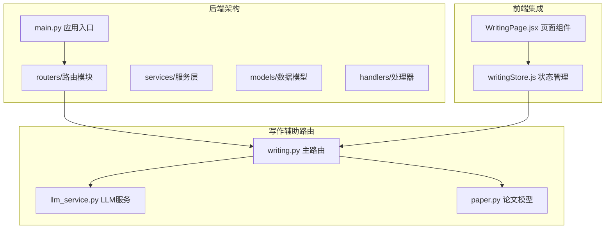
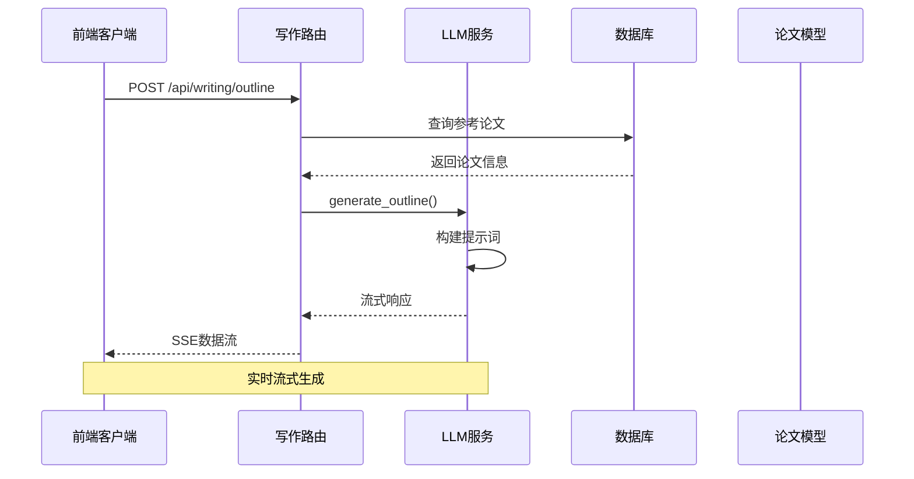
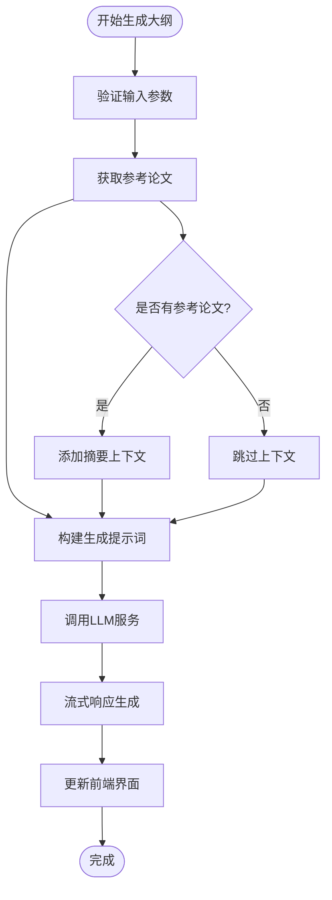
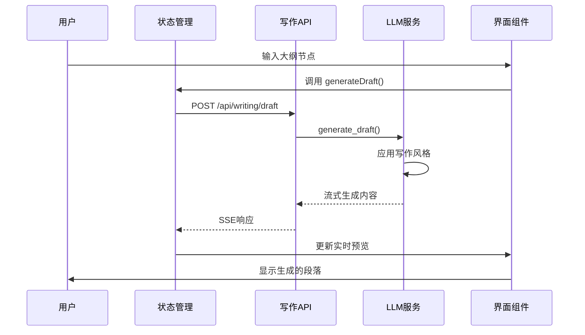
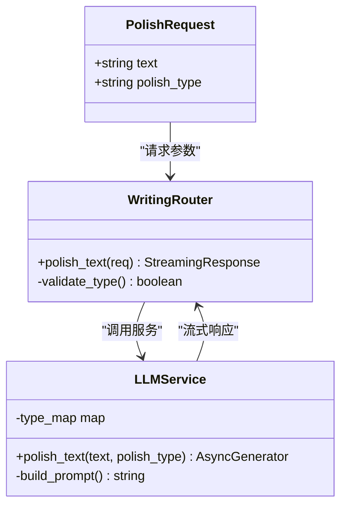
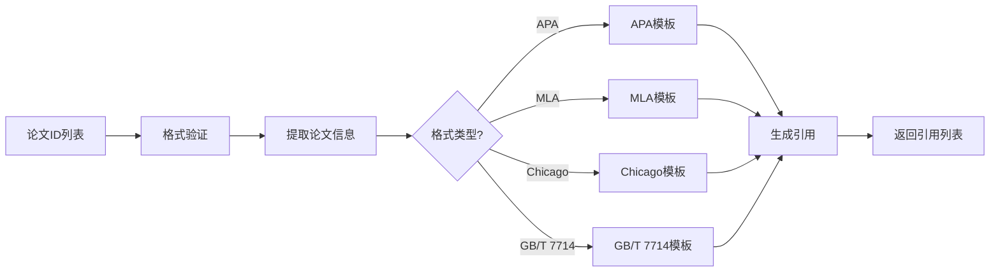
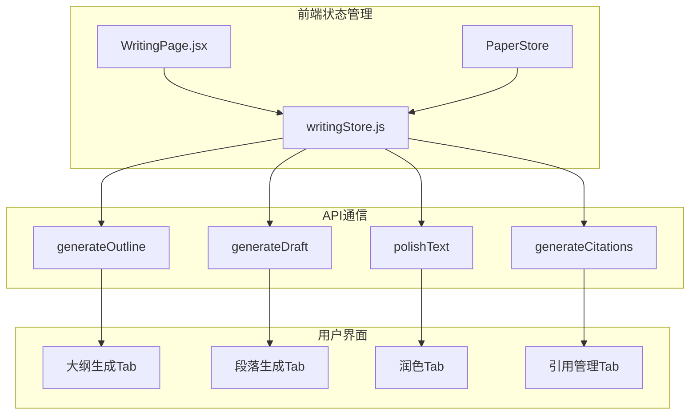
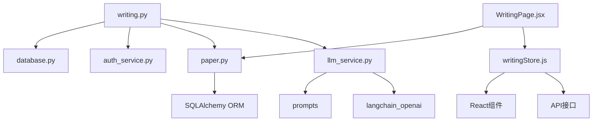

# 写作辅助路由

<cite>
**本文档引用的文件**
- [writing.py](file://backend/app/routers/writing.py)
- [llm_service.py](file://backend/app/services/llm/llm_service.py)
- [llm_service.py](file://backend/app/services/llm_service.py)
- [paper.py](file://backend/app/models/paper.py)
- [paper.py](file://backend/app/schemas/paper.py)
- [writingStore.js](file://frontend/src/stores/writingStore.js)
- [WritingPage.jsx](file://frontend/src/pages/WritingPage.jsx)
- [settings_service.py](file://backend/app/services/settings_service.py)
- [main.py](file://backend/app/main.py)
</cite>

## 目录
1. [简介](#简介)
2. [项目结构](#项目结构)
3. [核心组件](#核心组件)
4. [架构概览](#架构概览)
5. [详细组件分析](#详细组件分析)
6. [依赖分析](#依赖分析)
7. [性能考虑](#性能考虑)
8. [故障排除指南](#故障排除指南)
9. [结论](#结论)

## 简介

写作辅助路由是 PaperChat 学术写作支持系统的核心模块，提供完整的论文写作自动化工具链。该系统集成了大纲生成、段落扩写、学术润色和参考文献管理四大核心功能，通过流式响应机制实现实时写作体验。

系统采用 FastAPI 构建后端 API，结合前端 Zustand 状态管理和 React 组件，为用户提供直观的写作辅助界面。通过 LangChain 集成的 LLM 服务，实现了高质量的文本生成和处理能力。

## 项目结构

写作辅助路由位于后端应用的路由模块中，与论文管理、阅读辅助、知识图谱等功能模块协同工作：

**图表来源**
- [main.py:55-95](file://backend/app/main.py#L55-L95)
- [writing.py:19](file://backend/app/routers/writing.py#L19)

**章节来源**
- [main.py:13-95](file://backend/app/main.py#L13-L95)
- [writing.py:1-287](file://backend/app/routers/writing.py#L1-L287)

## 核心组件

写作辅助路由包含四个主要功能模块，每个模块都有独立的 API 端点和数据模型：

### 大纲生成功能
- **端点**: `/api/writing/outline`
- **输入**: 研究主题、参考论文ID列表、额外要求
- **输出**: 流式生成的论文大纲
- **特点**: 支持参考论文摘要作为上下文，实时显示生成过程

### 段落扩写功能
- **端点**: `/api/writing/draft`
- **输入**: 大纲节点、参考内容、写作风格
- **输出**: 流式生成的段落内容
- **风格**: 学术、正式、简洁三种风格可选

### 学术润色功能
- **端点**: `/api/writing/polish`
- **输入**: 文本内容、润色类型
- **输出**: 流式生成的润色结果
- **类型**: 学术表达、语法修正、流畅性、精简表达

### 引用格式管理
- **端点**: `/api/writing/citations`
- **输入**: 论文ID列表、引用格式
- **输出**: 批量生成的引用列表
- **格式**: APA、MLA、Chicago、GB/T 7714 四种标准格式

**章节来源**
- [writing.py:22-287](file://backend/app/routers/writing.py#L22-L287)

## 架构概览

写作辅助路由采用分层架构设计，确保了良好的可维护性和扩展性：

**图表来源**
- [writing.py:72-108](file://backend/app/routers/writing.py#L72-L108)
- [llm_service.py:474-517](file://backend/app/services/llm/llm_service.py#L474-L517)

系统架构的关键特点：
- **流式响应**: 所有生成操作都支持实时流式输出
- **安全验证**: 通过用户认证和权限检查确保数据安全
- **错误处理**: 完善的异常捕获和错误响应机制
- **格式支持**: 多种引用格式和写作风格的灵活配置

**章节来源**
- [writing.py:1-287](file://backend/app/routers/writing.py#L1-L287)
- [llm_service.py:1-710](file://backend/app/services/llm/llm_service.py#L1-L710)

## 详细组件分析

### 大纲生成功能详解

大纲生成功能是写作辅助的核心模块，支持基于参考论文的智能大纲生成：

**图表来源**
- [writing.py:48-69](file://backend/app/routers/writing.py#L48-L69)
- [writing.py:72-108](file://backend/app/routers/writing.py#L72-L108)

**章节来源**
- [writing.py:48-108](file://backend/app/routers/writing.py#L48-L108)
- [llm_service.py:474-517](file://backend/app/services/llm/llm_service.py#L474-L517)

### 段落扩写工作流程

段落扩写功能提供针对特定大纲节点的详细内容生成：

**图表来源**
- [writingStore.js:99-160](file://frontend/src/stores/writingStore.js#L99-L160)
- [writing.py:111-139](file://backend/app/routers/writing.py#L111-L139)

**章节来源**
- [writing.py:111-139](file://backend/app/routers/writing.py#L111-L139)
- [writingStore.js:99-160](file://frontend/src/stores/writingStore.js#L99-L160)

### 学术润色处理机制

学术润色功能支持多种润色类型的智能文本改进：

**图表来源**
- [writing.py:36-184](file://backend/app/routers/writing.py#L36-L184)
- [llm_service.py:562-597](file://backend/app/services/llm/llm_service.py#L562-L597)

**章节来源**
- [writing.py:142-184](file://backend/app/routers/writing.py#L142-L184)
- [llm_service.py:562-597](file://backend/app/services/llm/llm_service.py#L562-L597)

### 引用格式生成系统

引用格式生成功能支持四种主流学术格式的标准生成：

**图表来源**
- [writing.py:187-262](file://backend/app/routers/writing.py#L187-L262)

**章节来源**
- [writing.py:187-262](file://backend/app/routers/writing.py#L187-L262)

### 前端集成与状态管理

前端通过 Zustand 状态管理实现与后端 API 的无缝集成：

**图表来源**
- [writingStore.js:4-275](file://frontend/src/stores/writingStore.js#L4-L275)
- [WritingPage.jsx:35-800](file://frontend/src/pages/WritingPage.jsx#L35-L800)

**章节来源**
- [writingStore.js:4-275](file://frontend/src/stores/writingStore.js#L4-L275)
- [WritingPage.jsx:35-800](file://frontend/src/pages/WritingPage.jsx#L35-L800)

## 依赖分析

写作辅助路由的依赖关系相对简单，主要依赖于 LLM 服务和数据库模型：

**图表来源**
- [writing.py:5-18](file://backend/app/routers/writing.py#L5-L18)
- [llm_service.py:4-26](file://backend/app/services/llm/llm_service.py#L4-L26)

**章节来源**
- [writing.py:5-18](file://backend/app/routers/writing.py#L5-L18)
- [llm_service.py:4-26](file://backend/app/services/llm/llm_service.py#L4-L26)

## 性能考虑

写作辅助路由在设计时充分考虑了性能优化：

### 流式响应优化
- 所有生成操作都采用流式响应，减少内存占用
- SSE (Server-Sent Events) 实现实时数据传输
- 前端使用流式读取器处理大数据量响应

### 缓存策略
- LLM 服务实例化时启用流式模式
- 配置合理的 token 上限和温度参数
- 支持运行时配置更新，无需重启服务

### 错误处理机制
- 完善的异常捕获和错误响应
- 用户友好的错误信息展示
- 自动重连和状态恢复机制

## 故障排除指南

### 常见问题及解决方案

**API 调用失败**
- 检查网络连接和 API 端点可用性
- 验证用户认证令牌的有效性
- 确认请求格式和参数完整性

**生成内容异常**
- 检查 LLM 服务配置和 API Key 设置
- 验证输入文本长度和格式
- 查看服务日志获取详细错误信息

**前端显示问题**
- 确认浏览器支持 SSE 协议
- 检查 CORS 配置和跨域设置
- 验证状态管理器的数据同步

**章节来源**
- [writing.py:155-161](file://backend/app/routers/writing.py#L155-L161)
- [writingStore.js:93-96](file://frontend/src/stores/writingStore.js#L93-L96)

## 结论

写作辅助路由为学术写作提供了完整的自动化解决方案。通过精心设计的 API 架构、流式响应机制和用户友好的前端界面，系统能够有效提升论文写作效率和质量。

系统的主要优势包括：
- **多功能集成**: 大纲生成、段落扩写、学术润色、引用管理一体化
- **实时响应**: 流式生成提供即时反馈体验
- **灵活配置**: 支持多种写作风格和引用格式
- **安全可靠**: 完善的用户认证和权限控制机制

未来可以考虑的功能扩展：
- 多语言支持和本地化
- 写作质量评估和建议
- 版本对比和协作功能
- 更丰富的模板系统