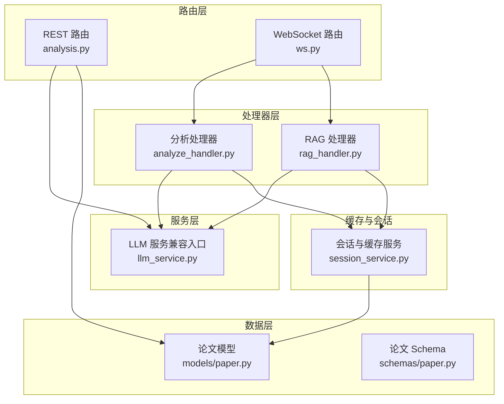
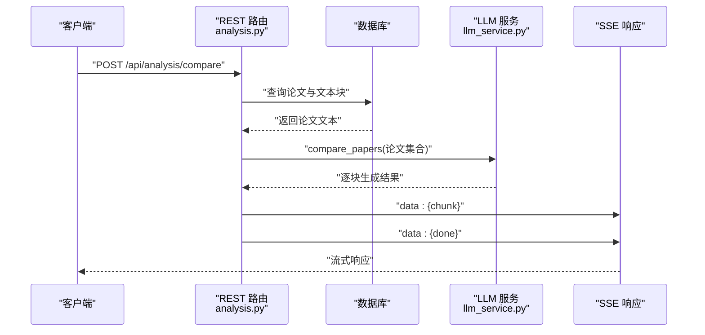
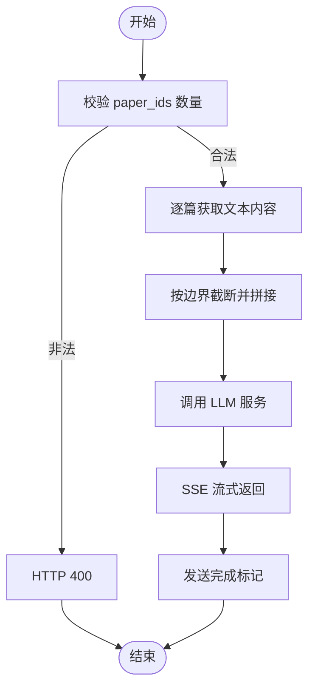
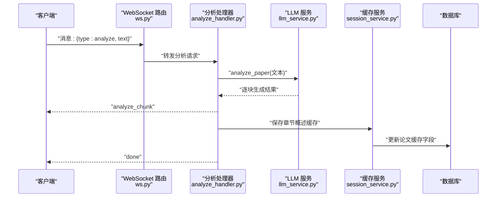
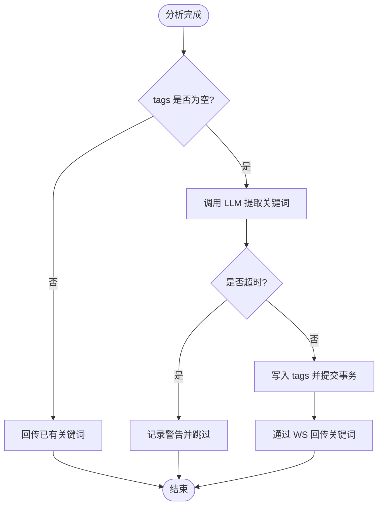
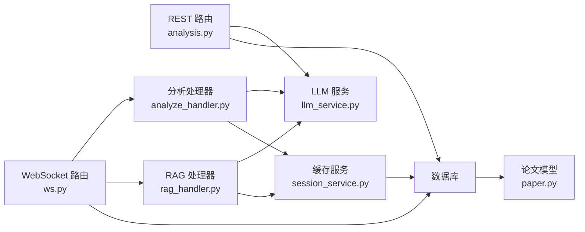

# 分析服务路由

<cite>
**本文档引用的文件**
- [analysis.py](file://backend/app/routers/analysis.py)
- [analyze_handler.py](file://backend/app/handlers/analyze_handler.py)
- [llm_service.py](file://backend/app/services/llm_service.py)
- [paper.py](file://backend/app/models/paper.py)
- [paper.py（schema）](file://backend/app/schemas/paper.py)
- [session_service.py](file://backend/app/services/session_service.py)
- [rag_handler.py](file://backend/app/handlers/rag_handler.py)
- [ws.py](file://backend/app/routers/ws.py)
</cite>

## 目录
1. [简介](#简介)
2. [项目结构](#项目结构)
3. [核心组件](#核心组件)
4. [架构总览](#架构总览)
5. [详细组件分析](#详细组件分析)
6. [依赖关系分析](#依赖关系分析)
7. [性能考量](#性能考量)
8. [故障排查指南](#故障排查指南)
9. [结论](#结论)
10. [附录](#附录)

## 简介
本文件面向“论文智能分析”能力的 API 与 WebSocket 路由，系统性梳理以下能力：
- 结构化解析：章节概述与深度分析的流式输出
- 关键词提取：异步提取并缓存关键词，支持增量更新
- 摘要生成：文献综述与多论文对比分析
- 语义分析：跨文档问答与检索增强生成
- 批量分析与增量更新：基于缓存字段与异步任务
- 缓存策略：章节概述与深度分析的持久化缓存
- 质量评估与可视化：SSE/WS 流式响应、引用来源展示
- 导出与模板：提示词模板与领域特定接口扩展建议

## 项目结构
围绕分析服务的关键模块分布如下：
- 路由层：提供 REST API 与 WebSocket 端点，负责请求校验、限流与流式响应
- 处理器层：封装具体分析流程，协调 LLM 服务与数据库缓存
- 服务层：抽象 LLM 服务与提示词模板，提供统一调用入口
- 模型与 Schema：论文与文本块的数据模型，支撑分析数据源
- 会话与缓存：论文分析缓存字段与异步写入

图表来源
- [analysis.py:1-214](file://backend/app/routers/analysis.py#L1-L214)
- [ws.py:1-436](file://backend/app/routers/ws.py#L1-L436)
- [analyze_handler.py:1-87](file://backend/app/handlers/analyze_handler.py#L1-L87)
- [rag_handler.py:1-234](file://backend/app/handlers/rag_handler.py#L1-L234)
- [llm_service.py:1-53](file://backend/app/services/llm_service.py#L1-L53)
- [paper.py:1-85](file://backend/app/models/paper.py#L1-L85)
- [paper.py（schema）:1-83](file://backend/app/schemas/paper.py#L1-L83)
- [session_service.py:1-111](file://backend/app/services/session_service.py#L1-L111)

章节来源
- [analysis.py:1-214](file://backend/app/routers/analysis.py#L1-L214)
- [ws.py:1-436](file://backend/app/routers/ws.py#L1-L436)
- [analyze_handler.py:1-87](file://backend/app/handlers/analyze_handler.py#L1-L87)
- [rag_handler.py:1-234](file://backend/app/handlers/rag_handler.py#L1-L234)
- [llm_service.py:1-53](file://backend/app/services/llm_service.py#L1-L53)
- [paper.py:1-85](file://backend/app/models/paper.py#L1-L85)
- [paper.py（schema）:1-83](file://backend/app/schemas/paper.py#L1-L83)
- [session_service.py:1-111](file://backend/app/services/session_service.py#L1-L111)

## 核心组件
- REST 分析路由
  - 多论文对比分析：POST /api/analysis/compare，返回 SSE 流
  - 文献综述生成：POST /api/analysis/review，返回 SSE 流
  - 请求体：paper_ids（2-10 篇论文 ID）
  - 文本截断：单篇最大字符数与总上下文上限，按句子边界安全截断
- WebSocket 分析通道
  - 章节概述：analyze 消息类型，流式返回 analyze_chunk
  - 深度分析：deep_analyze 消息类型，流式返回 deep_analyze_chunk
  - 取消任务：cancel 消息类型，取消当前运行中的任务
  - 统一入口：unified_chat，基于关键词意图识别自动路由
- LLM 服务与提示词
  - 提供 analyze、deep_analyze、compare_papers、generate_review 等提示词模板
  - 通过兼容入口统一暴露，便于前端与路由层调用
- 论文模型与缓存
  - 论文中新增 section_analysis、deep_analysis 缓存字段
  - last_analyzed_at 记录最后分析时间
- 关键词提取与增量更新
  - 异步提取关键词并写入 tags 字段（JSON 字符串）
  - 已存在标签时直接回传，避免重复计算

章节来源
- [analysis.py:28-214](file://backend/app/routers/analysis.py#L28-L214)
- [ws.py:76-436](file://backend/app/routers/ws.py#L76-L436)
- [llm_service.py:1-53](file://backend/app/services/llm_service.py#L1-L53)
- [paper.py:11-85](file://backend/app/models/paper.py#L11-L85)
- [session_service.py:42-111](file://backend/app/services/session_service.py#L42-L111)

## 架构总览
整体架构采用“路由层 → 处理器层 → 服务层 → 数据层”的分层设计，结合 SSE 与 WebSocket 实现流式与实时交互。

图表来源
- [analysis.py:88-149](file://backend/app/routers/analysis.py#L88-L149)
- [llm_service.py:1-53](file://backend/app/services/llm_service.py#L1-L53)

章节来源
- [analysis.py:88-149](file://backend/app/routers/analysis.py#L88-L149)
- [llm_service.py:1-53](file://backend/app/services/llm_service.py#L1-L53)

## 详细组件分析

### REST 分析路由（对比与综述）
- 功能职责
  - 对比分析：将多篇论文文本拼接后交由 LLM 进行对比，流式返回 JSON 片段
  - 文献综述：对论文集合生成综述，Markdown 格式流式输出
- 输入参数
  - paper_ids：列表，长度 2-10
- 文本截断策略
  - 单篇最大字符数与总上下文上限，优先在句子边界截断，保留高置信度片段
- 错误处理
  - 非法数量、论文不存在、数据库异常均转换为 HTTP 异常
- 响应格式
  - SSE 流，每行为 data: {...}，包含 chunk 或 done 标记

图表来源
- [analysis.py:88-149](file://backend/app/routers/analysis.py#L88-L149)
- [analysis.py:152-213](file://backend/app/routers/analysis.py#L152-L213)

章节来源
- [analysis.py:88-149](file://backend/app/routers/analysis.py#L88-L149)
- [analysis.py:152-213](file://backend/app/routers/analysis.py#L152-L213)

### WebSocket 分析通道（章节概述与深度分析）
- 消息类型
  - analyze：对完整文本进行章节概述分析，返回 analyze_chunk
  - deep_analyze：对完整文本进行深度分析，返回 deep_analyze_chunk
  - cancel：取消当前运行中的任务
  - unified_chat：基于关键词意图识别自动路由到 analyze/deep_analyze/cross_doc_chat/rag_chat
- 流式响应
  - 分析过程中持续推送片段，完成后发送 done 信号
- 缓存与增量更新
  - 分析完成后异步写入论文缓存字段（章节概述/深度分析），并触发关键词提取任务

图表来源
- [ws.py:120-200](file://backend/app/routers/ws.py#L120-L200)
- [analyze_handler.py:13-49](file://backend/app/handlers/analyze_handler.py#L13-L49)
- [session_service.py:42-52](file://backend/app/services/session_service.py#L42-L52)

章节来源
- [ws.py:120-200](file://backend/app/routers/ws.py#L120-L200)
- [analyze_handler.py:13-49](file://backend/app/handlers/analyze_handler.py#L13-L49)
- [session_service.py:42-52](file://backend/app/services/session_service.py#L42-L52)

### LLM 服务与提示词模板
- 统一入口
  - 通过兼容入口导出 LLMService 实例与多种提示词模板
- 支持的分析场景
  - analyze_paper、deep_analyze_paper、compare_papers、generate_review 等
- 调用方式
  - REST 路由与 WebSocket 处理器均通过该入口调用 LLM

章节来源
- [llm_service.py:1-53](file://backend/app/services/llm_service.py#L1-L53)

### 论文模型与缓存字段
- 新增字段
  - section_analysis：章节概述缓存
  - deep_analysis：深度分析缓存
  - analysis_status：not_generated/completed/failed
  - last_analyzed_at：最后分析时间
- 作用
  - 支撑增量更新与结果复用，减少重复计算

章节来源
- [paper.py:11-85](file://backend/app/models/paper.py#L11-L85)

### 关键词提取与增量更新
- 触发时机
  - 分析完成后异步提取关键词，并写入 tags 字段
- 限制与保护
  - 仅在 tags 为空时提取；设置超时保护；独立数据库会话避免阻塞主流程
- 回传机制
  - 通过 WebSocket 回传关键词结果，支持前端即时展示

图表来源
- [session_service.py:68-111](file://backend/app/services/session_service.py#L68-L111)
- [rag_handler.py:20-26](file://backend/app/handlers/rag_handler.py#L20-L26)

章节来源
- [session_service.py:68-111](file://backend/app/services/session_service.py#L68-L111)
- [rag_handler.py:20-26](file://backend/app/handlers/rag_handler.py#L20-L26)

## 依赖关系分析
- 路由层依赖
  - REST 路由依赖数据库查询与 LLM 服务，返回 SSE
  - WebSocket 路由依赖处理器与 LLM 服务，返回流式消息
- 处理器依赖
  - 分析处理器依赖 LLM 服务与缓存服务
  - RAG 处理器依赖检索服务、消息服务与 LLM 服务
- 服务层依赖
  - LLM 服务通过兼容入口暴露统一接口
- 数据层依赖
  - 论文模型提供缓存字段与文本块查询

图表来源
- [analysis.py:1-214](file://backend/app/routers/analysis.py#L1-L214)
- [ws.py:1-436](file://backend/app/routers/ws.py#L1-L436)
- [analyze_handler.py:1-87](file://backend/app/handlers/analyze_handler.py#L1-L87)
- [rag_handler.py:1-234](file://backend/app/handlers/rag_handler.py#L1-L234)
- [llm_service.py:1-53](file://backend/app/services/llm_service.py#L1-L53)
- [session_service.py:1-111](file://backend/app/services/session_service.py#L1-L111)
- [paper.py:1-85](file://backend/app/models/paper.py#L1-L85)

章节来源
- [analysis.py:1-214](file://backend/app/routers/analysis.py#L1-L214)
- [ws.py:1-436](file://backend/app/routers/ws.py#L1-L436)
- [analyze_handler.py:1-87](file://backend/app/handlers/analyze_handler.py#L1-L87)
- [rag_handler.py:1-234](file://backend/app/handlers/rag_handler.py#L1-L234)
- [llm_service.py:1-53](file://backend/app/services/llm_service.py#L1-L53)
- [session_service.py:1-111](file://backend/app/services/session_service.py#L1-L111)
- [paper.py:1-85](file://backend/app/models/paper.py#L1-L85)

## 性能考量
- 文本截断与上下文控制
  - 单篇与总上下文长度限制，避免 LLM 上下文溢出
  - 按句子边界截断，保证语义完整性
- 流式输出
  - SSE/WS 流式响应降低首屏延迟，提升用户体验
- 异步与并发
  - 关键词提取与缓存写入使用独立会话与异步任务，避免阻塞主流程
- 缓存复用
  - 利用论文缓存字段减少重复分析成本

## 故障排查指南
- REST 路由常见错误
  - HTTP 400：paper_ids 数量不在允许范围内
  - HTTP 404：论文不存在或无权限访问
  - HTTP 500：数据库查询或 LLM 调用异常
- WebSocket 常见问题
  - 未提供有效 token：连接被拒绝
  - 消息类型不支持：返回 error 消息
  - 分析内容过短：提示需要更完整的文本
  - 任务冲突：同一类型任务并发时会取消旧任务
- 缓存与关键词
  - 关键词提取超时：检查 LLM 服务可用性与网络延迟
  - 标签未更新：确认论文 tags 字段为空且文本长度足够

章节来源
- [analysis.py:103-127](file://backend/app/routers/analysis.py#L103-L127)
- [analysis.py:167-191](file://backend/app/routers/analysis.py#L167-L191)
- [ws.py:103-107](file://backend/app/routers/ws.py#L103-L107)
- [ws.py:123-128](file://backend/app/routers/ws.py#L123-L128)
- [ws.py:167-172](file://backend/app/routers/ws.py#L167-L172)
- [session_service.py:107-111](file://backend/app/services/session_service.py#L107-L111)

## 结论
本分析服务路由以“REST SSE + WebSocket 实时流”为核心，结合 LLM 提示词模板与论文缓存字段，实现了从结构化解析、关键词提取到多论文对比与文献综述的全链路能力。通过异步任务与上下文截断策略，兼顾了性能与稳定性；通过统一的 LLM 服务入口，便于扩展与维护。

## 附录

### API 定义概览
- REST 路由
  - POST /api/analysis/compare
    - 请求体：paper_ids（列表，2-10）
    - 响应：SSE 流，逐行 data: {"chunk": "..."}，最后 data: {"done": true}
  - POST /api/analysis/review
    - 请求体：paper_ids（列表，2-10）
    - 响应：SSE 流，Markdown 格式片段
- WebSocket 路由
  - 消息类型：analyze、deep_analyze、cancel、unified_chat
  - 响应类型：analyze_chunk、deep_analyze_chunk、done、error、intent_detected

章节来源
- [analysis.py:88-149](file://backend/app/routers/analysis.py#L88-L149)
- [analysis.py:152-213](file://backend/app/routers/analysis.py#L152-L213)
- [ws.py:76-436](file://backend/app/routers/ws.py#L76-L436)

### 数据模型要点
- 论文模型新增缓存字段与状态字段，支撑增量分析与结果复用
- 文本块模型存储 PDF 解析后的文本与位置信息，为检索与引用提供基础

章节来源
- [paper.py:11-85](file://backend/app/models/paper.py#L11-L85)