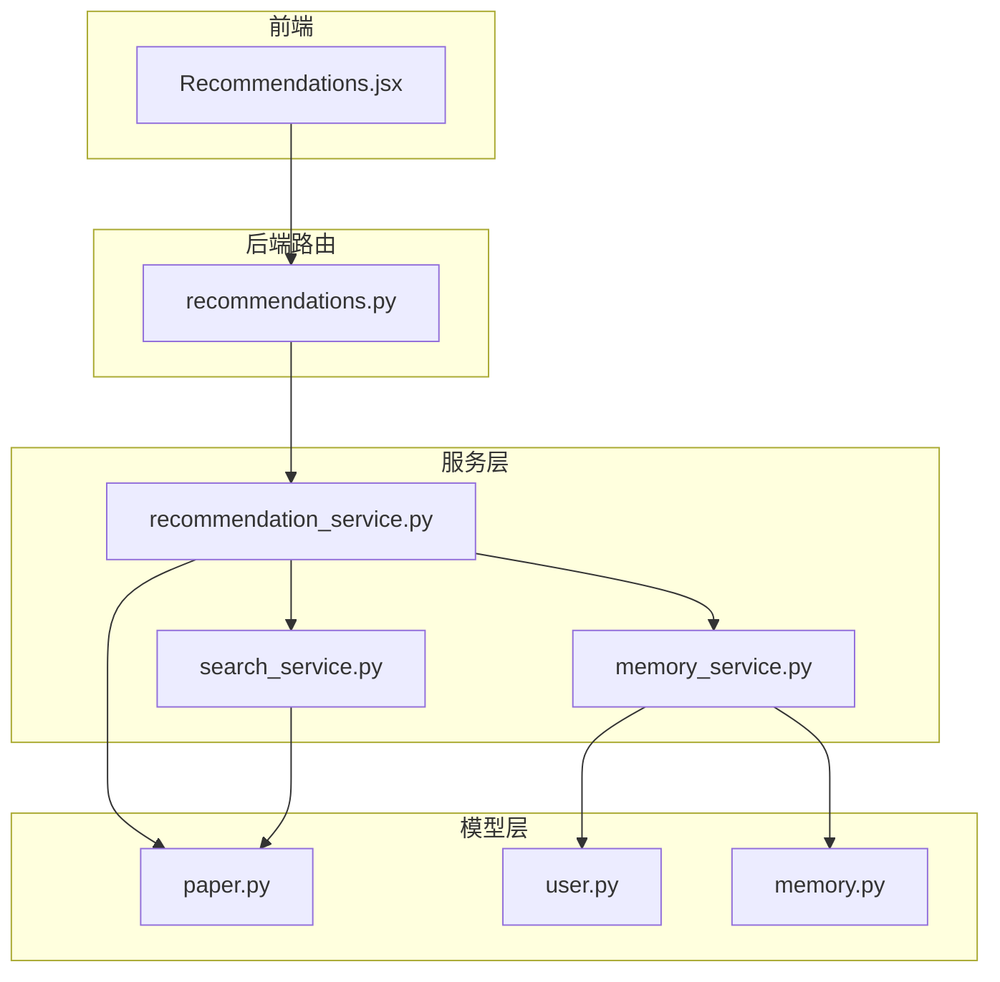
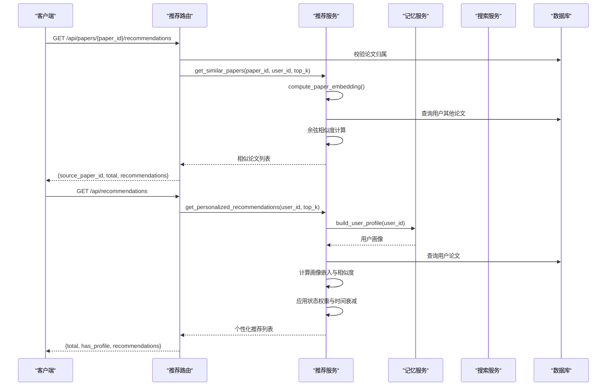
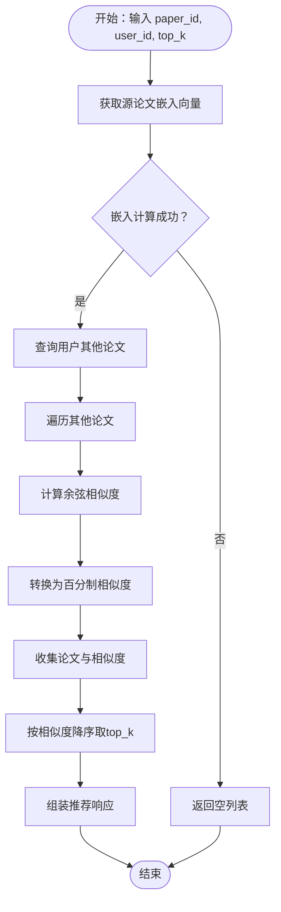
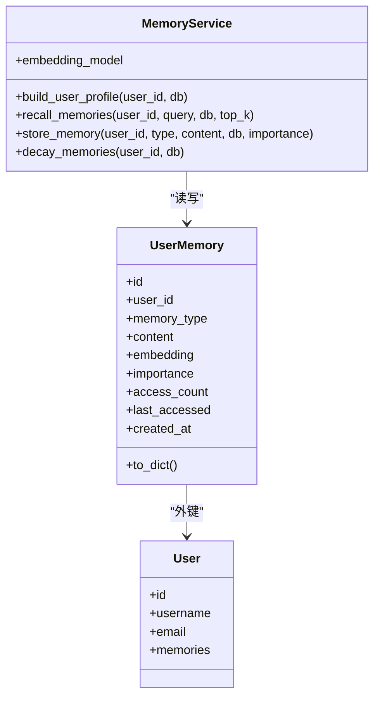
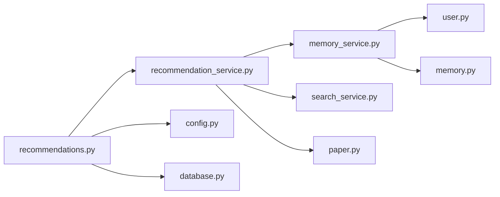

# 推荐系统路由

<cite>
**本文档引用的文件**
- [recommendations.py](file://backend/app/routers/recommendations.py)
- [recommendation_service.py](file://backend/app/services/recommendation_service.py)
- [memory_service.py](file://backend/app/services/memory_service.py)
- [search_service.py](file://backend/app/services/search_service.py)
- [paper.py](file://backend/app/models/paper.py)
- [user.py](file://backend/app/models/user.py)
- [memory.py](file://backend/app/models/memory.py)
- [feedback.py](file://backend/app/routers/feedback.py)
- [config.py](file://backend/app/config.py)
- [database.py](file://backend/app/database.py)
- [Recommendations.jsx](file://frontend/src/components/Recommendations/Recommendations.jsx)
</cite>

## 目录
1. [简介](#简介)
2. [项目结构](#项目结构)
3. [核心组件](#核心组件)
4. [架构总览](#架构总览)
5. [详细组件分析](#详细组件分析)
6. [依赖关系分析](#依赖关系分析)
7. [性能考虑](#性能考虑)
8. [故障排查指南](#故障排查指南)
9. [结论](#结论)
10. [附录](#附录)

## 简介
本文件面向推荐系统路由的实现，围绕论文推荐算法的 API 设计进行深入解析，涵盖基于内容相似度的协同过滤、基于用户画像的个性化推荐、以及网络学术搜索的混合推荐接口。文档同时阐述用户画像构建、兴趣建模与推荐结果排序机制，给出实时推荐与离线计算的策略建议，以及冷启动处理、推荐多样性控制与公平性保障方案。此外，还提供了推荐质量评估指标、A/B 测试接口设计思路与用户反馈收集机制。

## 项目结构
推荐系统路由位于后端 FastAPI 应用中，采用“路由层-服务层-模型层”的分层架构：
- 路由层：提供 RESTful 接口，负责参数校验、鉴权与响应封装
- 服务层：实现推荐算法与数据处理逻辑，包括嵌入计算、相似度计算、画像构建与网络搜索
- 模型层：定义论文、用户、记忆等实体及关系
- 前端组件：渲染推荐卡片、展示相似度与匹配原因，并支持网络学术搜索

图表来源
- [recommendations.py:1-234](file://backend/app/routers/recommendations.py#L1-L234)
- [recommendation_service.py:1-565](file://backend/app/services/recommendation_service.py#L1-L565)
- [memory_service.py:1-438](file://backend/app/services/memory_service.py#L1-L438)
- [search_service.py:1-113](file://backend/app/services/search_service.py#L1-L113)
- [paper.py:1-85](file://backend/app/models/paper.py#L1-L85)
- [user.py:1-36](file://backend/app/models/user.py#L1-L36)
- [memory.py:1-54](file://backend/app/models/memory.py#L1-L54)

章节来源
- [recommendations.py:1-234](file://backend/app/routers/recommendations.py#L1-L234)
- [recommendation_service.py:1-565](file://backend/app/services/recommendation_service.py#L1-L565)
- [memory_service.py:1-438](file://backend/app/services/memory_service.py#L1-L438)
- [search_service.py:1-113](file://backend/app/services/search_service.py#L1-L113)
- [paper.py:1-85](file://backend/app/models/paper.py#L1-L85)
- [user.py:1-36](file://backend/app/models/user.py#L1-L36)
- [memory.py:1-54](file://backend/app/models/memory.py#L1-L54)

## 核心组件
- 推荐路由模块：提供相似论文推荐、个性化推荐、刷新缓存、网络学术搜索等接口
- 推荐服务模块：实现内容相似度计算、用户画像驱动的个性化推荐、嵌入缓存与网络搜索集成
- 记忆服务模块：构建用户画像（研究兴趣、偏好、术语使用、背景），提供向量嵌入与相似度计算
- 搜索服务模块：基于 DuckDuckGo 的网络搜索，带缓存与超时控制
- 模型定义：论文、用户、记忆等实体，支撑推荐与画像的数据结构

章节来源
- [recommendations.py:18-234](file://backend/app/routers/recommendations.py#L18-L234)
- [recommendation_service.py:20-565](file://backend/app/services/recommendation_service.py#L20-L565)
- [memory_service.py:46-438](file://backend/app/services/memory_service.py#L46-L438)
- [search_service.py:10-113](file://backend/app/services/search_service.py#L10-L113)
- [paper.py:11-85](file://backend/app/models/paper.py#L11-L85)
- [user.py:11-36](file://backend/app/models/user.py#L11-L36)
- [memory.py:14-54](file://backend/app/models/memory.py#L14-L54)

## 架构总览
推荐系统采用“内容相似度 + 用户画像 + 网络搜索”的混合策略：
- 内容相似度：基于论文嵌入向量的余弦相似度，实现协同过滤式的论文推荐
- 用户画像：通过记忆服务聚合用户记忆，构建研究兴趣、偏好等画像特征
- 网络搜索：针对特定论文标题进行学术网站搜索，提供外部链接与来源分类
- 排序机制：综合相似度、阅读状态权重与时间衰减因子，生成最终推荐分数

图表来源
- [recommendations.py:18-118](file://backend/app/routers/recommendations.py#L18-L118)
- [recommendation_service.py:150-399](file://backend/app/services/recommendation_service.py#L150-L399)
- [memory_service.py:312-357](file://backend/app/services/memory_service.py#L312-L357)

## 详细组件分析

### 推荐路由 API 设计
- 相似论文推荐
  - 路径：GET /api/papers/{paper_id}/recommendations
  - 参数：top_k（默认5，范围1-20）
  - 行为：基于内容相似度返回与当前论文最相似的论文列表
  - 性能：首次嵌入计算约100-200ms/篇，结果缓存；100篇论文相似度计算约200ms
- 个性化论文推荐
  - 路径：GET /api/recommendations
  - 参数：top_k（默认5，范围1-20）
  - 行为：基于用户画像与阅读历史，优先推荐未读/阅读中的论文
  - 性能：依赖用户画像构建（约300ms）、嵌入计算（100-200ms/篇）、无画像时返回最近上传论文
- 刷新论文推荐缓存
  - 路径：POST /api/papers/{paper_id}/recommendations/refresh
  - 行为：清除缓存并重新计算嵌入，适用于论文内容更新后
- 网络学术推荐
  - 路径：GET /api/papers/{paper_id}/web-recommendations
  - 参数：max_results（默认8，范围1-20）
  - 行为：基于论文标题在arXiv、Google Scholar等学术网站搜索相关文献
  - 性能：网络搜索约3-5秒延迟，结果缓存优化重复查询

章节来源
- [recommendations.py:18-234](file://backend/app/routers/recommendations.py#L18-L234)

### 推荐服务实现模式
- 嵌入向量缓存：内存级缓存，支持按论文ID清理或全量清理
- 文本预处理：组合标题、作者、摘要与前N个文本块，限制最大长度
- 余弦相似度：向量归一化后点积，输出0-100的百分制相似度
- 个性化排序：相似度×阅读状态权重×时间衰减因子，阅读状态权重未读>阅读中>已完成
- 网络搜索：构造学术查询（限定arXiv、Google Scholar、ResearchGate、Semantic Scholar），按最近一年筛选

图表来源
- [recommendation_service.py:150-258](file://backend/app/services/recommendation_service.py#L150-L258)

章节来源
- [recommendation_service.py:20-565](file://backend/app/services/recommendation_service.py#L20-L565)

### 用户画像构建与兴趣建模
- 画像来源：研究兴趣、偏好、术语使用、背景等记忆类型
- 构建流程：聚合用户记忆，生成画像文本，向量化后与论文嵌入计算相似度
- 冷启动策略：若无记忆，返回最近上传论文作为备选
- 记忆衰减：超过90天未访问的记忆重要性降低10%，保持画像新鲜度

图表来源
- [memory_service.py:46-438](file://backend/app/services/memory_service.py#L46-L438)
- [memory.py:14-54](file://backend/app/models/memory.py#L14-L54)
- [user.py:11-36](file://backend/app/models/user.py#L11-L36)

章节来源
- [memory_service.py:312-357](file://backend/app/services/memory_service.py#L312-L357)
- [memory_service.py:358-408](file://backend/app/services/memory_service.py#L358-L408)
- [memory.py:14-54](file://backend/app/models/memory.py#L14-L54)
- [user.py:11-36](file://backend/app/models/user.py#L11-L36)

### 推荐结果排序机制
- 相似度分数：余弦相似度映射为0-100的百分制
- 阅读状态权重：未读1.2、阅读中1.1、已完成0.8
- 时间衰减因子：论文创建时间越近权重越高，一年内从1.0衰减至0.8
- 最终分数：相似度×状态权重×时间衰减，按最终分数降序排列

章节来源
- [recommendation_service.py:259-399](file://backend/app/services/recommendation_service.py#L259-L399)

### 实时推荐与离线计算策略
- 实时推荐：基于当前请求动态计算嵌入与相似度，适合交互场景
- 离线计算：可定期批量计算论文嵌入与相似度矩阵，缓存结果供实时查询使用
- 缓存策略：论文嵌入缓存、网络搜索结果缓存，支持按ID清理与全量清理

章节来源
- [recommendation_service.py:487-497](file://backend/app/services/recommendation_service.py#L487-L497)
- [search_service.py:19-109](file://backend/app/services/search_service.py#L19-L109)

### 冷启动处理策略
- 无用户画像：返回最近上传的论文，作为冷启动备选
- 无论文数据：返回空列表或提示用户先上传论文
- 无嵌入数据：尝试重新计算嵌入，若内容不足则提示

章节来源
- [recommendation_service.py:285-287](file://backend/app/services/recommendation_service.py#L285-L287)
- [recommendation_service.py:401-458](file://backend/app/services/recommendation_service.py#L401-L458)

### 混合推荐接口设计
- 内容相似度推荐：基于论文嵌入的协同过滤
- 个性化推荐：基于用户画像与阅读状态
- 网络学术搜索：基于论文标题的外部学术资源检索
- 接口组合：前端可同时展示三类推荐，形成混合体验

章节来源
- [recommendations.py:18-234](file://backend/app/routers/recommendations.py#L18-L234)
- [recommendation_service.py:498-560](file://backend/app/services/recommendation_service.py#L498-L560)

### 前端展示与交互
- 推荐卡片：展示标题、作者、摘要预览、页数、类别、阅读状态与相似度/匹配原因
- 网络学术推荐区域：支持一键搜索arXiv、Google Scholar等学术网站
- 交互行为：点击卡片跳转阅读器，支持刷新推荐与折叠/展开

章节来源
- [Recommendations.jsx:1-265](file://frontend/src/components/Recommendations/Recommendations.jsx#L1-L265)

## 依赖关系分析
- 路由依赖：FastAPI 路由装饰器、数据库会话依赖注入、用户鉴权依赖
- 服务依赖：SQLAlchemy 异步会话、NumPy 向量运算、SentenceTransformer 嵌入模型、DuckDuckGo 搜索
- 模型依赖：论文、用户、记忆实体，定义关系与索引
- 配置依赖：HuggingFace 镜像与缓存路径、数据库URL、DeepSeek API密钥等

图表来源
- [recommendations.py:1-234](file://backend/app/routers/recommendations.py#L1-L234)
- [recommendation_service.py:1-565](file://backend/app/services/recommendation_service.py#L1-L565)
- [memory_service.py:1-438](file://backend/app/services/memory_service.py#L1-L438)
- [search_service.py:1-113](file://backend/app/services/search_service.py#L1-L113)
- [paper.py:1-85](file://backend/app/models/paper.py#L1-L85)
- [user.py:1-36](file://backend/app/models/user.py#L1-L36)
- [memory.py:1-54](file://backend/app/models/memory.py#L1-L54)
- [config.py:15-44](file://backend/app/config.py#L15-L44)
- [database.py:13-81](file://backend/app/database.py#L13-L81)

章节来源
- [recommendations.py:1-234](file://backend/app/routers/recommendations.py#L1-L234)
- [recommendation_service.py:1-565](file://backend/app/services/recommendation_service.py#L1-L565)
- [memory_service.py:1-438](file://backend/app/services/memory_service.py#L1-L438)
- [search_service.py:1-113](file://backend/app/services/search_service.py#L1-L113)
- [paper.py:1-85](file://backend/app/models/paper.py#L1-L85)
- [user.py:1-36](file://backend/app/models/user.py#L1-L36)
- [memory.py:1-54](file://backend/app/models/memory.py#L1-L54)
- [config.py:15-44](file://backend/app/config.py#L15-L44)
- [database.py:13-81](file://backend/app/database.py#L13-L81)

## 性能考虑
- 嵌入计算：首次计算耗时约100-200ms/篇，建议启用缓存；可通过刷新接口强制重建
- 相似度计算：100篇论文的相似度计算约200ms，适合小规模实时查询
- 用户画像：构建约300ms，结合嵌入计算；无画像时直接返回最近论文
- 网络搜索：单次约3-5秒，结果缓存；超时控制15秒
- 并发与线程池：嵌入模型与搜索均使用线程池执行阻塞操作，避免阻塞事件循环
- 数据库连接：异步会话工厂，自动提交/回滚，减少连接开销

章节来源
- [recommendations.py:41-100](file://backend/app/routers/recommendations.py#L41-L100)
- [recommendations.py:202-205](file://backend/app/routers/recommendations.py#L202-L205)
- [recommendation_service.py:89-128](file://backend/app/services/recommendation_service.py#L89-L128)
- [search_service.py:68-103](file://backend/app/services/search_service.py#L68-L103)

## 故障排查指南
- 论文不存在或无权限：路由层返回404错误，需确认paper_id与当前用户绑定
- 嵌入计算失败：检查论文内容长度（需≥50字符），必要时调用刷新缓存接口
- 无用户画像：个性化推荐返回最近论文；可在对话中引导用户提供研究兴趣等信息
- 网络搜索异常：检查网络连通性与超时设置，查看日志输出
- 记忆存储冲突：相似度>0.85的重复记忆将不创建新记录，仅更新访问时间与重要性

章节来源
- [recommendations.py:57-61](file://backend/app/routers/recommendations.py#L57-L61)
- [recommendations.py:150-154](file://backend/app/routers/recommendations.py#L150-L154)
- [recommendation_service.py:108-109](file://backend/app/services/recommendation_service.py#L108-L109)
- [memory_service.py:189-201](file://backend/app/services/memory_service.py#L189-L201)

## 结论
该推荐系统路由实现了内容相似度与用户画像相结合的混合推荐方案，具备良好的扩展性与性能表现。通过嵌入缓存、时间衰减与阅读状态权重，系统能够提供贴近用户需求的个性化推荐；通过网络学术搜索，进一步丰富推荐来源。建议在生产环境中引入离线批处理与A/B测试框架，持续优化推荐质量与多样性控制。

## 附录

### 推荐质量评估指标
- 点击率（CTR）：推荐被点击的比例
- 偏好一致性：相似度与用户实际偏好的一致程度
- 多样性：推荐集合的覆盖广度与新颖性
- 公平性：不同论文/作者/机构的曝光均衡性
- 时效性：推荐内容与用户近期兴趣的匹配度

### A/B 测试接口设计思路
- 推荐算法开关：通过配置项切换内容相似度、个性化或混合策略
- 推荐数量调节：动态调整top_k，观察用户行为变化
- 排序因子实验：调整阅读状态权重与时间衰减因子，对比效果
- 缓存策略对比：开启/关闭缓存，评估性能与一致性

### 用户反馈收集机制
- 反馈路由：提供点赞/点踩与文字反馈接口，支持统计与历史查询
- 负面反馈重跑：基于记忆与RAG重新生成回答，提升用户体验
- 记忆学习：差评自动记录到记忆中，用于改进偏好建模

章节来源
- [feedback.py:50-135](file://backend/app/routers/feedback.py#L50-L135)
- [feedback.py:138-170](file://backend/app/routers/feedback.py#L138-L170)
- [feedback.py:205-362](file://backend/app/routers/feedback.py#L205-L362)
- [memory_service.py:117-128](file://backend/app/services/memory_service.py#L117-L128)