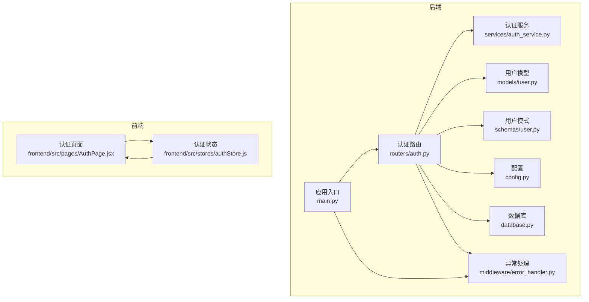
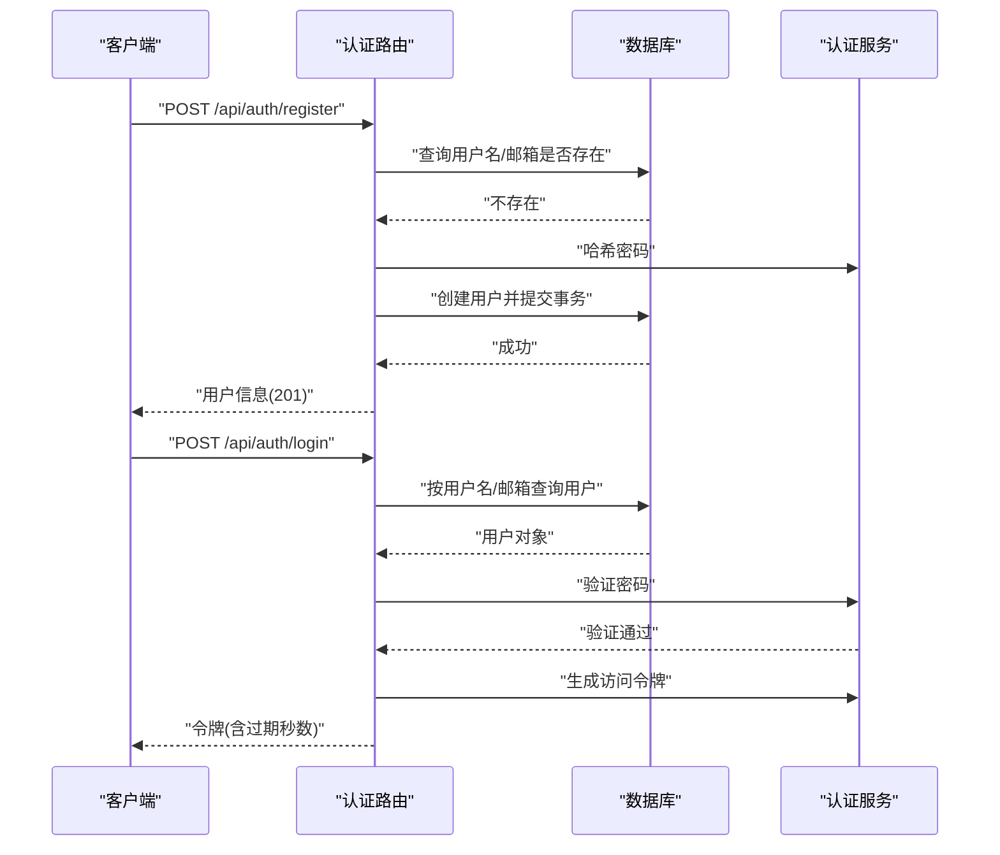
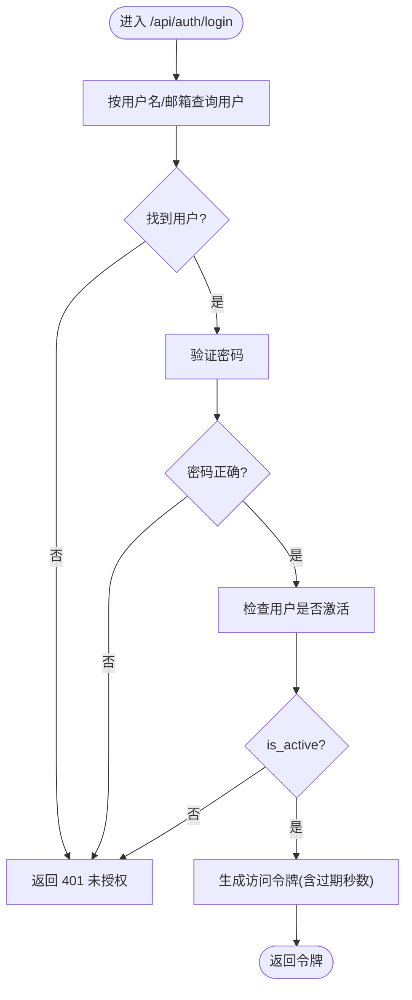
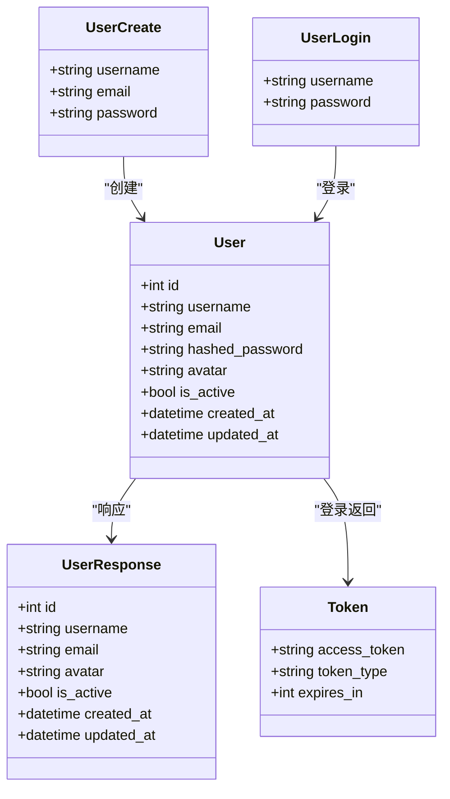
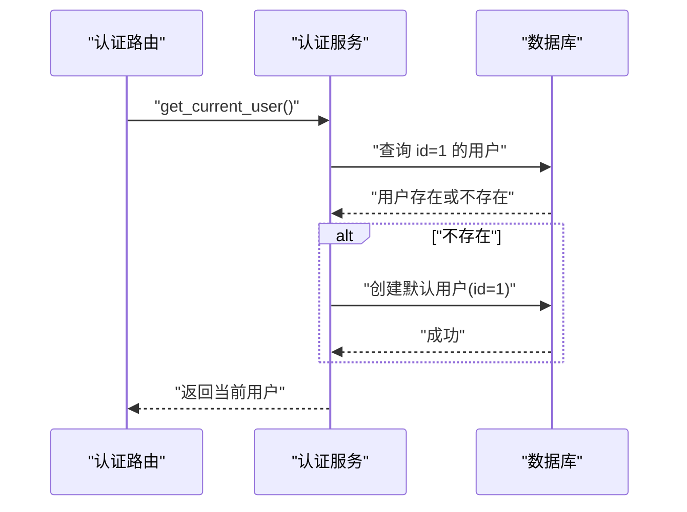
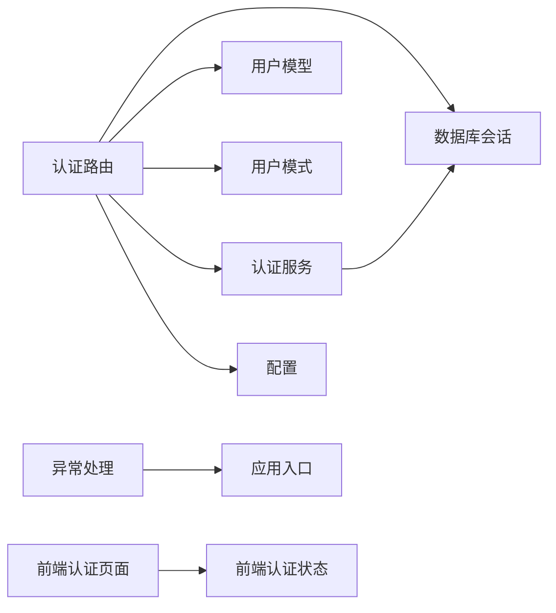

# 用户认证路由

<cite>
**本文档引用的文件**
- [backend/app/routers/auth.py](file://backend/app/routers/auth.py)
- [backend/app/schemas/user.py](file://backend/app/schemas/user.py)
- [backend/app/models/user.py](file://backend/app/models/user.py)
- [backend/app/services/auth_service.py](file://backend/app/services/auth_service.py)
- [backend/app/config.py](file://backend/app/config.py)
- [backend/app/middleware/error_handler.py](file://backend/app/middleware/error_handler.py)
- [backend/app/database.py](file://backend/app/database.py)
- [backend/app/main.py](file://backend/app/main.py)
- [frontend/src/pages/AuthPage.jsx](file://frontend/src/pages/AuthPage.jsx)
- [frontend/src/stores/authStore.js](file://frontend/src/stores/authStore.js)
</cite>

## 目录
1. [简介](#简介)
2. [项目结构](#项目结构)
3. [核心组件](#核心组件)
4. [架构总览](#架构总览)
5. [详细组件分析](#详细组件分析)
6. [依赖关系分析](#依赖关系分析)
7. [性能考虑](#性能考虑)
8. [故障排除指南](#故障排除指南)
9. [结论](#结论)
10. [附录](#附录)

## 简介
本文件聚焦于后端用户认证路由的设计与实现，覆盖用户注册、登录、登出、当前用户信息查询与更新等接口；同时阐述 JWT 令牌管理、会话控制与多设备同步机制现状，以及角色权限、访问控制与安全审计的扩展建议。文档还提供了密码策略、验证码系统与第三方登录集成的落地思路，并总结了安全防护、防暴力破解与异常检测的实践要点。

## 项目结构
后端采用 FastAPI + SQLAlchemy Async 架构，认证相关模块分布如下：
- 路由层：集中于认证路由，提供注册、登录、登出、当前用户信息查询与更新接口
- 模型层：用户模型定义及数据库字段约束
- 模式层：Pydantic 模型用于请求/响应数据校验与序列化
- 服务层：认证服务负责当前用户解析与默认用户逻辑
- 中间件：全局异常处理，统一错误响应格式
- 配置：JWT 密钥、算法与过期时间等安全配置
- 前端：认证页面与状态管理，当前实现为“个人使用模式”无需登录

图表来源
- [backend/app/routers/auth.py:1-186](file://backend/app/routers/auth.py#L1-L186)
- [backend/app/services/auth_service.py:1-40](file://backend/app/services/auth_service.py#L1-L40)
- [backend/app/models/user.py:1-36](file://backend/app/models/user.py#L1-L36)
- [backend/app/schemas/user.py:1-42](file://backend/app/schemas/user.py#L1-L42)
- [backend/app/config.py:1-44](file://backend/app/config.py#L1-L44)
- [backend/app/database.py:1-81](file://backend/app/database.py#L1-L81)
- [backend/app/middleware/error_handler.py:1-92](file://backend/app/middleware/error_handler.py#L1-L92)
- [backend/app/main.py:1-114](file://backend/app/main.py#L1-L114)
- [frontend/src/pages/AuthPage.jsx:1-245](file://frontend/src/pages/AuthPage.jsx#L1-L245)
- [frontend/src/stores/authStore.js:1-23](file://frontend/src/stores/authStore.js#L1-L23)

章节来源
- [backend/app/routers/auth.py:1-186](file://backend/app/routers/auth.py#L1-L186)
- [backend/app/main.py:1-114](file://backend/app/main.py#L1-L114)

## 核心组件
- 认证路由：提供注册、登录、登出、当前用户信息查询与更新接口，均通过依赖注入获取数据库会话与当前用户
- 用户模型：定义用户表结构、唯一索引与关系，包含活跃状态字段
- 用户模式：注册/登录/响应/令牌的 Pydantic 模型，内置字段长度与格式约束
- 认证服务：解析当前用户，默认用户逻辑（个人使用模式），以及后续可扩展的权限与审计能力
- 配置：JWT 密钥、算法与过期时间等安全参数
- 异常处理：统一返回标准化错误响应，便于前端展示与调试

章节来源
- [backend/app/routers/auth.py:27-186](file://backend/app/routers/auth.py#L27-L186)
- [backend/app/models/user.py:11-36](file://backend/app/models/user.py#L11-L36)
- [backend/app/schemas/user.py:8-42](file://backend/app/schemas/user.py#L8-L42)
- [backend/app/services/auth_service.py:13-40](file://backend/app/services/auth_service.py#L13-L40)
- [backend/app/config.py:28-31](file://backend/app/config.py#L28-L31)
- [backend/app/middleware/error_handler.py:11-91](file://backend/app/middleware/error_handler.py#L11-L91)

## 架构总览
认证流程围绕 JWT 令牌展开：注册时对密码进行哈希存储；登录时根据用户名或邮箱查找用户并验证密码，生成访问令牌；当前用户信息查询与更新接口依赖当前用户依赖注入；登出接口为无状态设计，客户端删除令牌即可。

图表来源
- [backend/app/routers/auth.py:27-118](file://backend/app/routers/auth.py#L27-L118)
- [backend/app/services/auth_service.py:13-40](file://backend/app/services/auth_service.py#L13-L40)
- [backend/app/database.py:30-47](file://backend/app/database.py#L30-L47)

## 详细组件分析

### 认证路由组件
- 注册接口
  - 输入：用户名、邮箱、密码
  - 校验：用户名与邮箱唯一性
  - 处理：密码哈希、创建用户并提交
  - 输出：用户信息（201）
- 登录接口
  - 输入：用户名或邮箱、密码
  - 校验：用户存在且密码正确，用户处于激活状态
  - 处理：生成访问令牌（含过期秒数）
  - 输出：令牌模型
- 登出接口
  - 说明：JWT 为无状态，登出即客户端删除令牌；如需黑名单需额外存储机制
- 当前用户信息查询接口
  - 说明：依赖当前用户依赖注入，返回当前用户信息
- 当前用户信息更新接口
  - 输入：头像 URL（可选）、邮箱（可选）
  - 校验：邮箱唯一性（排除自身）
  - 处理：更新并提交

图表来源
- [backend/app/routers/auth.py:71-118](file://backend/app/routers/auth.py#L71-L118)

章节来源
- [backend/app/routers/auth.py:27-186](file://backend/app/routers/auth.py#L27-L186)

### 用户模型与模式
- 用户模型
  - 字段：自增主键、唯一用户名与邮箱、哈希密码、头像、活跃状态、创建/更新时间戳
  - 关系：与论文、高亮、笔记、聊天会话、记忆、反馈、知识卡片等关联
- 用户模式
  - 注册：用户名、邮箱、密码（长度约束）
  - 登录：用户名、密码
  - 响应：包含 id、头像、活跃状态、创建/更新时间
  - 令牌：访问令牌、类型、过期秒数

图表来源
- [backend/app/models/user.py:11-36](file://backend/app/models/user.py#L11-L36)
- [backend/app/schemas/user.py:8-42](file://backend/app/schemas/user.py#L8-L42)

章节来源
- [backend/app/models/user.py:11-36](file://backend/app/models/user.py#L11-L36)
- [backend/app/schemas/user.py:8-42](file://backend/app/schemas/user.py#L8-L42)

### 认证服务与当前用户
- 默认用户逻辑
  - 在个人使用模式下，系统自动确保默认用户（id=1）存在，若不存在则创建
  - 该机制简化了本地开发与单用户场景下的认证流程
- 当前用户依赖注入
  - 通过依赖注入解析当前用户，供受保护接口使用

图表来源
- [backend/app/services/auth_service.py:13-40](file://backend/app/services/auth_service.py#L13-L40)
- [backend/app/database.py:58-73](file://backend/app/database.py#L58-L73)

章节来源
- [backend/app/services/auth_service.py:13-40](file://backend/app/services/auth_service.py#L13-L40)
- [backend/app/database.py:58-73](file://backend/app/database.py#L58-L73)

### JWT 令牌管理与会话控制
- 令牌生成
  - 使用配置中的密钥与算法生成访问令牌，包含用户标识
  - 过期时间来自配置项（分钟转换为秒）
- 令牌使用
  - 登录成功后返回令牌与过期秒数，客户端在后续请求中携带该令牌
- 会话控制
  - 当前实现为无状态 JWT，登出即客户端删除令牌
  - 如需强制失效或黑名单，需引入额外存储与中间件拦截
- 多设备同步
  - 由于 JWT 无状态，可在客户端维护多个设备的令牌并在需要时统一刷新
  - 若实现黑名单，则需在各设备同步失效列表

章节来源
- [backend/app/routers/auth.py:109-118](file://backend/app/routers/auth.py#L109-L118)
- [backend/app/config.py:28-31](file://backend/app/config.py#L28-L31)

### 角色权限、访问控制与安全审计
- 角色权限
  - 当前未实现角色字段与权限判定逻辑，建议在用户模型中增加角色枚举与权限集合
- 访问控制
  - 受保护接口依赖当前用户依赖注入；可扩展为基于角色的访问控制（RBAC）
- 安全审计
  - 建议新增审计日志表，记录登录、登出、敏感操作等事件，便于追踪与合规

章节来源
- [backend/app/models/user.py:11-36](file://backend/app/models/user.py#L11-L36)
- [backend/app/routers/auth.py:134-144](file://backend/app/routers/auth.py#L134-L144)

### 密码策略、验证码系统与第三方登录
- 密码策略
  - 注册时密码长度最小值约束；建议引入复杂度规则（大小写、数字、特殊字符）
  - 建议增加密码历史与重用限制，防止弱口令循环使用
- 验证码系统
  - 建议在注册/登录/修改密码时增加图形验证码或短信/邮件验证码
  - 验证码有效期与尝试次数限制，结合 IP/设备维度的频率控制
- 第三方登录
  - 建议引入 OAuth2/OpenID Connect 流程，新增第三方用户关联表与绑定解绑接口
  - 令牌刷新与用户信息同步策略需明确

章节来源
- [backend/app/schemas/user.py:14-22](file://backend/app/schemas/user.py#L14-L22)
- [backend/app/routers/auth.py:27-68](file://backend/app/routers/auth.py#L27-L68)

### 安全防护、防暴力破解与异常检测
- 防暴力破解
  - 登录失败计数与临时封禁（基于 IP 或账户维度）
  - 速率限制：单位时间内最大尝试次数
- 异常检测
  - 全局异常处理统一返回标准化错误，便于前端提示与后端监控
  - 建议增加登录失败日志与可疑行为告警

章节来源
- [backend/app/middleware/error_handler.py:11-91](file://backend/app/middleware/error_handler.py#L11-L91)
- [backend/app/routers/auth.py:94-107](file://backend/app/routers/auth.py#L94-L107)

## 依赖关系分析
- 路由依赖
  - 认证路由依赖数据库会话、用户模型、用户模式、认证服务与配置
- 服务依赖
  - 认证服务依赖数据库会话与用户模型
- 中间件依赖
  - 全局异常处理依赖 FastAPI 应用实例
- 前端依赖
  - 认证页面与状态管理当前为“个人使用模式”，无需登录态

图表来源
- [backend/app/routers/auth.py:12-16](file://backend/app/routers/auth.py#L12-L16)
- [backend/app/services/auth_service.py:9-10](file://backend/app/services/auth_service.py#L9-L10)
- [backend/app/middleware/error_handler.py:73-91](file://backend/app/middleware/error_handler.py#L73-L91)
- [frontend/src/pages/AuthPage.jsx:1-245](file://frontend/src/pages/AuthPage.jsx#L1-L245)
- [frontend/src/stores/authStore.js:1-23](file://frontend/src/stores/authStore.js#L1-L23)

章节来源
- [backend/app/routers/auth.py:12-16](file://backend/app/routers/auth.py#L12-L16)
- [backend/app/services/auth_service.py:9-10](file://backend/app/services/auth_service.py#L9-L10)
- [backend/app/middleware/error_handler.py:73-91](file://backend/app/middleware/error_handler.py#L73-L91)
- [frontend/src/pages/AuthPage.jsx:1-245](file://frontend/src/pages/AuthPage.jsx#L1-L245)
- [frontend/src/stores/authStore.js:1-23](file://frontend/src/stores/authStore.js#L1-L23)

## 性能考虑
- 数据库查询
  - 用户名与邮箱建立唯一索引，避免重复注册与登录时的冲突
- 事务管理
  - 依赖注入中自动提交/回滚，减少资源泄漏风险
- JWT 过期
  - 合理设置过期时间，平衡安全性与用户体验
- 前端体验
  - “个人使用模式”下无需登录态，降低前端状态管理复杂度

章节来源
- [backend/app/models/user.py:17-18](file://backend/app/models/user.py#L17-L18)
- [backend/app/database.py:30-47](file://backend/app/database.py#L30-L47)
- [backend/app/config.py:28-31](file://backend/app/config.py#L28-L31)
- [frontend/src/stores/authStore.js:3-20](file://frontend/src/stores/authStore.js#L3-L20)

## 故障排除指南
- 参数验证失败
  - 统一返回 422，包含字段、消息与类型
- HTTP 异常
  - 统一返回对应状态码与消息
- 数据库异常
  - 统一返回 500，提示数据库操作失败
- 登录失败
  - 用户名或密码错误、用户未激活均返回 401，并携带 WWW-Authenticate 头

章节来源
- [backend/app/middleware/error_handler.py:11-91](file://backend/app/middleware/error_handler.py#L11-L91)
- [backend/app/routers/auth.py:94-107](file://backend/app/routers/auth.py#L94-L107)

## 结论
当前认证路由实现了基本的注册、登录、登出与当前用户信息管理，配合 JWT 令牌与无状态设计，满足个人使用模式下的快速开发需求。建议后续补充角色权限、访问控制、安全审计、密码策略、验证码与第三方登录等能力，并完善防暴力破解与异常检测机制，以提升整体安全性与可运维性。

## 附录
- 前端认证页面与状态
  - 当前为“个人使用模式”，无需登录态，store 默认用户状态始终为已认证
- 应用入口与中间件
  - 应用启动时初始化数据库并加载默认用户配置，设置全局异常处理与 CORS

章节来源
- [frontend/src/pages/AuthPage.jsx:1-245](file://frontend/src/pages/AuthPage.jsx#L1-L245)
- [frontend/src/stores/authStore.js:3-20](file://frontend/src/stores/authStore.js#L3-L20)
- [backend/app/main.py:16-53](file://backend/app/main.py#L16-L53)
- [backend/app/middleware/error_handler.py:73-91](file://backend/app/middleware/error_handler.py#L73-L91)