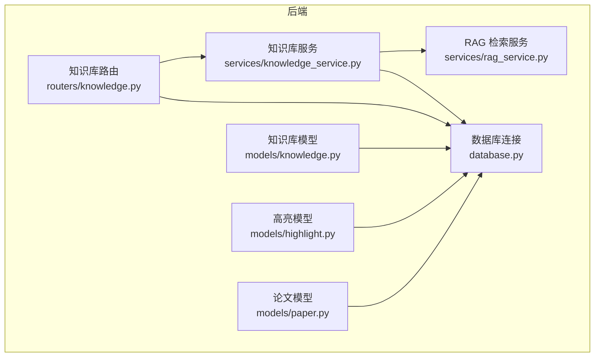
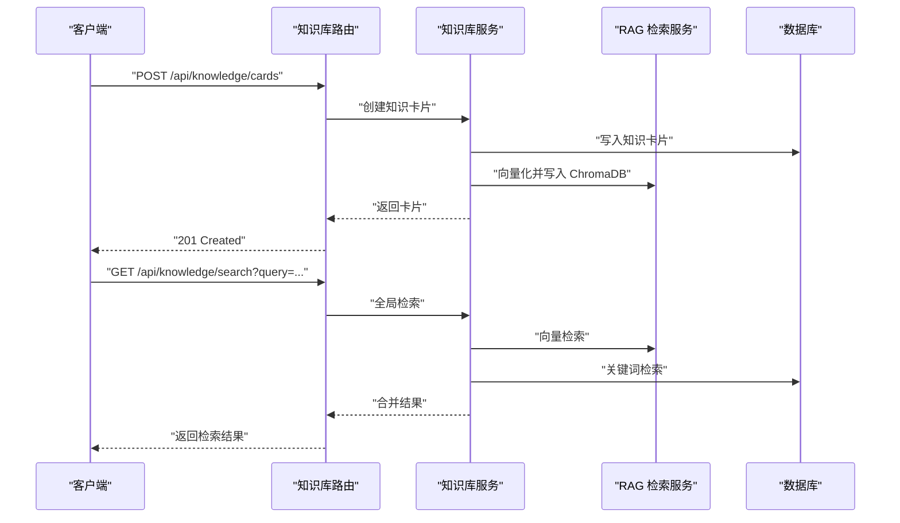
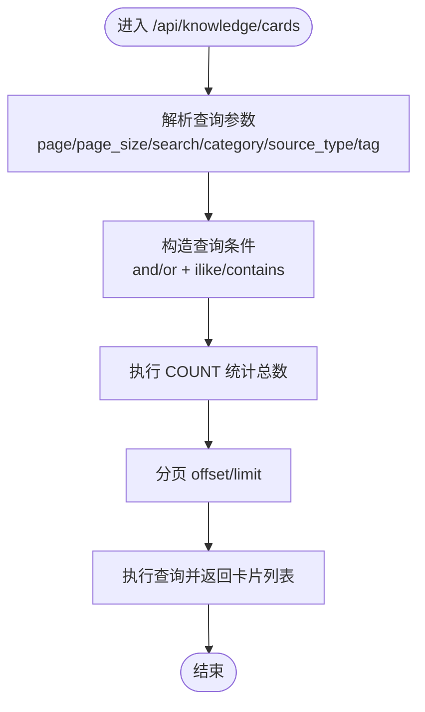
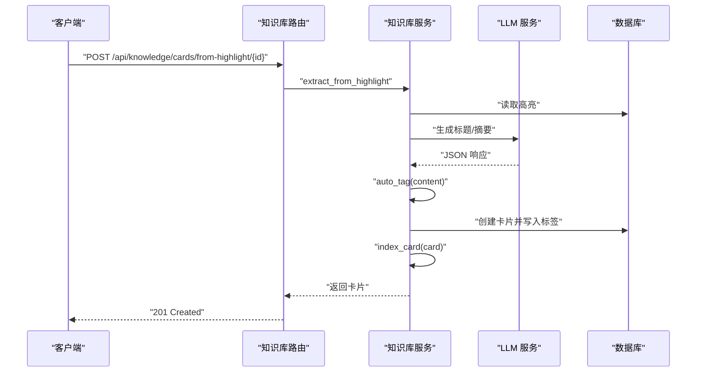
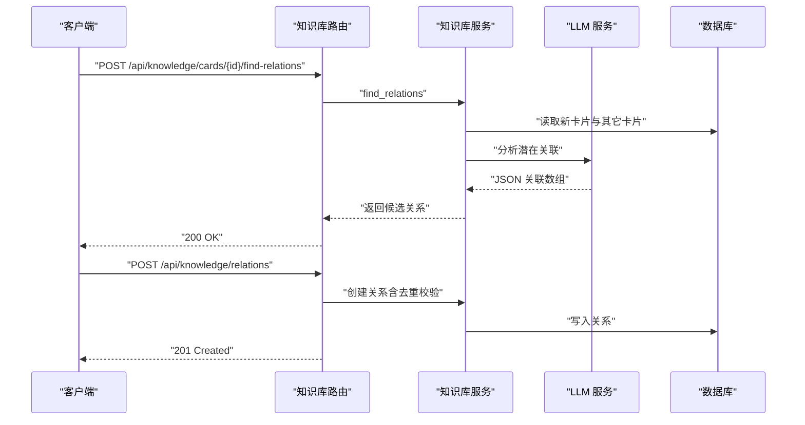
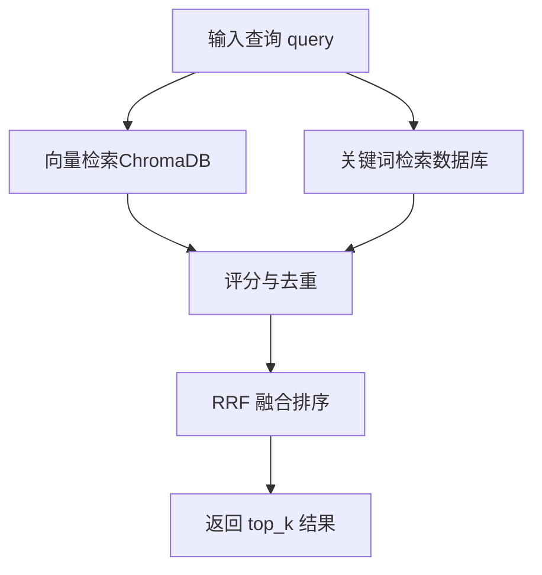
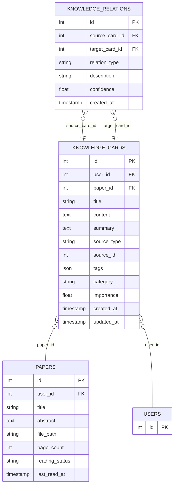
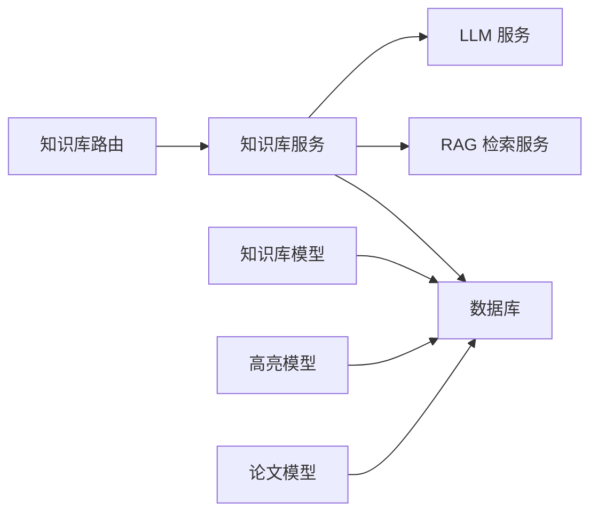

# 知识库路由

<cite>
**本文档引用的文件**
- [知识库路由](file://backend/app/routers/knowledge.py)
- [知识库模型](file://backend/app/models/knowledge.py)
- [知识库服务](file://backend/app/services/knowledge_service.py)
- [RAG 检索服务](file://backend/app/services/rag_service.py)
- [高亮模型](file://backend/app/models/highlight.py)
- [论文模型](file://backend/app/models/paper.py)
- [论文模式](file://backend/app/schemas/paper.py)
- [数据库连接](file://backend/app/database.py)
- [项目总览](file://README.md)
</cite>

## 目录
1. [简介](#简介)
2. [项目结构](#项目结构)
3. [核心组件](#核心组件)
4. [架构总览](#架构总览)
5. [详细组件分析](#详细组件分析)
6. [依赖关系分析](#依赖关系分析)
7. [性能考量](#性能考量)
8. [故障排查指南](#故障排查指南)
9. [结论](#结论)
10. [附录](#附录)

## 简介
本文件聚焦“知识库路由”的完整设计与实现，覆盖知识卡片的创建、分类、标签管理、检索、关联与知识图谱构建；同时阐述知识抽取算法、实体识别、关系链接与向量检索融合策略。文档还涵盖数据结构、关联查询、推荐算法、导入导出与批量操作建议、质量评估指标以及知识更新策略与去重机制。

## 项目结构
后端采用 FastAPI + SQLAlchemy 异步架构，知识库路由位于 routers 层，服务层封装业务逻辑，模型层定义数据结构，RAG 服务负责向量检索与混合检索。

**图表来源**
- [知识库路由:1-550](file://backend/app/routers/knowledge.py#L1-L550)
- [知识库服务:1-662](file://backend/app/services/knowledge_service.py#L1-L662)
- [RAG 检索服务:1-415](file://backend/app/services/rag_service.py#L1-L415)
- [知识库模型:1-80](file://backend/app/models/knowledge.py#L1-L80)
- [高亮模型:1-37](file://backend/app/models/highlight.py#L1-L37)
- [论文模型:1-85](file://backend/app/models/paper.py#L1-L85)
- [数据库连接:1-81](file://backend/app/database.py#L1-L81)

**章节来源**
- [知识库路由:1-550](file://backend/app/routers/knowledge.py#L1-L550)
- [知识库服务:1-662](file://backend/app/services/knowledge_service.py#L1-L662)
- [RAG 检索服务:1-415](file://backend/app/services/rag_service.py#L1-L415)
- [知识库模型:1-80](file://backend/app/models/knowledge.py#L1-L80)
- [高亮模型:1-37](file://backend/app/models/highlight.py#L1-L37)
- [论文模型:1-85](file://backend/app/models/paper.py#L1-L85)
- [数据库连接:1-81](file://backend/app/database.py#L1-L81)

## 核心组件
- 路由层：提供知识卡片的增删改查、搜索、关联管理、图谱导出、统计信息等接口。
- 服务层：封装知识抽取（从高亮/问答）、标签自动生成、关系发现、向量索引、检索融合、图谱构建与统计。
- 模型层：定义知识卡片与知识关联的表结构及关系。
- RAG 层：ChromaDB 向量检索与 BM25 混合检索，支持 RRF 融合排序。
- 数据库层：异步 SQLAlchemy 会话管理与表初始化。

**章节来源**
- [知识库路由:129-546](file://backend/app/routers/knowledge.py#L129-L546)
- [知识库服务:79-657](file://backend/app/services/knowledge_service.py#L79-L657)
- [知识库模型:14-79](file://backend/app/models/knowledge.py#L14-L79)
- [RAG 检索服务:16-414](file://backend/app/services/rag_service.py#L16-L414)
- [数据库连接:30-81](file://backend/app/database.py#L30-L81)

## 架构总览
知识库路由通过 FastAPI 路由器暴露 REST 接口，内部依赖知识库服务进行业务处理，知识库服务再调用 RAG 服务进行向量检索与混合检索，同时维护 ChromaDB 索引与数据库记录。

**图表来源**
- [知识库路由:194-356](file://backend/app/routers/knowledge.py#L194-L356)
- [知识库服务:350-464](file://backend/app/services/knowledge_service.py#L350-L464)
- [RAG 检索服务:236-309](file://backend/app/services/rag_service.py#L236-L309)

**章节来源**
- [知识库路由:194-356](file://backend/app/routers/knowledge.py#L194-L356)
- [知识库服务:350-464](file://backend/app/services/knowledge_service.py#L350-L464)
- [RAG 检索服务:236-309](file://backend/app/services/rag_service.py#L236-L309)

## 详细组件分析

### 知识卡片 API 设计
- 列表与筛选：支持分页、关键词搜索、分类/来源/标签筛选。
- 创建：支持手动创建与从高亮/问答一键提取创建。
- 详情/更新/删除：按用户隔离，权限校验后操作。
- 搜索：向量检索 + 关键词检索融合，支持 top_k 控制。
- 图谱与统计：导出节点边数据与统计信息。

**图表来源**
- [知识库路由:130-191](file://backend/app/routers/knowledge.py#L130-L191)

**章节来源**
- [知识库路由:130-191](file://backend/app/routers/knowledge.py#L130-L191)

### 知识抽取与标签管理
- 从高亮提取：调用 LLM 生成标题/内容/摘要，自动生成标签，创建卡片并索引。
- 从问答提取：对问答内容进行结构化抽取，生成卡片。
- 自动标签：基于内容生成 3-5 个标签，过滤编号并限制数量。
- 标签更新：支持手动更新卡片标签并回写数据库。

**图表来源**
- [知识库路由:311-342](file://backend/app/routers/knowledge.py#L311-L342)
- [知识库服务:82-162](file://backend/app/services/knowledge_service.py#L82-L162)

**章节来源**
- [知识库路由:311-342](file://backend/app/routers/knowledge.py#L311-L342)
- [知识库服务:82-162](file://backend/app/services/knowledge_service.py#L82-L162)

### 关系链接与知识图谱
- 关系发现：基于新卡片与现有卡片摘要，调用 LLM 识别潜在关联，返回目标卡片、类型、置信度与描述。
- 关系管理：创建/删除关系，自动去重（相同源目标组合不允许重复）。
- 图谱数据：导出 nodes（卡片属性）与 edges（关系属性）供前端可视化。

**图表来源**
- [知识库路由:393-467](file://backend/app/routers/knowledge.py#L393-L467)
- [知识库服务:259-348](file://backend/app/services/knowledge_service.py#L259-L348)

**章节来源**
- [知识库路由:393-467](file://backend/app/routers/knowledge.py#L393-L467)
- [知识库服务:259-348](file://backend/app/services/knowledge_service.py#L259-L348)

### 检索与推荐算法
- 全局检索：先做向量检索（ChromaDB cosine），再做关键词检索（标题/内容/标签），最后以分数排序合并。
- 混合检索：RAG 服务提供语义检索 + BM25 关键词检索，使用 RRF 融合算法。
- 推荐：基于内容相似度（余弦相似度）与用户画像（memory_service）加权推荐。

**图表来源**
- [知识库服务:350-464](file://backend/app/services/knowledge_service.py#L350-L464)
- [RAG 检索服务:236-309](file://backend/app/services/rag_service.py#L236-L309)

**章节来源**
- [知识库服务:350-464](file://backend/app/services/knowledge_service.py#L350-L464)
- [RAG 检索服务:236-309](file://backend/app/services/rag_service.py#L236-L309)

### 数据结构与关联查询
- 知识卡片：包含标题、内容、摘要、来源类型/ID、论文关联、标签、分类、重要性、时间戳。
- 知识关联：源卡片、目标卡片、关系类型、描述、置信度、时间戳。
- 关系查询：支持按卡片查询其作为源或目标的所有关系，用于图谱渲染。

**图表来源**
- [知识库模型:14-79](file://backend/app/models/knowledge.py#L14-L79)
- [论文模型:11-59](file://backend/app/models/paper.py#L11-L59)

**章节来源**
- [知识库模型:14-79](file://backend/app/models/knowledge.py#L14-L79)
- [论文模型:11-59](file://backend/app/models/paper.py#L11-L59)

### 导入导出与批量操作
- 批量导入：论文模块提供批量上传接口与结果汇总，可用于批量生成知识卡片。
- 导出：知识图谱接口导出 nodes 与 edges，便于前端可视化或离线分析。
- 批量操作建议：结合论文批量导入与卡片批量创建流程，统一事务提交与错误处理。

**章节来源**
- [论文模式:69-83](file://backend/app/schemas/paper.py#L69-L83)
- [知识库路由:499-506](file://backend/app/routers/knowledge.py#L499-L506)

### 质量评估指标
- 检索质量：向量检索与关键词检索的融合评分、召回率、精确率（可基于外部标注评估）。
- 关系质量：LLM 生成关系的置信度阈值、人工校验率、一致性评估。
- 标签质量：标签覆盖率、标签相关性、去重后标签多样性。
- 图谱质量：节点密度、边密度、聚类系数、中心性指标。

### 知识更新策略与去重机制
- 更新策略：卡片更新后重新索引，确保向量与文本一致；重要性权重可动态调整。
- 去重机制：关系创建前检查相同源目标组合；向量索引以卡片 ID 为唯一标识；关键词检索中使用去重集合。
- 数据一致性：数据库事务与索引同步写入，异常回滚保证一致性。

**章节来源**
- [知识库路由:247-308](file://backend/app/routers/knowledge.py#L247-L308)
- [知识库服务:466-524](file://backend/app/services/knowledge_service.py#L466-L524)

## 依赖关系分析
- 路由依赖服务：路由层仅负责参数解析与权限校验，具体逻辑委托给服务层。
- 服务依赖 RAG：检索与索引依赖 RAG 服务提供的 ChromaDB 客户端与嵌入模型。
- 模型依赖数据库：ORM 映射与关系定义由 SQLAlchemy 提供。
- 外部依赖：ChromaDB、Sentence Transformers、rank_bm25、LangChain LLM。

**图表来源**
- [知识库路由:1-550](file://backend/app/routers/knowledge.py#L1-L550)
- [知识库服务:1-662](file://backend/app/services/knowledge_service.py#L1-L662)
- [RAG 检索服务:1-415](file://backend/app/services/rag_service.py#L1-L415)
- [知识库模型:1-80](file://backend/app/models/knowledge.py#L1-L80)
- [高亮模型:1-37](file://backend/app/models/highlight.py#L1-L37)
- [论文模型:1-85](file://backend/app/models/paper.py#L1-L85)

**章节来源**
- [知识库路由:1-550](file://backend/app/routers/knowledge.py#L1-L550)
- [知识库服务:1-662](file://backend/app/services/knowledge_service.py#L1-L662)
- [RAG 检索服务:1-415](file://backend/app/services/rag_service.py#L1-L415)
- [知识库模型:1-80](file://backend/app/models/knowledge.py#L1-L80)
- [高亮模型:1-37](file://backend/app/models/highlight.py#L1-L37)
- [论文模型:1-85](file://backend/app/models/paper.py#L1-L85)

## 性能考量
- 向量检索：ChromaDB cosine 距离，批量化嵌入编码，线程池异步执行避免阻塞事件循环。
- 混合检索：BM25 索引缓存（按论文 ID 缓存），减少重复构建开销。
- 检索融合：RRF 算法融合语义与关键词，平衡召回与精度。
- 数据库查询：合理使用索引（user_id、paper_id、JSON contains）与分页，避免全表扫描。
- 批量操作：批量导入与批量创建卡片时使用事务，减少 IO 次数。

## 故障排查指南
- 权限错误：当用户无权访问卡片或关系时，路由返回 404 或 400。
- LLM 解析失败：抽取与标签生成失败时降级为简单策略，确保功能可用。
- 向量检索失败：捕获异常并回退到关键词检索，保证基本可用性。
- 索引异常：删除/重建索引时清理缓存，避免脏数据。

**章节来源**
- [知识库路由:318-326](file://backend/app/routers/knowledge.py#L318-L326)
- [知识库服务:118-137](file://backend/app/services/knowledge_service.py#L118-L137)

## 结论
知识库路由通过清晰的分层设计实现了从知识抽取、标签管理、关系链接到检索与图谱可视化的完整闭环。服务层将 LLM、ChromaDB 与数据库有机结合，既保证了检索性能，又提升了知识组织的智能化水平。建议在生产环境中完善质量评估指标与自动化校验流程，持续优化检索与推荐效果。

## 附录
- API 端点概览（来自项目总览）：
  - 获取知识卡片列表：GET /api/knowledge/cards
  - 创建知识卡片：POST /api/knowledge/cards
  - 更新知识卡片：PUT /api/knowledge/cards/{id}
  - 删除知识卡片：DELETE /api/knowledge/cards/{id}
  - 从高亮创建：POST /api/knowledge/cards/from-highlight/{id}
  - 从问答创建：POST /api/knowledge/cards/from-chat
  - 全局搜索：GET /api/knowledge/search
  - 获取卡片关系：GET /api/knowledge/cards/{id}/relations
  - 自动发现关系：POST /api/knowledge/cards/{id}/find-relations
  - 创建关系：POST /api/knowledge/relations
  - 删除关系：DELETE /api/knowledge/relations/{id}
  - 获取图谱数据：GET /api/knowledge/graph
  - 获取统计信息：GET /api/knowledge/stats
  - 自动标签：POST /api/knowledge/cards/{id}/auto-tag

**章节来源**
- [项目总览:359-366](file://README.md#L359-L366)