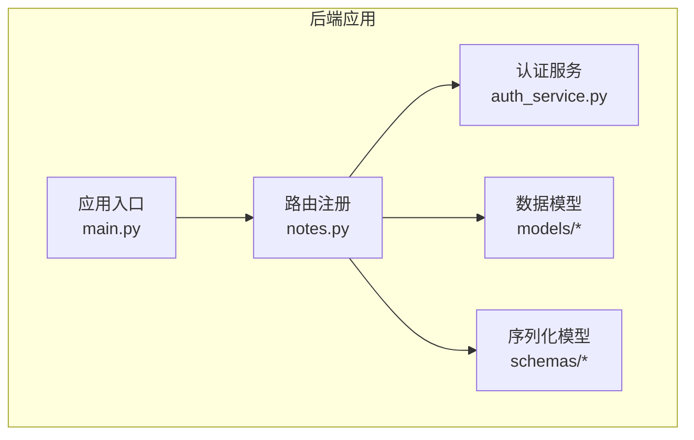
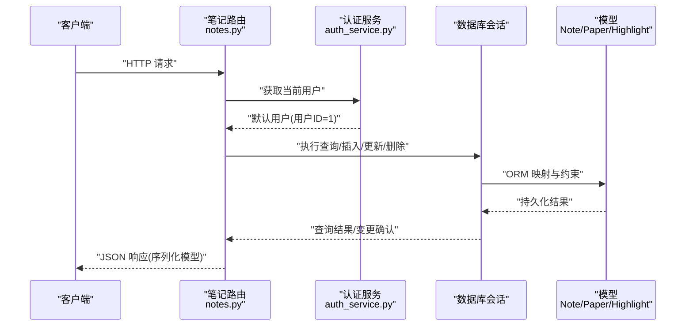
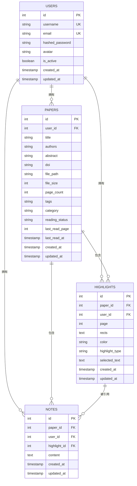
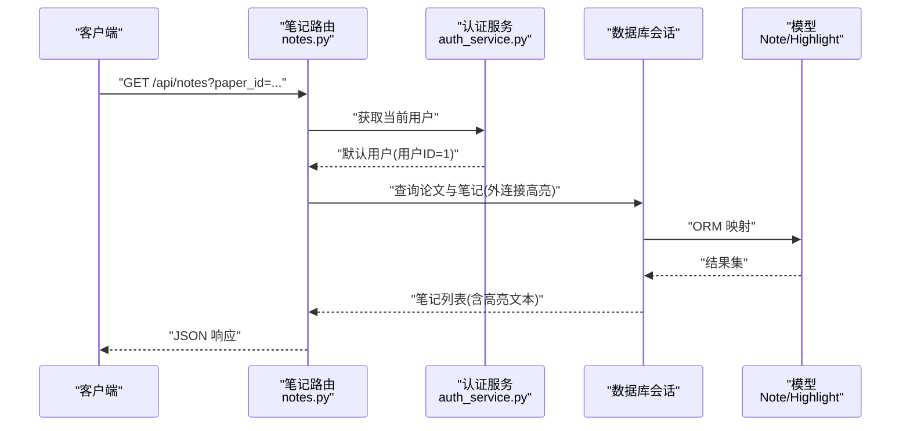
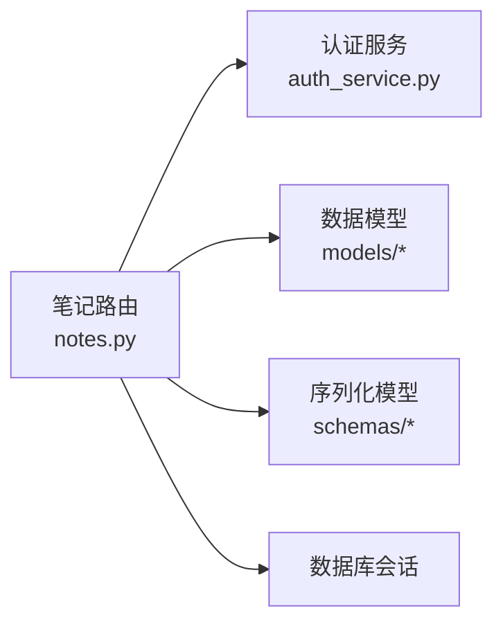

# 笔记管理路由

<cite>
**本文档引用的文件**
- [notes.py](file://backend/app/routers/notes.py)
- [note.py](file://backend/app/models/note.py)
- [highlight.py](file://backend/app/models/highlight.py)
- [paper.py](file://backend/app/models/paper.py)
- [user.py](file://backend/app/models/user.py)
- [note.py](file://backend/app/schemas/note.py)
- [auth_service.py](file://backend/app/services/auth_service.py)
- [main.py](file://backend/app/main.py)
</cite>

## 目录
1. [简介](#简介)
2. [项目结构](#项目结构)
3. [核心组件](#核心组件)
4. [架构总览](#架构总览)
5. [详细组件分析](#详细组件分析)
6. [依赖分析](#依赖分析)
7. [性能考虑](#性能考虑)
8. [故障排除指南](#故障排除指南)
9. [结论](#结论)
10. [附录](#附录)

## 简介
本文件系统性地文档化“笔记管理路由”的完整生命周期 API，覆盖论文笔记的创建、查询、更新、删除与搜索功能；说明笔记内容存储、富文本格式支持现状、标签分类与搜索过滤机制；阐述笔记与论文的关联关系、版本控制与同步策略；提供数据模型定义、批量操作接口建议与权限管理方案；并补充笔记模板系统与导出格式支持说明。

## 项目结构
笔记管理路由位于后端应用的路由层，围绕笔记模型与高亮模型进行数据读写，并通过认证服务实现默认用户模式下的权限控制。整体采用 FastAPI + SQLAlchemy 异步 ORM 架构，路由前缀统一为 /api/notes。

**图表来源**
- [main.py:82-93](file://backend/app/main.py#L82-L93)
- [notes.py:18](file://backend/app/routers/notes.py#L18)

**章节来源**
- [main.py:82-93](file://backend/app/main.py#L82-L93)
- [notes.py:18](file://backend/app/routers/notes.py#L18)

## 核心组件
- 路由模块：提供笔记的增删改查与搜索接口，均基于异步数据库会话与默认用户权限。
- 数据模型：Note 表记录笔记内容、所属论文与用户、高亮关联及时间戳；Paper、Highlight、User 提供外键与关系映射。
- 序列化模型：NoteCreate、NoteUpdate、NoteResponse、NoteWithHighlightResponse 定义请求与响应结构。
- 认证服务：默认返回用户 ID=1 的“个人使用模式”用户，确保所有笔记操作在单一用户上下文中进行。

**章节来源**
- [notes.py:21-350](file://backend/app/routers/notes.py#L21-L350)
- [note.py:11-34](file://backend/app/models/note.py#L11-L34)
- [highlight.py:10-37](file://backend/app/models/highlight.py#L10-L37)
- [paper.py:11-85](file://backend/app/models/paper.py#L11-L85)
- [user.py:11-36](file://backend/app/models/user.py#L11-L36)
- [note.py:7-36](file://backend/app/schemas/note.py#L7-L36)
- [auth_service.py:13-39](file://backend/app/services/auth_service.py#L13-L39)

## 架构总览
笔记管理路由的调用链路如下：客户端请求经路由处理，校验论文与高亮权限后执行数据库操作，最终以 Pydantic 模型序列化响应返回。

**图表来源**
- [notes.py:21-350](file://backend/app/routers/notes.py#L21-L350)
- [auth_service.py:13-39](file://backend/app/services/auth_service.py#L13-L39)

## 详细组件分析

### 数据模型与关系
- Note 模型
  - 字段：主键、paper_id 外键、user_id 外键、可空 highlight_id 外键、文本内容、创建/更新时间戳。
  - 关系：与 Paper、User、Highlight 的一对多/多对一关系，支持级联删除与空值处理。
- Paper 模型
  - 字段：论文元信息、文件路径、页数、标签、分类、阅读状态等。
  - 关系：与 Note 的一对多关系，支持级联删除。
- Highlight 模型
  - 字段：页面、矩形区域、颜色、标注类型、选中文本、时间戳。
  - 关系：与 Note 的一对多关系，支持级联删除。
- User 模型
  - 字段：用户名、邮箱、哈希密码、头像、激活状态、创建/更新时间戳。
  - 关系：与 Paper、Highlight、Note 的一对多关系。

**图表来源**
- [user.py:11-36](file://backend/app/models/user.py#L11-L36)
- [paper.py:11-85](file://backend/app/models/paper.py#L11-L85)
- [highlight.py:10-37](file://backend/app/models/highlight.py#L10-L37)
- [note.py:11-34](file://backend/app/models/note.py#L11-L34)

**章节来源**
- [note.py:11-34](file://backend/app/models/note.py#L11-L34)
- [paper.py:11-85](file://backend/app/models/paper.py#L11-L85)
- [highlight.py:10-37](file://backend/app/models/highlight.py#L10-L37)
- [user.py:11-36](file://backend/app/models/user.py#L11-L36)

### 接口定义与行为
- 列出笔记
  - 方法与路径：GET /api/notes
  - 查询参数：paper_id（必填）
  - 权限与校验：论文必须属于当前用户；返回笔记列表并附带关联高亮文本。
- 创建笔记
  - 方法与路径：POST /api/notes
  - 请求体：paper_id、可选 highlight_id、content
  - 权限与校验：论文必须属于当前用户；若提供 highlight_id，则高亮必须属于当前用户且与论文关联。
- 获取单个笔记
  - 方法与路径：GET /api/notes/{note_id}
  - 路径参数：note_id（必填）
  - 权限与校验：笔记必须属于当前用户。
- 更新笔记
  - 方法与路径：PUT /api/notes/{note_id}
  - 路径参数：note_id（必填）
  - 请求体：可选 content、可选 highlight_id
  - 权限与校验：笔记必须属于当前用户；若更新 highlight_id，需验证新高亮存在且属于当前用户。
- 删除笔记
  - 方法与路径：DELETE /api/notes/{note_id}
  - 路径参数：note_id（必填）
  - 权限与校验：笔记必须属于当前用户。
- 搜索笔记
  - 方法与路径：GET /api/notes/search
  - 查询参数：q（必填，最小长度1）、可选 paper_id
  - 权限与校验：若提供 paper_id，需验证论文属于当前用户；按更新时间倒序返回匹配结果。

**图表来源**
- [notes.py:21-74](file://backend/app/routers/notes.py#L21-L74)
- [auth_service.py:13-39](file://backend/app/services/auth_service.py#L13-L39)

**章节来源**
- [notes.py:21-350](file://backend/app/routers/notes.py#L21-L350)

### 富文本格式支持与内容存储
- 当前实现
  - 笔记内容以纯文本字段存储，未内置富文本编辑器或富文本元数据字段。
  - 高亮模型提供选中文本字段，可用于快速关联与展示。
- 建议扩展
  - 若需富文本，可在 Note 模型中新增富文本内容字段与元数据字段，并在序列化模型中扩展。
  - 前端可集成富文本编辑器，后端在入库时进行安全清洗与格式转换。

**章节来源**
- [note.py:23](file://backend/app/models/note.py#L23)
- [highlight.py:22](file://backend/app/models/highlight.py#L22)

### 标签分类与搜索过滤
- 标签分类
  - 论文模型包含标签字段（JSON 字符串），可用于论文级标签；笔记模型未内置标签字段。
- 搜索过滤
  - 搜索接口支持按内容模糊匹配；可选限定论文范围。
  - 建议在笔记模型中增加 tags 字段与索引，以支持更丰富的标签检索与聚合统计。

**章节来源**
- [paper.py:25](file://backend/app/models/paper.py#L25)
- [notes.py:285-350](file://backend/app/routers/notes.py#L285-L350)

### 笔记与论文的关联关系
- 外键约束：Note.paper_id 指向 Paper.id，删除论文时级联删除笔记。
- 关系映射：Paper.notes 与 Note.paper 实现双向关系，便于按论文聚合查询。
- 权限隔离：所有操作均强制校验用户 ID 与论文归属，避免跨用户访问。

**章节来源**
- [note.py:17-20](file://backend/app/models/note.py#L17-L20)
- [paper.py:50-54](file://backend/app/models/paper.py#L50-L54)

### 版本控制与同步策略
- 当前实现
  - Note 模型包含 created_at 与 updated_at 时间戳，可用于排序与审计。
  - 未实现显式的版本号字段或历史表。
- 建议方案
  - 引入版本表或在笔记内容中嵌入版本元数据，支持回滚与对比。
  - 对于多端同步，建议引入冲突解决策略（如时间戳+内容哈希）与增量同步接口。

**章节来源**
- [note.py:24-25](file://backend/app/models/note.py#L24-L25)

### 批量操作接口建议
- 批量创建：接收笔记数组，逐条校验论文与高亮权限后批量提交。
- 批量更新：支持按条件批量更新内容或高亮关联。
- 批量删除：支持按论文或高亮批量清理笔记。
- 并发控制：使用数据库事务与唯一约束避免重复与竞态。

[本节为概念性建议，不直接分析具体文件，故无章节来源]

### 权限管理方案
- 默认用户模式：认证服务始终返回用户 ID=1，所有笔记操作在该用户上下文中进行。
- 访问控制：路由层在每次操作前校验论文与高亮归属，防止越权访问。
- 扩展建议：若启用多用户，需在认证服务中引入 JWT 或会话机制，并在路由层严格校验用户身份。

**章节来源**
- [auth_service.py:13-39](file://backend/app/services/auth_service.py#L13-L39)
- [notes.py:36-46](file://backend/app/routers/notes.py#L36-L46)
- [notes.py:106-123](file://backend/app/routers/notes.py#L106-L123)

### 笔记模板系统
- 当前实现：未提供模板模型或模板接口。
- 建议设计
  - 模板模型：包含模板名称、内容、适用领域、是否公开等字段。
  - 接口：模板创建、查询、应用（基于模板生成笔记草稿）。
  - 集成：在创建笔记接口中支持传入模板 ID，自动填充内容与高亮关联。

[本节为概念性建议，不直接分析具体文件，故无章节来源]

### 导出格式支持说明
- 当前实现：未提供笔记导出接口。
- 建议格式
  - Markdown：保留内容与高亮文本，便于二次编辑。
  - PDF：渲染为可打印文档，包含笔记与高亮标注。
  - JSON：导出结构化数据，便于迁移与分析。
- 导出流程
  - 输入：笔记 ID 列表或论文维度导出。
  - 处理：按格式拼装内容，合并高亮信息。
  - 输出：生成文件流或临时链接。

[本节为概念性建议，不直接分析具体文件，故无章节来源]

## 依赖分析
- 路由依赖
  - 依赖认证服务获取当前用户，默认用户 ID=1。
  - 依赖数据库会话执行异步查询与事务提交。
  - 依赖模型与序列化模型进行数据映射与响应构造。
- 外部依赖
  - FastAPI 路由装饰器与依赖注入。
  - SQLAlchemy 异步 ORM 与关系映射。

**图表来源**
- [notes.py:13-16](file://backend/app/routers/notes.py#L13-L16)
- [auth_service.py:13-39](file://backend/app/services/auth_service.py#L13-L39)

**章节来源**
- [notes.py:13-16](file://backend/app/routers/notes.py#L13-L16)
- [auth_service.py:13-39](file://backend/app/services/auth_service.py#L13-L39)

## 性能考虑
- 查询优化
  - 在 paper_id 与 user_id 上建立索引，加速笔记列表与权限校验。
  - 外连接高亮时注意结果集膨胀，必要时分页或延迟加载。
- 写入优化
  - 批量插入与更新时使用事务，减少往返开销。
- 缓存策略
  - 对热点论文的笔记列表进行短期缓存，降低数据库压力。
- 搜索优化
  - 搜索接口已按更新时间排序，建议在 content 字段上建立全文索引（如 PostgreSQL 全文检索）以提升模糊匹配性能。

[本节提供通用指导，不直接分析具体文件，故无章节来源]

## 故障排除指南
- 常见错误与原因
  - 论文不存在或无权限访问：创建/查询/搜索前的论文权限校验失败。
  - 高亮不存在或无权限访问：更新笔记时高亮校验失败。
  - 笔记不存在或无权限：读取/更新/删除单个笔记时未找到匹配记录。
- 排查步骤
  - 确认当前用户 ID 与请求中的 user_id 是否一致。
  - 检查 paper_id 与 highlight_id 是否正确，以及是否属于当前用户。
  - 查看数据库日志与异常堆栈，定位具体约束或查询问题。
- 预防措施
  - 在前端统一通过权限校验后再发起请求。
  - 后端对所有外部输入进行最小长度与类型校验。

**章节来源**
- [notes.py:42-46](file://backend/app/routers/notes.py#L42-L46)
- [notes.py:119-123](file://backend/app/routers/notes.py#L119-L123)
- [notes.py:165-169](file://backend/app/routers/notes.py#L165-L169)
- [notes.py:213-217](file://backend/app/routers/notes.py#L213-L217)
- [notes.py:273-277](file://backend/app/routers/notes.py#L273-L277)

## 结论
笔记管理路由提供了完整的论文笔记生命周期管理能力，具备良好的权限隔离与数据一致性保障。当前实现聚焦纯文本内容与高亮关联，建议后续扩展富文本支持、标签体系、版本控制与导出能力，以满足更复杂的学术写作与知识管理需求。

## 附录
- API 端点一览
  - GET /api/notes：列出论文的所有笔记（含高亮文本）
  - POST /api/notes：创建笔记
  - GET /api/notes/{note_id}：获取单个笔记详情
  - PUT /api/notes/{note_id}：更新笔记
  - DELETE /api/notes/{note_id}：删除笔记
  - GET /api/notes/search：搜索笔记（模糊匹配）

**章节来源**
- [notes.py:21-350](file://backend/app/routers/notes.py#L21-L350)