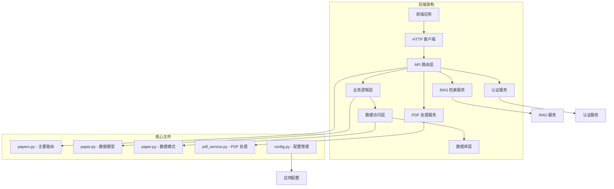
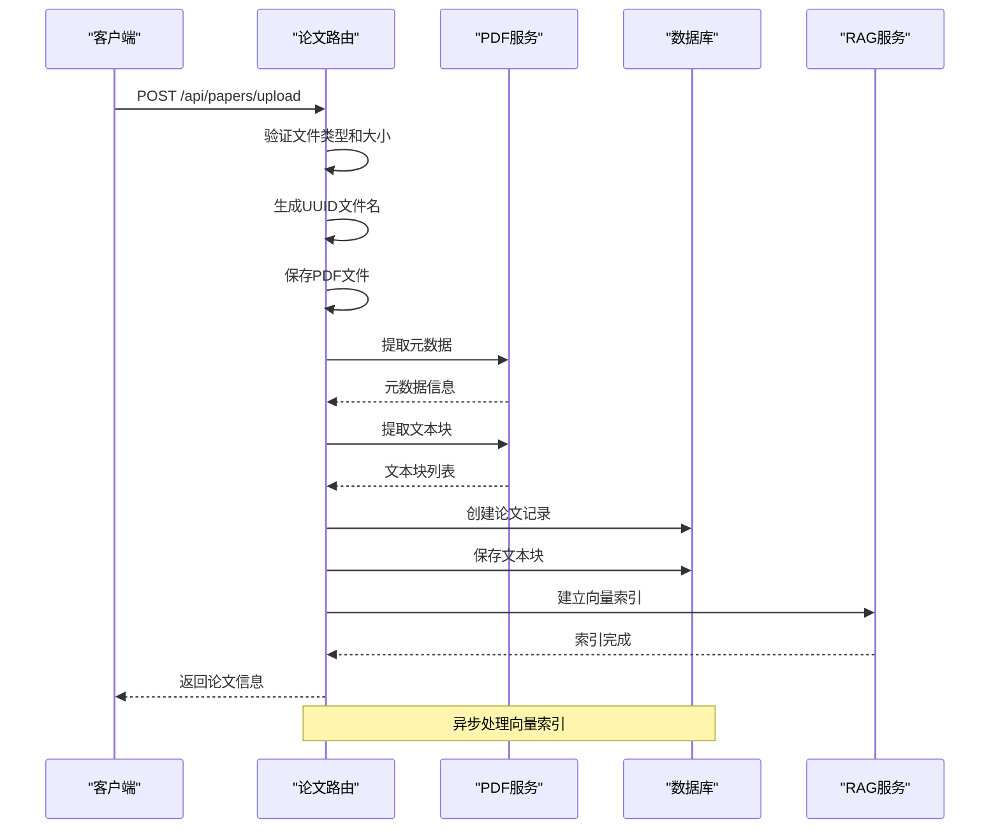
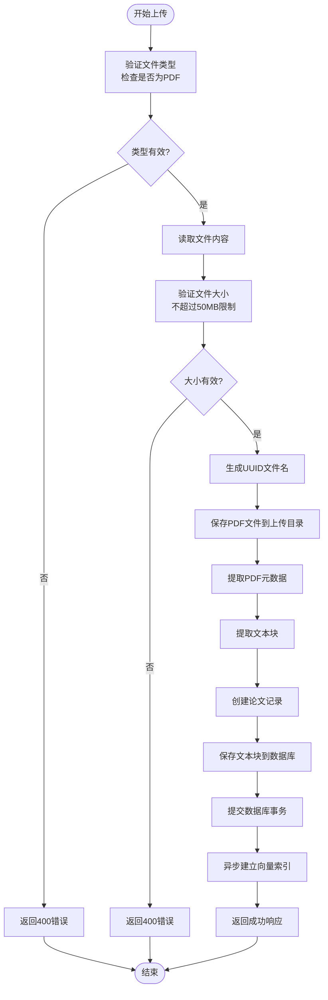
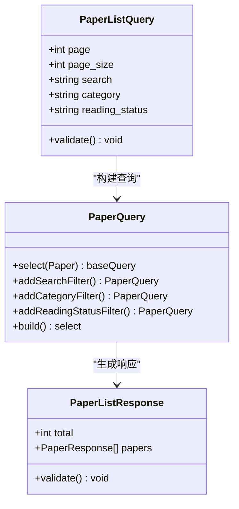
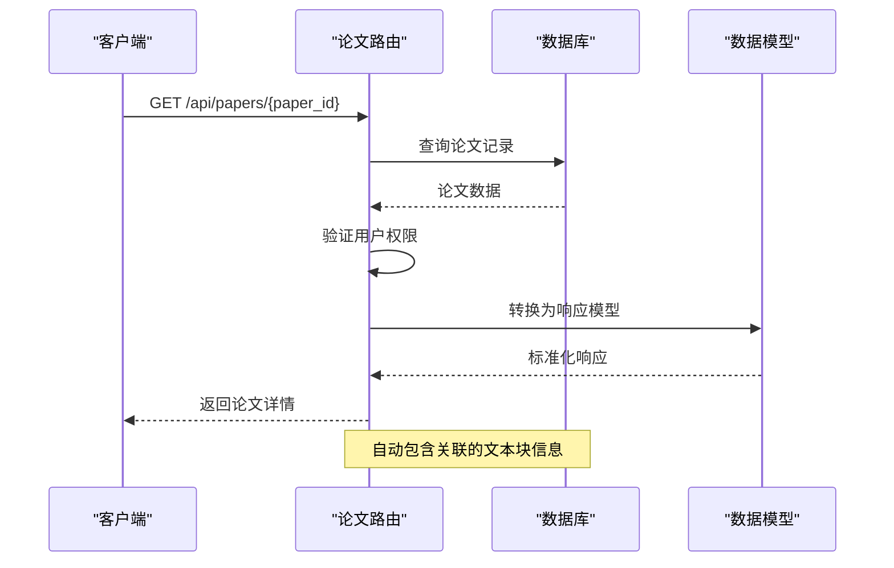
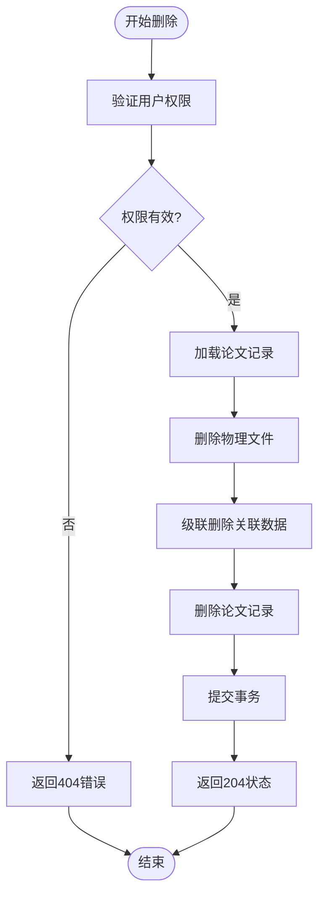
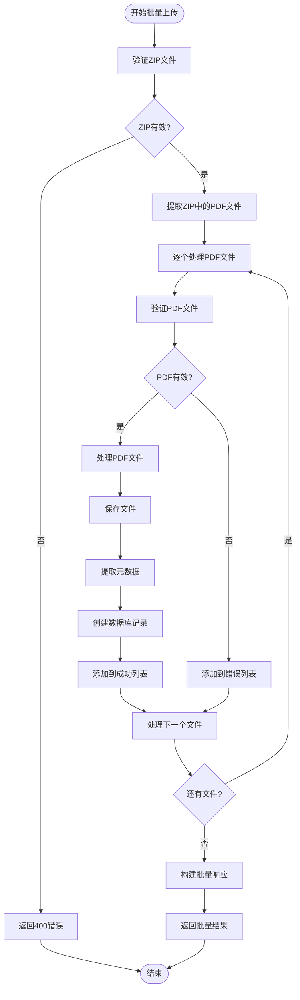
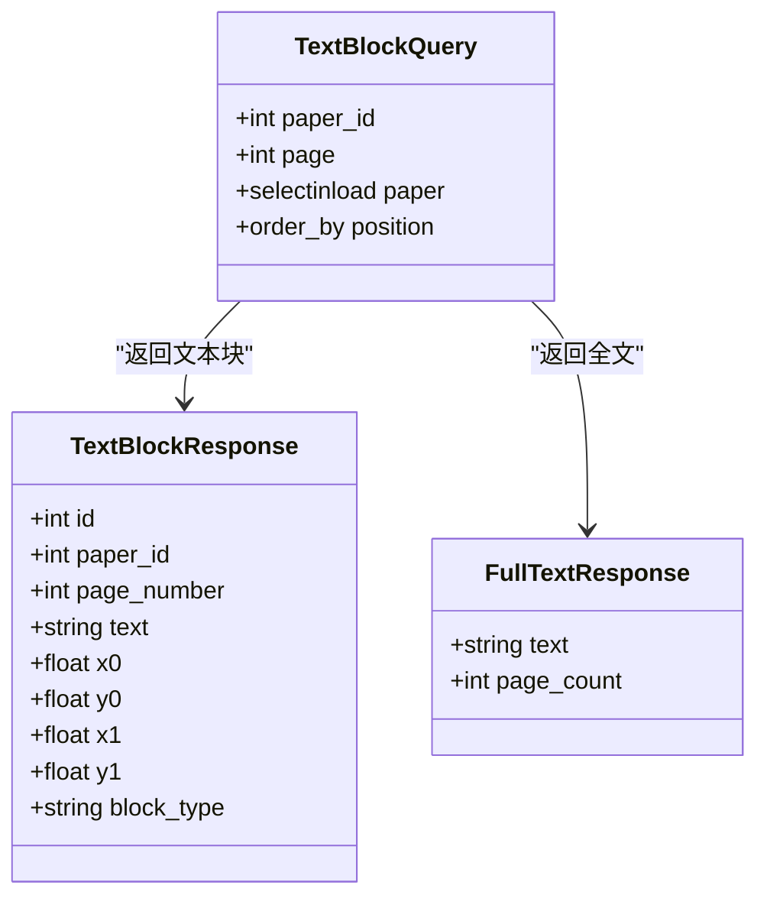
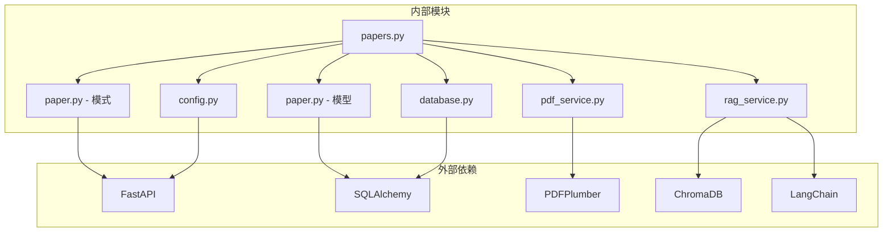

# 论文管理路由

<cite>
**本文档引用的文件**
- [papers.py](file://backend/app/routers/papers.py)
- [paper.py](file://backend/app/models/paper.py)
- [paper.py](file://backend/app/schemas/paper.py)
- [pdf_service.py](file://backend/app/services/pdf_service.py)
- [config.py](file://backend/app/config.py)
- [database.py](file://backend/app/database.py)
- [main.py](file://backend/app/main.py)
- [error_handler.py](file://backend/app/middleware/error_handler.py)
- [rag_service.py](file://backend/app/services/rag_service.py)
- [index.js](file://frontend/src/api/index.js)
- [PaperList.jsx](file://frontend/src/pages/PaperList.jsx)
</cite>

## 目录
1. [简介](#简介)
2. [项目结构](#项目结构)
3. [核心组件](#核心组件)
4. [架构概览](#架构概览)
5. [详细组件分析](#详细组件分析)
6. [依赖关系分析](#依赖关系分析)
7. [性能考虑](#性能考虑)
8. [故障排除指南](#故障排除指南)
9. [结论](#结论)
10. [附录](#附录)

## 简介

论文管理路由是 PaperChat 系统的核心模块，负责处理学术论文的完整生命周期管理。该模块提供了完整的论文上传、下载、删除、元数据管理和文本检索功能，支持单文件和批量文件处理，集成了 PDF 解析、向量索引和全文检索能力。

系统采用现代化的前后端分离架构，后端基于 FastAPI 和 SQLAlchemy，前端使用 React，实现了高效的论文管理体验。

## 项目结构

论文管理路由位于后端应用的路由模块中，采用模块化设计，清晰分离了业务逻辑、数据模型和接口定义。

**图表来源**
- [papers.py:1-1034](file://backend/app/routers/papers.py#L1-L1034)
- [paper.py:1-85](file://backend/app/models/paper.py#L1-L85)
- [paper.py:1-83](file://backend/app/schemas/paper.py#L1-L83)

**章节来源**
- [papers.py:1-1034](file://backend/app/routers/papers.py#L1-L1034)
- [main.py:1-114](file://backend/app/main.py#L1-L114)

## 核心组件

论文管理路由包含以下核心组件：

### 主要路由模块
- **论文路由**：提供完整的 CRUD 操作和高级功能
- **PDF 处理服务**：负责 PDF 文件解析和元数据提取
- **RAG 检索服务**：实现向量索引和混合检索
- **数据模型**：定义论文和文本块的数据结构
- **数据模式**：Pydantic 模型用于请求和响应验证

### 关键特性
- 支持单文件和批量文件上传
- 完整的论文元数据管理
- PDF 文本块级解析
- 向量索引和语义检索
- 阅读状态跟踪
- 文件安全存储

**章节来源**
- [papers.py:30-89](file://backend/app/routers/papers.py#L30-L89)
- [pdf_service.py:11-194](file://backend/app/services/pdf_service.py#L11-L194)

## 架构概览

论文管理系统的整体架构采用分层设计，确保了良好的可维护性和扩展性。

**图表来源**
- [papers.py:156-262](file://backend/app/routers/papers.py#L156-L262)
- [pdf_service.py:14-56](file://backend/app/services/pdf_service.py#L14-L56)
- [rag_service.py:183-232](file://backend/app/services/rag_service.py#L183-L232)

## 详细组件分析

### 论文上传处理流程

论文上传是系统最复杂的操作之一，涉及多个步骤和安全保障机制。

**图表来源**
- [papers.py:156-262](file://backend/app/routers/papers.py#L156-L262)
- [pdf_service.py:14-56](file://backend/app/services/pdf_service.py#L14-L56)

#### 文件验证机制
系统实施了多层次的文件验证：
- **扩展名验证**：确保文件以 `.pdf` 结尾
- **内容验证**：检查 PDF 文件头标识
- **大小限制**：默认限制为 50MB
- **格式检查**：使用 pdfplumber 验证 PDF 有效性

#### 元数据提取策略
系统采用智能元数据提取策略：
- **PDF 元数据优先**：从 PDF 元数据中提取标题和作者
- **内容回退**：当元数据缺失时，从第一页提取标题
- **页数统计**：准确统计 PDF 总页数
- **作者信息**：提取作者列表信息

#### 存储策略
文件存储采用安全策略：
- **UUID 命名**：防止文件名冲突和安全风险
- **目录结构**：统一的上传目录管理
- **清理机制**：处理失败时自动清理临时文件
- **权限控制**：确保文件访问安全性

**章节来源**
- [papers.py:177-261](file://backend/app/routers/papers.py#L177-L261)
- [pdf_service.py:25-56](file://backend/app/services/pdf_service.py#L25-L56)

### 论文列表查询接口

论文列表查询支持多种筛选和排序选项，提供高效的数据检索能力。

**图表来源**
- [papers.py:91-153](file://backend/app/routers/papers.py#L91-L153)

#### 查询参数详解
- **分页参数**：page（默认1）、page_size（默认20，最大100）
- **搜索功能**：支持标题和作者的模糊匹配
- **分类筛选**：按预定义分类过滤论文
- **状态筛选**：按阅读状态过滤（unread/reading/finished）

#### 性能优化
- **数据库索引**：在 user_id 和 reading_status 上建立索引
- **延迟加载**：使用 selectinload 优化 N+1 查询问题
- **分页查询**：支持大数据量的高效分页
- **条件查询**：动态构建查询条件，避免不必要的数据库操作

**章节来源**
- [papers.py:91-153](file://backend/app/routers/papers.py#L91-L153)

### 单篇论文详情获取

论文详情接口提供完整的论文信息，包括基本元数据和关联的文本块信息。

**图表来源**
- [papers.py:264-290](file://backend/app/routers/papers.py#L264-L290)

#### 响应数据结构
论文详情包含以下关键信息：
- **基础信息**：标题、作者、摘要、DOI
- **技术信息**：文件路径、文件大小、页数
- **分类标签**：分类和标签信息
- **状态信息**：阅读状态和最后阅读时间
- **时间戳**：创建和更新时间

**章节来源**
- [papers.py:264-290](file://backend/app/routers/papers.py#L264-L290)

### 论文删除操作

论文删除采用级联删除策略，确保数据完整性。

**图表来源**
- [papers.py:341-376](file://backend/app/routers/papers.py#L341-L376)

#### 删除保护机制
系统实施多重保护措施：
- **权限验证**：确保只有论文所有者可以删除
- **文件检查**：验证物理文件是否存在
- **级联删除**：自动删除相关的文本块、高亮和笔记
- **事务保证**：使用数据库事务确保操作原子性

**章节来源**
- [papers.py:341-376](file://backend/app/routers/papers.py#L341-L376)

### 批量操作功能

系统支持多种批量操作，提高大规模论文管理效率。

#### 批量文件上传
批量文件上传支持单个 ZIP 文件中的多个 PDF 文件处理。

**图表来源**
- [papers.py:521-646](file://backend/app/routers/papers.py#L521-L646)

#### 批量操作特点
- **错误隔离**：单个文件失败不影响其他文件处理
- **进度跟踪**：实时显示处理进度和结果
- **统计信息**：提供成功、失败和总数量统计
- **详细报告**：每个文件的处理状态和错误信息

**章节来源**
- [papers.py:521-646](file://backend/app/routers/papers.py#L521-L646)

### 文本检索功能

系统提供多种文本检索能力，支持论文内容的快速查找。

#### 文本块检索
支持按页码或全文档检索论文文本块。

**图表来源**
- [papers.py:419-518](file://backend/app/routers/papers.py#L419-L518)

#### 检索功能特性
- **位置信息**：保留文本块的精确位置坐标
- **类型分类**：区分不同类型的文本块（标题、正文等）
- **排序规则**：按页码和垂直位置排序
- **分页支持**：支持按页码精确检索

**章节来源**
- [papers.py:419-518](file://backend/app/routers/papers.py#L419-L518)

## 依赖关系分析

论文管理路由的依赖关系体现了清晰的分层架构设计。

**图表来源**
- [papers.py:20-28](file://backend/app/routers/papers.py#L20-L28)
- [pdf_service.py:5-8](file://backend/app/services/pdf_service.py#L5-L8)
- [rag_service.py:11-13](file://backend/app/services/rag_service.py#L11-L13)

### 核心依赖关系
- **FastAPI**：提供 Web 框架和路由功能
- **SQLAlchemy**：提供 ORM 数据库操作
- **PDFPlumber**：处理 PDF 文件解析
- **ChromaDB**：提供向量数据库功能
- **LangChain**：集成 LLM 和检索功能

### 服务间协作
- **PDF 服务**：为论文路由提供 PDF 处理能力
- **RAG 服务**：为论文提供智能检索功能
- **数据库服务**：提供数据持久化和查询能力
- **认证服务**：确保用户身份验证和授权

**章节来源**
- [papers.py:20-28](file://backend/app/routers/papers.py#L20-L28)
- [database.py:13-27](file://backend/app/database.py#L13-L27)

## 性能考虑

系统在设计时充分考虑了性能优化，采用了多种策略提升用户体验。

### 异步处理
- **向量索引异步化**：上传完成后异步建立索引，避免阻塞主流程
- **并发处理**：批量操作支持并发处理多个文件
- **非阻塞 I/O**：使用异步数据库连接和文件操作

### 缓存策略
- **BM25 索引缓存**：缓存论文的 BM25 索引，避免重复构建
- **模型懒加载**：Embedding 模型按需加载，减少启动时间
- **数据库连接池**：复用数据库连接，减少连接开销

### 内存优化
- **流式处理**：大文件采用流式读取，避免内存溢出
- **分页查询**：大数据量采用分页查询，控制内存使用
- **及时清理**：及时释放不再使用的资源

## 故障排除指南

### 常见问题及解决方案

#### 文件上传失败
**问题症状**：上传过程中出现 400 或 500 错误
**可能原因**：
- 文件类型不是 PDF
- 文件大小超过限制（50MB）
- 磁盘空间不足
- 权限问题

**解决步骤**：
1. 检查文件扩展名是否为 .pdf
2. 验证文件大小是否在限制范围内
3. 确认上传目录有足够磁盘空间
4. 检查文件写入权限

#### PDF 解析错误
**问题症状**：PDF 文件无法正确解析
**可能原因**：
- PDF 文件损坏
- 密码保护的 PDF
- 特殊格式的 PDF

**解决步骤**：
1. 尝试在 Adobe Reader 中打开文件
2. 检查 PDF 是否受密码保护
3. 转换为标准 PDF 格式后重试

#### 检索性能问题
**问题症状**：论文检索响应缓慢
**可能原因**：
- 向量索引尚未建立
- 索引数据量过大
- 系统资源不足

**解决步骤**：
1. 等待异步索引完成
2. 清理不需要的论文以减少索引量
3. 检查系统内存和 CPU 使用情况

#### 数据库连接问题
**问题症状**：数据库操作失败
**可能原因**：
- 数据库服务未启动
- 连接池耗尽
- 数据库权限不足

**解决步骤**：
1. 检查数据库服务状态
2. 增加连接池大小配置
3. 验证数据库用户权限

**章节来源**
- [error_handler.py:11-70](file://backend/app/middleware/error_handler.py#L11-L70)

## 结论

论文管理路由模块展现了现代 Web 应用的最佳实践，通过合理的架构设计和丰富的功能实现，为用户提供了完整的论文管理解决方案。

### 主要优势
- **功能完整**：覆盖论文管理的完整生命周期
- **性能优秀**：采用异步处理和缓存策略
- **扩展性强**：模块化设计便于功能扩展
- **用户体验好**：提供直观的操作界面和响应式设计

### 技术亮点
- **智能 PDF 处理**：支持复杂的 PDF 解析和元数据提取
- **向量检索**：集成先进的语义检索能力
- **批量操作**：支持高效的批量文件处理
- **安全可靠**：完善的权限验证和数据保护机制

该模块为 PaperChat 系统奠定了坚实的技术基础，为后续的功能扩展和性能优化提供了良好的平台。

## 附录

### API 接口规范

#### 论文上传
- **方法**：POST `/api/papers/upload`
- **参数**：multipart/form-data，包含 PDF 文件和可选的标题、分类、标签
- **响应**：PaperResponse 对象

#### 论文列表
- **方法**：GET `/api/papers`
- **参数**：page、page_size、search、category、reading_status
- **响应**：PaperListResponse 对象

#### 论文详情
- **方法**：GET `/api/papers/{paper_id}`
- **参数**：paper_id（路径参数）
- **响应**：PaperResponse 对象

#### 论文更新
- **方法**：PUT `/api/papers/{paper_id}`
- **参数**：paper_id（路径参数），更新数据
- **响应**：PaperResponse 对象

#### 论文删除
- **方法**：DELETE `/api/papers/{paper_id}`
- **参数**：paper_id（路径参数）
- **响应**：204 No Content

#### 文件下载
- **方法**：GET `/api/papers/{paper_id}/file`
- **参数**：paper_id（路径参数）
- **响应**：PDF 文件流

#### 文本检索
- **方法**：GET `/api/papers/{paper_id}/text`
- **参数**：paper_id（路径参数），可选 page 参数
- **响应**：包含文本内容和页数的对象

#### 文本块检索
- **方法**：GET `/api/papers/{paper_id}/blocks`
- **参数**：paper_id（路径参数），可选 page 参数
- **响应**：包含文本块列表的对象

### 错误码说明
- **200 OK**：操作成功
- **201 Created**：资源创建成功
- **204 No Content**：删除成功
- **400 Bad Request**：请求参数错误
- **401 Unauthorized**：未授权访问
- **404 Not Found**：资源不存在
- **422 Unprocessable Entity**：数据验证失败
- **500 Internal Server Error**：服务器内部错误

### 配置参数
- **UPLOAD_DIR**：上传文件存储目录，默认为 `./uploads`
- **MAX_FILE_SIZE**：文件大小限制，默认为 50MB
- **DATABASE_URL**：数据库连接字符串，默认使用 SQLite
- **JWT_SECRET_KEY**：JWT 密钥，用于用户认证