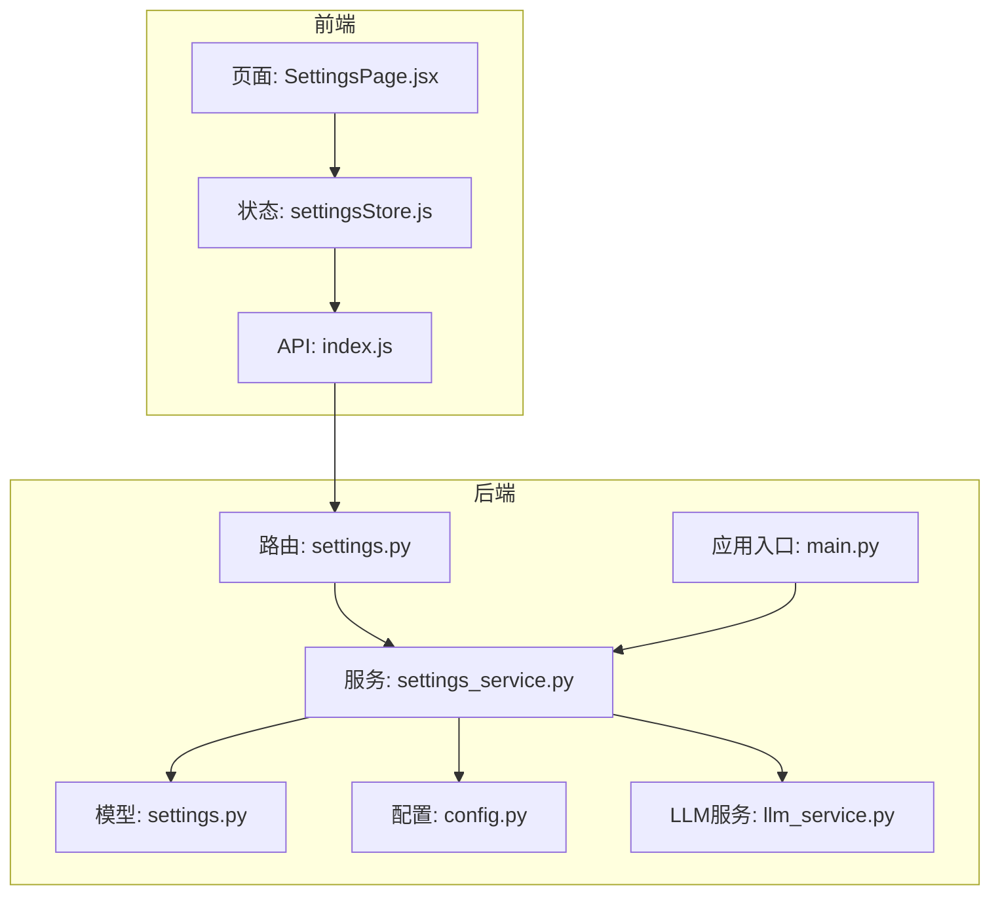
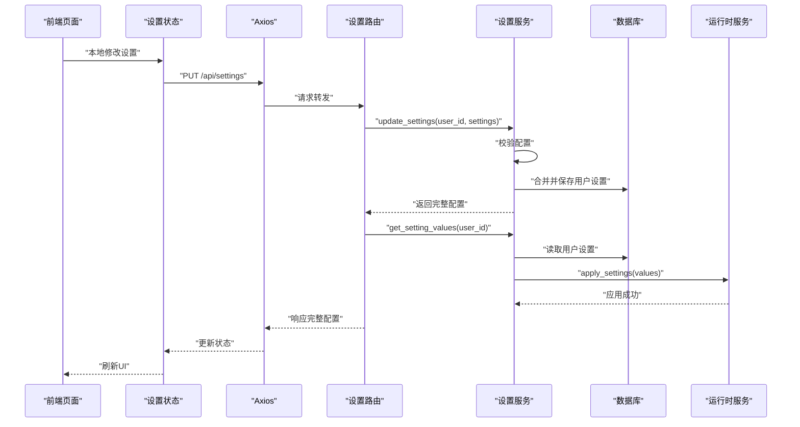
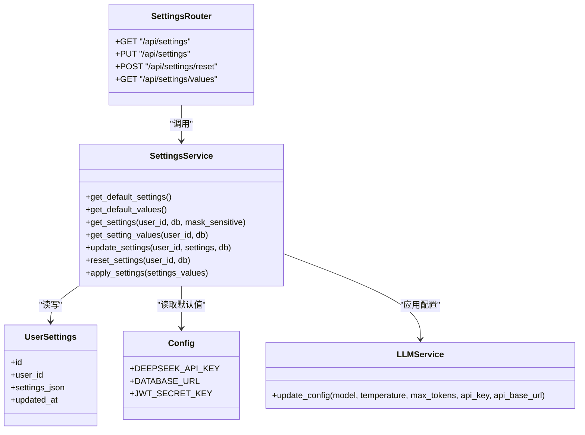

# 设置管理路由

<cite>
**本文引用的文件**
- [settings.py](file://backend/app/routers/settings.py)
- [settings_service.py](file://backend/app/services/settings_service.py)
- [settings.py](file://backend/app/models/settings.py)
- [config.py](file://backend/app/config.py)
- [main.py](file://backend/app/main.py)
- [SettingsPage.jsx](file://frontend/src/pages/SettingsPage.jsx)
- [settingsStore.js](file://frontend/src/stores/settingsStore.js)
- [index.js](file://frontend/src/api/index.js)
- [llm_service.py](file://backend/app/services/llm_service.py)
- [llm_service.py](file://backend/app/services/llm/llm_service.py)
</cite>

## 目录
1. [简介](#简介)
2. [项目结构](#项目结构)
3. [核心组件](#核心组件)
4. [架构总览](#架构总览)
5. [详细组件分析](#详细组件分析)
6. [依赖关系分析](#依赖关系分析)
7. [性能考量](#性能考量)
8. [故障排查指南](#故障排查指南)
9. [结论](#结论)
10. [附录](#附录)

## 简介
本文件系统性地文档化“设置管理路由”的设计与实现，覆盖用户偏好设置、系统配置与全局参数的管理 API。重点说明以下方面：
- 设置项的数据结构与默认值管理
- 动态更新机制与运行时应用
- 权限控制与安全策略（含敏感信息脱敏）
- 设置验证规则、批量更新与回滚思路
- 设置同步策略与配置迁移方案

## 项目结构
设置管理涉及后端路由、服务层、模型层与前端页面/状态管理的协同工作。

**图表来源**
- [settings.py:1-94](file://backend/app/routers/settings.py#L1-L94)
- [settings_service.py:1-523](file://backend/app/services/settings_service.py#L1-L523)
- [settings.py:1-30](file://backend/app/models/settings.py#L1-L30)
- [config.py:1-44](file://backend/app/config.py#L1-L44)
- [main.py:1-114](file://backend/app/main.py#L1-L114)
- [SettingsPage.jsx:1-330](file://frontend/src/pages/SettingsPage.jsx#L1-L330)
- [settingsStore.js:1-131](file://frontend/src/stores/settingsStore.js#L1-L131)
- [index.js:1-12](file://frontend/src/api/index.js#L1-L12)
- [llm_service.py:1-53](file://backend/app/services/llm_service.py#L1-L53)
- [llm_service.py:1-200](file://backend/app/services/llm/llm_service.py#L1-L200)

**章节来源**
- [settings.py:1-94](file://backend/app/routers/settings.py#L1-L94)
- [settings_service.py:1-523](file://backend/app/services/settings_service.py#L1-L523)
- [settings.py:1-30](file://backend/app/models/settings.py#L1-L30)
- [config.py:1-44](file://backend/app/config.py#L1-L44)
- [main.py:1-114](file://backend/app/main.py#L1-L114)
- [SettingsPage.jsx:1-330](file://frontend/src/pages/SettingsPage.jsx#L1-L330)
- [settingsStore.js:1-131](file://frontend/src/stores/settingsStore.js#L1-L131)
- [index.js:1-12](file://frontend/src/api/index.js#L1-L12)
- [llm_service.py:1-53](file://backend/app/services/llm_service.py#L1-L53)
- [llm_service.py:1-200](file://backend/app/services/llm/llm_service.py#L1-L200)

## 核心组件
- 路由层：提供设置查询、批量更新、重置默认值等端点，并在更新后将配置应用到运行时。
- 服务层：负责默认值定义、配置校验、合并用户自定义值、持久化、运行时应用与敏感信息脱敏。
- 模型层：用户设置表，以 JSON 文本存储用户自定义配置。
- 前端页面与状态：提供可视化设置表单、本地变更暂存与批量提交。
- 应用入口：启动时加载默认用户设置并应用到各服务。

**章节来源**
- [settings.py:17-94](file://backend/app/routers/settings.py#L17-L94)
- [settings_service.py:19-523](file://backend/app/services/settings_service.py#L19-L523)
- [settings.py:11-30](file://backend/app/models/settings.py#L11-L30)
- [SettingsPage.jsx:212-330](file://frontend/src/pages/SettingsPage.jsx#L212-L330)
- [settingsStore.js:9-131](file://frontend/src/stores/settingsStore.js#L9-L131)
- [main.py:34-46](file://backend/app/main.py#L34-L46)

## 架构总览
设置管理采用“路由 → 服务 → 模型/配置 → 运行时服务”的链路，支持：
- 完整配置（含元数据）与纯值配置（仅值）两类返回
- 前端本地变更暂存与批量提交
- 敏感信息（如 API Key）脱敏展示与安全保存
- 运行时配置应用到具体业务服务（LLM/RAG/搜索/推荐）

**图表来源**
- [settings.py:31-63](file://backend/app/routers/settings.py#L31-L63)
- [settings_service.py:329-404](file://backend/app/services/settings_service.py#L329-L404)
- [settings.py:11-30](file://backend/app/models/settings.py#L11-L30)
- [settingsStore.js:63-94](file://frontend/src/stores/settingsStore.js#L63-L94)
- [index.js:1-12](file://frontend/src/api/index.js#L1-L12)

**章节来源**
- [settings.py:31-63](file://backend/app/routers/settings.py#L31-L63)
- [settings_service.py:329-404](file://backend/app/services/settings_service.py#L329-L404)
- [settingsStore.js:63-94](file://frontend/src/stores/settingsStore.js#L63-L94)

## 详细组件分析

### 路由层：设置管理 API
- GET /api/settings：返回完整配置（含元数据），并对敏感信息进行脱敏。
- PUT /api/settings：批量更新用户设置；更新后读取纯值并应用到运行时。
- POST /api/settings/reset：重置为默认值；同时应用默认值到运行时。
- GET /api/settings/values：返回纯值配置，供后端服务直接读取。

权限控制与安全要点：
- 所有端点均通过依赖注入获取当前用户与数据库会话，确保按用户隔离。
- 敏感字段（如 API Key）在返回时被脱敏，避免泄露。

**章节来源**
- [settings.py:17-94](file://backend/app/routers/settings.py#L17-L94)

### 服务层：设置服务
默认值与元数据：
- 默认配置以嵌套字典形式定义，包含分类、键、值、类型、范围、选项、标签与描述等元数据。
- 提供“默认配置（含元数据）”与“默认值（仅值）”两种获取方式。

配置校验：
- 根据元数据类型执行严格校验：数值/滑块需在 min/max 范围内；下拉需在 options 中；布尔值仅允许 true/false；文本/密码需为字符串。
- 对无效配置抛出异常，HTTP 层转换为 400。

敏感信息处理：
- 脱敏逻辑：仅保留 API Key 的最后 4 位，其余以星号替代。
- 保存策略：若检测到脱敏值，则不写入数据库，避免持久化敏感信息。

持久化与合并：
- 用户自定义配置以 JSON 文本存储于用户设置表。
- 读取时将默认值与用户自定义值合并，优先使用用户自定义值。
- 若用户未设置 API Key，使用环境变量中的默认值。

运行时应用：
- 将纯值配置应用到各业务服务（LLM/RAG/搜索/推荐），实现热更新。
- 对 LLM 的 API Key 更新采用“跳过脱敏值、空字符串使用环境变量”的策略。

重置与回滚：
- 删除用户设置记录，恢复默认值。
- 回滚思路：当前实现为删除用户记录，等价于回滚到默认值；若需更精细的版本控制，可在模型层引入版本号与变更日志。

**章节来源**
- [settings_service.py:19-189](file://backend/app/services/settings_service.py#L19-L189)
- [settings_service.py:190-231](file://backend/app/services/settings_service.py#L190-L231)
- [settings_service.py:232-244](file://backend/app/services/settings_service.py#L232-L244)
- [settings_service.py:245-287](file://backend/app/services/settings_service.py#L245-L287)
- [settings_service.py:289-327](file://backend/app/services/settings_service.py#L289-L327)
- [settings_service.py:329-404](file://backend/app/services/settings_service.py#L329-L404)
- [settings_service.py:405-431](file://backend/app/services/settings_service.py#L405-L431)
- [settings_service.py:432-453](file://backend/app/services/settings_service.py#L432-L453)
- [settings_service.py:454-519](file://backend/app/services/settings_service.py#L454-L519)

### 模型层：用户设置表
- 字段：主键、用户 ID（唯一索引）、JSON 文本存储的设置、更新时间。
- 设计特点：以 JSON 存储灵活扩展，便于新增设置项而无需迁移表结构。

**章节来源**
- [settings.py:11-30](file://backend/app/models/settings.py#L11-L30)

### 配置层：应用配置与默认值来源
- 应用配置来自环境变量与 .env 文件，包含数据库、JWT、上传目录、API Key 等。
- 默认设置来源于服务层常量，前端据此生成表单控件与校验规则。

**章节来源**
- [config.py:15-44](file://backend/app/config.py#L15-L44)
- [settings_service.py:19-165](file://backend/app/services/settings_service.py#L19-L165)

### 运行时应用：LLM 服务集成
- LLM 服务支持运行时更新配置（模型、温度、最大 Token、API Key、Base URL）。
- 对脱敏 API Key 进行严格识别，避免覆盖有效密钥；空字符串使用环境变量默认值。
- 更新后重建客户端实例，确保后续调用立即生效。

**章节来源**
- [settings_service.py:454-519](file://backend/app/services/settings_service.py#L454-L519)
- [llm_service.py:70-128](file://backend/app/services/llm/llm_service.py#L70-L128)

### 前端：设置页面与状态管理
- 页面根据分组渲染不同类型的控件（滑块、数字、下拉、文本、密码、开关、主题）。
- 状态管理：
  - 本地变更暂存（pendingChanges），避免频繁请求。
  - 成功后同步外观设置到本地存储，提升首次加载体验。
  - 提交时仅发送待保存的变更，减少传输开销。
- API 适配：统一通过 axios 实例访问 /api 前缀端点。

**章节来源**
- [SettingsPage.jsx:212-330](file://frontend/src/pages/SettingsPage.jsx#L212-L330)
- [settingsStore.js:9-131](file://frontend/src/stores/settingsStore.js#L9-L131)
- [index.js:1-12](file://frontend/src/api/index.js#L1-L12)

### 应用入口：启动时加载与应用默认设置
- 应用启动时初始化数据库并加载默认用户（id=1）的设置，将其应用到运行时服务，保证系统可用性。

**章节来源**
- [main.py:34-46](file://backend/app/main.py#L34-L46)

## 依赖关系分析

**图表来源**
- [settings.py:17-94](file://backend/app/routers/settings.py#L17-L94)
- [settings_service.py:177-523](file://backend/app/services/settings_service.py#L177-L523)
- [settings.py:11-30](file://backend/app/models/settings.py#L11-L30)
- [config.py:15-44](file://backend/app/config.py#L15-L44)
- [llm_service.py:70-128](file://backend/app/services/llm/llm_service.py#L70-L128)

**章节来源**
- [settings.py:17-94](file://backend/app/routers/settings.py#L17-L94)
- [settings_service.py:177-523](file://backend/app/services/settings_service.py#L177-L523)
- [settings.py:11-30](file://backend/app/models/settings.py#L11-L30)
- [config.py:15-44](file://backend/app/config.py#L15-L44)
- [llm_service.py:70-128](file://backend/app/services/llm/llm_service.py#L70-L128)

## 性能考量
- 数据库访问：设置读取与更新均通过一次查询与一次写入完成，复杂度 O(1)。
- JSON 合并：用户自定义配置与默认配置合并，整体复杂度 O(N)，N 为设置项数量。
- 前端批处理：本地暂存变更，减少网络往返次数。
- 运行时应用：仅在更新后触发，避免频繁重建服务实例。
- 建议：若设置项规模扩大，可考虑：
  - 对用户设置表增加二级索引（如按分类字段拆分存储）
  - 引入设置变更的增量同步机制
  - 在前端引入变更去抖与节流

[本节为通用性能讨论，不直接分析具体文件]

## 故障排查指南
常见问题与定位步骤：
- 更新失败（400）：检查请求体中设置项是否符合默认配置的类型与范围；确认未传入不存在的键。
- API Key 未生效：确认前端传入的值非脱敏格式；若传入空字符串，将使用环境变量默认值。
- 设置未应用到运行时：确认服务层已正确调用运行时服务的更新接口；检查运行时服务的日志输出。
- 重置无效：确认用户记录已被删除并恢复默认值；检查默认值来源是否正确。

**章节来源**
- [settings.py:61-62](file://backend/app/routers/settings.py#L61-L62)
- [settings_service.py:348-357](file://backend/app/services/settings_service.py#L348-L357)
- [settings_service.py:470-473](file://backend/app/services/settings_service.py#L470-L473)
- [settings_service.py:516-518](file://backend/app/services/settings_service.py#L516-L518)

## 结论
该设置管理路由实现了“默认值 + 用户自定义值”的灵活组合，具备完善的校验、脱敏与运行时应用能力。前后端配合通过本地暂存与批量提交提升了用户体验，启动时加载默认设置保障了系统可用性。未来可在版本控制、增量同步与迁移方案上进一步增强。

[本节为总结性内容，不直接分析具体文件]

## 附录

### 设置项数据结构与默认值管理
- 结构：分类 → 键 → 元数据（type、value、min/max/step/options、label/description 等）
- 默认值来源：服务层常量；若用户未设置某键，读取时回退到默认值
- 前端渲染：依据元数据动态生成表单控件与校验规则

**章节来源**
- [settings_service.py:19-165](file://backend/app/services/settings_service.py#L19-L165)
- [SettingsPage.jsx:23-185](file://frontend/src/pages/SettingsPage.jsx#L23-L185)

### 动态更新机制与运行时应用
- 更新流程：校验 → 过滤脱敏值 → 合并 → 持久化 → 读取纯值 → 应用到运行时
- 运行时应用：针对 LLM/RAG/搜索/推荐服务分别更新配置，确保即时生效

**章节来源**
- [settings.py:53-60](file://backend/app/routers/settings.py#L53-L60)
- [settings_service.py:329-404](file://backend/app/services/settings_service.py#L329-L404)
- [settings_service.py:454-519](file://backend/app/services/settings_service.py#L454-L519)

### 权限控制与安全
- 用户隔离：所有端点依赖当前用户，防止越权访问
- 敏感信息保护：返回时脱敏 API Key；保存时跳过脱敏值
- 环境变量兜底：未设置 API Key 时使用环境变量默认值

**章节来源**
- [settings.py:18-28](file://backend/app/routers/settings.py#L18-L28)
- [settings_service.py:232-244](file://backend/app/services/settings_service.py#L232-L244)
- [settings_service.py:324-326](file://backend/app/services/settings_service.py#L324-L326)

### 批量更新与回滚机制
- 批量更新：前端仅发送变更项，后端一次性合并并保存
- 回滚思路：当前为删除用户记录，等价于回滚到默认值；建议引入版本号与变更日志以支持细粒度回滚

**章节来源**
- [settingsStore.js:63-94](file://frontend/src/stores/settingsStore.js#L63-L94)
- [settings.py:65-80](file://backend/app/routers/settings.py#L65-L80)
- [settings_service.py:405-431](file://backend/app/services/settings_service.py#L405-L431)

### 设置同步策略与配置迁移
- 前端同步：外观设置（主题、字号、紧凑模式）同步到本地存储，提升首屏体验
- 运行时同步：更新后将纯值应用到各业务服务
- 迁移方案建议：当默认配置变更时，服务层可提供迁移函数，将旧版用户设置映射到新版结构；迁移过程应幂等并记录变更日志

**章节来源**
- [settingsStore.js:24-33](file://frontend/src/stores/settingsStore.js#L24-L33)
- [settingsStore.js:71-80](file://frontend/src/stores/settingsStore.js#L71-L80)
- [settings_service.py:177-189](file://backend/app/services/settings_service.py#L177-L189)