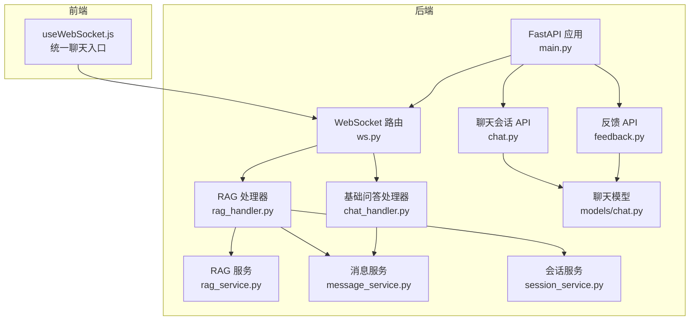
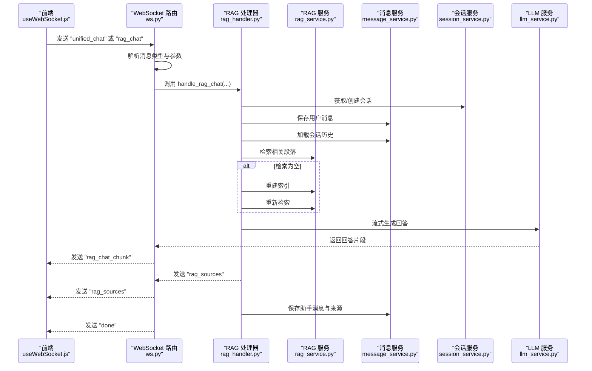
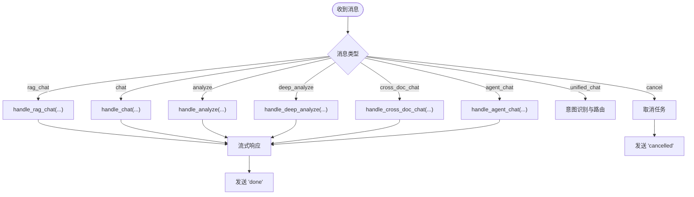
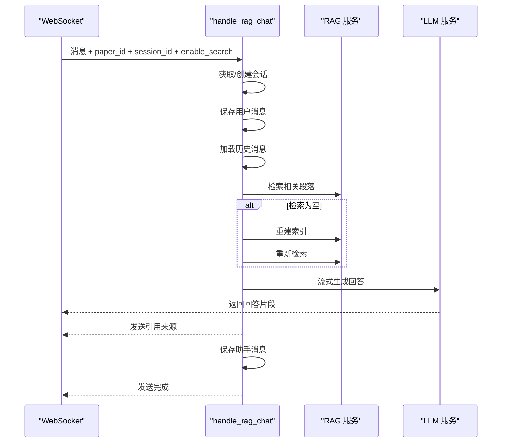
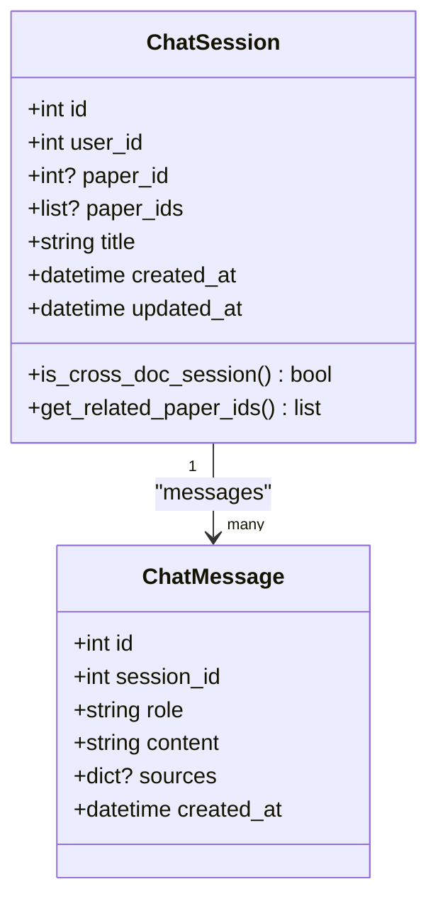
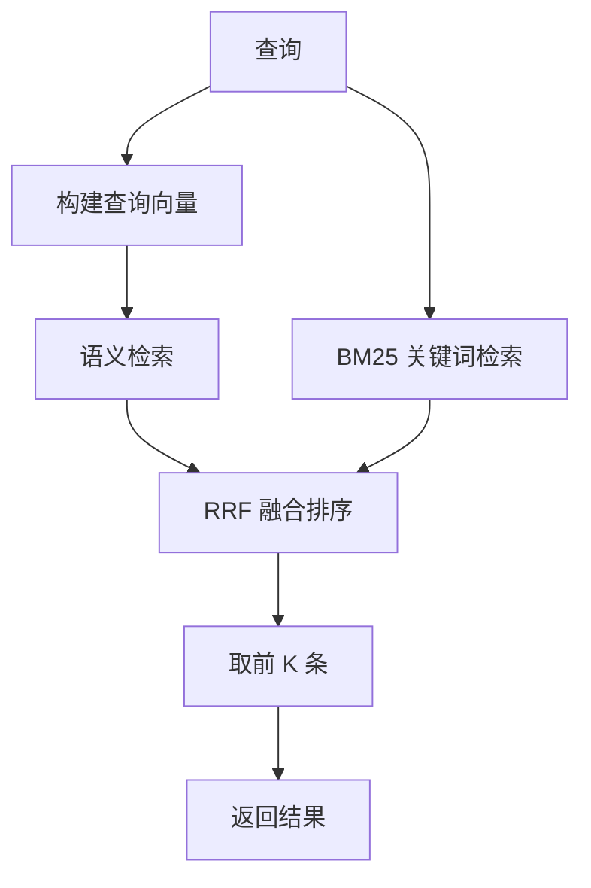
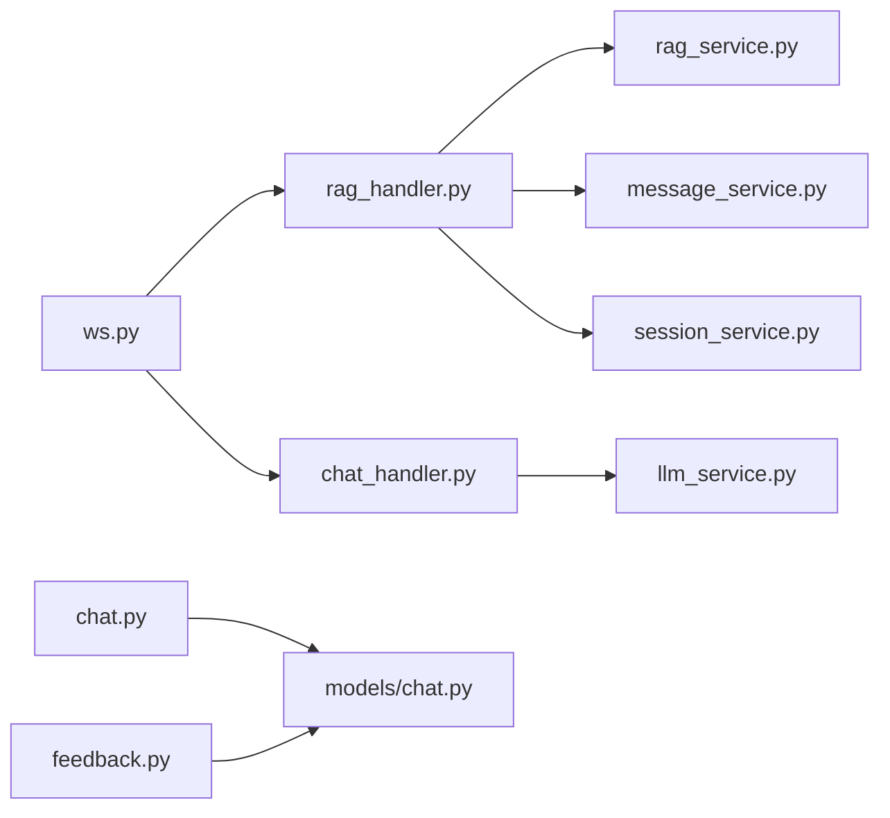

# 问答系统路由

<cite>
**本文档引用的文件**
- [chat.py](file://backend/app/routers/chat.py)
- [ws.py](file://backend/app/routers/ws.py)
- [chat_handler.py](file://backend/app/handlers/chat_handler.py)
- [rag_handler.py](file://backend/app/handlers/rag_handler.py)
- [rag_service.py](file://backend/app/services/rag_service.py)
- [message_service.py](file://backend/app/services/message_service.py)
- [session_service.py](file://backend/app/services/session_service.py)
- [llm_service.py](file://backend/app/services/llm_service.py)
- [chat.py](file://backend/app/models/chat.py)
- [feedback.py](file://backend/app/routers/feedback.py)
- [useWebSocket.js](file://frontend/src/hooks/useWebSocket.js)
- [main.py](file://backend/app/main.py)
- [README.md](file://README.md)
</cite>

## 目录
1. [简介](#简介)
2. [项目结构](#项目结构)
3. [核心组件](#核心组件)
4. [架构总览](#架构总览)
5. [详细组件分析](#详细组件分析)
6. [依赖关系分析](#依赖关系分析)
7. [性能考虑](#性能考虑)
8. [故障排除指南](#故障排除指南)
9. [结论](#结论)
10. [附录](#附录)

## 简介
本文件面向基于 RAG 的智能问答系统，系统采用 FastAPI + WebSocket 实现实时问答、历史对话管理与会话状态控制。后端通过 LangChain 编排 LLM，结合 ChromaDB 向量检索与 BM25 混合检索，提供精准的检索增强生成（RAG）问答能力。前端通过统一聊天入口，支持单论文与跨文档问答、联网搜索、会话持久化与引用溯源。

## 项目结构
后端采用分层架构：
- 路由层：APIRouter 定义 RESTful 接口与 WebSocket 端点
- 处理器层：具体业务逻辑处理（问答、分析、跨文档等）
- 服务层：RAG 检索、消息管理、会话管理、LLM 调用等
- 模型层：SQLAlchemy ORM 映射数据库表结构
- 中间件与配置：错误处理、CORS、生命周期管理

**图表来源**
- [main.py:55-95](file://backend/app/main.py#L55-L95)
- [ws.py:76-436](file://backend/app/routers/ws.py#L76-L436)
- [chat.py:18-417](file://backend/app/routers/chat.py#L18-L417)
- [rag_handler.py:29-217](file://backend/app/handlers/rag_handler.py#L29-L217)
- [chat_handler.py:11-32](file://backend/app/handlers/chat_handler.py#L11-L32)
- [rag_service.py:16-400](file://backend/app/services/rag_service.py#L16-L400)
- [message_service.py:16-104](file://backend/app/services/message_service.py#L16-L104)
- [session_service.py:17-134](file://backend/app/services/session_service.py#L17-L134)
- [chat.py:14-71](file://backend/app/models/chat.py#L14-L71)
- [feedback.py:22-408](file://backend/app/routers/feedback.py#L22-L408)

**章节来源**
- [main.py:55-95](file://backend/app/main.py#L55-L95)
- [README.md:295-332](file://README.md#L295-L332)

## 核心组件
- WebSocket 路由：统一聊天入口，支持多种消息类型（RAG 问答、跨文档问答、分析、Agent 等），并提供流式响应与错误处理。
- RAG 问答处理器：整合检索、上下文组装、流式生成与引用溯源，支持可选联网搜索。
- 会话管理：RESTful API 提供会话的创建、查询、更新、删除与历史消息分页查询；WebSocket 中维护会话状态。
- 消息服务：封装消息的保存、历史加载与论文文本缓存。
- RAG 服务：ChromaDB 向量检索 + BM25 混合检索，支持跨文档检索与索引重建。
- 反馈系统：提供点赞/点踩与文字反馈，支持统计与负面反馈重跑。

**章节来源**
- [ws.py:76-436](file://backend/app/routers/ws.py#L76-L436)
- [rag_handler.py:29-217](file://backend/app/handlers/rag_handler.py#L29-L217)
- [chat.py:21-417](file://backend/app/routers/chat.py#L21-L417)
- [message_service.py:16-104](file://backend/app/services/message_service.py#L16-L104)
- [rag_service.py:16-400](file://backend/app/services/rag_service.py#L16-L400)
- [feedback.py:50-408](file://backend/app/routers/feedback.py#L50-L408)

## 架构总览
系统采用“前端统一入口 + 后端多处理器”的模式。前端通过 useWebSocket.js 建立 WebSocket 连接，发送统一聊天消息，后端根据关键词自动路由到不同处理函数（RAG、跨文档、分析等）。处理器通过服务层调用 RAG 检索与 LLM，最终以流式方式返回结果并附带引用来源。

**图表来源**
- [ws.py:262-417](file://backend/app/routers/ws.py#L262-L417)
- [rag_handler.py:29-217](file://backend/app/handlers/rag_handler.py#L29-L217)
- [rag_service.py:233-307](file://backend/app/services/rag_service.py#L233-L307)
- [message_service.py:56-87](file://backend/app/services/message_service.py#L56-L87)
- [session_service.py:17-43](file://backend/app/services/session_service.py#L17-L43)

## 详细组件分析

### WebSocket 路由与消息协议
- 连接建立：支持 JWT 认证，无 token 时降级为默认用户；断线自动重连。
- 消息类型：
  - analyze/deep_analyze：论文分析
  - chat：基础问答
  - rag_chat：RAG 增强问答（支持 session_id、user_id、enable_search）
  - cross_doc_chat：跨文档问答（paper_ids）
  - unified_chat：统一聊天入口（关键词意图识别）
  - agent_chat：Agent 智能问答（后端实现）
  - cancel：取消当前任务
- 响应类型：
  - analyze_chunk/deep_analyze_chunk/chat_chunk/rag_chat_chunk/cross_doc_chunk：流式数据
  - rag_sources/cross_doc_sources：引用来源
  - search_status：联网搜索状态
  - intent_detected：意图识别结果
  - cancelled/done/error：任务状态与错误

**图表来源**
- [ws.py:114-436](file://backend/app/routers/ws.py#L114-L436)

**章节来源**
- [ws.py:76-436](file://backend/app/routers/ws.py#L76-L436)
- [README.md:295-332](file://README.md#L295-L332)

### RAG 问答处理器
- 会话管理：根据 session_id 获取或创建会话，自动更新标题。
- 上下文组装：加载历史消息，拼接检索到的相关段落与可选网络搜索结果。
- 流式生成：通过 LLM 流式返回回答片段，同时发送引用来源。
- 错误处理：索引缺失时自动重建，无内容时提示用户。

**图表来源**
- [rag_handler.py:29-217](file://backend/app/handlers/rag_handler.py#L29-L217)
- [rag_service.py:233-307](file://backend/app/services/rag_service.py#L233-L307)

**章节来源**
- [rag_handler.py:29-217](file://backend/app/handlers/rag_handler.py#L29-L217)

### 会话管理 API
- 会话列表：支持按论文筛选，返回会话基本信息与消息数量。
- 创建会话：支持单论文与跨文档（paper_ids）。
- 会话详情：返回标题、关联论文、消息历史与消息数量。
- 历史消息：分页查询消息列表。
- 更新/删除会话：支持重命名与删除（级联删除消息）。
- 默认会话：按论文获取或创建默认会话。

**图表来源**
- [chat.py:14-71](file://backend/app/models/chat.py#L14-L71)

**章节来源**
- [chat.py:21-417](file://backend/app/routers/chat.py#L21-L417)
- [chat.py:14-71](file://backend/app/models/chat.py#L14-L71)

### RAG 检索服务
- 向量检索：ChromaDB 持久化存储，按论文独立 collection。
- 混合检索：语义检索 + BM25 关键词检索，RRF 融合排序。
- 智能分块：按文本块自然边界分块，保留页码信息，相邻块重叠。
- 跨文档检索：并行检索多个论文，合并排序。
- 索引管理：支持删除、重建、状态查询与缓存失效。

**图表来源**
- [rag_service.py:233-307](file://backend/app/services/rag_service.py#L233-L307)
- [rag_service.py:102-161](file://backend/app/services/rag_service.py#L102-L161)

**章节来源**
- [rag_service.py:16-400](file://backend/app/services/rag_service.py#L16-L400)

### 消息与会话服务
- 消息服务：保存消息、加载历史、获取论文文本预览与全文缓存。
- 会话服务：获取/创建会话、自动标题、论文对象查询、关键词提取与缓存。

**章节来源**
- [message_service.py:16-104](file://backend/app/services/message_service.py#L16-L104)
- [session_service.py:17-134](file://backend/app/services/session_service.py#L17-L134)

### 反馈系统
- 提交反馈：支持点赞/点踩与文字反馈，重复提交则更新。
- 统计查询：返回总反馈数、好评率、带评论数等。
- 负面反馈重跑：基于记忆与检索重新生成回答。

**章节来源**
- [feedback.py:50-408](file://backend/app/routers/feedback.py#L50-L408)

## 依赖关系分析
- 路由依赖：ws.py 依赖各处理器与服务；chat.py 依赖模型与认证；feedback.py 依赖模型与服务。
- 处理器依赖：rag_handler.py 依赖 rag_service、message_service、session_service、llm_service；chat_handler.py 依赖 llm_service。
- 服务依赖：rag_service 依赖 ChromaDB 与 sentence-transformers；message_service 依赖 PaperTextBlock；session_service 依赖 ChatSession/ChatMessage/Paper。
- 前端依赖：useWebSocket.js 依赖本地存储 token 与 WebSocket API。

**图表来源**
- [ws.py:23-27](file://backend/app/routers/ws.py#L23-L27)
- [rag_handler.py:10-17](file://backend/app/handlers/rag_handler.py#L10-L17)
- [chat_handler.py:8](file://backend/app/handlers/chat_handler.py#L8)
- [chat.py:13-16](file://backend/app/routers/chat.py#L13-L16)
- [feedback.py:13-20](file://backend/app/routers/feedback.py#L13-L20)

**章节来源**
- [ws.py:23-27](file://backend/app/routers/ws.py#L23-L27)
- [rag_handler.py:10-17](file://backend/app/handlers/rag_handler.py#L10-L17)
- [chat_handler.py:8](file://backend/app/handlers/chat_handler.py#L8)
- [chat.py:13-16](file://backend/app/routers/chat.py#L13-L16)
- [feedback.py:13-20](file://backend/app/routers/feedback.py#L13-L20)

## 性能考虑
- 异步与并发：WebSocket 任务以 asyncio.Task 管理，支持取消；RAG 检索与 LLM 流式生成均采用异步。
- 索引与缓存：RAG 服务对 BM25 索引进行缓存，避免重复构建；消息服务对论文全文进行缓存。
- 线程池：向量化模型加载与编码在 ThreadPoolExecutor 中执行，避免阻塞事件循环。
- 检索参数：支持 top_k、chunk_size、chunk_overlap 运行时配置，平衡召回与质量。
- 前端重连：useWebSocket.js 实现指数退避重连，降低网络波动影响。

**章节来源**
- [rag_service.py:41-42](file://backend/app/services/rag_service.py#L41-L42)
- [rag_service.py:52-74](file://backend/app/services/rag_service.py#L52-L74)
- [message_service.py:16-46](file://backend/app/services/message_service.py#L16-L46)
- [ws.py:130-135](file://backend/app/routers/ws.py#L130-L135)
- [useWebSocket.js:19-59](file://frontend/src/hooks/useWebSocket.js#L19-L59)

## 故障排除指南
- WebSocket 未连接：检查 token 与 CORS 配置；确认前端 useWebSocket.js 已正确初始化。
- RAG 问答无结果：确认论文已解析并建立索引；若索引为空，处理器会自动重建。
- 会话不存在：RESTful API 对会话进行归属校验，确保 session_id 属于当前用户。
- 取消任务无效：确保发送 "cancel" 消息且当前存在运行中的任务。
- 联网搜索失败：检查 enable_search 参数与网络可用性；查看 "search_status" 状态。

**章节来源**
- [ws.py:103-107](file://backend/app/routers/ws.py#L103-L107)
- [rag_handler.py:48-89](file://backend/app/handlers/rag_handler.py#L48-L89)
- [chat.py:138-142](file://backend/app/routers/chat.py#L138-L142)
- [ws.py:252-260](file://backend/app/routers/ws.py#L252-L260)

## 结论
本问答系统通过 WebSocket 实现统一聊天入口，结合 RAG 检索与 LLM 流式生成，提供实时、可溯源的智能问答体验。RESTful API 与会话服务保障历史对话的持久化与管理，反馈系统支持用户参与与模型优化。整体架构清晰、扩展性强，适合在学术阅读与知识管理场景中部署与使用。

## 附录

### API 与消息协议定义
- WebSocket 客户端 → 服务器
  - analyze/deep_analyze：text, paper_id
  - chat：message
  - rag_chat：message, paper_id, session_id, user_id, enable_search
  - cross_doc_chat：message, paper_ids, session_id, user_id
  - unified_chat：message, paper_id, paper_ids, session_id, enable_search
  - agent_chat：message, paper_id, paper_ids
  - cancel：无参数
- 服务器 → 客户端
  - analyze_chunk/deep_analyze_chunk/chat_chunk/rag_chat_chunk/cross_doc_chunk：data/content
  - rag_sources/cross_doc_sources：sources
  - search_status：status, results_count
  - intent_detected：intent, tool, confidence, matched
  - cancelled/done：message/channel/session_id
  - error：message

**章节来源**
- [README.md:295-332](file://README.md#L295-L332)
- [ws.py:84-102](file://backend/app/routers/ws.py#L84-L102)

### 问答交互示例
- 统一聊天入口：前端发送 unified_chat，后端根据关键词路由到 rag_chat 或 cross_doc_chat。
- RAG 问答：发送 rag_chat，后端检索相关段落，流式返回回答并附带来源。
- 跨文档问答：发送 cross_doc_chat，后端并行检索多个论文，融合排序后返回。

**章节来源**
- [ws.py:262-417](file://backend/app/routers/ws.py#L262-L417)
- [rag_handler.py:123-193](file://backend/app/handlers/rag_handler.py#L123-L193)

### 调试方法
- 健康检查：GET /api/health
- WebSocket 日志：后端打印连接状态与错误；前端 useWebSocket.js 输出 onerror 与重连状态。
- 会话调试：通过 RESTful API 获取会话详情与历史消息，核对消息来源与时间戳。

**章节来源**
- [main.py:102-114](file://backend/app/main.py#L102-L114)
- [useWebSocket.js:54-56](file://frontend/src/hooks/useWebSocket.js#L54-L56)
- [chat.py:121-171](file://backend/app/routers/chat.py#L121-L171)