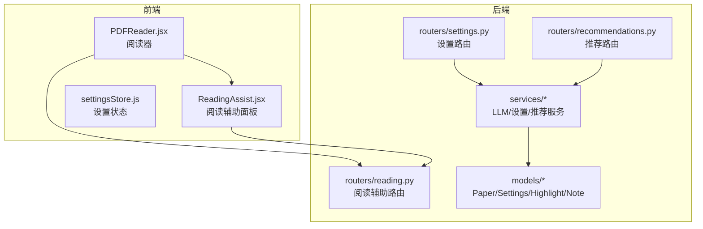
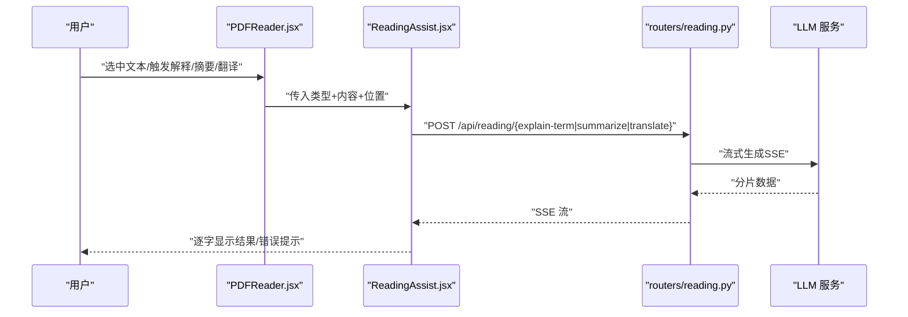
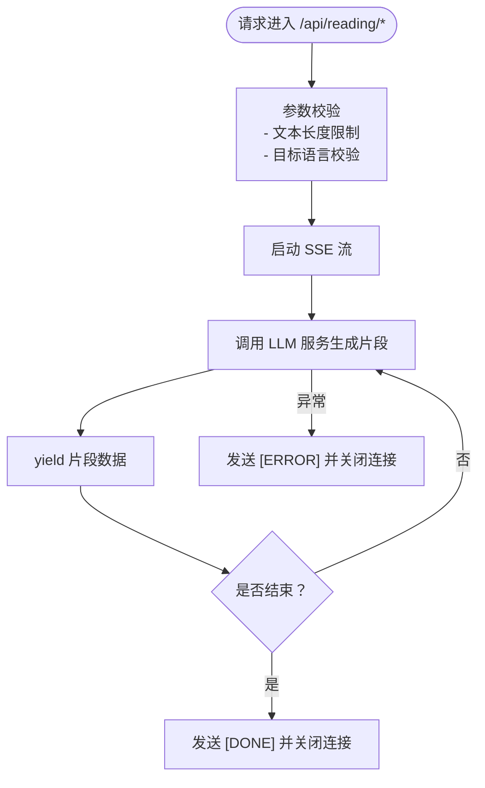
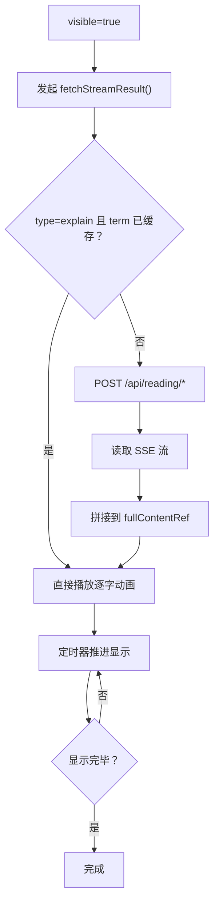
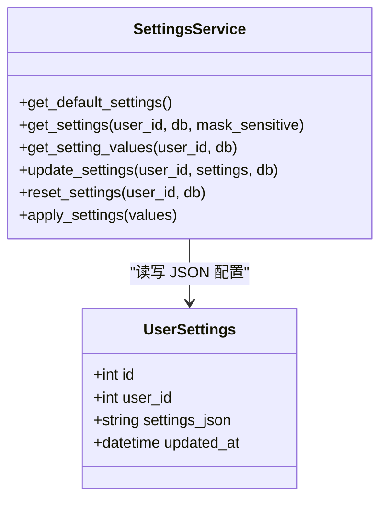
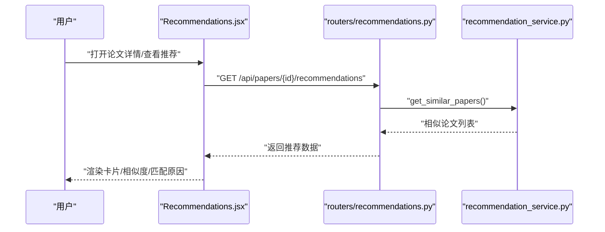
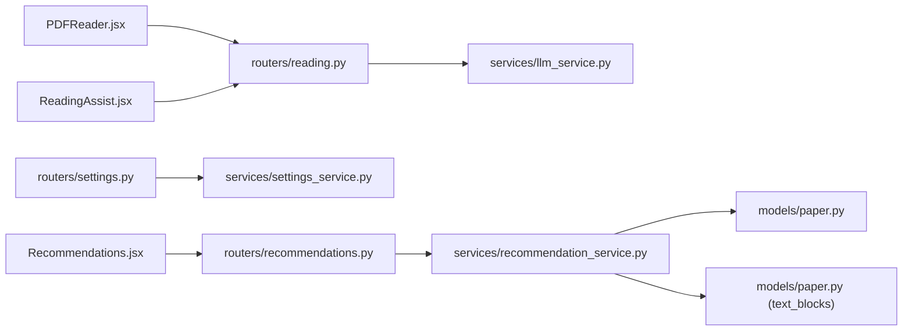

# 阅读辅助路由

<cite>
**本文引用的文件**
- [backend/app/routers/reading.py](file://backend/app/routers/reading.py)
- [backend/app/services/llm_service.py](file://backend/app/services/llm_service.py)
- [frontend/src/components/ReadingAssist/ReadingAssist.jsx](file://frontend/src/components/ReadingAssist/ReadingAssist.jsx)
- [frontend/src/components/PDFReader/PDFReader.jsx](file://frontend/src/components/PDFReader/PDFReader.jsx)
- [backend/app/models/settings.py](file://backend/app/models/settings.py)
- [backend/app/services/settings_service.py](file://backend/app/services/settings_service.py)
- [backend/app/routers/settings.py](file://backend/app/routers/settings.py)
- [frontend/src/stores/settingsStore.js](file://frontend/src/stores/settingsStore.js)
- [backend/app/models/paper.py](file://backend/app/models/paper.py)
- [backend/app/routers/recommendations.py](file://backend/app/routers/recommendations.py)
- [backend/app/services/recommendation_service.py](file://backend/app/services/recommendation_service.py)
- [frontend/src/components/Recommendations/Recommendations.jsx](file://frontend/src/components/Recommendations/Recommendations.jsx)
- [backend/app/models/highlight.py](file://backend/app/models/highlight.py)
- [backend/app/models/note.py](file://backend/app/models/note.py)
</cite>

## 目录
1. [简介](#简介)
2. [项目结构](#项目结构)
3. [核心组件](#核心组件)
4. [架构总览](#架构总览)
5. [详细组件分析](#详细组件分析)
6. [依赖分析](#依赖分析)
7. [性能考虑](#性能考虑)
8. [故障排查指南](#故障排查指南)
9. [结论](#结论)
10. [附录](#附录)

## 简介
本文件聚焦“阅读辅助路由”，系统化梳理阅读体验优化相关的接口设计与实现，覆盖术语解释、文本摘要、翻译等阅读辅助能力；同时结合用户设置、个性化推荐与学习路径规划机制，给出完整的前端交互、后端服务与数据库模型映射，并提供性能监控与用户行为分析建议。

## 项目结构
阅读辅助路由位于后端 FastAPI 路由模块，配合前端阅读器组件与设置系统协同工作，形成“选词即用”的即时阅读辅助体验。

**图表来源**
- [frontend/src/components/PDFReader/PDFReader.jsx:13-656](file://frontend/src/components/PDFReader/PDFReader.jsx#L13-656)
- [frontend/src/components/ReadingAssist/ReadingAssist.jsx:1-309](file://frontend/src/components/ReadingAssist/ReadingAssist.jsx#L1-309)
- [backend/app/routers/reading.py:1-130](file://backend/app/routers/reading.py#L1-130)
- [backend/app/routers/settings.py:1-94](file://backend/app/routers/settings.py#L1-94)
- [backend/app/routers/recommendations.py:1-234](file://backend/app/routers/recommendations.py#L1-234)

**章节来源**
- [backend/app/routers/reading.py:1-130](file://backend/app/routers/reading.py#L1-130)
- [frontend/src/components/PDFReader/PDFReader.jsx:1-656](file://frontend/src/components/PDFReader/PDFReader.jsx#L1-656)
- [frontend/src/components/ReadingAssist/ReadingAssist.jsx:1-309](file://frontend/src/components/ReadingAssist/ReadingAssist.jsx#L1-309)
- [backend/app/routers/settings.py:1-94](file://backend/app/routers/settings.py#L1-94)
- [backend/app/routers/recommendations.py:1-234](file://backend/app/routers/recommendations.py#L1-234)

## 核心组件
- 阅读辅助路由（术语解释/文本摘要/翻译）
  - SSE 流式返回，支持中止与错误处理
  - 文本长度限制，避免超长输入导致性能问题
- 阅读辅助面板（前端）
  - 术语解释缓存、逐字显示、点击外部关闭、复制结果
  - 支持 explain/summarize/translate 三种类型
- 设置系统（外观与行为）
  - 主题、强调色、字体大小、紧凑模式等
  - 前端本地存储与后端持久化同步
- 个性化推荐与学习路径
  - 基于内容相似度与用户画像的推荐
  - 网络学术文献搜索与展示

**章节来源**
- [backend/app/routers/reading.py:15-130](file://backend/app/routers/reading.py#L15-130)
- [frontend/src/components/ReadingAssist/ReadingAssist.jsx:1-309](file://frontend/src/components/ReadingAssist/ReadingAssist.jsx#L1-309)
- [backend/app/services/settings_service.py:19-165](file://backend/app/services/settings_service.py#L19-165)
- [frontend/src/stores/settingsStore.js:1-131](file://frontend/src/stores/settingsStore.js#L1-131)
- [backend/app/routers/recommendations.py:18-234](file://backend/app/routers/recommendations.py#L18-234)

## 架构总览
阅读辅助从“选词触发”开始，前端通过 PDFReader 调起 ReadingAssist，后者根据类型调用后端阅读辅助路由，后端通过 LLM 服务进行流式生成，前端以 SSE 方式接收并呈现。

**图表来源**
- [frontend/src/components/PDFReader/PDFReader.jsx:269-297](file://frontend/src/components/PDFReader/PDFReader.jsx#L269-297)
- [frontend/src/components/ReadingAssist/ReadingAssist.jsx:80-181](file://frontend/src/components/ReadingAssist/ReadingAssist.jsx#L80-181)
- [backend/app/routers/reading.py:32-130](file://backend/app/routers/reading.py#L32-130)

## 详细组件分析

### 阅读辅助路由（术语解释/摘要/翻译）
- 接口职责
  - 术语解释：支持上下文，流式返回
  - 文本摘要：限制长度，流式返回
  - 文本翻译：目标语言可选，流式返回
- 安全与健壮性
  - 使用 SSE，设置必要的响应头
  - 异常捕获并以错误标记返回
  - 输入长度限制，避免模型上下文溢出
- 与 LLM 服务协作
  - 通过统一的 LLM 服务入口调用具体提示模板

**图表来源**
- [backend/app/routers/reading.py:74-94](file://backend/app/routers/reading.py#L74-94)
- [backend/app/routers/reading.py:113-129](file://backend/app/routers/reading.py#L113-129)

**章节来源**
- [backend/app/routers/reading.py:15-130](file://backend/app/routers/reading.py#L15-130)
- [backend/app/services/llm_service.py:1-53](file://backend/app/services/llm_service.py#L1-53)

### 阅读辅助面板（前端）
- 交互特性
  - 术语解释缓存（Map），避免重复请求
  - 逐字显示动画，字符间隔可配置
  - 点击外部关闭、复制结果、中止请求
- 生命周期管理
  - 组件卸载时清理定时器与 AbortController
  - 可视性变化时触发数据拉取
- 位置与边界
  - 根据触发位置计算面板位置，自动避障

**图表来源**
- [frontend/src/components/ReadingAssist/ReadingAssist.jsx:80-181](file://frontend/src/components/ReadingAssist/ReadingAssist.jsx#L80-181)
- [frontend/src/components/ReadingAssist/ReadingAssist.jsx:47-78](file://frontend/src/components/ReadingAssist/ReadingAssist.jsx#L47-78)

**章节来源**
- [frontend/src/components/ReadingAssist/ReadingAssist.jsx:1-309](file://frontend/src/components/ReadingAssist/ReadingAssist.jsx#L1-309)

### 设置系统（外观与行为）
- 配置分类
  - appearance：主题、强调色、字体大小、紧凑模式
  - llm：模型、温度、最大 Token、API Key、Base URL
  - rag/search：检索数量、分块大小、块重叠、最大结果、超时
  - general：最大文件大小、聊天历史条数
- 前后端协作
  - 前端本地存储外观设置，提升首次渲染体验
  - 后端提供完整配置与纯值配置两类接口
  - 更新设置后应用到运行时服务

**图表来源**
- [backend/app/services/settings_service.py:168-523](file://backend/app/services/settings_service.py#L168-523)
- [backend/app/models/settings.py:11-30](file://backend/app/models/settings.py#L11-30)

**章节来源**
- [backend/app/services/settings_service.py:19-165](file://backend/app/services/settings_service.py#L19-165)
- [backend/app/routers/settings.py:17-94](file://backend/app/routers/settings.py#L17-94)
- [frontend/src/stores/settingsStore.js:18-128](file://frontend/src/stores/settingsStore.js#L18-128)

### 个性化推荐与学习路径
- 推荐类型
  - 相似论文：基于余弦相似度
  - 个性化推荐：基于用户画像（研究兴趣、术语使用、背景）
  - 网络学术推荐：基于 arXiv/Google Scholar 等站点搜索
- 学习路径
  - 未读/阅读中优先级权重
  - 时间衰减因子
  - 匹配原因可视化（前端）

**图表来源**
- [frontend/src/components/Recommendations/Recommendations.jsx:13-265](file://frontend/src/components/Recommendations/Recommendations.jsx#L13-265)
- [backend/app/routers/recommendations.py:18-76](file://backend/app/routers/recommendations.py#L18-76)
- [backend/app/services/recommendation_service.py:150-258](file://backend/app/services/recommendation_service.py#L150-258)

**章节来源**
- [backend/app/routers/recommendations.py:18-234](file://backend/app/routers/recommendations.py#L18-234)
- [backend/app/services/recommendation_service.py:20-565](file://backend/app/services/recommendation_service.py#L20-565)
- [frontend/src/components/Recommendations/Recommendations.jsx:1-265](file://frontend/src/components/Recommendations/Recommendations.jsx#L1-265)

### 阅读器配置、快捷键与无障碍
- 阅读器配置
  - 单页/滚动视图模式、缩放、适配宽度、页码跳转
  - 高亮标注与笔记关联
- 快捷键
  - 方向键/空格键/首页/末页导航
- 无障碍
  - 建议：为工具栏与面板提供 ARIA 标签、键盘可达性与屏幕阅读器提示

**章节来源**
- [frontend/src/components/PDFReader/PDFReader.jsx:119-154](file://frontend/src/components/PDFReader/PDFReader.jsx#L119-154)
- [frontend/src/components/PDFReader/PDFReader.jsx:380-481](file://frontend/src/components/PDFReader/PDFReader.jsx#L380-481)
- [backend/app/models/highlight.py:10-37](file://backend/app/models/highlight.py#L10-37)
- [backend/app/models/note.py:11-34](file://backend/app/models/note.py#L11-34)

## 依赖分析
- 阅读辅助路由依赖 LLM 服务进行流式生成
- 设置路由与服务负责用户配置的持久化与运行时应用
- 推荐路由依赖推荐服务，后者依赖记忆/嵌入模型与论文文本块
- 前端组件通过 store 与路由交互，实现设置与推荐的双向同步

**图表来源**
- [backend/app/routers/reading.py](file://backend/app/routers/reading.py#L10)
- [backend/app/services/llm_service.py:1-53](file://backend/app/services/llm_service.py#L1-53)
- [backend/app/routers/settings.py](file://backend/app/routers/settings.py#L12)
- [backend/app/services/settings_service.py:13-14](file://backend/app/services/settings_service.py#L13-14)
- [backend/app/routers/recommendations.py](file://backend/app/routers/recommendations.py#L13)
- [backend/app/services/recommendation_service.py:14-15](file://backend/app/services/recommendation_service.py#L14-15)
- [backend/app/models/paper.py:65-85](file://backend/app/models/paper.py#L65-85)

**章节来源**
- [backend/app/routers/reading.py:1-130](file://backend/app/routers/reading.py#L1-130)
- [backend/app/routers/settings.py:1-94](file://backend/app/routers/settings.py#L1-94)
- [backend/app/routers/recommendations.py:1-234](file://backend/app/routers/recommendations.py#L1-234)
- [backend/app/services/recommendation_service.py:1-565](file://backend/app/services/recommendation_service.py#L1-565)

## 性能考虑
- 流式传输
  - SSE 分片输出，前端逐字显示，降低首屏等待
- 文本截断
  - 阅读辅助接口对输入文本进行长度限制，避免超长请求
- 缓存策略
  - 术语解释结果缓存（前端 Map），减少重复请求
  - 推荐服务嵌入向量缓存，刷新时可按需清理
- 懒加载与视图优化
  - 滚动模式下使用 IntersectionObserver 预加载邻近页面
- 设置应用
  - 更新设置后异步应用到运行时服务，避免阻塞请求

**章节来源**
- [backend/app/routers/reading.py:74-76](file://backend/app/routers/reading.py#L74-76)
- [frontend/src/components/ReadingAssist/ReadingAssist.jsx:84-92](file://frontend/src/components/ReadingAssist/ReadingAssist.jsx#L84-92)
- [backend/app/services/recommendation_service.py:29-43](file://backend/app/services/recommendation_service.py#L29-43)
- [frontend/src/components/PDFReader/PDFReader.jsx:315-362](file://frontend/src/components/PDFReader/PDFReader.jsx#L315-362)

## 故障排查指南
- 阅读辅助无响应
  - 检查网络与 SSE 连接状态
  - 查看前端错误提示与后端异常返回
- 术语解释重复请求
  - 确认 termCache 是否命中
  - 清理缓存后重试
- 设置未生效
  - 确认后端返回的完整配置与前端本地存储是否一致
  - 检查设置路由返回值与运行时应用日志
- 推荐结果为空
  - 检查论文嵌入是否计算成功
  - 若无用户画像，个性化推荐将退化为最近论文

**章节来源**
- [frontend/src/components/ReadingAssist/ReadingAssist.jsx:174-181](file://frontend/src/components/ReadingAssist/ReadingAssist.jsx#L174-181)
- [backend/app/services/settings_service.py:454-518](file://backend/app/services/settings_service.py#L454-518)
- [backend/app/services/recommendation_service.py:177-183](file://backend/app/services/recommendation_service.py#L177-183)

## 结论
阅读辅助路由通过“选词即用”的交互与流式生成，显著提升了阅读体验。结合设置系统与个性化推荐，形成从“即时理解”到“持续学习”的闭环。建议在生产环境中进一步完善性能监控与用户行为分析，以持续优化推荐质量与交互流畅度。

## 附录
- 阅读进度与统计
  - 可基于论文模型中的阅读状态与最后阅读时间字段扩展阅读统计接口
- 无障碍增强
  - 为工具栏、面板与快捷键提供键盘可达性与屏幕阅读器支持
- 学习效果评估
  - 可结合高亮与笔记数据，统计阅读深度与知识留存指标

**章节来源**
- [backend/app/models/paper.py:27-29](file://backend/app/models/paper.py#L27-29)
- [backend/app/models/highlight.py:18-22](file://backend/app/models/highlight.py#L18-22)
- [backend/app/models/note.py](file://backend/app/models/note.py#L23)