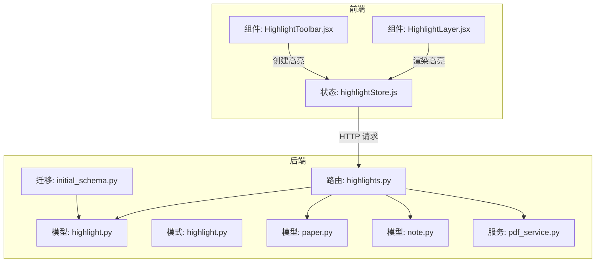
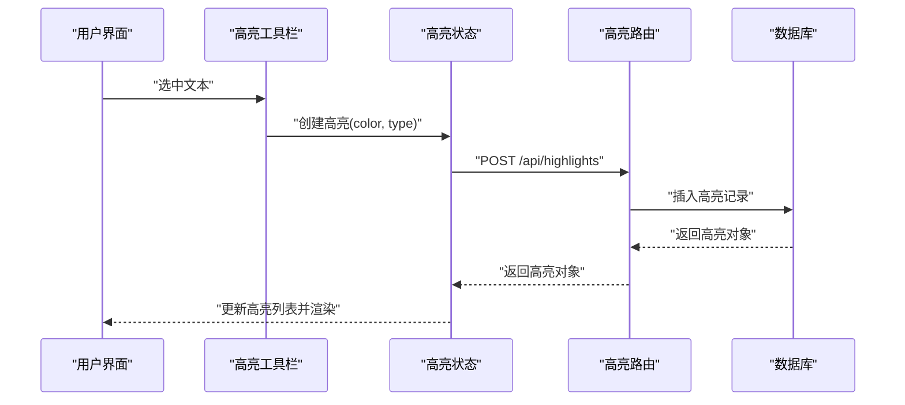
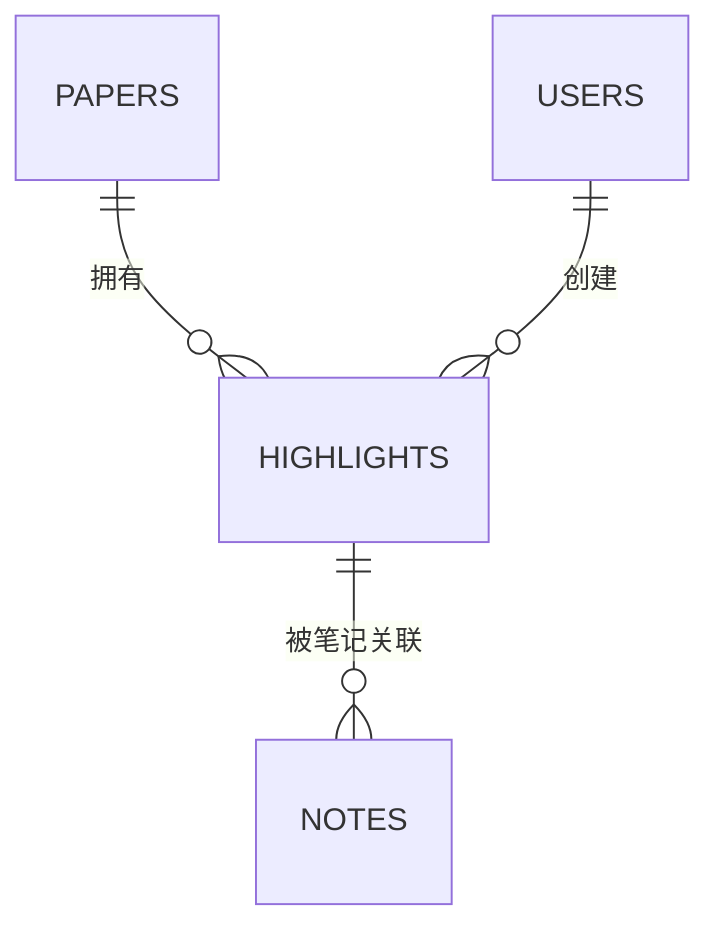
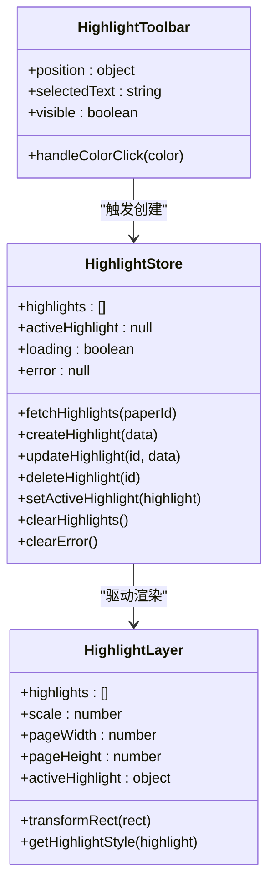
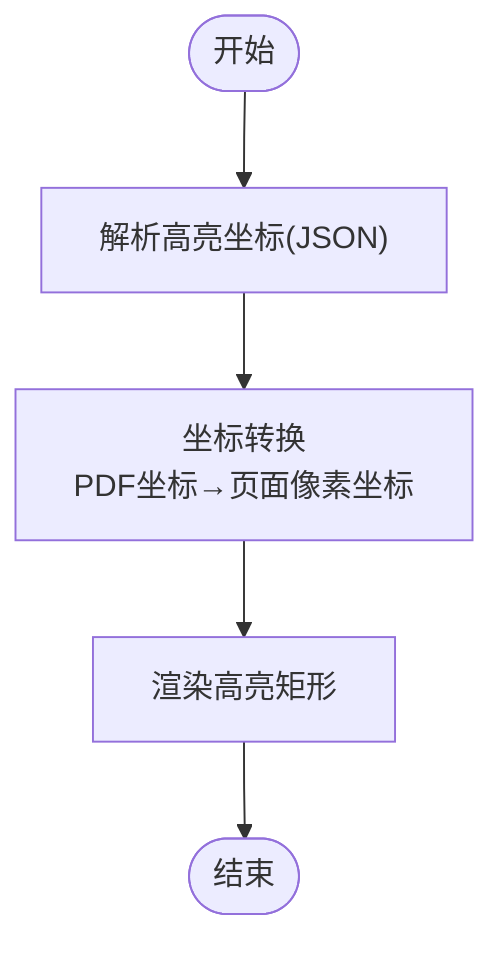
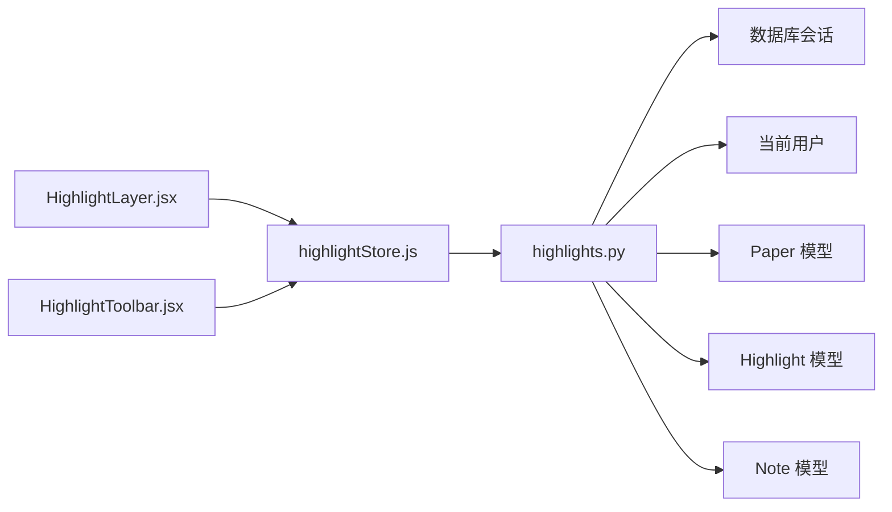

# 高亮标注路由

<cite>
**本文档引用的文件**
- [backend/app/routers/highlights.py](file://backend/app/routers/highlights.py)
- [backend/app/models/highlight.py](file://backend/app/models/highlight.py)
- [backend/app/schemas/highlight.py](file://backend/app/schemas/highlight.py)
- [backend/app/models/paper.py](file://backend/app/models/paper.py)
- [backend/app/models/note.py](file://backend/app/models/note.py)
- [backend/app/services/pdf_service.py](file://backend/app/services/pdf_service.py)
- [backend/migrations/versions/6895243c431d_initial_schema.py](file://backend/migrations/versions/6895243c431d_initial_schema.py)
- [frontend/src/stores/highlightStore.js](file://frontend/src/stores/highlightStore.js)
- [frontend/src/components/HighlightLayer/HighlightLayer.jsx](file://frontend/src/components/HighlightLayer/HighlightLayer.jsx)
- [frontend/src/components/HighlightToolbar/HighlightToolbar.jsx](file://frontend/src/components/HighlightToolbar/HighlightToolbar.jsx)
- [README.md](file://README.md)
</cite>

## 目录
1. [简介](#简介)
2. [项目结构](#项目结构)
3. [核心组件](#核心组件)
4. [架构总览](#架构总览)
5. [详细组件分析](#详细组件分析)
6. [依赖关系分析](#依赖关系分析)
7. [性能考虑](#性能考虑)
8. [故障排除指南](#故障排除指南)
9. [结论](#结论)

## 简介
本文件系统性地文档化了论文高亮标注的路由与实现，涵盖 CRUD 操作 API 设计、坐标计算与文本范围定位、颜色管理与标注同步机制、高亮数据结构与批量操作接口、权限控制策略、请求响应格式、坐标系统说明以及实际使用示例，并提供高亮冲突处理与数据一致性保证方案。

## 项目结构
高亮标注功能位于后端 FastAPI 路由模块与前端组件之间，通过 API 进行数据交互。后端负责权限校验、数据持久化与查询；前端负责高亮渲染、工具栏交互与状态管理。

图表来源
- [backend/app/routers/highlights.py:1-189](file://backend/app/routers/highlights.py#L1-L189)
- [backend/app/models/highlight.py:1-37](file://backend/app/models/highlight.py#L1-L37)
- [backend/app/schemas/highlight.py:1-37](file://backend/app/schemas/highlight.py#L1-L37)
- [backend/app/models/paper.py:1-85](file://backend/app/models/paper.py#L1-L85)
- [backend/app/models/note.py:1-34](file://backend/app/models/note.py#L1-L34)
- [backend/app/services/pdf_service.py:1-194](file://backend/app/services/pdf_service.py#L1-L194)
- [backend/migrations/versions/6895243c431d_initial_schema.py:1-61](file://backend/migrations/versions/6895243c431d_initial_schema.py#L1-L61)
- [frontend/src/stores/highlightStore.js:1-102](file://frontend/src/stores/highlightStore.js#L1-L102)
- [frontend/src/components/HighlightLayer/HighlightLayer.jsx:1-119](file://frontend/src/components/HighlightLayer/HighlightLayer.jsx#L1-L119)
- [frontend/src/components/HighlightToolbar/HighlightToolbar.jsx:1-210](file://frontend/src/components/HighlightToolbar/HighlightToolbar.jsx#L1-L210)

章节来源
- [backend/app/routers/highlights.py:1-189](file://backend/app/routers/highlights.py#L1-L189)
- [frontend/src/stores/highlightStore.js:1-102](file://frontend/src/stores/highlightStore.js#L1-L102)

## 核心组件
- 路由层：提供高亮标注的 GET/POST/PUT/DELETE 接口，进行权限校验与数据查询。
- 模型层：定义高亮标注的数据结构、字段约束与关系映射。
- 模式层：定义请求/响应的 Pydantic 模型，确保输入输出规范化。
- 服务层：PDF 解析与文本块提取，为高亮坐标计算提供基础能力。
- 前端状态与组件：高亮状态管理、高亮渲染层、高亮工具栏。

章节来源
- [backend/app/routers/highlights.py:17-189](file://backend/app/routers/highlights.py#L17-L189)
- [backend/app/models/highlight.py:10-37](file://backend/app/models/highlight.py#L10-L37)
- [backend/app/schemas/highlight.py:7-37](file://backend/app/schemas/highlight.py#L7-L37)
- [backend/app/services/pdf_service.py:11-194](file://backend/app/services/pdf_service.py#L11-L194)
- [frontend/src/stores/highlightStore.js:4-99](file://frontend/src/stores/highlightStore.js#L4-L99)

## 架构总览
高亮标注的端到端流程如下：
- 前端用户在 PDF 阅读器中选中文本，触发高亮工具栏，选择颜色与标注类型。
- 前端调用后端创建高亮接口，携带论文 ID、页码、坐标集合、颜色与标注类型。
- 后端校验论文归属与权限，写入数据库并返回高亮对象。
- 前端状态更新高亮列表，渲染高亮层覆盖在 PDF 页面上。

图表来源
- [frontend/src/components/HighlightToolbar/HighlightToolbar.jsx:67-71](file://frontend/src/components/HighlightToolbar/HighlightToolbar.jsx#L67-L71)
- [frontend/src/stores/highlightStore.js:27-44](file://frontend/src/stores/highlightStore.js#L27-L44)
- [backend/app/routers/highlights.py:58-105](file://backend/app/routers/highlights.py#L58-L105)

## 详细组件分析

### 路由层：高亮 CRUD 接口
- GET /api/highlights/paper/{paper_id}
  - 功能：按论文 ID 查询该论文下的所有高亮标注，按页码与创建时间排序。
  - 权限：仅允许论文归属当前用户。
  - 响应：高亮标注列表（响应模型）。
- POST /api/highlights
  - 功能：创建新的高亮标注。
  - 请求体：创建模型（paper_id、page、rects、color、highlight_type、selected_text）。
  - 权限：仅允许论文归属当前用户。
  - 响应：创建成功的高亮对象。
- PUT /api/highlights/{highlight_id}
  - 功能：更新高亮标注的颜色与类型。
  - 请求体：更新模型（color、highlight_type）。
  - 权限：仅允许高亮归属当前用户。
  - 响应：更新后的高亮对象。
- DELETE /api/highlights/{highlight_id}
  - 功能：删除指定高亮标注。
  - 权限：仅允许高亮归属当前用户。
  - 响应：204 No Content。

章节来源
- [backend/app/routers/highlights.py:20-55](file://backend/app/routers/highlights.py#L20-L55)
- [backend/app/routers/highlights.py:58-105](file://backend/app/routers/highlights.py#L58-L105)
- [backend/app/routers/highlights.py:108-151](file://backend/app/routers/highlights.py#L108-L151)
- [backend/app/routers/highlights.py:154-186](file://backend/app/routers/highlights.py#L154-L186)

### 模型层：高亮数据结构
- 表结构要点
  - 主键：id
  - 外键：paper_id（关联论文）、user_id（关联用户）
  - 字段：page（页码）、rects（JSON 字符串，表示多个矩形区域）、color（颜色，默认黄色）、highlight_type（标注类型，默认高亮）、selected_text（选中文本）、created_at/updated_at（时间戳）
  - 关系：与 Paper、User、Note 的一对多/多对一关系，Note 与 Highlight 的级联删除
- 索引与约束
  - highlights.paper_id、highlights.user_id 建有索引，便于查询与权限过滤
  - 外键约束保证论文与用户存在性

图表来源
- [backend/app/models/highlight.py:10-37](file://backend/app/models/highlight.py#L10-L37)
- [backend/app/models/paper.py:45-49](file://backend/app/models/paper.py#L45-L49)
- [backend/app/models/note.py:17-30](file://backend/app/models/note.py#L17-L30)
- [backend/migrations/versions/6895243c431d_initial_schema.py:26-27](file://backend/migrations/versions/6895243c431d_initial_schema.py#L26-L27)

章节来源
- [backend/app/models/highlight.py:10-37](file://backend/app/models/highlight.py#L10-L37)
- [backend/migrations/versions/6895243c431d_initial_schema.py:26-27](file://backend/migrations/versions/6895243c431d_initial_schema.py#L26-L27)

### 模式层：请求与响应模型
- 创建模型（HighlightCreate）
  - 字段：paper_id、page、rects（JSON 字符串）、color（默认值）、highlight_type（默认值）、selected_text
- 更新模型（HighlightUpdate）
  - 字段：color（可选）、highlight_type（可选）
- 响应模型（HighlightResponse）
  - 字段：id、paper_id、user_id、page、rects、color、highlight_type、selected_text、created_at、updated_at

章节来源
- [backend/app/schemas/highlight.py:7-37](file://backend/app/schemas/highlight.py#L7-L37)

### 前端状态与组件
- 高亮状态管理（highlightStore.js）
  - 提供加载、创建、更新、删除高亮的方法，维护高亮列表与当前选中高亮
  - 错误处理：捕获后端错误并设置错误状态
- 高亮渲染层（HighlightLayer.jsx）
  - 将 PDF 坐标转换为页面像素坐标，渲染高亮区域
  - 支持多种标注类型（高亮、下划线、删除线），并根据选中状态调整透明度
- 高亮工具栏（HighlightToolbar.jsx）
  - 提供颜色选择、下划线、添加笔记、术语解释、摘要、翻译、保存到知识库等操作入口

图表来源
- [frontend/src/stores/highlightStore.js:4-99](file://frontend/src/stores/highlightStore.js#L4-L99)
- [frontend/src/components/HighlightLayer/HighlightLayer.jsx:16-119](file://frontend/src/components/HighlightLayer/HighlightLayer.jsx#L16-L119)
- [frontend/src/components/HighlightToolbar/HighlightToolbar.jsx:28-210](file://frontend/src/components/HighlightToolbar/HighlightToolbar.jsx#L28-L210)

章节来源
- [frontend/src/stores/highlightStore.js:4-99](file://frontend/src/stores/highlightStore.js#L4-L99)
- [frontend/src/components/HighlightLayer/HighlightLayer.jsx:16-119](file://frontend/src/components/HighlightLayer/HighlightLayer.jsx#L16-L119)
- [frontend/src/components/HighlightToolbar/HighlightToolbar.jsx:28-210](file://frontend/src/components/HighlightToolbar/HighlightToolbar.jsx#L28-L210)

### 坐标系统与文本范围定位
- 坐标转换
  - PDF 坐标系：左下角为原点，y 轴向上
  - 页面坐标系：左上角为原点，y 轴向下
  - 转换逻辑：将 PDF 的 x0/y0/x1/y1 乘以缩放比例，并翻转 y 轴得到页面像素坐标
- 文本范围定位
  - 高亮坐标以 JSON 字符串形式存储，每个高亮可包含多个矩形区域
  - 前端解析 JSON 并逐个绘制矩形
- PDF 文本块提取
  - 服务层提供文本块提取能力，按行分组字符，合并形成文本块并计算边界框，为后续坐标匹配与范围定位提供基础

图表来源
- [frontend/src/components/HighlightLayer/HighlightLayer.jsx:24-34](file://frontend/src/components/HighlightLayer/HighlightLayer.jsx#L24-L34)
- [backend/app/services/pdf_service.py:59-118](file://backend/app/services/pdf_service.py#L59-L118)

章节来源
- [frontend/src/components/HighlightLayer/HighlightLayer.jsx:24-34](file://frontend/src/components/HighlightLayer/HighlightLayer.jsx#L24-L34)
- [backend/app/services/pdf_service.py:59-118](file://backend/app/services/pdf_service.py#L59-L118)

### 颜色管理与标注类型
- 颜色
  - 默认颜色：黄色（#FFEB3B）
  - 工具栏提供预设颜色（黄、绿、蓝、红）
  - 渲染层根据颜色与类型动态生成样式（高亮、下划线、删除线）
- 标注类型
  - highlight（默认）
  - underline（下划线）
  - strikethrough（删除线）

章节来源
- [backend/app/schemas/highlight.py:12-14](file://backend/app/schemas/highlight.py#L12-L14)
- [frontend/src/components/HighlightToolbar/HighlightToolbar.jsx:5-10](file://frontend/src/components/HighlightToolbar/HighlightToolbar.jsx#L5-L10)
- [frontend/src/components/HighlightLayer/HighlightLayer.jsx:45-65](file://frontend/src/components/HighlightLayer/HighlightLayer.jsx#L45-L65)

### 权限控制策略
- 论文权限
  - 查询高亮时，后端同时校验 paper_id 与 user_id，确保论文归属当前用户
- 高亮权限
  - 更新与删除高亮时，同样校验高亮归属当前用户
- 结果
  - 若无权限或资源不存在，返回 404 错误

章节来源
- [backend/app/routers/highlights.py:35-45](file://backend/app/routers/highlights.py#L35-L45)
- [backend/app/routers/highlights.py:128-140](file://backend/app/routers/highlights.py#L128-L140)
- [backend/app/routers/highlights.py:169-181](file://backend/app/routers/highlights.py#L169-L181)

### 请求与响应格式
- 创建高亮
  - 请求体：paper_id、page、rects（JSON 字符串）、color、highlight_type、selected_text
  - 响应：完整高亮对象（包含 id、user_id、created_at、updated_at 等）
- 更新高亮
  - 请求体：color、highlight_type（可选）
  - 响应：更新后的高亮对象
- 查询高亮
  - 路径参数：paper_id
  - 响应：高亮对象数组
- 删除高亮
  - 路径参数：highlight_id
  - 响应：204 No Content

章节来源
- [backend/app/schemas/highlight.py:7-37](file://backend/app/schemas/highlight.py#L7-L37)
- [backend/app/routers/highlights.py:20-55](file://backend/app/routers/highlights.py#L20-L55)
- [backend/app/routers/highlights.py:58-105](file://backend/app/routers/highlights.py#L58-L105)
- [backend/app/routers/highlights.py:108-151](file://backend/app/routers/highlights.py#L108-L151)
- [backend/app/routers/highlights.py:154-186](file://backend/app/routers/highlights.py#L154-L186)

### 实际使用示例
- 创建高亮
  - 前端：用户在 PDF 中选中文本，点击工具栏颜色按钮，触发创建高亮
  - 后端：接收请求体，校验论文归属，写入数据库并返回高亮对象
  - 前端：更新本地高亮列表并重新渲染
- 更新高亮
  - 前端：用户在工具栏选择“下划线”或更换颜色，触发更新
  - 后端：仅更新指定字段，返回最新高亮对象
- 删除高亮
  - 前端：用户点击高亮或工具栏删除按钮，触发删除
  - 后端：校验权限并删除记录，返回 204
- 查询高亮
  - 前端：进入论文阅读页面时，按论文 ID 请求高亮列表
  - 后端：返回该论文下当前用户的全部高亮

章节来源
- [frontend/src/components/HighlightToolbar/HighlightToolbar.jsx:67-71](file://frontend/src/components/HighlightToolbar/HighlightToolbar.jsx#L67-L71)
- [frontend/src/stores/highlightStore.js:27-44](file://frontend/src/stores/highlightStore.js#L27-L44)
- [backend/app/routers/highlights.py:58-105](file://backend/app/routers/highlights.py#L58-L105)
- [backend/app/routers/highlights.py:108-151](file://backend/app/routers/highlights.py#L108-L151)
- [backend/app/routers/highlights.py:154-186](file://backend/app/routers/highlights.py#L154-L186)
- [backend/app/routers/highlights.py:20-55](file://backend/app/routers/highlights.py#L20-L55)

### 批量操作接口
- 当前实现
  - 后端未提供批量创建/删除高亮的专门接口
- 建议方案
  - 批量创建：前端一次提交多个高亮对象，后端循环处理并返回结果
  - 批量删除：前端传入高亮 ID 数组，后端批量删除并返回状态
  - 注意：批量操作需在事务中执行，确保原子性与一致性

[本节为概念性建议，不直接分析具体文件，故不附加章节来源]

### 高亮冲突处理与数据一致性
- 冲突检测
  - 坐标重叠：前端在创建高亮时可对同一页面的矩形进行去重或合并
  - 文本重复：后端可增加唯一约束或去重逻辑（如按 selected_text + page + rects 去重）
- 一致性保证
  - 事务：批量操作在单个事务中执行
  - 级联删除：高亮删除时，Notes 也应级联删除，避免悬挂数据
  - 索引：对 paper_id、user_id 建立索引，提高查询与权限校验效率

章节来源
- [backend/app/models/highlight.py:29-33](file://backend/app/models/highlight.py#L29-L33)
- [backend/migrations/versions/6895243c431d_initial_schema.py:26-27](file://backend/migrations/versions/6895243c431d_initial_schema.py#L26-L27)

## 依赖关系分析
- 路由依赖
  - 依赖数据库会话与当前用户身份验证中间件
  - 依赖论文模型进行权限校验
- 模型依赖
  - 高亮模型依赖论文与用户模型的关系
  - Notes 与高亮建立级联删除关系
- 前端依赖
  - 高亮状态依赖 API 层提供的 CRUD 方法
  - 渲染层依赖工具栏组件传递的颜色与类型

图表来源
- [backend/app/routers/highlights.py:10-15](file://backend/app/routers/highlights.py#L10-L15)
- [backend/app/models/highlight.py:26-33](file://backend/app/models/highlight.py#L26-L33)
- [frontend/src/stores/highlightStore.js:1-3](file://frontend/src/stores/highlightStore.js#L1-L3)

章节来源
- [backend/app/routers/highlights.py:10-15](file://backend/app/routers/highlights.py#L10-L15)
- [backend/app/models/highlight.py:26-33](file://backend/app/models/highlight.py#L26-L33)
- [frontend/src/stores/highlightStore.js:1-3](file://frontend/src/stores/highlightStore.js#L1-L3)

## 性能考虑
- 查询优化
  - 为 paper_id、user_id 建立索引，减少权限校验与查询成本
- 渲染优化
  - 前端仅渲染当前页高亮，避免一次性渲染过多矩形
  - 使用 CSS 动画与透明度变化，减少重绘
- 批量操作
  - 批量创建/删除应在后端使用批量插入/删除，减少往返次数

章节来源
- [backend/migrations/versions/6895243c431d_initial_schema.py:26-27](file://backend/migrations/versions/6895243c431d_initial_schema.py#L26-L27)
- [frontend/src/components/HighlightLayer/HighlightLayer.jsx:68-70](file://frontend/src/components/HighlightLayer/HighlightLayer.jsx#L68-L70)

## 故障排除指南
- 404 论文不存在或无权限访问
  - 检查 paper_id 是否正确，确认论文归属当前用户
- 404 高亮不存在或无权限
  - 检查 highlight_id 是否正确，确认高亮归属当前用户
- 坐标渲染异常
  - 检查 rects JSON 是否有效，确认缩放比例与页面尺寸
- 颜色/类型不生效
  - 确认前端样式逻辑与后端存储一致，检查类型枚举值

章节来源
- [backend/app/routers/highlights.py:41-45](file://backend/app/routers/highlights.py#L41-L45)
- [backend/app/routers/highlights.py:136-140](file://backend/app/routers/highlights.py#L136-L140)
- [backend/app/routers/highlights.py:177-181](file://backend/app/routers/highlights.py#L177-L181)
- [frontend/src/components/HighlightLayer/HighlightLayer.jsx:82-87](file://frontend/src/components/HighlightLayer/HighlightLayer.jsx#L82-L87)

## 结论
高亮标注路由提供了完善的 CRUD 能力，结合前端渲染与工具栏交互，实现了从选中到创建、更新、删除与查询的完整闭环。通过权限校验、索引优化与坐标转换机制，系统在功能完整性与性能方面均具备良好表现。建议后续引入批量操作接口与冲突检测机制，进一步提升用户体验与数据一致性保障。