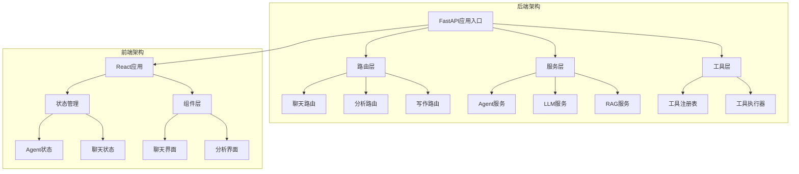
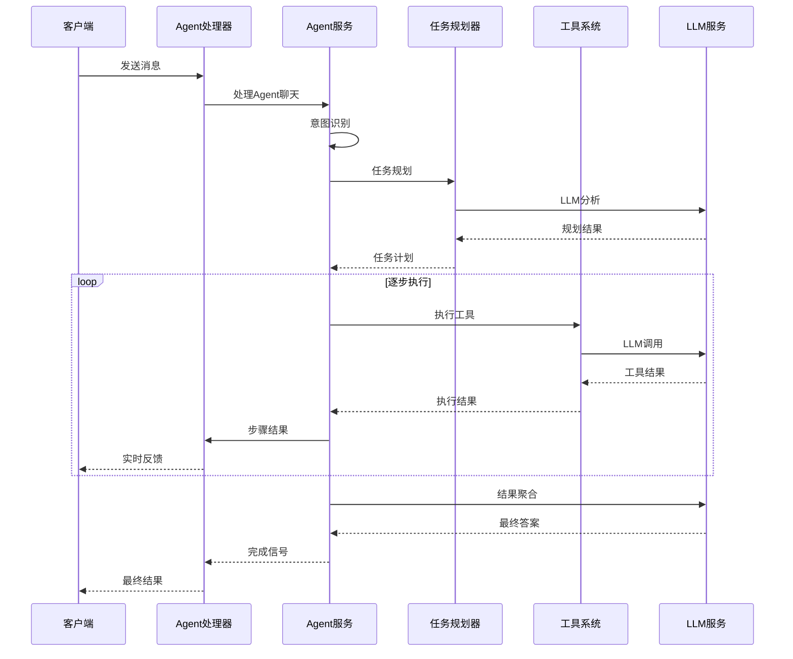
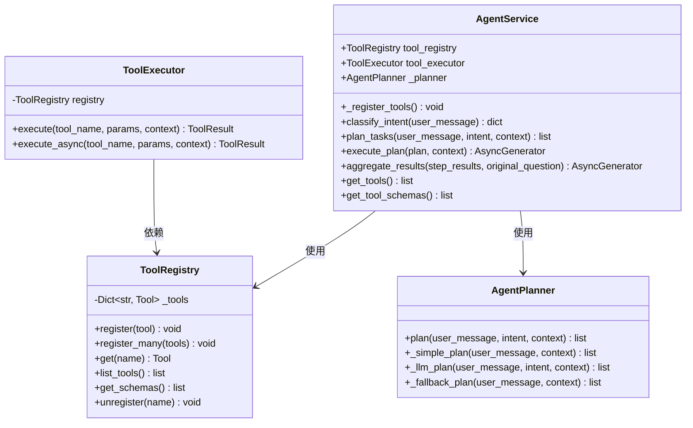
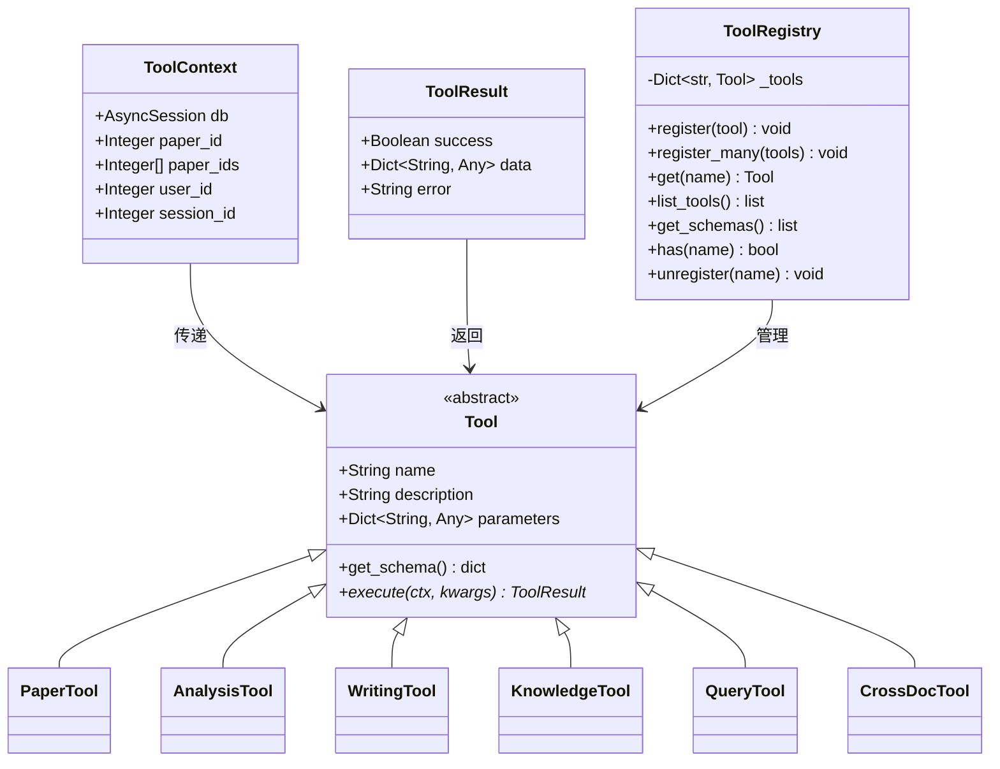
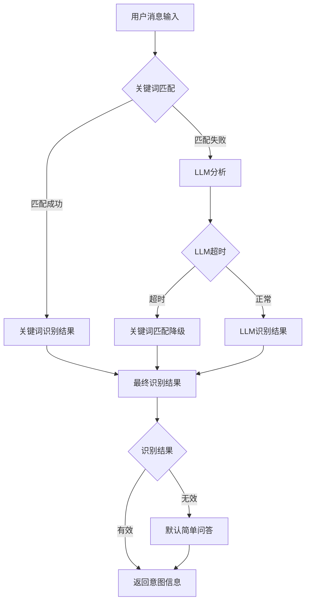
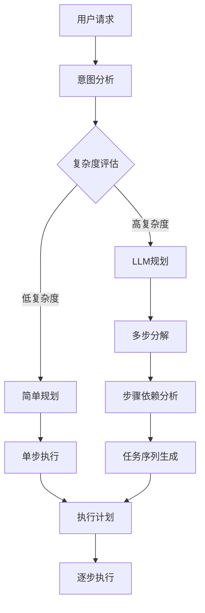
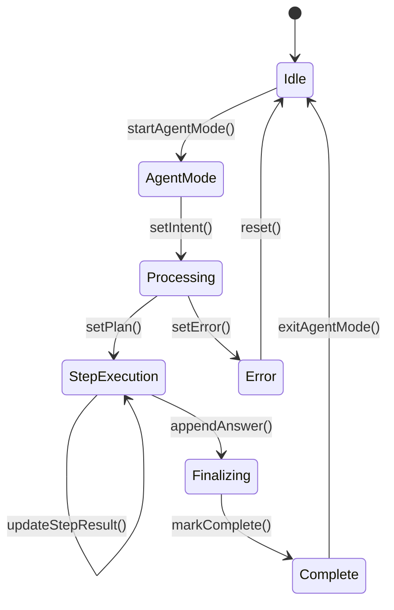
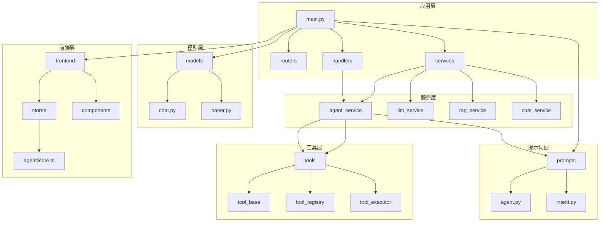

# Agent系统增强

<cite>
**本文档引用的文件**
- [backend/app/main.py](file://backend/app/main.py)
- [backend/app/services/agent/agent_service.py](file://backend/app/services/agent/agent_service.py)
- [backend/app/handlers/agent_handler.py](file://backend/app/handlers/agent_handler.py)
- [backend/app/models/chat.py](file://backend/app/models/chat.py)
- [backend/app/schemas/paper.py](file://backend/app/schemas/paper.py)
- [backend/app/tools/base.py](file://backend/app/tools/base.py)
- [backend/app/tools/registry.py](file://backend/app/tools/registry.py)
- [backend/app/services/agent/planner.py](file://backend/app/services/agent/planner.py)
- [backend/app/services/agent/intent.py](file://backend/app/services/agent/intent.py)
- [backend/app/prompts/agent.py](file://backend/app/prompts/agent.py)
- [backend/app/routers/chat.py](file://backend/app/routers/chat.py)
- [frontend/src/stores/agentStore.ts](file://frontend/src/stores/agentStore.ts)
</cite>

## 目录
1. [简介](#简介)
2. [项目结构](#项目结构)
3. [核心组件](#核心组件)
4. [架构概览](#架构概览)
5. [详细组件分析](#详细组件分析)
6. [依赖关系分析](#依赖关系分析)
7. [性能考虑](#性能考虑)
8. [故障排除指南](#故障排除指南)
9. [结论](#结论)

## 简介

PaperChat Agent系统是一个增强的智能问答平台，基于FastAPI构建，集成了多种AI工具和服务。该系统的核心目标是为学术研究提供智能化的论文阅读、分析和写作辅助功能。

Agent系统的主要特点包括：
- **多模态交互**：支持文本、语音等多种输入方式
- **智能代理**：具备意图识别、任务规划和执行能力
- **工具集成**：可扩展的工具生态系统
- **跨文档分析**：支持多篇论文的综合分析
- **实时反馈**：提供渐进式的处理进度反馈

## 项目结构

该项目采用前后端分离的架构设计，后端使用Python FastAPI框架，前端使用React技术栈。

**图表来源**
- [backend/app/main.py:288-361](file://backend/app/main.py#L288-L361)
- [frontend/src/stores/agentStore.ts:44-164](file://frontend/src/stores/agentStore.ts#L44-L164)

**章节来源**
- [backend/app/main.py:1-390](file://backend/app/main.py#L1-L390)
- [backend/app/routers/chat.py:1-306](file://backend/app/routers/chat.py#L1-L306)

## 核心组件

Agent系统由多个核心组件构成，每个组件都有明确的职责和边界：

### 1. Agent服务层
负责整个Agent系统的协调和管理，包括意图识别、任务规划和执行。

### 2. 工具系统
提供统一的工具抽象和管理机制，支持动态注册和执行。

### 3. 意图识别模块
通过关键词匹配和LLM分析相结合的方式，准确识别用户需求。

### 4. 任务规划器
将复杂的用户请求分解为可执行的任务序列。

### 5. 会话管理系统
维护用户对话历史和状态信息。

**章节来源**
- [backend/app/services/agent/agent_service.py:70-376](file://backend/app/services/agent/agent_service.py#L70-L376)
- [backend/app/tools/base.py:29-45](file://backend/app/tools/base.py#L29-L45)
- [backend/app/services/agent/intent.py:24-289](file://backend/app/services/agent/intent.py#L24-L289)

## 架构概览

Agent系统采用分层架构设计，确保了良好的可维护性和扩展性。

**图表来源**
- [backend/app/handlers/agent_handler.py:12-75](file://backend/app/handlers/agent_handler.py#L12-L75)
- [backend/app/services/agent/agent_service.py:169-326](file://backend/app/services/agent/agent_service.py#L169-L326)

## 详细组件分析

### Agent服务组件

Agent服务是整个系统的核心协调者，负责管理工具注册、任务规划和执行流程。

**图表来源**
- [backend/app/services/agent/agent_service.py:70-153](file://backend/app/services/agent/agent_service.py#L70-L153)
- [backend/app/tools/registry.py:10-51](file://backend/app/tools/registry.py#L10-L51)
- [backend/app/services/agent/planner.py:23-153](file://backend/app/services/agent/planner.py#L23-L153)

**章节来源**
- [backend/app/services/agent/agent_service.py:70-376](file://backend/app/services/agent/agent_service.py#L70-L376)

### 工具系统组件

工具系统提供了统一的抽象层，支持各种功能工具的动态注册和执行。

**图表来源**
- [backend/app/tools/base.py:11-45](file://backend/app/tools/base.py#L11-L45)
- [backend/app/tools/registry.py:10-51](file://backend/app/tools/registry.py#L10-L51)

**章节来源**
- [backend/app/tools/base.py:11-45](file://backend/app/tools/base.py#L11-L45)
- [backend/app/tools/registry.py:10-51](file://backend/app/tools/registry.py#L10-L51)

### 意图识别组件

意图识别模块结合了关键词匹配和LLM分析两种方式，提供了高精度的用户需求理解。

**图表来源**
- [backend/app/services/agent/intent.py:150-289](file://backend/app/services/agent/intent.py#L150-L289)

**章节来源**
- [backend/app/services/agent/intent.py:150-289](file://backend/app/services/agent/intent.py#L150-L289)

### 任务规划组件

任务规划器根据意图识别结果，将复杂请求分解为可执行的步骤序列。

**图表来源**
- [backend/app/services/agent/planner.py:36-153](file://backend/app/services/agent/planner.py#L36-L153)

**章节来源**
- [backend/app/services/agent/planner.py:36-153](file://backend/app/services/agent/planner.py#L36-L153)

### 前端状态管理

前端使用Zustand状态管理库来维护Agent模式的状态。

**图表来源**
- [frontend/src/stores/agentStore.ts:44-164](file://frontend/src/stores/agentStore.ts#L44-L164)

**章节来源**
- [frontend/src/stores/agentStore.ts:44-164](file://frontend/src/stores/agentStore.ts#L44-L164)

## 依赖关系分析

Agent系统的依赖关系体现了清晰的分层架构和模块化设计。

**图表来源**
- [backend/app/main.py:288-361](file://backend/app/main.py#L288-L361)
- [backend/app/services/agent/agent_service.py:28-44](file://backend/app/services/agent/agent_service.py#L28-L44)

**章节来源**
- [backend/app/main.py:288-361](file://backend/app/main.py#L288-L361)
- [backend/app/services/agent/agent_service.py:28-44](file://backend/app/services/agent/agent_service.py#L28-L44)

## 性能考虑

Agent系统在设计时充分考虑了性能优化和用户体验：

### 1. 异步处理
- 所有工具调用都采用异步模式
- 支持流式响应，提供实时反馈
- 使用异步生成器处理大量数据

### 2. 缓存策略
- 工具结果缓存
- LLM响应缓存
- 会话状态缓存

### 3. 资源管理
- 数据库连接池管理
- 线程池资源控制
- 内存使用监控

### 4. 性能指标
- 请求响应时间统计
- 工具执行时间监控
- LLM调用成本计算

## 故障排除指南

### 常见问题及解决方案

#### 1. Agent执行失败
**症状**：Agent执行过程中出现错误
**原因**：
- 工具执行异常
- LLM服务不可用
- 数据库连接问题

**解决方案**：
- 检查工具注册状态
- 验证LLM服务配置
- 确认数据库连接

#### 2. 意图识别不准确
**症状**：用户意图识别结果不符合预期
**原因**：
- 关键词匹配不完整
- LLM模型配置错误
- 提示词不够准确

**解决方案**：
- 更新关键词映射
- 调整LLM参数
- 优化提示词模板

#### 3. 性能问题
**症状**：系统响应缓慢
**原因**：
- 工具执行时间过长
- 并发请求过多
- 缓存未命中

**解决方案**：
- 优化工具算法
- 实施请求限流
- 增加缓存策略

**章节来源**
- [backend/app/services/agent/agent_service.py:267-276](file://backend/app/services/agent/agent_service.py#L267-L276)
- [backend/app/services/agent/intent.py:242-247](file://backend/app/services/agent/intent.py#L242-L247)

## 结论

PaperChat Agent系统通过精心设计的架构和模块化组件，为学术研究提供了强大的智能辅助功能。系统的主要优势包括：

### 技术优势
- **模块化设计**：清晰的分层架构便于维护和扩展
- **异步处理**：提供流畅的用户体验
- **工具生态**：支持动态工具注册和扩展
- **智能规划**：基于意图识别的任务分解

### 应用价值
- **学术研究**：支持论文阅读、分析和写作
- **知识管理**：提供结构化的知识组织方式
- **智能问答**：多模态的交互体验
- **协作支持**：跨文档的综合分析能力

### 发展方向
- **性能优化**：进一步提升响应速度
- **功能扩展**：增加更多专业工具
- **用户体验**：改善界面交互设计
- **集成能力**：支持更多第三方服务

该系统为学术研究工作者提供了一个强大而灵活的智能助手，能够显著提升研究效率和质量。