# MCP服务架构

<cite>
**本文档引用的文件**
- [__init__.py](file://backend/app/mcp_services/__init__.py)
- [config.py](file://backend/app/mcp_services/config.py)
- [client.py](file://backend/app/mcp_services/client.py)
- [manager.py](file://backend/app/mcp_services/manager.py)
- [bridge.py](file://backend/app/mcp_services/bridge.py)
- [transport.py](file://backend/app/mcp_services/transport.py)
- [exceptions.py](file://backend/app/mcp_services/exceptions.py)
- [academic_config.py](file://backend/app/mcp_services/academic_config.py)
- [arxiv_server.py](file://backend/app/mcp_services/servers/arxiv_server.py)
- [semantic_scholar_server.py](file://backend/app/mcp_services/servers/semantic_scholar_server.py)
- [crossref_server.py](file://backend/app/mcp_services/servers/crossref_server.py)
- [dblp_server.py](file://backend/app/mcp_services/servers/dblp_server.py)
- [zotero_server.py](file://backend/app/mcp_services/servers/zotero_server.py)
- [report_server.py](file://backend/app/mcp_services/servers/report_server.py)
- [main.py](file://backend/app/main.py)
- [startup.py](file://backend/app/startup.py)
- [base.py](file://backend/app/tools/base.py)
- [test_mcp_client.py](file://backend/tests/unit/test_mcp_client.py)
</cite>

## 更新摘要
**变更内容**
- 新增报告生成器MCP服务器（report_server.py）
- 扩展学术服务器配置，包含新的报告生成器
- 增强学术数据源集成能力
- 新增多种格式转换功能支持

## 目录
1. [简介](#简介)
2. [项目结构](#项目结构)
3. [核心组件](#核心组件)
4. [架构概览](#架构概览)
5. [详细组件分析](#详细组件分析)
6. [新增功能：报告生成器](#新增功能报告生成器)
7. [依赖关系分析](#依赖关系分析)
8. [性能考虑](#性能考虑)
9. [故障排除指南](#故障排除指南)
10. [结论](#结论)

## 简介

MCP（Model Context Protocol）服务架构是ChatPDF项目中的一个关键组件，它实现了学术论文搜索和文献管理的标准化接口。该架构基于JSON-RPC 2.0协议，支持多种传输方式（stdio、SSE、HTTP），为系统提供了灵活的外部服务集成能力。

MCP服务架构的主要目标包括：
- 标准化学术数据源的访问接口
- 提供高可用的异步通信机制
- 支持动态服务发现和工具桥接
- 实现自动重连和健康检查机制
- 与内部工具系统无缝集成

**更新** 新增报告生成器MCP服务器，提供学术报告生成功能，支持多种格式转换（Markdown、HTML、LaTeX）。

## 项目结构

MCP服务架构采用模块化设计，主要包含以下核心目录：

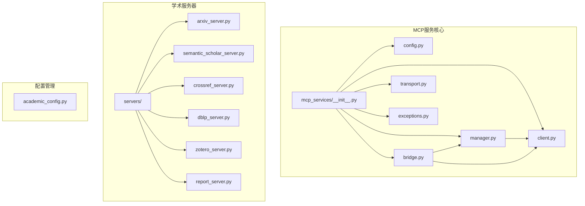

**图表来源**
- [__init__.py:1-42](file://backend/app/mcp_services/__init__.py#L1-L42)
- [config.py:1-34](file://backend/app/mcp_services/config.py#L1-L34)
- [client.py:1-471](file://backend/app/mcp_services/client.py#L1-L471)

**章节来源**
- [__init__.py:1-42](file://backend/app/mcp_services/__init__.py#L1-L42)
- [config.py:1-34](file://backend/app/mcp_services/config.py#L1-L34)

## 核心组件

### 配置管理系统

MCP配置系统采用Pydantic模型定义，支持多种传输协议和灵活的服务器配置。

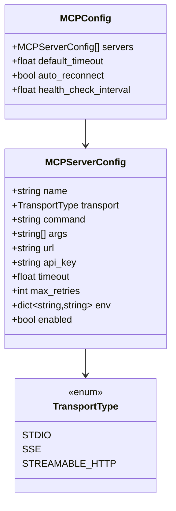

**图表来源**
- [config.py:6-34](file://backend/app/mcp_services/config.py#L6-L34)

### 传输层实现

MCP支持三种不同的传输协议，每种都有特定的使用场景：

| 传输类型 | 适用场景 | 特点 |
|---------|----------|------|
| STDIO | 本地进程通信 | 低延迟，适合Python脚本 |
| SSE | HTTP服务器发送事件 | 实时双向通信 |
| STREAMABLE_HTTP | 直接HTTP POST | 简单可靠 |

**章节来源**
- [config.py:6-34](file://backend/app/mcp_services/config.py#L6-L34)
- [transport.py:50-417](file://backend/app/mcp_services/transport.py#L50-L417)

## 架构概览

MCP服务架构采用分层设计，从底层传输到上层业务逻辑形成了清晰的职责分离：

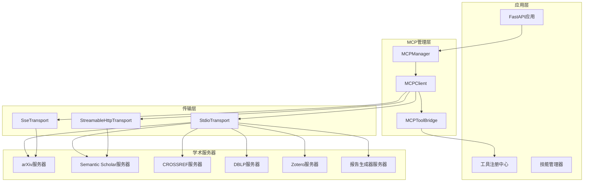

**图表来源**
- [main.py:32-110](file://backend/app/main.py#L32-L110)
- [manager.py:17-233](file://backend/app/mcp_services/manager.py#L17-L233)
- [client.py:57-471](file://backend/app/mcp_services/client.py#L57-L471)

## 详细组件分析

### MCPManager - 生命周期管理

MCPManager是整个MCP服务架构的核心控制器，负责管理所有MCP服务器的生命周期：

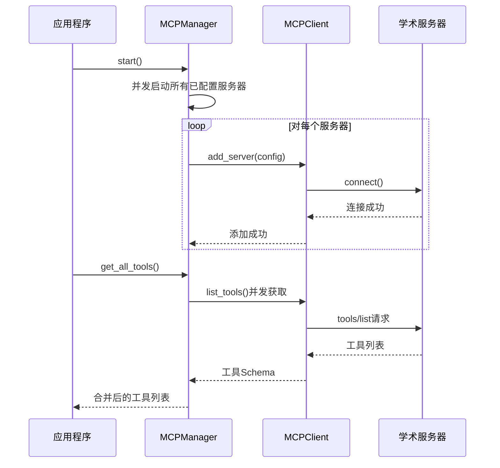

**图表来源**
- [manager.py:36-134](file://backend/app/mcp_services/manager.py#L36-L134)

**章节来源**
- [manager.py:17-233](file://backend/app/mcp_services/manager.py#L17-L233)

### MCPClient - 协议客户端

MCPClient实现了完整的MCP协议客户端功能，支持自动重连和工具缓存：

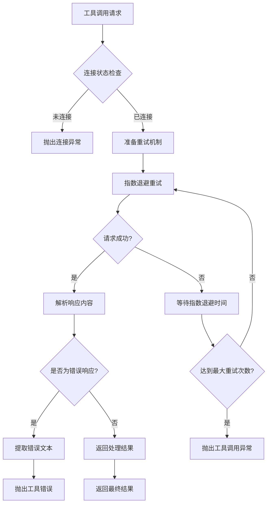

**图表来源**
- [client.py:333-378](file://backend/app/mcp_services/client.py#L333-L378)

**章节来源**
- [client.py:57-471](file://backend/app/mcp_services/client.py#L57-L471)

### MCPToolBridge - 工具桥接

MCPToolBridge实现了MCP工具到内部工具系统的动态转换：

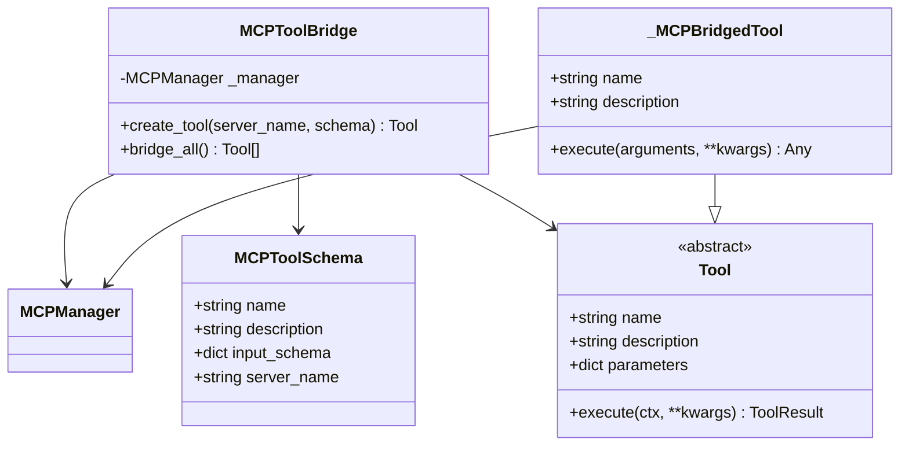

**图表来源**
- [bridge.py:21-82](file://backend/app/mcp_services/bridge.py#L21-L82)

**章节来源**
- [bridge.py:21-82](file://backend/app/mcp_services/bridge.py#L21-L82)

### 传输层实现

MCP支持三种不同的传输协议，每种都有特定的实现细节：

#### StdioTransport - 标准输入输出传输

StdioTransport通过子进程进行通信，适用于本地Python脚本：

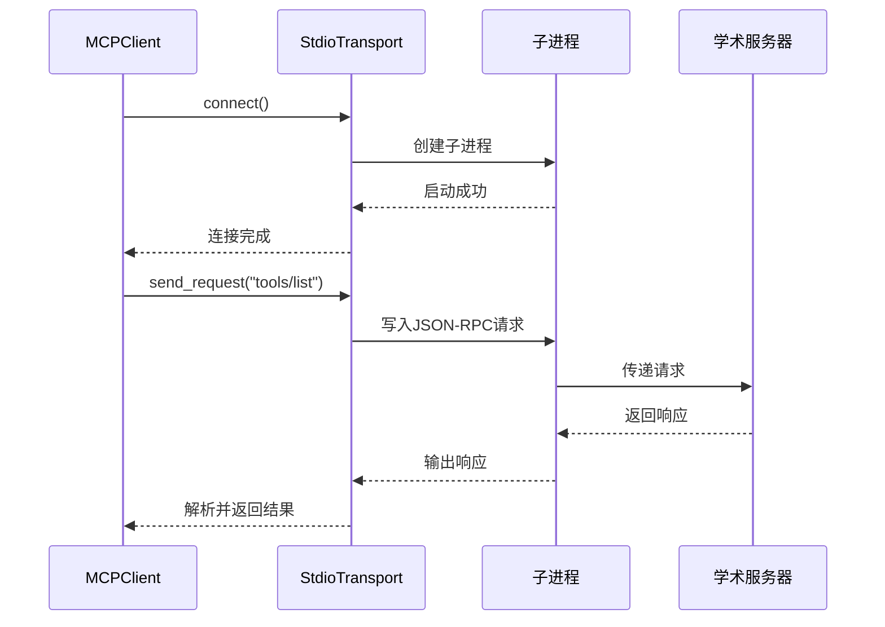

**图表来源**
- [transport.py:112-137](file://backend/app/mcp_services/transport.py#L112-L137)

#### SseTransport - 服务器发送事件传输

SseTransport通过HTTP SSE实现双向通信：

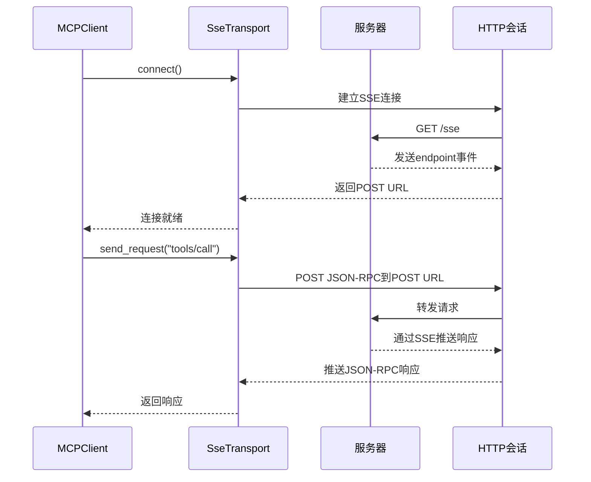

**图表来源**
- [transport.py:302-351](file://backend/app/mcp_services/transport.py#L302-L351)

**章节来源**
- [transport.py:50-417](file://backend/app/mcp_services/transport.py#L50-L417)

## 新增功能：报告生成器

### 报告生成器MCP服务器概述

新增的report_server.py是一个专门的学术报告生成器MCP服务器，提供多种报告生成和格式转换功能。该服务器基于DeepSeek API实现，支持内存缓存机制，确保高效的服务响应。

### 核心功能模块

报告生成器包含四个主要工具：

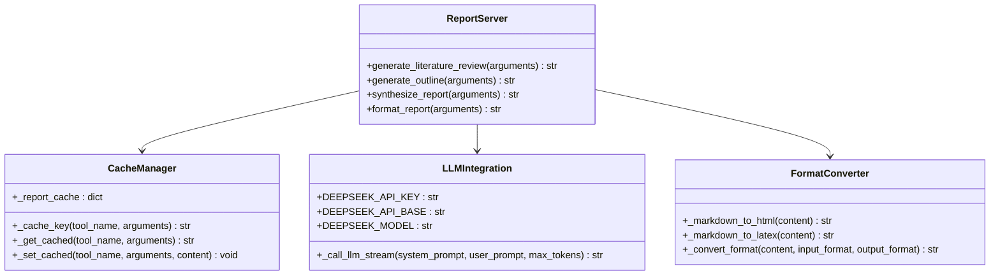

**图表来源**
- [report_server.py:27-51](file://backend/app/mcp_services/servers/report_server.py#L27-L51)
- [report_server.py:122-178](file://backend/app/mcp_services/servers/report_server.py#L122-L178)
- [report_server.py:222-380](file://backend/app/mcp_services/servers/report_server.py#L222-L380)

### 工具功能详解

#### 文献综述生成器
- **功能**：基于给定论文列表/主题生成结构化的文献综述
- **输入参数**：topic（研究主题）、papers（论文数组）、style（写作风格）
- **输出格式**：Markdown格式的完整文献综述
- **特点**：支持多种写作风格，自动缓存生成结果

#### 报告大纲生成器
- **功能**：生成结构化的报告大纲模板
- **输入参数**：topic（报告主题）、sections（章节数量）、depth（大纲层级深度）
- **输出格式**：基于模板的结构化大纲
- **特点**：纯模板生成，无需LLM调用，响应速度快

#### 报告综合生成器
- **功能**：多源信息综合生成完整报告
- **输入参数**：topic（报告主题）、sources（信息源列表）、format（输出格式）
- **支持格式**：markdown、html、latex
- **特点**：支持多格式输出，自动格式转换

#### 报告格式转换器
- **功能**：在不同格式间进行报告内容转换
- **支持格式**：markdown ↔ html ↔ latex
- **特点**：纯字符串处理，不依赖外部API

### 缓存机制

报告生成器实现了智能缓存系统：

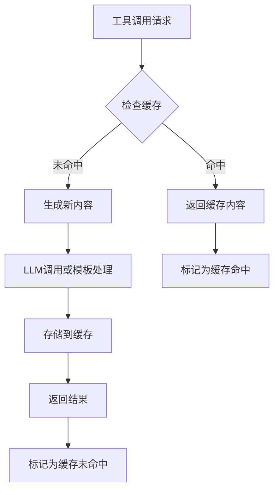

**图表来源**
- [report_server.py:32-50](file://backend/app/mcp_services/servers/report_server.py#L32-L50)

**章节来源**
- [report_server.py:1-651](file://backend/app/mcp_services/servers/report_server.py#L1-L651)

## 依赖关系分析

MCP服务架构的依赖关系相对简单，遵循了清晰的分层设计：

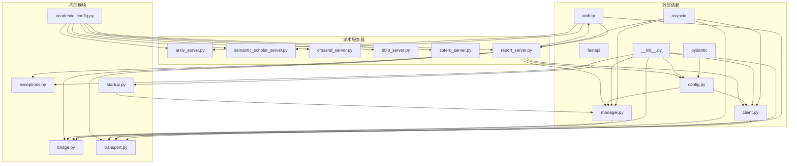

**图表来源**
- [__init__.py:13-22](file://backend/app/mcp_services/__init__.py#L13-L22)
- [startup.py:149-158](file://backend/app/startup.py#L149-L158)

**章节来源**
- [__init__.py:1-42](file://backend/app/mcp_services/__init__.py#L1-L42)
- [startup.py:144-160](file://backend/app/startup.py#L144-L160)

## 性能考虑

MCP服务架构在设计时充分考虑了性能优化：

### 并发处理
- 所有服务器连接采用并发启动策略
- 工具列表获取支持并发请求
- 健康检查任务独立运行

### 缓存机制
- 工具列表结果缓存，避免重复请求
- 学术服务器内部缓存论文元数据
- 连接状态缓存减少检查开销
- **新增** 报告生成器实现内存缓存，限制最多100条缓存记录

### 自动重连策略
- 指数退避算法，最长重连时间为2^3秒
- 并发重连避免阻塞主流程
- 连接锁防止重复重连

**更新** 报告生成器的缓存机制特别优化了内存使用，当缓存条目超过100时自动清理最旧的条目，确保系统稳定运行。

## 故障排除指南

### 常见问题及解决方案

#### 连接失败
**症状**: MCP服务器无法连接
**原因**: 
- 传输配置错误
- 服务器进程未启动
- 网络连接问题

**解决方案**:
1. 检查服务器配置参数
2. 验证传输类型设置
3. 确认网络连接状态

#### 工具调用超时
**症状**: 工具调用长时间无响应
**原因**:
- 服务器响应缓慢
- 网络延迟过高
- 工具执行时间过长

**解决方案**:
1. 调整超时配置
2. 检查服务器性能
3. 优化工具执行逻辑

#### 健康检查失败
**症状**: 服务器频繁断线
**原因**:
- 服务器不稳定
- 网络波动
- 资源不足

**解决方案**:
1. 检查服务器日志
2. 监控系统资源
3. 调整健康检查间隔

#### 报告生成器相关问题
**症状**: 报告生成失败或格式转换异常
**原因**:
- DeepSeek API密钥未配置
- LLM调用超时
- 格式转换错误

**解决方案**:
1. 设置DEEPSEEK_API_KEY环境变量
2. 检查网络连接和API可用性
3. 验证输入格式的正确性

**章节来源**
- [exceptions.py:1-15](file://backend/app/mcp_services/exceptions.py#L1-L15)
- [client.py:249-288](file://backend/app/mcp_services/client.py#L249-L288)

## 结论

MCP服务架构通过标准化的设计和灵活的实现，为ChatPDF项目提供了强大的学术数据源集成能力。该架构的主要优势包括：

1. **模块化设计**: 清晰的分层结构便于维护和扩展
2. **多协议支持**: 灵活的传输选择适应不同场景需求
3. **高可用性**: 自动重连和健康检查确保服务稳定性
4. **性能优化**: 并发处理和缓存机制提升系统效率
5. **易于集成**: 标准化的接口便于与现有系统融合

**更新** 新增的报告生成器MCP服务器进一步增强了系统的学术服务能力，提供了：
- 多种报告生成工具，满足不同学术需求
- 智能缓存机制，提升响应速度
- 多格式支持，便于报告发布和分享
- LLM集成，提供高质量的内容生成

未来可以考虑的改进方向：
- 增加更多的传输协议支持
- 实现更精细的错误处理和重试策略
- 添加监控和日志收集功能
- 优化工具缓存策略以提高响应速度
- 扩展报告生成器的功能，支持更多格式和样式