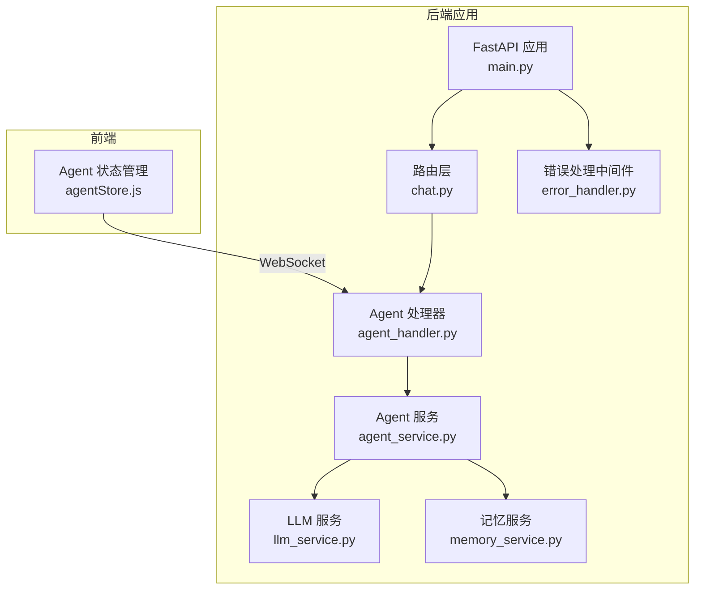
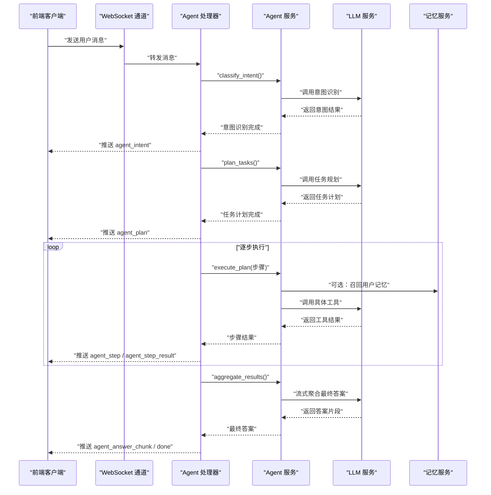
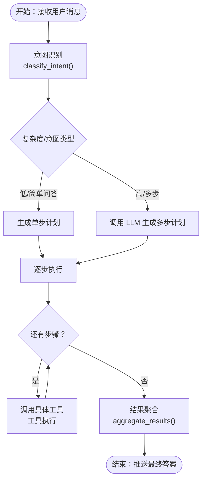
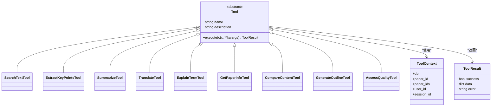
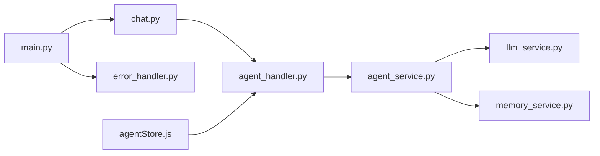

# Agent 服务

<cite>
**本文档引用的文件**
- [agent_service.py](file://backend/app/services/agent_service.py)
- [agent_handler.py](file://backend/app/handlers/agent_handler.py)
- [llm_service.py](file://backend/app/services/llm/llm_service.py)
- [llm_service.py（兼容层）](file://backend/app/services/llm_service.py)
- [memory_service.py](file://backend/app/services/memory_service.py)
- [memory.py](file://backend/app/models/memory.py)
- [chat.py](file://backend/app/routers/chat.py)
- [main.py](file://backend/app/main.py)
- [error_handler.py](file://backend/app/middleware/error_handler.py)
- [agentStore.js](file://frontend/src/stores/agentStore.js)
</cite>

## 目录
1. [简介](#简介)
2. [项目结构](#项目结构)
3. [核心组件](#核心组件)
4. [架构总览](#架构总览)
5. [详细组件分析](#详细组件分析)
6. [依赖关系分析](#依赖关系分析)
7. [性能考虑](#性能考虑)
8. [故障排查指南](#故障排查指南)
9. [结论](#结论)
10. [附录](#附录)

## 简介
本文件面向“Agent 服务”的综合技术文档，系统阐述智能体系统的架构设计与实现细节，覆盖意图识别、任务规划、工具调用机制、状态管理、执行流程与结果反馈。文档同时提供前端状态管理、错误处理、性能监控与调试工具的说明，并给出扩展接口与最佳实践建议，帮助开发者快速上手与二次开发。

## 项目结构
后端采用 FastAPI + LangChain + SQLAlchemy 架构，Agent 服务位于后端应用层，通过 WebSocket 与前端交互；LLM 服务封装 DeepSeek API；记忆服务提供用户长期记忆的提取、存储与召回；聊天路由负责会话管理；全局中间件统一处理异常。

图表来源
- [main.py:55-95](file://backend/app/main.py#L55-L95)
- [chat.py:16](file://backend/app/routers/chat.py#L16)
- [agent_handler.py:11-67](file://backend/app/handlers/agent_handler.py#L11-L67)
- [agent_service.py:503-800](file://backend/app/services/agent_service.py#L503-L800)
- [llm_service.py:29-710](file://backend/app/services/llm/llm_service.py#L29-L710)
- [memory_service.py:46-438](file://backend/app/services/memory_service.py#L46-L438)
- [error_handler.py:73-92](file://backend/app/middleware/error_handler.py#L73-L92)
- [agentStore.js:12-132](file://frontend/src/stores/agentStore.js#L12-L132)

章节来源
- [main.py:16-53](file://backend/app/main.py#L16-L53)
- [chat.py:19-295](file://backend/app/routers/chat.py#L19-L295)

## 核心组件
- Agent 核心服务：负责意图识别、任务规划、工具注册与执行、结果聚合。
- 工具体系：抽象工具基类与多个具体工具（搜索、摘要、翻译、术语解释、论文信息、对比、提纲、质量评估等）。
- LLM 服务：封装 DeepSeek API，提供多种流式/非流式能力（问答、摘要、翻译、术语解释、论文对比、大纲生成、润色等）。
- 记忆服务：提供用户长期记忆的提取、存储、召回、画像构建与衰减。
- Agent 处理器：通过 WebSocket 推送 Agent 执行过程与结果。
- 前端状态管理：Zustand Store 管理 Agent 模式下的意图、计划、步骤与最终答案。

章节来源
- [agent_service.py:45-341](file://backend/app/services/agent_service.py#L45-L341)
- [agent_service.py:503-800](file://backend/app/services/agent_service.py#L503-L800)
- [llm_service.py:29-710](file://backend/app/services/llm/llm_service.py#L29-L710)
- [memory_service.py:46-438](file://backend/app/services/memory_service.py#L46-L438)
- [agent_handler.py:11-67](file://backend/app/handlers/agent_handler.py#L11-L67)
- [agentStore.js:12-132](file://frontend/src/stores/agentStore.js#L12-L132)

## 架构总览
Agent 服务采用“意图识别 → 任务规划 → 工具执行 → 结果聚合”的四阶段流水线。前端通过 WebSocket 接收实时进度，后端通过 LLM 服务与记忆服务协同完成复杂任务。

图表来源
- [agent_handler.py:11-67](file://backend/app/handlers/agent_handler.py#L11-L67)
- [agent_service.py:524-774](file://backend/app/services/agent_service.py#L524-L774)
- [llm_service.py:173-245](file://backend/app/services/llm/llm_service.py#L173-L245)
- [memory_service.py:226-301](file://backend/app/services/memory_service.py#L226-L301)

## 详细组件分析

### Agent 服务（意图识别、任务规划、工具执行、结果聚合）
- 意图识别：基于 LLM 的 JSON 输出解析，返回 intent、requires_tools、complexity 与 reasoning。
- 任务规划：根据意图与上下文生成有序步骤，支持简单直接计划与复杂多步规划。
- 工具注册：集中注册工具集合，统一通过名称调度。
- 执行流程：异步迭代执行每一步，产出 step_start、step_result 与 final_answer_chunk。
- 结果聚合：将多步结果汇总为连贯回答，使用 LLM 流式输出。

图表来源
- [agent_service.py:524-774](file://backend/app/services/agent_service.py#L524-L774)

章节来源
- [agent_service.py:503-800](file://backend/app/services/agent_service.py#L503-L800)

### 工具体系（Tool 抽象与具体实现）
- 抽象基类：Tool，统一的 execute(ctx, **kwargs) 接口与 ToolResult 返回结构。
- 工具清单：
  - 搜索文本：SearchTextTool
  - 提取知识点：ExtractKeyPointsTool
  - 文本摘要：SummarizeTool
  - 翻译：TranslateTool
  - 术语解释：ExplainTermTool
  - 获取论文信息：GetPaperInfoTool
  - 对比内容：CompareContentTool
  - 生成提纲：GenerateOutlineTool
  - 质量评估：AssessQualityTool
- 上下文传递：ToolContext 统一携带 db、paper_id、paper_ids、user_id、session_id。

图表来源
- [agent_service.py:26-341](file://backend/app/services/agent_service.py#L26-L341)

章节来源
- [agent_service.py:45-341](file://backend/app/services/agent_service.py#L45-L341)

### LLM 服务（多场景能力封装）
- 模型配置：支持运行时更新模型、温度、最大 token、API Key 与 Base URL。
- 能力矩阵：
  - 分析论文、问答（含 RAG）、跨文档问答、术语解释、摘要、翻译、深度分析、论文对比、大纲生成、段落草稿、文本润色、引用格式生成、关键词提取等。
- 流式输出：除部分非流式接口外，多数接口均支持流式增量返回。
- 记忆增强：在 RAG 问答中可选召回用户记忆并注入上下文。

章节来源
- [llm_service.py:29-710](file://backend/app/services/llm/llm_service.py#L29-L710)
- [llm_service.py（兼容层）:1-53](file://backend/app/services/llm_service.py#L1-L53)

### 记忆服务（用户长期记忆）
- 功能：提取对话记忆、存储去重、向量化召回、画像构建、衰减与删除。
- 算法：SentenceTransformer 向量化，余弦相似度评分，时间衰减因子，重要性权重。
- 上下文增强：在 RAG 问答中可将记忆注入系统提示词。

章节来源
- [memory_service.py:46-438](file://backend/app/services/memory_service.py#L46-L438)
- [memory.py:14-54](file://backend/app/models/memory.py#L14-L54)

### Agent 处理器（WebSocket 通信）
- 流程：意图识别 → 任务规划 → 逐步执行 → 结果聚合 → 完成通知。
- 消息类型：agent_intent、agent_plan、agent_step、agent_step_result、agent_answer_chunk、done、error。
- 异常处理：捕获取消与异常，向前端推送错误消息。

章节来源
- [agent_handler.py:11-67](file://backend/app/handlers/agent_handler.py#L11-L67)

### 前端状态管理（Zustand Store）
- 状态：isAgentMode、isProcessing、intent、plan、currentStep、stepResults、finalAnswer、isComplete、error。
- 行为：开始/退出 Agent 模式、设置意图/计划、更新步骤状态/结果、追加/设置最终答案、标记完成、设置错误、重置状态、查询步骤状态与当前描述。

章节来源
- [agentStore.js:12-132](file://frontend/src/stores/agentStore.js#L12-L132)

## 依赖关系分析
- Agent 服务依赖 LLM 服务与记忆服务，用于意图识别、任务规划、工具执行与上下文增强。
- Agent 处理器依赖 Agent 服务，通过 WebSocket 与前端交互。
- 路由层提供会话管理，为 Agent 提供 paper_id/paper_ids 上下文。
- 全局中间件统一处理异常，保证服务稳定性。

图表来源
- [agent_handler.py:8](file://backend/app/handlers/agent_handler.py#L8)
- [agent_service.py:20-21](file://backend/app/services/agent_service.py#L20-L21)
- [memory_service.py:16](file://backend/app/services/memory_service.py#L16)
- [chat.py:16](file://backend/app/routers/chat.py#L16)
- [main.py:12-13](file://backend/app/main.py#L12-L13)
- [error_handler.py:73-92](file://backend/app/middleware/error_handler.py#L73-L92)
- [agentStore.js:12](file://frontend/src/stores/agentStore.js#L12)

章节来源
- [agent_handler.py:11-67](file://backend/app/handlers/agent_handler.py#L11-L67)
- [agent_service.py:503-800](file://backend/app/services/agent_service.py#L503-L800)
- [chat.py:19-295](file://backend/app/routers/chat.py#L19-L295)
- [main.py:79-95](file://backend/app/main.py#L79-L95)
- [error_handler.py:73-92](file://backend/app/middleware/error_handler.py#L73-L92)

## 性能考虑
- 意图识别：约 500ms + 200 tokens。
- 任务规划：约 1-2s + 500 tokens。
- 工具调用：取决于具体工具（如检索、摘要、翻译等）。
- 结果聚合：约 1-2s + 500-2000 tokens。
- 总体影响：简单请求增加约 1s；复杂请求增加 3-8s。
- 优化建议：
  - 使用流式输出减少等待时间。
  - 在工具执行前进行上下文裁剪与去重。
  - 对高频工具结果进行缓存（如检索结果）。
  - 控制 LLM 输入长度，避免超限。

章节来源
- [agent_service.py:1-12](file://backend/app/services/agent_service.py#L1-L12)

## 故障排查指南
- 全局异常处理：Pydantic 验证错误、HTTP 异常、SQLAlchemy 异常与通用异常均有统一处理。
- Agent 执行异常：处理器捕获异常并向前端推送 error 消息；工具执行异常会被包装为 ToolResult 并上报。
- LLM 调用异常：LLM 服务在各方法中捕获异常并返回错误片段，避免中断流程。
- 记忆服务异常：存储/召回失败会打印日志并返回空结果，不影响主流程。
- WebSocket 断开：处理器捕获取消错误并清理任务状态。

章节来源
- [error_handler.py:11-91](file://backend/app/middleware/error_handler.py#L11-L91)
- [agent_handler.py:58-66](file://backend/app/handlers/agent_handler.py#L58-L66)
- [llm_service.py:139-140](file://backend/app/services/llm/llm_service.py#L139-L140)
- [memory_service.py:152-154](file://backend/app/services/memory_service.py#L152-L154)

## 结论
Agent 服务通过清晰的四阶段流水线与模块化的工具体系，实现了从简单问答到复杂多步任务的统一处理。配合 LLM 服务与记忆服务，系统具备良好的扩展性与可维护性。前端通过 WebSocket 实时反馈执行进度，用户体验流畅。建议在生产环境中结合缓存、流式输出与异常降级策略，进一步提升性能与稳定性。

## 附录

### 如何创建 Agent 与配置工具集
- 创建 Agent 实例：AgentService 提供统一入口，内部注册工具并暴露意图识别、任务规划、执行与聚合方法。
- 配置工具集：在 AgentService 的工具注册处添加自定义工具，遵循 Tool 抽象与 ToolContext/ToolResult 约定。
- 会话上下文：通过上下文字典传入 paper_id/paper_ids/user_id/session_id/db 等信息，工具可在 ctx 中获取。

章节来源
- [agent_service.py:509-522](file://backend/app/services/agent_service.py#L509-L522)
- [agent_service.py:667-674](file://backend/app/services/agent_service.py#L667-L674)

### 处理复杂任务的示例流程
- 前端进入 Agent 模式，发送消息。
- 后端推送 agent_intent 与 agent_plan。
- 逐步执行每一步，推送 agent_step 与 agent_step_result。
- 聚合完成后推送 agent_answer_chunk，最后推送 done。

章节来源
- [agent_handler.py:16-56](file://backend/app/handlers/agent_handler.py#L16-L56)

### 决策逻辑与错误处理
- 意图识别失败：返回默认简单意图与工具列表。
- 任务规划失败：返回单步默认计划。
- 工具执行失败：返回 ToolResult.error，前端显示错误。
- LLM 解析失败：从响应中提取 JSON 片段，若仍失败则降级为默认结果。

章节来源
- [agent_service.py:556-563](file://backend/app/services/agent_service.py#L556-L563)
- [agent_service.py:636-647](file://backend/app/services/agent_service.py#L636-L647)
- [agent_service.py:694-723](file://backend/app/services/agent_service.py#L694-L723)

### 性能监控与调试工具
- 性能指标：记录每步耗时与 token 使用量，结合日志与指标系统进行监控。
- 调试建议：开启流式输出观察进度，必要时降低输入长度或关闭记忆增强以定位瓶颈。
- 前端调试：利用 agentStore.js 的状态可视化与日志输出，确认步骤与结果映射正确。

章节来源
- [agent_service.py:1-12](file://backend/app/services/agent_service.py#L1-L12)
- [agentStore.js:12-132](file://frontend/src/stores/agentStore.js#L12-L132)