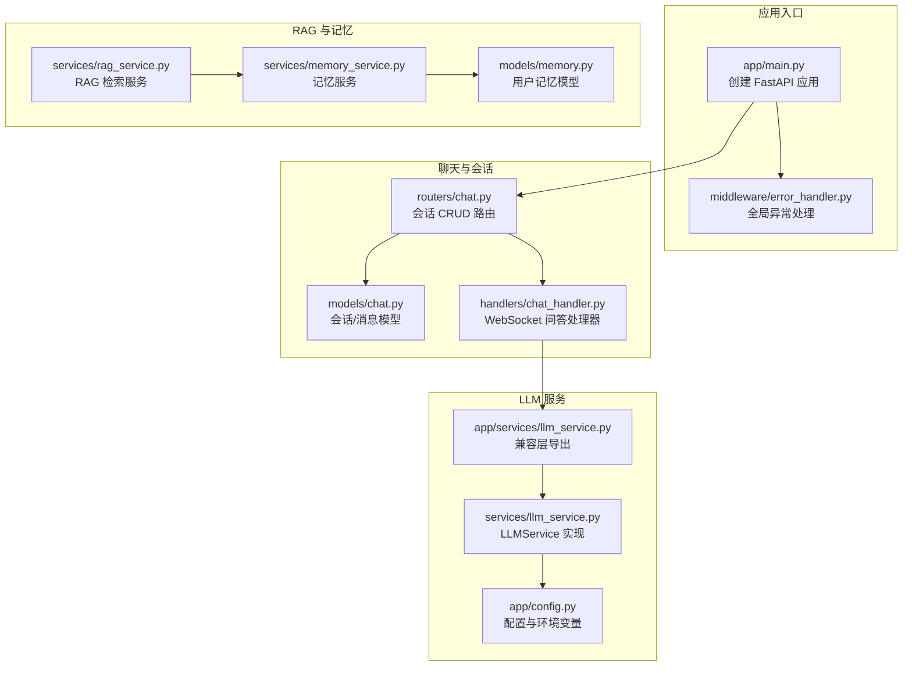
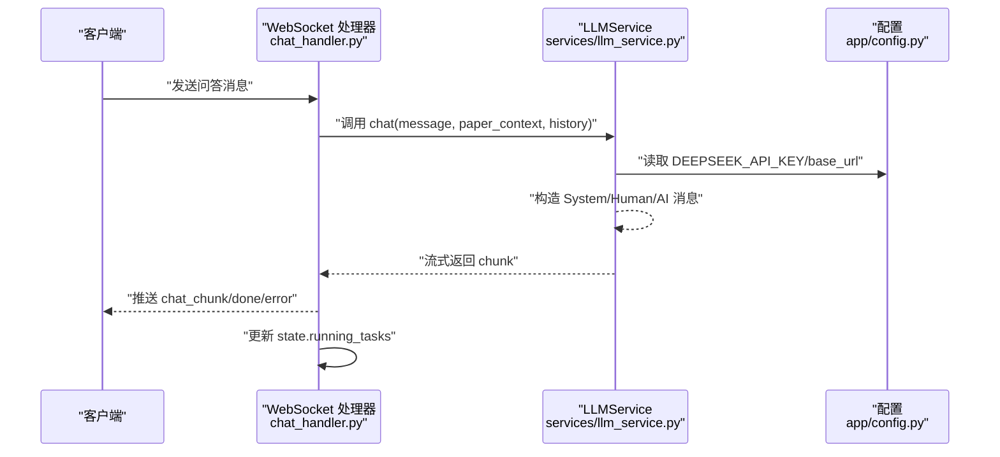
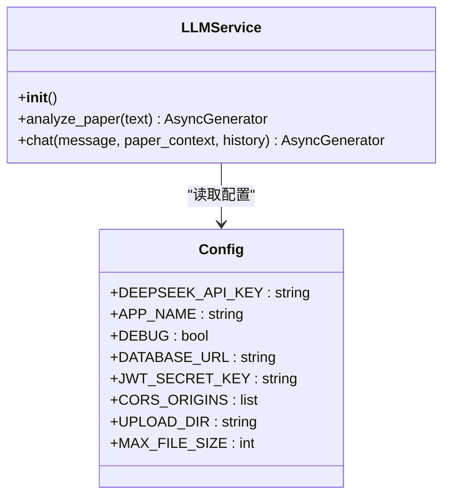
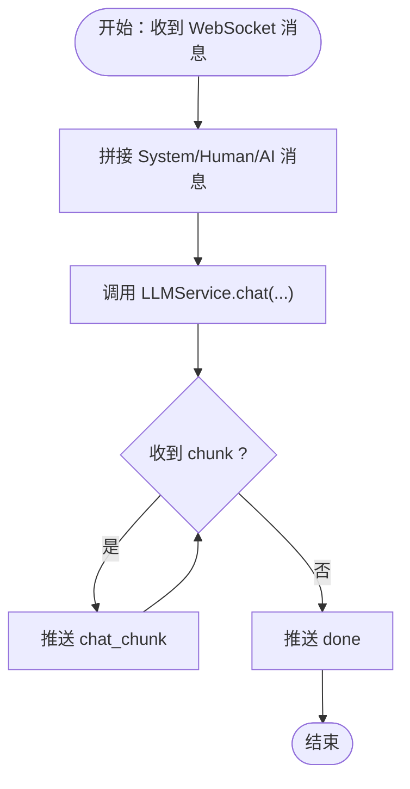
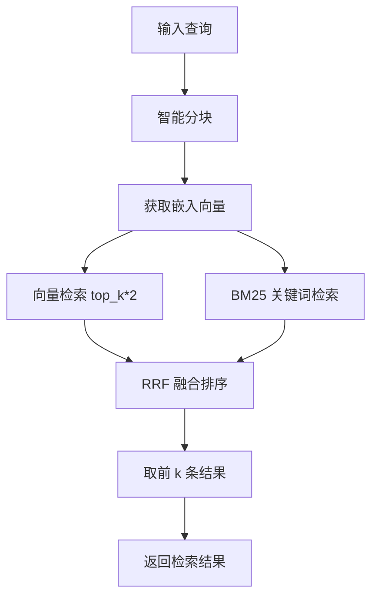
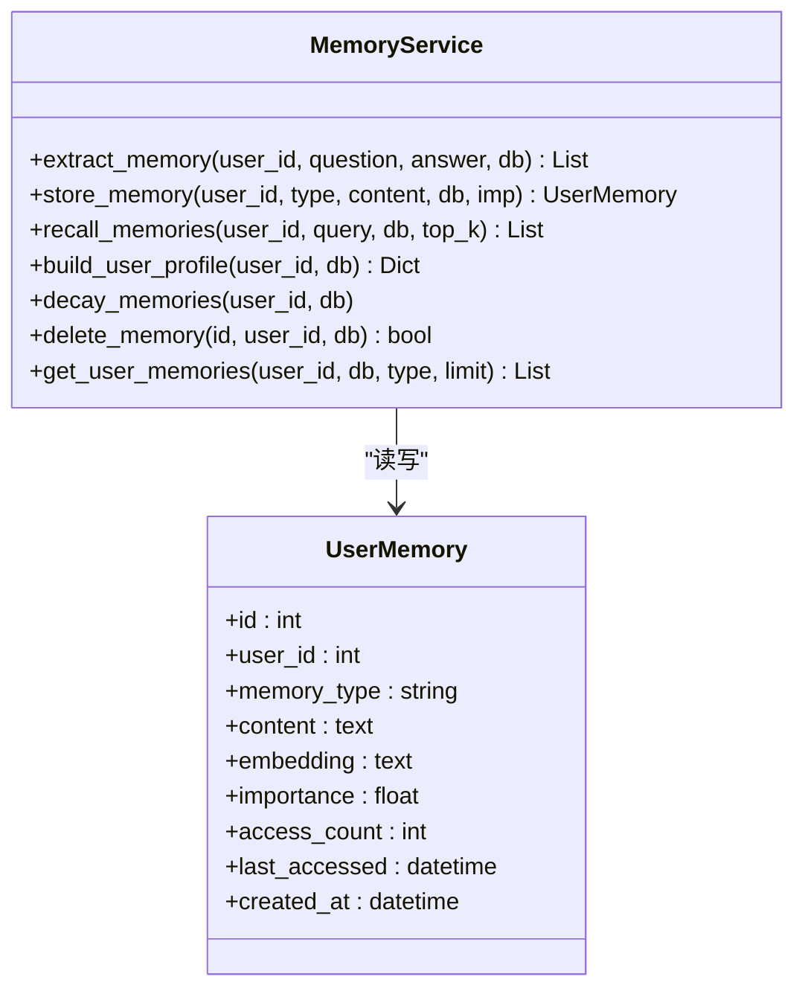
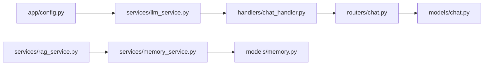

# LLM 服务

<cite>
**本文引用的文件**
- [backend/app/services/llm_service.py](file://backend/app/services/llm_service.py)
- [backend/services/llm_service.py](file://backend/services/llm_service.py)
- [backend/app/config.py](file://backend/app/config.py)
- [backend/app/main.py](file://backend/app/main.py)
- [backend/app/routers/chat.py](file://backend/app/routers/chat.py)
- [backend/app/handlers/chat_handler.py](file://backend/app/handlers/chat_handler.py)
- [backend/app/models/chat.py](file://backend/app/models/chat.py)
- [backend/app/middleware/error_handler.py](file://backend/app/middleware/error_handler.py)
- [backend/app/services/memory_service.py](file://backend/app/services/memory_service.py)
- [backend/app/models/memory.py](file://backend/app/models/memory.py)
- [backend/app/services/rag_service.py](file://backend/app/services/rag_service.py)
</cite>

## 目录
1. [简介](#简介)
2. [项目结构](#项目结构)
3. [核心组件](#核心组件)
4. [架构总览](#架构总览)
5. [组件详解](#组件详解)
6. [依赖关系分析](#依赖关系分析)
7. [性能考量](#性能考量)
8. [故障排查指南](#故障排查指南)
9. [结论](#结论)
10. [附录](#附录)

## 简介
本文件面向 LLM 服务的技术实现，聚焦于基于 DeepSeek 的大语言模型集成、提示词管理、模型参数配置、响应处理与流式输出、会话与上下文管理、错误处理与健康检查、以及可扩展的 RAG 与记忆服务。文档同时给出调用流程图、类关系图与数据流图，帮助开发者快速理解与落地。

## 项目结构
后端采用 FastAPI + SQLAlchemy + LangChain 的组合，LLM 服务位于 app/services 与 services 两个层次，前者提供兼容层导出，后者提供实际实现；聊天路由与处理器负责 WebSocket 问答流式输出；RAG 服务提供向量检索与混合检索；记忆服务提供用户长期记忆的抽取、存储、召回与衰减。

图表来源
- [backend/app/main.py:1-114](file://backend/app/main.py#L1-L114)
- [backend/app/routers/chat.py:1-417](file://backend/app/routers/chat.py#L1-L417)
- [backend/app/handlers/chat_handler.py:1-32](file://backend/app/handlers/chat_handler.py#L1-L32)
- [backend/app/services/llm_service.py:1-53](file://backend/app/services/llm_service.py#L1-L53)
- [backend/services/llm_service.py:1-77](file://backend/services/llm_service.py#L1-L77)
- [backend/app/config.py:1-44](file://backend/app/config.py#L1-L44)
- [backend/app/services/rag_service.py:1-400](file://backend/app/services/rag_service.py#L1-L400)
- [backend/app/services/memory_service.py:1-438](file://backend/app/services/memory_service.py#L1-L438)
- [backend/app/models/chat.py:1-71](file://backend/app/models/chat.py#L1-L71)
- [backend/app/models/memory.py:1-54](file://backend/app/models/memory.py#L1-L54)

章节来源
- [backend/app/main.py:1-114](file://backend/app/main.py#L1-L114)
- [backend/app/routers/chat.py:1-417](file://backend/app/routers/chat.py#L1-L417)
- [backend/app/handlers/chat_handler.py:1-32](file://backend/app/handlers/chat_handler.py#L1-L32)
- [backend/app/services/llm_service.py:1-53](file://backend/app/services/llm_service.py#L1-L53)
- [backend/services/llm_service.py:1-77](file://backend/services/llm_service.py#L1-L77)
- [backend/app/config.py:1-44](file://backend/app/config.py#L1-L44)
- [backend/app/services/rag_service.py:1-400](file://backend/app/services/rag_service.py#L1-L400)
- [backend/app/services/memory_service.py:1-438](file://backend/app/services/memory_service.py#L1-L438)
- [backend/app/models/chat.py:1-71](file://backend/app/models/chat.py#L1-L71)
- [backend/app/models/memory.py:1-54](file://backend/app/models/memory.py#L1-L54)

## 核心组件
- LLMService：封装 DeepSeek Chat 模型调用，支持流式响应与消息历史拼接，提供论文问答与论文分析能力。
- 配置系统：集中管理应用名称、数据库、DeepSeek API Key、JWT、CORS、上传目录与大小限制等。
- 聊天路由与处理器：提供会话 CRUD、消息分页查询，WebSocket 问答处理器将 LLM 流式输出通过 WebSocket 推送。
- RAGService：基于 ChromaDB 的向量检索与 BM25 混合检索，支持跨文档检索与 RRF 融合排序。
- MemoryService：从对话中抽取记忆、向量化存储、相似度召回、时间衰减与画像聚合。
- 错误处理中间件：统一捕获校验、HTTP、SQLAlchemy 与通用异常，返回标准化错误响应。

章节来源
- [backend/services/llm_service.py:27-77](file://backend/services/llm_service.py#L27-L77)
- [backend/app/config.py:15-44](file://backend/app/config.py#L15-L44)
- [backend/app/routers/chat.py:21-417](file://backend/app/routers/chat.py#L21-L417)
- [backend/app/handlers/chat_handler.py:11-32](file://backend/app/handlers/chat_handler.py#L11-L32)
- [backend/app/services/rag_service.py:16-400](file://backend/app/services/rag_service.py#L16-L400)
- [backend/app/services/memory_service.py:46-438](file://backend/app/services/memory_service.py#L46-L438)
- [backend/app/middleware/error_handler.py:11-92](file://backend/app/middleware/error_handler.py#L11-L92)

## 架构总览
下图展示了从 WebSocket 请求到 LLM 流式响应的整体链路，以及与会话、RAG、记忆服务的协作关系。

图表来源
- [backend/app/handlers/chat_handler.py:11-32](file://backend/app/handlers/chat_handler.py#L11-L32)
- [backend/services/llm_service.py:50-73](file://backend/services/llm_service.py#L50-L73)
- [backend/app/config.py:25-27](file://backend/app/config.py#L25-L27)

## 组件详解

### LLMService：DeepSeek 集成与流式响应
- 模型初始化：使用 ChatOpenAI，模型名、API Key、Base URL、温度、最大 Token、流式开关等参数在构造函数中设定。
- 论文分析：analyze_paper 接收原始文本，构造 System/Human 消息，逐片断流式返回。
- 聊天问答：chat 接收 message、paper_context 与历史消息，拼接后调用 astream，累积完整回复并写回历史。
- 提示词管理：通过模块导出的系统提示词常量（如 ANALYZE_SYSTEM_PROMPT、CHAT_SYSTEM_PROMPT 等）在服务中使用，便于集中维护与版本演进。

图表来源
- [backend/services/llm_service.py:27-77](file://backend/services/llm_service.py#L27-L77)
- [backend/app/config.py:15-44](file://backend/app/config.py#L15-L44)

章节来源
- [backend/services/llm_service.py:27-77](file://backend/services/llm_service.py#L27-L77)
- [backend/app/services/llm_service.py:1-53](file://backend/app/services/llm_service.py#L1-L53)

### 提示词管理系统与动态参数
- 系统提示词集中导出，便于在不同场景复用（分析、聊天、RAG、阅读、写作等）。
- 动态参数替换：例如 CHAT_SYSTEM_PROMPT 使用占位符注入 paper_context，确保上下文长度限制与安全性。
- 设计原则：提示词应具备明确角色定位、清晰指令、结构化输出约束（如 JSON 输出），并考虑上下文窗口与成本控制。

章节来源
- [backend/app/services/llm_service.py:4-26](file://backend/app/services/llm_service.py#L4-L26)
- [backend/services/llm_service.py:20-24](file://backend/services/llm_service.py#L20-L24)
- [backend/services/llm_service.py:53-53](file://backend/services/llm_service.py#L53-L53)

### 会话与上下文管理
- 会话模型：支持单论文与跨文档会话，消息持久化，支持分页查询与来源字段。
- 路由接口：创建、查询、更新、删除会话，按论文筛选，自动创建默认会话。
- 处理器：WebSocket 问答处理器异步消费 LLMService 的流式输出，统一推送 chat_chunk、done、error。

图表来源
- [backend/app/handlers/chat_handler.py:11-32](file://backend/app/handlers/chat_handler.py#L11-L32)
- [backend/services/llm_service.py:50-73](file://backend/services/llm_service.py#L50-L73)

章节来源
- [backend/app/routers/chat.py:21-417](file://backend/app/routers/chat.py#L21-L417)
- [backend/app/models/chat.py:14-71](file://backend/app/models/chat.py#L14-L71)
- [backend/app/handlers/chat_handler.py:11-32](file://backend/app/handlers/chat_handler.py#L11-L32)

### RAG 检索与混合检索
- ChromaDB 向量索引：按论文 ID 创建独立 collection，智能分块策略（固定 chunk_size 与 overlap），向量化后入库。
- BM25 缓存：首次构建后缓存，避免重复构建开销。
- 混合检索：语义检索 + BM25 关键词检索，RRF 融合排序，支持跨文档检索。
- 运行时配置：支持 top_k、chunk_size、chunk_overlap 的动态调整（部分参数仅影响新索引）。

图表来源
- [backend/app/services/rag_service.py:102-161](file://backend/app/services/rag_service.py#L102-L161)
- [backend/app/services/rag_service.py:233-306](file://backend/app/services/rag_service.py#L233-L306)
- [backend/app/services/rag_service.py:308-335](file://backend/app/services/rag_service.py#L308-L335)

章节来源
- [backend/app/services/rag_service.py:16-400](file://backend/app/services/rag_service.py#L16-L400)

### 记忆服务：抽取、存储、召回与衰减
- 记忆抽取：基于对话内容生成 JSON 结构的记忆列表，过滤无效项并异步存储。
- 向量化存储：使用 SentenceTransformer 生成嵌入，相似度阈值去重，避免重复记忆。
- 召回策略：查询向量与记忆向量计算余弦相似度，综合重要性与时间衰减因子排序，更新访问计数与时间。
- 画像聚合：按类型聚合用户记忆，构建用户画像。
- 衰减与清理：超过阈值未访问的记忆降低重要性，支持删除与批量查询。

图表来源
- [backend/app/services/memory_service.py:46-438](file://backend/app/services/memory_service.py#L46-L438)
- [backend/app/models/memory.py:14-54](file://backend/app/models/memory.py#L14-L54)

章节来源
- [backend/app/services/memory_service.py:46-438](file://backend/app/services/memory_service.py#L46-L438)
- [backend/app/models/memory.py:14-54](file://backend/app/models/memory.py#L14-L54)

### 错误处理与健康检查
- 全局异常处理：统一捕获 Pydantic 校验、HTTP、SQLAlchemy 与通用异常，返回标准化 JSON。
- 健康检查：/api/health 返回应用状态与版本信息。
- 生命周期：应用启动时初始化数据库、加载默认用户配置；关闭时释放数据库连接。

章节来源
- [backend/app/middleware/error_handler.py:11-92](file://backend/app/middleware/error_handler.py#L11-L92)
- [backend/app/main.py:16-53](file://backend/app/main.py#L16-L53)
- [backend/app/main.py:102-114](file://backend/app/main.py#L102-L114)

## 依赖关系分析
- LLMService 依赖配置模块读取 API Key 与模型参数。
- WebSocket 处理器依赖 LLMService 的流式接口。
- 聊天路由依赖会话/消息模型与认证服务。
- RAGService 依赖 ChromaDB 与 BM25，内部使用线程池与延迟加载模型。
- MemoryService 依赖 SQL 存储与向量模型，提供记忆抽取与召回。

图表来源
- [backend/app/config.py:15-44](file://backend/app/config.py#L15-L44)
- [backend/services/llm_service.py:27-77](file://backend/services/llm_service.py#L27-L77)
- [backend/app/handlers/chat_handler.py:11-32](file://backend/app/handlers/chat_handler.py#L11-L32)
- [backend/app/routers/chat.py:21-417](file://backend/app/routers/chat.py#L21-L417)
- [backend/app/models/chat.py:14-71](file://backend/app/models/chat.py#L14-L71)
- [backend/app/services/rag_service.py:16-400](file://backend/app/services/rag_service.py#L16-L400)
- [backend/app/services/memory_service.py:46-438](file://backend/app/services/memory_service.py#L46-L438)
- [backend/app/models/memory.py:14-54](file://backend/app/models/memory.py#L14-L54)

章节来源
- [backend/app/config.py:15-44](file://backend/app/config.py#L15-L44)
- [backend/services/llm_service.py:27-77](file://backend/services/llm_service.py#L27-L77)
- [backend/app/handlers/chat_handler.py:11-32](file://backend/app/handlers/chat_handler.py#L11-L32)
- [backend/app/routers/chat.py:21-417](file://backend/app/routers/chat.py#L21-L417)
- [backend/app/models/chat.py:14-71](file://backend/app/models/chat.py#L14-L71)
- [backend/app/services/rag_service.py:16-400](file://backend/app/services/rag_service.py#L16-L400)
- [backend/app/services/memory_service.py:46-438](file://backend/app/services/memory_service.py#L46-L438)
- [backend/app/models/memory.py:14-54](file://backend/app/models/memory.py#L14-L54)

## 性能考量
- 流式输出：LLMService 使用 streaming=True，WebSocket 处理器逐 chunk 推送，降低首字延迟与内存占用。
- 模型懒加载：RAGService 与 MemoryService 的嵌入模型采用延迟加载与线程池执行，避免阻塞事件循环。
- 检索优化：BM25 首次构建后缓存，向量检索限定 n_results，减少无关候选；RRF 融合提升质量。
- 上下文裁剪：聊天系统提示词中对 paper_context 截断，防止超出上下文窗口。
- 数据库存取：会话消息分页查询，避免一次性加载大量历史。

章节来源
- [backend/services/llm_service.py:37-38](file://backend/services/llm_service.py#L37-L38)
- [backend/app/handlers/chat_handler.py:14-18](file://backend/app/handlers/chat_handler.py#L14-L18)
- [backend/app/services/rag_service.py:82-93](file://backend/app/services/rag_service.py#L82-L93)
- [backend/app/services/memory_service.py:54-65](file://backend/app/services/memory_service.py#L54-L65)
- [backend/services/llm_service.py:53-53](file://backend/services/llm_service.py#L53-L53)
- [backend/app/routers/chat.py:174-224](file://backend/app/routers/chat.py#L174-L224)

## 故障排查指南
- 健康检查：访问 /api/health 确认应用运行状态。
- 异常处理：全局中间件统一返回 422/404/500 等标准化错误，结合日志定位问题。
- LLM 连接：确认 DEEPSEEK_API_KEY 已正确设置，Base URL 可达。
- 会话问题：检查会话归属与消息分页参数，确保用户权限与 paper_ids/paper_id 一致性。
- RAG 索引：确认论文 collection 已建立，必要时重建索引或清理缓存。
- 记忆服务：关注相似度阈值与时间衰减策略，定期清理低价值记忆。

章节来源
- [backend/app/main.py:102-114](file://backend/app/main.py#L102-L114)
- [backend/app/middleware/error_handler.py:11-92](file://backend/app/middleware/error_handler.py#L11-L92)
- [backend/app/config.py:25-27](file://backend/app/config.py#L25-L27)
- [backend/app/routers/chat.py:21-417](file://backend/app/routers/chat.py#L21-L417)
- [backend/app/services/rag_service.py:337-371](file://backend/app/services/rag_service.py#L337-L371)
- [backend/app/services/memory_service.py:174-224](file://backend/app/services/memory_service.py#L174-L224)

## 结论
本 LLM 服务以 LangChain 与 DeepSeek 为核心，结合 FastAPI 的路由与 WebSocket 处理器，实现了论文问答的流式响应与会话管理；通过 RAG 与记忆服务进一步增强检索质量与个性化体验。配置集中化、错误处理标准化与性能优化策略共同保障了系统的稳定性与可扩展性。

## 附录

### 调用示例与最佳实践
- 调用 LLM API（流式）：参考 WebSocket 处理器对 LLMService.chat 的调用方式，逐 chunk 推送，最后发送 done。
- 处理流式响应：前端应监听 chat_chunk，拼接内容并在 done 时停止等待。
- 管理上下文对话：在处理器中维护 state.running_tasks，确保任务取消与资源回收。
- 提示词模板设计：明确角色与约束，使用占位符注入动态参数，控制上下文长度与输出结构。
- 成本控制策略：合理设置 temperature、max_tokens 与上下文截断；优先使用 RAG 与记忆召回，减少冗余上下文。

章节来源
- [backend/app/handlers/chat_handler.py:11-32](file://backend/app/handlers/chat_handler.py#L11-L32)
- [backend/services/llm_service.py:50-73](file://backend/services/llm_service.py#L50-L73)
- [backend/app/services/llm_service.py:4-26](file://backend/app/services/llm_service.py#L4-L26)