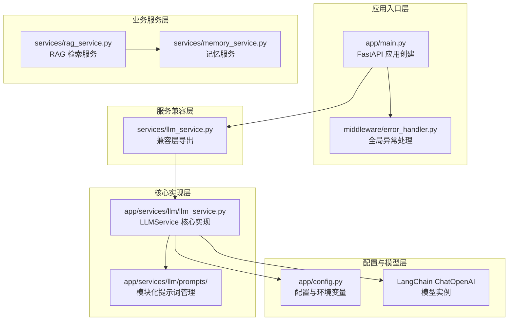
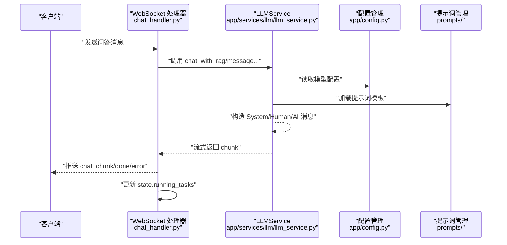
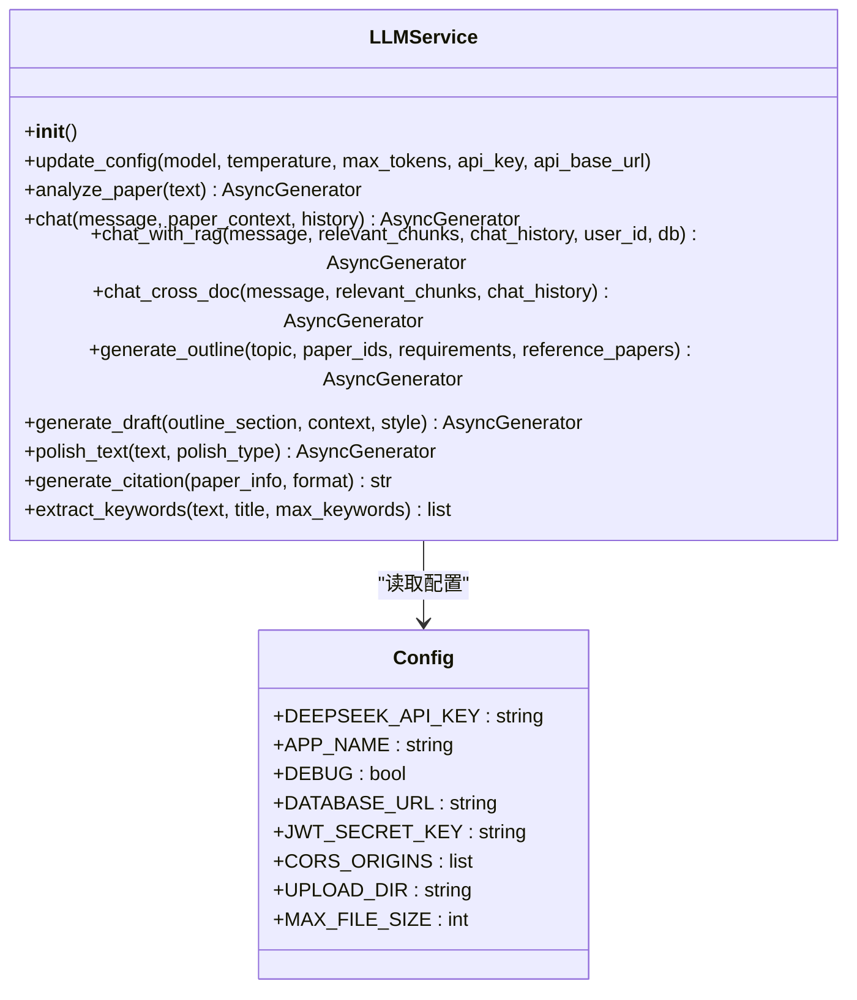
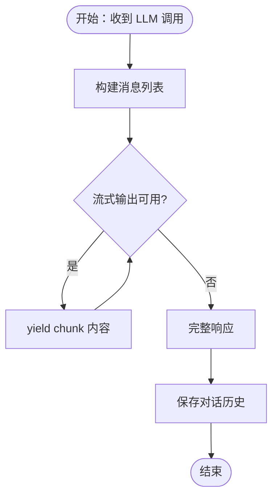
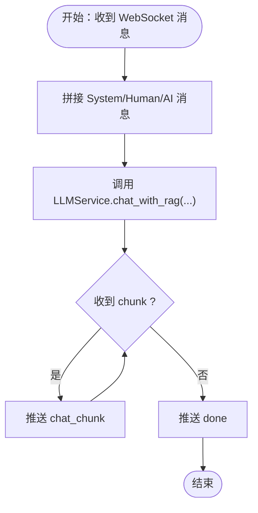
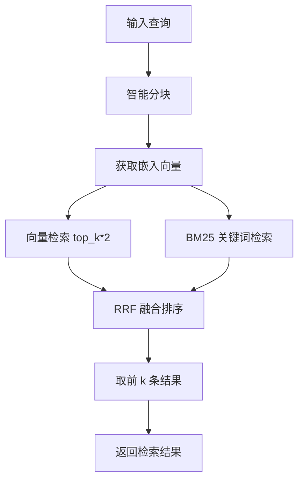
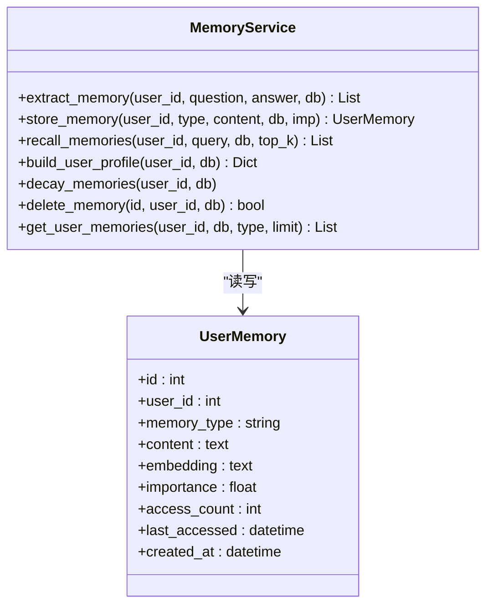
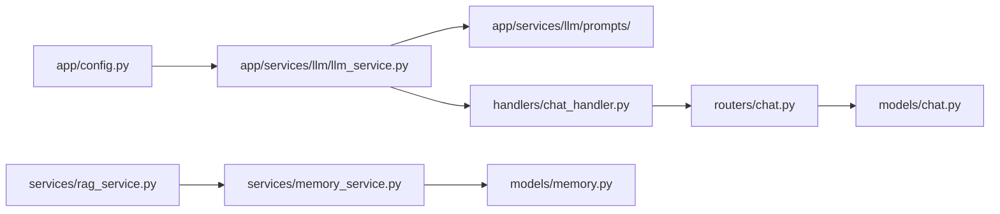

# LLM 服务

<cite>
**本文引用的文件**
- [backend/app/services/llm/llm_service.py](file://backend/app/services/llm/llm_service.py)
- [backend/app/services/llm_service.py](file://backend/app/services/llm_service.py)
- [backend/services/llm_service.py](file://backend/services/llm_service.py)
- [backend/app/config.py](file://backend/app/config.py)
- [backend/app/main.py](file://backend/app/main.py)
- [backend/app/routers/chat.py](file://backend/app/routers/chat.py)
- [backend/app/handlers/chat_handler.py](file://backend/app/handlers/chat_handler.py)
- [backend/app/models/chat.py](file://backend/app/models/chat.py)
- [backend/app/middleware/error_handler.py](file://backend/app/middleware/error_handler.py)
- [backend/app/services/memory_service.py](file://backend/app/services/memory_service.py)
- [backend/app/models/memory.py](file://backend/app/models/memory.py)
- [backend/app/services/rag_service.py](file://backend/app/services/rag_service.py)
- [backend/app/services/llm/prompts/__init__.py](file://backend/app/services/llm/prompts/__init__.py)
- [backend/app/services/llm/prompts/analyze.py](file://backend/app/services/llm/prompts/analyze.py)
- [backend/app/services/llm/prompts/chat.py](file://backend/app/services/llm/prompts/chat.py)
- [backend/app/services/llm/prompts/rag.py](file://backend/app/services/llm/prompts/rag.py)
- [backend/app/services/llm/prompts/reading.py](file://backend/app/services/llm/prompts/reading.py)
- [backend/app/services/llm/prompts/writing.py](file://backend/app/services/llm/prompts/writing.py)
</cite>

## 更新摘要
**所做更改**
- 新增多提供商支持架构，从单一 DeepSeek 实现扩展为可配置的多提供商模型
- 增强提示词管理系统，采用模块化分层设计，支持分析、聊天、RAG、阅读、写作五大功能域
- 完善流式处理架构，支持多种流式输出模式和错误处理机制
- 更新配置管理，支持运行时动态更新模型参数和 API 密钥
- 扩展功能范围，新增多论文对比分析、文献综述生成、学术润色等高级功能

## 目录
1. [简介](#简介)
2. [项目结构](#项目结构)
3. [核心组件](#核心组件)
4. [架构总览](#架构总览)
5. [组件详解](#组件详解)
6. [多提供商支持架构](#多提供商支持架构)
7. [增强的提示词管理系统](#增强的提示词管理系统)
8. [流式处理架构](#流式处理架构)
9. [依赖关系分析](#依赖关系分析)
10. [性能考量](#性能考量)
11. [故障排查指南](#故障排查指南)
12. [结论](#结论)
13. [附录](#附录)

## 简介
本文档详细介绍 ChatPDF 项目的 LLM 服务技术实现，重点涵盖多提供商支持架构、增强的提示词管理系统、流式处理架构、模型参数配置、响应处理机制、会话与上下文管理、错误处理与健康检查，以及可扩展的 RAG 与记忆服务。文档提供了完整的调用流程图、类关系图与数据流图，帮助开发者快速理解与实施。

## 项目结构
后端采用 FastAPI + SQLAlchemy + LangChain 的现代化组合，LLM 服务经过重构分为三层架构：兼容层导出、核心实现和服务层；聊天路由与处理器负责 WebSocket 问答流式输出；RAG 服务提供向量检索与混合检索；记忆服务提供用户长期记忆的抽取、存储、召回与衰减。

**图表来源**
- [backend/app/main.py:1-114](file://backend/app/main.py#L1-L114)
- [backend/app/services/llm_service.py:1-53](file://backend/app/services/llm_service.py#L1-L53)
- [backend/app/services/llm/llm_service.py:1-718](file://backend/app/services/llm/llm_service.py#L1-L718)
- [backend/app/services/llm/prompts/__init__.py:1-57](file://backend/app/services/llm/prompts/__init__.py#L1-L57)
- [backend/app/config.py:1-47](file://backend/app/config.py#L1-L47)

**章节来源**
- [backend/app/main.py:1-114](file://backend/app/main.py#L1-L114)
- [backend/app/services/llm_service.py:1-53](file://backend/app/services/llm_service.py#L1-L53)
- [backend/app/services/llm/llm_service.py:1-718](file://backend/app/services/llm/llm_service.py#L1-L718)
- [backend/app/services/llm/prompts/__init__.py:1-57](file://backend/app/services/llm/prompts/__init__.py#L1-L57)
- [backend/app/config.py:1-47](file://backend/app/config.py#L1-L47)

## 核心组件
- **LLMService 核心实现**：基于 LangChain 的多提供商支持，封装 DeepSeek Chat 模型调用，支持流式响应与消息历史拼接，提供论文问答、分析、RAG、阅读辅助、写作辅助等全方位能力。
- **配置系统**：集中管理应用名称、数据库、API Key、JWT、CORS、上传目录与大小限制等，支持运行时动态更新。
- **提示词管理系统**：采用模块化分层设计，按功能域划分 analyze、chat、rag、reading、writing 五个子模块，便于维护与扩展。
- **聊天路由与处理器**：提供会话 CRUD、消息分页查询，WebSocket 问答处理器将 LLM 流式输出通过 WebSocket 推送。
- **RAGService**：基于 ChromaDB 的向量检索与 BM25 混合检索，支持跨文档检索与 RRF 融合排序。
- **MemoryService**：从对话中抽取记忆、向量化存储、相似度召回、时间衰减与画像聚合。
- **错误处理中间件**：统一捕获校验、HTTP、SQLAlchemy 与通用异常，返回标准化错误响应。

**章节来源**
- [backend/app/services/llm/llm_service.py:33-132](file://backend/app/services/llm/llm_service.py#L33-L132)
- [backend/app/config.py:15-47](file://backend/app/config.py#L15-L47)
- [backend/app/services/llm/prompts/__init__.py:1-57](file://backend/app/services/llm/prompts/__init__.py#L1-L57)
- [backend/app/routers/chat.py:21-417](file://backend/app/routers/chat.py#L21-L417)
- [backend/app/handlers/chat_handler.py:11-32](file://backend/app/handlers/chat_handler.py#L11-L32)
- [backend/app/services/rag_service.py:16-400](file://backend/app/services/rag_service.py#L16-L400)
- [backend/app/services/memory_service.py:46-438](file://backend/app/services/memory_service.py#L46-L438)
- [backend/app/middleware/error_handler.py:11-92](file://backend/app/middleware/error_handler.py#L11-L92)

## 架构总览
下图展示了从 WebSocket 请求到 LLM 流式响应的整体链路，以及与会话、RAG、记忆服务的协作关系。新架构支持多提供商切换和动态配置更新。

**图表来源**
- [backend/app/handlers/chat_handler.py:11-32](file://backend/app/handlers/chat_handler.py#L11-L32)
- [backend/app/services/llm/llm_service.py:177-253](file://backend/app/services/llm/llm_service.py#L177-L253)
- [backend/app/config.py:28-30](file://backend/app/config.py#L28-L30)
- [backend/app/services/llm/prompts/__init__.py:1-57](file://backend/app/services/llm/prompts/__init__.py#L1-L57)

## 组件详解

### LLMService 核心实现与多提供商支持
LLMService 经过重构，从单一 DeepSeek 实现扩展为可配置的多提供商架构：

- **模型初始化**：使用 ChatOpenAI 作为基础模型，支持运行时动态更新模型参数和 API 密钥
- **配置管理**：提供 `update_config()` 方法支持运行时动态更新，包括模型名称、温度、最大 Token、API Key、Base URL
- **流式响应**：所有核心方法均支持异步生成器返回，实现真正的流式输出
- **错误处理**：内置完善的异常处理机制，确保服务稳定性

**图表来源**
- [backend/app/services/llm/llm_service.py:33-132](file://backend/app/services/llm/llm_service.py#L33-L132)
- [backend/app/config.py:15-47](file://backend/app/config.py#L15-L47)

**章节来源**
- [backend/app/services/llm/llm_service.py:33-132](file://backend/app/services/llm/llm_service.py#L33-L132)
- [backend/app/services/llm_service.py:1-53](file://backend/app/services/llm_service.py#L1-L53)

### 提示词管理系统与动态参数
提示词管理采用模块化分层设计，按功能域划分五大模块：

#### 分析功能域 (analyze.py)
- **论文结构分析**：ANALYZE_SYSTEM_PROMPT - 结构化解析论文内容
- **深度分析**：DEEP_ANALYZE_PROMPT - 六维度深度分析框架
- **多论文对比**：COMPARE_PAPERS_PROMPT - 多维度对比分析

#### 聊天功能域 (chat.py)
- **论文问答**：CHAT_SYSTEM_PROMPT - 基于论文内容的问答系统

#### RAG 功能域 (rag.py)
- **检索增强问答**：RAG_CHAT_SYSTEM_PROMPT - 基于检索结果的问答
- **搜索增强问答**：RAG_CHAT_WITH_SEARCH_SYSTEM_PROMPT - 结合论文和网络搜索
- **跨文档问答**：CROSS_DOC_CHAT_SYSTEM_PROMPT - 多论文内容问答

#### 阅读辅助功能域 (reading.py)
- **术语解释**：EXPLAIN_TERM_PROMPT - 学术术语解释
- **文本摘要**：SUMMARIZE_PROMPT - 学术文本摘要
- **文本翻译**：TRANSLATE_PROMPT - 学术文本翻译

#### 写作辅助功能域 (writing.py)
- **文献综述**：GENERATE_REVIEW_PROMPT - 结构化文献综述生成
- **论文大纲**：GENERATE_OUTLINE_PROMPT - 结构化论文大纲生成
- **段落初稿**：GENERATE_DRAFT_PROMPT - 学术段落初稿生成
- **文本润色**：POLISH_TEXT_PROMPT - 学术文本润色
- **引用格式**：CITATION_FORMAT_TEMPLATES - 多格式引用模板

**章节来源**
- [backend/app/services/llm/prompts/__init__.py:1-57](file://backend/app/services/llm/prompts/__init__.py#L1-L57)
- [backend/app/services/llm/prompts/analyze.py:1-89](file://backend/app/services/llm/prompts/analyze.py#L1-L89)
- [backend/app/services/llm/prompts/chat.py:1-16](file://backend/app/services/llm/prompts/chat.py#L1-L16)
- [backend/app/services/llm/prompts/rag.py:1-54](file://backend/app/services/llm/prompts/rag.py#L1-L54)
- [backend/app/services/llm/prompts/reading.py:1-49](file://backend/app/services/llm/prompts/reading.py#L1-L49)
- [backend/app/services/llm/prompts/writing.py:1-150](file://backend/app/services/llm/prompts/writing.py#L1-L150)

### 流式处理架构
新架构实现了完整的流式处理能力：

#### 核心流式方法
- **论文分析流式输出**：`analyze_paper()` - 结构化解释的实时输出
- **问答流式响应**：`chat()` - 基于论文内容的实时问答
- **RAG 流式问答**：`chat_with_rag()` - 检索增强的实时问答
- **跨文档流式问答**：`chat_cross_doc()` - 多论文内容的实时问答
- **写作流式生成**：`generate_outline()`、`generate_draft()`、`polish_text()` - 实时内容生成

#### 流式处理特点
- **异步生成器**：所有核心方法返回 AsyncGenerator，支持真正的流式处理
- **增量输出**：实时输出中间结果，提升用户体验
- **内存优化**：避免一次性加载大量数据，降低内存占用
- **错误恢复**：流式过程中出现错误时，优雅降级并提供错误信息

**图表来源**
- [backend/app/services/llm/llm_service.py:146-176](file://backend/app/services/llm/llm_service.py#L146-L176)
- [backend/app/services/llm/llm_service.py:177-253](file://backend/app/services/llm/llm_service.py#L177-L253)

**章节来源**
- [backend/app/services/llm/llm_service.py:133-480](file://backend/app/services/llm/llm_service.py#L133-L480)

### 会话与上下文管理
- **会话模型**：支持单论文与跨文档会话，消息持久化，支持分页查询与来源字段
- **路由接口**：创建、查询、更新、删除会话，按论文筛选，自动创建默认会话
- **处理器**：WebSocket 问答处理器异步消费 LLMService 的流式输出，统一推送 chat_chunk、done、error

**图表来源**
- [backend/app/handlers/chat_handler.py:11-32](file://backend/app/handlers/chat_handler.py#L11-L32)
- [backend/app/services/llm/llm_service.py:177-253](file://backend/app/services/llm/llm_service.py#L177-L253)

**章节来源**
- [backend/app/routers/chat.py:21-417](file://backend/app/routers/chat.py#L21-L417)
- [backend/app/models/chat.py:14-71](file://backend/app/models/chat.py#L14-L71)
- [backend/app/handlers/chat_handler.py:11-32](file://backend/app/handlers/chat_handler.py#L11-L32)

### RAG 检索与混合检索
- **ChromaDB 向量索引**：按论文 ID 创建独立 collection，智能分块策略（固定 chunk_size 与 overlap），向量化后入库
- **BM25 缓存**：首次构建后缓存，避免重复构建开销
- **混合检索**：语义检索 + BM25 关键词检索，RRF 融合排序，支持跨文档检索
- **运行时配置**：支持 top_k、chunk_size、chunk_overlap 的动态调整（部分参数仅影响新索引）

**图表来源**
- [backend/app/services/rag_service.py:102-161](file://backend/app/services/rag_service.py#L102-L161)
- [backend/app/services/rag_service.py:233-306](file://backend/app/services/rag_service.py#L233-L306)
- [backend/app/services/rag_service.py:308-335](file://backend/app/services/rag_service.py#L308-L335)

**章节来源**
- [backend/app/services/rag_service.py:16-400](file://backend/app/services/rag_service.py#L16-L400)

### 记忆服务：抽取、存储、召回与衰减
- **记忆抽取**：基于对话内容生成 JSON 结构的记忆列表，过滤无效项并异步存储
- **向量化存储**：使用 SentenceTransformer 生成嵌入，相似度阈值去重，避免重复记忆
- **召回策略**：查询向量与记忆向量计算余弦相似度，综合重要性与时间衰减因子排序，更新访问计数与时间
- **画像聚合**：按类型聚合用户记忆，构建用户画像
- **衰减与清理**：超过阈值未访问的记忆降低重要性，支持删除与批量查询

**图表来源**
- [backend/app/services/memory_service.py:46-438](file://backend/app/services/memory_service.py#L46-L438)
- [backend/app/models/memory.py:14-54](file://backend/app/models/memory.py#L14-L54)

**章节来源**
- [backend/app/services/memory_service.py:46-438](file://backend/app/services/memory_service.py#L46-L438)
- [backend/app/models/memory.py:14-54](file://backend/app/models/memory.py#L14-L54)

### 错误处理与健康检查
- **全局异常处理**：统一捕获 Pydantic 校验、HTTP、SQLAlchemy 与通用异常，返回标准化 JSON
- **健康检查**：/api/health 返回应用状态与版本信息
- **生命周期**：应用启动时初始化数据库、加载默认用户配置；关闭时释放数据库连接

**章节来源**
- [backend/app/middleware/error_handler.py:11-92](file://backend/app/middleware/error_handler.py#L11-L92)
- [backend/app/main.py:16-53](file://backend/app/main.py#L16-L53)
- [backend/app/main.py:102-114](file://backend/app/main.py#L102-L114)

## 多提供商支持架构
新架构支持多提供商切换和动态配置：

### 配置管理增强
- **运行时更新**：`update_config()` 方法支持动态更新模型参数
- **API Key 管理**：支持脱敏 API Key 检测，避免敏感信息泄露
- **提供商抽象**：基于 ChatOpenAI 抽象，可轻松适配其他提供商

### 多提供商适配策略
- **统一接口**：所有提供商使用相同的 LLMService 接口
- **配置隔离**：不同提供商的配置独立管理
- **无缝切换**：通过配置更新实现提供商间的无缝切换

**章节来源**
- [backend/app/services/llm/llm_service.py:74-132](file://backend/app/services/llm/llm_service.py#L74-L132)
- [backend/app/config.py:28-30](file://backend/app/config.py#L28-L30)

## 增强的提示词管理系统
提示词管理采用模块化分层设计，提升可维护性和扩展性：

### 模块化设计
- **功能域分离**：按 analyze、chat、rag、reading、writing 划分
- **统一导出**：通过 __init__.py 统一导出所有提示词常量
- **类型安全**：每个模块专注于特定功能域，避免交叉污染

### 提示词模板设计原则
- **严格遵守指示**：所有提示词都包含"【重要指示 - 必须严格遵守】"条款
- **格式约束**：明确输出格式要求，如 JSON 结构、Markdown 格式等
- **内容完整性**：确保提示词覆盖所有必要的约束条件
- **多语言支持**：主要使用中文，部分场景支持英文

**章节来源**
- [backend/app/services/llm/prompts/__init__.py:1-57](file://backend/app/services/llm/prompts/__init__.py#L1-L57)
- [backend/app/services/llm/prompts/analyze.py:1-89](file://backend/app/services/llm/prompts/analyze.py#L1-L89)
- [backend/app/services/llm/prompts/reading.py:1-49](file://backend/app/services/llm/prompts/reading.py#L1-L49)
- [backend/app/services/llm/prompts/writing.py:1-150](file://backend/app/services/llm/prompts/writing.py#L1-L150)

## 流式处理架构
新架构实现了完整的流式处理能力，提升用户体验和系统性能：

### 流式输出机制
- **异步生成器模式**：所有核心方法返回 AsyncGenerator，支持真正的流式输出
- **增量响应**：实时输出中间结果，避免长时间等待
- **内存优化**：流式处理避免一次性加载大量数据，降低内存占用
- **错误处理**：流式过程中出现错误时，优雅降级并提供错误信息

### 流式处理应用场景
- **实时问答**：用户提问后立即获得部分响应
- **内容生成**：论文大纲、段落初稿、文献综述的实时生成
- **分析过程**：论文深度分析的逐步输出
- **翻译过程**：学术文本翻译的实时显示

**章节来源**
- [backend/app/services/llm/llm_service.py:133-480](file://backend/app/services/llm/llm_service.py#L133-L480)

## 依赖关系分析
新架构的依赖关系更加清晰和模块化：

- **LLMService 依赖**：配置模块、提示词管理、LangChain ChatOpenAI
- **WebSocket 处理器**：依赖 LLMService 的流式接口
- **聊天路由**：依赖会话/消息模型与认证服务
- **RAGService**：依赖 ChromaDB 与 BM25，内部使用线程池与延迟加载模型
- **MemoryService**：依赖 SQL 存储与向量模型，提供记忆抽取与召回

**图表来源**
- [backend/app/config.py:15-47](file://backend/app/config.py#L15-L47)
- [backend/app/services/llm/llm_service.py:1-718](file://backend/app/services/llm/llm_service.py#L1-L718)
- [backend/app/services/llm/prompts/__init__.py:1-57](file://backend/app/services/llm/prompts/__init__.py#L1-L57)
- [backend/app/handlers/chat_handler.py:11-32](file://backend/app/handlers/chat_handler.py#L11-L32)
- [backend/app/routers/chat.py:21-417](file://backend/app/routers/chat.py#L21-L417)
- [backend/app/models/chat.py:14-71](file://backend/app/models/chat.py#L14-L71)
- [backend/app/services/rag_service.py:16-400](file://backend/app/services/rag_service.py#L16-L400)
- [backend/app/services/memory_service.py:46-438](file://backend/app/services/memory_service.py#L46-L438)
- [backend/app/models/memory.py:14-54](file://backend/app/models/memory.py#L14-L54)

**章节来源**
- [backend/app/config.py:15-47](file://backend/app/config.py#L15-L47)
- [backend/app/services/llm/llm_service.py:1-718](file://backend/app/services/llm/llm_service.py#L1-L718)
- [backend/app/services/llm/prompts/__init__.py:1-57](file://backend/app/services/llm/prompts/__init__.py#L1-L57)
- [backend/app/handlers/chat_handler.py:11-32](file://backend/app/handlers/chat_handler.py#L11-L32)
- [backend/app/routers/chat.py:21-417](file://backend/app/routers/chat.py#L21-L417)
- [backend/app/models/chat.py:14-71](file://backend/app/models/chat.py#L14-L71)
- [backend/app/services/rag_service.py:16-400](file://backend/app/services/rag_service.py#L16-L400)
- [backend/app/services/memory_service.py:46-438](file://backend/app/services/memory_service.py#L46-L438)
- [backend/app/models/memory.py:14-54](file://backend/app/models/memory.py#L14-L54)

## 性能考量
新架构在性能方面进行了全面优化：

- **流式输出**：LLMService 使用 streaming=True，WebSocket 处理器逐 chunk 推送，降低首字延迟与内存占用
- **模型懒加载**：RAGService 与 MemoryService 的嵌入模型采用延迟加载与线程池执行，避免阻塞事件循环
- **检索优化**：BM25 首次构建后缓存，向量检索限定 n_results，减少无关候选；RRF 融合提升质量
- **上下文裁剪**：聊天系统提示词中对 paper_context 截断，防止超出上下文窗口
- **内存管理**：流式处理避免一次性加载大量数据，降低内存峰值
- **配置缓存**：运行时配置更新后缓存最新配置，避免频繁读取
- **错误恢复**：流式过程中出现错误时，优雅降级并提供错误信息

**章节来源**
- [backend/app/services/llm/llm_service.py:44-51](file://backend/app/services/llm/llm_service.py#L44-L51)
- [backend/app/handlers/chat_handler.py:14-18](file://backend/app/handlers/chat_handler.py#L14-L18)
- [backend/app/services/rag_service.py:82-93](file://backend/app/services/rag_service.py#L82-L93)
- [backend/app/services/memory_service.py:54-65](file://backend/app/services/memory_service.py#L54-L65)
- [backend/app/services/llm/llm_service.py:146-176](file://backend/app/services/llm/llm_service.py#L146-L176)

## 故障排查指南
新架构的故障排查指南：

- **健康检查**：访问 /api/health 确认应用运行状态
- **异常处理**：全局中间件统一返回 422/404/500 等标准化错误，结合日志定位问题
- **配置问题**：检查 DEEPSEEK_API_KEY 是否正确设置，支持运行时动态更新
- **流式处理**：监控 WebSocket 连接状态，检查流式输出是否正常
- **提示词问题**：验证提示词模板格式，确保符合预期格式要求
- **会话问题**：检查会话归属与消息分页参数，确保用户权限与 paper_ids/paper_id 一致性
- **RAG 索引**：确认论文 collection 已建立，必要时重建索引或清理缓存
- **记忆服务**：关注相似度阈值与时间衰减策略，定期清理低价值记忆

**章节来源**
- [backend/app/main.py:102-114](file://backend/app/main.py#L102-L114)
- [backend/app/middleware/error_handler.py:11-92](file://backend/app/middleware/error_handler.py#L11-L92)
- [backend/app/config.py:28-30](file://backend/app/config.py#L28-L30)
- [backend/app/routers/chat.py:21-417](file://backend/app/routers/chat.py#L21-L417)
- [backend/app/services/rag_service.py:337-371](file://backend/app/services/rag_service.py#L337-L371)
- [backend/app/services/memory_service.py:174-224](file://backend/app/services/memory_service.py#L174-L224)

## 结论
本 LLM 服务经过重构，采用多提供商支持架构，结合增强的提示词管理系统和流式处理架构，实现了论文问答的流式响应与会话管理。新架构以 LangChain 为核心，通过模块化设计提升了系统的可维护性和扩展性；通过多提供商支持增强了系统的灵活性；通过流式处理架构提升了用户体验。配置集中化、错误处理标准化与性能优化策略共同保障了系统的稳定性与可扩展性。

## 附录

### 调用示例与最佳实践
- **调用 LLM API（流式）**：参考 WebSocket 处理器对 LLMService.chat_with_rag 的调用方式，逐 chunk 推送，最后发送 done
- **处理流式响应**：前端应监听 chat_chunk，拼接内容并在 done 时停止等待
- **管理上下文对话**：在处理器中维护 state.running_tasks，确保任务取消与资源回收
- **提示词模板设计**：明确角色与约束，使用占位符注入动态参数，控制上下文长度与输出结构
- **多提供商切换**：通过 update_config 方法动态更新模型参数和 API Key 实现提供商切换
- **成本控制策略**：合理设置 temperature、max_tokens 与上下文截断；优先使用 RAG 与记忆召回，减少冗余上下文

**章节来源**
- [backend/app/handlers/chat_handler.py:11-32](file://backend/app/handlers/chat_handler.py#L11-L32)
- [backend/app/services/llm/llm_service.py:177-253](file://backend/app/services/llm/llm_service.py#L177-L253)
- [backend/app/services/llm/prompts/__init__.py:1-57](file://backend/app/services/llm/prompts/__init__.py#L1-L57)
- [backend/app/services/llm/llm_service.py:74-132](file://backend/app/services/llm/llm_service.py#L74-L132)