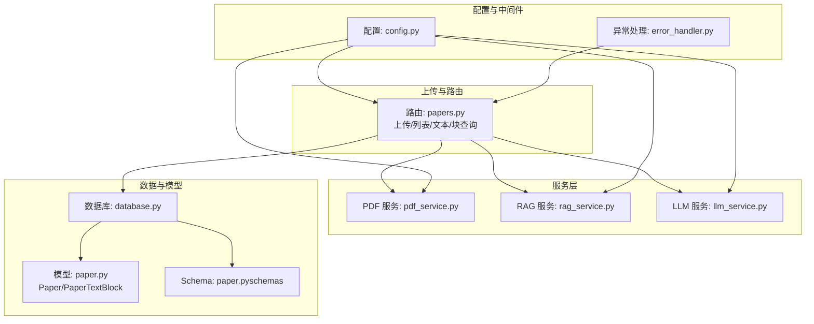
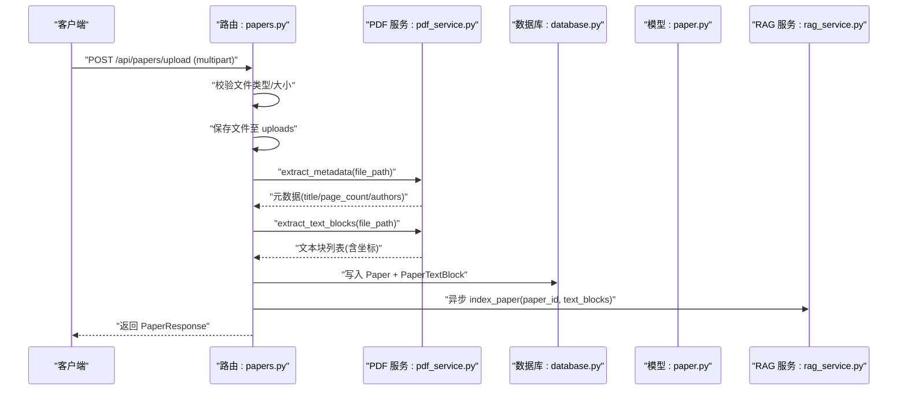
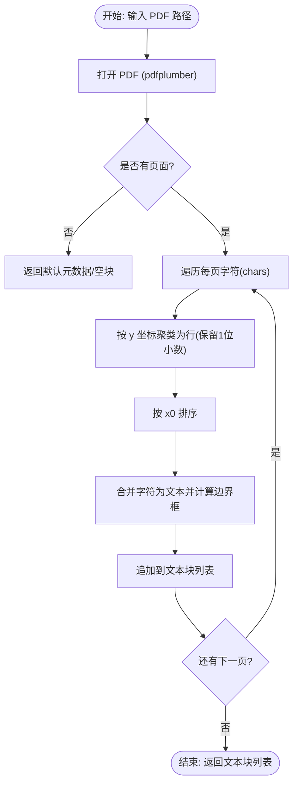
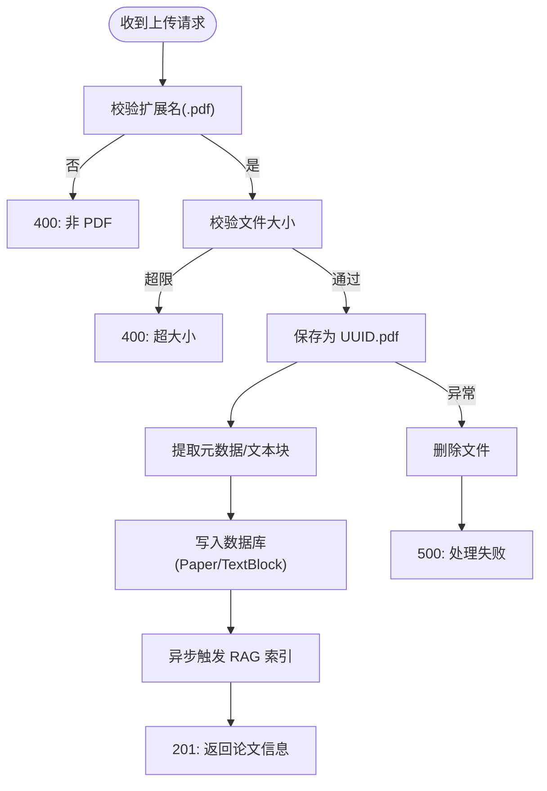
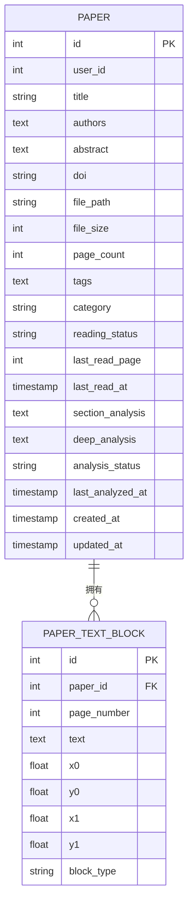
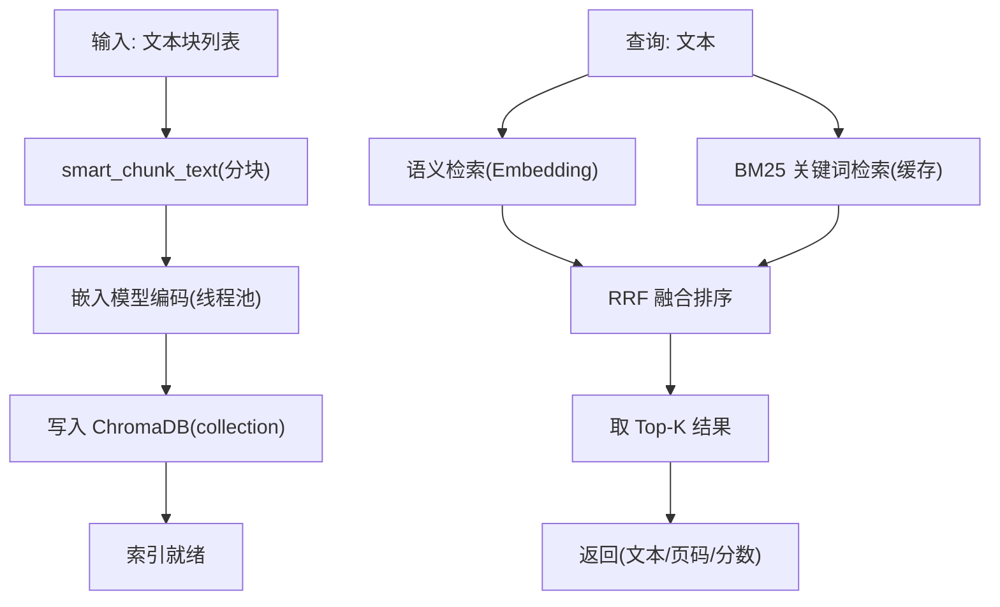
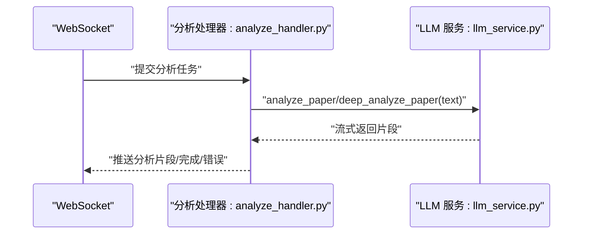
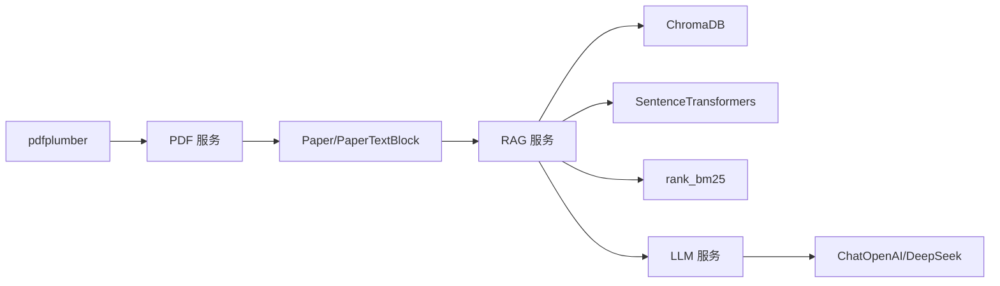

# PDF 服务

<cite>
**本文引用的文件**
- [pdf_service.py](file://backend/app/services/pdf_service.py)
- [papers.py](file://backend/app/routers/papers.py)
- [paper.py](file://backend/app/models/paper.py)
- [paper.py（schemas）](file://backend/app/schemas/paper.py)
- [config.py](file://backend/app/config.py)
- [database.py](file://backend/app/database.py)
- [error_handler.py](file://backend/app/middleware/error_handler.py)
- [rag_service.py](file://backend/app/services/rag_service.py)
- [llm_service.py](file://backend/app/services/llm_service.py)
- [llm_service.py（兼容层）](file://backend/app/services/llm_service.py)
- [analyze_handler.py](file://backend/app/handlers/analyze_handler.py)
</cite>

## 目录
1. [简介](#简介)
2. [项目结构](#项目结构)
3. [核心组件](#核心组件)
4. [架构总览](#架构总览)
5. [详细组件分析](#详细组件分析)
6. [依赖分析](#依赖分析)
7. [性能考虑](#性能考虑)
8. [故障排查指南](#故障排查指南)
9. [结论](#结论)
10. [附录](#附录)

## 简介
本文件面向“PDF 服务”的技术文档，聚焦于 PDF 文档解析与处理的完整流程，覆盖文件上传与验证、PDF 解析引擎、文本提取算法、坐标系统与布局分析、格式转换与存储、以及与 RAG/LLM 的集成。文档同时总结了错误处理与异常恢复策略，并给出针对不同 PDF 类型（含复杂版式、表格、章节标题、参考文献等）的处理建议与实践路径。

## 项目结构
后端采用 FastAPI + SQLAlchemy（异步）+ ChromaDB + LangChain 的组合，围绕“论文”实体提供上传、解析、检索与分析能力。PDF 解析主要通过 pdfplumber 完成，文本块按字符级坐标聚合并形成结构化数据，随后进入 RAG 向量化与检索链路，最终由 LLM 提供分析与问答。

图表来源
- [papers.py:156-262](file://backend/app/routers/papers.py#L156-L262)
- [pdf_service.py:11-194](file://backend/app/services/pdf_service.py#L11-L194)
- [rag_service.py:16-415](file://backend/app/services/rag_service.py#L16-L415)
- [llm_service.py:29-710](file://backend/app/services/llm_service.py#L29-L710)
- [paper.py:11-85](file://backend/app/models/paper.py#L11-L85)
- [paper.py（schemas）:7-83](file://backend/app/schemas/paper.py#L7-L83)
- [config.py:15-44](file://backend/app/config.py#L15-L44)
- [database.py:13-81](file://backend/app/database.py#L13-L81)
- [error_handler.py:73-92](file://backend/app/middleware/error_handler.py#L73-L92)

章节来源
- [papers.py:156-262](file://backend/app/routers/papers.py#L156-L262)
- [pdf_service.py:11-194](file://backend/app/services/pdf_service.py#L11-L194)
- [paper.py:11-85](file://backend/app/models/paper.py#L11-L85)
- [paper.py（schemas）:7-83](file://backend/app/schemas/paper.py#L7-L83)
- [config.py:15-44](file://backend/app/config.py#L15-L44)
- [database.py:13-81](file://backend/app/database.py#L13-L81)
- [error_handler.py:73-92](file://backend/app/middleware/error_handler.py#L73-L92)

## 核心组件
- PDF 解析与文本提取：基于 pdfplumber 的字符级坐标提取、按行聚合并生成文本块，支持元数据提取与页数统计。
- 上传与验证：路由层对文件类型、大小进行校验，使用 UUID 生成安全文件名，失败时清理临时文件。
- 文本块持久化：将解析出的文本块写入 PaperTextBlock 表，保留页面号与边界框坐标。
- RAG 向量化与检索：将文本块智能分块、嵌入编码并存入 ChromaDB；混合检索（语义 + BM25）+ RRF 融合排序。
- LLM 分析与对话：提供论文分析、深度分析、问答、术语解释、摘要、翻译、文献综述、大纲生成、润色等能力。
- 错误处理：统一异常处理中间件，路由层在业务异常时清理文件并返回标准错误。

章节来源
- [pdf_service.py:14-194](file://backend/app/services/pdf_service.py#L14-L194)
- [papers.py:156-262](file://backend/app/routers/papers.py#L156-L262)
- [paper.py:65-85](file://backend/app/models/paper.py#L65-L85)
- [rag_service.py:105-164](file://backend/app/services/rag_service.py#L105-L164)
- [llm_service.py:129-471](file://backend/app/services/llm_service.py#L129-L471)
- [error_handler.py:11-92](file://backend/app/middleware/error_handler.py#L11-L92)

## 架构总览
PDF 服务的端到端流程如下：

图表来源
- [papers.py:156-262](file://backend/app/routers/papers.py#L156-L262)
- [pdf_service.py:14-194](file://backend/app/services/pdf_service.py#L14-L194)
- [paper.py:11-85](file://backend/app/models/paper.py#L11-L85)
- [rag_service.py:186-235](file://backend/app/services/rag_service.py#L186-L235)

## 详细组件分析

### PDF 解析与文本块提取（pdfplumber）
- 元数据提取：优先从 PDF 元数据读取标题与作者；若缺失则从第一页首行提取标题，兜底为“未命名论文”，并记录页数。
- 文本块提取：遍历每页字符，按 y 坐标（保留一位小数）聚类为行，再按 x0 排序合并文本，计算边界框，输出包含页面号、文本与坐标的块。
- 全文提取：逐页提取文本并拼接，用于 LLM 分析。
- 页数与有效性校验：通过 pdfplumber 打开并统计页数；扩展名与 PDF 头校验辅助快速判断。

图表来源
- [pdf_service.py:58-118](file://backend/app/services/pdf_service.py#L58-L118)

章节来源
- [pdf_service.py:14-194](file://backend/app/services/pdf_service.py#L14-L194)

### 上传与验证（FastAPI 路由）
- 文件类型：仅允许 .pdf，否则 400。
- 文件大小：受配置限制，超限 400。
- UUID 文件名：避免冲突与路径注入。
- 成功后：提取元数据与文本块，写入 Paper 与 PaperTextBlock；异步触发 RAG 索引。
- 失败清理：捕获异常时删除已保存文件，返回 500。

图表来源
- [papers.py:156-262](file://backend/app/routers/papers.py#L156-L262)
- [config.py:36-38](file://backend/app/config.py#L36-L38)

章节来源
- [papers.py:156-262](file://backend/app/routers/papers.py#L156-L262)
- [config.py:36-38](file://backend/app/config.py#L36-L38)

### 数据模型与存储（Paper 与 PaperTextBlock）
- Paper：存储论文元信息、文件路径、大小、页数、标签、分类、阅读状态等。
- PaperTextBlock：存储每块文本及其页面号与边界框，与 Paper 一对多关联，级联删除。

图表来源
- [paper.py:11-85](file://backend/app/models/paper.py#L11-L85)

章节来源
- [paper.py:11-85](file://backend/app/models/paper.py#L11-L85)

### RAG 向量化与检索
- 智能分块：按自然边界分块，目标块大小与重叠可配置；保留页码信息。
- 向量化：延迟加载嵌入模型，使用线程池执行编码，避免阻塞事件循环。
- 检索：语义检索 + BM25 关键词检索，RRF 融合排序；支持跨论文检索。
- 缓存：BM25 索引缓存，首次构建后复用；索引重建与删除支持。

图表来源
- [rag_service.py:105-164](file://backend/app/services/rag_service.py#L105-L164)
- [rag_service.py:236-309](file://backend/app/services/rag_service.py#L236-L309)

章节来源
- [rag_service.py:16-415](file://backend/app/services/rag_service.py#L16-L415)

### LLM 分析与对话
- 分析任务：论文分析、深度分析，流式返回；支持 WebSocket 推送增量结果。
- 对话能力：基于全文或 RAG 上下文问答；支持跨文档检索；可返回引用来源。
- 其他能力：术语解释、摘要、翻译、文献综述、大纲生成、段落草稿、润色、引用格式生成。

图表来源
- [analyze_handler.py:13-87](file://backend/app/handlers/analyze_handler.py#L13-L87)
- [llm_service.py:129-428](file://backend/app/services/llm_service.py#L129-L428)

章节来源
- [analyze_handler.py:13-87](file://backend/app/handlers/analyze_handler.py#L13-L87)
- [llm_service.py:129-428](file://backend/app/services/llm_service.py#L129-L428)

## 依赖分析
- pdfplumber：用于 PDF 字符级坐标提取与文本块生成。
- ChromaDB：持久化向量索引，支持按论文独立 collection。
- sentence-transformers：嵌入模型（paraphrase-multilingual-MiniLM-L12-v2），延迟加载与线程池执行。
- rank_bm25：BM25 关键词检索，配合 RRF 融合。
- FastAPI + SQLAlchemy（异步）：路由、数据库与依赖注入。
- LangChain + ChatOpenAI：与 DeepSeek API 交互，提供流式对话与分析。

图表来源
- [pdf_service.py:5-6](file://backend/app/services/pdf_service.py#L5-L6)
- [rag_service.py:11-13](file://backend/app/services/rag_service.py#L11-L13)
- [llm_service.py:4-6](file://backend/app/services/llm_service.py#L4-L6)

章节来源
- [pdf_service.py:5-6](file://backend/app/services/pdf_service.py#L5-L6)
- [rag_service.py:11-13](file://backend/app/services/rag_service.py#L11-L13)
- [llm_service.py:4-6](file://backend/app/services/llm_service.py#L4-L6)

## 性能考虑
- 解析性能
  - 使用 pdfplumber 的 chars 直接聚类，避免逐词扫描的额外开销。
  - 行聚类精度控制在小数点后一位，兼顾准确性与性能。
- 向量化与检索
  - 嵌入模型延迟加载，首次使用时在后台线程池初始化，避免阻塞主事件循环。
  - BM25 索引缓存，首次构建后复用，减少重复计算。
  - RRF 融合排序在结果集较小（Top-K*2）时进行，降低排序成本。
- I/O 与并发
  - 上传与解析分离：解析完成后立即返回响应，索引异步进行。
  - 批量上传与 ZIP 导入：逐文件解析并异步索引，避免阻塞。
- 存储与查询
  - PaperTextBlock 按页与 y0 排序存储，查询时可按页筛选，减少无关扫描。

[本节为通用性能建议，无需特定文件来源]

## 故障排查指南
- 上传失败
  - 症状：400（类型/大小），或 500（处理失败）。
  - 排查：确认文件扩展名为 .pdf，大小未超限；查看路由层异常处理与文件清理逻辑。
- PDF 无法解析
  - 症状：元数据/文本块为空。
  - 排查：确认 PDF 可被 pdfplumber 正常打开；检查页数与字符是否存在；必要时尝试修复 PDF。
- RAG 索引失败
  - 症状：索引计数为 0 或检索为空。
  - 排查：检查嵌入模型是否加载成功；确认文本块非空；查看 ChromaDB 权限与磁盘空间。
- LLM 调用异常
  - 症状：分析/问答无响应或报错。
  - 排查：检查 API Key 与网络连通性；确认提示词模板正确；查看流式输出是否被中断。
- 统一异常处理
  - 全局中间件捕获验证、HTTP、SQLAlchemy 与通用异常，返回标准化错误响应，便于前端与运维定位。

章节来源
- [papers.py:177-261](file://backend/app/routers/papers.py#L177-L261)
- [error_handler.py:11-92](file://backend/app/middleware/error_handler.py#L11-L92)
- [pdf_service.py:163-194](file://backend/app/services/pdf_service.py#L163-L194)
- [rag_service.py:232-234](file://backend/app/services/rag_service.py#L232-L234)
- [llm_service.py:113-127](file://backend/app/services/llm_service.py#L113-L127)

## 结论
该 PDF 服务以 pdfplumber 为核心解析器，结合结构化存储与 RAG 检索，实现了从上传、解析、索引到 LLM 分析的完整闭环。通过延迟加载、线程池与缓存等策略，兼顾了性能与稳定性。建议在实际部署中关注 PDF 类型多样性、大文件与高并发场景下的资源配额，并持续优化分块策略与检索融合算法以提升检索精度。

[本节为总结，无需特定文件来源]

## 附录

### 常见处理场景与建议
- 章节标题提取
  - 建议：利用文本块的 y0 与字号（可通过字符属性估算）进行层级识别；对连续高密度行进行标题候选筛选。
  - 参考实现路径：[pdf_service.py:58-118](file://backend/app/services/pdf_service.py#L58-L118)
- 表格数据提取
  - 建议：基于字符坐标网格化，检测密集列与行边界；对相邻字符按间距阈值合并为单元格。
  - 参考实现路径：[pdf_service.py:74-113](file://backend/app/services/pdf_service.py#L74-L113)
- 引用文献识别
  - 建议：结合 RAG 检索与 LLM 抽取，先用 BM25 提升关键词命中，再用 LLM 结构化抽取作者、标题、年份、期刊等字段。
  - 参考实现路径：[rag_service.py:236-309](file://backend/app/services/rag_service.py#L236-L309)、[llm_service.py:599-660](file://backend/app/services/llm_service.py#L599-L660)

### 错误处理与恢复策略
- 文件损坏
  - 策略：路由层在异常时删除已保存文件；解析失败时返回兜底元数据与空文本块。
  - 参考实现路径：[papers.py:254-261](file://backend/app/routers/papers.py#L254-L261)、[pdf_service.py:51-56](file://backend/app/services/pdf_service.py#L51-L56)
- 索引重建
  - 策略：提供删除与重建索引接口，清除 BM25 缓存后重新写入。
  - 参考实现路径：[rag_service.py:340-373](file://backend/app/services/rag_service.py#L340-L373)
- LLM 配置更新
  - 策略：运行时更新 API Key/Base URL/温度等，失败时保留原实例并记录日志。
  - 参考实现路径：[llm_service.py:70-127](file://backend/app/services/llm_service.py#L70-L127)