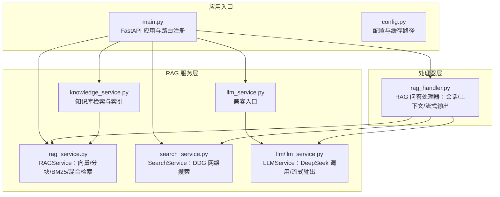
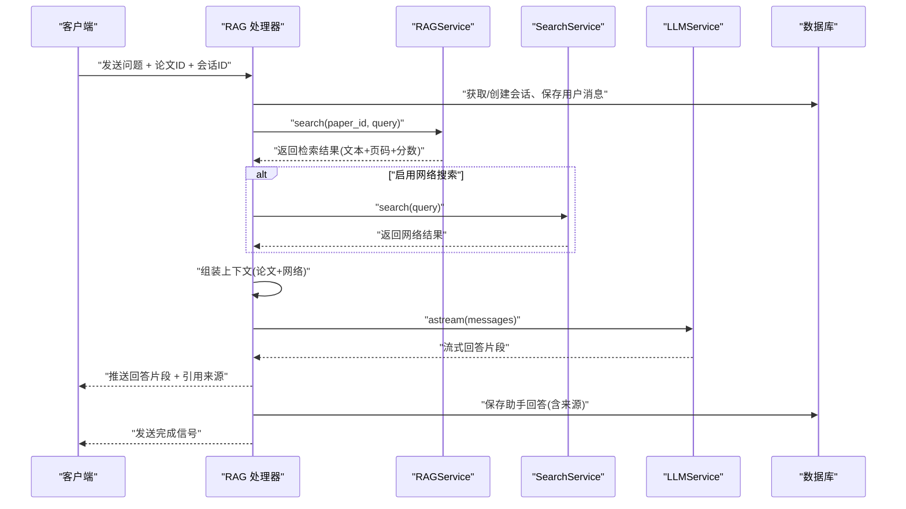
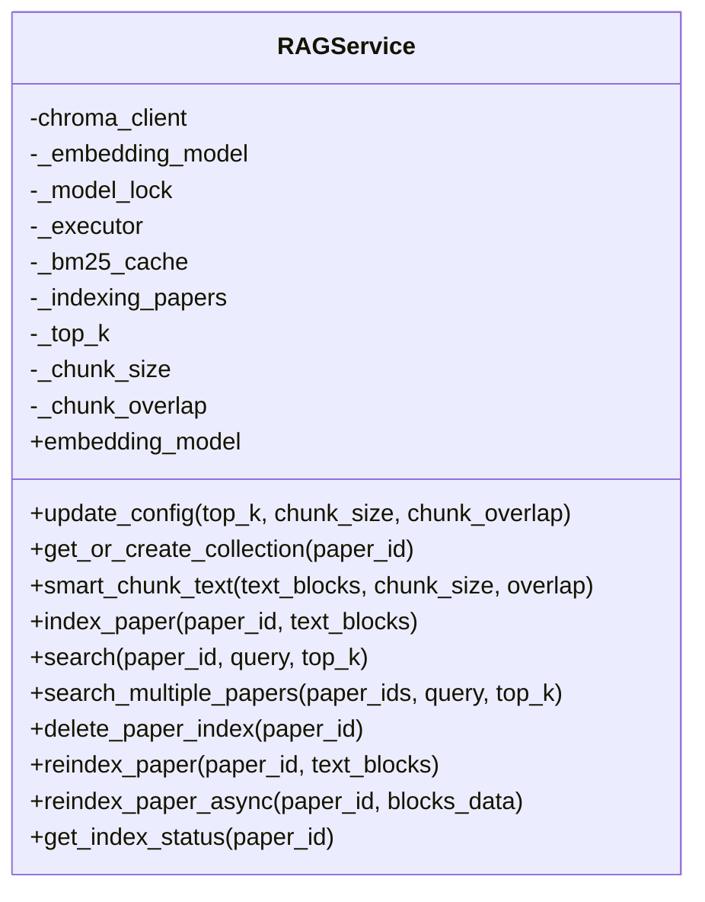
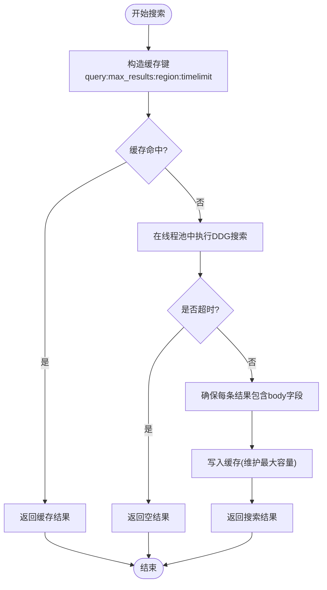
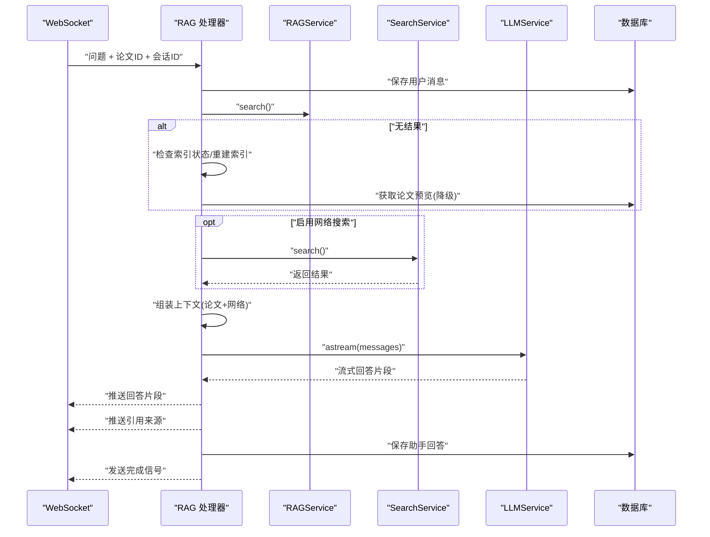
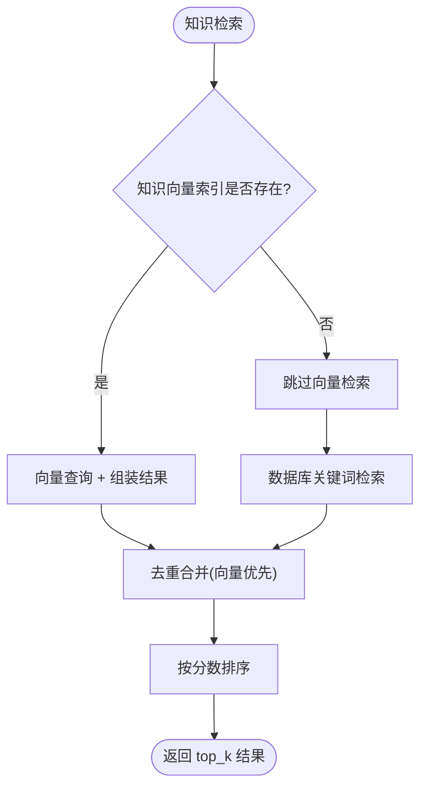
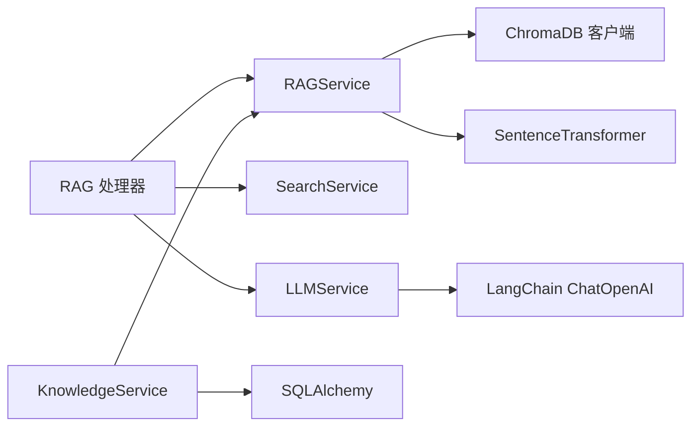

# RAG 服务

<cite>
**本文档引用的文件**
- [backend/app/services/rag_service.py](file://backend/app/services/rag_service.py)
- [backend/app/handlers/rag_handler.py](file://backend/app/handlers/rag_handler.py)
- [backend/app/services/search_service.py](file://backend/app/services/search_service.py)
- [backend/app/services/knowledge_service.py](file://backend/app/services/knowledge_service.py)
- [backend/app/models/knowledge.py](file://backend/app/models/knowledge.py)
- [backend/app/services/llm_service.py](file://backend/app/services/llm_service.py)
- [backend/app/services/llm/llm_service.py](file://backend/app/services/llm/llm_service.py)
- [backend/app/config.py](file://backend/app/config.py)
- [backend/app/main.py](file://backend/app/main.py)
</cite>

## 目录
1. [简介](#简介)
2. [项目结构](#项目结构)
3. [核心组件](#核心组件)
4. [架构总览](#架构总览)
5. [详细组件分析](#详细组件分析)
6. [依赖关系分析](#依赖关系分析)
7. [性能考虑](#性能考虑)
8. [故障排查指南](#故障排查指南)
9. [结论](#结论)
10. [附录](#附录)

## 简介
本文件面向 RAG（检索增强生成）服务的技术实现，系统性阐述基于 ChromaDB 的向量检索与 BM25 混合检索、语义嵌入与相似度计算、上下文构建与 LLM 答案生成的完整流程。文档重点覆盖：
- 向量嵌入模型选择与懒加载策略
- ChromaDB 集成与索引优化（按论文隔离 collection、分块策略、BM25 缓存）
- 检索策略（语义 + BM25 + RRF 融合排序）
- 上下文构建与 LLM 生成（流式输出、引用来源）
- 网络搜索（可选）与跨文档检索
- 性能优化（线程池、缓存、并发处理）

## 项目结构
后端采用 FastAPI + SQLAlchemy + LangChain 架构，RAG 相关逻辑集中在服务层与处理器层：
- 服务层：RAG 检索、网络搜索、知识库检索与索引、LLM 服务
- 处理器层：RAG 问答 WebSocket 流水线编排
- 配置层：应用配置与 HuggingFace 缓存路径设置

图表来源
- [backend/app/main.py:55-95](file://backend/app/main.py#L55-L95)
- [backend/app/services/rag_service.py:16-54](file://backend/app/services/rag_service.py#L16-L54)
- [backend/app/services/search_service.py:10-24](file://backend/app/services/search_service.py#L10-L24)
- [backend/app/services/knowledge_service.py:79-110](file://backend/app/services/knowledge_service.py#L79-L110)
- [backend/app/services/llm_service.py:1-27](file://backend/app/services/llm_service.py#L1-L27)
- [backend/app/services/llm/llm_service.py:29-48](file://backend/app/services/llm/llm_service.py#L29-L48)
- [backend/app/handlers/rag_handler.py:29-50](file://backend/app/handlers/rag_handler.py#L29-L50)

章节来源
- [backend/app/main.py:55-95](file://backend/app/main.py#L55-L95)
- [backend/app/config.py:15-41](file://backend/app/config.py#L15-L41)

## 核心组件
- RAGService：负责论文文本智能分块、向量化存储、语义检索、BM25 关键词检索、RRF 融合排序、跨论文检索、索引重建与状态管理
- SearchService：封装 DuckDuckGo 搜索，支持超时控制与结果缓存
- KnowledgeService：知识卡片向量化索引、全局检索（向量 + 关键词）、知识图谱数据导出
- LLMService：基于 LangChain 的 DeepSeek 大模型交互，支持多种任务与流式输出
- RAG 问答处理器：会话管理、检索与网络搜索、上下文组装、流式回答与引用来源推送

章节来源
- [backend/app/services/rag_service.py:16-54](file://backend/app/services/rag_service.py#L16-L54)
- [backend/app/services/search_service.py:10-24](file://backend/app/services/search_service.py#L10-L24)
- [backend/app/services/knowledge_service.py:79-110](file://backend/app/services/knowledge_service.py#L79-L110)
- [backend/app/services/llm/llm_service.py:29-48](file://backend/app/services/llm/llm_service.py#L29-L48)
- [backend/app/handlers/rag_handler.py:29-50](file://backend/app/handlers/rag_handler.py#L29-L50)

## 架构总览
RAG 问答的端到端流程如下：

图表来源
- [backend/app/handlers/rag_handler.py:29-224](file://backend/app/handlers/rag_handler.py#L29-L224)
- [backend/app/services/rag_service.py:236-310](file://backend/app/services/rag_service.py#L236-L310)
- [backend/app/services/search_service.py:41-104](file://backend/app/services/search_service.py#L41-L104)
- [backend/app/services/llm/llm_service.py:173-245](file://backend/app/services/llm/llm_service.py#L173-L245)

## 详细组件分析

### RAGService：向量检索与混合检索
- ChromaDB 集成
  - 使用持久化客户端，按论文 ID 创建独立 collection，空间设置为余弦距离
  - 索引元数据中的 list 字段转为 JSON 字符串以适配 ChromaDB
- 向量嵌入
  - 懒加载嵌入模型（SentenceTransformer，paraphrase-multilingual-MiniLM-L12-v2），首次使用时在事件循环线程池中加载
  - 编码过程同样通过线程池执行，避免阻塞异步事件循环
- 文本分块
  - 智能分块策略：按自然边界切分、目标块大小与重叠配置、保留页码信息
- 检索策略
  - 语义检索：查询向量与集合内向量计算余弦相似度
  - BM25 关键词检索：缓存 BM25 实例与全部文档，避免重复构建
  - RRF 融合排序：综合语义与关键词排序，提升召回质量
- 跨论文检索
  - 并行检索多个论文集合，聚合后按分数排序
- 索引管理
  - 支持删除索引、重建索引、异步重建与状态追踪
- 配置更新
  - 运行时可调整 top_k、分块大小与重叠（仅影响新索引）

图表来源
- [backend/app/services/rag_service.py:16-54](file://backend/app/services/rag_service.py#L16-L54)
- [backend/app/services/rag_service.py:186-235](file://backend/app/services/rag_service.py#L186-L235)
- [backend/app/services/rag_service.py:236-310](file://backend/app/services/rag_service.py#L236-L310)
- [backend/app/services/rag_service.py:311-339](file://backend/app/services/rag_service.py#L311-L339)
- [backend/app/services/rag_service.py:340-386](file://backend/app/services/rag_service.py#L340-L386)

章节来源
- [backend/app/services/rag_service.py:26-96](file://backend/app/services/rag_service.py#L26-L96)
- [backend/app/services/rag_service.py:105-164](file://backend/app/services/rag_service.py#L105-L164)
- [backend/app/services/rag_service.py:166-185](file://backend/app/services/rag_service.py#L166-L185)
- [backend/app/services/rag_service.py:186-235](file://backend/app/services/rag_service.py#L186-L235)
- [backend/app/services/rag_service.py:236-310](file://backend/app/services/rag_service.py#L236-L310)
- [backend/app/services/rag_service.py:311-386](file://backend/app/services/rag_service.py#L311-L386)

### SearchService：网络搜索与缓存
- DuckDuckGo 搜索封装，支持地区与时间限制
- 线程池执行同步搜索，配合超时控制
- 结果缓存（LRU 驱逐），支持清空缓存

图表来源
- [backend/app/services/search_service.py:41-104](file://backend/app/services/search_service.py#L41-L104)

章节来源
- [backend/app/services/search_service.py:19-40](file://backend/app/services/search_service.py#L19-L40)
- [backend/app/services/search_service.py:41-104](file://backend/app/services/search_service.py#L41-L104)

### RAG 问答处理器：会话、上下文与流式输出
- 会话管理：获取/创建会话、加载历史、自动标题
- 检索与降级：优先使用向量检索；若无结果则检查索引状态并触发异步重建；必要时使用论文预览作为上下文
- 网络搜索：可选开启，推送搜索状态与结果数量
- 上下文组装：论文来源标注页码；网络来源标注标题与链接
- LLM 调用：流式输出回答，逐片段推送；完成后推送引用来源并保存至数据库

图表来源
- [backend/app/handlers/rag_handler.py:29-224](file://backend/app/handlers/rag_handler.py#L29-L224)

章节来源
- [backend/app/handlers/rag_handler.py:29-224](file://backend/app/handlers/rag_handler.py#L29-L224)

### 知识库检索与索引：向量 + 关键词
- 知识卡片向量化索引：按用户隔离 collection，文本拼接（标题+内容+标签），编码后写入
- 全局检索：先做向量检索（若 collection 存在），再做数据库关键词检索，最后融合排序
- 知识图谱：导出节点与边，支持统计信息查询

图表来源
- [backend/app/services/knowledge_service.py:350-464](file://backend/app/services/knowledge_service.py#L350-L464)

章节来源
- [backend/app/services/knowledge_service.py:466-510](file://backend/app/services/knowledge_service.py#L466-L510)
- [backend/app/services/knowledge_service.py:350-464](file://backend/app/services/knowledge_service.py#L350-L464)
- [backend/app/models/knowledge.py:14-47](file://backend/app/models/knowledge.py#L14-L47)

### LLM 服务：流式生成与多任务
- 模型配置：DeepSeek 模型、温度、最大 token、流式输出
- 多任务接口：RAG 对话、跨文档对话、术语解释、摘要、翻译、深度分析、对比分析、大纲与草稿生成、润色、引用格式生成、关键词提取
- RAG 对话：接收检索结果，组装上下文，流式输出回答并追加历史

章节来源
- [backend/app/services/llm/llm_service.py:29-48](file://backend/app/services/llm/llm_service.py#L29-L48)
- [backend/app/services/llm/llm_service.py:173-245](file://backend/app/services/llm/llm_service.py#L173-L245)
- [backend/app/services/llm/llm_service.py:662-706](file://backend/app/services/llm/llm_service.py#L662-L706)

## 依赖关系分析
- RAGService 依赖 ChromaDB 客户端与 SentenceTransformer 嵌入模型，使用线程池执行同步编码
- RAG 问答处理器依赖 RAGService、SearchService、LLMService 与数据库服务
- KnowledgeService 依赖 RAGService 的嵌入模型与 ChromaDB，同时使用 SQLAlchemy 进行关键词检索
- LLMService 依赖 LangChain ChatOpenAI，通过 OpenAI 兼容接口调用 DeepSeek

图表来源
- [backend/app/services/rag_service.py:11-13](file://backend/app/services/rag_service.py#L11-L13)
- [backend/app/services/rag_service.py:89-95](file://backend/app/services/rag_service.py#L89-L95)
- [backend/app/handlers/rag_handler.py:10-13](file://backend/app/handlers/rag_handler.py#L10-L13)
- [backend/app/services/knowledge_service.py:15-16](file://backend/app/services/knowledge_service.py#L15-L16)
- [backend/app/services/llm/llm_service.py:4-6](file://backend/app/services/llm/llm_service.py#L4-L6)

章节来源
- [backend/app/services/rag_service.py:11-13](file://backend/app/services/rag_service.py#L11-L13)
- [backend/app/services/knowledge_service.py:15-16](file://backend/app/services/knowledge_service.py#L15-L16)
- [backend/app/services/llm/llm_service.py:4-6](file://backend/app/services/llm/llm_service.py#L4-L6)

## 性能考虑
- 懒加载与线程池
  - 嵌入模型懒加载，首次使用时在事件循环线程池中加载，避免阻塞
  - 向量编码与搜索均通过线程池执行，降低 IO 阻塞风险
- 缓存策略
  - BM25 索引缓存：按论文 ID 缓存，避免重复构建
  - 搜索结果缓存：LRU 策略，支持最大容量与清空
- 并发与异步
  - 检索与网络搜索并行执行
  - 异步重建索引，避免阻塞主线程
- 分块与索引
  - 智能分块减少语义断裂，提高检索精度
  - 按论文隔离 collection，便于独立管理与重建
- 配置可调
  - top_k、分块大小与重叠可在运行时调整（新索引生效）

章节来源
- [backend/app/services/rag_service.py:85-96](file://backend/app/services/rag_service.py#L85-L96)
- [backend/app/services/rag_service.py:166-185](file://backend/app/services/rag_service.py#L166-L185)
- [backend/app/services/search_service.py:19-40](file://backend/app/services/search_service.py#L19-L40)
- [backend/app/services/rag_service.py:311-339](file://backend/app/services/rag_service.py#L311-L339)
- [backend/app/services/rag_service.py:55-77](file://backend/app/services/rag_service.py#L55-L77)

## 故障排查指南
- 索引未建立或为空
  - 检查论文是否已完成文本块解析；若无，处理器会提示“尚未解析完成”
  - 若索引缺失，处理器会触发异步重建并在完成后推送状态
- 检索无结果
  - 确认 collection 是否存在且非空；若为空，检查分块与编码流程
  - 可临时启用网络搜索作为补充
- LLM 调用异常
  - 检查 API Key 配置与网络连通性；LLMService 支持运行时更新配置
- 搜索超时
  - 调整 SearchService 的超时与最大结果数配置
- 模型加载缓慢
  - 首次加载需要下载模型，建议在部署时预热或离线准备模型缓存

章节来源
- [backend/app/handlers/rag_handler.py:48-106](file://backend/app/handlers/rag_handler.py#L48-L106)
- [backend/app/services/llm/llm_service.py:70-128](file://backend/app/services/llm/llm_service.py#L70-L128)
- [backend/app/services/search_service.py:25-40](file://backend/app/services/search_service.py#L25-L40)

## 结论
该 RAG 服务通过“语义检索 + BM25 关键词检索 + RRF 融合”的混合策略，在 ChromaDB 上实现了高精度、低延迟的论文问答能力。结合线程池、缓存与异步重建等优化手段，系统在长文档与多论文场景下具备良好的可扩展性。通过可插拔的网络搜索与跨文档检索，进一步增强了答案的权威性与覆盖面。

## 附录

### 检索策略配置与排序
- top_k：控制返回结果数量（立即生效）
- 分块大小与重叠：影响新索引的块粒度（已索引论文需重建）
- RRF 常数：融合时的秩倒数公式常数，平衡语义与关键词贡献
- BM25 缓存：按论文 ID 缓存，避免重复构建

章节来源
- [backend/app/services/rag_service.py:55-77](file://backend/app/services/rag_service.py#L55-L77)
- [backend/app/services/rag_service.py:274-290](file://backend/app/services/rag_service.py#L274-L290)
- [backend/app/services/rag_service.py:166-185](file://backend/app/services/rag_service.py#L166-L185)

### 代码示例路径（不展示具体代码内容）
- 语义搜索与混合检索
  - [backend/app/services/rag_service.py:236-310](file://backend/app/services/rag_service.py#L236-L310)
- 构建检索上下文
  - [backend/app/handlers/rag_handler.py:160-194](file://backend/app/handlers/rag_handler.py#L160-L194)
- 调用 LLM 生成最终答案（流式）
  - [backend/app/handlers/rag_handler.py:196-204](file://backend/app/handlers/rag_handler.py#L196-L204)
  - [backend/app/services/llm/llm_service.py:173-245](file://backend/app/services/llm/llm_service.py#L173-L245)
- 网络搜索（可选）
  - [backend/app/services/search_service.py:41-104](file://backend/app/services/search_service.py#L41-L104)
  - [backend/app/handlers/rag_handler.py:108-124](file://backend/app/handlers/rag_handler.py#L108-L124)
- 索引优化与重建
  - [backend/app/services/rag_service.py:186-235](file://backend/app/services/rag_service.py#L186-L235)
  - [backend/app/services/rag_service.py:358-374](file://backend/app/services/rag_service.py#L358-L374)