# 业务服务层

<cite>
**本文档引用的文件**
- [backend/app/services/__init__.py](file://backend/app/services/__init__.py)
- [backend/app/services/llm_service.py](file://backend/app/services/llm_service.py)
- [backend/app/services/pdf_service.py](file://backend/app/services/pdf_service.py)
- [backend/app/services/rag_service.py](file://backend/app/services/rag_service.py)
- [backend/app/services/knowledge_service.py](file://backend/app/services/knowledge_service.py)
- [backend/app/services/recommendation_service.py](file://backend/app/services/recommendation_service.py)
- [backend/app/services/search_service.py](file://backend/app/services/search_service.py)
- [backend/app/services/settings_service.py](file://backend/app/services/settings_service.py)
- [backend/app/services/memory_service.py](file://backend/app/services/memory_service.py)
- [backend/app/services/auth_service.py](file://backend/app/services/auth_service.py)
- [backend/app/services/message_service.py](file://backend/app/services/message_service.py)
- [backend/app/services/session_service.py](file://backend/app/services/session_service.py)
- [backend/app/services/agent_service.py](file://backend/app/services/agent_service.py)
- [backend/app/services/memory_middleware.py](file://backend/app/services/memory_middleware.py)
- [backend/app/services/event_bus.py](file://backend/app/services/event_bus.py)
- [backend/app/services/feature_flag_service.py](file://backend/app/services/feature_flag_service.py)
- [backend/app/middleware/error_handler.py](file://backend/app/middleware/error_handler.py)
- [backend/app/models/feature_flag.py](file://backend/app/models/feature_flag.py)
- [backend/app/routers/feature_flags.py](file://backend/app/routers/feature_flags.py)
</cite>

## 更新摘要
**变更内容**
- 新增事件总线服务模块，提供发布-订阅模式的事件系统
- 新增特征标志服务模块，支持功能开关的动态管理
- 增强消息服务和会话服务，集成了事件总线以支持异步事件处理
- 更新依赖注入机制，支持新的服务组件

## 目录
1. [简介](#简介)
2. [项目结构](#项目结构)
3. [核心组件](#核心组件)
4. [架构总览](#架构总览)
5. [详细组件分析](#详细组件分析)
6. [依赖分析](#依赖分析)
7. [性能考量](#性能考量)
8. [故障排查指南](#故障排查指南)
9. [结论](#结论)

## 简介
本文件面向 PaperChat 的业务服务层，系统梳理并深入解析各业务服务的设计架构、职责划分、依赖注入机制与错误处理策略。涵盖 LLM 服务、PDF 服务、RAG 服务、知识服务、推荐服务、搜索服务、设置服务、记忆服务、认证服务、消息服务、会话服务、Agent 服务、内存中间件、事件总线服务和特征标志服务等模块。文档同时提供服务间协作模式、异步处理机制与性能优化建议，帮助开发者与运维人员高效理解与维护系统。

## 项目结构
业务服务层位于后端工程的 app/services 目录，采用"按功能域划分"的组织方式，每个服务模块独立封装其领域逻辑与外部依赖，通过统一的全局单例对外提供能力；同时配合中间件与错误处理机制，保障系统的稳定性与一致性。

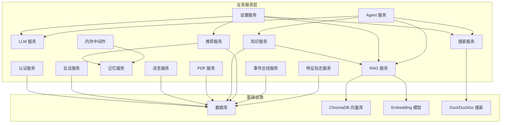

**图表来源**
- [backend/app/services/llm_service.py](file://backend/app/services/llm_service.py)
- [backend/app/services/pdf_service.py](file://backend/app/services/pdf_service.py)
- [backend/app/services/rag_service.py](file://backend/app/services/rag_service.py)
- [backend/app/services/knowledge_service.py](file://backend/app/services/knowledge_service.py)
- [backend/app/services/recommendation_service.py](file://backend/app/services/recommendation_service.py)
- [backend/app/services/search_service.py](file://backend/app/services/search_service.py)
- [backend/app/services/settings_service.py](file://backend/app/services/settings_service.py)
- [backend/app/services/memory_service.py](file://backend/app/services/memory_service.py)
- [backend/app/services/auth_service.py](file://backend/app/services/auth_service.py)
- [backend/app/services/message_service.py](file://backend/app/services/message_service.py)
- [backend/app/services/session_service.py](file://backend/app/services/session_service.py)
- [backend/app/services/agent_service.py](file://backend/app/services/agent_service.py)
- [backend/app/services/memory_middleware.py](file://backend/app/services/memory_middleware.py)
- [backend/app/services/event_bus.py](file://backend/app/services/event_bus.py)
- [backend/app/services/feature_flag_service.py](file://backend/app/services/feature_flag_service.py)

**章节来源**
- [backend/app/services/__init__.py](file://backend/app/services/__init__.py)

## 核心组件
- LLM 服务：提供多场景提示词模板与流式/非流式调用接口，作为上层 Agent、知识抽取、翻译、摘要等能力的统一底层能力。
- PDF 服务：负责 PDF 元数据提取、文本块解析、全文提取与有效性校验，支撑论文入库与检索。
- RAG 服务：基于 ChromaDB 的向量检索与 BM25 混合检索，支持跨论文检索与索引重建，提供 RRF 融合排序。
- 知识服务：从高亮与对话中抽取知识卡片，自动生成标签与关联，提供向量索引与全局检索。
- 推荐服务：基于内容相似度与用户画像的个性化推荐，支持嵌入缓存与学术搜索联动。
- 搜索服务：集成 DuckDuckGo，提供网络学术搜索与结果缓存、超时控制。
- 设置服务：集中管理用户个性化配置，提供默认值、校验、运行时应用与脱敏 API Key。
- 记忆服务：提取用户长期记忆、向量化召回、构建用户画像、衰减与管理。
- 认证服务：个人使用模式下的默认用户获取，简化部署与开发体验。
- 消息服务：封装聊天消息的加载、保存与论文文本获取，支持全文缓存和预览功能。
- 会话服务：封装会话生命周期管理、标题自动命名、论文分析缓存、关键词提取与事件发布。
- Agent 服务：意图识别、任务规划、工具编排与结果聚合，支持多步推理与流式输出。
- 内存中间件：在问答前后注入记忆上下文与异步记忆提取，提升个性化与连续性。
- **事件总线服务**：提供发布-订阅模式的事件系统，支持同步和异步处理器，实现松耦合的组件通信。
- **特征标志服务**：提供功能开关的查询、设置和列表功能，带内存缓存，支持动态功能控制。

**章节来源**
- [backend/app/services/llm_service.py](file://backend/app/services/llm_service.py)
- [backend/app/services/pdf_service.py](file://backend/app/services/pdf_service.py)
- [backend/app/services/rag_service.py](file://backend/app/services/rag_service.py)
- [backend/app/services/knowledge_service.py](file://backend/app/services/knowledge_service.py)
- [backend/app/services/recommendation_service.py](file://backend/app/services/recommendation_service.py)
- [backend/app/services/search_service.py](file://backend/app/services/search_service.py)
- [backend/app/services/settings_service.py](file://backend/app/services/settings_service.py)
- [backend/app/services/memory_service.py](file://backend/app/services/memory_service.py)
- [backend/app/services/auth_service.py](file://backend/app/services/auth_service.py)
- [backend/app/services/message_service.py](file://backend/app/services/message_service.py)
- [backend/app/services/session_service.py](file://backend/app/services/session_service.py)
- [backend/app/services/agent_service.py](file://backend/app/services/agent_service.py)
- [backend/app/services/memory_middleware.py](file://backend/app/services/memory_middleware.py)
- [backend/app/services/event_bus.py](file://backend/app/services/event_bus.py)
- [backend/app/services/feature_flag_service.py](file://backend/app/services/feature_flag_service.py)

## 架构总览
业务服务层通过"服务单例 + 依赖注入"的方式对外暴露统一接口，内部通过异步 I/O、线程池与惰性加载模型等方式平衡性能与资源占用。设置服务在运行时动态更新各服务的配置，形成"配置即代码"的可演进能力。新增的事件总线服务提供了松耦合的组件通信机制，特征标志服务支持动态功能控制。

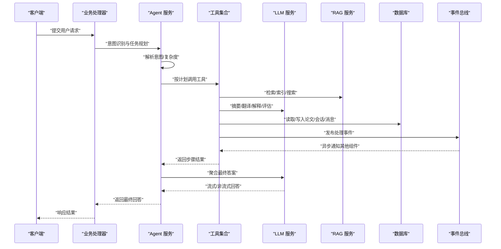

**图表来源**
- [backend/app/services/agent_service.py](file://backend/app/services/agent_service.py)
- [backend/app/services/rag_service.py](file://backend/app/services/rag_service.py)
- [backend/app/services/knowledge_service.py](file://backend/app/services/knowledge_service.py)
- [backend/app/services/search_service.py](file://backend/app/services/search_service.py)
- [backend/app/services/message_service.py](file://backend/app/services/message_service.py)
- [backend/app/services/session_service.py](file://backend/app/services/session_service.py)
- [backend/app/services/event_bus.py](file://backend/app/services/event_bus.py)

## 详细组件分析

### LLM 服务
- 职责：提供多场景提示词模板与统一的 LLM 调用接口，支持流式/非流式输出，作为上层服务的"智能引擎"。
- 设计要点：通过兼容层导出统一接口，便于上层模块按需使用；提示词模板集中管理，便于迭代与复用。
- 错误处理：调用链中出现异常时，上层服务负责兜底与降级，确保用户体验稳定。

**章节来源**
- [backend/app/services/llm_service.py](file://backend/app/services/llm_service.py)

### PDF 服务
- 职责：解析 PDF 元数据、提取文本块与全文、统计页数、校验 PDF 有效性。
- 设计要点：使用 pdfplumber 进行字符级解析，按行聚合并生成带坐标的文本块；对异常进行容错返回默认值。
- 性能：文本块提取按页遍历，复杂度与页数线性相关；建议对大文件分批处理。

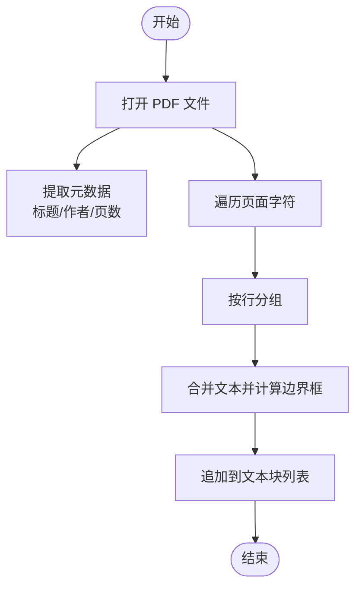

**图表来源**
- [backend/app/services/pdf_service.py](file://backend/app/services/pdf_service.py)

**章节来源**
- [backend/app/services/pdf_service.py](file://backend/app/services/pdf_service.py)

### RAG 服务
- 职责：论文分块、向量化、ChromaDB 存储、语义检索 + BM25 关键词检索、跨论文检索、索引重建与状态查询。
- 设计要点：懒加载嵌入模型、线程池执行同步编码、BM25 索引缓存、RRF 融合排序；支持运行时配置更新。
- 性能：向量化与检索均通过线程池异步执行；BM25 缓存避免重复构建；跨论文检索并行执行。

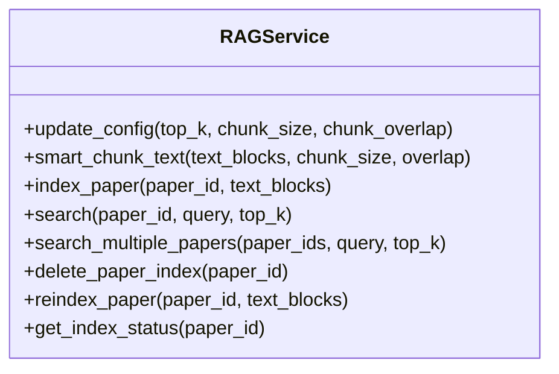

**图表来源**
- [backend/app/services/rag_service.py](file://backend/app/services/rag_service.py)

**章节来源**
- [backend/app/services/rag_service.py](file://backend/app/services/rag_service.py)

### 知识服务
- 职责：从高亮与对话中抽取知识卡片、自动生成标签、识别卡片关联、向量索引、全局检索、知识图谱与统计。
- 设计要点：依赖 LLM 与 RAG 服务；向量索引按用户隔离；检索融合向量与关键词；支持关系发现与图谱构建。
- 性能：向量检索与关键词检索并行，结果去重合并；索引按用户 collection 存储，避免跨用户干扰。

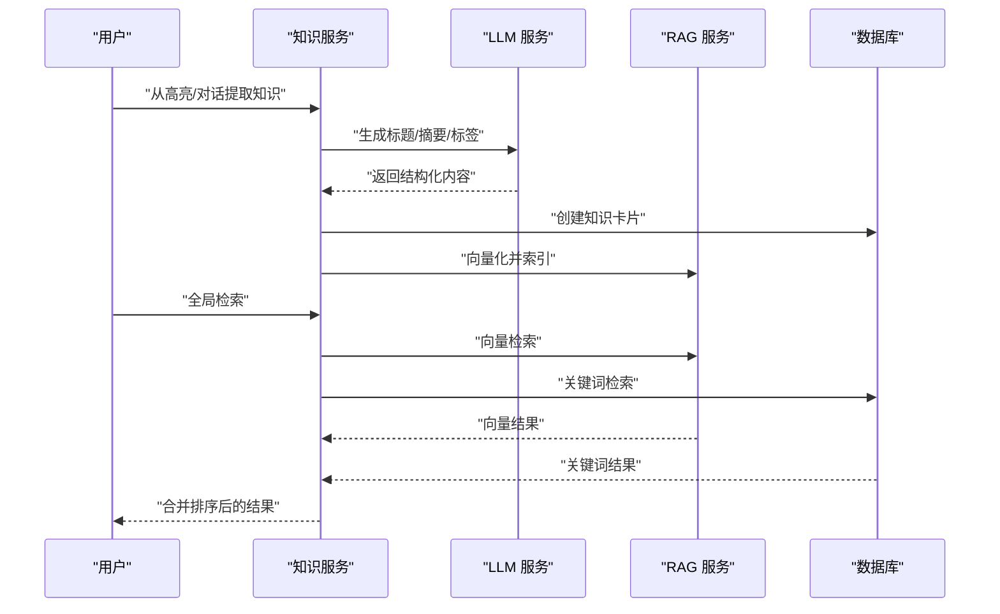

**图表来源**
- [backend/app/services/knowledge_service.py](file://backend/app/services/knowledge_service.py)
- [backend/app/services/rag_service.py](file://backend/app/services/rag_service.py)

**章节来源**
- [backend/app/services/knowledge_service.py](file://backend/app/services/knowledge_service.py)

### 推荐服务
- 职责：基于内容相似度与用户画像的个性化推荐，支持嵌入缓存、相似度计算、学术搜索联动与匹配原因生成。
- 设计要点：论文嵌入缓存、余弦相似度、阅读状态与时间衰减权重、最近论文回退策略；与记忆服务协同构建用户画像。
- 性能：嵌入缓存显著降低重复计算；相似度计算批量执行；学术搜索异步执行。

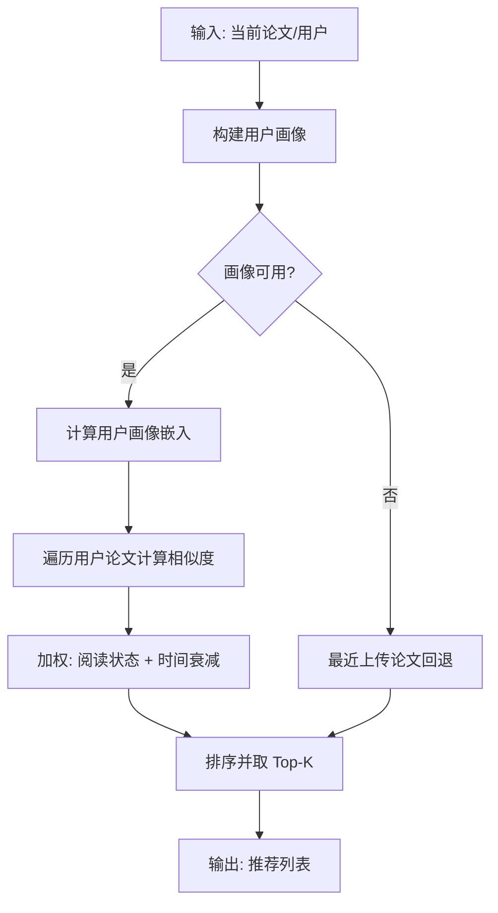

**图表来源**
- [backend/app/services/recommendation_service.py](file://backend/app/services/recommendation_service.py)
- [backend/app/services/memory_service.py](file://backend/app/services/memory_service.py)

**章节来源**
- [backend/app/services/recommendation_service.py](file://backend/app/services/recommendation_service.py)

### 搜索服务
- 职责：集成 DuckDuckGo 进行网络学术搜索，提供结果缓存、超时控制与默认参数。
- 设计要点：线程池执行同步搜索、LRU 缓存、超时保护；支持运行时配置更新。
- 性能：缓存命中率高；超时控制避免阻塞；默认最大结果数限制。

**章节来源**
- [backend/app/services/search_service.py](file://backend/app/services/search_service.py)

### 设置服务
- 职责：集中管理用户个性化配置，提供默认值、校验、运行时应用与脱敏 API Key。
- 设计要点：配置元数据驱动前端表单；运行时将配置应用到各服务；敏感信息脱敏存储与传输。
- 性能：配置变更后异步应用，避免阻塞请求；默认值与校验减少运行期开销。

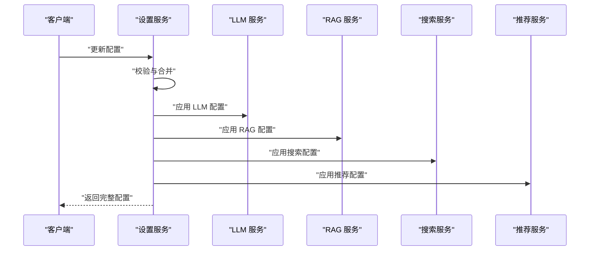

**图表来源**
- [backend/app/services/settings_service.py](file://backend/app/services/settings_service.py)

**章节来源**
- [backend/app/services/settings_service.py](file://backend/app/services/settings_service.py)

### 记忆服务
- 职责：从对话中提取长期记忆、向量化存储、召回与构建用户画像、衰减与管理。
- 设计要点：惰性加载嵌入模型、相似度去重、时间衰减因子、重要性权重；支持异步存储与并发安全。
- 性能：嵌入向量缓存、相似度阈值去重、访问计数与最后访问时间更新。

**章节来源**
- [backend/app/services/memory_service.py](file://backend/app/services/memory_service.py)

### 认证服务
- 职责：个人使用模式下的默认用户获取，自动创建默认用户，简化部署。
- 设计要点：依赖注入数据库会话，保证单实例默认用户一致性。

**章节来源**
- [backend/app/services/auth_service.py](file://backend/app/services/auth_service.py)

### 消息服务
- 职责：封装消息加载、保存与论文文本获取，供 WebSocket 处理器调用。
- 设计要点：基于 ChatMessageHistory 的消息历史管理；按会话与时间排序；支持全文缓存和预览功能。
- **增强功能**：新增模块级全文缓存字典，支持论文完整文本的缓存和预览功能。

**章节来源**
- [backend/app/services/message_service.py](file://backend/app/services/message_service.py)

### 会话服务
- 职责：会话生命周期管理、标题自动命名、论文分析缓存与关键词提取。
- 设计要点：异步关键词提取与 WebSocket 通知；独立数据库会话避免阻塞主流程；**集成了事件总线**以发布分析完成事件。
- **增强功能**：集成事件总线服务，在保存论文分析缓存时发布 ANALYSIS_COMPLETED 事件；支持异步事件处理。

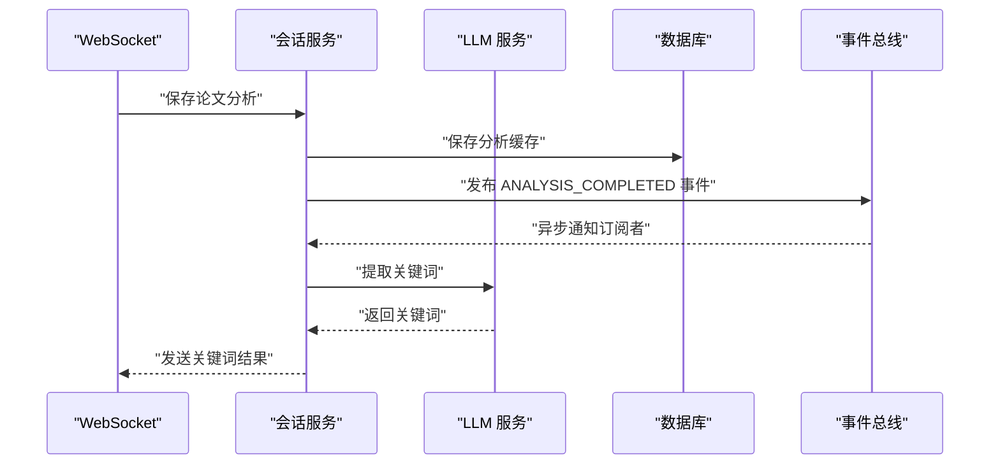

**图表来源**
- [backend/app/services/session_service.py](file://backend/app/services/session_service.py)
- [backend/app/services/event_bus.py](file://backend/app/services/event_bus.py)

**章节来源**
- [backend/app/services/session_service.py](file://backend/app/services/session_service.py)

### Agent 服务
- 职责：意图识别、任务规划、工具编排与结果聚合，支持多步推理与流式输出。
- 设计要点：工具抽象与注册、关键词快速识别、LLM 规划、步骤依赖与上下文注入、最终答案聚合。
- 性能：步骤异步执行与结果聚合，流式输出提升交互体验。

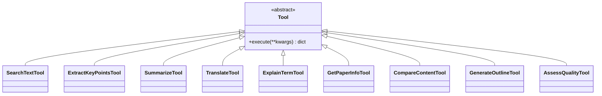

**图表来源**
- [backend/app/services/agent_service.py](file://backend/app/services/agent_service.py)

**章节来源**
- [backend/app/services/agent_service.py](file://backend/app/services/agent_service.py)

### 内存中间件
- 职责：问答前记忆上下文增强与问答后异步记忆提取，提升个性化与连续性。
- 设计要点：问答前召回记忆并格式化提示词；问答后异步提取新记忆，避免阻塞响应。

**章节来源**
- [backend/app/services/memory_middleware.py](file://backend/app/services/memory_middleware.py)

### **事件总线服务**
- 职责：提供发布-订阅模式的事件系统，支持同步和异步处理器，实现松耦合的组件通信。
- 设计要点：支持事件订阅/取消订阅、异步发布、处理器异常隔离、事件类型常量管理。
- **应用场景**：论文上传/删除、分析完成、索引重建等事件的异步通知。

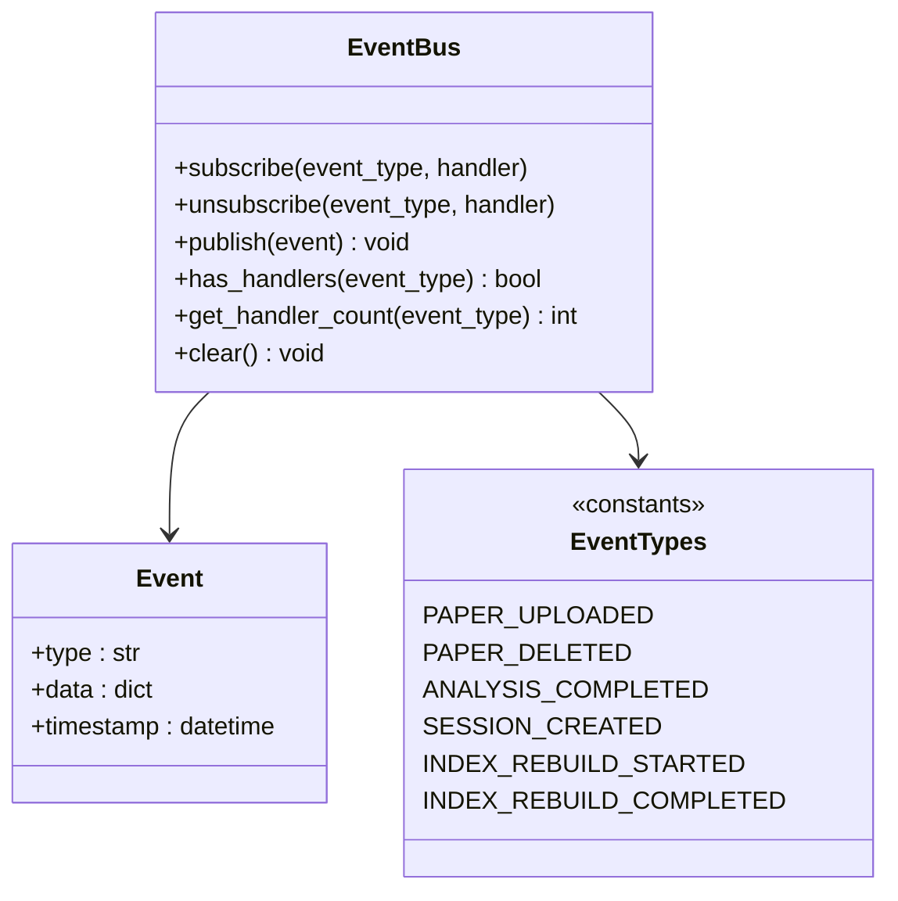

**图表来源**
- [backend/app/services/event_bus.py](file://backend/app/services/event_bus.py)

**章节来源**
- [backend/app/services/event_bus.py](file://backend/app/services/event_bus.py)

### **特征标志服务**
- 职责：提供功能开关的查询、设置和列表功能，带内存缓存（TTL 60s，线程安全）。
- 设计要点：内存缓存（TTL 60秒）、线程安全、数据库持久化、功能开关模型。
- **应用场景**：动态控制功能特性启停，避免硬编码开关。

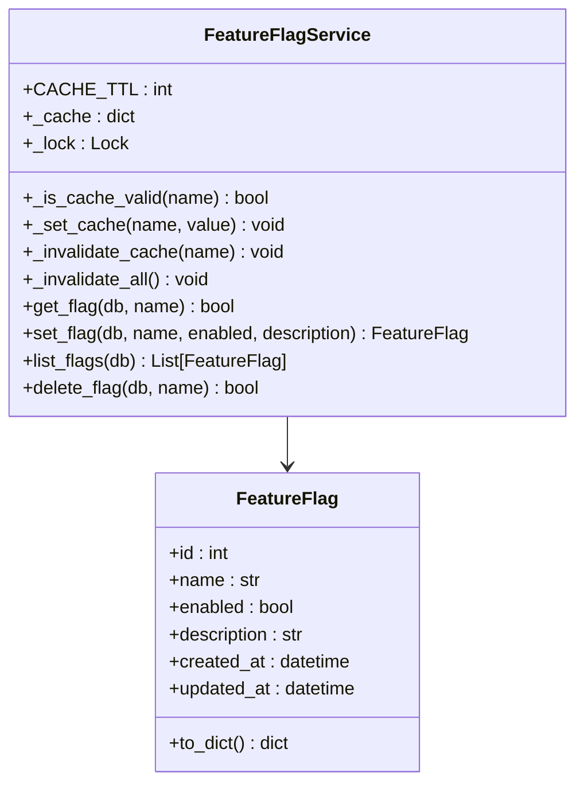

**图表来源**
- [backend/app/services/feature_flag_service.py](file://backend/app/services/feature_flag_service.py)
- [backend/app/models/feature_flag.py](file://backend/app/models/feature_flag.py)

**章节来源**
- [backend/app/services/feature_flag_service.py](file://backend/app/services/feature_flag_service.py)
- [backend/app/models/feature_flag.py](file://backend/app/models/feature_flag.py)

## 依赖分析
- 服务耦合：各服务通过全局单例与依赖注入对外提供能力，降低模块间直接耦合；设置服务作为"配置中心"，统一驱动其他服务。
- 外部依赖：ChromaDB（向量检索）、Embedding 模型（sentence-transformers）、DuckDuckGo（网络搜索）、pdfplumber（PDF 解析）。
- **新增依赖**：事件总线服务依赖数据库连接进行事件处理；特征标志服务依赖数据库进行功能开关管理。
- 潜在风险：模型首次加载阻塞、向量库磁盘 IO、网络搜索超时与限流、数据库连接池压力；新增事件总线的异步处理可能增加系统复杂性。

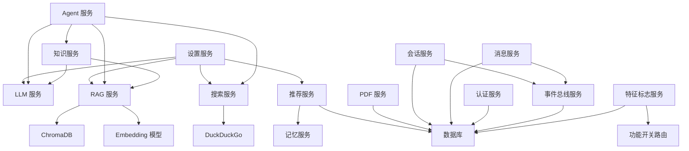

**图表来源**
- [backend/app/services/settings_service.py](file://backend/app/services/settings_service.py)
- [backend/app/services/agent_service.py](file://backend/app/services/agent_service.py)
- [backend/app/services/knowledge_service.py](file://backend/app/services/knowledge_service.py)
- [backend/app/services/recommendation_service.py](file://backend/app/services/recommendation_service.py)
- [backend/app/services/rag_service.py](file://backend/app/services/rag_service.py)
- [backend/app/services/search_service.py](file://backend/app/services/search_service.py)
- [backend/app/services/pdf_service.py](file://backend/app/services/pdf_service.py)
- [backend/app/services/message_service.py](file://backend/app/services/message_service.py)
- [backend/app/services/session_service.py](file://backend/app/services/session_service.py)
- [backend/app/services/auth_service.py](file://backend/app/services/auth_service.py)
- [backend/app/services/event_bus.py](file://backend/app/services/event_bus.py)
- [backend/app/services/feature_flag_service.py](file://backend/app/services/feature_flag_service.py)
- [backend/app/routers/feature_flags.py](file://backend/app/routers/feature_flags.py)

## 性能考量
- 模型与 I/O
  - 惰性加载嵌入模型，首次使用时在线程池中加载，避免阻塞事件循环。
  - 向量检索与文本编码通过线程池异步执行，提高吞吐。
- 缓存策略
  - RAG 服务的 BM25 索引缓存、知识服务与推荐服务的嵌入向量缓存、搜索服务的搜索结果缓存。
  - **新增**：消息服务的全文缓存字典，特征标志服务的内存缓存（TTL 60秒）。
- 超时与降级
  - 搜索服务设置超时时间，异常时返回空结果并记录日志。
  - Agent 服务的工具调用与关键词提取设置超时，避免长时间阻塞。
  - **新增**：特征标志服务的缓存过期机制，避免频繁数据库查询。
- 并发与异步
  - 会话服务的关键词提取与记忆中间件的异步记忆提取均采用异步任务，不阻塞主流程。
  - **新增**：事件总线的异步事件发布，使用 fire-and-forget 模式避免阻塞主流程。
- 数据库与索引
  - 记录去重与相似度阈值避免重复存储；ChromaDB collection 按用户或论文隔离，减少冲突。
  - **新增**：特征标志服务的数据库事务管理，确保数据一致性。

## 故障排查指南
- 全局异常处理
  - 统一捕获 Pydantic 验证错误、HTTP 异常、SQLAlchemy 异常与通用异常，返回标准化错误响应。
- 常见问题定位
  - LLM 调用失败：检查 API Key、Base URL 与温度/Token 配置；确认设置服务已正确应用。
  - RAG 检索异常：检查 ChromaDB 存储路径与权限、索引是否存在、BM25 缓存是否失效。
  - PDF 解析失败：确认文件扩展名与文件头、pdfplumber 版本兼容性。
  - 搜索超时：调整超时时间与最大结果数；检查网络与 DuckDuckGo 服务状态。
  - 记忆提取失败：检查嵌入模型加载与相似度阈值；查看异步任务日志。
  - **新增**：事件总线异常：检查事件处理器注册、异步事件发布、处理器异常隔离。
  - **新增**：特征标志服务异常：检查数据库连接、缓存一致性、线程安全问题。
- 日志与监控
  - 在关键路径打印日志（如索引失败、搜索超时、记忆提取失败、事件处理异常），便于快速定位问题。

**章节来源**
- [backend/app/middleware/error_handler.py](file://backend/app/middleware/error_handler.py)

## 结论
PaperChat 的业务服务层以"服务单例 + 依赖注入 + 运行时配置"为核心设计，围绕 LLM、PDF、RAG、知识、推荐、搜索、设置、记忆、认证、消息、会话、Agent、内存中间件、事件总线和特征标志等模块构建起完整的学术阅读与智能问答体系。通过惰性加载、线程池异步、缓存与超时控制等手段，兼顾性能与稳定性；通过统一的异常处理与配置中心，提升可维护性与可演进性。

**新增的事件总线服务**提供了松耦合的组件通信机制，支持异步事件处理和订阅-发布模式，增强了系统的可扩展性和可维护性。**特征标志服务**实现了动态功能控制，支持功能开关的内存缓存和数据库持久化，为系统的渐进式功能发布提供了基础。

建议在生产环境中进一步完善日志体系、监控指标与容量规划，持续优化模型与检索策略以满足更大规模的使用需求。同时，应关注新增服务的性能影响，合理配置缓存策略和异步处理机制，确保系统的整体稳定性。