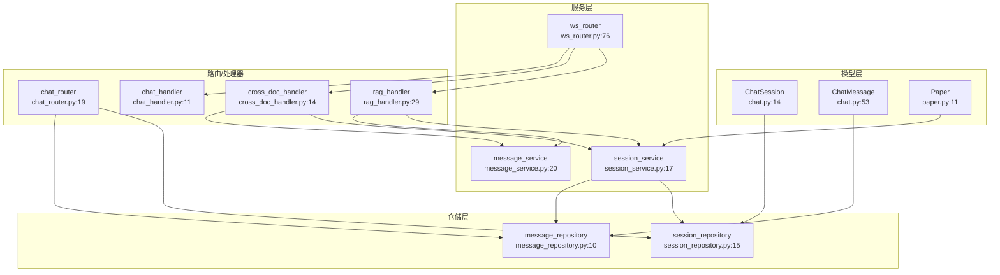
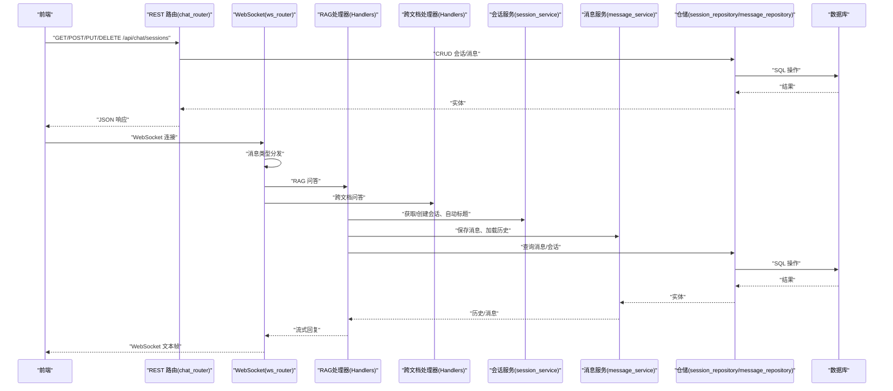
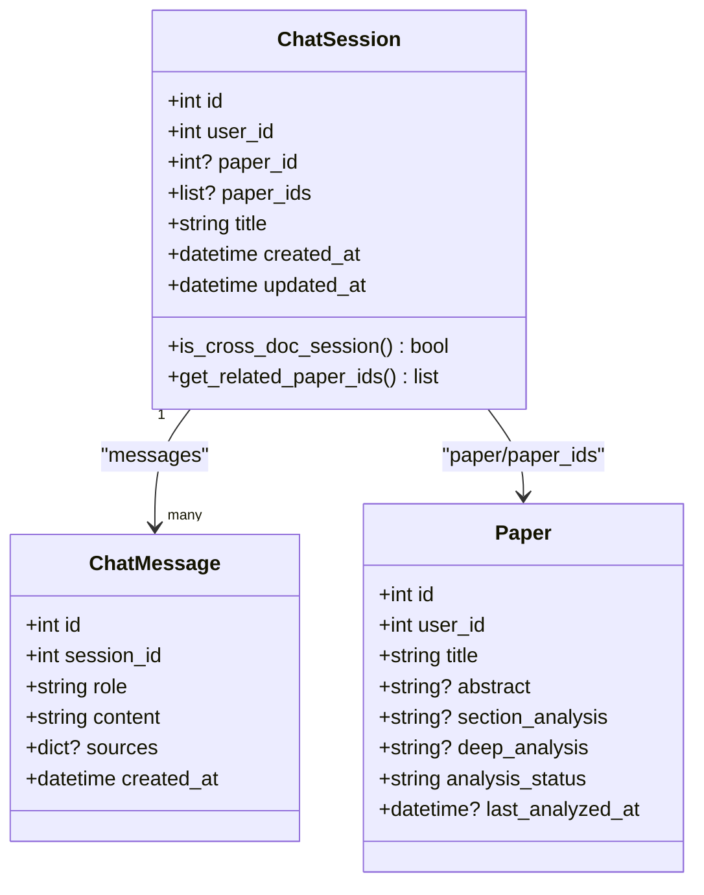
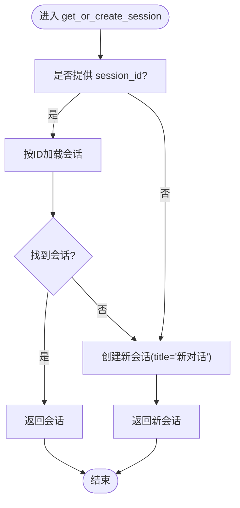
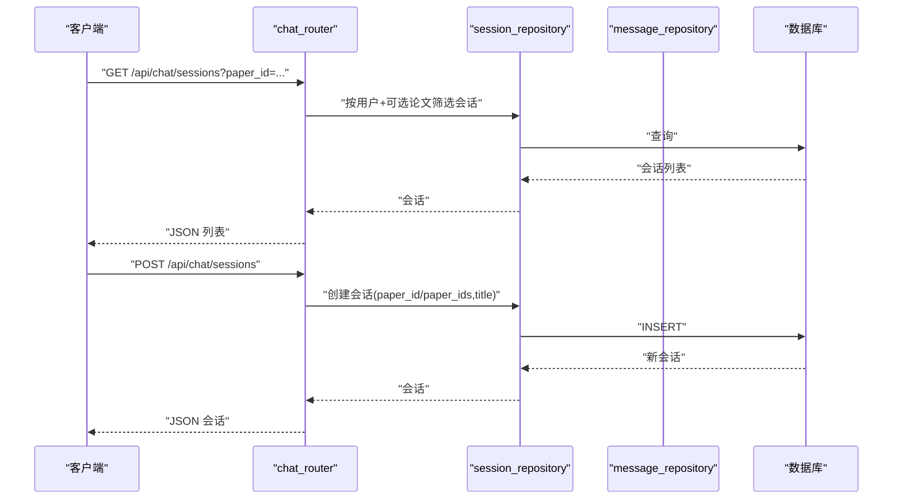
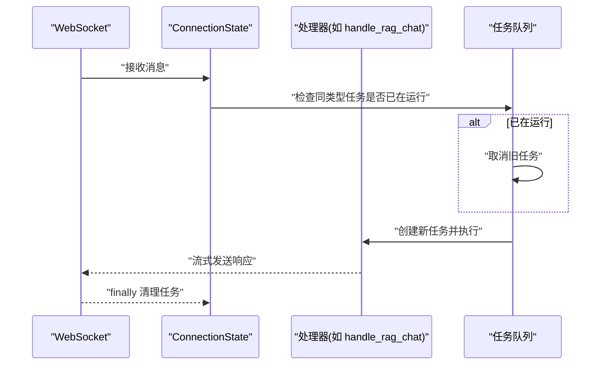
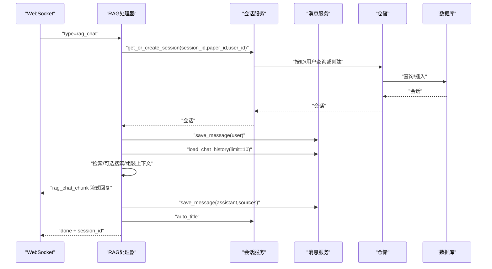
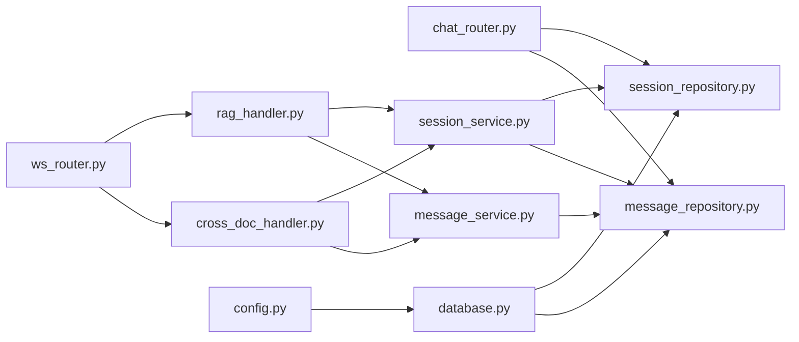

# 会话服务

<cite>
**本文引用的文件**
- [session_service.py](file://backend/app/services/session_service.py)
- [chat.py](file://backend/app/models/chat.py)
- [memory.py](file://backend/app/models/memory.py)
- [chat_router.py](file://backend/app/routers/chat.py)
- [ws_router.py](file://backend/app/routers/ws.py)
- [session_repository.py](file://backend/app/repositories/session_repository.py)
- [message_repository.py](file://backend/app/repositories/message_repository.py)
- [message_service.py](file://backend/app/services/message_service.py)
- [rag_handler.py](file://backend/app/handlers/rag_handler.py)
- [cross_doc_handler.py](file://backend/app/handlers/cross_doc_handler.py)
- [chat_handler.py](file://backend/app/handlers/chat_handler.py)
- [database.py](file://backend/app/database.py)
- [config.py](file://backend/app/config.py)
- [paper.py](file://backend/app/models/paper.py)
- [memory_service.py](file://backend/app/services/memory_service.py)
</cite>

## 目录
1. [简介](#简介)
2. [项目结构](#项目结构)
3. [核心组件](#核心组件)
4. [架构总览](#架构总览)
5. [详细组件分析](#详细组件分析)
6. [依赖分析](#依赖分析)
7. [性能考虑](#性能考虑)
8. [故障排查指南](#故障排查指南)
9. [结论](#结论)
10. [附录](#附录)

## 简介
本文件围绕“会话服务”的实现机制展开，系统性阐述对话会话的创建、状态维护与生命周期管理；详解会话数据的存储结构、标题自动更新策略、消息持久化与历史加载；给出在 WebSocket 场景下的会话管理、续期与合并思路；并覆盖并发控制、数据隔离与一致性保障、持久化存储与恢复、以及会话迁移策略建议。文档面向具备一定技术背景的读者，同时尽量以图示与路径指引帮助快速定位实现细节。

## 项目结构
会话服务横跨模型层、仓储层、服务层与路由/处理器层，形成清晰的分层职责：
- 模型层：定义会话与消息的数据结构及关系
- 仓储层：封装 CRUD 与复杂查询
- 服务层：编排业务逻辑（会话创建/标题更新、论文分析缓存、关键词提取）
- 路由层：提供 REST API 与 WebSocket 端点
- 处理器层：对接 LLM 服务，执行流式问答与跨文档检索

图表来源
- [chat.py:14-71](file://backend/app/models/chat.py#L14-L71)
- [paper.py:11-85](file://backend/app/models/paper.py#L11-L85)
- [session_repository.py:15-99](file://backend/app/repositories/session_repository.py#L15-L99)
- [message_repository.py:10-55](file://backend/app/repositories/message_repository.py#L10-L55)
- [session_service.py:17-111](file://backend/app/services/session_service.py#L17-L111)
- [message_service.py:20-84](file://backend/app/services/message_service.py#L20-L84)
- [ws_router.py:76-436](file://backend/app/routers/ws.py#L76-L436)
- [chat_router.py:19-295](file://backend/app/routers/chat.py#L19-L295)
- [rag_handler.py:29-234](file://backend/app/handlers/rag_handler.py#L29-L234)
- [cross_doc_handler.py:14-95](file://backend/app/handlers/cross_doc_handler.py#L14-L95)
- [chat_handler.py:11-32](file://backend/app/handlers/chat_handler.py#L11-L32)

章节来源
- [chat.py:14-71](file://backend/app/models/chat.py#L14-L71)
- [session_repository.py:15-99](file://backend/app/repositories/session_repository.py#L15-L99)
- [session_service.py:17-111](file://backend/app/services/session_service.py#L17-L111)
- [ws_router.py:76-436](file://backend/app/routers/ws.py#L76-L436)
- [chat_router.py:19-295](file://backend/app/routers/chat.py#L19-L295)

## 核心组件
- 会话模型与消息模型：定义会话与消息的字段、关系与行为（是否跨文档、获取关联论文ID等）
- 会话仓储：提供按用户、按论文、按ID等维度的查询与创建、删除、标题更新
- 会话服务：封装会话获取/创建、标题自动更新、论文分析缓存写入、关键词提取与推送
- 消息服务：提供全文缓存、历史加载、消息保存
- WebSocket 路由：统一连接生命周期管理、消息类型分发、任务并发控制
- REST 路由：提供会话 CRUD、跨文档会话创建、按论文获取/创建默认会话

章节来源
- [chat.py:14-71](file://backend/app/models/chat.py#L14-L71)
- [session_repository.py:15-99](file://backend/app/repositories/session_repository.py#L15-L99)
- [session_service.py:17-111](file://backend/app/services/session_service.py#L17-L111)
- [message_service.py:20-84](file://backend/app/services/message_service.py#L20-L84)
- [ws_router.py:76-436](file://backend/app/routers/ws.py#L76-L436)
- [chat_router.py:19-295](file://backend/app/routers/chat.py#L19-L295)

## 架构总览
会话服务在系统中的交互路径如下：前端通过 REST API 或 WebSocket 与后端交互；REST 路由直接调用仓储与服务；WebSocket 路由负责连接生命周期与消息分发，调用对应处理器；处理器进一步调用会话服务、消息服务与 LLM/RAG 服务，实现会话创建、消息持久化与流式响应。

图表来源
- [chat_router.py:19-295](file://backend/app/routers/chat.py#L19-L295)
- [ws_router.py:76-436](file://backend/app/routers/ws.py#L76-L436)
- [rag_handler.py:29-234](file://backend/app/handlers/rag_handler.py#L29-L234)
- [cross_doc_handler.py:14-95](file://backend/app/handlers/cross_doc_handler.py#L14-L95)
- [session_service.py:17-111](file://backend/app/services/session_service.py#L17-L111)
- [message_service.py:20-84](file://backend/app/services/message_service.py#L20-L84)
- [session_repository.py:15-99](file://backend/app/repositories/session_repository.py#L15-L99)
- [message_repository.py:10-55](file://backend/app/repositories/message_repository.py#L10-L55)

## 详细组件分析

### 会话模型与数据结构
- ChatSession：包含用户ID、论文ID/论文ID列表（支持跨文档）、标题、创建/更新时间；提供判断是否跨文档会话与获取关联论文ID的方法
- ChatMessage：包含角色、内容、来源引用、创建时间；与会话建立一对多关系
- Paper：论文模型，包含分析缓存字段（章节概述、深度分析、分析状态、最后分析时间）

图表来源
- [chat.py:14-71](file://backend/app/models/chat.py#L14-L71)
- [paper.py:11-85](file://backend/app/models/paper.py#L11-L85)

章节来源
- [chat.py:14-71](file://backend/app/models/chat.py#L14-L71)
- [paper.py:11-85](file://backend/app/models/paper.py#L11-L85)

### 会话仓储与服务
- 会话仓储：按用户、按论文、按ID查询；创建会话；删除会话（级联删除消息）；更新标题
- 会话服务：获取/创建会话；自动更新标题（前几条消息且默认标题）；论文分析缓存写入（章节概述/深度分析）；关键词提取与推送

图表来源
- [session_service.py:17-26](file://backend/app/services/session_service.py#L17-L26)
- [session_repository.py:67-78](file://backend/app/repositories/session_repository.py#L67-L78)

章节来源
- [session_repository.py:15-99](file://backend/app/repositories/session_repository.py#L15-L99)
- [session_service.py:17-111](file://backend/app/services/session_service.py#L17-L111)

### REST 会话管理
- 获取会话列表：支持按论文筛选，返回会话基本信息与消息数量
- 创建会话：支持单论文或跨文档（paper_ids），校验论文归属
- 获取会话详情：返回会话与消息历史
- 更新/删除会话：更新标题、删除会话（级联删除消息）
- 按论文获取/创建默认会话：用于切换论文时自动查找或创建
- 跨文档会话创建：批量校验论文ID有效性后创建

图表来源
- [chat_router.py:19-295](file://backend/app/routers/chat.py#L19-L295)
- [session_repository.py:15-99](file://backend/app/repositories/session_repository.py#L15-L99)
- [message_repository.py:10-55](file://backend/app/repositories/message_repository.py#L10-L55)

章节来源
- [chat_router.py:19-295](file://backend/app/routers/chat.py#L19-L295)

### WebSocket 会话管理与并发控制
- 连接状态：ConnectionState 维护当前论文、会话、用户、聊天历史与运行中的任务集合
- 并发控制：同一类型任务（如 chat、rag_chat、cross_doc_chat、unified）只保留一个运行实例，新的到来会取消旧任务
- 任务取消：收到 cancel 消息或异常/断开时，清理所有运行中的任务
- 统一入口：unified_chat 根据关键词分类路由到不同处理函数（RAG、跨文档、分析等）

图表来源
- [ws_router.py:56-113](file://backend/app/routers/ws.py#L56-L113)
- [ws_router.py:130-250](file://backend/app/routers/ws.py#L130-L250)
- [ws_router.py:424-436](file://backend/app/routers/ws.py#L424-L436)

章节来源
- [ws_router.py:56-113](file://backend/app/routers/ws.py#L56-L113)
- [ws_router.py:130-250](file://backend/app/routers/ws.py#L130-L250)
- [ws_router.py:252-260](file://backend/app/routers/ws.py#L252-L260)
- [ws_router.py:262-417](file://backend/app/routers/ws.py#L262-L417)
- [ws_router.py:424-436](file://backend/app/routers/ws.py#L424-L436)

### RAG 问答与跨文档问答的会话集成
- RAG 流程：获取/创建会话 → 保存用户消息 → 加载历史 → 检索相关片段 → 可选网络搜索 → 组装上下文 → 流式生成 → 保存 AI 回复 → 自动更新标题 → 发送完成信号
- 跨文档流程：获取/创建会话 → 保存用户消息（携带 paper_ids） → 检索多篇论文 → 组装来源 → 流式生成 → 保存 AI 回复 → 自动更新标题 → 发送完成信号

图表来源
- [rag_handler.py:29-234](file://backend/app/handlers/rag_handler.py#L29-L234)
- [session_service.py:17-35](file://backend/app/services/session_service.py#L17-L35)
- [message_service.py:56-74](file://backend/app/services/message_service.py#L56-L74)
- [session_repository.py:67-78](file://backend/app/repositories/session_repository.py#L67-L78)
- [message_repository.py:43-55](file://backend/app/repositories/message_repository.py#L43-L55)

章节来源
- [rag_handler.py:29-234](file://backend/app/handlers/rag_handler.py#L29-L234)
- [cross_doc_handler.py:14-95](file://backend/app/handlers/cross_doc_handler.py#L14-L95)
- [session_service.py:17-35](file://backend/app/services/session_service.py#L17-L35)
- [message_service.py:56-74](file://backend/app/services/message_service.py#L56-L74)

### 会话标题自动更新与消息持久化
- 自动标题：在消息数量不超过阈值且标题仍为默认值时，将标题设为消息内容的截断版本，并提交事务
- 消息持久化：每次问答前后均保存用户/助手消息，确保历史可追溯与后续检索增强

章节来源
- [session_service.py:29-35](file://backend/app/services/session_service.py#L29-L35)
- [message_service.py:71-74](file://backend/app/services/message_service.py#L71-L74)
- [message_repository.py:43-55](file://backend/app/repositories/message_repository.py#L43-L55)

### 论文分析缓存与关键词提取
- 章节概述/深度分析缓存：独立数据库会话写入，记录最后分析时间，避免阻塞主流程
- 关键词提取：异步调用 LLM 提取关键词，若已有标签则直接回传，否则写入并可通过 WebSocket 推送结果

章节来源
- [session_service.py:42-66](file://backend/app/services/session_service.py#L42-L66)
- [session_service.py:68-111](file://backend/app/services/session_service.py#L68-L111)

### 会话生命周期与清理策略
- 生命周期：REST 路由提供创建/查询/更新/删除；WebSocket 路由负责连接期间的任务调度与清理
- 删除策略：删除会话时显式删除其消息，确保数据一致性
- 清理策略：WebSocket 断开或取消时清理运行中的任务；消息服务提供全文缓存失效接口

章节来源
- [session_repository.py:81-90](file://backend/app/repositories/session_repository.py#L81-L90)
- [ws_router.py:424-436](file://backend/app/routers/ws.py#L424-L436)
- [message_service.py:40-46](file://backend/app/services/message_service.py#L40-L46)

### 并发控制、数据隔离与一致性
- 并发控制：同一类型任务互斥执行，新的到来取消旧任务，避免资源竞争
- 数据隔离：WebSocket 路由为每个连接维护独立的 ConnectionState；处理器在独立数据库会话中执行
- 一致性：删除会话时级联删除消息；消息保存后提交事务；全文缓存按论文粒度失效

章节来源
- [ws_router.py:56-113](file://backend/app/routers/ws.py#L56-L113)
- [ws_router.py:130-250](file://backend/app/routers/ws.py#L130-L250)
- [session_repository.py:81-90](file://backend/app/repositories/session_repository.py#L81-L90)
- [message_service.py:40-46](file://backend/app/services/message_service.py#L40-L46)

### 持久化存储、恢复机制与迁移策略
- 持久化存储：会话与消息持久化至数据库，模型定义包含时间戳与索引字段
- 恢复机制：REST 路由可按会话ID加载详情与消息历史；WebSocket 路由在任务中按需加载历史
- 迁移策略：跨文档会话通过 paper_ids 字段扩展，兼容旧版单论文会话；可逐步将 paper_id 迁移到 paper_ids

章节来源
- [chat.py:14-71](file://backend/app/models/chat.py#L14-L71)
- [chat_router.py:86-124](file://backend/app/routers/chat.py#L86-L124)
- [chat_router.py:210-249](file://backend/app/routers/chat.py#L210-L249)
- [chat_router.py:252-295](file://backend/app/routers/chat.py#L252-L295)

## 依赖分析
- 组件耦合：处理器依赖会话服务与消息服务；会话服务依赖仓储与模型；路由依赖仓储与服务
- 外部依赖：数据库引擎与会话工厂、JWT 解码、LLM/RAG 服务、搜索引擎服务
- 循环依赖：未发现循环导入；分层清晰

图表来源
- [chat_router.py:19-295](file://backend/app/routers/chat.py#L19-L295)
- [ws_router.py:76-436](file://backend/app/routers/ws.py#L76-L436)
- [rag_handler.py:29-234](file://backend/app/handlers/rag_handler.py#L29-L234)
- [cross_doc_handler.py:14-95](file://backend/app/handlers/cross_doc_handler.py#L14-L95)
- [session_service.py:17-111](file://backend/app/services/session_service.py#L17-L111)
- [message_service.py:20-84](file://backend/app/services/message_service.py#L20-L84)
- [session_repository.py:15-99](file://backend/app/repositories/session_repository.py#L15-L99)
- [message_repository.py:10-55](file://backend/app/repositories/message_repository.py#L10-L55)
- [database.py:13-48](file://backend/app/database.py#L13-L48)
- [config.py:15-44](file://backend/app/config.py#L15-L44)

章节来源
- [database.py:13-48](file://backend/app/database.py#L13-L48)
- [config.py:15-44](file://backend/app/config.py#L15-L44)

## 性能考虑
- 异步与并发：使用 asyncio 与异步数据库会话，处理器采用流式生成减少等待时间
- 缓存：消息服务提供论文全文缓存，避免重复读取；关键词提取与分析缓存减少重复计算
- 索引与降级：RAG 处理器在索引缺失时降级为论文预览文本；网络搜索可选开启
- 任务取消：及时取消过期任务，释放资源

[本节为通用性能讨论，无需列出具体文件来源]

## 故障排查指南
- WebSocket 未认证：验证 token 失败时主动关闭连接，检查 JWT 密钥与算法配置
- 会话不存在：REST 路由在查询不到会话时返回 404，确认 session_id 与用户归属
- 任务冲突：同一类型任务互斥执行，新的到来会取消旧任务；如出现频繁取消，检查前端重试逻辑
- 关键词提取失败：捕获超时与异常并打印警告，检查 LLM 服务可用性与超时设置
- 论文未解析：RAG 处理器检测到无文本块时提示重新上传或稍后再试

章节来源
- [ws_router.py:32-54](file://backend/app/routers/ws.py#L32-L54)
- [chat_router.py:86-100](file://backend/app/routers/chat.py#L86-L100)
- [ws_router.py:130-151](file://backend/app/routers/ws.py#L130-L151)
- [session_service.py:107-111](file://backend/app/services/session_service.py#L107-L111)
- [rag_handler.py:94-106](file://backend/app/handlers/rag_handler.py#L94-L106)

## 结论
会话服务通过清晰的分层设计与严格的生命周期管理，实现了从 REST 到 WebSocket 的全链路会话能力。其核心特性包括：会话创建与合并（单/多论文）、自动标题更新、消息持久化与历史加载、并发任务互斥与取消、论文分析缓存与关键词提取、以及跨文档检索增强问答。配合异步与缓存策略，整体具备良好的可扩展性与稳定性。

[本节为总结性内容，无需列出具体文件来源]

## 附录

### 会话管理最佳实践与示例路径
- 管理用户会话（创建/查询/更新/删除）
  - 示例路径：[chat_router.py:19-295](file://backend/app/routers/chat.py#L19-L295)
- 处理会话续期（保持活跃）
  - 示例路径：[ws_router.py:56-113](file://backend/app/routers/ws.py#L56-L113)（连接状态与任务调度）
- 会话合并（跨文档）
  - 示例路径：[chat_router.py:252-295](file://backend/app/routers/chat.py#L252-L295)，[cross_doc_handler.py:14-95](file://backend/app/handlers/cross_doc_handler.py#L14-L95)
- 并发控制与数据隔离
  - 示例路径：[ws_router.py:130-250](file://backend/app/routers/ws.py#L130-L250)，[message_service.py:40-46](file://backend/app/services/message_service.py#L40-L46)
- 一致性保证（删除级联）
  - 示例路径：[session_repository.py:81-90](file://backend/app/repositories/session_repository.py#L81-L90)
- 持久化与恢复
  - 示例路径：[chat.py:14-71](file://backend/app/models/chat.py#L14-L71)，[chat_router.py:86-124](file://backend/app/routers/chat.py#L86-L124)
- 会话迁移策略（单论文到多论文）
  - 示例路径：[chat.py:20-25](file://backend/app/models/chat.py#L20-L25)，[chat_router.py:252-295](file://backend/app/routers/chat.py#L252-L295)