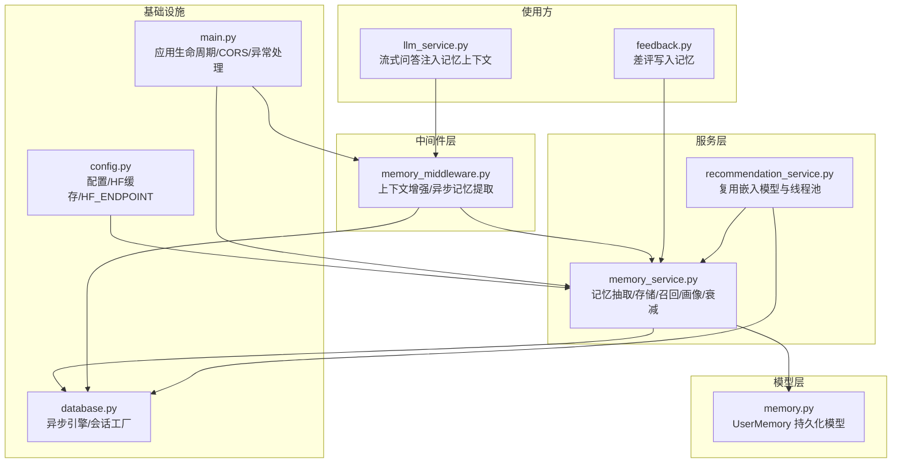
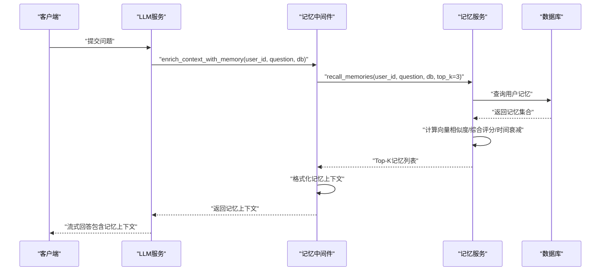
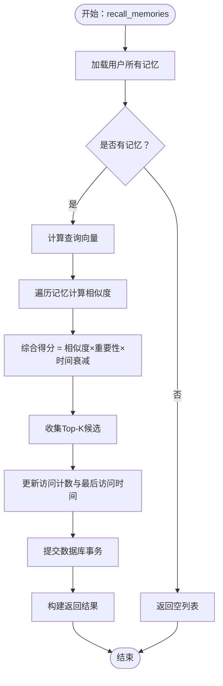
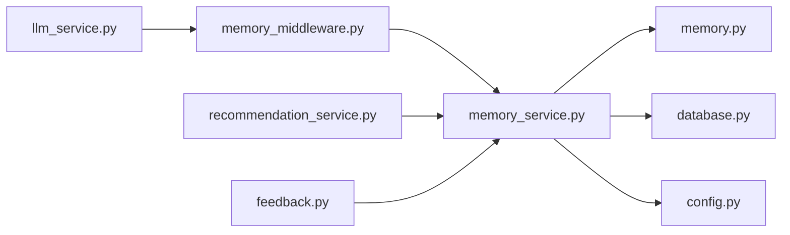

# 内存中间件

<cite>
**本文档引用的文件**
- [memory_middleware.py](file://backend/app/services/memory_middleware.py)
- [memory_service.py](file://backend/app/services/memory_service.py)
- [memory.py](file://backend/app/models/memory.py)
- [llm_service.py](file://backend/app/services/llm/llm_service.py)
- [feedback.py](file://backend/app/routers/feedback.py)
- [recommendation_service.py](file://backend/app/services/recommendation_service.py)
- [config.py](file://backend/app/config.py)
- [database.py](file://backend/app/database.py)
- [main.py](file://backend/app/main.py)
</cite>

## 目录
1. [简介](#简介)
2. [项目结构](#项目结构)
3. [核心组件](#核心组件)
4. [架构总览](#架构总览)
5. [详细组件分析](#详细组件分析)
6. [依赖关系分析](#依赖关系分析)
7. [性能考量](#性能考量)
8. [故障排查指南](#故障排查指南)
9. [结论](#结论)
10. [附录](#附录)

## 简介
本文件聚焦“内存中间件”的设计与实现，系统阐述其在本项目中的职责边界、数据结构、并发控制、缓存策略、失效与淘汰机制、性能优化、监控与统计以及故障恢复。需要特别说明的是：本仓库中的“内存中间件”并非传统意义上的进程内缓存（如 Redis/Memcached），而是围绕用户长期记忆的“向量嵌入 + 重要性权重 + 时间衰减”的轻量级“内存态”管理与召回能力。它通过向量相似度召回、重要性衰减与去重合并等机制，实现“近实时”的上下文增强与个性化体验。

## 项目结构
与“内存中间件”直接相关的模块分布如下：
- 中间件层：负责在问答前增强上下文、在问答后异步提取记忆
- 服务层：负责记忆的抽取、存储、召回、画像构建、衰减与删除
- 模型层：持久化用户记忆，支持向量字段与重要性权重
- 使用方：LLM 服务在流式问答中注入记忆上下文；反馈路由在差评时写入记忆；推荐服务复用记忆服务的嵌入模型与线程池

图表来源
- [memory_middleware.py:1-131](file://backend/app/services/memory_middleware.py#L1-L131)
- [memory_service.py:1-438](file://backend/app/services/memory_service.py#L1-L438)
- [memory.py:1-54](file://backend/app/models/memory.py#L1-L54)
- [llm_service.py:190-245](file://backend/app/services/llm/llm_service.py#L190-L245)
- [feedback.py:110-135](file://backend/app/routers/feedback.py#L110-L135)
- [recommendation_service.py:100-129](file://backend/app/services/recommendation_service.py#L100-L129)
- [config.py:1-44](file://backend/app/config.py#L1-L44)
- [database.py:1-81](file://backend/app/database.py#L1-L81)
- [main.py:1-114](file://backend/app/main.py#L1-L114)

章节来源
- [memory_middleware.py:1-131](file://backend/app/services/memory_middleware.py#L1-L131)
- [memory_service.py:1-438](file://backend/app/services/memory_service.py#L1-L438)
- [memory.py:1-54](file://backend/app/models/memory.py#L1-L54)
- [llm_service.py:190-245](file://backend/app/services/llm/llm_service.py#L190-L245)
- [feedback.py:110-135](file://backend/app/routers/feedback.py#L110-L135)
- [recommendation_service.py:100-129](file://backend/app/services/recommendation_service.py#L100-L129)
- [config.py:1-44](file://backend/app/config.py#L1-L44)
- [database.py:1-81](file://backend/app/database.py#L1-L81)
- [main.py:1-114](file://backend/app/main.py#L1-L114)

## 核心组件
- 记忆中间件（memory_middleware.py）
  - 问答前：召回相关记忆并格式化为上下文字符串，注入到提示词
  - 问答后：异步提取新记忆，不阻塞主流程
- 记忆服务（memory_service.py）
  - 抽取：基于 LLM 的 JSON 结构化抽取，过滤有效记忆并异步存储
  - 存储：去重（相似度阈值）、向量化（SentenceTransformer）、重要性权重与时间衰减
  - 召回：向量相似度 + 重要性权重 + 时间衰减综合评分，Top-K 返回
  - 画像：聚合用户记忆，形成研究兴趣、偏好、术语使用、背景等维度
  - 衰减：超过阈值未访问的记忆重要性指数衰减
  - 删除与查询：按条件删除与查询
- 记忆模型（memory.py）
  - 字段：用户ID、记忆类型、内容、向量、重要性、访问计数、最后访问时间、创建时间
  - 关系：与用户模型双向关联
- 使用方集成
  - LLM 服务：在流式问答中拼接记忆上下文
  - 反馈路由：差评触发记忆写入，辅助偏好学习
  - 推荐服务：复用记忆服务的嵌入模型与线程池，实现论文相似度计算

章节来源
- [memory_middleware.py:13-131](file://backend/app/services/memory_middleware.py#L13-L131)
- [memory_service.py:46-438](file://backend/app/services/memory_service.py#L46-L438)
- [memory.py:14-54](file://backend/app/models/memory.py#L14-L54)
- [llm_service.py:196-223](file://backend/app/services/llm/llm_service.py#L196-L223)
- [feedback.py:116-127](file://backend/app/routers/feedback.py#L116-L127)
- [recommendation_service.py:100-129](file://backend/app/services/recommendation_service.py#L100-L129)

## 架构总览
下面以序列图展示“问答前记忆增强”的关键流程，体现中间件与服务层的协作关系。

图表来源
- [memory_middleware.py:13-60](file://backend/app/services/memory_middleware.py#L13-L60)
- [memory_service.py:226-301](file://backend/app/services/memory_service.py#L226-L301)
- [llm_service.py:196-223](file://backend/app/services/llm/llm_service.py#L196-L223)

## 详细组件分析

### 记忆中间件（memory_middleware.py）
- 设计目标
  - 在问答前将相关记忆作为上下文注入，提升回答的个性化与一致性
  - 在问答后异步提取新记忆，保证响应延迟不受影响
- 关键方法
  - enrich_context_with_memory：召回 Top-K 相关记忆，格式化为上下文字符串
  - post_chat_memory_extraction：异步触发记忆提取任务
  - build_memory_aware_prompt：将记忆上下文与基础提示词拼接
- 并发与异步
  - 异步任务创建，避免阻塞主请求
  - 数据库会话隔离，避免会话关闭导致的异常
- 错误处理
  - 捕获异常并降级为空上下文，不影响主流程

章节来源
- [memory_middleware.py:13-131](file://backend/app/services/memory_middleware.py#L13-L131)

### 记忆服务（memory_service.py）
- 记忆抽取
  - 使用 LLM 生成 JSON 结构的记忆列表，过滤长度与格式
  - 异步存储，避免阻塞主流程
- 记忆存储
  - 去重：对同一用户同类型记忆，计算向量相似度，阈值之上仅更新访问属性
  - 向量化：懒加载嵌入模型，使用线程池执行编码
  - 重要性与时间衰减：新增记忆重要性初始值，后续访问递增，长时间未访问按指数衰减
- 记忆召回
  - 计算查询向量与已有记忆向量的余弦相似度
  - 综合得分 = 相似度 × 重要性 × 时间衰减因子
  - 按得分排序取 Top-K，并更新访问计数与最后访问时间
- 用户画像与衰减
  - 聚合记忆，按类型分类
  - 定期衰减：超过阈值未访问的记忆重要性降低
- 删除与查询
  - 支持按条件删除与查询，便于维护与调试

图表来源
- [memory_service.py:226-301](file://backend/app/services/memory_service.py#L226-L301)

章节来源
- [memory_service.py:46-438](file://backend/app/services/memory_service.py#L46-L438)

### 记忆模型（memory.py）
- 字段设计
  - memory_type：记忆类型（研究兴趣、偏好、术语使用、背景）
  - embedding：向量字符串（JSON 序列化）
  - importance：重要性权重（0~2.0）
  - access_count/last_accessed：访问统计与时点
  - created_at：创建时间
- 关系
  - 与用户模型双向关联，便于按用户维度查询与聚合

章节来源
- [memory.py:14-54](file://backend/app/models/memory.py#L14-L54)

### 使用方集成
- LLM 服务
  - 在流式问答中调用中间件增强上下文，拼接到系统消息
- 反馈路由
  - 差评触发记忆写入，类型为反馈模式，重要性略高于普通记忆
- 推荐服务
  - 复用记忆服务的嵌入模型与线程池，实现论文相似度计算

章节来源
- [llm_service.py:196-223](file://backend/app/services/llm/llm_service.py#L196-L223)
- [feedback.py:116-127](file://backend/app/routers/feedback.py#L116-L127)
- [recommendation_service.py:100-129](file://backend/app/services/recommendation_service.py#L100-L129)

## 依赖关系分析
- 组件耦合
  - 中间件依赖记忆服务进行召回与提取
  - 记忆服务依赖数据库模型与异步会话
  - 记忆服务依赖嵌入模型与线程池（来自推荐服务复用）
- 外部依赖
  - HuggingFace 模型与缓存路径（通过配置设置）
  - OpenAI/LangChain（用于记忆抽取）

图表来源
- [memory_middleware.py:1-131](file://backend/app/services/memory_middleware.py#L1-L131)
- [memory_service.py:1-438](file://backend/app/services/memory_service.py#L1-L438)
- [memory.py:1-54](file://backend/app/models/memory.py#L1-L54)
- [recommendation_service.py:100-129](file://backend/app/services/recommendation_service.py#L100-L129)
- [llm_service.py:196-223](file://backend/app/services/llm/llm_service.py#L196-L223)
- [feedback.py:116-127](file://backend/app/routers/feedback.py#L116-L127)
- [config.py:1-44](file://backend/app/config.py#L1-L44)
- [database.py:1-81](file://backend/app/database.py#L1-L81)

章节来源
- [memory_middleware.py:1-131](file://backend/app/services/memory_middleware.py#L1-L131)
- [memory_service.py:1-438](file://backend/app/services/memory_service.py#L1-L438)
- [memory.py:1-54](file://backend/app/models/memory.py#L1-L54)
- [recommendation_service.py:100-129](file://backend/app/services/recommendation_service.py#L100-L129)
- [llm_service.py:196-223](file://backend/app/services/llm/llm_service.py#L196-L223)
- [feedback.py:116-127](file://backend/app/routers/feedback.py#L116-L127)
- [config.py:1-44](file://backend/app/config.py#L1-L44)
- [database.py:1-81](file://backend/app/database.py#L1-L81)

## 性能考量
- 向量相似度计算
  - 使用余弦相似度，复杂度 O(N×D)，其中 N 为记忆条数，D 为向量维度
  - 建议：限制 top_k 与用户记忆规模，避免 O(N) 线性扫描过大
- 嵌入模型加载与执行
  - 懒加载 + 线程池执行，避免阻塞事件循环
  - 建议：在高并发场景下适当增加线程池大小，但需平衡 CPU 与内存占用
- 去重与相似度阈值
  - 相似度阈值 0.85，避免重复记忆，减少后续召回成本
- 时间衰减
  - 指数衰减因子，降低长期未访问记忆的影响，提升召回质量
- I/O 与事务
  - 批量更新访问统计与重要性，减少事务次数
- 缓存策略
  - 推荐服务对论文嵌入做了进程内缓存（字典），可借鉴到记忆服务中按用户/类型维度做轻量缓存，进一步降低重复计算

章节来源
- [memory_service.py:67-81](file://backend/app/services/memory_service.py#L67-L81)
- [memory_service.py:173-224](file://backend/app/services/memory_service.py#L173-L224)
- [memory_service.py:226-301](file://backend/app/services/memory_service.py#L226-L301)
- [recommendation_service.py:100-129](file://backend/app/services/recommendation_service.py#L100-L129)

## 故障排查指南
- 记忆召回失败
  - 现象：返回空上下文或异常日志
  - 排查：确认用户是否存在记忆、向量字段是否为空、相似度计算是否异常
- 记忆提取失败
  - 现象：LLM 输出非 JSON 或解析失败
  - 排查：检查提示词模板、LLM 返回格式、JSON 解析分支
- 嵌入模型加载失败
  - 现象：首次调用报错或超时
  - 排查：确认 HF 缓存路径与网络代理设置、线程池可用性
- 数据库异常
  - 现象：事务回滚、连接异常
  - 排查：检查数据库连接配置、会话生命周期、并发事务冲突
- 异步任务异常
  - 现象：后台任务未生效
  - 排查：确认事件循环可用、新会话创建与提交逻辑

章节来源
- [memory_middleware.py:57-59](file://backend/app/services/memory_middleware.py#L57-L59)
- [memory_middleware.py:84-85](file://backend/app/services/memory_middleware.py#L84-L85)
- [memory_middleware.py:102-103](file://backend/app/services/memory_middleware.py#L102-L103)
- [memory_service.py:152-154](file://backend/app/services/memory_service.py#L152-L154)
- [memory_service.py:298-300](file://backend/app/services/memory_service.py#L298-L300)
- [config.py:4-11](file://backend/app/config.py#L4-L11)
- [database.py:30-47](file://backend/app/database.py#L30-L47)

## 结论
本项目的“内存中间件”通过“向量嵌入 + 重要性权重 + 时间衰减”的轻量机制，实现了近实时的记忆召回与上下文增强。其设计强调：
- 异步化与非阻塞：问答前后均采用异步处理，保障响应性能
- 去重与质量控制：相似度阈值与重要性递增，避免冗余记忆
- 可扩展性：嵌入模型懒加载与线程池复用，便于横向扩展
- 可维护性：清晰的模块边界与错误降级，便于定位与修复

建议在未来迭代中引入：
- 记忆服务的进程内缓存（按用户/类型维度）
- 更细粒度的监控指标（召回耗时、相似度分布、重要性分布）
- 记忆清理策略（定期归档/删除低价值记忆）

## 附录

### 配置与部署要点
- HuggingFace 缓存与镜像
  - 通过环境变量设置 HF_ENDPOINT 与 HF_HOME，加速模型下载与缓存
- 数据库与会话
  - 使用异步引擎与会话工厂，确保高并发下的稳定性
- 应用生命周期
  - 在 lifespan 中初始化数据库与默认用户，确保服务启动顺序正确

章节来源
- [config.py:4-11](file://backend/app/config.py#L4-L11)
- [database.py:13-48](file://backend/app/database.py#L13-L48)
- [main.py:16-53](file://backend/app/main.py#L16-L53)