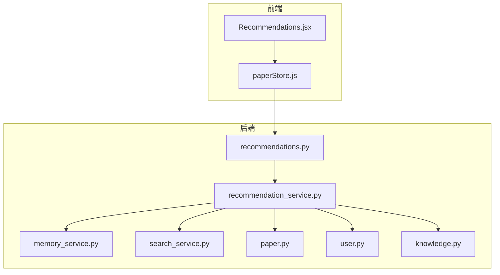
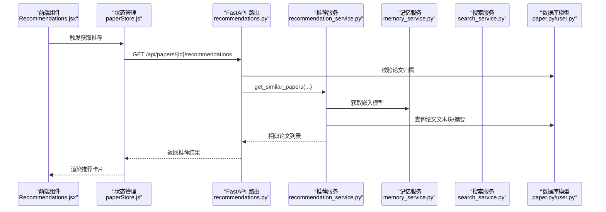
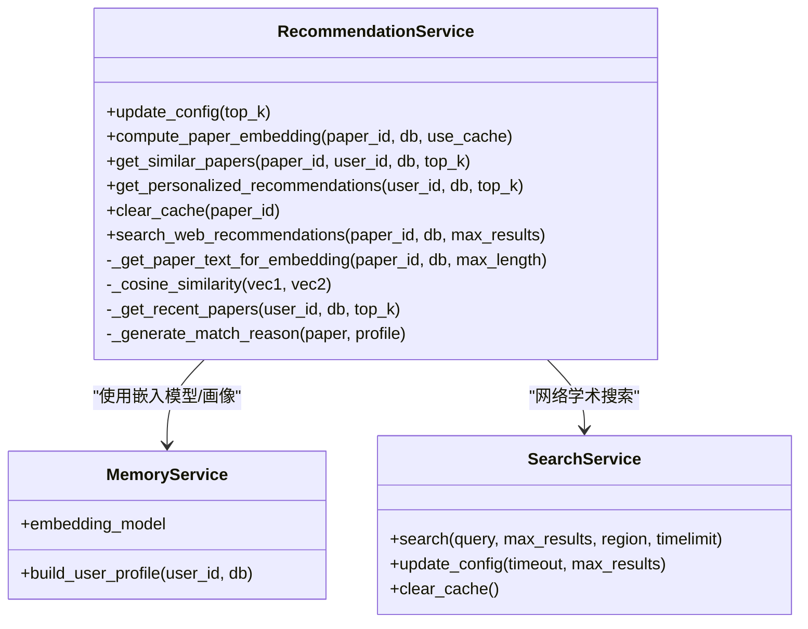
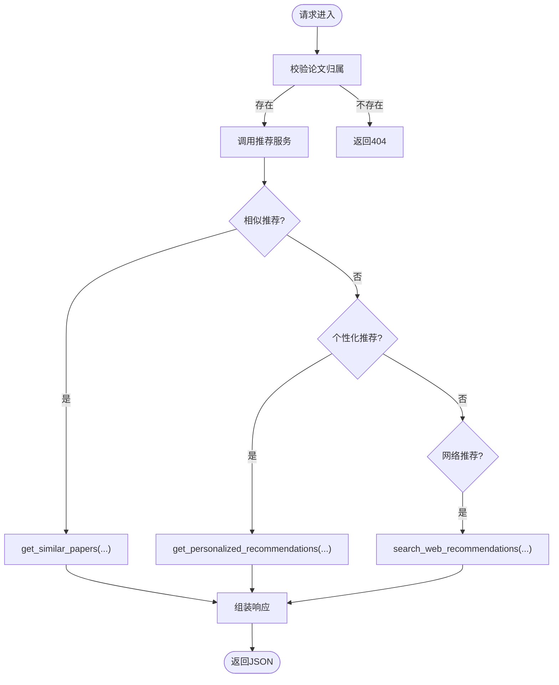
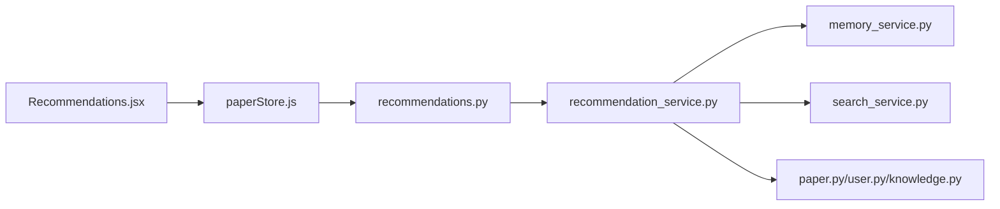

# 推荐服务

<cite>
**本文引用的文件**
- [recommendation_service.py](file://backend/app/services/recommendation_service.py)
- [recommendations.py](file://backend/app/routers/recommendations.py)
- [paper.py](file://backend/app/models/paper.py)
- [user.py](file://backend/app/models/user.py)
- [knowledge.py](file://backend/app/models/knowledge.py)
- [memory_service.py](file://backend/app/services/memory_service.py)
- [search_service.py](file://backend/app/services/search_service.py)
- [Recommendations.jsx](file://frontend/src/components/Recommendations/Recommendations.jsx)
- [paperStore.js](file://frontend/src/stores/paperStore.js)
- [config.py](file://backend/app/config.py)
- [main.py](file://backend/app/main.py)
</cite>

## 目录
1. [简介](#简介)
2. [项目结构](#项目结构)
3. [核心组件](#核心组件)
4. [架构总览](#架构总览)
5. [详细组件分析](#详细组件分析)
6. [依赖关系分析](#依赖关系分析)
7. [性能考量](#性能考量)
8. [故障排查指南](#故障排查指南)
9. [结论](#结论)
10. [附录](#附录)

## 简介
本文件面向“推荐服务”的技术文档，聚焦于个性化推荐系统的算法实现与工程实践。当前系统采用内容相似性与用户画像相结合的策略，通过论文嵌入向量计算与缓存、余弦相似度评分、阅读状态与时间衰减加权等机制，提供“相似论文推荐”“个性化推荐”“网络学术推荐”三大能力，并配套前端组件与状态管理，形成完整的推荐闭环。文档同时给出参数调优、实时更新与离线训练建议，以及评估指标、A/B测试与性能监控策略。

## 项目结构
推荐服务由后端服务层、路由层、模型层与前端组件/状态管理共同构成：
- 后端服务层：推荐服务、记忆服务、搜索服务
- 路由层：FastAPI 路由，暴露推荐接口
- 模型层：论文、用户、知识卡片等数据模型
- 前端：推荐卡片组件与状态管理（Zustand）

图表来源
- [recommendations.py:1-234](file://backend/app/routers/recommendations.py#L1-L234)
- [recommendation_service.py:1-565](file://backend/app/services/recommendation_service.py#L1-L565)
- [memory_service.py:1-438](file://backend/app/services/memory_service.py#L1-L438)
- [search_service.py:1-113](file://backend/app/services/search_service.py#L1-L113)
- [paper.py:1-85](file://backend/app/models/paper.py#L1-L85)
- [user.py:1-36](file://backend/app/models/user.py#L1-L36)
- [knowledge.py:1-80](file://backend/app/models/knowledge.py#L1-L80)
- [Recommendations.jsx:1-265](file://frontend/src/components/Recommendations/Recommendations.jsx#L1-L265)
- [paperStore.js:1-357](file://frontend/src/stores/paperStore.js#L1-L357)

章节来源
- [recommendations.py:1-234](file://backend/app/routers/recommendations.py#L1-L234)
- [recommendation_service.py:1-565](file://backend/app/services/recommendation_service.py#L1-L565)
- [paper.py:1-85](file://backend/app/models/paper.py#L1-L85)
- [user.py:1-36](file://backend/app/models/user.py#L1-L36)
- [knowledge.py:1-80](file://backend/app/models/knowledge.py#L1-L80)
- [Recommendations.jsx:1-265](file://frontend/src/components/Recommendations/Recommendations.jsx#L1-L265)
- [paperStore.js:1-357](file://frontend/src/stores/paperStore.js#L1-L357)

## 核心组件
- 推荐服务（RecommendationService）
  - 基于内容相似性的“相似论文推荐”
  - 基于用户画像的“个性化推荐”
  - 嵌入向量缓存与相似度计算
  - 网络学术搜索推荐
- 路由层（recommendations.py）
  - 暴露相似论文、个性化推荐、刷新缓存、网络推荐接口
- 记忆服务（MemoryService）
  - 用户记忆提取、存储、召回与画像构建
  - 嵌入模型懒加载与相似度计算
- 搜索服务（SearchService）
  - DuckDuckGo 搜索封装、结果缓存与超时控制
- 模型层
  - 论文、用户、知识卡片等 ORM 模型
- 前端组件与状态
  - 推荐卡片渲染、网络推荐区域、状态管理与请求触发

章节来源
- [recommendation_service.py:20-565](file://backend/app/services/recommendation_service.py#L20-L565)
- [recommendations.py:1-234](file://backend/app/routers/recommendations.py#L1-L234)
- [memory_service.py:46-438](file://backend/app/services/memory_service.py#L46-L438)
- [search_service.py:10-113](file://backend/app/services/search_service.py#L10-L113)
- [paper.py:11-85](file://backend/app/models/paper.py#L11-L85)
- [user.py:11-36](file://backend/app/models/user.py#L11-L36)
- [knowledge.py:14-80](file://backend/app/models/knowledge.py#L14-L80)
- [Recommendations.jsx:1-265](file://frontend/src/components/Recommendations/Recommendations.jsx#L1-L265)
- [paperStore.js:1-357](file://frontend/src/stores/paperStore.js#L1-L357)

## 架构总览
推荐系统整体流程如下：
- 前端通过 Zustand store 触发推荐请求
- FastAPI 路由校验用户与论文归属
- 推荐服务计算相似度或构建画像
- 记忆服务提供嵌入模型与画像
- 搜索服务提供网络学术搜索
- 返回结构化的推荐结果给前端渲染

图表来源
- [recommendations.py:18-75](file://backend/app/routers/recommendations.py#L18-L75)
- [recommendation_service.py:150-257](file://backend/app/services/recommendation_service.py#L150-L257)
- [memory_service.py:54-75](file://backend/app/services/memory_service.py#L54-L75)
- [paper.py:11-85](file://backend/app/models/paper.py#L11-L85)
- [Recommendations.jsx:206-261](file://frontend/src/components/Recommendations/Recommendations.jsx#L206-L261)
- [paperStore.js:206-242](file://frontend/src/stores/paperStore.js#L206-L242)

## 详细组件分析

### 推荐服务（RecommendationService）
- 主要职责
  - 计算论文嵌入向量并缓存
  - 基于余弦相似度的“相似论文推荐”
  - 基于用户画像的“个性化推荐”，结合阅读状态与时间衰减
  - 网络学术搜索推荐
- 关键算法
  - 嵌入向量：使用 SentenceTransformer 模型编码文本
  - 相似度：余弦相似度，范围[-1,1]，转换为[0,100]百分制
  - 个性化评分：相似度 × 阅读状态权重 × 时间衰减权重
- 缓存策略
  - 运行时内存缓存（paper_id -> 向量），支持按论文清理或全量清理
- 错误处理
  - 嵌入计算失败、论文不存在、缓存异常均返回空结果或降级方案

图表来源
- [recommendation_service.py:20-565](file://backend/app/services/recommendation_service.py#L20-L565)
- [memory_service.py:46-438](file://backend/app/services/memory_service.py#L46-L438)
- [search_service.py:10-113](file://backend/app/services/search_service.py#L10-L113)

章节来源
- [recommendation_service.py:20-565](file://backend/app/services/recommendation_service.py#L20-L565)

### 路由层（recommendations.py）
- 接口清单
  - GET /api/papers/{paper_id}/recommendations：相似论文推荐
  - GET /api/recommendations：个性化推荐
  - POST /api/papers/{paper_id}/recommendations/refresh：刷新推荐缓存
  - GET /api/papers/{paper_id}/web-recommendations：网络学术推荐
- 参数与约束
  - top_k：1~20，默认5
  - 论文归属校验：仅允许当前用户拥有该论文
- 性能提示
  - 相似度计算与嵌入模型调用的耗时说明

图表来源
- [recommendations.py:18-234](file://backend/app/routers/recommendations.py#L18-L234)

章节来源
- [recommendations.py:1-234](file://backend/app/routers/recommendations.py#L1-L234)

### 记忆服务（MemoryService）
- 用户画像构建
  - 从用户记忆聚合研究兴趣、偏好、术语使用、背景等
  - 通过嵌入模型对文本向量化，支持相似度召回
- 记忆管理
  - 去重：相似度阈值（0.85）避免重复记忆
  - 时间衰减：指数衰减影响召回权重
  - 重要性衰减：超过90天未访问的记忆重要性降低
- 嵌入模型
  - 懒加载，线程池执行编码，避免阻塞事件循环

章节来源
- [memory_service.py:46-438](file://backend/app/services/memory_service.py#L46-L438)

### 搜索服务（SearchService）
- 功能
  - 基于 DuckDuckGo 的网络搜索
  - 结果缓存与超时控制
- 配置
  - 支持运行时更新超时与默认最大结果数
  - 缓存容量上限与逐出策略

章节来源
- [search_service.py:10-113](file://backend/app/services/search_service.py#L10-L113)

### 模型层
- 论文模型（Paper）
  - 字段：标题、作者、摘要、分类、阅读状态、页数、创建/更新时间等
  - 关系：与用户、文本块、高亮、笔记、知识卡片关联
- 用户模型（User）
  - 字段：用户名、邮箱、激活状态、创建/更新时间等
  - 关系：与论文、记忆、高亮、笔记、聊天会话等关联
- 知识卡片模型（KnowledgeCard/KnowledgeRelation）
  - 支持知识抽取、卡片化与关系建模

章节来源
- [paper.py:11-85](file://backend/app/models/paper.py#L11-L85)
- [user.py:11-36](file://backend/app/models/user.py#L11-L36)
- [knowledge.py:14-80](file://backend/app/models/knowledge.py#L14-L80)

### 前端组件与状态管理
- 推荐卡片组件（Recommendations.jsx）
  - 支持水平/垂直布局、可折叠、刷新按钮、空状态与加载态
  - 渲染相似度徽章、匹配原因、阅读状态徽章、摘要预览、元信息
  - 可选显示“网络学术推荐”区域
- 状态管理（paperStore.js）
  - 获取相似论文、个性化推荐、网络推荐
  - 请求参数：top_k、max_results
  - 错误处理与加载状态

章节来源
- [Recommendations.jsx:1-265](file://frontend/src/components/Recommendations/Recommendations.jsx#L1-L265)
- [paperStore.js:206-267](file://frontend/src/stores/paperStore.js#L206-L267)

## 依赖关系分析
- 组件耦合
  - 路由层依赖推荐服务；推荐服务依赖记忆服务与搜索服务；推荐服务与数据库模型交互
  - 前端通过 store 与路由交互，不直接依赖后端服务
- 外部依赖
  - 嵌入模型：SentenceTransformer（MiniLM-L12）
  - 搜索：DuckDuckGo
  - 数据库：SQLAlchemy（异步）
- 潜在风险
  - 嵌入模型初始化与线程池执行开销
  - 搜索超时与缓存命中率
  - 记忆去重与时间衰减策略的参数敏感性

图表来源
- [recommendations.py:1-234](file://backend/app/routers/recommendations.py#L1-L234)
- [recommendation_service.py:1-565](file://backend/app/services/recommendation_service.py#L1-L565)
- [memory_service.py:1-438](file://backend/app/services/memory_service.py#L1-L438)
- [search_service.py:1-113](file://backend/app/services/search_service.py#L1-L113)
- [paper.py:1-85](file://backend/app/models/paper.py#L1-L85)
- [user.py:1-36](file://backend/app/models/user.py#L1-L36)
- [knowledge.py:1-80](file://backend/app/models/knowledge.py#L1-L80)
- [Recommendations.jsx:1-265](file://frontend/src/components/Recommendations/Recommendations.jsx#L1-L265)
- [paperStore.js:1-357](file://frontend/src/stores/paperStore.js#L1-L357)

## 性能考量
- 嵌入向量计算
  - 首次计算约 100–200ms/篇，后续缓存命中极快
  - 建议：批量预热常用论文的嵌入，减少首屏延迟
- 相似度计算
  - 对用户其他论文逐一计算相似度，复杂度 O(N)
  - 建议：top_k 控制在合理范围（如5–10），避免 N 过大
- 个性化推荐
  - 依赖记忆服务构建画像，首次构建约 300ms
  - 建议：定期清理无用记忆，保持画像规模可控
- 网络搜索
  - 单次搜索约 3–5 秒，带超时与缓存
  - 建议：限制 max_results，避免频繁触发
- 并发与线程池
  - 嵌入与搜索使用线程池执行，避免阻塞事件循环
  - 建议：根据服务器资源调整线程池大小

[本节为通用性能建议，无需特定文件来源]

## 故障排查指南
- 嵌入计算失败
  - 现象：返回空列表或降级为最近论文
  - 排查：确认论文文本长度足够、嵌入模型可用、缓存异常
- 论文不存在或非当前用户
  - 现象：404
  - 排查：确认 paper_id 与用户绑定关系
- 网络搜索超时
  - 现象：返回空结果或日志超时警告
  - 排查：检查网络、超时配置、缓存命中情况
- 个性化推荐为空
  - 现象：返回最近上传论文
  - 排查：确认用户记忆是否足够丰富，画像构建是否成功

章节来源
- [recommendation_service.py:177-257](file://backend/app/services/recommendation_service.py#L177-L257)
- [recommendations.py:46-61](file://backend/app/routers/recommendations.py#L46-L61)
- [search_service.py:98-103](file://backend/app/services/search_service.py#L98-L103)

## 结论
本推荐服务以内容相似性与用户画像为核心，结合嵌入向量与缓存策略，实现了高效、可扩展的个性化推荐能力。通过路由层统一暴露接口，前端组件与状态管理提供良好的用户体验。建议在生产环境中进一步完善离线训练、A/B 测试与监控体系，持续优化推荐质量与性能。

[本节为总结性内容，无需特定文件来源]

## 附录

### 推荐算法与参数调优
- 相似度计算
  - 余弦相似度阈值：建议保留前 top_k，或引入最小阈值过滤
  - 文本截断长度：根据业务需求调整（当前默认 2000 字）
- 个性化评分
  - 阅读状态权重：未读 > 阅读中 > 已完成（可按业务调整）
  - 时间衰减：一年内从 1.0 衰减至 0.8（可按业务调整）
- 嵌入模型
  - 模型懒加载与线程池：确保并发安全与性能
  - 缓存策略：按需清理或全量清理，避免内存膨胀
- 网络搜索
  - 超时与缓存：根据网络状况调整超时与缓存容量
  - 结果筛选：限定学术站点（arXiv、Google Scholar 等）

章节来源
- [recommendation_service.py:35-43](file://backend/app/services/recommendation_service.py#L35-L43)
- [recommendation_service.py:130-148](file://backend/app/services/recommendation_service.py#L130-L148)
- [recommendation_service.py:337-350](file://backend/app/services/recommendation_service.py#L337-L350)
- [search_service.py:25-40](file://backend/app/services/search_service.py#L25-L40)

### 实时更新与离线训练流程
- 实时更新
  - 刷新推荐缓存：针对论文内容更新后，清理缓存并重新计算嵌入
  - 记忆服务：定期执行记忆衰减与去重，保持画像质量
- 离线训练
  - 建议：定期导出用户阅读行为与论文特征，离线训练更复杂的模型（如矩阵分解、深度排序模型）
  - 特征工程：用户画像、论文主题向量、跨文档共现统计
  - A/B 测试：对比不同算法的点击率、停留时长、转化率等指标

章节来源
- [recommendations.py:121-177](file://backend/app/routers/recommendations.py#L121-L177)
- [memory_service.py:358-384](file://backend/app/services/memory_service.py#L358-L384)

### 推荐效果评估指标与A/B测试
- 评估指标
  - 点击率（CTR）、转化率（完成阅读）、平均停留时长、用户留存
  - 多样性：避免过度同质化（可通过余弦相似度阈值控制）
  - 新鲜度：鼓励推荐近期论文（时间衰减权重）
- A/B 测试
  - 分组策略：随机分组或按用户特征分层
  - 指标收集：埋点记录用户行为，统计显著性差异
  - 迭代优化：基于指标反馈调整相似度阈值、权重与缓存策略

[本节为通用评估与A/B测试建议，无需特定文件来源]

### 性能监控策略
- 指标
  - 推荐接口 P95/P99 延迟、错误率、缓存命中率、嵌入计算耗时分布
- 告警
  - 搜索超时、嵌入计算异常、缓存清理失败
- 日志
  - 记录论文 ID、用户 ID、top_k、相似度阈值、缓存命中情况

[本节为通用监控建议，无需特定文件来源]