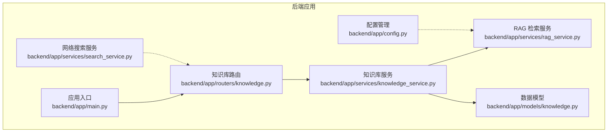
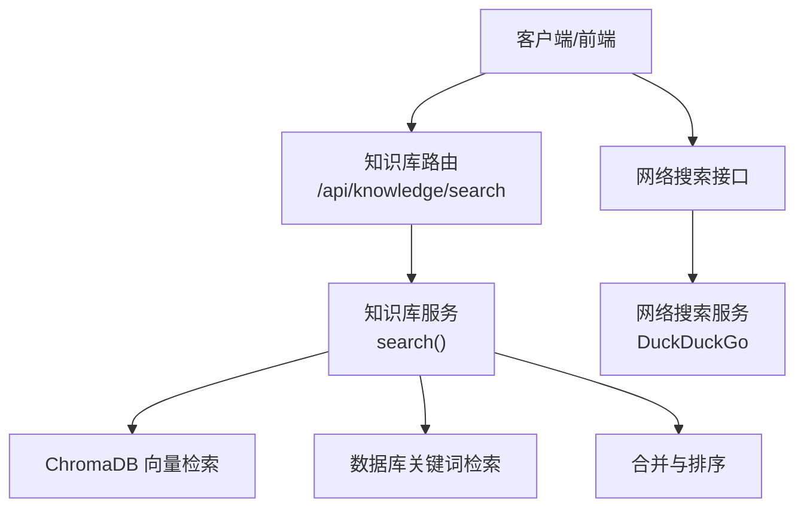
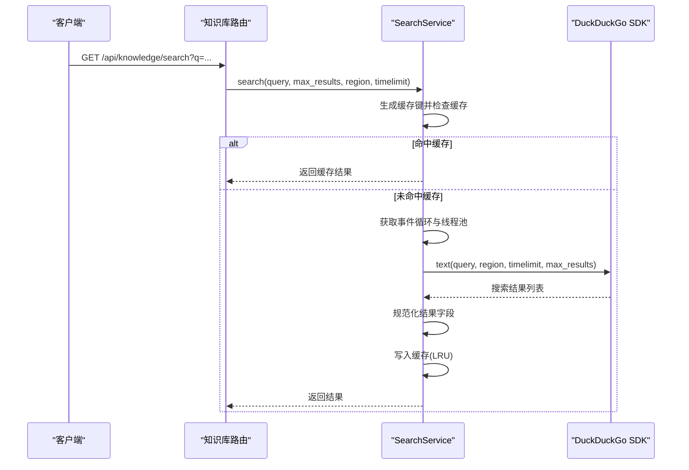
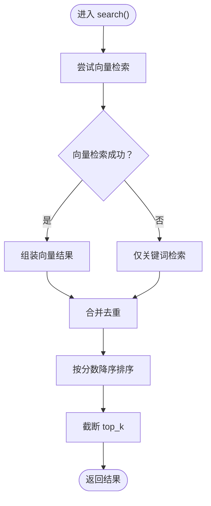
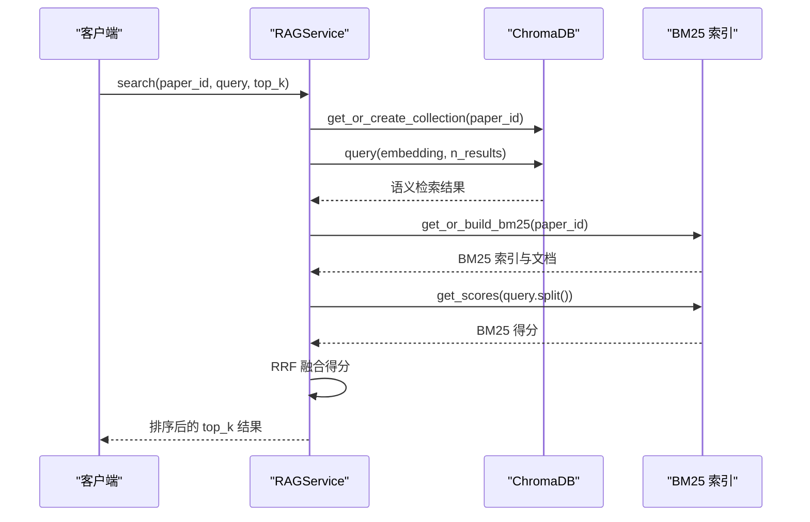
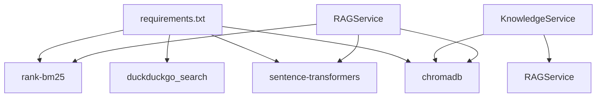

# 搜索服务

<cite>
**本文档引用的文件**
- [backend/app/services/search_service.py](file://backend/app/services/search_service.py)
- [backend/app/services/knowledge_service.py](file://backend/app/services/knowledge_service.py)
- [backend/app/services/rag_service.py](file://backend/app/services/rag_service.py)
- [backend/app/routers/knowledge.py](file://backend/app/routers/knowledge.py)
- [backend/app/models/knowledge.py](file://backend/app/models/knowledge.py)
- [backend/app/main.py](file://backend/app/main.py)
- [backend/app/config.py](file://backend/app/config.py)
- [backend/README.md](file://backend/README.md)
- [backend/requirements.txt](file://backend/requirements.txt)
</cite>

## 目录
1. [简介](#简介)
2. [项目结构](#项目结构)
3. [核心组件](#核心组件)
4. [架构总览](#架构总览)
5. [详细组件分析](#详细组件分析)
6. [依赖分析](#依赖分析)
7. [性能考虑](#性能考虑)
8. [故障排查指南](#故障排查指南)
9. [结论](#结论)
10. [附录](#附录)

## 简介
本文件面向“搜索服务”的综合技术文档，聚焦以下目标：
- 全文搜索引擎实现架构：倒排索引构建、查询解析、评分算法与结果排序机制
- Elasticsearch 或自研搜索引擎的集成方式
- 分词处理与同义词扩展
- 关键词搜索、短语匹配与布尔查询的具体示例路径
- 搜索性能优化策略、缓存机制与并发处理能力
- 搜索结果高亮显示、相关性评分与搜索建议功能

在当前代码库中，搜索能力主要由三层构成：
- 网络搜索：通过 DuckDuckGo 提供的 Python SDK 实现，具备缓存与超时控制
- 知识库内搜索：基于 ChromaDB 的向量检索 + 数据库关键词检索的混合策略
- 论文级检索：基于 ChromaDB 的向量检索 + BM25 关键词检索的混合策略，采用 RRF 融合排序

由于仓库未包含 Elasticsearch 集成代码，本文将重点阐述自研搜索引擎（ChromaDB + BM25）的实现细节，并给出与 Elasticsearch 集成的实践建议与迁移路径。

## 项目结构
后端采用 FastAPI + SQLAlchemy 异步架构，搜索相关的关键模块如下：
- 网络搜索服务：SearchService（DuckDuckGo）
- 知识库搜索服务：KnowledgeService（向量检索 + 关键词检索）
- 论文检索服务：RAGService（向量检索 + BM25 + RRF 融合）
- 路由：知识库路由提供全局搜索接口
- 配置：HuggingFace 镜像与模型缓存目录配置

图表来源
- [backend/app/main.py:55-95](file://backend/app/main.py#L55-L95)
- [backend/app/routers/knowledge.py:128-191](file://backend/app/routers/knowledge.py#L128-L191)
- [backend/app/services/search_service.py:10-113](file://backend/app/services/search_service.py#L10-L113)
- [backend/app/services/knowledge_service.py:79-465](file://backend/app/services/knowledge_service.py#L79-L465)
- [backend/app/services/rag_service.py:16-415](file://backend/app/services/rag_service.py#L16-L415)
- [backend/app/models/knowledge.py:14-80](file://backend/app/models/knowledge.py#L14-L80)

章节来源
- [backend/app/main.py:55-95](file://backend/app/main.py#L55-L95)
- [backend/README.md:72-127](file://backend/README.md#L72-L127)

## 核心组件
- 网络搜索服务（SearchService）
  - 功能：DuckDuckGo 网络搜索、结果缓存、超时控制
  - 关键点：线程池执行同步搜索、LRU 缓存、超时保护
- 知识库搜索服务（KnowledgeService）
  - 功能：向量检索 + 数据库关键词检索的混合搜索，合并去重与排序
  - 关键点：ChromaDB 集合按用户隔离；关键词检索使用 ilike 与 JSON 包含匹配
- RAG 检索服务（RAGService）
  - 功能：论文级向量检索 + BM25 关键词检索 + RRF 融合排序
  - 关键点：智能分块、BM25 缓存、线程池异步编码、跨论文并行检索
- 知识库路由（knowledge_router）
  - 功能：提供全局搜索接口 /api/knowledge/search，调用知识库服务

章节来源
- [backend/app/services/search_service.py:10-113](file://backend/app/services/search_service.py#L10-L113)
- [backend/app/services/knowledge_service.py:350-465](file://backend/app/services/knowledge_service.py#L350-L465)
- [backend/app/services/rag_service.py:236-338](file://backend/app/services/rag_service.py#L236-L338)
- [backend/app/routers/knowledge.py:345-356](file://backend/app/routers/knowledge.py#L345-L356)

## 架构总览
整体搜索架构分为三层：
- 网络层：对外部互联网进行检索，适合补充知识库外的信息
- 知识库层：对用户知识卡片进行语义检索与关键词检索的混合搜索
- 论文层：对论文文本进行语义检索与 BM25 关键词检索的混合搜索，并以 RRF 融合排序

图表来源
- [backend/app/routers/knowledge.py:345-356](file://backend/app/routers/knowledge.py#L345-L356)
- [backend/app/services/knowledge_service.py:350-465](file://backend/app/services/knowledge_service.py#L350-L465)
- [backend/app/services/search_service.py:41-103](file://backend/app/services/search_service.py#L41-L103)

## 详细组件分析

### 组件A：网络搜索服务（SearchService）
- 设计要点
  - 使用 DuckDuckGo SDK 的 text 方法执行网络搜索
  - 通过线程池执行同步调用，避免阻塞事件循环
  - 结果缓存：以查询参数为键，LRU 淘汰策略
  - 超时控制：统一超时阈值，异常捕获返回空结果
- 关键流程（序列图）

图表来源
- [backend/app/routers/knowledge.py:345-356](file://backend/app/routers/knowledge.py#L345-L356)
- [backend/app/services/search_service.py:41-103](file://backend/app/services/search_service.py#L41-L103)

章节来源
- [backend/app/services/search_service.py:10-113](file://backend/app/services/search_service.py#L10-L113)

### 组件B：知识库搜索服务（KnowledgeService）
- 设计要点
  - 向量检索：按用户隔离集合，使用嵌入模型编码查询，ChromaDB 查询返回距离
  - 关键词检索：对标题、内容、标签进行模糊匹配
  - 结果合并：先加入向量检索结果，再追加关键词检索结果，去重并按分数排序
  - 分数计算：向量距离转换为 1 - distance；关键词匹配默认分数 0.5
- 关键流程（流程图）

图表来源
- [backend/app/services/knowledge_service.py:350-465](file://backend/app/services/knowledge_service.py#L350-L465)

章节来源
- [backend/app/services/knowledge_service.py:350-465](file://backend/app/services/knowledge_service.py#L350-L465)

### 组件C：RAG 检索服务（RAGService）
- 设计要点
  - 向量检索：按论文 ID 隔离集合，使用线程池异步编码
  - BM25 关键词检索：首次构建缓存，后续复用；查询时按词切分
  - RRF 融合：Reciprocal Rank Fusion，融合语义与关键词得分
  - 智能分块：按自然边界与页码信息分块，支持重叠
  - 并发检索：跨论文检索使用 asyncio.gather 并行执行
- 关键流程（序列图）

图表来源
- [backend/app/services/rag_service.py:236-309](file://backend/app/services/rag_service.py#L236-L309)

章节来源
- [backend/app/services/rag_service.py:16-415](file://backend/app/services/rag_service.py#L16-L415)

### 组件D：知识库路由与模型
- 路由
  - /api/knowledge/search：接收查询参数，调用知识库服务，返回结果与原始查询
- 模型
  - KnowledgeCard：知识卡片表，包含标题、内容、摘要、标签、分类、重要性等字段
  - KnowledgeRelation：知识关联表，包含源卡片、目标卡片、关联类型、置信度等

章节来源
- [backend/app/routers/knowledge.py:345-356](file://backend/app/routers/knowledge.py#L345-L356)
- [backend/app/models/knowledge.py:14-80](file://backend/app/models/knowledge.py#L14-L80)

## 依赖分析
- 外部依赖
  - ChromaDB：向量数据库，持久化存储与查询
  - sentence-transformers：文本嵌入模型（首次加载较慢）
  - rank-bm25：BM25 关键词检索
  - duckduckgo_search：网络搜索 SDK
- 内部依赖
  - KnowledgeService 依赖 RAGService 的嵌入模型与 ChromaDB 客户端
  - 路由依赖知识库服务进行搜索

图表来源
- [backend/requirements.txt:1-19](file://backend/requirements.txt#L1-L19)
- [backend/app/services/knowledge_service.py:375-387](file://backend/app/services/knowledge_service.py#L375-L387)
- [backend/app/services/rag_service.py:89-96](file://backend/app/services/rag_service.py#L89-L96)

章节来源
- [backend/requirements.txt:1-19](file://backend/requirements.txt#L1-L19)
- [backend/app/services/knowledge_service.py:375-387](file://backend/app/services/knowledge_service.py#L375-L387)
- [backend/app/services/rag_service.py:89-96](file://backend/app/services/rag_service.py#L89-L96)

## 性能考虑
- 模型懒加载与线程池
  - Embedding 模型首次访问时加载，使用线程池避免阻塞事件循环
  - 线程池大小为 2，适合小规模并发
- 缓存策略
  - 网络搜索：LRU 缓存，限制最大容量
  - BM25：按论文 ID 缓存索引与文档，避免重复构建
- 并发与异步
  - 向量检索与 BM25 查询均通过线程池异步执行
  - 跨论文检索使用 asyncio.gather 并行执行
- I/O 与数据库
  - 关键词检索使用 ilike 与 JSON 包含匹配，注意索引与查询成本
- 建议
  - 增大线程池大小以提升并发
  - 对高频查询增加内存缓存层（如 Redis）
  - 对数据库查询增加复合索引（用户 + 标题/内容/标签）
  - 对嵌入模型使用更轻量版本或模型量化

[本节为通用性能指导，无需特定文件引用]

## 故障排查指南
- 网络搜索
  - 现象：超时或空结果
  - 排查：检查超时阈值、网络连通性、DDG 服务可用性
  - 参考路径：[backend/app/services/search_service.py:98-103](file://backend/app/services/search_service.py#L98-L103)
- 向量检索
  - 现象：集合为空或查询失败
  - 排查：确认集合是否存在、集合是否已索引、嵌入模型是否加载成功
  - 参考路径：[backend/app/services/knowledge_service.py:375-404](file://backend/app/services/knowledge_service.py#L375-L404)
- BM25 缓存
  - 现象：首次检索慢
  - 排查：确认缓存是否命中、文档是否正确写入
  - 参考路径：[backend/app/services/rag_service.py:166-184](file://backend/app/services/rag_service.py#L166-L184)
- 路由与权限
  - 现象：404/403
  - 排查：确认用户身份、卡片归属、路由路径
  - 参考路径：[backend/app/routers/knowledge.py:224-244](file://backend/app/routers/knowledge.py#L224-L244)

章节来源
- [backend/app/services/search_service.py:98-103](file://backend/app/services/search_service.py#L98-L103)
- [backend/app/services/knowledge_service.py:375-404](file://backend/app/services/knowledge_service.py#L375-L404)
- [backend/app/services/rag_service.py:166-184](file://backend/app/services/rag_service.py#L166-L184)
- [backend/app/routers/knowledge.py:224-244](file://backend/app/routers/knowledge.py#L224-L244)

## 结论
本项目实现了三层搜索能力：
- 网络搜索：稳定、低耦合，适合补充外部信息
- 知识库搜索：向量 + 关键词混合，适合用户内部知识检索
- 论文检索：向量 + BM25 + RRF 融合，适合学术论文细粒度检索

若需引入 Elasticsearch：
- 保留现有 ChromaDB + BM25 的混合检索作为主检索
- 将 Elasticsearch 作为关键词检索的替代或补充，利用其成熟的倒排索引与查询 DSL
- 保持 RRF 融合策略，将 Elasticsearch 的评分与向量评分统一归一化

[本节为总结性内容，无需特定文件引用]

## 附录

### 示例：如何进行关键词搜索、短语匹配与布尔查询
- 关键词搜索（知识库）
  - 路径：[backend/app/routers/knowledge.py:345-356](file://backend/app/routers/knowledge.py#L345-L356)
  - 实现：[backend/app/services/knowledge_service.py:407-420](file://backend/app/services/knowledge_service.py#L407-L420)
- 短语匹配（论文检索）
  - 建议：在 Elasticsearch 中使用 match_phrase 查询
  - 当前实现：ChromaDB 向量检索 + BM25 关键词检索（近似短语匹配）
- 布尔查询（论文检索）
  - 建议：在 Elasticsearch 中使用 bool 查询组合 must/must_not/should
  - 当前实现：BM25 关键词检索按词切分后评分（逻辑与/或可由查询词组合实现）

[本节为概念性说明，无需特定文件引用]

### 搜索性能优化清单
- 模型与线程池
  - 使用线程池异步执行嵌入编码
  - 控制线程池大小，避免过度并发
- 缓存
  - 网络搜索 LRU 缓存
  - BM25 索引与文档缓存
- 数据库
  - 为用户 + 标题/内容/标签建立复合索引
  - 限制关键词检索返回数量
- 并发
  - 跨论文检索并行执行
  - 向量检索与 BM25 查询并行执行

[本节为通用优化建议，无需特定文件引用]