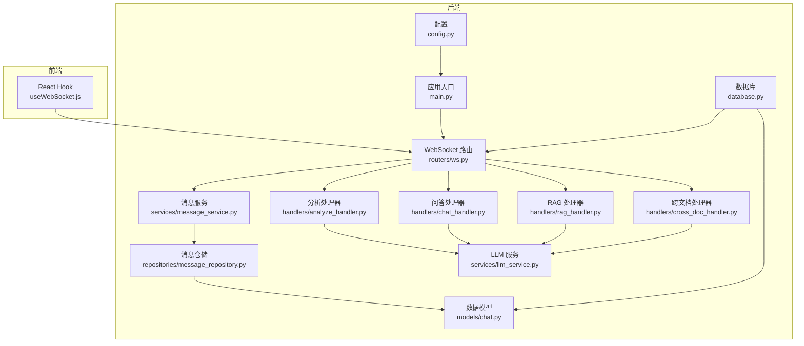
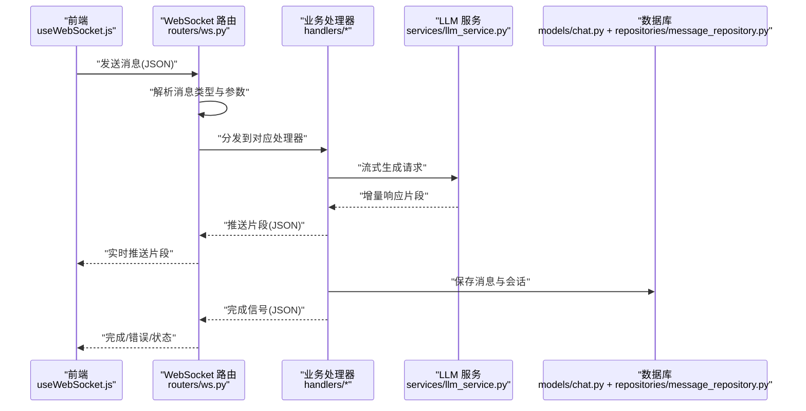
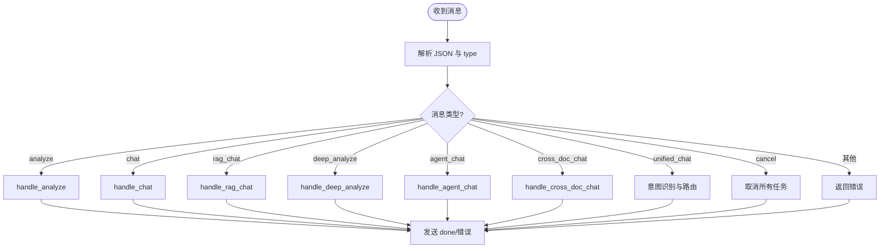
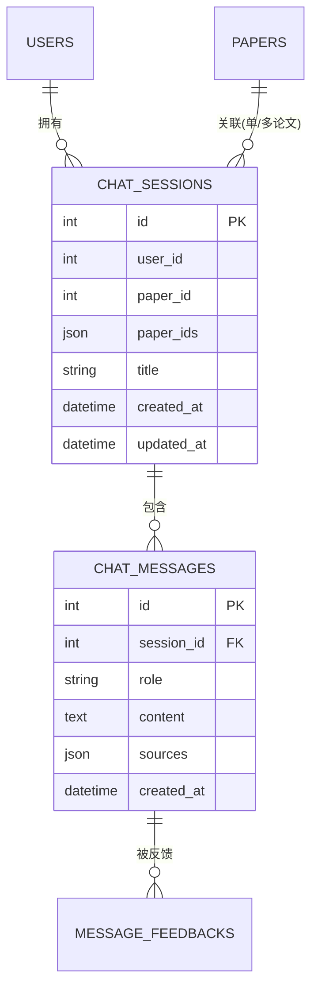
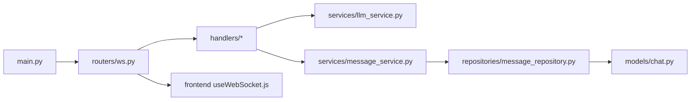

# 消息服务

<cite>
**本文档引用的文件**
- [backend/app/main.py](file://backend/app/main.py)
- [backend/app/config.py](file://backend/app/config.py)
- [backend/app/database.py](file://backend/app/database.py)
- [backend/app/routers/ws.py](file://backend/app/routers/ws.py)
- [backend/app/models/chat.py](file://backend/app/models/chat.py)
- [backend/app/repositories/message_repository.py](file://backend/app/repositories/message_repository.py)
- [backend/app/services/message_service.py](file://backend/app/services/message_service.py)
- [backend/app/handlers/analyze_handler.py](file://backend/app/handlers/analyze_handler.py)
- [backend/app/handlers/chat_handler.py](file://backend/app/handlers/chat_handler.py)
- [backend/app/handlers/rag_handler.py](file://backend/app/handlers/rag_handler.py)
- [backend/app/handlers/cross_doc_handler.py](file://backend/app/handlers/cross_doc_handler.py)
- [backend/app/services/llm_service.py](file://backend/app/services/llm_service.py)
- [frontend/src/hooks/useWebSocket.js](file://frontend/src/hooks/useWebSocket.js)
</cite>

## 目录
1. [简介](#简介)
2. [项目结构](#项目结构)
3. [核心组件](#核心组件)
4. [架构总览](#架构总览)
5. [详细组件分析](#详细组件分析)
6. [依赖关系分析](#依赖关系分析)
7. [性能考虑](#性能考虑)
8. [故障排查指南](#故障排查指南)
9. [结论](#结论)
10. [附录](#附录)

## 简介
本文件面向“消息服务”的综合技术文档，聚焦于实时消息传递与通知系统的设计与实现，涵盖消息队列、推送通知、状态同步、消息格式、路由规则、可靠性保障、优先级与批量处理、持久化存储、历史记录与消息回放等主题。系统采用 WebSocket 实时通道承载消息流，结合 LangChain 与 LLM 提供流式响应，通过 SQLAlchemy 异步 ORM 实现消息与会话的持久化。

## 项目结构
后端基于 FastAPI，前端基于 React，消息服务主要由以下模块构成：
- 应用入口与生命周期：FastAPI 应用、CORS 中间件、路由注册、健康检查
- WebSocket 路由：统一消息入口、消息类型路由、并发任务管理、状态广播
- 模型与仓储：会话与消息的数据模型、消息查询与保存
- 服务层：消息服务（全文缓存、历史加载、消息保存）、LLM 服务（流式生成）
- 处理器：分析、问答、RAG、跨文档问答等业务处理器
- 前端 Hook：WebSocket 连接、消息收发、重连与事件订阅

图表来源
- [backend/app/main.py:55-95](file://backend/app/main.py#L55-L95)
- [backend/app/routers/ws.py:76-102](file://backend/app/routers/ws.py#L76-L102)
- [backend/app/models/chat.py:14-71](file://backend/app/models/chat.py#L14-L71)
- [backend/app/repositories/message_repository.py:10-55](file://backend/app/repositories/message_repository.py#L10-L55)
- [backend/app/services/message_service.py:20-84](file://backend/app/services/message_service.py#L20-L84)
- [backend/app/handlers/analyze_handler.py:13-87](file://backend/app/handlers/analyze_handler.py#L13-L87)
- [backend/app/handlers/chat_handler.py:11-32](file://backend/app/handlers/chat_handler.py#L11-L32)
- [backend/app/handlers/rag_handler.py:29-234](file://backend/app/handlers/rag_handler.py#L29-L234)
- [backend/app/handlers/cross_doc_handler.py:14-95](file://backend/app/handlers/cross_doc_handler.py#L14-L95)
- [backend/app/services/llm_service.py:1-53](file://backend/app/services/llm_service.py#L1-L53)
- [frontend/src/hooks/useWebSocket.js:19-71](file://frontend/src/hooks/useWebSocket.js#L19-L71)

章节来源
- [backend/app/main.py:55-95](file://backend/app/main.py#L55-L95)
- [backend/app/routers/ws.py:76-102](file://backend/app/routers/ws.py#L76-L102)
- [backend/app/models/chat.py:14-71](file://backend/app/models/chat.py#L14-L71)
- [backend/app/repositories/message_repository.py:10-55](file://backend/app/repositories/message_repository.py#L10-L55)
- [backend/app/services/message_service.py:20-84](file://backend/app/services/message_service.py#L20-L84)
- [backend/app/handlers/analyze_handler.py:13-87](file://backend/app/handlers/analyze_handler.py#L13-L87)
- [backend/app/handlers/chat_handler.py:11-32](file://backend/app/handlers/chat_handler.py#L11-L32)
- [backend/app/handlers/rag_handler.py:29-234](file://backend/app/handlers/rag_handler.py#L29-L234)
- [backend/app/handlers/cross_doc_handler.py:14-95](file://backend/app/handlers/cross_doc_handler.py#L14-L95)
- [backend/app/services/llm_service.py:1-53](file://backend/app/services/llm_service.py#L1-L53)
- [frontend/src/hooks/useWebSocket.js:19-71](file://frontend/src/hooks/useWebSocket.js#L19-L71)

## 核心组件
- WebSocket 统一路由与状态管理：负责连接生命周期、消息类型分发、并发任务调度、状态广播与错误处理
- 消息与会话模型：定义会话与消息的结构、关系与持久化字段
- 消息仓储：提供按会话分页查询、最近消息查询、计数与保存
- 消息服务：封装全文缓存、会话历史加载、消息保存、文本块访问
- 处理器：分析、问答、RAG、跨文档问答的业务逻辑与流式输出
- LLM 服务：提供流式生成能力与提示词模板
- 前端 Hook：WebSocket 连接、消息收发、重连与事件订阅

章节来源
- [backend/app/routers/ws.py:56-65](file://backend/app/routers/ws.py#L56-L65)
- [backend/app/models/chat.py:14-71](file://backend/app/models/chat.py#L14-L71)
- [backend/app/repositories/message_repository.py:10-55](file://backend/app/repositories/message_repository.py#L10-L55)
- [backend/app/services/message_service.py:20-84](file://backend/app/services/message_service.py#L20-L84)
- [backend/app/handlers/analyze_handler.py:13-87](file://backend/app/handlers/analyze_handler.py#L13-L87)
- [backend/app/handlers/chat_handler.py:11-32](file://backend/app/handlers/chat_handler.py#L11-L32)
- [backend/app/handlers/rag_handler.py:29-234](file://backend/app/handlers/rag_handler.py#L29-L234)
- [backend/app/handlers/cross_doc_handler.py:14-95](file://backend/app/handlers/cross_doc_handler.py#L14-L95)
- [backend/app/services/llm_service.py:1-53](file://backend/app/services/llm_service.py#L1-L53)
- [frontend/src/hooks/useWebSocket.js:19-71](file://frontend/src/hooks/useWebSocket.js#L19-L71)

## 架构总览
系统采用“前端 WebSocket → 后端 WebSocket 路由 → 业务处理器 → LLM 服务 → 数据库/缓存”的链路。消息以 JSON 文本形式在全双工通道中传输，处理器通过流式方式向客户端推送增量响应；同时，消息与会话持久化至数据库，支持历史查询与回放。

图表来源
- [backend/app/routers/ws.py:114-436](file://backend/app/routers/ws.py#L114-L436)
- [backend/app/handlers/rag_handler.py:29-234](file://backend/app/handlers/rag_handler.py#L29-L234)
- [backend/app/handlers/cross_doc_handler.py:14-95](file://backend/app/handlers/cross_doc_handler.py#L14-L95)
- [backend/app/handlers/analyze_handler.py:13-87](file://backend/app/handlers/analyze_handler.py#L13-L87)
- [backend/app/handlers/chat_handler.py:11-32](file://backend/app/handlers/chat_handler.py#L11-L32)
- [backend/app/services/llm_service.py:1-53](file://backend/app/services/llm_service.py#L1-L53)
- [backend/app/models/chat.py:14-71](file://backend/app/models/chat.py#L14-L71)
- [backend/app/repositories/message_repository.py:10-55](file://backend/app/repositories/message_repository.py#L10-L55)
- [frontend/src/hooks/useWebSocket.js:100-180](file://frontend/src/hooks/useWebSocket.js#L100-L180)

## 详细组件分析

### WebSocket 路由与消息格式
- 连接与认证：支持 JWT Token 校验，未提供 Token 时降级为默认用户
- 消息类型与负载：
  - 分析：{"type":"analyze","text":"...","paper_id":N}
  - 问答：{"type":"chat","message":"..."}
  - RAG 问答：{"type":"rag_chat","message":"...","paper_id":N,"session_id":N,"user_id":N,"enable_search":boolean}
  - 跨文档问答：{"type":"cross_doc_chat","message":"...","paper_ids":[...],"session_id":N,"user_id":N}
  - 深度分析：{"type":"deep_analyze","text":"...","paper_id":N}
  - Agent 问答：{"type":"agent_chat","message":"...","paper_id":N,"paper_ids":[...]}
  - 统一入口：{"type":"unified_chat","message":"...","paper_id":N,"paper_ids":[...],"session_id":N,"enable_search":boolean}
  - 取消：{"type":"cancel"}
- 响应类型：
  - 片段：{"type":"*_chunk","data"/"content":"..."}
  - 来源：{"type":"rag_sources"/"cross_doc_sources","sources":[...]}
  - 搜索状态：{"type":"search_status","status":"searching|completed","results_count":N}
  - 索引状态：{"type":"index_status","status":"rebuilding|ready","message":"..."}
  - 完成：{"type":"done","channel":"...","session_id":N}
  - 错误：{"type":"error","message":"..."}

图表来源
- [backend/app/routers/ws.py:114-436](file://backend/app/routers/ws.py#L114-L436)

章节来源
- [backend/app/routers/ws.py:76-102](file://backend/app/routers/ws.py#L76-L102)
- [backend/app/routers/ws.py:114-436](file://backend/app/routers/ws.py#L114-L436)

### 消息格式定义与路由规则
- 请求字段规范：type 必填；不同类型携带不同必填字段（如 paper_id、paper_ids、message 等）
- 路由规则：根据 type 将消息分发至对应处理器；统一入口通过关键词识别自动路由
- 并发控制：同一类型的运行任务以字典维护，重复触发时取消旧任务再创建新任务
- 取消机制：支持 cancel 类型中断所有运行中的任务

章节来源
- [backend/app/routers/ws.py:114-436](file://backend/app/routers/ws.py#L114-L436)

### 可靠性保证与错误处理
- 连接可靠性：前端具备指数退避重连（最大次数与延迟配置）
- 任务取消：处理器捕获取消异常，确保资源释放
- 错误传播：处理器统一捕获异常并向客户端发送 error 类型消息
- 数据一致性：数据库事务由仓储与服务层封装，异常时回滚并抛出

章节来源
- [frontend/src/hooks/useWebSocket.js:4-180](file://frontend/src/hooks/useWebSocket.js#L4-L180)
- [backend/app/handlers/rag_handler.py:225-234](file://backend/app/handlers/rag_handler.py#L225-L234)
- [backend/app/handlers/cross_doc_handler.py:86-95](file://backend/app/handlers/cross_doc_handler.py#L86-L95)
- [backend/app/handlers/analyze_handler.py:40-49](file://backend/app/handlers/analyze_handler.py#L40-L49)
- [backend/app/handlers/chat_handler.py:23-32](file://backend/app/handlers/chat_handler.py#L23-L32)

### 消息确认与状态同步
- 状态同步：处理器在关键节点推送 search_status、index_status、done 等状态
- 完成信号：每个处理流程在结束时发送 done，携带 channel 与 session_id
- 前端订阅：前端 Hook 维护全局处理器映射，按 type 分发给订阅者

章节来源
- [backend/app/handlers/rag_handler.py:110-138](file://backend/app/handlers/rag_handler.py#L110-L138)
- [backend/app/handlers/rag_handler.py:206-223](file://backend/app/handlers/rag_handler.py#L206-L223)
- [backend/app/handlers/cross_doc_handler.py:58-84](file://backend/app/handlers/cross_doc_handler.py#L58-L84)
- [backend/app/handlers/analyze_handler.py:31-49](file://backend/app/handlers/analyze_handler.py#L31-L49)
- [frontend/src/hooks/useWebSocket.js:164-176](file://frontend/src/hooks/useWebSocket.js#L164-L176)

### 优先级管理、批量处理与性能优化
- 优先级：当前未实现显式优先级队列；可通过取消旧任务抢占资源
- 批量处理：消息仓储支持分页查询（limit/offset），适合历史回放与批量读取
- 性能优化：
  - 全文缓存：消息服务对论文全文进行模块级缓存，避免重复查询
  - 异步索引重建：当检索不到结果时，异步重建索引并通知前端
  - 流式输出：LLM 服务以流式方式生成，前端即时渲染
  - 任务取消：防止长时间占用资源

章节来源
- [backend/app/services/message_service.py:16-37](file://backend/app/services/message_service.py#L16-L37)
- [backend/app/handlers/rag_handler.py:60-80](file://backend/app/handlers/rag_handler.py#L60-L80)
- [backend/app/repositories/message_repository.py:10-32](file://backend/app/repositories/message_repository.py#L10-L32)

### 持久化存储、历史记录与消息回放
- 数据模型：ChatSession 与 ChatMessage 定义会话与消息的结构，支持多论文会话与反馈关系
- 仓储接口：提供按会话分页查询、最近消息查询、计数与保存
- 历史加载：消息服务加载最近 N 条消息，组装 LangChain 历史对象
- 回放能力：前端可订阅 done 事件后拉取历史消息进行回放

图表来源
- [backend/app/models/chat.py:14-71](file://backend/app/models/chat.py#L14-L71)

章节来源
- [backend/app/models/chat.py:14-71](file://backend/app/models/chat.py#L14-L71)
- [backend/app/repositories/message_repository.py:10-55](file://backend/app/repositories/message_repository.py#L10-L55)
- [backend/app/services/message_service.py:56-68](file://backend/app/services/message_service.py#L56-L68)

### 发送与接收消息示例（代码路径）
- 前端发送 RAG 消息：[frontend/src/hooks/useWebSocket.js:109-123](file://frontend/src/hooks/useWebSocket.js#L109-L123)
- 前端发送跨文档消息：[frontend/src/hooks/useWebSocket.js:125-138](file://frontend/src/hooks/useWebSocket.js#L125-L138)
- 前端发送统一入口消息：[frontend/src/hooks/useWebSocket.js:140-154](file://frontend/src/hooks/useWebSocket.js#L140-L154)
- 前端订阅消息：[frontend/src/hooks/useWebSocket.js:164-176](file://frontend/src/hooks/useWebSocket.js#L164-L176)
- 后端接收与路由：[backend/app/routers/ws.py:114-436](file://backend/app/routers/ws.py#L114-L436)
- RAG 处理器发送片段与来源：[backend/app/handlers/rag_handler.py:196-223](file://backend/app/handlers/rag_handler.py#L196-L223)
- 跨文档处理器发送片段与来源：[backend/app/handlers/cross_doc_handler.py:64-84](file://backend/app/handlers/cross_doc_handler.py#L64-L84)
- 分析处理器发送片段与完成：[backend/app/handlers/analyze_handler.py:18-49](file://backend/app/handlers/analyze_handler.py#L18-L49)
- 问答处理器发送片段与完成：[backend/app/handlers/chat_handler.py:13-31](file://backend/app/handlers/chat_handler.py#L13-L31)

## 依赖关系分析
- 应用层依赖：main.py 依赖配置、数据库与路由；路由依赖处理器与服务
- 服务层依赖：消息服务依赖仓储与模型；处理器依赖 LLM 服务与会话服务
- 前后端依赖：前端 Hook 依赖后端 WebSocket 端点

图表来源
- [backend/app/main.py:55-95](file://backend/app/main.py#L55-L95)
- [backend/app/routers/ws.py:76-102](file://backend/app/routers/ws.py#L76-L102)
- [backend/app/services/llm_service.py:1-53](file://backend/app/services/llm_service.py#L1-L53)
- [backend/app/services/message_service.py:20-84](file://backend/app/services/message_service.py#L20-L84)
- [backend/app/repositories/message_repository.py:10-55](file://backend/app/repositories/message_repository.py#L10-L55)
- [backend/app/models/chat.py:14-71](file://backend/app/models/chat.py#L14-L71)
- [frontend/src/hooks/useWebSocket.js:19-71](file://frontend/src/hooks/useWebSocket.js#L19-L71)

章节来源
- [backend/app/main.py:55-95](file://backend/app/main.py#L55-L95)
- [backend/app/routers/ws.py:76-102](file://backend/app/routers/ws.py#L76-L102)
- [backend/app/services/llm_service.py:1-53](file://backend/app/services/llm_service.py#L1-L53)
- [backend/app/services/message_service.py:20-84](file://backend/app/services/message_service.py#L20-L84)
- [backend/app/repositories/message_repository.py:10-55](file://backend/app/repositories/message_repository.py#L10-L55)
- [backend/app/models/chat.py:14-71](file://backend/app/models/chat.py#L14-L71)
- [frontend/src/hooks/useWebSocket.js:19-71](file://frontend/src/hooks/useWebSocket.js#L19-L71)

## 性能考虑
- 流式输出：LLM 服务以 astread 方式输出，前端即时渲染，降低首屏等待
- 异步任务：处理器使用 asyncio.create_task 启动后台任务，避免阻塞主流程
- 缓存策略：论文全文缓存减少数据库与文件系统访问
- 并发控制：同一类型任务互斥，避免资源竞争
- 分页查询：消息仓储支持 limit/offset，便于大数据量场景的历史回放

## 故障排查指南
- 连接失败：检查 Token 是否有效、JWT 配置是否正确
- 任务取消：确认前端是否发送 cancel；查看后端日志与任务字典清理
- 检索失败：确认论文是否解析完成、索引是否可用；关注 index_status 通知
- 网络搜索：确认 enable_search 参数与网络可达性
- 数据持久化：检查数据库连接与事务回滚逻辑

章节来源
- [backend/app/routers/ws.py:32-54](file://backend/app/routers/ws.py#L32-L54)
- [backend/app/handlers/rag_handler.py:48-106](file://backend/app/handlers/rag_handler.py#L48-L106)
- [frontend/src/hooks/useWebSocket.js:4-180](file://frontend/src/hooks/useWebSocket.js#L4-L180)

## 结论
该消息服务通过 WebSocket 实现实时双向通信，结合 LLM 的流式生成与 SQLAlchemy 的异步持久化，实现了从消息路由、状态同步到历史回放的完整闭环。系统具备良好的扩展性与可维护性，建议后续引入消息队列与优先级调度以进一步提升吞吐与稳定性。

## 附录
- 健康检查端点：GET /api/health
- CORS 配置：允许跨域请求
- 数据库初始化：应用启动时创建表并确保默认用户存在

章节来源
- [backend/app/main.py:102-114](file://backend/app/main.py#L102-L114)
- [backend/app/main.py:70-77](file://backend/app/main.py#L70-L77)
- [backend/app/database.py:50-81](file://backend/app/database.py#L50-L81)