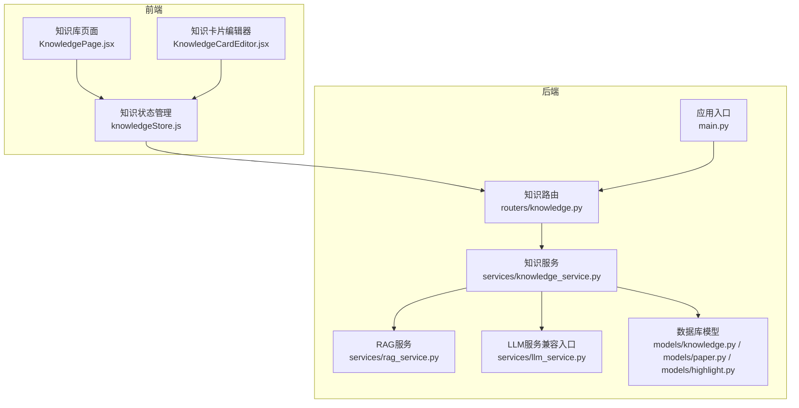
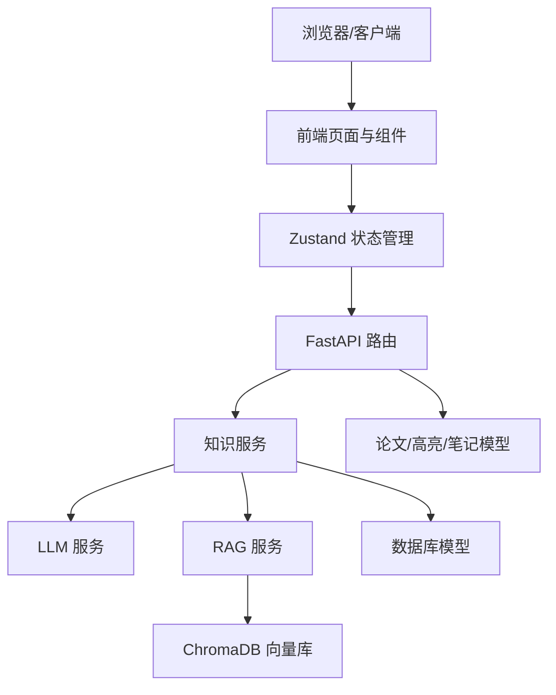
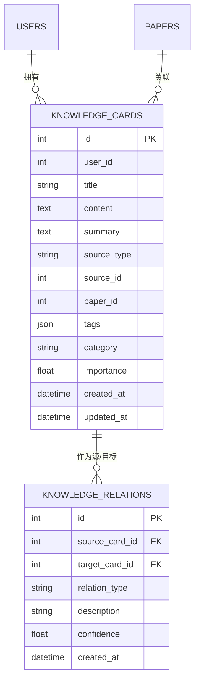
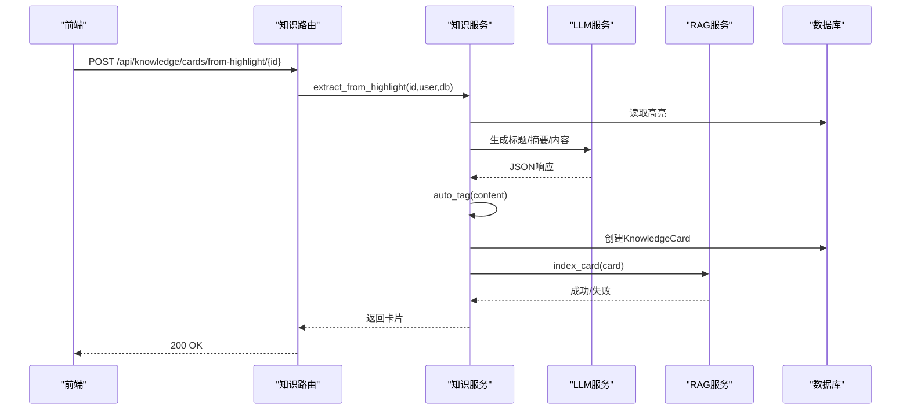
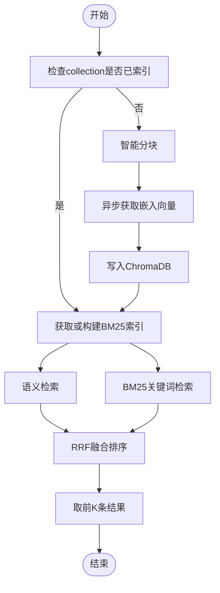
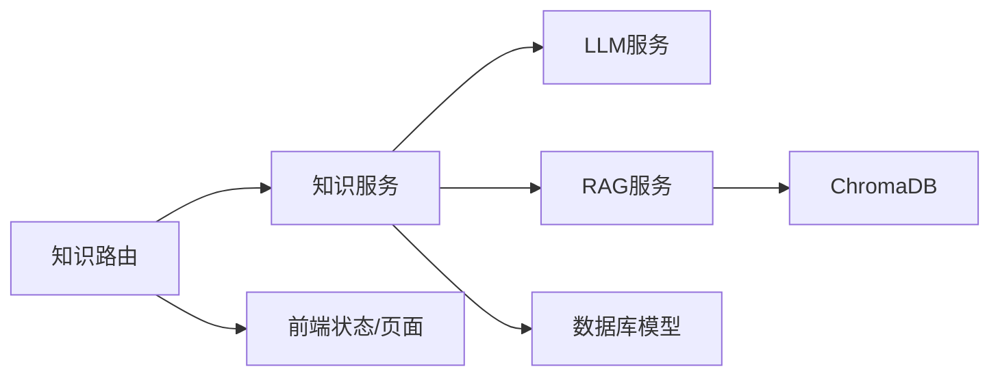

# 知识服务

<cite>
**本文引用的文件**
- [backend/app/models/knowledge.py](file://backend/app/models/knowledge.py)
- [backend/app/services/knowledge_service.py](file://backend/app/services/knowledge_service.py)
- [backend/app/routers/knowledge.py](file://backend/app/routers/knowledge.py)
- [backend/app/models/paper.py](file://backend/app/models/paper.py)
- [backend/app/models/highlight.py](file://backend/app/models/highlight.py)
- [backend/app/schemas/paper.py](file://backend/app/schemas/paper.py)
- [backend/app/services/rag_service.py](file://backend/app/services/rag_service.py)
- [backend/app/services/search_service.py](file://backend/app/services/search_service.py)
- [backend/app/main.py](file://backend/app/main.py)
- [frontend/src/pages/KnowledgePage.jsx](file://frontend/src/pages/KnowledgePage.jsx)
- [frontend/src/components/KnowledgeCardEditor/KnowledgeCardEditor.jsx](file://frontend/src/components/KnowledgeCardEditor/KnowledgeCardEditor.jsx)
- [frontend/src/stores/knowledgeStore.js](file://frontend/src/stores/knowledgeStore.js)
- [backend/app/handlers/analyze_handler.py](file://backend/app/handlers/analyze_handler.py)
- [backend/app/services/llm_service.py](file://backend/app/services/llm_service.py)
</cite>

## 目录
1. [简介](#简介)
2. [项目结构](#项目结构)
3. [核心组件](#核心组件)
4. [架构总览](#架构总览)
5. [详细组件分析](#详细组件分析)
6. [依赖分析](#依赖分析)
7. [性能考虑](#性能考虑)
8. [故障排查指南](#故障排查指南)
9. [结论](#结论)
10. [附录](#附录)

## 简介
本项目提供一套完整的“知识服务”能力，覆盖知识卡片的创建、标签分类、关联关系管理以及知识图谱构建；同时集成论文阅读辅助、高亮提取、问答提取、自动标签生成、向量检索与关键词检索融合、统计与可视化等模块。系统采用前后端分离架构，后端基于 FastAPI + SQLAlchemy + AsyncIO，前端使用 React + Zustand 状态管理，通过 LangChain 与 LLM 对话接口进行知识抽取与关系发现，使用 ChromaDB 进行向量检索。

## 项目结构
后端主要目录与职责：
- app/models：数据库模型定义（知识卡片、关系、论文、高亮等）
- app/services：业务服务（知识服务、RAG 服务、LLM 服务、搜索服务等）
- app/routers：API 路由（知识、论文、高亮、笔记、聊天、写作等）
- app/handlers：WebSocket 处理器（分析、跨文档等）
- app/main.py：应用入口与生命周期管理
- frontend：React 前端页面、组件与状态管理

图表来源
- [backend/app/main.py:16-53](file://backend/app/main.py#L16-L53)
- [backend/app/routers/knowledge.py:128-191](file://backend/app/routers/knowledge.py#L128-L191)
- [backend/app/services/knowledge_service.py:79-662](file://backend/app/services/knowledge_service.py#L79-L662)
- [backend/app/services/rag_service.py:16-415](file://backend/app/services/rag_service.py#L16-L415)
- [backend/app/models/knowledge.py:14-80](file://backend/app/models/knowledge.py#L14-L80)
- [backend/app/models/paper.py:11-85](file://backend/app/models/paper.py#L11-L85)
- [backend/app/models/highlight.py:10-37](file://backend/app/models/highlight.py#L10-L37)
- [frontend/src/pages/KnowledgePage.jsx:33-429](file://frontend/src/pages/KnowledgePage.jsx#L33-L429)
- [frontend/src/components/KnowledgeCardEditor/KnowledgeCardEditor.jsx:23-493](file://frontend/src/components/KnowledgeCardEditor/KnowledgeCardEditor.jsx#L23-L493)
- [frontend/src/stores/knowledgeStore.js:4-422](file://frontend/src/stores/knowledgeStore.js#L4-L422)

章节来源
- [backend/app/main.py:55-96](file://backend/app/main.py#L55-L96)
- [backend/app/routers/knowledge.py:19-127](file://backend/app/routers/knowledge.py#L19-L127)

## 核心组件
- 知识卡片与关系模型：定义知识卡片、关联关系的字段、索引与关系映射，支撑 CRUD、搜索、图谱渲染与统计。
- 知识服务：封装从高亮/问答提取知识卡片、自动生成标签、自动发现关联、向量索引、全局检索、图谱数据导出与统计。
- RAG 服务：论文级向量检索与 BM25 融合检索，支持智能分块、集合隔离、缓存与并发检索。
- 搜索服务：网络搜索（DuckDuckGo）缓存与超时控制，便于扩展外部知识源。
- 路由与控制器：提供知识卡片的增删改查、搜索、关联管理、图谱与统计接口。
- 前端页面与状态：知识库页面、卡片编辑器、Zustand 状态管理，统一调用后端 API。

章节来源
- [backend/app/models/knowledge.py:14-80](file://backend/app/models/knowledge.py#L14-L80)
- [backend/app/services/knowledge_service.py:79-662](file://backend/app/services/knowledge_service.py#L79-L662)
- [backend/app/services/rag_service.py:16-415](file://backend/app/services/rag_service.py#L16-L415)
- [backend/app/services/search_service.py:10-113](file://backend/app/services/search_service.py#L10-L113)
- [backend/app/routers/knowledge.py:128-550](file://backend/app/routers/knowledge.py#L128-L550)
- [frontend/src/pages/KnowledgePage.jsx:33-429](file://frontend/src/pages/KnowledgePage.jsx#L33-L429)
- [frontend/src/components/KnowledgeCardEditor/KnowledgeCardEditor.jsx:23-493](file://frontend/src/components/KnowledgeCardEditor/KnowledgeCardEditor.jsx#L23-L493)
- [frontend/src/stores/knowledgeStore.js:4-422](file://frontend/src/stores/knowledgeStore.js#L4-L422)

## 架构总览
系统采用“前端 React + 后端 FastAPI”的分层架构，后端以服务为中心，模型与路由解耦，知识服务聚合 LLM 与 RAG 能力，形成“知识抽取—索引—检索—管理—可视化”的闭环。

图表来源
- [backend/app/routers/knowledge.py:128-550](file://backend/app/routers/knowledge.py#L128-L550)
- [backend/app/services/knowledge_service.py:79-662](file://backend/app/services/knowledge_service.py#L79-L662)
- [backend/app/services/rag_service.py:16-415](file://backend/app/services/rag_service.py#L16-L415)
- [backend/app/models/knowledge.py:14-80](file://backend/app/models/knowledge.py#L14-L80)
- [backend/app/models/paper.py:11-85](file://backend/app/models/paper.py#L11-L85)
- [backend/app/models/highlight.py:10-37](file://backend/app/models/highlight.py#L10-L37)
- [frontend/src/stores/knowledgeStore.js:4-422](file://frontend/src/stores/knowledgeStore.js#L4-L422)

## 详细组件分析

### 知识卡片与关系模型
- 知识卡片（KnowledgeCard）：包含标题、内容、摘要、来源类型/ID、关联论文、标签、分类、重要性、时间戳及与用户、论文的关系。
- 知识关系（KnowledgeRelation）：双向关系，支持多种关系类型（相关、前置、扩展、支持、矛盾），并记录置信度与描述。

图表来源
- [backend/app/models/knowledge.py:14-80](file://backend/app/models/knowledge.py#L14-L80)
- [backend/app/models/paper.py:11-85](file://backend/app/models/paper.py#L11-L85)

章节来源
- [backend/app/models/knowledge.py:14-80](file://backend/app/models/knowledge.py#L14-L80)
- [backend/app/models/paper.py:11-85](file://backend/app/models/paper.py#L11-L85)
- [backend/app/models/highlight.py:10-37](file://backend/app/models/highlight.py#L10-L37)

### 知识服务：抽取、索引、检索与图谱
- 提取与创建
  - 从高亮提取：读取高亮文本，调用 LLM 生成标题/内容/摘要，自动打标签，创建卡片并索引。
  - 从问答提取：对对话内容做同样的抽取与索引。
- 自动标签：调用 LLM 生成 3–5 个专业标签，过滤编号并限制数量。
- 关联发现：选取目标卡片与其摘要，遍历用户其他卡片，构造提示词让 LLM 识别潜在关联，返回 JSON 列表并校验。
- 检索策略：向量检索（ChromaDB + 嵌入模型）+ 关键词检索（数据库 LIKE/JSON contains），合并去重并按分数排序。
- 图谱数据：导出节点（卡片）与边（关系）供前端可视化。
- 统计：总卡片数、分类分布、来源分布、标签云、关系总数。

图表来源
- [backend/app/routers/knowledge.py:311-343](file://backend/app/routers/knowledge.py#L311-L343)
- [backend/app/services/knowledge_service.py:82-162](file://backend/app/services/knowledge_service.py#L82-L162)
- [backend/app/services/knowledge_service.py:233-258](file://backend/app/services/knowledge_service.py#L233-L258)
- [backend/app/services/knowledge_service.py:466-510](file://backend/app/services/knowledge_service.py#L466-L510)

章节来源
- [backend/app/services/knowledge_service.py:82-231](file://backend/app/services/knowledge_service.py#L82-L231)
- [backend/app/services/knowledge_service.py:233-348](file://backend/app/services/knowledge_service.py#L233-L348)
- [backend/app/services/knowledge_service.py:350-464](file://backend/app/services/knowledge_service.py#L350-L464)
- [backend/app/services/knowledge_service.py:526-592](file://backend/app/services/knowledge_service.py#L526-L592)
- [backend/app/services/knowledge_service.py:594-657](file://backend/app/services/knowledge_service.py#L594-L657)

### RAG 服务：论文级向量检索与混合检索
- 集合隔离：每篇论文独立 collection，避免跨文档干扰。
- 智能分块：按自然边界切分文本，保留页码信息，相邻块重叠提升召回。
- 混合检索：语义检索（Cosine 距离）+ BM25 关键词检索，使用 RRF 融合排序。
- 缓存与并发：BM25 索引缓存、线程池异步嵌入、并发检索与重建。
- 配置更新：运行时可调整 top_k、分块大小与重叠。

图表来源
- [backend/app/services/rag_service.py:186-310](file://backend/app/services/rag_service.py#L186-L310)
- [backend/app/services/rag_service.py:105-164](file://backend/app/services/rag_service.py#L105-L164)
- [backend/app/services/rag_service.py:236-309](file://backend/app/services/rag_service.py#L236-L309)

章节来源
- [backend/app/services/rag_service.py:16-415](file://backend/app/services/rag_service.py#L16-L415)

### 搜索服务：网络搜索与缓存
- 使用 DuckDuckGo 进行网络搜索，支持地区与时限过滤。
- 结果缓存与超时控制，避免频繁请求与阻塞。
- 提供运行时配置更新与缓存清理。

章节来源
- [backend/app/services/search_service.py:10-113](file://backend/app/services/search_service.py#L10-L113)

### 路由与控制器：知识卡片与关联管理
- 列表/分页/筛选/搜索：支持按分类、来源类型、标签与关键词筛选。
- 创建/更新/删除：权限校验与索引维护。
- 关联管理：查询、创建、删除；自动发现关联。
- 图谱与统计：导出节点与边，返回统计指标。

章节来源
- [backend/app/routers/knowledge.py:128-550](file://backend/app/routers/knowledge.py#L128-L550)

### 前端：知识库页面与编辑器
- 知识库页面：网格/列表视图、搜索与筛选、分页、统计侧栏、来源类型映射。
- 编辑器：标题/内容/摘要/标签/分类/来源/重要性、AI 自动生成标签、发现关联、添加/删除关联。
- 状态管理：Zustand 统一管理卡片列表、搜索结果、图谱数据、统计、错误与加载状态。

章节来源
- [frontend/src/pages/KnowledgePage.jsx:33-429](file://frontend/src/pages/KnowledgePage.jsx#L33-L429)
- [frontend/src/components/KnowledgeCardEditor/KnowledgeCardEditor.jsx:23-493](file://frontend/src/components/KnowledgeCardEditor/KnowledgeCardEditor.jsx#L23-L493)
- [frontend/src/stores/knowledgeStore.js:4-422](file://frontend/src/stores/knowledgeStore.js#L4-L422)

### 论文分析与关键词提取（WebSocket）
- 异步处理论文章节与深度分析，流式返回结果并通过 WebSocket 推送。
- 分析完成后异步触发关键词提取任务，避免阻塞主流程。
- 支持取消与错误处理。

章节来源
- [backend/app/handlers/analyze_handler.py:13-87](file://backend/app/handlers/analyze_handler.py#L13-L87)

## 依赖分析
- 组件内聚与耦合
  - 知识服务对 LLM 与 RAG 服务存在强依赖，但通过服务层抽象降低耦合。
  - 路由层仅负责参数校验与权限控制，业务逻辑集中在服务层。
- 外部依赖
  - ChromaDB：向量检索与持久化。
  - LangChain/SentenceTransformer：嵌入模型与消息协议。
  - DuckDuckGo：网络搜索。
- 循环依赖
  - 当前结构未见循环导入；模型、服务、路由分层清晰。

图表来源
- [backend/app/routers/knowledge.py:128-550](file://backend/app/routers/knowledge.py#L128-L550)
- [backend/app/services/knowledge_service.py:79-662](file://backend/app/services/knowledge_service.py#L79-L662)
- [backend/app/services/rag_service.py:16-415](file://backend/app/services/rag_service.py#L16-L415)
- [backend/app/models/knowledge.py:14-80](file://backend/app/models/knowledge.py#L14-L80)
- [frontend/src/stores/knowledgeStore.js:4-422](file://frontend/src/stores/knowledgeStore.js#L4-L422)

## 性能考虑
- 向量检索
  - 使用 cosine 距离与线程池异步编码，减少主线程阻塞。
  - ChromaDB 持久化与集合隔离，避免跨文档干扰。
- 混合检索
  - RRF 融合语义与关键词，兼顾召回与精度。
  - BM25 索引缓存避免重复构建。
- 搜索与索引
  - 知识服务在创建/更新/删除卡片时维护向量索引，确保检索一致性。
  - 智能分块与重叠提升跨块语义连贯性。
- 前端体验
  - 搜索防抖、分页与筛选，降低后端压力。
  - 状态集中管理，避免重复请求。

[本节为通用性能建议，无需特定文件引用]

## 故障排查指南
- 知识提取失败
  - 检查高亮是否存在且属于当前用户；确认 LLM 服务可用；查看日志输出。
  - 参考路径：[extract_from_highlight:82-162](file://backend/app/services/knowledge_service.py#L82-L162)
- 自动标签/关联发现异常
  - 检查 LLM 返回格式与 JSON 解析；必要时降级为简单生成策略。
  - 参考路径：[auto_tag:233-258](file://backend/app/services/knowledge_service.py#L233-L258)、[find_relations:259-348](file://backend/app/services/knowledge_service.py#L259-L348)
- 检索无结果
  - 确认卡片已索引；检查集合是否存在；核对查询文本长度与分词。
  - 参考路径：[search:350-464](file://backend/app/services/knowledge_service.py#L350-L464)、[index_card:466-510](file://backend/app/services/knowledge_service.py#L466-L510)
- RAG 索引问题
  - 查看集合计数与分块是否为空；必要时重建索引。
  - 参考路径：[index_paper:186-235](file://backend/app/services/rag_service.py#L186-L235)、[reindex_paper:358-373](file://backend/app/services/rag_service.py#L358-L373)
- 前端交互异常
  - 检查状态 store 的错误字段与 loading 状态；确认路由参数与权限。
  - 参考路径：[knowledgeStore:4-422](file://frontend/src/stores/knowledgeStore.js#L4-L422)

章节来源
- [backend/app/services/knowledge_service.py:82-162](file://backend/app/services/knowledge_service.py#L82-L162)
- [backend/app/services/knowledge_service.py:233-348](file://backend/app/services/knowledge_service.py#L233-L348)
- [backend/app/services/knowledge_service.py:350-464](file://backend/app/services/knowledge_service.py#L350-L464)
- [backend/app/services/rag_service.py:186-235](file://backend/app/services/rag_service.py#L186-L235)
- [backend/app/services/rag_service.py:358-373](file://backend/app/services/rag_service.py#L358-L373)
- [frontend/src/stores/knowledgeStore.js:4-422](file://frontend/src/stores/knowledgeStore.js#L4-L422)

## 结论
该知识服务以“知识卡片 + 关联关系 + 知识图谱”为核心，结合 LLM 的知识抽取与 RAG 的向量检索，实现了从论文高亮/问答到知识卡片的自动化生产与管理。系统通过清晰的分层设计、完善的权限与索引维护、以及前端友好的交互界面，提供了高效、可扩展的知识管理能力。后续可在以下方向持续优化：引入更丰富的实体识别与关系抽取算法、增强版本控制与一致性策略、扩展外部知识源与跨文档检索。

[本节为总结性内容，无需特定文件引用]

## 附录

### API 定义（节选）
- 获取知识卡片列表
  - 方法：GET
  - 路径：/api/knowledge/cards
  - 查询参数：page、page_size、search、category、source_type、tag
  - 返回：分页卡片列表与总数
  - 参考路径：[路由定义:130-191](file://backend/app/routers/knowledge.py#L130-L191)
- 创建知识卡片
  - 方法：POST
  - 路径：/api/knowledge/cards
  - 请求体：标题、内容、摘要、来源类型/ID、关联论文、标签、分类、重要性
  - 返回：创建的卡片
  - 参考路径：[路由定义:194-222](file://backend/app/routers/knowledge.py#L194-L222)
- 从高亮创建卡片
  - 方法：POST
  - 路径：/api/knowledge/cards/from-highlight/{highlight_id}
  - 返回：创建的卡片
  - 参考路径：[路由定义:311-343](file://backend/app/routers/knowledge.py#L311-L343)
- 全局搜索
  - 方法：GET
  - 路径：/api/knowledge/search
  - 查询参数：query、top_k
  - 返回：检索结果列表
  - 参考路径：[路由定义:345-356](file://backend/app/routers/knowledge.py#L345-L356)
- 获取知识图谱数据
  - 方法：GET
  - 路径：/api/knowledge/graph
  - 返回：nodes、edges
  - 参考路径：[路由定义:499-506](file://backend/app/routers/knowledge.py#L499-L506)
- 获取统计信息
  - 方法：GET
  - 路径：/api/knowledge/stats
  - 返回：总卡片数、关系数、分类分布、来源分布、标签云
  - 参考路径：[路由定义:509-516](file://backend/app/routers/knowledge.py#L509-L516)

章节来源
- [backend/app/routers/knowledge.py:130-550](file://backend/app/routers/knowledge.py#L130-L550)