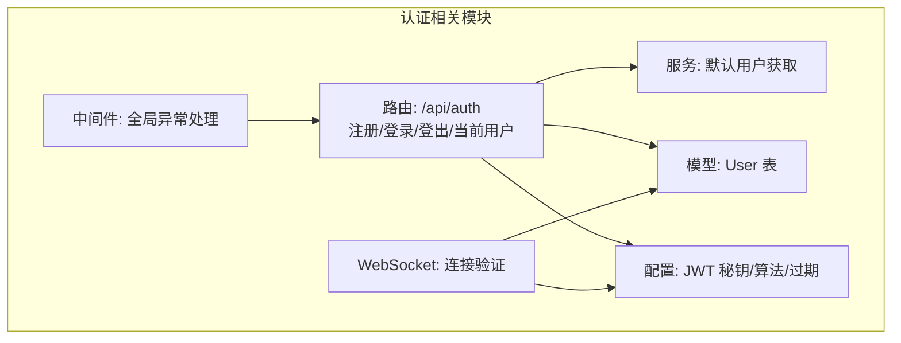
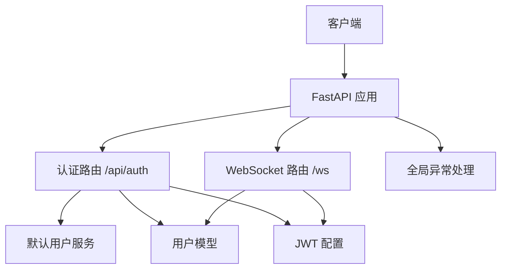
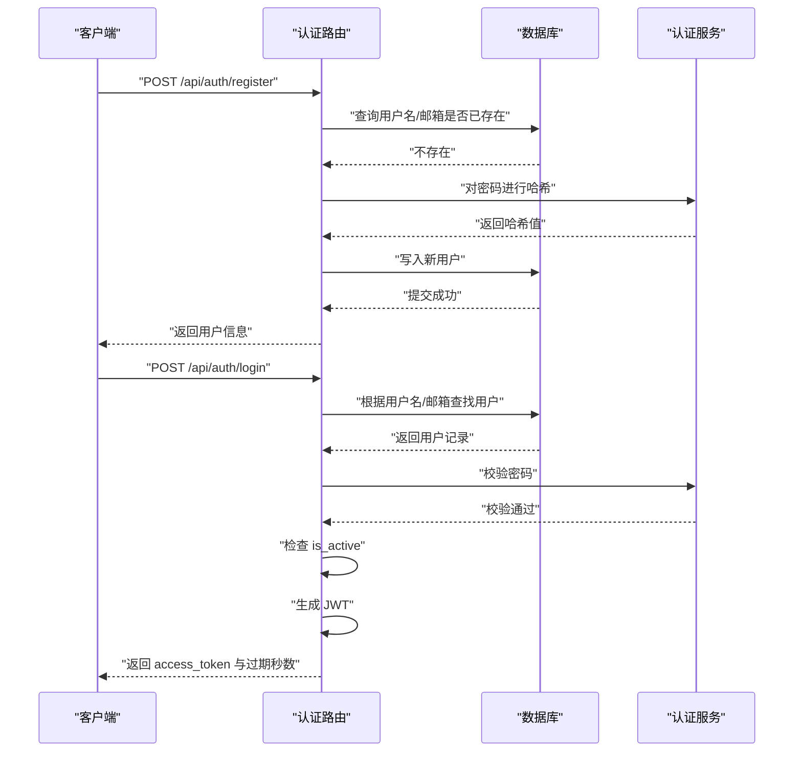
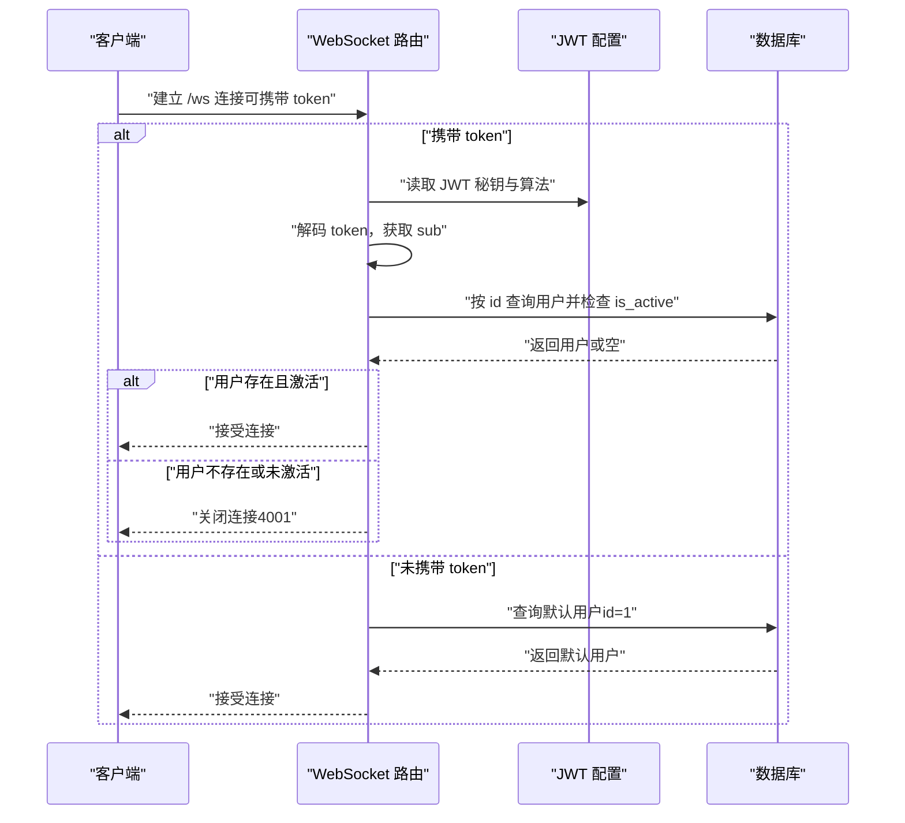
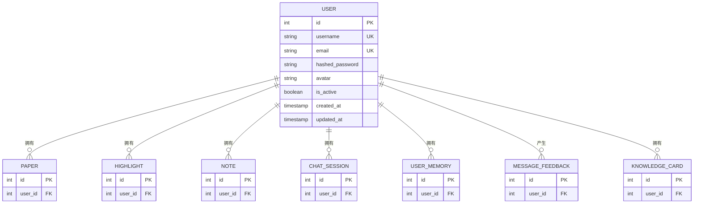
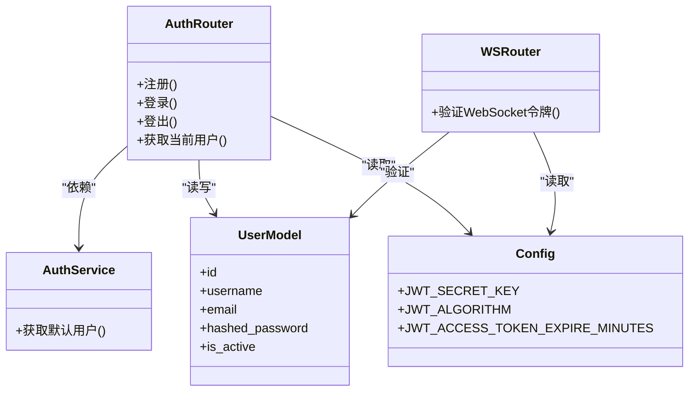
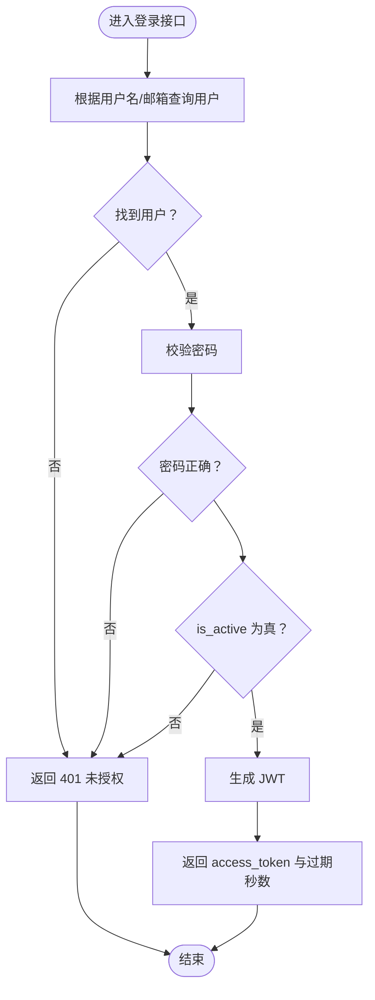
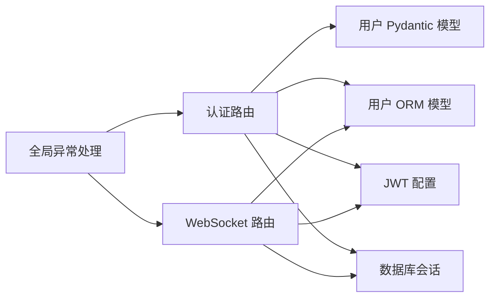

# 认证服务

<cite>
**本文引用的文件**
- [backend/app/routers/auth.py](file://backend/app/routers/auth.py)
- [backend/app/schemas/user.py](file://backend/app/schemas/user.py)
- [backend/app/models/user.py](file://backend/app/models/user.py)
- [backend/app/services/auth_service.py](file://backend/app/services/auth_service.py)
- [backend/app/routers/ws.py](file://backend/app/routers/ws.py)
- [backend/app/config.py](file://backend/app/config.py)
- [backend/app/database.py](file://backend/app/database.py)
- [backend/app/middleware/error_handler.py](file://backend/app/middleware/error_handler.py)
- [backend/app/main.py](file://backend/app/main.py)
</cite>

## 目录
1. [简介](#简介)
2. [项目结构](#项目结构)
3. [核心组件](#核心组件)
4. [架构总览](#架构总览)
5. [详细组件分析](#详细组件分析)
6. [依赖分析](#依赖分析)
7. [性能考虑](#性能考虑)
8. [故障排查指南](#故障排查指南)
9. [结论](#结论)
10. [附录](#附录)

## 简介
本文件面向认证服务的技术实现，围绕用户认证与授权体系展开，重点覆盖以下方面：
- JWT 令牌管理：令牌签发、解码与校验
- 密码加密与会话控制：密码哈希、令牌过期与登出策略
- 用户注册与登录流程：输入校验、账户状态检查、令牌下发
- 权限验证与角色管理：当前实现以“默认用户”为主，后续可扩展角色/权限模型
- 第三方登录、双因素认证与安全审计：当前仓库未实现，建议基于现有 JWT 与中间件扩展
- 防暴力破解与会话超时：当前未实现，建议结合速率限制与令牌刷新策略

## 项目结构
认证相关代码主要分布在以下模块：
- 路由层：用户注册、登录、登出、获取当前用户信息
- 服务层：默认用户获取（个人使用模式）
- 数据模型：用户表结构与关系
- 配置：JWT 秘钥、算法与过期时间
- 中间件：全局异常处理
- WebSocket：基于 JWT 的连接验证与降级策略

**图表来源**
- [backend/app/routers/auth.py:1-186](file://backend/app/routers/auth.py#L1-L186)
- [backend/app/services/auth_service.py:1-40](file://backend/app/services/auth_service.py#L1-L40)
- [backend/app/models/user.py:1-36](file://backend/app/models/user.py#L1-L36)
- [backend/app/config.py:1-44](file://backend/app/config.py#L1-L44)
- [backend/app/routers/ws.py:1-436](file://backend/app/routers/ws.py#L1-L436)
- [backend/app/middleware/error_handler.py:1-92](file://backend/app/middleware/error_handler.py#L1-L92)

**章节来源**
- [backend/app/routers/auth.py:1-186](file://backend/app/routers/auth.py#L1-L186)
- [backend/app/services/auth_service.py:1-40](file://backend/app/services/auth_service.py#L1-L40)
- [backend/app/models/user.py:1-36](file://backend/app/models/user.py#L1-L36)
- [backend/app/config.py:1-44](file://backend/app/config.py#L1-L44)
- [backend/app/routers/ws.py:1-436](file://backend/app/routers/ws.py#L1-L436)
- [backend/app/middleware/error_handler.py:1-92](file://backend/app/middleware/error_handler.py#L1-L92)

## 核心组件
- 认证路由（/api/auth）
  - 注册：用户名唯一性与邮箱唯一性校验，密码哈希后入库
  - 登录：支持用户名或邮箱登录，校验密码与账户状态，签发 JWT
  - 登出：提示客户端删除令牌（JWT 无状态），如需黑名单需额外存储
  - 获取当前用户：依赖当前用户依赖注入
- 默认用户服务
  - 个人使用模式下自动创建默认用户（id=1），避免强制登录
- 数据模型
  - 用户表包含 id、username、email、hashed_password、avatar、is_active、时间戳等字段
- 配置
  - JWT_SECRET_KEY、JWT_ALGORITHM、JWT_ACCESS_TOKEN_EXPIRE_MINUTES
- WebSocket
  - 支持携带 JWT 进行认证；未携带时降级为默认用户
- 全局异常处理
  - 统一处理 Pydantic 校验、HTTP、SQLAlchemy 与通用异常

**章节来源**
- [backend/app/routers/auth.py:27-186](file://backend/app/routers/auth.py#L27-L186)
- [backend/app/services/auth_service.py:13-40](file://backend/app/services/auth_service.py#L13-L40)
- [backend/app/models/user.py:11-36](file://backend/app/models/user.py#L11-L36)
- [backend/app/config.py:28-31](file://backend/app/config.py#L28-L31)
- [backend/app/routers/ws.py:32-54](file://backend/app/routers/ws.py#L32-L54)
- [backend/app/middleware/error_handler.py:11-92](file://backend/app/middleware/error_handler.py#L11-L92)

## 架构总览
认证服务采用“路由-服务-模型-配置-中间件”的分层设计，配合 WebSocket 在连接建立阶段进行令牌验证。

**图表来源**
- [backend/app/main.py:55-95](file://backend/app/main.py#L55-L95)
- [backend/app/routers/auth.py:18-186](file://backend/app/routers/auth.py#L18-L186)
- [backend/app/routers/ws.py:76-107](file://backend/app/routers/ws.py#L76-L107)
- [backend/app/services/auth_service.py:13-40](file://backend/app/services/auth_service.py#L13-L40)
- [backend/app/models/user.py:11-36](file://backend/app/models/user.py#L11-L36)
- [backend/app/config.py:28-31](file://backend/app/config.py#L28-L31)
- [backend/app/middleware/error_handler.py:73-92](file://backend/app/middleware/error_handler.py#L73-L92)

## 详细组件分析

### 认证路由与流程
- 注册流程
  - 输入校验：用户名长度、邮箱格式
  - 唯一性检查：用户名与邮箱均需唯一
  - 密码哈希：使用服务层提供的哈希函数
  - 写入数据库并返回用户信息
- 登录流程
  - 支持用户名或邮箱登录
  - 校验密码与账户状态（is_active）
  - 生成 JWT 并返回 access_token 与过期秒数
- 登出流程
  - JWT 为无状态，登出即客户端删除令牌；如需服务端拦截可在后续扩展黑名单
- 获取当前用户
  - 通过依赖注入获取当前用户（默认用户或 JWT 解析）

**图表来源**
- [backend/app/routers/auth.py:27-118](file://backend/app/routers/auth.py#L27-L118)
- [backend/app/services/auth_service.py:13-40](file://backend/app/services/auth_service.py#L13-L40)
- [backend/app/models/user.py:11-36](file://backend/app/models/user.py#L11-L36)

**章节来源**
- [backend/app/routers/auth.py:27-118](file://backend/app/routers/auth.py#L27-L118)

### WebSocket 认证与降级
- 令牌验证
  - 若携带 token，则使用配置中的秘钥与算法进行解码，解析 sub 得到用户 id，并查询用户是否存在且处于激活状态
- 未携带 token
  - 降级为默认用户（个人使用模式）
- 连接失败
  - 未通过验证时，服务端主动关闭连接（4001）

**图表来源**
- [backend/app/routers/ws.py:32-107](file://backend/app/routers/ws.py#L32-L107)
- [backend/app/config.py:28-31](file://backend/app/config.py#L28-L31)
- [backend/app/models/user.py:11-36](file://backend/app/models/user.py#L11-L36)

**章节来源**
- [backend/app/routers/ws.py:32-107](file://backend/app/routers/ws.py#L32-L107)

### 数据模型与关系
用户模型包含认证所需的核心字段，并定义了与论文、高亮、笔记、会话、记忆、反馈、知识卡片等实体的关系。

**图表来源**
- [backend/app/models/user.py:11-36](file://backend/app/models/user.py#L11-L36)

**章节来源**
- [backend/app/models/user.py:11-36](file://backend/app/models/user.py#L11-L36)

### 类与依赖关系
- 认证路由依赖服务层获取当前用户、依赖数据库会话、依赖配置中的 JWT 设置
- WebSocket 路由依赖配置中的 JWT 设置与用户模型进行验证
- 默认用户服务依赖数据库会话与用户模型

**图表来源**
- [backend/app/routers/auth.py:18-186](file://backend/app/routers/auth.py#L18-L186)
- [backend/app/services/auth_service.py:13-40](file://backend/app/services/auth_service.py#L13-L40)
- [backend/app/models/user.py:11-36](file://backend/app/models/user.py#L11-L36)
- [backend/app/config.py:28-31](file://backend/app/config.py#L28-L31)
- [backend/app/routers/ws.py:32-54](file://backend/app/routers/ws.py#L32-L54)

**章节来源**
- [backend/app/routers/auth.py:18-186](file://backend/app/routers/auth.py#L18-L186)
- [backend/app/services/auth_service.py:13-40](file://backend/app/services/auth_service.py#L13-L40)
- [backend/app/models/user.py:11-36](file://backend/app/models/user.py#L11-L36)
- [backend/app/config.py:28-31](file://backend/app/config.py#L28-L31)
- [backend/app/routers/ws.py:32-54](file://backend/app/routers/ws.py#L32-L54)

### 复杂逻辑流程（登录校验）

**图表来源**
- [backend/app/routers/auth.py:71-118](file://backend/app/routers/auth.py#L71-L118)

**章节来源**
- [backend/app/routers/auth.py:71-118](file://backend/app/routers/auth.py#L71-L118)

## 依赖分析
- 组件耦合
  - 认证路由与服务层、模型层、配置层松耦合，通过依赖注入与 Pydantic 模型解耦
  - WebSocket 路由与配置层、模型层耦合，用于连接验证
- 外部依赖
  - JWT 解码依赖 jose/jwt
  - 数据库依赖 SQLAlchemy 异步引擎与会话工厂
  - 异常处理依赖 FastAPI 内置异常类型
- 潜在循环依赖
  - 当前未发现循环依赖；若引入角色/权限模型，需避免路由与服务之间的双向依赖

**图表来源**
- [backend/app/routers/auth.py:14-16](file://backend/app/routers/auth.py#L14-L16)
- [backend/app/routers/ws.py:12-21](file://backend/app/routers/ws.py#L12-L21)
- [backend/app/middleware/error_handler.py:73-92](file://backend/app/middleware/error_handler.py#L73-L92)
- [backend/app/config.py:28-31](file://backend/app/config.py#L28-L31)
- [backend/app/database.py:30-48](file://backend/app/database.py#L30-L48)

**章节来源**
- [backend/app/routers/auth.py:14-16](file://backend/app/routers/auth.py#L14-L16)
- [backend/app/routers/ws.py:12-21](file://backend/app/routers/ws.py#L12-L21)
- [backend/app/middleware/error_handler.py:73-92](file://backend/app/middleware/error_handler.py#L73-L92)
- [backend/app/config.py:28-31](file://backend/app/config.py#L28-L31)
- [backend/app/database.py:30-48](file://backend/app/database.py#L30-L48)

## 性能考虑
- 密码哈希与 JWT 生成
  - 建议使用成熟的哈希库与安全算法，避免在热路径上重复计算
- 数据库查询
  - 用户名与邮箱字段具备唯一索引，查询效率较高；注意批量操作时的事务与回滚
- WebSocket 并发
  - 运行中任务字典用于取消与清理，避免资源泄漏；建议限制并发任务数量
- 缓存与预热
  - 默认用户在启动时确保存在，减少首次访问的冷启动开销

[本节为通用指导，无需列出具体文件来源]

## 故障排查指南
- 登录失败（401）
  - 检查用户名/邮箱是否存在、密码是否正确、账户是否激活
  - 确认 JWT 配置中的算法与密钥一致
- 注册失败（400）
  - 检查用户名与邮箱是否唯一
  - 确认请求体字段符合 Pydantic 校验规则
- WebSocket 连接失败（4001）
  - 确认 token 是否有效、是否过期、用户是否激活
  - 未携带 token 时为预期的降级行为
- 全局异常
  - Pydantic 校验错误、HTTP 异常、数据库异常与通用异常均有统一处理，便于定位问题

**章节来源**
- [backend/app/routers/auth.py:94-107](file://backend/app/routers/auth.py#L94-L107)
- [backend/app/routers/ws.py:103-107](file://backend/app/routers/ws.py#L103-L107)
- [backend/app/middleware/error_handler.py:11-92](file://backend/app/middleware/error_handler.py#L11-L92)

## 结论
本认证服务以 JWT 为核心，结合默认用户机制与严格的输入校验，实现了简洁可靠的用户认证与授权基础能力。当前版本未包含第三方登录、双因素认证与安全审计日志，建议在现有 JWT 与中间件基础上扩展。同时，建议补充防暴力破解与会话超时策略，以进一步提升安全性与可用性。

[本节为总结性内容，无需列出具体文件来源]

## 附录

### JWT 配置项
- JWT_SECRET_KEY：用于签名与验证 JWT 的密钥
- JWT_ALGORITHM：JWT 签名算法
- JWT_ACCESS_TOKEN_EXPIRE_MINUTES：访问令牌过期时间（分钟）

**章节来源**
- [backend/app/config.py:28-31](file://backend/app/config.py#L28-L31)

### 用户模型字段说明
- id：主键
- username：唯一索引，长度限制
- email：唯一索引，邮箱格式
- hashed_password：存储密码哈希
- avatar：头像地址
- is_active：账户启用状态
- created_at/updated_at：时间戳

**章节来源**
- [backend/app/models/user.py:16-23](file://backend/app/models/user.py#L16-L23)

### 默认用户与个人使用模式
- 应用启动时确保默认用户（id=1）存在，未登录场景自动降级为该用户
- 适合个人使用或演示场景，便于快速体验

**章节来源**
- [backend/app/services/auth_service.py:13-40](file://backend/app/services/auth_service.py#L13-L40)
- [backend/app/database.py:58-72](file://backend/app/database.py#L58-L72)