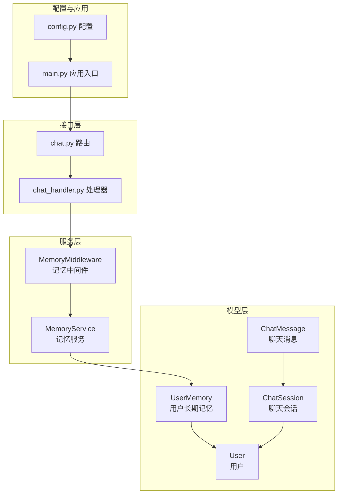
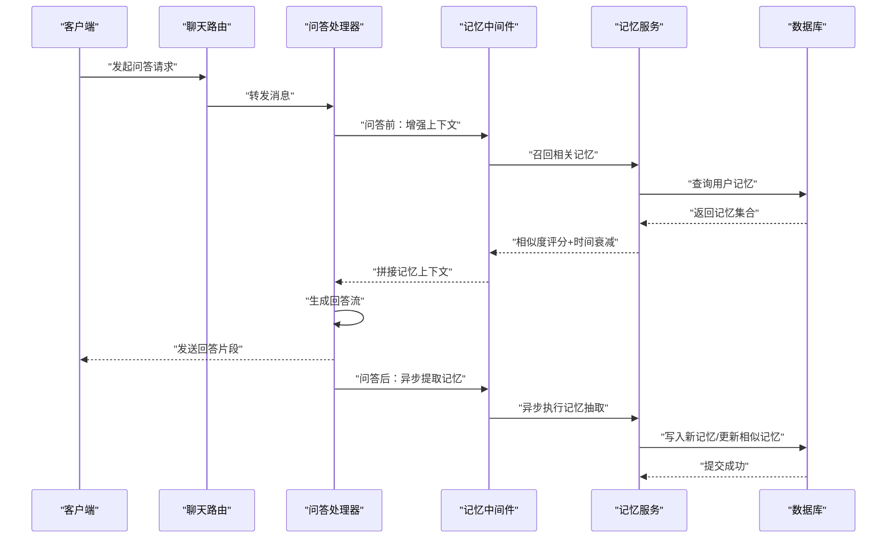
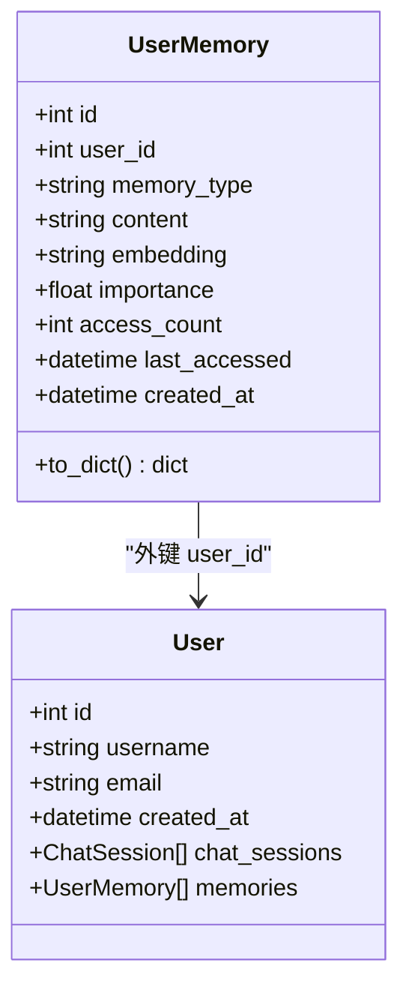
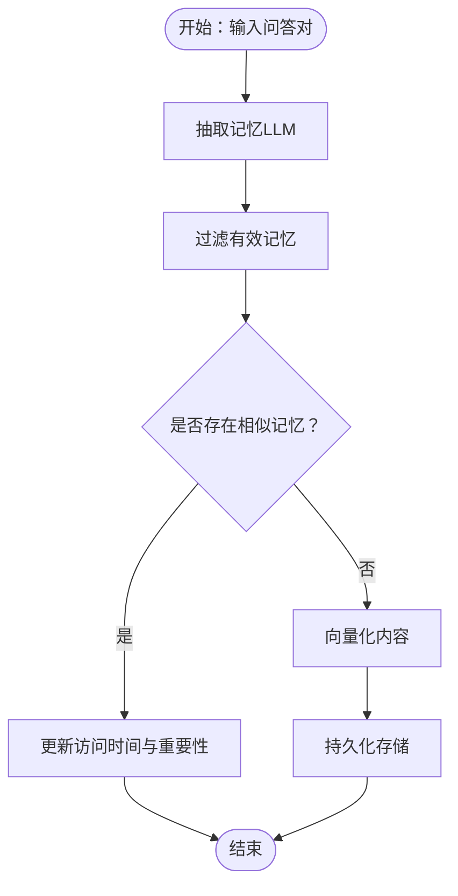
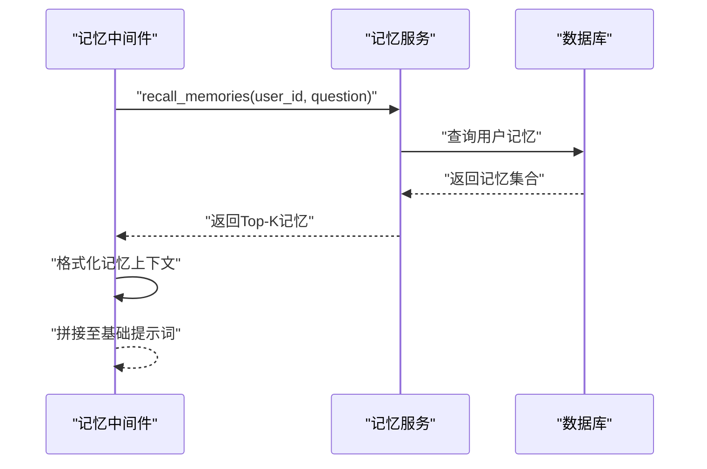
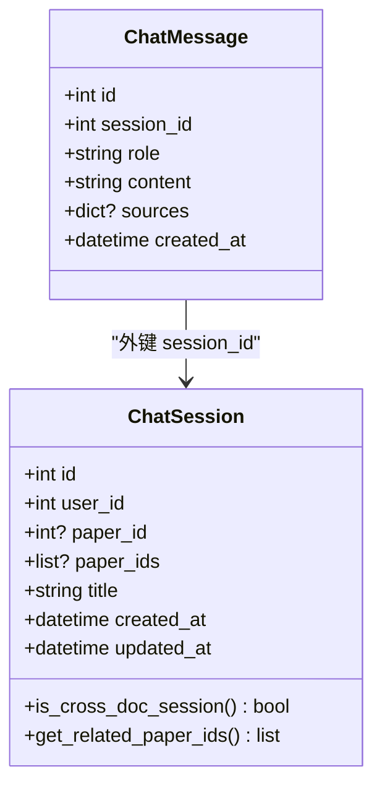
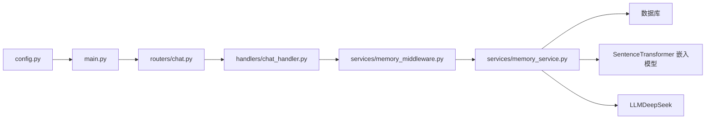

# 记忆服务

<cite>
**本文引用的文件**
- [memory.py](file://backend/app/models/memory.py)
- [memory_service.py](file://backend/app/services/memory_service.py)
- [memory_middleware.py](file://backend/app/services/memory_middleware.py)
- [chat.py](file://backend/app/models/chat.py)
- [chat_handler.py](file://backend/app/handlers/chat_handler.py)
- [chat.py（路由）](file://backend/app/routers/chat.py)
- [user.py](file://backend/app/models/user.py)
- [config.py](file://backend/app/config.py)
- [main.py](file://backend/app/main.py)
</cite>

## 目录
1. [简介](#简介)
2. [项目结构](#项目结构)
3. [核心组件](#核心组件)
4. [架构总览](#架构总览)
5. [详细组件分析](#详细组件分析)
6. [依赖分析](#依赖分析)
7. [性能考量](#性能考量)
8. [故障排查指南](#故障排查指南)
9. [结论](#结论)
10. [附录](#附录)

## 简介
本文件面向“记忆服务”的技术文档，聚焦于上下文记忆与对话历史管理的实现机制，涵盖短期记忆、长期记忆与工作记忆的区分与协同；深入解释记忆的存储结构、相似度去重策略、时间衰减与清理机制；提供对话上下文增强、关键信息抽取与记忆检索优化的实践路径；并说明序列化存储、增量更新与并发访问控制的设计要点。本文同时给出与实际源码映射的架构图与流程图，帮助读者快速定位实现位置与扩展点。

## 项目结构
围绕记忆服务的关键模块分布如下：
- 模型层：用户长期记忆模型与聊天会话/消息模型
- 服务层：记忆服务（抽取、存储、召回、画像、衰减、删除）、记忆中间件（上下文增强、异步记忆提取）
- 路由与处理器：会话管理与问答处理
- 配置与应用：运行时配置与生命周期

图表来源
- [memory.py:14-54](file://backend/app/models/memory.py#L14-L54)
- [chat.py:14-71](file://backend/app/models/chat.py#L14-L71)
- [user.py:11-36](file://backend/app/models/user.py#L11-L36)
- [memory_service.py:46-438](file://backend/app/services/memory_service.py#L46-L438)
- [memory_middleware.py:13-131](file://backend/app/services/memory_middleware.py#L13-L131)
- [chat.py（路由）:1-295](file://backend/app/routers/chat.py#L1-L295)
- [chat_handler.py:11-32](file://backend/app/handlers/chat_handler.py#L11-L32)
- [config.py:15-44](file://backend/app/config.py#L15-L44)
- [main.py:55-114](file://backend/app/main.py#L55-L114)

章节来源
- [memory.py:14-54](file://backend/app/models/memory.py#L14-L54)
- [memory_service.py:46-438](file://backend/app/services/memory_service.py#L46-L438)
- [memory_middleware.py:13-131](file://backend/app/services/memory_middleware.py#L13-L131)
- [chat.py:14-71](file://backend/app/models/chat.py#L14-L71)
- [chat.py（路由）:1-295](file://backend/app/routers/chat.py#L1-L295)
- [chat_handler.py:11-32](file://backend/app/handlers/chat_handler.py#L11-L32)
- [config.py:15-44](file://backend/app/config.py#L15-L44)
- [main.py:55-114](file://backend/app/main.py#L55-L114)

## 核心组件
- 用户长期记忆模型：持久化存储用户偏好、研究方向、术语理解、背景信息等，支持向量化与相似度检索。
- 记忆服务：负责记忆抽取（基于 LLM）、去重（向量相似度阈值）、存储、召回（向量相似度+重要性+时间衰减）、画像聚合、衰减与删除。
- 记忆中间件：在问答前召回相关记忆并注入提示词，在问答后异步提取新记忆，增强上下文感知能力。
- 聊天会话与消息模型：承载短期记忆（会话历史），与长期记忆互补。
- 应用配置与生命周期：统一管理运行参数与数据库初始化。

章节来源
- [memory.py:14-54](file://backend/app/models/memory.py#L14-L54)
- [memory_service.py:46-438](file://backend/app/services/memory_service.py#L46-L438)
- [memory_middleware.py:13-131](file://backend/app/services/memory_middleware.py#L13-L131)
- [chat.py:14-71](file://backend/app/models/chat.py#L14-L71)
- [config.py:15-44](file://backend/app/config.py#L15-L44)
- [main.py:55-114](file://backend/app/main.py#L55-L114)

## 架构总览
记忆服务贯穿“抽取—存储—召回—增强—清理”的闭环，与聊天会话管理协同，形成短期记忆（会话消息）与长期记忆（UserMemory）的双轨体系。

图表来源
- [memory_middleware.py:13-131](file://backend/app/services/memory_middleware.py#L13-L131)
- [memory_service.py:83-155](file://backend/app/services/memory_service.py#L83-L155)
- [memory_service.py:226-301](file://backend/app/services/memory_service.py#L226-L301)
- [chat_handler.py:11-32](file://backend/app/handlers/chat_handler.py#L11-L32)

## 详细组件分析

### 用户长期记忆模型（UserMemory）
- 字段设计：包含用户标识、记忆类型（偏好/研究方向/术语理解/背景）、内容、向量嵌入、重要性权重、访问计数与时间戳。
- 关系映射：与用户模型建立一对多关系，随用户删除级联清理。
- 序列化：提供字典化导出，便于 API 返回与前端渲染。

图表来源
- [user.py:11-36](file://backend/app/models/user.py#L11-L36)
- [memory.py:14-54](file://backend/app/models/memory.py#L14-L54)

章节来源
- [memory.py:14-54](file://backend/app/models/memory.py#L14-L54)
- [user.py:11-36](file://backend/app/models/user.py#L11-L36)

### 记忆服务（MemoryService）
- 抽取：基于 LLM 的提示词模板，从问答对中抽取可长期保存的记忆，过滤无效内容并异步存储。
- 存储：避免重复（向量相似度阈值），新记忆进行向量化并持久化。
- 召回：对查询进行向量化，计算与已有记忆的余弦相似度，综合重要性与指数时间衰减因子排序，更新访问统计。
- 画像：聚合用户各类记忆，形成画像结构，便于上层策略使用。
- 衰减：对长时间未访问的记忆降低重要性权重，防止过时信息主导。
- 删除：按条件删除指定记忆。
- 并发与性能：懒加载嵌入模型、线程池执行向量化、锁保护模型初始化、异步 I/O 与事务提交。

图表来源
- [memory_service.py:83-155](file://backend/app/services/memory_service.py#L83-L155)
- [memory_service.py:156-225](file://backend/app/services/memory_service.py#L156-L225)

章节来源
- [memory_service.py:46-438](file://backend/app/services/memory_service.py#L46-L438)

### 记忆中间件（MemoryMiddleware）
- 上下文增强：在问答前召回相关记忆，格式化为上下文字符串并注入基础提示词。
- 异步提取：问答完成后在独立任务中提取新记忆，避免阻塞响应。
- 提示词构建：将记忆上下文与系统提示词合并，提升回答一致性与个性化。

图表来源
- [memory_middleware.py:13-131](file://backend/app/services/memory_middleware.py#L13-L131)
- [memory_service.py:226-301](file://backend/app/services/memory_service.py#L226-L301)

章节来源
- [memory_middleware.py:13-131](file://backend/app/services/memory_middleware.py#L13-L131)

### 对话历史与短期记忆（ChatSession/ChatMessage）
- 会话模型：支持单论文与跨文档会话，记录消息列表与更新时间。
- 消息模型：记录角色、内容、来源引用与创建时间，支持反馈关联。
- 与长期记忆协作：短期记忆用于即时上下文，长期记忆提供个性化与领域知识增强。

图表来源
- [chat.py:14-71](file://backend/app/models/chat.py#L14-L71)

章节来源
- [chat.py:14-71](file://backend/app/models/chat.py#L14-L71)

### 问答处理与会话管理
- 路由：提供会话的创建、查询、更新、删除与跨文档会话创建等接口。
- 处理器：通过流式方式推送回答片段，支持取消与错误处理。
- 中间件集成：在处理链路中调用记忆中间件进行上下文增强与异步记忆提取。

章节来源
- [chat.py（路由）:1-295](file://backend/app/routers/chat.py#L1-L295)
- [chat_handler.py:11-32](file://backend/app/handlers/chat_handler.py#L11-L32)
- [memory_middleware.py:13-131](file://backend/app/services/memory_middleware.py#L13-L131)

## 依赖分析
- 记忆服务依赖嵌入模型与数据库会话，采用线程池执行向量化，避免阻塞事件循环。
- 记忆中间件依赖记忆服务，负责在问答前后进行上下文增强与异步提取。
- 路由与处理器依赖中间件与服务层，形成清晰的职责边界。
- 配置与应用入口负责数据库初始化与生命周期管理。

图表来源
- [config.py:15-44](file://backend/app/config.py#L15-L44)
- [main.py:55-114](file://backend/app/main.py#L55-L114)
- [chat.py（路由）:1-295](file://backend/app/routers/chat.py#L1-L295)
- [chat_handler.py:11-32](file://backend/app/handlers/chat_handler.py#L11-L32)
- [memory_middleware.py:13-131](file://backend/app/services/memory_middleware.py#L13-L131)
- [memory_service.py:46-438](file://backend/app/services/memory_service.py#L46-L438)

章节来源
- [config.py:15-44](file://backend/app/config.py#L15-L44)
- [main.py:55-114](file://backend/app/main.py#L55-L114)
- [chat.py（路由）:1-295](file://backend/app/routers/chat.py#L1-L295)
- [chat_handler.py:11-32](file://backend/app/handlers/chat_handler.py#L11-L32)
- [memory_middleware.py:13-131](file://backend/app/services/memory_middleware.py#L13-L131)
- [memory_service.py:46-438](file://backend/app/services/memory_service.py#L46-L438)

## 性能考量
- 向量化与相似度计算：采用余弦相似度与阈值去重，避免重复存储；召回时综合相似度、重要性与时间衰减，兼顾相关性与新鲜度。
- 懒加载与线程池：嵌入模型懒加载并加锁，向量化在独立线程池执行，减少主线程阻塞。
- 异步 I/O：数据库事务与 LLM 调用均采用异步模式，配合事件循环提升吞吐。
- 时间衰减：指数衰减函数平滑降低长期未访问记忆的影响，避免过时信息主导。
- 批量与限制：召回 Top-K 与存储限制，控制计算与存储开销。

章节来源
- [memory_service.py:54-75](file://backend/app/services/memory_service.py#L54-L75)
- [memory_service.py:174-202](file://backend/app/services/memory_service.py#L174-L202)
- [memory_service.py:226-301](file://backend/app/services/memory_service.py#L226-L301)
- [memory_service.py:302-311](file://backend/app/services/memory_service.py#L302-L311)

## 故障排查指南
- 记忆提取失败：检查 LLM 接口配置与提示词格式，确认返回内容包含 JSON 片段并正确解析。
- 向量化失败：确认嵌入模型初始化成功与线程池可用，检查输入文本长度与编码。
- 相似度过滤：若出现重复记忆未合并，检查相似度阈值与嵌入序列化/反序列化逻辑。
- 召回为空：确认用户记忆是否存在、查询向量化是否成功、时间衰减是否导致分数过低。
- 异步任务失败：检查任务创建与新会话创建逻辑，确保数据库连接与事务提交正常。
- 数据库事务：存储与更新失败时检查回滚与异常捕获，避免脏数据。

章节来源
- [memory_service.py:152-155](file://backend/app/services/memory_service.py#L152-L155)
- [memory_service.py:221-225](file://backend/app/services/memory_service.py#L221-L225)
- [memory_service.py:298-301](file://backend/app/services/memory_service.py#L298-L301)
- [memory_middleware.py:80-104](file://backend/app/services/memory_middleware.py#L80-L104)

## 结论
记忆服务通过“长期记忆 + 工作记忆（会话历史）”的双轨设计，结合向量化召回、相似度去重、时间衰减与异步提取，实现了可扩展、可维护的记忆管理方案。其模块化设计便于在不同业务场景中复用与扩展，同时通过并发与懒加载策略保障了性能与稳定性。

## 附录
- 记忆类型与用途
  - 研究方向/兴趣：指导领域相关回答与资源推荐
  - 用户偏好：影响语言风格、深度与粒度
  - 术语理解：避免歧义与重复解释
  - 背景信息：辅助上下文理解与个性化
- 代码示例路径（仅路径，不含具体代码）
  - 记忆抽取与存储：[extract_memory:83-155](file://backend/app/services/memory_service.py#L83-L155)、[store_memory:156-225](file://backend/app/services/memory_service.py#L156-L225)
  - 记忆召回与评分：[recall_memories:226-301](file://backend/app/services/memory_service.py#L226-L301)
  - 上下文增强与提示词拼接：[enrich_context_with_memory:13-60](file://backend/app/services/memory_middleware.py#L13-L60)、[build_memory_aware_prompt:106-131](file://backend/app/services/memory_middleware.py#L106-L131)
  - 会话与消息模型：[ChatSession/ChatMessage:14-71](file://backend/app/models/chat.py#L14-L71)
  - 应用配置与生命周期：[config.py:15-44](file://backend/app/config.py#L15-L44)、[main.py:55-114](file://backend/app/main.py#L55-L114)