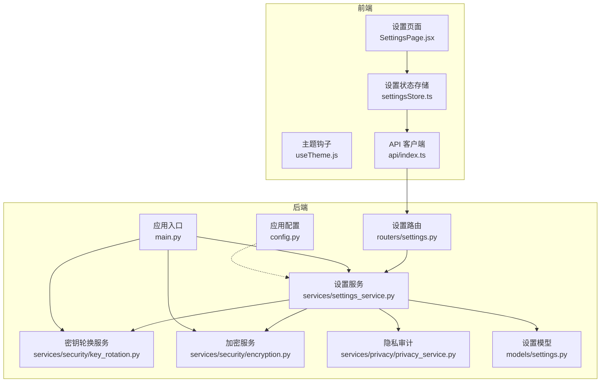
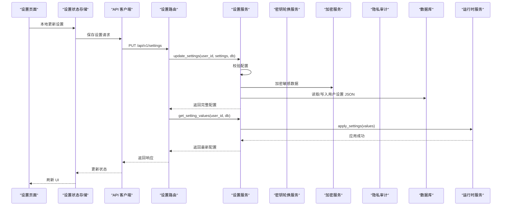
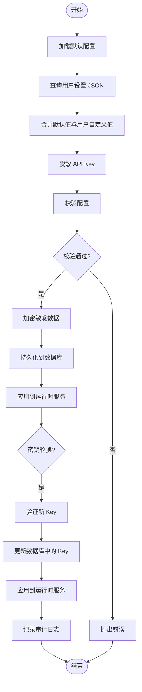
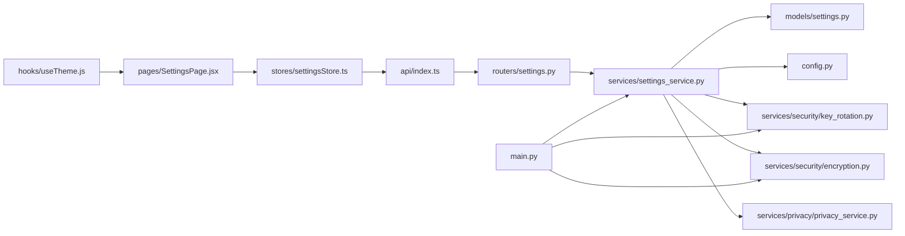

# 设置服务

<cite>
**本文引用的文件**
- [settings.py](file://backend/app/routers/settings.py)
- [settings_service.py](file://backend/app/services/settings_service.py)
- [key_rotation.py](file://backend/app/services/security/key_rotation.py)
- [encryption.py](file://backend/app/services/security/encryption.py)
- [privacy_service.py](file://backend/app/services/privacy/privacy_service.py)
- [settingsStore.ts](file://frontend/src/stores/settingsStore.ts)
- [SettingsPage.jsx](file://frontend/src/pages/SettingsPage.jsx)
- [useTheme.js](file://frontend/src/hooks/useTheme.js)
- [config.py](file://backend/app/config.py)
- [main.py](file://backend/app/main.py)
- [index.ts](file://frontend/src/api/index.ts)
</cite>

## 更新摘要
**变更内容**
- 新增 API 密钥轮换和验证功能，包括手动轮换和状态检查端点
- 集成加密服务，支持敏感数据的安全存储
- 新增密钥轮换服务，提供后台密钥状态监控和到期预警
- 增强隐私审计功能，记录 API Key 使用情况
- 更新设置路由，支持新的密钥管理 API

## 目录
1. [简介](#简介)
2. [项目结构](#项目结构)
3. [核心组件](#核心组件)
4. [架构总览](#架构总览)
5. [详细组件分析](#详细组件分析)
6. [依赖关系分析](#依赖关系分析)
7. [性能考量](#性能考量)
8. [故障排查指南](#故障排查指南)
9. [结论](#结论)
10. [附录](#附录)

## 简介
本文件面向"设置服务"的技术文档，系统性阐述应用配置管理系统的实现，覆盖用户偏好设置、系统参数配置与主题切换机制；详述配置数据的存储结构、默认值管理、配置验证规则；提供读取与更新用户设置、持久化配置数据、处理配置变更通知的具体流程；解释配置的继承关系、作用域管理与权限控制；并给出配置备份恢复、批量导入导出与配置迁移策略建议。

**更新** 本版本新增了 API 密钥管理功能，包括密钥轮换、验证和状态监控，集成了加密服务和隐私审计功能。

## 项目结构
设置服务由前后端协同实现：
- 后端采用 FastAPI + SQLAlchemy，提供设置的增删改查、默认值合并、运行时应用与密钥管理。
- 前端使用 React + Zustand 管理设置状态，支持本地持久化与即时预览，并通过 API 与后端交互。
- 配置数据以 JSON 形式存储在数据库表中，结合默认配置进行"默认值 + 用户自定义"的继承合并。
- 新增加密服务用于敏感数据的安全存储，密钥轮换服务用于密钥状态监控和到期预警。

**图表来源**
- [settings.py:1-201](file://backend/app/routers/settings.py#L1-L201)
- [settings_service.py:1-784](file://backend/app/services/settings_service.py#L1-L784)
- [key_rotation.py:1-363](file://backend/app/services/security/key_rotation.py#L1-L363)
- [encryption.py:1-167](file://backend/app/services/security/encryption.py#L1-L167)
- [privacy_service.py:1-209](file://backend/app/services/privacy/privacy_service.py#L1-L209)
- [settingsStore.ts:1-161](file://frontend/src/stores/settingsStore.ts#L1-L161)
- [SettingsPage.jsx:1-346](file://frontend/src/pages/SettingsPage.jsx#L1-L346)
- [useTheme.js:1-91](file://frontend/src/hooks/useTheme.js#L1-L91)
- [config.py:1-44](file://backend/app/config.py#L1-L44)
- [main.py:1-390](file://backend/app/main.py#L1-L390)
- [index.ts:1-25](file://frontend/src/api/index.ts#L1-L25)

## 核心组件
- 设置模型（UserSettings）
  - 存储用户设置的 JSON 文本，主键自增，user_id 唯一索引，带更新时间戳。
- 设置服务（SettingsService）
  - 默认配置定义与元数据（类型、范围、标签、描述等）。
  - 配置校验（类型、范围、枚举、布尔等）。
  - 读取与合并默认值与用户自定义值。
  - 敏感信息脱敏（API Key）。
  - 写入持久化与运行时应用。
  - **新增** API 密钥验证和轮换功能。
- 设置路由（settings_router）
  - 提供获取、更新、重置设置的 API。
  - **新增** 密钥轮换、验证和状态检查 API。
- 前端设置状态（settingsStore）
  - 管理设置加载、本地更新、保存、重置与提示。
- 主题钩子（useTheme）
  - 将外观设置应用到 DOM 属性与 CSS 变量，支持本地持久化。
- 应用入口（main）
  - 应用启动时加载默认用户设置并应用到运行时服务。
  - **新增** 初始化加密服务和密钥轮换服务。

**章节来源**
- [settings.py:11-30](file://backend/app/models/settings.py#L11-L30)
- [settings_service.py:168-784](file://backend/app/services/settings_service.py#L168-L784)
- [settings.py:28-201](file://backend/app/routers/settings.py#L28-L201)
- [settingsStore.ts:9-161](file://frontend/src/stores/settingsStore.ts#L9-L161)
- [useTheme.js:13-91](file://frontend/src/hooks/useTheme.js#L13-L91)
- [main.py:149-185](file://backend/app/main.py#L149-L185)

## 架构总览
设置服务遵循"前端状态 + 后端持久化 + 运行时应用 + 安全管理"的四层架构：
- 前端负责 UI 渲染与即时预览，本地存储外观设置以避免闪烁。
- 后端负责默认值与用户自定义值的合并、校验与持久化。
- 运行时将有效配置应用到具体服务（LLM、RAG、搜索、推荐）。
- **新增** 安全层负责密钥管理、加密存储和隐私审计。

**图表来源**
- [settings.py:45-107](file://backend/app/routers/settings.py#L45-L107)
- [settings_service.py:361-435](file://backend/app/services/settings_service.py#L361-L435)
- [settingsStore.ts:93-124](file://frontend/src/stores/settingsStore.ts#L93-L124)

**章节来源**
- [settings.py:28-201](file://backend/app/routers/settings.py#L28-L201)
- [settings_service.py:177-435](file://backend/app/services/settings_service.py#L177-L435)
- [settingsStore.ts:39-124](file://frontend/src/stores/settingsStore.ts#L39-L124)

## 详细组件分析

### 设置模型（UserSettings）
- 表结构
  - id: 主键
  - user_id: 唯一索引，一对一关联用户
  - settings_json: TEXT，JSON 格式存储用户自定义配置
  - updated_at: 时间戳，自动维护
- 设计要点
  - 使用 JSON 存储灵活扩展，便于新增配置项而无需迁移表结构。
  - 唯一索引确保每个用户仅有一份设置记录。

**章节来源**
- [settings.py:11-30](file://backend/app/models/settings.py#L11-L30)

### 设置服务（SettingsService）
- 默认配置与元数据
  - 分类：llm、rag、search、recommendation、appearance、general、zotero、mcp。
  - 每个配置项包含 value、type、min/max/step/options/label/description 等元数据。
- 配置校验
  - 类型校验：slider/number 数值范围；select 枚举；text/password 字符串；toggle 布尔。
  - 越界校验：数值类型按 min/max 限制。
- 读取与合并
  - get_settings：返回完整配置（含元数据），合并默认值与用户自定义值，API Key 脱敏。
  - get_setting_values：返回纯值配置（不含元数据），用于后端服务读取。
- 写入与持久化
  - update_settings：校验后合并用户自定义值，过滤脱敏的 API Key，持久化到数据库。
  - reset_settings：删除用户设置记录，回退到默认配置。
- 运行时应用
  - apply_settings：将配置应用到各服务（LLM/RAG/搜索/推荐），对脱敏 API Key 保留原值。
- 敏感信息处理
  - _mask_api_key：仅显示最后 4 位。
  - _is_masked_api_key：严格判断脱敏格式，避免误判真实 Key。
- **新增** API 密钥管理
  - validate_api_key：验证第三方服务 API Key 有效性。
  - rotate_api_key：轮换 API Key 并更新运行时配置。
  - _KEY_VALIDATION_MAP：支持 deepseek、bing、tavily、brave、zotero、semantic_scholar 的验证映射。

**图表来源**
- [settings_service.py:486-713](file://backend/app/services/settings_service.py#L486-L713)

**章节来源**
- [settings_service.py:19-165](file://backend/app/services/settings_service.py#L19-L165)
- [settings_service.py:177-713](file://backend/app/services/settings_service.py#L177-L713)
- [settings_service.py:486-713](file://backend/app/services/settings_service.py#L486-L713)

### 设置路由（settings_router）
- GET /api/v1/settings：返回完整配置（含元数据，API Key 脱敏）。
- PUT /api/v1/settings：更新配置，返回最新完整配置，并应用到运行时。
- POST /api/v1/settings/reset：重置为默认值，并应用默认配置到运行时。
- GET /api/v1/settings/values：返回纯值配置（不含元数据）。
- **新增** POST /api/v1/settings/rotate-key：轮换 API Key。
- **新增** POST /api/v1/settings/validate-key：验证 API Key 有效性。
- **新增** GET /api/v1/settings/key-status：获取所有 API Key 的轮换状态。
- **新增** POST /api/v1/settings/key-rotation/check：触发立即检查所有 Key 的轮换状态。

**章节来源**
- [settings.py:28-201](file://backend/app/routers/settings.py#L28-L201)

### 前端设置状态（settingsStore）
- 状态字段
  - settings、loading、saving、error、hasChanges、pendingChanges、toastMessage。
- 核心方法
  - fetchSettings：拉取完整配置，同步外观设置到 localStorage。
  - updateLocalSetting：本地更新（不立即保存），同时同步外观设置到 localStorage。
  - saveSettings：提交待保存更改，成功后同步外观设置到 localStorage 并显示提示。
  - resetSettings：重置为默认值，同步外观设置到 localStorage 并显示提示。
- 本地持久化
  - 主题、字体大小、紧凑模式分别存储在 localStorage 中，用于快速加载避免闪烁。

**章节来源**
- [settingsStore.ts:9-161](file://frontend/src/stores/settingsStore.ts#L9-L161)

### 主题钩子（useTheme）
- 初始化主题：initializeTheme 从 localStorage 读取并立即应用，避免首次渲染闪烁。
- 应用主题：根据设置或 localStorage 决定 data-theme 属性或移除属性（auto）。
- 应用字体大小：设置根元素字体大小。
- 应用紧凑模式：设置 data-compact 属性或移除属性。

**章节来源**
- [useTheme.js:13-91](file://frontend/src/hooks/useTheme.js#L13-L91)

### 应用入口（main）
- 应用启动时加载默认用户（id=1）的设置并应用到运行时服务，确保系统默认配置生效。
- **新增** 初始化加密服务和密钥轮换服务，注册已配置的 Key 到轮换服务并启动后台检查。

**章节来源**
- [main.py:149-185](file://backend/app/main.py#L149-L185)

## 依赖关系分析
- 组件耦合
  - 路由依赖设置服务；设置服务依赖模型与应用配置；前端状态依赖 API 客户端；主题钩子依赖设置状态。
  - **新增** 设置服务依赖加密服务、密钥轮换服务和隐私审计服务。
- 外部依赖
  - SQLAlchemy ORM、FastAPI、Axios、Zustand、cryptography。
- 潜在循环依赖
  - 当前模块间为单向依赖，未发现循环依赖风险。

**图表来源**
- [index.ts:1-25](file://frontend/src/api/index.ts#L1-L25)
- [settings.py:1-201](file://backend/app/routers/settings.py#L1-L201)
- [settings_service.py:1-784](file://backend/app/services/settings_service.py#L1-L784)
- [settings.py:1-30](file://backend/app/models/settings.py#L1-L30)
- [config.py:1-44](file://backend/app/config.py#L1-L44)
- [key_rotation.py:1-363](file://backend/app/services/security/key_rotation.py#L1-L363)
- [encryption.py:1-167](file://backend/app/services/security/encryption.py#L1-L167)
- [privacy_service.py:1-209](file://backend/app/services/privacy/privacy_service.py#L1-L209)
- [settingsStore.ts:1-161](file://frontend/src/stores/settingsStore.ts#L1-L161)
- [SettingsPage.jsx:1-346](file://frontend/src/pages/SettingsPage.jsx#L1-L346)
- [useTheme.js:1-91](file://frontend/src/hooks/useTheme.js#L1-L91)
- [main.py:1-390](file://backend/app/main.py#L1-L390)

**章节来源**
- [settings.py:1-201](file://backend/app/routers/settings.py#L1-L201)
- [settings_service.py:1-784](file://backend/app/services/settings_service.py#L1-L784)
- [settings.py:1-30](file://backend/app/models/settings.py#L1-L30)
- [settingsStore.ts:1-161](file://frontend/src/stores/settingsStore.ts#L1-L161)
- [SettingsPage.jsx:1-346](file://frontend/src/pages/SettingsPage.jsx#L1-L346)
- [useTheme.js:1-91](file://frontend/src/hooks/useTheme.js#L1-L91)
- [config.py:1-44](file://backend/app/config.py#L1-L44)
- [main.py:1-390](file://backend/app/main.py#L1-L390)
- [index.ts:1-25](file://frontend/src/api/index.ts#L1-L25)

## 性能考量
- 数据库访问
  - 单次查询用户设置 JSON，合并逻辑在内存完成，复杂度 O(N)（N 为配置项数量）。
- 前端渲染
  - 本地状态更新即时生效，避免频繁网络请求；仅在保存时发送请求。
- 运行时应用
  - 仅在配置变更时调用 apply_settings，避免不必要的服务重启。
- **新增** 密钥验证性能
  - 每次验证发起一次 HTTP 请求，延迟取决于目标服务响应速度（通常 200ms~2s），5s 超时兜底。
  - 后台密钥轮换检查仅遍历内存中的 Key 元数据，CPU 开销可忽略。
- 建议
  - 对高频读取场景可考虑缓存纯值配置到进程内缓存，减少重复解析 JSON 的开销。
  - **新增** 密钥验证请求可考虑添加本地缓存，避免频繁重复验证。

## 故障排查指南
- 配置校验失败
  - 现象：更新设置返回 400，提示无效配置。
  - 排查：确认配置类型、范围与枚举值是否符合默认配置定义。
- API Key 脱敏导致未保存
  - 现象：更新 API Key 后未生效。
  - 排查：若传入的是脱敏值（严格格式），服务会跳过保存；请传入真实密钥或留空以使用环境变量。
- 运行时未应用
  - 现象：前端已保存，但服务行为未改变。
  - 排查：确认 apply_settings 是否被调用；检查对应服务的 update_config 方法是否正确接收参数。
- 主题闪烁
  - 现象：页面加载时主题闪烁。
  - 排查：确保在应用启动时调用 initializeTheme，从 localStorage 读取并立即应用。
- **新增** 密钥验证失败
  - 现象：验证 API Key 返回失败。
  - 排查：确认服务名称是否在支持列表中，检查网络连接和目标服务状态。
- **新增** 密钥轮换失败
  - 现象：轮换 API Key 返回失败。
  - 排查：确认新 Key 是否有效，检查数据库写入权限，查看运行时服务更新日志。

**章节来源**
- [settings_service.py:348-357](file://backend/app/services/settings_service.py#L348-L357)
- [settings_service.py:362-366](file://backend/app/services/settings_service.py#L362-L366)
- [settings_service.py:567-613](file://backend/app/services/settings_service.py#L567-L613)
- [settings_service.py:655-677](file://backend/app/services/settings_service.py#L655-L677)
- [useTheme.js:72-91](file://frontend/src/hooks/useTheme.js#L72-L91)

## 结论
设置服务通过"默认值 + 用户自定义"的继承模型，结合严格的配置校验与敏感信息脱敏，在保证灵活性的同时确保安全性与一致性。前端与后端协同实现了即时预览与持久化，运行时应用机制使配置变更能够快速生效。

**更新** 新版本增强了安全功能，集成了 API 密钥管理、加密存储和隐私审计，提供了完整的密钥生命周期管理能力。密钥轮换服务的后台检查机制确保了密钥状态的实时监控和到期预警。整体设计更加完善，适合后续引入备份恢复、批量导入导出与配置迁移等高级能力。

## 附录

### 配置数据存储结构
- 存储位置：数据库表 user_settings 的 settings_json 字段。
- 结构：JSON 对象，按分类与键组织，值为用户自定义值。
- 默认值：服务端在读取时与默认配置合并，前端在渲染时使用完整配置（含元数据）。
- **新增** 加密存储：敏感数据通过加密服务进行加密存储，支持向后兼容的密钥迁移。

**章节来源**
- [settings.py:19-26](file://backend/app/models/settings.py#L19-L26)
- [settings_service.py:261-287](file://backend/app/services/settings_service.py#L261-L287)
- [encryption.py:124-144](file://backend/app/services/security/encryption.py#L124-L144)

### 默认值管理
- 默认配置集中定义在设置服务中，包含类型、范围、标签与描述，前端据此生成表单控件。
- 读取时优先使用用户自定义值，缺失项回退到默认值。

**章节来源**
- [settings_service.py:19-165](file://backend/app/services/settings_service.py#L19-L165)
- [settings_service.py:261-287](file://backend/app/services/settings_service.py#L261-L287)

### 配置验证规则
- 类型与范围：slider/number 支持 min/max/step；select 支持 options；toggle 为布尔；text/password 为字符串。
- 越界与非法值：直接拒绝并返回错误。
- **新增** 密钥验证：支持多种第三方服务的 API Key 验证，包括 HTTP 状态码检查和超时保护。

**章节来源**
- [settings_service.py:190-231](file://backend/app/services/settings_service.py#L190-L231)
- [settings_service.py:537-613](file://backend/app/services/settings_service.py#L537-L613)

### 读取与更新用户设置（代码路径）
- 读取完整配置（含元数据）
  - [GET /api/v1/settings:31-42](file://backend/app/routers/settings.py#L31-L42)
  - [get_settings:277-319](file://backend/app/services/settings_service.py#L277-L319)
- 读取纯值配置（不含元数据）
  - [GET /api/v1/settings/values:97-107](file://backend/app/routers/settings.py#L97-L107)
  - [get_setting_values:321-359](file://backend/app/services/settings_service.py#L321-L359)
- 更新配置
  - [PUT /api/v1/settings:45-76](file://backend/app/routers/settings.py#L45-L76)
  - [update_settings:361-435](file://backend/app/services/settings_service.py#L361-L435)
- 重置配置
  - [POST /api/v1/settings/reset:79-94](file://backend/app/routers/settings.py#L79-L94)
  - [reset_settings:437-462](file://backend/app/services/settings_service.py#L437-L462)

**章节来源**
- [settings.py:28-94](file://backend/app/routers/settings.py#L28-L94)
- [settings_service.py:277-462](file://backend/app/services/settings_service.py#L277-L462)

### 持久化配置数据
- 写入流程
  - 校验通过后，合并用户自定义值到当前 JSON。
  - 若存在记录则更新，否则新建记录。
  - 提交事务并记录日志。
- 读取流程
  - 读取 JSON 并解析为 Python 字典，与默认配置合并。
- **新增** 加密流程
  - 敏感数据通过加密服务进行加密处理。
  - 支持向后兼容的密钥迁移，自动检测和转换未加密数据。

**章节来源**
- [settings_service.py:361-435](file://backend/app/services/settings_service.py#L361-L435)
- [settings.py:19-26](file://backend/app/models/settings.py#L19-L26)
- [encryption.py:71-144](file://backend/app/services/security/encryption.py#L71-L144)

### 处理配置变更通知
- 前端
  - 保存成功后更新状态并显示提示；外观设置同步到 localStorage。
- 后端
  - 保存后立即应用到运行时服务，确保配置即时生效。
- **新增** 密钥轮换通知
  - 成功轮换后记录审计日志，通过 WebSocket 广播到期预警。

**章节来源**
- [settingsStore.ts:93-124](file://frontend/src/stores/settingsStore.ts#L93-L124)
- [settings_service.py:56-58](file://backend/app/services/settings_service.py#L56-L58)
- [settings_service.py:709-713](file://backend/app/services/settings_service.py#L709-L713)

### 配置继承关系与作用域管理
- 继承关系
  - 默认配置为基线；用户自定义配置覆盖默认值；缺失项回退默认值。
- 作用域管理
  - 用户级：按 user_id 唯一存储。
  - 系统级：默认配置集中定义，可通过环境变量或应用配置补充（如 API Key）。
- 权限控制
  - 所有设置接口均依赖认证中间件，仅允许当前用户访问自己的设置。
- **新增** 密钥作用域
  - 每个服务的 API Key 独立管理，支持不同服务使用不同的密钥。

**章节来源**
- [settings_service.py:261-287](file://backend/app/services/settings_service.py#L261-L287)
- [settings.py:10-21](file://backend/app/routers/settings.py#L10-L21)

### 主题切换机制
- 前端
  - useTheme 根据设置或 localStorage 应用 data-theme、字体大小与紧凑模式。
  - SettingsPage 提供主题选择器，支持 light/dark/auto。
- 后端
  - 通过运行时应用将主题设置传递给前端渲染层。

**章节来源**
- [useTheme.js:13-66](file://frontend/src/hooks/useTheme.js#L13-L66)
- [SettingsPage.jsx:16-22](file://frontend/src/pages/SettingsPage.jsx#L16-L22)
- [settings_service.py:715-779](file://backend/app/services/settings_service.py#L715-L779)

### 密钥管理功能
- **新增** 密钥验证
  - 支持 deepseek、bing、tavily、brave、zotero、semantic_scholar 等服务的 API Key 验证。
  - 通过 HTTP 请求验证密钥有效性，包含超时保护和状态码检查。
- **新增** 密钥轮换
  - 支持手动轮换 API Key，包含验证、更新、应用和审计日志记录。
  - 自动更新运行时服务配置，确保密钥变更即时生效。
- **新增** 密钥状态监控
  - 后台定期检查所有已配置密钥的状态，提前 7 天和 1 天发出到期预警。
  - 通过 WebSocket 广播到期警告，支持手动触发检查。
- **新增** 加密存储
  - 使用 Fernet 对称加密算法加密敏感数据，支持密钥迁移和向后兼容。
  - 自动生成临时密钥并发出警告，生产环境需设置 ENCRYPTION_KEY 环境变量。
- **新增** 隐私审计
  - 记录 API Key 的访问和轮换操作，支持查询审计日志。
  - 每个 Key 维护独立的审计队列，避免无限增长。

**章节来源**
- [settings_service.py:486-713](file://backend/app/services/settings_service.py#L486-L713)
- [key_rotation.py:55-300](file://backend/app/services/security/key_rotation.py#L55-L300)
- [encryption.py:26-144](file://backend/app/services/security/encryption.py#L26-L144)
- [privacy_service.py:90-136](file://backend/app/services/privacy/privacy_service.py#L90-L136)

### 配置备份恢复、批量导入导出与配置迁移策略（建议）
- 备份恢复
  - 导出：提供导出接口，将用户设置 JSON 下载为文件。
  - 恢复：提供导入接口，校验 JSON 后合并到用户设置。
  - **新增** 加密数据备份：支持包含加密密钥的完整备份恢复。
- 批量导入导出
  - 支持按用户批量导出/导入设置 JSON 文件，便于团队共享或迁移。
  - **新增** 密钥迁移：支持跨环境的密钥迁移和批量更新。
- 配置迁移
  - 版本升级时，新增配置项自动以默认值填充；旧配置项兼容处理；提供迁移脚本或 API 自动迁移。
  - **新增** 加密密钥迁移：自动检测和转换未加密的旧密钥数据。
- 安全与合规
  - 导出文件建议加密存储；导入前进行严格校验与审计日志。
  - **新增** 密钥轮换策略：支持自动轮换和手动轮换相结合的密钥管理策略。

**章节来源**
- [settings.py:17-94](file://backend/app/routers/settings.py#L17-L94)
- [settings_service.py:245-431](file://backend/app/services/settings_service.py#L245-L431)
- [encryption.py:124-144](file://backend/app/services/security/encryption.py#L124-L144)
- [key_rotation.py:225-231](file://backend/app/services/security/key_rotation.py#L225-L231)