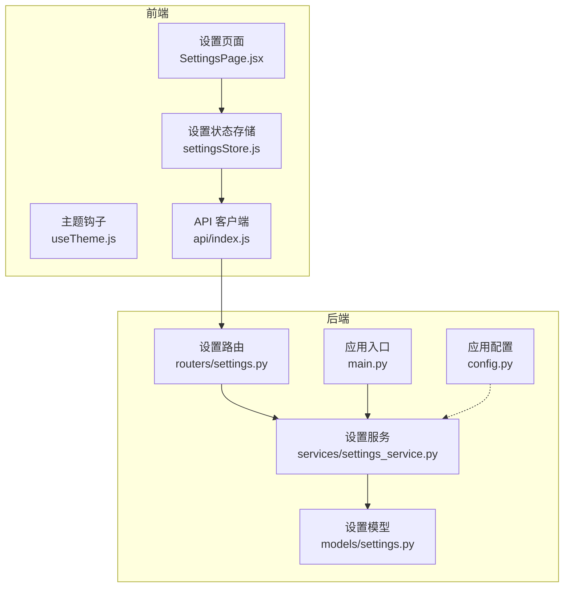
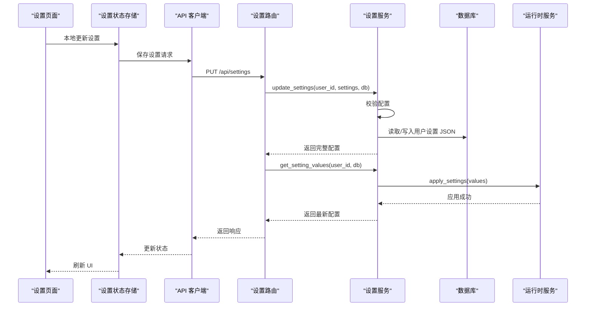
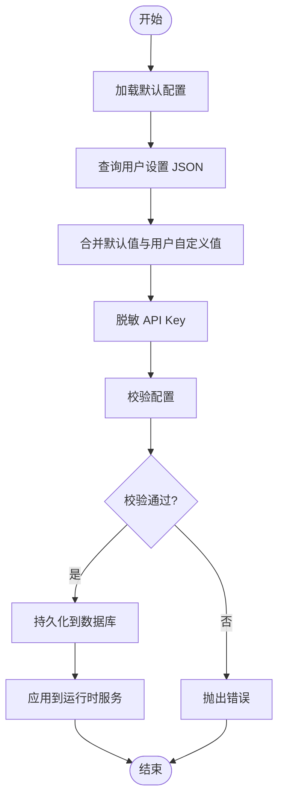
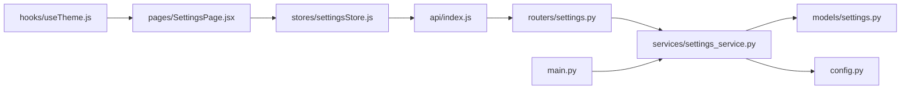

# 设置服务

<cite>
**本文引用的文件**
- [settings.py](file://backend/app/models/settings.py)
- [settings_service.py](file://backend/app/services/settings_service.py)
- [settings.py](file://backend/app/routers/settings.py)
- [settingsStore.js](file://frontend/src/stores/settingsStore.js)
- [SettingsPage.jsx](file://frontend/src/pages/SettingsPage.jsx)
- [useTheme.js](file://frontend/src/hooks/useTheme.js)
- [config.py](file://backend/app/config.py)
- [main.py](file://backend/app/main.py)
- [index.js](file://frontend/src/api/index.js)
</cite>

## 目录
1. [简介](#简介)
2. [项目结构](#项目结构)
3. [核心组件](#核心组件)
4. [架构总览](#架构总览)
5. [详细组件分析](#详细组件分析)
6. [依赖关系分析](#依赖关系分析)
7. [性能考量](#性能考量)
8. [故障排查指南](#故障排查指南)
9. [结论](#结论)
10. [附录](#附录)

## 简介
本文件面向“设置服务”的技术文档，系统性阐述应用配置管理系统的设计与实现，覆盖用户偏好设置、系统参数配置与主题切换机制；详述配置数据的存储结构、默认值管理、配置验证规则；提供读取与更新用户设置、持久化配置数据、处理配置变更通知的具体流程；解释配置的继承关系、作用域管理与权限控制；并给出配置备份恢复、批量导入导出与配置迁移策略建议。

## 项目结构
设置服务由前后端协同实现：
- 后端采用 FastAPI + SQLAlchemy，提供设置的增删改查、默认值合并、运行时应用与校验。
- 前端使用 React + Zustand 管理设置状态，支持本地持久化与即时预览，并通过 API 与后端交互。
- 配置数据以 JSON 形式存储在数据库表中，结合默认配置进行“默认值 + 用户自定义”的继承合并。

图表来源
- [settings.py:1-94](file://backend/app/routers/settings.py#L1-L94)
- [settings_service.py:1-523](file://backend/app/services/settings_service.py#L1-L523)
- [settings.py:1-30](file://backend/app/models/settings.py#L1-L30)
- [settingsStore.js:1-131](file://frontend/src/stores/settingsStore.js#L1-L131)
- [SettingsPage.jsx:1-330](file://frontend/src/pages/SettingsPage.jsx#L1-L330)
- [useTheme.js:1-91](file://frontend/src/hooks/useTheme.js#L1-L91)
- [config.py:1-44](file://backend/app/config.py#L1-L44)
- [main.py:1-114](file://backend/app/main.py#L1-L114)
- [index.js:1-12](file://frontend/src/api/index.js#L1-L12)

章节来源
- [settings.py:1-94](file://backend/app/routers/settings.py#L1-L94)
- [settings_service.py:1-523](file://backend/app/services/settings_service.py#L1-L523)
- [settings.py:1-30](file://backend/app/models/settings.py#L1-L30)
- [settingsStore.js:1-131](file://frontend/src/stores/settingsStore.js#L1-L131)
- [SettingsPage.jsx:1-330](file://frontend/src/pages/SettingsPage.jsx#L1-L330)
- [useTheme.js:1-91](file://frontend/src/hooks/useTheme.js#L1-L91)
- [config.py:1-44](file://backend/app/config.py#L1-L44)
- [main.py:1-114](file://backend/app/main.py#L1-L114)
- [index.js:1-12](file://frontend/src/api/index.js#L1-L12)

## 核心组件
- 设置模型（UserSettings）
  - 存储用户设置的 JSON 文本，主键自增，user_id 唯一索引，带更新时间戳。
- 设置服务（SettingsService）
  - 默认配置定义与元数据（类型、范围、标签、描述等）。
  - 配置校验（类型、范围、枚举、布尔等）。
  - 读取与合并默认值与用户自定义值。
  - 敏感信息脱敏（API Key）。
  - 写入持久化与运行时应用。
- 设置路由（settings_router）
  - 提供获取、更新、重置设置的 API。
- 前端设置状态（settingsStore）
  - 管理设置加载、本地更新、保存、重置与提示。
- 主题钩子（useTheme）
  - 将外观设置应用到 DOM 属性与 CSS 变量，支持本地持久化。
- 应用入口（main）
  - 应用启动时加载默认用户设置并应用到运行时服务。

章节来源
- [settings.py:11-30](file://backend/app/models/settings.py#L11-L30)
- [settings_service.py:168-523](file://backend/app/services/settings_service.py#L168-L523)
- [settings.py:17-94](file://backend/app/routers/settings.py#L17-L94)
- [settingsStore.js:9-131](file://frontend/src/stores/settingsStore.js#L9-L131)
- [useTheme.js:13-91](file://frontend/src/hooks/useTheme.js#L13-L91)
- [main.py:34-46](file://backend/app/main.py#L34-L46)

## 架构总览
设置服务遵循“前端状态 + 后端持久化 + 运行时应用”的三层架构：
- 前端负责 UI 渲染与即时预览，本地存储外观设置以避免闪烁。
- 后端负责默认值与用户自定义值的合并、校验与持久化。
- 运行时将有效配置应用到具体服务（LLM、RAG、搜索、推荐）。

图表来源
- [settings.py:31-63](file://backend/app/routers/settings.py#L31-L63)
- [settings_service.py:329-404](file://backend/app/services/settings_service.py#L329-L404)
- [settingsStore.js:63-94](file://frontend/src/stores/settingsStore.js#L63-L94)

章节来源
- [settings.py:17-94](file://backend/app/routers/settings.py#L17-L94)
- [settings_service.py:177-404](file://backend/app/services/settings_service.py#L177-L404)
- [settingsStore.js:18-94](file://frontend/src/stores/settingsStore.js#L18-L94)

## 详细组件分析

### 设置模型（UserSettings）
- 表结构
  - id: 主键
  - user_id: 唯一索引，一对一关联用户
  - settings_json: TEXT，JSON 格式存储用户自定义配置
  - updated_at: 时间戳，自动维护
- 设计要点
  - 使用 JSON 存储灵活扩展，便于新增配置项而无需迁移表结构。
  - 唯一索引确保每个用户仅有一份设置记录。

章节来源
- [settings.py:11-30](file://backend/app/models/settings.py#L11-L30)

### 设置服务（SettingsService）
- 默认配置与元数据
  - 分类：llm、rag、search、recommendation、appearance、general。
  - 每个配置项包含 value、type、min/max/step/options/label/description 等元数据。
- 配置校验
  - 类型校验：slider/number 数值范围；select 枚举；text/password 字符串；toggle 布尔。
  - 越界校验：数值类型按 min/max 限制。
- 读取与合并
  - get_settings：返回完整配置（含元数据），合并默认值与用户自定义值，API Key 脱敏。
  - get_setting_values：返回纯值配置（不含元数据），用于后端服务读取。
- 写入与持久化
  - update_settings：校验后合并用户自定义值，过滤脱敏的 API Key，持久化到数据库。
  - reset_settings：删除用户设置记录，回退到默认配置。
- 运行时应用
  - apply_settings：将配置应用到各服务（LLM/RAG/搜索/推荐），对脱敏 API Key 保留原值。
- 敏感信息处理
  - _mask_api_key：仅显示最后 4 位。
  - _is_masked_api_key：严格判断脱敏格式，避免误判真实 Key。

图表来源
- [settings_service.py:245-404](file://backend/app/services/settings_service.py#L245-L404)

章节来源
- [settings_service.py:19-165](file://backend/app/services/settings_service.py#L19-L165)
- [settings_service.py:177-404](file://backend/app/services/settings_service.py#L177-L404)
- [settings_service.py:454-520](file://backend/app/services/settings_service.py#L454-L520)

### 设置路由（settings_router）
- GET /api/settings：返回完整配置（含元数据，API Key 脱敏）。
- PUT /api/settings：更新配置，返回最新完整配置，并应用到运行时。
- POST /api/settings/reset：重置为默认值，并应用默认配置到运行时。
- GET /api/settings/values：返回纯值配置（不含元数据）。

章节来源
- [settings.py:17-94](file://backend/app/routers/settings.py#L17-L94)

### 前端设置状态（settingsStore）
- 状态字段
  - settings、loading、saving、error、hasChanges、pendingChanges、toastMessage。
- 核心方法
  - fetchSettings：拉取完整配置，同步外观设置到 localStorage。
  - updateLocalSetting：本地更新（不立即保存），同时同步外观设置到 localStorage。
  - saveSettings：提交待保存更改，成功后同步外观设置到 localStorage 并显示提示。
  - resetSettings：重置为默认值，同步外观设置到 localStorage 并显示提示。
- 本地持久化
  - 主题、字体大小、紧凑模式分别存储在 localStorage 中，用于快速加载避免闪烁。

章节来源
- [settingsStore.js:9-131](file://frontend/src/stores/settingsStore.js#L9-L131)

### 主题钩子（useTheme）
- 初始化主题：initializeTheme 从 localStorage 读取并立即应用，避免首次渲染闪烁。
- 应用主题：根据设置或 localStorage 决定 data-theme 属性或移除属性（auto）。
- 应用字体大小：设置根元素字体大小。
- 应用紧凑模式：设置 data-compact 属性或移除属性。

章节来源
- [useTheme.js:13-91](file://frontend/src/hooks/useTheme.js#L13-L91)

### 应用入口（main）
- 应用启动时加载默认用户（id=1）的设置并应用到运行时服务，确保系统默认配置生效。

章节来源
- [main.py:34-46](file://backend/app/main.py#L34-L46)

## 依赖关系分析
- 组件耦合
  - 路由依赖设置服务；设置服务依赖模型与应用配置；前端状态依赖 API 客户端；主题钩子依赖设置状态。
- 外部依赖
  - SQLAlchemy ORM、FastAPI、Axios、Zustand。
- 潜在循环依赖
  - 当前模块间为单向依赖，未发现循环依赖风险。

图表来源
- [index.js:1-12](file://frontend/src/api/index.js#L1-L12)
- [settings.py:1-94](file://backend/app/routers/settings.py#L1-L94)
- [settings_service.py:1-523](file://backend/app/services/settings_service.py#L1-L523)
- [settings.py:1-30](file://backend/app/models/settings.py#L1-L30)
- [config.py:1-44](file://backend/app/config.py#L1-L44)
- [settingsStore.js:1-131](file://frontend/src/stores/settingsStore.js#L1-L131)
- [SettingsPage.jsx:1-330](file://frontend/src/pages/SettingsPage.jsx#L1-L330)
- [useTheme.js:1-91](file://frontend/src/hooks/useTheme.js#L1-L91)
- [main.py:1-114](file://backend/app/main.py#L1-L114)

章节来源
- [settings.py:1-94](file://backend/app/routers/settings.py#L1-L94)
- [settings_service.py:1-523](file://backend/app/services/settings_service.py#L1-L523)
- [settings.py:1-30](file://backend/app/models/settings.py#L1-L30)
- [settingsStore.js:1-131](file://frontend/src/stores/settingsStore.js#L1-L131)
- [SettingsPage.jsx:1-330](file://frontend/src/pages/SettingsPage.jsx#L1-L330)
- [useTheme.js:1-91](file://frontend/src/hooks/useTheme.js#L1-L91)
- [config.py:1-44](file://backend/app/config.py#L1-L44)
- [main.py:1-114](file://backend/app/main.py#L1-L114)
- [index.js:1-12](file://frontend/src/api/index.js#L1-L12)

## 性能考量
- 数据库访问
  - 单次查询用户设置 JSON，合并逻辑在内存完成，复杂度 O(N)（N 为配置项数量）。
- 前端渲染
  - 本地状态更新即时生效，避免频繁网络请求；仅在保存时发送请求。
- 运行时应用
  - 仅在配置变更时调用 apply_settings，避免不必要的服务重启。
- 建议
  - 对高频读取场景可考虑缓存纯值配置到进程内缓存，减少重复解析 JSON 的开销。

## 故障排查指南
- 配置校验失败
  - 现象：更新设置返回 400，提示无效配置。
  - 排查：确认配置类型、范围与枚举值是否符合默认配置定义。
- API Key 脱敏导致未保存
  - 现象：更新 API Key 后未生效。
  - 排查：若传入的是脱敏值（严格格式），服务会跳过保存；请传入真实密钥或留空以使用环境变量。
- 运行时未应用
  - 现象：前端已保存，但服务行为未改变。
  - 排查：确认 apply_settings 是否被调用；检查对应服务的 update_config 方法是否正确接收参数。
- 主题闪烁
  - 现象：页面加载时主题闪烁。
  - 排查：确保在应用启动时调用 initializeTheme，从 localStorage 读取并立即应用。

章节来源
- [settings_service.py:348-357](file://backend/app/services/settings_service.py#L348-L357)
- [settings_service.py:362-366](file://backend/app/services/settings_service.py#L362-L366)
- [settings_service.py:454-520](file://backend/app/services/settings_service.py#L454-L520)
- [useTheme.js:72-91](file://frontend/src/hooks/useTheme.js#L72-L91)

## 结论
设置服务通过“默认值 + 用户自定义”的继承模型，结合严格的配置校验与敏感信息脱敏，在保证灵活性的同时确保安全性与一致性。前端与后端协同实现了即时预览与持久化，运行时应用机制使配置变更能够快速生效。整体设计清晰、扩展性强，适合后续引入备份恢复、批量导入导出与配置迁移等高级能力。

## 附录

### 配置数据存储结构
- 存储位置：数据库表 user_settings 的 settings_json 字段。
- 结构：JSON 对象，按分类与键组织，值为用户自定义值。
- 默认值：服务端在读取时与默认配置合并，前端在渲染时使用完整配置（含元数据）。

章节来源
- [settings.py:19-26](file://backend/app/models/settings.py#L19-L26)
- [settings_service.py:261-287](file://backend/app/services/settings_service.py#L261-L287)

### 默认值管理
- 默认配置集中定义在设置服务中，包含类型、范围、标签与描述，前端据此生成表单控件。
- 读取时优先使用用户自定义值，缺失项回退到默认值。

章节来源
- [settings_service.py:19-165](file://backend/app/services/settings_service.py#L19-L165)
- [settings_service.py:261-287](file://backend/app/services/settings_service.py#L261-L287)

### 配置验证规则
- 类型与范围：slider/number 支持 min/max/step；select 支持 options；toggle 为布尔；text/password 为字符串。
- 越界与非法值：直接拒绝并返回错误。

章节来源
- [settings_service.py:190-231](file://backend/app/services/settings_service.py#L190-L231)

### 读取与更新用户设置（代码路径）
- 读取完整配置（含元数据）
  - [GET /api/settings:17-28](file://backend/app/routers/settings.py#L17-L28)
  - [get_settings:245-287](file://backend/app/services/settings_service.py#L245-L287)
- 读取纯值配置（不含元数据）
  - [GET /api/settings/values:83-94](file://backend/app/routers/settings.py#L83-L94)
  - [get_setting_values:289-327](file://backend/app/services/settings_service.py#L289-L327)
- 更新配置
  - [PUT /api/settings:31-63](file://backend/app/routers/settings.py#L31-L63)
  - [update_settings:329-404](file://backend/app/services/settings_service.py#L329-L404)
- 重置配置
  - [POST /api/settings/reset:65-81](file://backend/app/routers/settings.py#L65-L81)
  - [reset_settings:405-431](file://backend/app/services/settings_service.py#L405-L431)

章节来源
- [settings.py:17-94](file://backend/app/routers/settings.py#L17-L94)
- [settings_service.py:245-431](file://backend/app/services/settings_service.py#L245-L431)

### 持久化配置数据
- 写入流程
  - 校验通过后，合并用户自定义值到当前 JSON。
  - 若存在记录则更新，否则新建记录。
  - 提交事务并记录日志。
- 读取流程
  - 读取 JSON 并解析为 Python 字典，与默认配置合并。

章节来源
- [settings_service.py:367-404](file://backend/app/services/settings_service.py#L367-L404)
- [settings.py:19-26](file://backend/app/models/settings.py#L19-L26)

### 处理配置变更通知
- 前端
  - 保存成功后更新状态并显示提示；外观设置同步到 localStorage。
- 后端
  - 保存后立即应用到运行时服务，确保配置即时生效。

章节来源
- [settingsStore.js:63-94](file://frontend/src/stores/settingsStore.js#L63-L94)
- [settings_service.py:56-58](file://backend/app/services/settings_service.py#L56-L58)
- [settings_service.py:454-520](file://backend/app/services/settings_service.py#L454-L520)

### 配置继承关系与作用域管理
- 继承关系
  - 默认配置为基线；用户自定义配置覆盖默认值；缺失项回退默认值。
- 作用域管理
  - 用户级：按 user_id 唯一存储。
  - 系统级：默认配置集中定义，可通过环境变量或应用配置补充（如 API Key）。
- 权限控制
  - 所有设置接口均依赖认证中间件，仅允许当前用户访问自己的设置。

章节来源
- [settings_service.py:261-287](file://backend/app/services/settings_service.py#L261-L287)
- [settings.py:10-21](file://backend/app/routers/settings.py#L10-L21)

### 主题切换机制
- 前端
  - useTheme 根据设置或 localStorage 应用 data-theme、字体大小与紧凑模式。
  - SettingsPage 提供主题选择器，支持 light/dark/auto。
- 后端
  - 通过运行时应用将主题设置传递给前端渲染层。

章节来源
- [useTheme.js:13-66](file://frontend/src/hooks/useTheme.js#L13-L66)
- [SettingsPage.jsx:16-20](file://frontend/src/pages/SettingsPage.jsx#L16-L20)
- [settings_service.py:454-520](file://backend/app/services/settings_service.py#L454-L520)

### 配置备份恢复、批量导入导出与配置迁移策略（建议）
- 备份恢复
  - 导出：提供导出接口，将用户设置 JSON 下载为文件。
  - 恢复：提供导入接口，校验 JSON 后合并到用户设置。
- 批量导入导出
  - 支持按用户批量导出/导入设置 JSON 文件，便于团队共享或迁移。
- 配置迁移
  - 版本升级时，新增配置项自动以默认值填充；旧配置项兼容处理；提供迁移脚本或 API 自动迁移。
- 安全与合规
  - 导出文件建议加密存储；导入前进行严格校验与审计日志。

（本节为概念性建议，不直接对应具体源码）