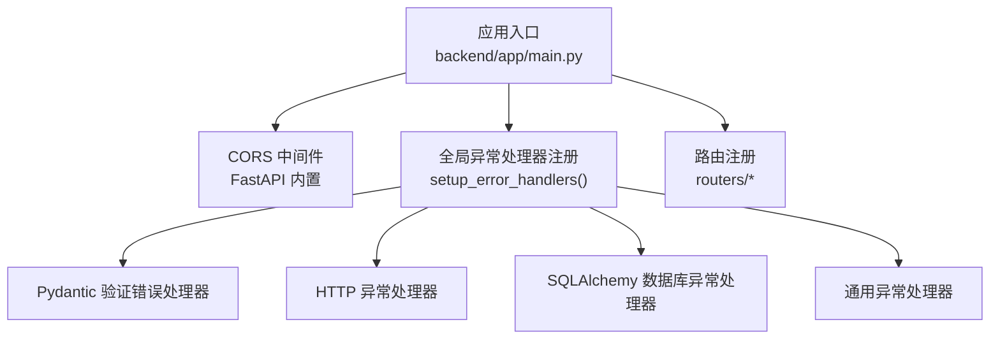
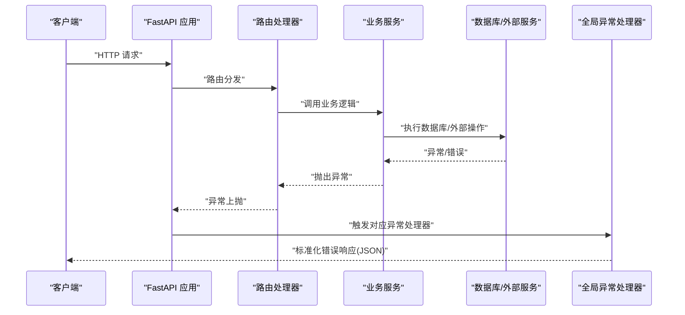
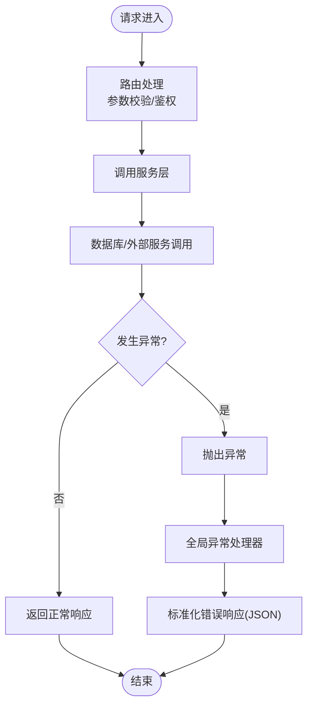
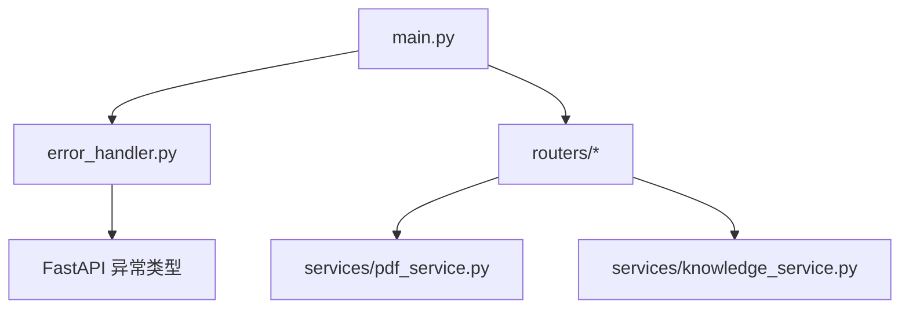

# 中间件与错误处理

<cite>
**本文引用的文件**
- [main.py](file://backend/app/main.py)
- [error_handler.py](file://backend/app/middleware/error_handler.py)
- [config.py](file://backend/app/config.py)
- [papers.py](file://backend/app/routers/papers.py)
- [chat.py](file://backend/app/routers/chat.py)
- [pdf_service.py](file://backend/app/services/pdf_service.py)
- [knowledge_service.py](file://backend/app/services/knowledge_service.py)
</cite>

## 目录
1. [简介](#简介)
2. [项目结构](#项目结构)
3. [核心组件](#核心组件)
4. [架构总览](#架构总览)
5. [详细组件分析](#详细组件分析)
6. [依赖分析](#依赖分析)
7. [性能考虑](#性能考虑)
8. [故障排查指南](#故障排查指南)
9. [结论](#结论)
10. [附录](#附录)

## 简介
本文件系统性梳理 PaperChat 后端的中间件与错误处理体系，重点覆盖：
- CORS 中间件配置与作用范围
- 全局异常处理中间件的层次化设计与实现
- 错误响应格式与日志策略
- 自顶向下（路由层 → 服务层 → 数据访问层）的异常传播与处理流程
- 常见错误场景的诊断与修复建议
- 性能监控与错误统计的落地建议

## 项目结构
PaperChat 后端采用 FastAPI 应用入口集中配置中间件与路由，错误处理通过全局异常处理器统一拦截，CORS 中间件在应用启动时注册。

图表来源
- [main.py:70-95](file://backend/app/main.py#L70-L95)
- [error_handler.py:73-92](file://backend/app/middleware/error_handler.py#L73-L92)

章节来源
- [main.py:55-95](file://backend/app/main.py#L55-L95)
- [config.py:33-34](file://backend/app/config.py#L33-L34)

## 核心组件
- CORS 中间件：在应用启动时通过 FastAPI 内置中间件注册，允许跨域请求，支持凭证、通配方法与头部。
- 全局异常处理器：统一拦截并转换为标准化 JSON 响应，覆盖 Pydantic 参数校验、HTTP 异常、数据库异常与通用异常四类。
- 配置中心：集中管理 CORS 允许来源、数据库连接、JWT、上传限制等运行参数。

章节来源
- [main.py:70-77](file://backend/app/main.py#L70-L77)
- [error_handler.py:73-92](file://backend/app/middleware/error_handler.py#L73-L92)
- [config.py:15-40](file://backend/app/config.py#L15-L40)

## 架构总览
下图展示从客户端到服务层的调用链与错误处理路径：

图表来源
- [main.py:79-80](file://backend/app/main.py#L79-L80)
- [error_handler.py:11-70](file://backend/app/middleware/error_handler.py#L11-L70)

## 详细组件分析

### CORS 中间件
- 注册位置：应用入口集中配置，允许指定来源、凭证、通配方法与头部。
- 影响范围：对所有路由生效，确保前端跨域访问 API 的能力。
- 安全要点：生产环境建议收窄 CORS_ORIGINS 列表，避免使用通配符。

章节来源
- [main.py:70-77](file://backend/app/main.py#L70-L77)
- [config.py:33-34](file://backend/app/config.py#L33-L34)

### 全局异常处理中间件
- 设计原则：按异常类型分级处理，返回统一 JSON 结构，便于前端一致化处理。
- 处理器清单：
  - Pydantic 参数校验错误：将字段级错误聚合为统一格式，返回 422。
  - HTTP 异常：透传状态码与详情，返回 4xx。
  - SQLAlchemy 数据库异常：记录错误并返回 500。
  - 通用异常：兜底记录错误并返回 500。
- 日志策略：使用标准输出打印错误上下文，便于快速定位；生产环境建议接入日志框架。

章节来源
- [error_handler.py:11-28](file://backend/app/middleware/error_handler.py#L11-L28)
- [error_handler.py:31-40](file://backend/app/middleware/error_handler.py#L31-L40)
- [error_handler.py:43-55](file://backend/app/middleware/error_handler.py#L43-L55)
- [error_handler.py:58-70](file://backend/app/middleware/error_handler.py#L58-L70)
- [error_handler.py:73-92](file://backend/app/middleware/error_handler.py#L73-L92)

### 错误响应格式规范
- 统一结构：包含状态码、消息与数据体三部分。
- 参数校验错误：数据体为字段级错误数组，包含字段路径、消息与类型。
- HTTP 异常：数据体为空，由状态码与消息承载错误语义。
- 数据库与通用异常：数据体为空，状态码分别为 500。

章节来源
- [error_handler.py:21-28](file://backend/app/middleware/error_handler.py#L21-L28)
- [error_handler.py:33-40](file://backend/app/middleware/error_handler.py#L33-L40)
- [error_handler.py:48-55](file://backend/app/middleware/error_handler.py#L48-L55)
- [error_handler.py:63-70](file://backend/app/middleware/error_handler.py#L63-L70)

### 异常传播与处理流程（自顶向下）
- 路由层：负责参数绑定、鉴权与业务入口，异常在此处首次暴露。
- 服务层：封装业务规则与外部调用，异常向上抛出。
- 数据访问层：执行数据库或外部服务调用，异常向上抛出。
- 全局异常处理器：根据异常类型进行统一转换与响应。

图表来源
- [papers.py:177-192](file://backend/app/routers/papers.py#L177-L192)
- [chat.py:138-142](file://backend/app/routers/chat.py#L138-L142)
- [error_handler.py:11-70](file://backend/app/middleware/error_handler.py#L11-L70)

### 路由层异常示例与处理
- 论文上传路由：对文件类型、大小、解包等进行严格校验，失败时抛出 HTTP 异常，交由全局处理器统一响应。
- 会话管理路由：对资源归属与参数有效性进行校验，失败时抛出 HTTP 异常，交由全局处理器统一响应。

章节来源
- [papers.py:177-192](file://backend/app/routers/papers.py#L177-L192)
- [papers.py:254-261](file://backend/app/routers/papers.py#L254-L261)
- [papers.py:400-416](file://backend/app/routers/papers.py#L400-L416)
- [chat.py:138-142](file://backend/app/routers/chat.py#L138-L142)
- [chat.py:367-394](file://backend/app/routers/chat.py#L367-L394)

### 服务层异常与降级策略
- PDF 服务：在元数据提取、文本块提取、全文提取等过程中捕获异常并返回安全默认值，避免中断主流程。
- 知识服务：在 LLM 调用、向量索引、RAG 检索等环节出现异常时，记录日志并降级返回空结果或默认值，保证系统可用性。

章节来源
- [pdf_service.py:51-56](file://backend/app/services/pdf_service.py#L51-L56)
- [pdf_service.py:115-118](file://backend/app/services/pdf_service.py#L115-L118)
- [pdf_service.py:140-141](file://backend/app/services/pdf_service.py#L140-L141)
- [knowledge_service.py:255-257](file://backend/app/services/knowledge_service.py#L255-L257)
- [knowledge_service.py:346-348](file://backend/app/services/knowledge_service.py#L346-L348)
- [knowledge_service.py:401-404](file://backend/app/services/knowledge_service.py#L401-L404)
- [knowledge_service.py:508-509](file://backend/app/services/knowledge_service.py#L508-L509)

## 依赖分析
- 应用入口依赖中间件与路由模块，统一注册 CORS 与全局异常处理器。
- 路由模块依赖数据库会话与认证服务，异常在路由层被显式抛出。
- 服务模块依赖外部 LLM/向量库，异常在服务层被捕获并降级。
- 全局异常处理器依赖 FastAPI 的异常类型与响应模型。

图表来源
- [main.py:12-13](file://backend/app/main.py#L12-L13)
- [error_handler.py:5-8](file://backend/app/middleware/error_handler.py#L5-L8)

章节来源
- [main.py:12-13](file://backend/app/main.py#L12-L13)
- [error_handler.py:5-8](file://backend/app/middleware/error_handler.py#L5-L8)

## 性能考虑
- 异常路径的性能影响：全局异常处理器仅在异常发生时介入，正常路径零成本；但异常日志输出与响应序列化仍需关注。
- I/O 密集与外部依赖：PDF 解析、LLM 调用、向量检索等操作建议异步化与超时控制，避免阻塞请求线程。
- 日志与监控：建议将异常日志接入结构化日志系统，结合追踪 ID 实现端到端可观测性。
- 缓存与降级：对易失败的外部依赖增加熔断与降级策略，保障系统稳定性。

## 故障排查指南
- 参数校验失败（422）：检查请求体与路径参数是否符合 Pydantic 模型定义，关注错误数组中的字段路径与消息。
- HTTP 异常（4xx）：确认路由层的鉴权与资源归属校验逻辑，核对状态码与错误详情。
- 数据库异常（500）：检查数据库连接、事务与外键约束，查看全局异常处理器的日志输出。
- 通用异常（500）：定位未捕获的异常来源，补充具体异常类型的处理器以提升用户体验。
- PDF 处理异常：确认文件格式与完整性，查看 PDF 服务的默认回退逻辑是否生效。
- 向量检索异常：检查向量库连接与集合状态，必要时重建集合或清理异常数据。

章节来源
- [error_handler.py:11-28](file://backend/app/middleware/error_handler.py#L11-L28)
- [error_handler.py:31-40](file://backend/app/middleware/error_handler.py#L31-L40)
- [error_handler.py:43-55](file://backend/app/middleware/error_handler.py#L43-L55)
- [error_handler.py:58-70](file://backend/app/middleware/error_handler.py#L58-L70)
- [pdf_service.py:173-189](file://backend/app/services/pdf_service.py#L173-L189)
- [knowledge_service.py:379-404](file://backend/app/services/knowledge_service.py#L379-L404)

## 结论
PaperChat 的中间件与错误处理体系以“CORS + 全局异常处理器”为核心，配合路由层与服务层的异常显式化与降级策略，实现了从请求到响应的统一错误治理。建议在生产环境中进一步完善日志与监控、细化异常类型处理、收敛 CORS 配置，并对关键外部依赖引入熔断与降级，持续提升系统稳定性与可观测性。

## 附录
- CORS 配置项参考：CORS_ORIGINS、allow_credentials、allow_methods、allow_headers。
- 健康检查端点：/api/health，用于快速验证应用状态。

章节来源
- [config.py:33-34](file://backend/app/config.py#L33-L34)
- [main.py:102-113](file://backend/app/main.py#L102-L113)