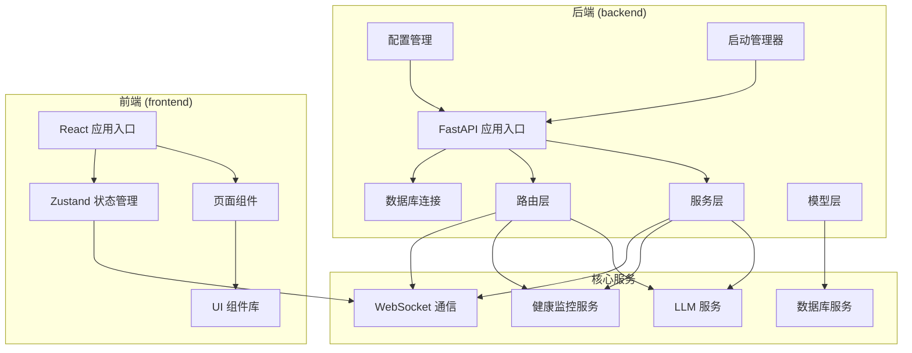
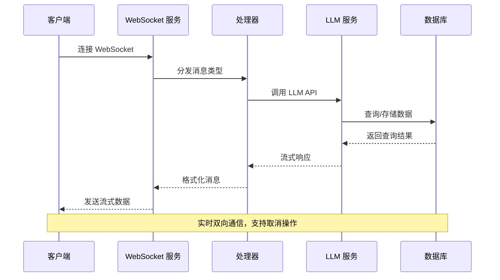
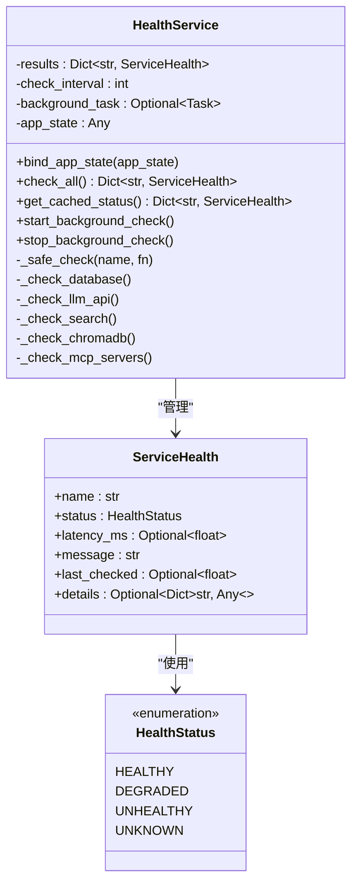
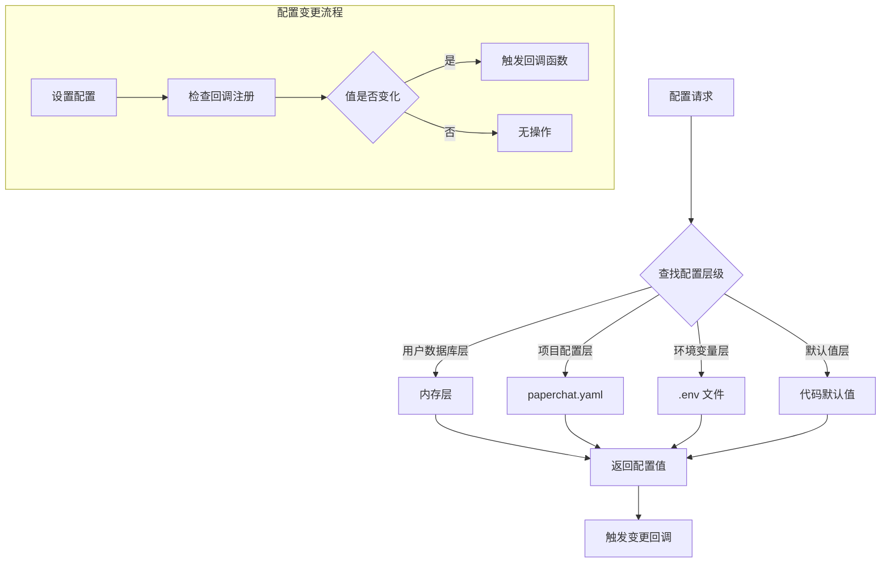
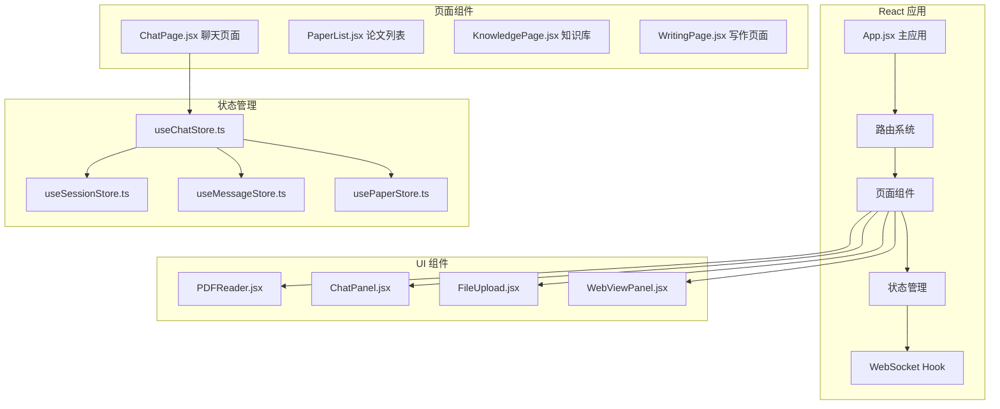
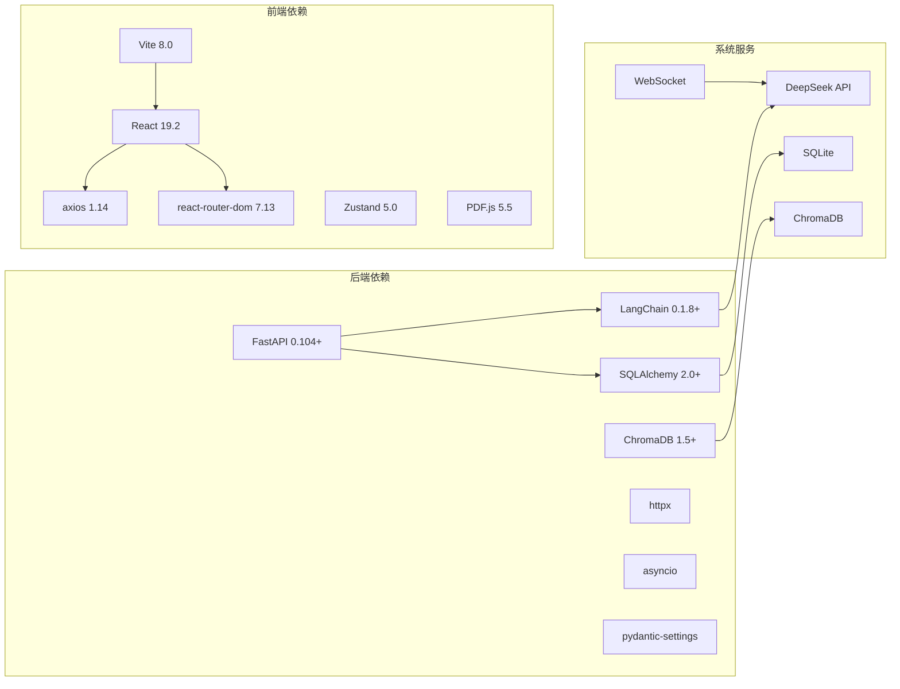

# 健康监控系统

<cite>
**本文档引用的文件**
- [backend/app/main.py](file://backend/app/main.py)
- [backend/app/config.py](file://backend/app/config.py)
- [backend/app/startup.py](file://backend/app/startup.py)
- [backend/app/services/health/health_service.py](file://backend/app/services/health/health_service.py)
- [backend/app/routers/health.py](file://backend/app/routers/health.py)
- [backend/app/routers/ws.py](file://backend/app/routers/ws.py)
- [backend/app/services/llm/llm_service.py](file://backend/app/services/llm/llm_service.py)
- [backend/app/database.py](file://backend/app/database.py)
- [backend/main.py](file://backend/main.py)
- [frontend/src/App.jsx](file://frontend/src/App.jsx)
- [frontend/src/pages/ChatPage.jsx](file://frontend/src/pages/ChatPage.jsx)
- [frontend/src/stores/chatStore.ts](file://frontend/src/stores/chatStore.ts)
- [README.md](file://README.md)
</cite>

## 目录
1. [简介](#简介)
2. [项目结构](#项目结构)
3. [核心组件](#核心组件)
4. [架构概览](#架构概览)
5. [详细组件分析](#详细组件分析)
6. [依赖关系分析](#依赖关系分析)
7. [性能考虑](#性能考虑)
8. [故障排除指南](#故障排除指南)
9. [结论](#结论)

## 简介

PaperChat 是一个基于云端大模型的智能论文分析系统，支持 PDF 上传、AI 论文结构化解析、智能问答、知识管理和写作辅助等功能。该系统采用前后端分离架构，后端基于 FastAPI 和 LangChain，前端基于 React 和 Vite。

系统的核心功能包括：
- 论文管理：PDF 上传、存储、元数据管理、阅读状态追踪
- PDF 阅读器：原生 PDF 渲染、文本选择、页码导航、阅读进度保存
- 论文解析：AI 自动分析论文结构、章节概览、深度分析
- 智能问答：基于 RAG 的多轮对话、会话持久化、引用溯源
- 高亮标注：文本高亮、多色标注、标注管理
- 笔记系统：笔记创建、编辑、关联高亮、笔记面板
- 知识库：知识卡片管理、标签分类、搜索筛选
- 写作辅助：大纲生成、段落生成、学术润色、引用格式、论文对比

## 项目结构

**图表来源**
- [backend/app/main.py:1-390](file://backend/app/main.py#L1-L390)
- [frontend/src/App.jsx:1-183](file://frontend/src/App.jsx#L1-L183)

**章节来源**
- [README.md:72-183](file://README.md#L72-L183)

## 核心组件

### 健康监控服务

健康监控服务是系统的重要组成部分，负责监控所有核心服务的健康状态。该服务提供了并行检查机制，能够同时检查数据库、LLM API、搜索服务、ChromaDB 和 MCP 服务器的状态。

主要特性：
- **并行检查**：使用 asyncio.gather 并行执行所有服务检查
- **缓存机制**：结果缓存 + 后台定期刷新
- **超时保护**：每个检查都有 5 秒超时保护
- **状态枚举**：健康状态包括 healthy、degraded、unhealthy、unknown

### 配置管理系统

配置管理系统实现了四层配置覆盖链，提供了灵活的配置管理机制：

1. **用户数据库层**：运行时覆盖（内存）
2. **项目配置层**：从 paperchat.yaml 加载
3. **环境变量层**：.env 文件配置
4. **默认值层**：代码中的默认配置

### 启动管理器

启动管理器采用分阶段初始化策略，优化应用启动性能：

- **阶段1**：日志 + 数据库（关键路径，同步）
- **阶段2**：RAG/LMM/Agent/设置加载（后台并行）
- **阶段3**：ToolRegistry/MCPManager/SkillRegistry（懒加载）

### WebSocket 通信

系统提供了多种 WebSocket 消息类型，支持实时通信：

- `analyze`：论文章节分析
- `deep_analyze`：论文深度分析  
- `chat`：基础问答
- `rag_chat`：RAG 增强问答
- `cross_doc_chat`：跨文档问答
- `unified_chat`：统一聊天入口
- `agent_chat`：Agent 智能问答

**章节来源**
- [backend/app/services/health/health_service.py:1-395](file://backend/app/services/health/health_service.py#L1-L395)
- [backend/app/config.py:1-244](file://backend/app/config.py#L1-L244)
- [backend/app/startup.py:1-245](file://backend/app/startup.py#L1-L245)
- [backend/app/routers/ws.py:1-275](file://backend/app/routers/ws.py#L1-L275)

## 架构概览

**图表来源**
- [backend/app/routers/ws.py:29-275](file://backend/app/routers/ws.py#L29-L275)
- [backend/app/services/llm/llm_service.py:137-184](file://backend/app/services/llm/llm_service.py#L137-L184)

系统采用事件驱动架构，通过事件总线实现组件间的松耦合通信。所有服务都注册到 app.state 中，便于依赖注入和生命周期管理。

## 详细组件分析

### 健康监控服务架构

**图表来源**
- [backend/app/services/health/health_service.py:46-395](file://backend/app/services/health/health_service.py#L46-L395)

### 配置服务架构

**图表来源**
- [backend/app/config.py:138-244](file://backend/app/config.py#L138-L244)

### 前端应用架构

**图表来源**
- [frontend/src/App.jsx:51-183](file://frontend/src/App.jsx#L51-L183)
- [frontend/src/pages/ChatPage.jsx:30-538](file://frontend/src/pages/ChatPage.jsx#L30-L538)
- [frontend/src/stores/chatStore.ts:71-146](file://frontend/src/stores/chatStore.ts#L71-L146)

**章节来源**
- [backend/app/services/health/health_service.py:46-395](file://backend/app/services/health/health_service.py#L46-L395)
- [backend/app/config.py:138-244](file://backend/app/config.py#L138-L244)
- [frontend/src/App.jsx:51-183](file://frontend/src/App.jsx#L51-L183)
- [frontend/src/pages/ChatPage.jsx:30-538](file://frontend/src/pages/ChatPage.jsx#L30-L538)
- [frontend/src/stores/chatStore.ts:71-146](file://frontend/src/stores/chatStore.ts#L71-L146)

## 依赖关系分析

**图表来源**
- [README.md:56-71](file://README.md#L56-L71)

系统的关键依赖关系：
- **后端**：FastAPI 作为 Web 框架，LangChain 作为 LLM 编排框架，SQLAlchemy 作为 ORM，ChromaDB 作为向量数据库
- **前端**：React 作为 UI 框架，Vite 作为构建工具，Zustand 作为状态管理
- **系统服务**：DeepSeek API 提供大模型服务，ChromaDB 提供向量检索，SQLite 提供数据存储

**章节来源**
- [README.md:56-71](file://README.md#L56-L71)

## 性能考虑

### 启动性能优化

系统采用分阶段启动策略，通过并行初始化关键服务来优化启动时间：

- **阶段1**：同步初始化日志和数据库，确保关键基础设施就绪
- **阶段2**：异步并行初始化 RAG、LLM、Agent、设置等核心服务
- **阶段3**：懒加载 ToolRegistry、MCPManager、SkillRegistry 等非关键服务

### 健康检查优化

健康监控服务采用了多项性能优化措施：

- **并行检查**：使用 asyncio.gather 并行执行所有服务检查，总延迟 = 最慢的服务
- **缓存机制**：后台定期检查结果缓存，前端轮询时直接读取缓存
- **超时保护**：每个检查都有 5 秒超时保护，避免阻塞
- **后台检查**：默认 60 秒检查间隔，CPU 开销可忽略

### WebSocket 性能

WebSocket 通信采用了以下优化策略：

- **流式传输**：支持实时流式输出，提高用户体验
- **任务取消**：支持取消当前运行的任务，避免资源浪费
- **消息压缩**：启用 permessage-deflate 压缩，减少网络传输量
- **并发控制**：每个连接维护独立状态，避免相互干扰

## 故障排除指南

### 健康检查常见问题

1. **数据库连接失败**
   - 检查 DATABASE_URL 配置
   - 确认数据库服务正常运行
   - 验证网络连接和防火墙设置

2. **LLM API 认证失败**
   - 检查 DEEPSEEK_API_KEY 配置
   - 验证 API Key 有效性
   - 确认网络访问权限

3. **ChromaDB 连接问题**
   - 检查 chroma_db 目录权限
   - 验证磁盘空间充足
   - 确认端口未被占用

### WebSocket 连接问题

1. **连接超时**
   - 检查网络连接稳定性
   - 验证防火墙设置
   - 确认服务器端口开放

2. **消息丢失**
   - 检查客户端 WebSocket 状态
   - 验证消息格式正确性
   - 确认服务端处理逻辑

### 配置问题

1. **配置不生效**
   - 检查配置优先级顺序
   - 验证配置文件格式
   - 确认环境变量设置

2. **热更新失败**
   - 检查回调函数实现
   - 验证配置键名正确性
   - 确认服务重启策略

**章节来源**
- [backend/app/services/health/health_service.py:116-335](file://backend/app/services/health/health_service.py#L116-L335)
- [backend/app/routers/ws.py:263-275](file://backend/app/routers/ws.py#L263-L275)

## 结论

PaperChat 健康监控系统是一个设计精良的现代化应用，具有以下特点：

**架构优势**：
- 采用分层架构，职责分离明确
- 使用事件驱动模式，组件间松耦合
- 支持异步处理，提高系统吞吐量
- 实现了完整的健康监控机制

**技术特色**：
- 基于 FastAPI 和 LangChain 的现代后端架构
- React + Vite 的现代化前端技术栈
- 完善的配置管理系统
- 高性能的 WebSocket 通信机制

**性能表现**：
- 分阶段启动优化，启动速度快
- 健康检查缓存机制，降低检查开销
- 并行处理能力，提高响应速度
- 流式传输优化，改善用户体验

该系统为学术论文处理提供了完整的解决方案，具有良好的扩展性和维护性，适合在生产环境中部署使用。