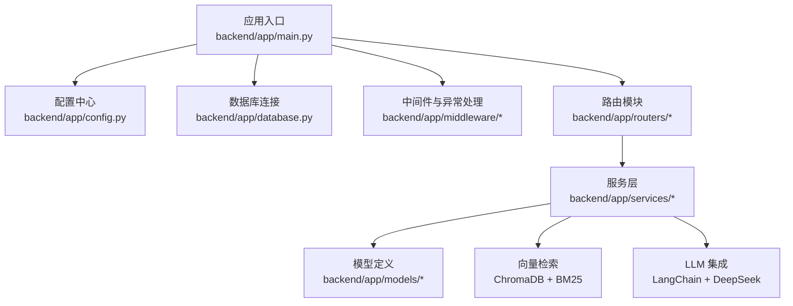
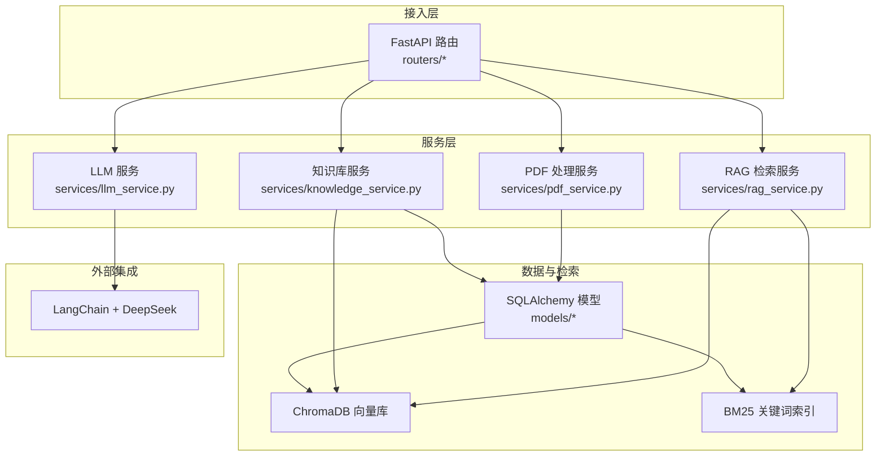
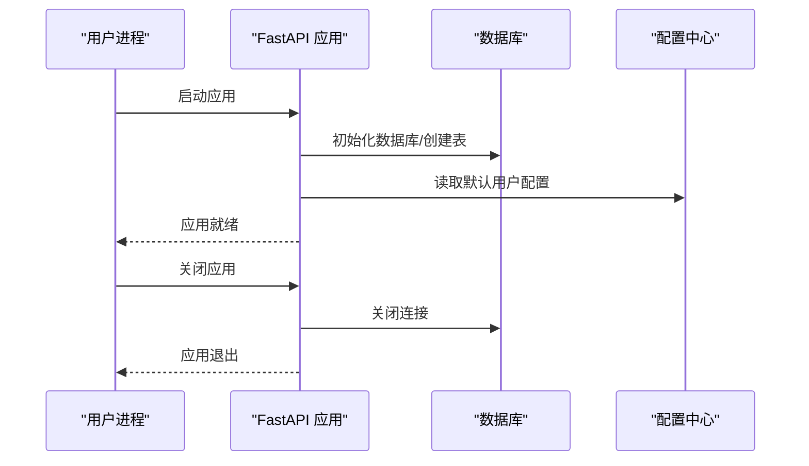
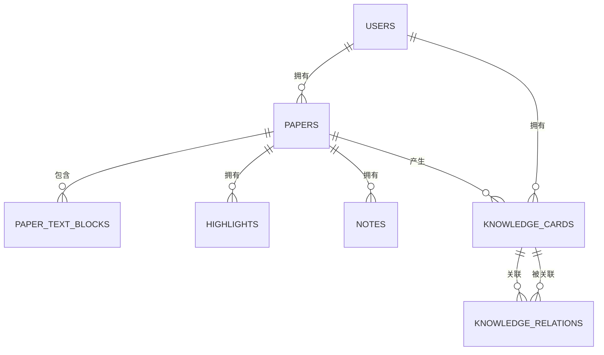
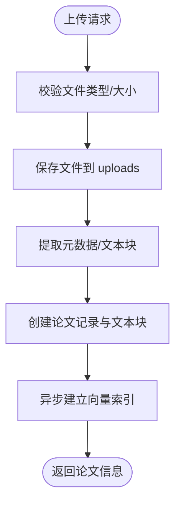
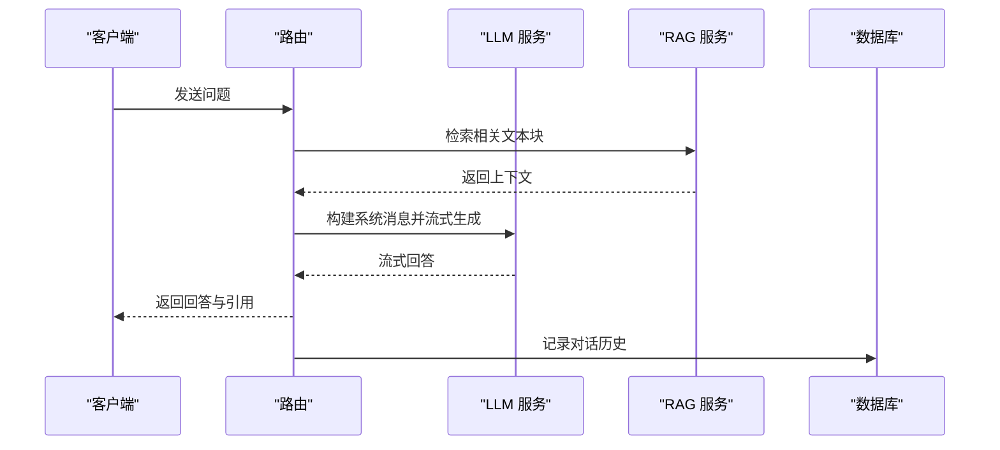
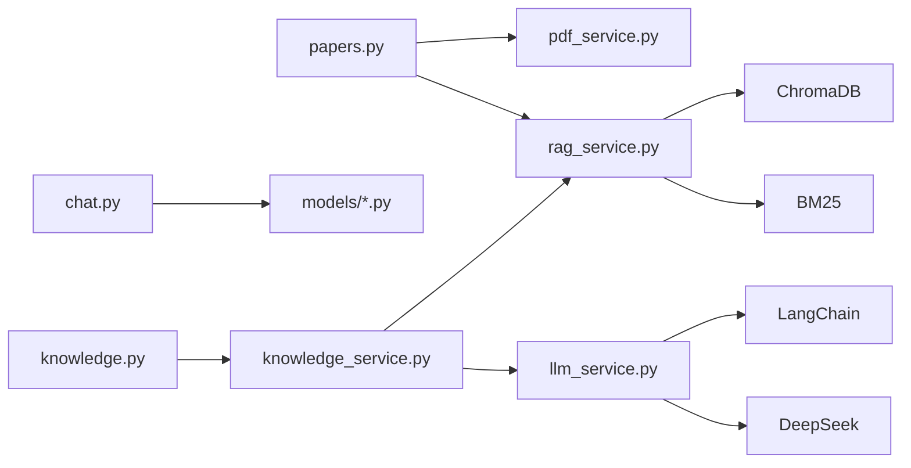

# 后端系统

<cite>
**本文档引用的文件**
- [backend/app/main.py](file://backend/app/main.py)
- [backend/app/config.py](file://backend/app/config.py)
- [backend/app/database.py](file://backend/app/database.py)
- [backend/app/middleware/error_handler.py](file://backend/app/middleware/error_handler.py)
- [backend/app/models/__init__.py](file://backend/app/models/__init__.py)
- [backend/app/models/paper.py](file://backend/app/models/paper.py)
- [backend/app/models/knowledge.py](file://backend/app/models/knowledge.py)
- [backend/app/routers/papers.py](file://backend/app/routers/papers.py)
- [backend/app/routers/chat.py](file://backend/app/routers/chat.py)
- [backend/app/routers/knowledge.py](file://backend/app/routers/knowledge.py)
- [backend/app/routers/notes.py](file://backend/app/routers/notes.py)
- [backend/app/services/pdf_service.py](file://backend/app/services/pdf_service.py)
- [backend/app/services/llm_service.py](file://backend/app/services/llm_service.py)
- [backend/app/services/rag_service.py](file://backend/app/services/rag_service.py)
- [backend/app/services/knowledge_service.py](file://backend/app/services/knowledge_service.py)
</cite>

## 目录
1. [简介](#简介)
2. [项目结构](#项目结构)
3. [核心组件](#核心组件)
4. [架构总览](#架构总览)
5. [详细组件分析](#详细组件分析)
6. [依赖分析](#依赖分析)
7. [性能考虑](#性能考虑)
8. [故障排查指南](#故障排查指南)
9. [结论](#结论)
10. [附录](#附录)

## 简介
PaperChat 后端系统基于 FastAPI 构建，采用异步 SQLAlchemy ORM，提供论文上传、解析、RAG 检索、智能问答、高亮标注、笔记管理、知识库与写作辅助等能力。系统通过 LangChain 集成 DeepSeek 大模型，结合 ChromaDB 向量检索与 BM25 关键词检索，实现高效、可扩展的学术阅读与问答体验。

## 项目结构
后端采用“按功能域划分”的模块化组织方式：
- 应用入口与生命周期：backend/app/main.py
- 配置中心：backend/app/config.py
- 数据库与模型：backend/app/database.py、backend/app/models/*
- 中间件与异常处理：backend/app/middleware/*
- 路由模块：backend/app/routers/*
- 服务层：backend/app/services/*
- 迁移与初始化：backend/migrations/*、backend/alembic.ini

图表来源
- [backend/app/main.py:1-114](file://backend/app/main.py#L1-L114)
- [backend/app/config.py:1-44](file://backend/app/config.py#L1-L44)
- [backend/app/database.py:1-81](file://backend/app/database.py#L1-L81)

章节来源
- [backend/app/main.py:1-114](file://backend/app/main.py#L1-L114)
- [backend/app/config.py:1-44](file://backend/app/config.py#L1-L44)
- [backend/app/database.py:1-81](file://backend/app/database.py#L1-L81)

## 核心组件
- FastAPI 应用与生命周期：通过 lifespan 管理数据库初始化、默认用户配置加载与关闭。
- 中间件与异常处理：统一处理 Pydantic 校验、HTTP、SQLAlchemy 与通用异常。
- 数据库与模型：异步 SQLAlchemy 引擎、会话工厂；论文、文本块、高亮、笔记、知识卡、关系等模型。
- 服务层：PDF 解析、LLM 对话、RAG 检索、知识库管理、写作辅助等。
- 路由系统：论文管理、聊天会话、知识库、笔记、阅读与分析等模块化路由。

章节来源
- [backend/app/main.py:16-53](file://backend/app/main.py#L16-L53)
- [backend/app/middleware/error_handler.py:73-92](file://backend/app/middleware/error_handler.py#L73-L92)
- [backend/app/database.py:30-81](file://backend/app/database.py#L30-L81)
- [backend/app/models/__init__.py:15-29](file://backend/app/models/__init__.py#L15-L29)

## 架构总览
系统采用“路由 → 服务 → 数据库/外部服务”的分层架构，异步 I/O 与流式响应贯穿全文档与问答流程，确保高并发下的低延迟与良好用户体验。

图表来源
- [backend/app/routers/papers.py:1-1034](file://backend/app/routers/papers.py#L1-L1034)
- [backend/app/services/llm_service.py:1-1058](file://backend/app/services/llm_service.py#L1-L1058)
- [backend/app/services/rag_service.py:1-400](file://backend/app/services/rag_service.py#L1-L400)
- [backend/app/services/pdf_service.py:1-194](file://backend/app/services/pdf_service.py#L1-L194)
- [backend/app/services/knowledge_service.py:1-662](file://backend/app/services/knowledge_service.py#L1-L662)

## 详细组件分析

### 应用入口与生命周期
- 生命周期管理：启动时初始化数据库、创建表、加载默认用户配置；关闭时释放数据库连接。
- CORS 与异常处理：注册 CORS 中间件与全局异常处理器。
- 路由注册：集中注册论文、高亮、笔记、聊天、知识库、写作、推荐、设置等路由。

图表来源
- [backend/app/main.py:16-53](file://backend/app/main.py#L16-L53)
- [backend/app/database.py:50-81](file://backend/app/database.py#L50-L81)

章节来源
- [backend/app/main.py:55-99](file://backend/app/main.py#L55-L99)
- [backend/app/main.py:102-114](file://backend/app/main.py#L102-L114)

### 中间件与异常处理
- 统一异常处理：Pydantic 校验错误、HTTP 异常、SQLAlchemy 错误与通用异常，返回标准化 JSON。
- 便于前端与客户端统一处理错误码与消息。

章节来源
- [backend/app/middleware/error_handler.py:11-92](file://backend/app/middleware/error_handler.py#L11-L92)

### 数据库与模型
- 异步引擎与会话：基于 aiosqlite（开发环境）创建异步引擎与会话工厂，提供依赖注入。
- 模型设计：论文 Paper 与文本块 PaperTextBlock，知识卡 KnowledgeCard 与关系 KnowledgeRelation，以及用户、高亮、笔记、聊天会话等。
- 关系映射：一对多/多对多关系，级联删除保证数据一致性。

图表来源
- [backend/app/models/paper.py:11-85](file://backend/app/models/paper.py#L11-L85)
- [backend/app/models/knowledge.py:14-80](file://backend/app/models/knowledge.py#L14-L80)
- [backend/app/models/__init__.py:15-29](file://backend/app/models/__init__.py#L15-L29)

章节来源
- [backend/app/database.py:13-48](file://backend/app/database.py#L13-L48)
- [backend/app/models/paper.py:11-85](file://backend/app/models/paper.py#L11-L85)
- [backend/app/models/knowledge.py:14-80](file://backend/app/models/knowledge.py#L14-L80)

### 路由系统：论文管理
- 功能覆盖：上传/批量上传、删除、元数据与文本提取、阅读状态更新、分页与筛选。
- 安全与权限：每个路由均校验当前用户与论文归属。
- 异步索引：上传完成后异步建立向量索引，不阻塞响应。
- 批量导入：支持 ZIP 包含多 PDF 的批量处理。

图表来源
- [backend/app/routers/papers.py:156-262](file://backend/app/routers/papers.py#L156-L262)
- [backend/app/routers/papers.py:521-647](file://backend/app/routers/papers.py#L521-L647)

章节来源
- [backend/app/routers/papers.py:91-154](file://backend/app/routers/papers.py#L91-L154)
- [backend/app/routers/papers.py:156-262](file://backend/app/routers/papers.py#L156-L262)
- [backend/app/routers/papers.py:419-519](file://backend/app/routers/papers.py#L419-L519)

### 路由系统：聊天与会话
- 会话管理：创建、查询、更新、删除；支持单论文与跨文档会话。
- 消息历史：按时间顺序返回消息，支持分页。
- 权限校验：所有操作均验证会话归属。

章节来源
- [backend/app/routers/chat.py:21-417](file://backend/app/routers/chat.py#L21-L417)

### 路由系统：知识库
- 卡片管理：CRUD、搜索、自动标签、自动生成摘要。
- 关联管理：发现与创建关联，支持多种关系类型。
- 图谱与统计：生成知识图谱数据与统计信息。
- 向量化检索：结合向量与关键词检索，提供全局搜索。

章节来源
- [backend/app/routers/knowledge.py:130-550](file://backend/app/routers/knowledge.py#L130-L550)
- [backend/app/services/knowledge_service.py:79-662](file://backend/app/services/knowledge_service.py#L79-L662)

### 路由系统：笔记
- 笔记 CRUD：支持与高亮关联，按论文聚合展示。
- 搜索：模糊匹配内容，支持限定论文范围。

章节来源
- [backend/app/routers/notes.py:21-350](file://backend/app/routers/notes.py#L21-L350)

### 服务层：LLM 服务（LangChain + DeepSeek）
- 提示词工程：论文分析、问答、术语解释、摘要、翻译、深度分析、多论文对比、综述生成、大纲与润色等。
- 对话流式输出：支持标准问答与 RAG 问答，流式返回回答。
- 跨文档问答：整合多篇论文上下文，标注来源。
- 配置热更新：支持运行时更新模型、温度、最大 token、API Key 与 Base URL。

图表来源
- [backend/app/services/llm_service.py:504-583](file://backend/app/services/llm_service.py#L504-L583)
- [backend/app/services/rag_service.py:233-307](file://backend/app/services/rag_service.py#L233-L307)

章节来源
- [backend/app/services/llm_service.py:360-800](file://backend/app/services/llm_service.py#L360-L800)

### 服务层：RAG 检索服务
- 智能分块：按文本块边界与重叠策略分块，保留页码信息。
- 向量索引：ChromaDB 持久化，支持懒加载嵌入模型与线程池执行。
- 混合检索：语义检索 + BM25 关键词检索，RRF 融合排序。
- 跨文档检索：并行检索多论文，合并排序。
- 缓存与失效：BM25 索引缓存，重建/删除时清理。

章节来源
- [backend/app/services/rag_service.py:16-400](file://backend/app/services/rag_service.py#L16-L400)

### 服务层：PDF 处理服务
- 元数据提取：标题、作者、页数。
- 文本块提取：字符级坐标信息，按行合并，保留边界框。
- 全文提取：用于 LLM 分析。
- 校验与页数：基础校验与页数获取。

章节来源
- [backend/app/services/pdf_service.py:11-194](file://backend/app/services/pdf_service.py#L11-L194)

### 服务层：知识库服务
- 自动提取：从高亮与问答内容提取知识卡片。
- 自动标签：基于 LLM 生成标签。
- 关联发现：分析新卡片与现有卡片的潜在关系。
- 全局检索：向量检索 + 关键词检索融合。
- 图谱与统计：生成节点与边，统计分布。

章节来源
- [backend/app/services/knowledge_service.py:79-662](file://backend/app/services/knowledge_service.py#L79-L662)

## 依赖分析
- 路由到服务：论文路由依赖 PDF 与 RAG 服务；聊天路由依赖会话与消息持久化；知识库路由依赖知识库服务。
- 服务到外部：LLM 服务依赖 LangChain 与 DeepSeek；RAG 服务依赖 ChromaDB 与 BM25。
- 数据模型：论文与文本块、知识卡与关系、用户与高亮/笔记/聊天等形成清晰的外键关系。

图表来源
- [backend/app/routers/papers.py:25-28](file://backend/app/routers/papers.py#L25-L28)
- [backend/app/routers/chat.py:13-16](file://backend/app/routers/chat.py#L13-L16)
- [backend/app/routers/knowledge.py:16](file://backend/app/routers/knowledge.py#L16)
- [backend/app/services/knowledge_service.py:15-16](file://backend/app/services/knowledge_service.py#L15-L16)
- [backend/app/services/rag_service.py:11-13](file://backend/app/services/rag_service.py#L11-L13)
- [backend/app/services/llm_service.py:4-8](file://backend/app/services/llm_service.py#L4-L8)

章节来源
- [backend/app/routers/papers.py:1-1034](file://backend/app/routers/papers.py#L1-L1034)
- [backend/app/routers/chat.py:1-417](file://backend/app/routers/chat.py#L1-L417)
- [backend/app/routers/knowledge.py:1-550](file://backend/app/routers/knowledge.py#L1-L550)
- [backend/app/services/knowledge_service.py:1-662](file://backend/app/services/knowledge_service.py#L1-L662)
- [backend/app/services/rag_service.py:1-400](file://backend/app/services/rag_service.py#L1-L400)
- [backend/app/services/llm_service.py:1-1058](file://backend/app/services/llm_service.py#L1-L1058)

## 性能考虑
- 异步 I/O：数据库与 LLM 调用均采用异步，避免阻塞。
- 流式响应：问答与分析采用流式输出，降低首字节延迟。
- 向量化检索：ChromaDB + BM25 混合检索，RRF 融合提升召回与精度。
- 懒加载与缓存：嵌入模型懒加载、BM25 索引缓存减少冷启动与重复计算。
- 分块策略：智能分块与重叠，兼顾检索精度与上下文连贯性。
- 批量导入：ZIP 批量上传与并行检索，提升吞吐。

## 故障排查指南
- 健康检查：/api/health 返回应用状态。
- 异常处理：统一返回 JSON，包含错误码与消息；数据库错误与未捕获异常均有标准响应。
- 常见问题定位：
  - 上传失败：检查文件类型、大小限制与磁盘空间。
  - 索引失败：确认 ChromaDB 可写、模型加载成功。
  - 问答无结果：确认论文已完成索引、检索 top_k 设置合理。
  - 权限错误：确认当前用户与资源归属一致。

章节来源
- [backend/app/main.py:102-114](file://backend/app/main.py#L102-L114)
- [backend/app/middleware/error_handler.py:11-92](file://backend/app/middleware/error_handler.py#L11-L92)

## 结论
PaperChat 后端系统以 FastAPI 为核心，结合异步数据库、LangChain 与向量检索，构建了面向学术论文的智能阅读与问答平台。通过模块化设计与清晰的分层架构，系统具备良好的可维护性与扩展性，能够支撑论文上传、阅读、问答、知识沉淀与写作辅助等核心场景。

## 附录
- 配置项：应用名、调试模式、数据库 URL、API Key、JWT、CORS、上传目录与大小限制等。
- 数据库初始化：启动时创建表并确保默认用户存在。
- 服务单例：各服务以全局单例形式提供，避免重复初始化。

章节来源
- [backend/app/config.py:15-44](file://backend/app/config.py#L15-L44)
- [backend/app/database.py:50-81](file://backend/app/database.py#L50-L81)