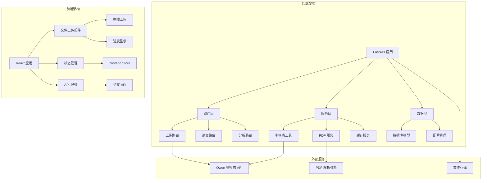
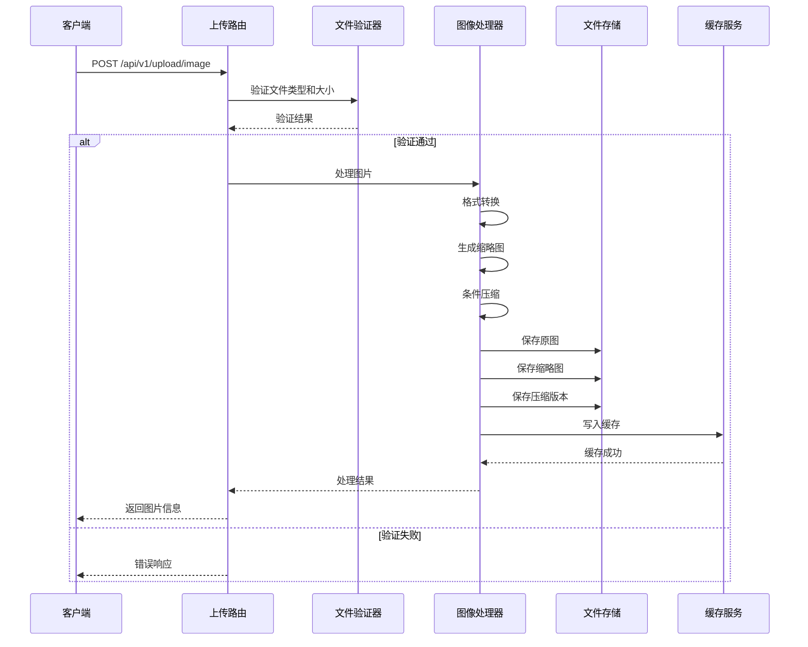
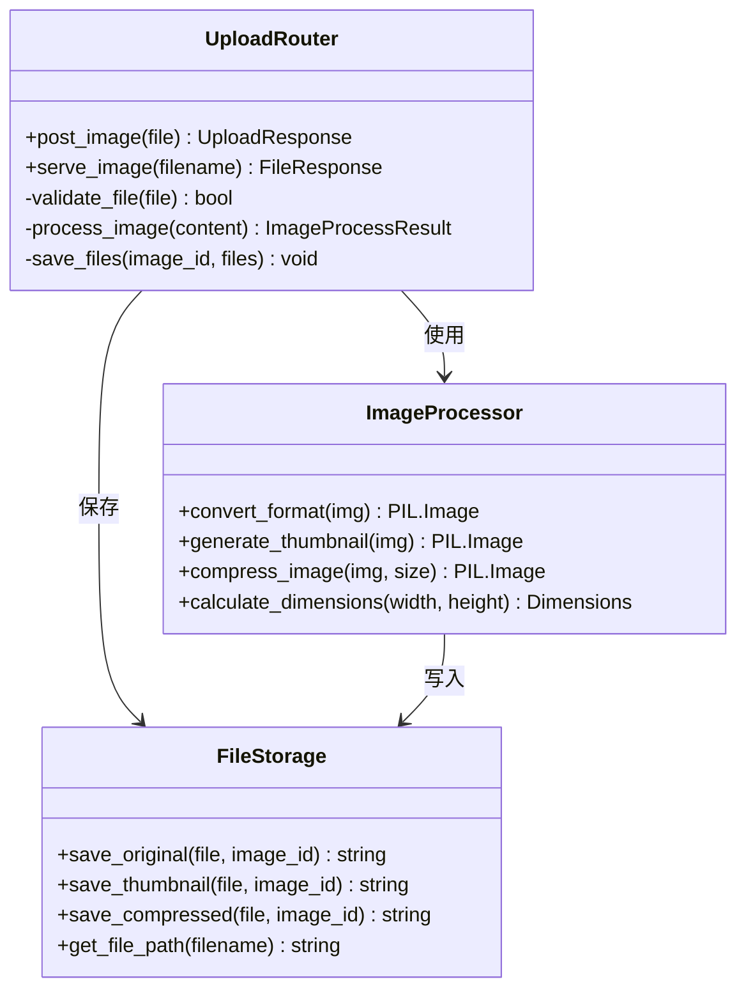
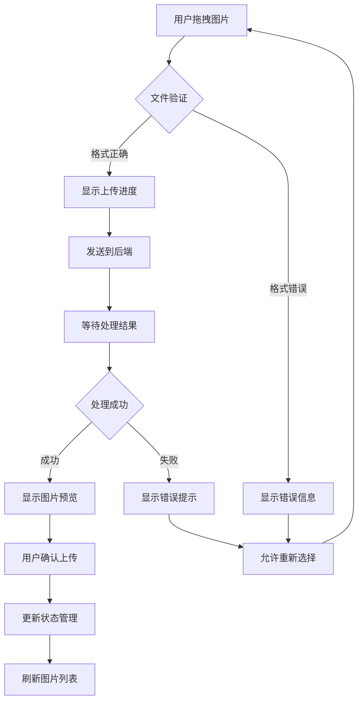
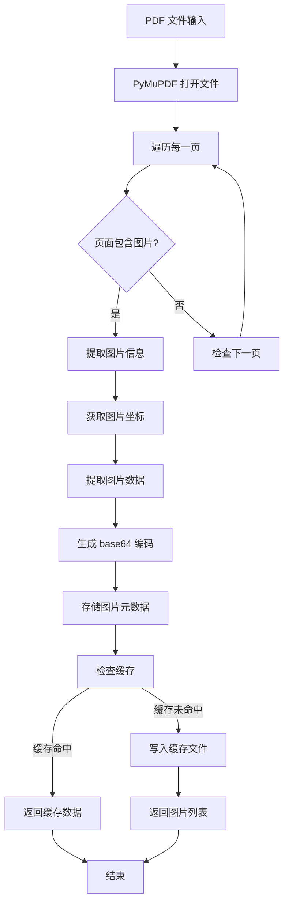
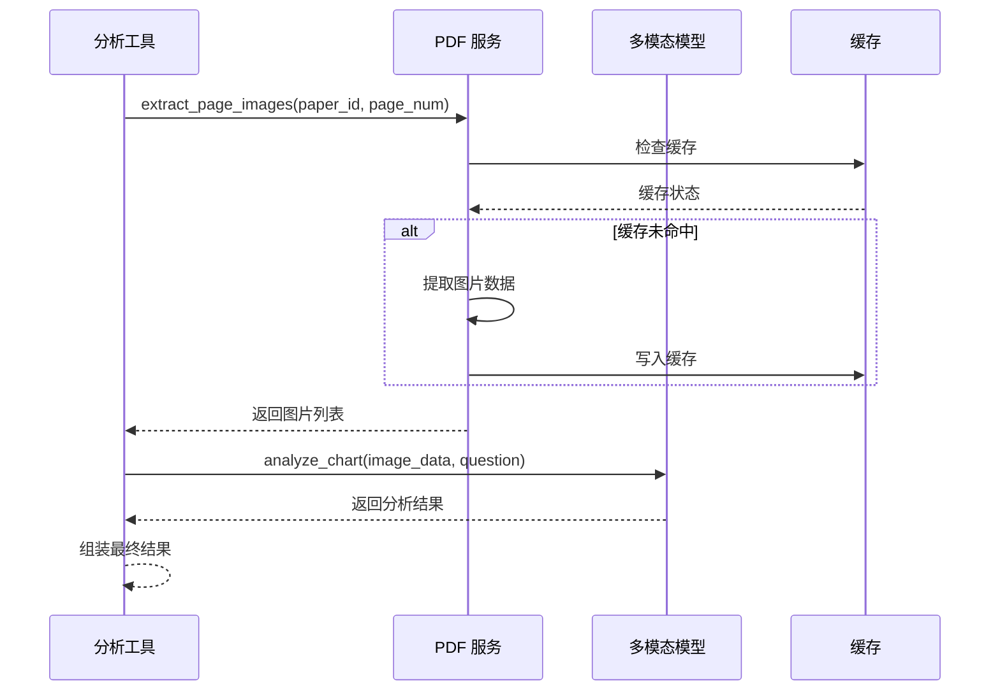
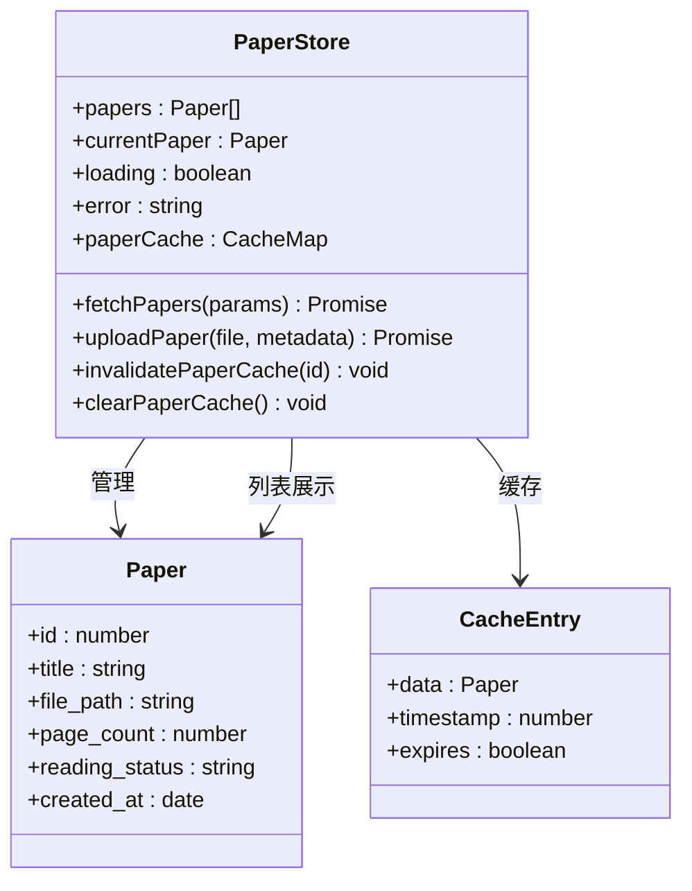
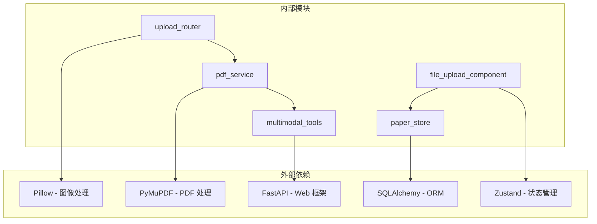

# 图像上传系统

<cite>
**本文档引用的文件**
- [backend/app/routers/upload.py](file://backend/app/routers/upload.py)
- [backend/app/services/pdf_service.py](file://backend/app/services/pdf_service.py)
- [frontend/src/components/FileUpload/FileUpload.jsx](file://frontend/src/components/FileUpload/FileUpload.jsx)
- [backend/app/main.py](file://backend/app/main.py)
- [backend/app/config.py](file://backend/app/config.py)
- [frontend/src/stores/paperStore.ts](file://frontend/src/stores/paperStore.ts)
- [backend/app/models/paper.py](file://backend/app/models/paper.py)
- [backend/app/routers/papers.py](file://backend/app/routers/papers.py)
- [backend/app/schemas/paper.py](file://backend/app/schemas/paper.py)
- [backend/app/tools/multimodal_tools.py](file://backend/app/tools/multimodal_tools.py)
</cite>

## 目录
1. [简介](#简介)
2. [项目结构](#项目结构)
3. [核心组件](#核心组件)
4. [架构概览](#架构概览)
5. [详细组件分析](#详细组件分析)
6. [依赖关系分析](#依赖关系分析)
7. [性能考虑](#性能考虑)
8. [故障排除指南](#故障排除指南)
9. [结论](#结论)

## 简介

图像上传系统是一个基于 FastAPI 和 React 的现代化文档处理平台，专注于学术论文的图像处理和分析。该系统提供了完整的图像上传、压缩、缓存和多模态分析功能，支持 PDF 文件的图片提取和图表分析。

系统采用前后端分离架构，后端使用 Python FastAPI 提供 RESTful API，前端使用 React 构建用户界面。核心功能包括：

- **图像上传与处理**：支持多种图片格式，自动压缩和缩放
- **PDF 图片提取**：基于 PyMuPDF 的专业 PDF 图片提取技术
- **多模态分析**：集成 Qwen 多模态模型进行图表识别和分析
- **智能缓存**：高效的图片缓存机制提升性能
- **安全存储**：完整的文件管理和访问控制

## 项目结构

**图表来源**
- [backend/app/main.py:295-370](file://backend/app/main.py#L295-L370)
- [frontend/src/components/FileUpload/FileUpload.jsx:1-92](file://frontend/src/components/FileUpload/FileUpload.jsx#L1-L92)

**章节来源**
- [backend/app/main.py:1-399](file://backend/app/main.py#L1-L399)
- [backend/app/routers/upload.py:1-87](file://backend/app/routers/upload.py#L1-L87)

## 核心组件

### 1. 图像上传路由

图像上传功能位于 `/api/v1/upload` 路由下，提供完整的图片处理流程：

- **文件验证**：检查文件类型和大小限制
- **格式转换**：自动处理透明背景和格式标准化
- **多版本保存**：保存原图、缩略图和压缩版本
- **智能压缩**：根据文件大小自动选择压缩策略

### 2. PDF 图片提取服务

基于 PyMuPDF 的专业 PDF 处理能力：

- **图片提取**：提取 PDF 中的所有嵌入图片
- **缓存机制**：MD5 哈希缓存提升重复访问性能
- **坐标定位**：精确记录图片在页面中的位置
- **类型识别**：支持多种图片格式（PNG、JPG、GIF等）

### 3. 多模态分析工具

集成 Qwen 多模态模型的强大分析能力：

- **图表分析**：识别和分析论文中的图表
- **表格提取**：将表格转换为结构化数据
- **视觉搜索**：基于图片内容的智能搜索
- **自动检测**：自动定位包含图表或表格的页面

**章节来源**
- [backend/app/routers/upload.py:20-75](file://backend/app/routers/upload.py#L20-L75)
- [backend/app/services/pdf_service.py:228-284](file://backend/app/services/pdf_service.py#L228-L284)
- [backend/app/tools/multimodal_tools.py:18-95](file://backend/app/tools/multimodal_tools.py#L18-L95)

## 架构概览

**图表来源**
- [backend/app/routers/upload.py:20-75](file://backend/app/routers/upload.py#L20-L75)
- [backend/app/services/pdf_service.py:202-267](file://backend/app/services/pdf_service.py#L202-L267)

### 系统架构设计

系统采用分层架构设计，确保各组件职责清晰：

1. **表现层**：React 前端组件负责用户交互
2. **API 层**：FastAPI 路由处理 HTTP 请求
3. **业务层**：服务类封装核心业务逻辑
4. **数据层**：SQLAlchemy ORM 管理数据库操作

## 详细组件分析

### 图像上传组件

#### 后端实现分析

**图表来源**
- [backend/app/routers/upload.py:20-75](file://backend/app/routers/upload.py#L20-L75)
- [backend/app/routers/upload.py:78-86](file://backend/app/routers/upload.py#L78-L86)

#### 前端交互流程

**图表来源**
- [frontend/src/components/FileUpload/FileUpload.jsx:12-42](file://frontend/src/components/FileUpload/FileUpload.jsx#L12-L42)

**章节来源**
- [backend/app/routers/upload.py:20-86](file://backend/app/routers/upload.py#L20-L86)
- [frontend/src/components/FileUpload/FileUpload.jsx:1-92](file://frontend/src/components/FileUpload/FileUpload.jsx#L1-L92)

### PDF 图片处理组件

#### 图片提取算法

**图表来源**
- [backend/app/services/pdf_service.py:228-269](file://backend/app/services/pdf_service.py#L228-L269)

#### 多模态分析流程

**图表来源**
- [backend/app/tools/multimodal_tools.py:32-95](file://backend/app/tools/multimodal_tools.py#L32-L95)

**章节来源**
- [backend/app/services/pdf_service.py:228-327](file://backend/app/services/pdf_service.py#L228-L327)
- [backend/app/tools/multimodal_tools.py:18-324](file://backend/app/tools/multimodal_tools.py#L18-L324)

### 状态管理系统

#### 前端状态设计

**图表来源**
- [frontend/src/stores/paperStore.ts:19-53](file://frontend/src/stores/paperStore.ts#L19-L53)

**章节来源**
- [frontend/src/stores/paperStore.ts:148-174](file://frontend/src/stores/paperStore.ts#L148-L174)

## 依赖关系分析

### 核心依赖图

**图表来源**
- [backend/app/routers/upload.py:5-12](file://backend/app/routers/upload.py#L5-L12)
- [backend/app/services/pdf_service.py:5-15](file://backend/app/services/pdf_service.py#L5-L15)

### 配置管理

系统采用多层配置管理机制：

1. **代码默认值**：基础配置参数
2. **环境变量**：运行时配置覆盖
3. **项目配置**：YAML 文件配置
4. **用户设置**：数据库动态配置

**章节来源**
- [backend/app/config.py:29-94](file://backend/app/config.py#L29-L94)
- [backend/app/main.py:295-370](file://backend/app/main.py#L295-L370)

## 性能考虑

### 图像处理性能

| 操作类型 | 处理时间 | 内存使用 | 存储空间 |
|---------|---------|---------|---------|
| 图片上传 | 200-500ms | 低 | 原图 + 缩略图 + 压缩版本 |
| PDF 图片提取 | 100-500ms/页 | 中等 | 原始图片 + 缓存文件 |
| 图表分析 | 2-5秒/张 | 高 | LLM API 调用 |
| 缓存命中 | <50ms | 低 | JSON 缓存文件 |

### 缓存策略

系统实现了多层次缓存机制：

1. **图片缓存**：基于 MD5 哈希的文件缓存
2. **状态缓存**：Zustand 内存缓存
3. **API 缓存**：请求去重和缓存管理

### 优化建议

1. **并发处理**：支持多图片同时上传和处理
2. **增量缓存**：只缓存新提取的图片
3. **智能压缩**：根据网络状况调整压缩质量
4. **预加载机制**：提前加载常用图片

## 故障排除指南

### 常见问题及解决方案

#### 图像上传失败

**问题症状**：
- 上传过程中断
- 文件大小超限错误
- 格式不支持提示

**解决步骤**：
1. 检查文件格式是否为支持的图片类型
2. 验证文件大小是否超过限制
3. 确认上传目录权限设置
4. 查看服务器磁盘空间

#### PDF 图片提取异常

**问题症状**：
- 图片提取失败
- 缓存文件损坏
- 性能下降

**解决步骤**：
1. 检查 PDF 文件完整性
2. 清理损坏的缓存文件
3. 验证 PyMuPDF 安装
4. 检查内存使用情况

#### 多模态分析错误

**问题症状**：
- LLM 分析失败
- 图片描述不准确
- 搜索结果异常

**解决步骤**：
1. 检查 API 密钥配置
2. 验证网络连接
3. 确认模型可用性
4. 查看错误日志

**章节来源**
- [backend/app/routers/upload.py:27-33](file://backend/app/routers/upload.py#L27-L33)
- [backend/app/services/pdf_service.py:234-241](file://backend/app/services/pdf_service.py#L234-L241)

## 结论

图像上传系统是一个功能完整、性能优异的文档处理平台。系统的主要优势包括：

### 技术优势

1. **高性能处理**：优化的图像处理算法和缓存机制
2. **多模态能力**：集成先进的 AI 模型进行智能分析
3. **可扩展架构**：清晰的分层设计支持功能扩展
4. **用户体验**：直观的界面和流畅的交互体验

### 应用价值

- **学术研究**：支持论文图片的智能分析和检索
- **企业文档**：自动化处理大量 PDF 文档
- **教育领域**：辅助教学和学习资源管理
- **内容创作**：支持多媒体内容的创作和分享

### 发展方向

1. **AI 能力增强**：持续改进多模态分析准确性
2. **性能优化**：进一步提升处理速度和并发能力
3. **功能扩展**：支持更多文档格式和处理需求
4. **用户体验**：持续优化界面设计和交互流程

该系统为现代文档处理需求提供了完整的解决方案，具有良好的技术基础和发展前景。