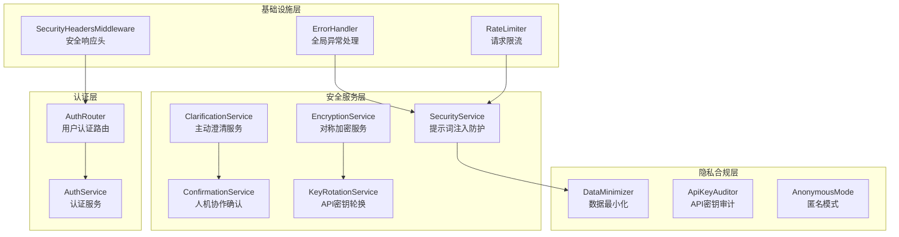
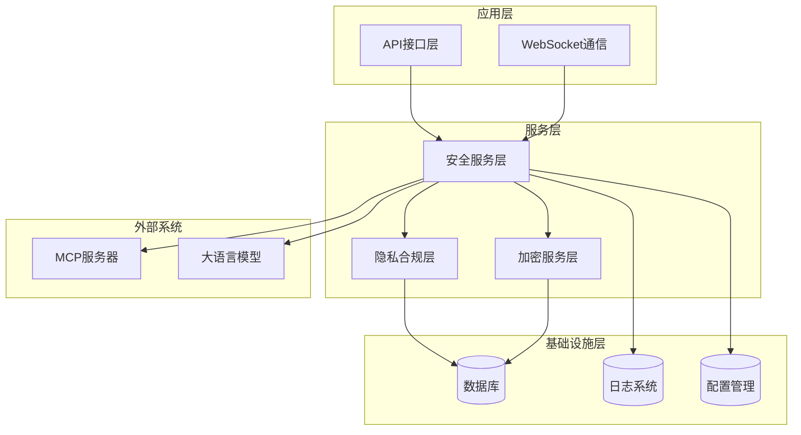
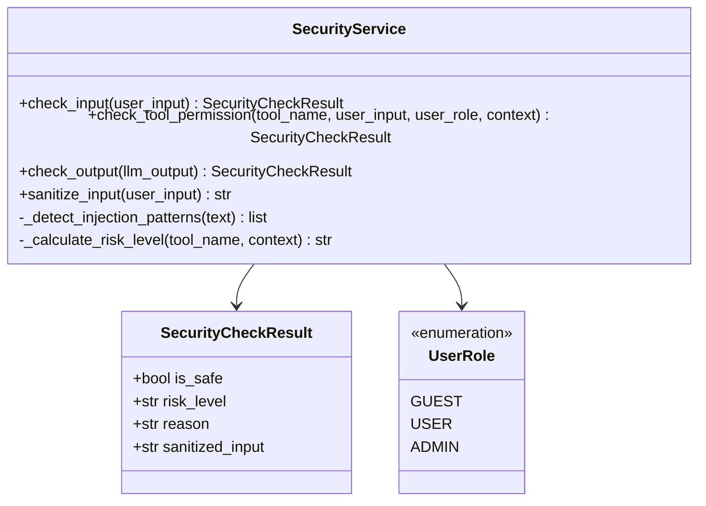
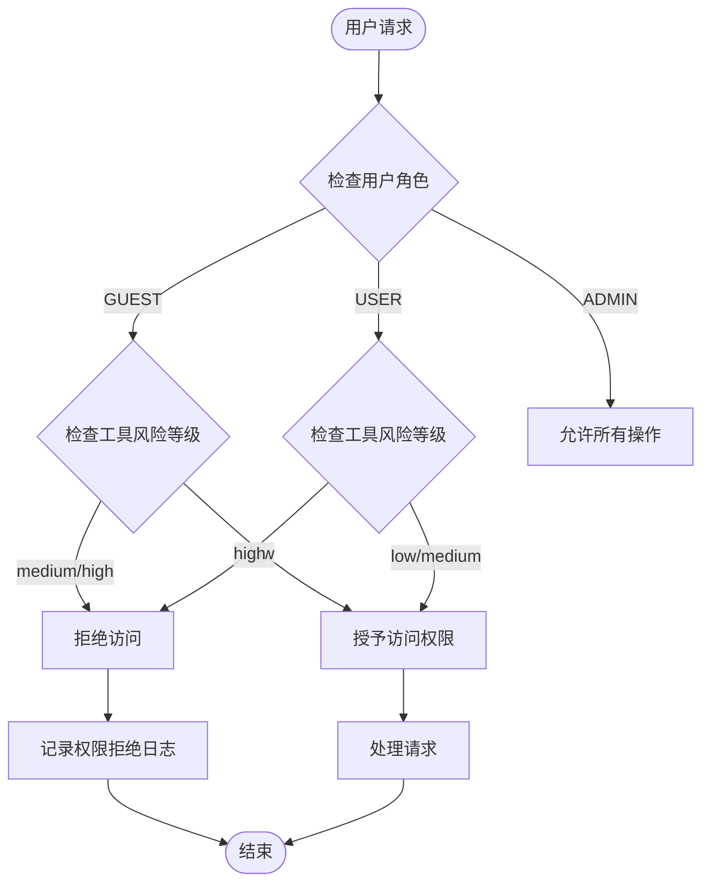
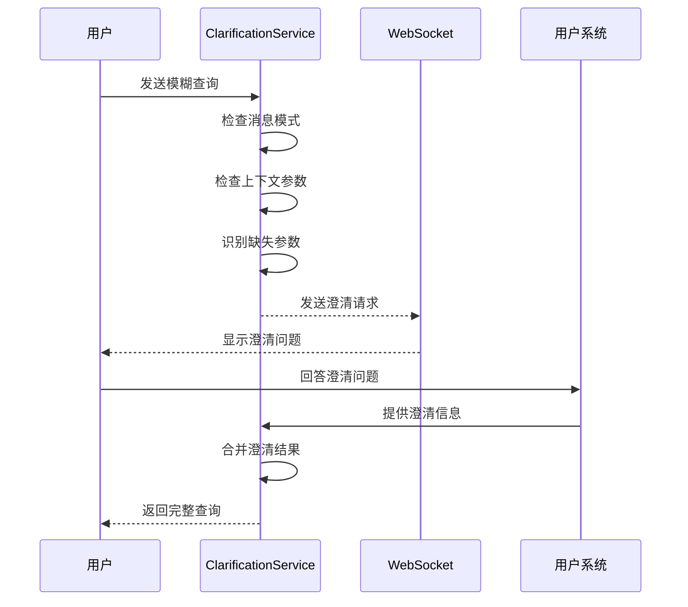
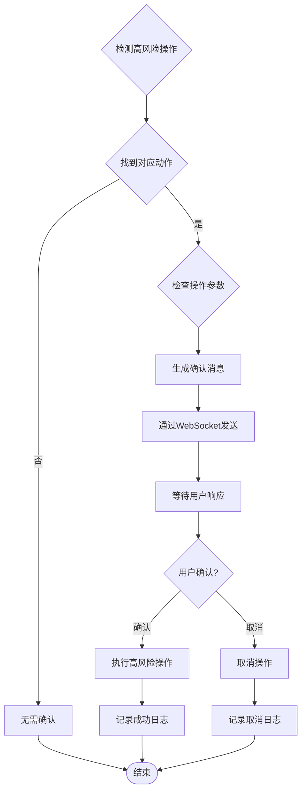
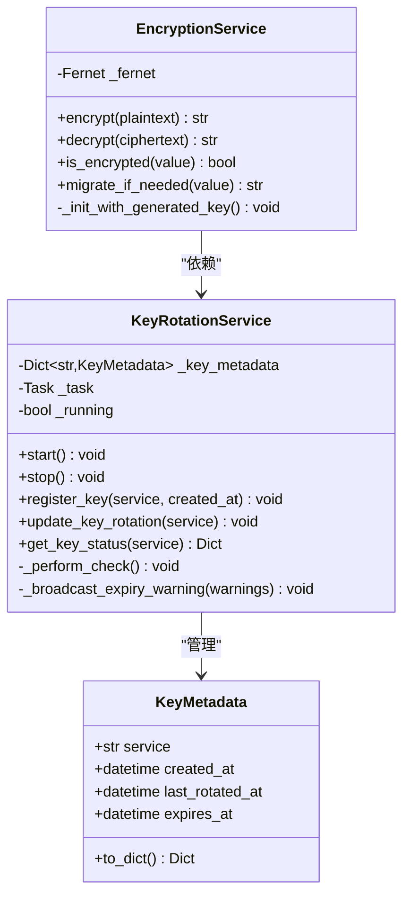
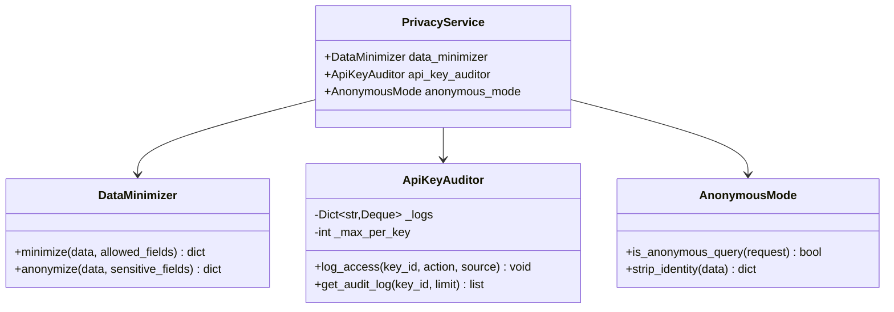
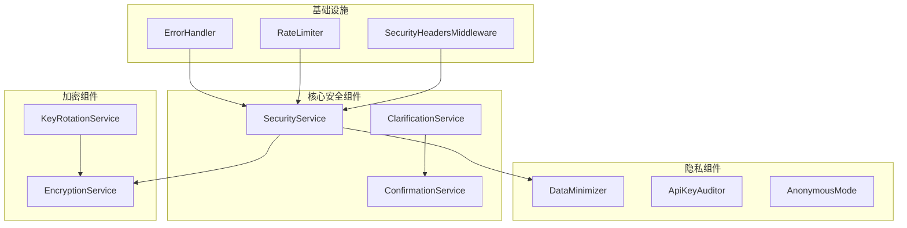

# 安全框架

<cite>
**本文档引用的文件**
- [security/__init__.py](file://backend/app/services/security/__init__.py)
- [security_service.py](file://backend/app/services/security/security_service.py)
- [clarification_service.py](file://backend/app/services/security/clarification_service.py)
- [confirmation_service.py](file://backend/app/services/security/confirmation_service.py)
- [encryption.py](file://backend/app/services/security/encryption.py)
- [key_rotation.py](file://backend/app/services/security/key_rotation.py)
- [error_handler.py](file://backend/app/middleware/error_handler.py)
- [privacy_service.py](file://backend/app/services/privacy/privacy_service.py)
- [auth.py](file://backend/app/routers/auth.py)
- [auth_service.py](file://backend/app/services/user/auth_service.py)
- [rate_limiter.py](file://backend/app/rate_limiter.py)
- [main.py](file://backend/app/main.py)
- [config.py](file://backend/app/config.py)
</cite>

## 目录
1. [简介](#简介)
2. [项目结构](#项目结构)
3. [核心组件](#核心组件)
4. [架构概览](#架构概览)
5. [详细组件分析](#详细组件分析)
6. [依赖关系分析](#依赖关系分析)
7. [性能考虑](#性能考虑)
8. [故障排除指南](#故障排除指南)
9. [结论](#结论)

## 简介

本项目构建了一个全面的安全框架，旨在保护学术论文智能阅读与问答系统的安全性和隐私性。该框架采用多层次防护策略，涵盖输入安全检查、权限控制、数据加密、API密钥轮换、隐私合规等多个方面。

安全框架的核心目标是：
- 防范提示词注入攻击和角色覆盖尝试
- 实施基于角色的权限控制系统
- 提供数据最小化和脱敏功能
- 确保API密钥的安全存储和轮换
- 实现匿名查询检测和身份信息剥离
- 建立完善的异常处理和安全响应头机制

## 项目结构

安全框架在项目中的组织结构如下：

**图表来源**
- [security/__init__.py:1-15](file://backend/app/services/security/__init__.py#L1-L15)
- [privacy_service.py:1-209](file://backend/app/services/privacy/privacy_service.py#L1-L209)
- [error_handler.py:1-124](file://backend/app/middleware/error_handler.py#L1-L124)

**章节来源**
- [security/__init__.py:1-15](file://backend/app/services/security/__init__.py#L1-L15)
- [privacy_service.py:1-209](file://backend/app/services/privacy/privacy_service.py#L1-L209)
- [error_handler.py:1-124](file://backend/app/middleware/error_handler.py#L1-L124)

## 核心组件

### 安全服务组件

安全服务组件提供了多层次的防护机制：

1. **提示词注入防护** - 检测和过滤用户输入中的注入攻击
2. **角色权限控制** - 基于角色的工具调用权限管理
3. **输出安全检查** - 防止敏感信息泄露
4. **主动澄清服务** - 当用户意图模糊时主动提问
5. **人机协作确认** - 高风险操作需要用户确认

### 隐私合规组件

隐私合规组件确保系统符合数据保护法规：

1. **数据最小化** - 仅保留必要的数据字段
2. **API密钥审计** - 记录API密钥使用情况
3. **匿名查询检测** - 识别和处理匿名访问请求

### 加密和密钥管理

提供安全的数据存储和密钥管理机制：

1. **对称加密服务** - 使用Fernet算法进行数据加密
2. **API密钥轮换** - 自动检查和轮换过期的API密钥

**章节来源**
- [security_service.py:1-317](file://backend/app/services/security/security_service.py#L1-L317)
- [clarification_service.py:1-156](file://backend/app/services/security/clarification_service.py#L1-L156)
- [confirmation_service.py:1-120](file://backend/app/services/security/confirmation_service.py#L1-L120)
- [privacy_service.py:1-209](file://backend/app/services/privacy/privacy_service.py#L1-L209)

## 架构概览

安全框架的整体架构采用分层设计，确保各个组件之间的松耦合和高内聚：

**图表来源**
- [main.py:112-275](file://backend/app/main.py#L112-L275)
- [security_service.py:111-317](file://backend/app/services/security/security_service.py#L111-L317)

## 详细组件分析

### 安全服务分析

安全服务是整个安全框架的核心组件，提供了全面的防护机制：

**图表来源**
- [security_service.py:16-317](file://backend/app/services/security/security_service.py#L16-L317)

#### 注入检测机制

安全服务实现了多层次的注入检测机制：

1. **角色覆盖检测** - 检测尝试覆盖系统指令的模式
2. **系统提示词提取检测** - 防止用户获取系统提示词
3. **分隔符注入检测** - 防止消息分隔符注入攻击
4. **编码绕过检测** - 检测可能的编码绕过尝试

#### 权限控制系统

系统实现了基于角色的权限控制体系：

**图表来源**
- [security_service.py:85-238](file://backend/app/services/security/security_service.py#L85-L238)

**章节来源**
- [security_service.py:1-317](file://backend/app/services/security/security_service.py#L1-L317)

### 主动澄清服务分析

主动澄清服务用于处理用户意图不明确的情况：

**图表来源**
- [clarification_service.py:60-153](file://backend/app/services/security/clarification_service.py#L60-L153)

**章节来源**
- [clarification_service.py:1-156](file://backend/app/services/security/clarification_service.py#L1-L156)

### 人机协作确认服务分析

人机协作确认服务确保高风险操作需要用户明确授权：

**图表来源**
- [confirmation_service.py:51-117](file://backend/app/services/security/confirmation_service.py#L51-L117)

**章节来源**
- [confirmation_service.py:1-120](file://backend/app/services/security/confirmation_service.py#L1-L120)

### 加密服务分析

加密服务提供了安全的数据存储机制：

**图表来源**
- [encryption.py:26-167](file://backend/app/services/security/encryption.py#L26-L167)
- [key_rotation.py:55-363](file://backend/app/services/security/key_rotation.py#L55-L363)

#### 加密流程

加密服务采用Fernet对称加密算法，提供以下功能：

1. **自动密钥管理** - 支持从环境变量读取密钥或自动生成
2. **向后兼容** - 自动检测和迁移未加密数据
3. **密钥轮换监控** - 定期检查API密钥的使用期限
4. **安全存储** - 确保敏感数据（如API密钥）的安全存储

**章节来源**
- [encryption.py:1-167](file://backend/app/services/security/encryption.py#L1-L167)
- [key_rotation.py:1-363](file://backend/app/services/security/key_rotation.py#L1-L363)

### 隐私合规服务分析

隐私合规服务确保系统符合数据保护法规要求：

**图表来源**
- [privacy_service.py:22-209](file://backend/app/services/privacy/privacy_service.py#L22-L209)

#### 隐私保护机制

隐私合规服务提供了以下保护机制：

1. **数据最小化** - 仅收集和处理必要的数据
2. **身份信息剥离** - 自动识别和移除身份相关信息
3. **API密钥审计** - 记录所有API密钥的使用情况
4. **匿名查询支持** - 识别和处理匿名访问请求

**章节来源**
- [privacy_service.py:1-209](file://backend/app/services/privacy/privacy_service.py#L1-L209)

## 依赖关系分析

安全框架的组件间依赖关系如下：

**图表来源**
- [main.py:149-185](file://backend/app/main.py#L149-L185)
- [security/__init__.py:1-15](file://backend/app/services/security/__init__.py#L1-L15)

### 组件耦合度分析

安全框架采用了合理的模块化设计，具有以下特点：

1. **低耦合** - 各组件职责明确，相互独立
2. **高内聚** - 每个组件专注于特定的安全功能
3. **可扩展性** - 新的安全功能可以轻松集成
4. **可测试性** - 组件设计便于单元测试和集成测试

**章节来源**
- [main.py:149-185](file://backend/app/main.py#L149-L185)
- [security/__init__.py:1-15](file://backend/app/services/security/__init__.py#L1-L15)

## 性能考虑

安全框架在设计时充分考虑了性能影响：

### 时间复杂度分析

1. **安全检查** - O(n) 时间复杂度，其中n为检测模式数量
2. **权限验证** - O(1) 时间复杂度，基于字典查找
3. **加密操作** - O(1) 时间复杂度，Fernet加密/解密
4. **密钥轮换** - O(m) 时间复杂度，其中m为注册的密钥数量

### 内存使用分析

1. **加密服务** - 内存使用极小，主要为密钥缓存
2. **密钥轮换** - 内存使用与注册密钥数量成正比
3. **API审计** - 使用双端队列限制内存使用
4. **数据最小化** - 创建新的字典对象，内存使用与数据大小相关

### 性能优化措施

1. **异步处理** - 密钥轮换使用异步任务，不影响主线程
2. **缓存机制** - 频繁访问的数据进行缓存
3. **懒加载** - 组件按需初始化，减少启动时间
4. **批量处理** - 支持批量操作，提高处理效率

## 故障排除指南

### 常见问题及解决方案

#### 加密服务问题

**问题**：ENCRYPTION_KEY环境变量未设置
**解决方案**：设置ENCRYPTION_KEY环境变量或在生产环境中提供持久化存储

**问题**：密钥轮换服务无法启动
**解决方案**：检查WebSocket广播函数是否正确注入，确认服务状态

#### 安全检查问题

**问题**：误报安全检查
**解决方案**：调整INJECTION_PATTERNS配置，增加白名单模式

**问题**：权限控制过于严格
**解决方案**：检查TOOL_RISK_LEVELS配置，调整角色权限级别

#### 隐私合规问题

**问题**：数据脱敏过度
**解决方案**：调整ALLOWED_FIELDS和SENSITIVE_FIELDS配置

**问题**：匿名查询检测误判
**解决方案**：检查匿名查询标志的设置和检测逻辑

### 日志分析

安全框架提供了详细的日志记录机制：

1. **安全事件日志** - 记录所有安全相关的事件
2. **异常处理日志** - 记录异常处理过程
3. **性能监控日志** - 记录性能指标和瓶颈
4. **审计日志** - 记录用户行为和系统操作

**章节来源**
- [error_handler.py:1-124](file://backend/app/middleware/error_handler.py#L1-L124)
- [encryption.py:1-167](file://backend/app/services/security/encryption.py#L1-L167)
- [security_service.py:1-317](file://backend/app/services/security/security_service.py#L1-L317)

## 结论

本安全框架为学术论文智能阅读与问答系统提供了全面的安全保障。通过多层次的防护机制、严格的权限控制、完善的数据保护措施和高效的异常处理系统，确保了系统的安全性、可靠性和合规性。

### 主要优势

1. **全面防护** - 涵盖输入安全、权限控制、数据保护、API管理等各个方面
2. **灵活配置** - 支持动态配置和运行时调整
3. **高性能** - 优化的算法和数据结构，最小化性能影响
4. **易于维护** - 模块化设计，便于扩展和维护
5. **合规性强** - 符合数据保护法规要求

### 未来改进方向

1. **机器学习防护** - 集成AI驱动的威胁检测
2. **实时监控** - 增强实时安全监控和告警机制
3. **多因子认证** - 支持更高级别的身份验证
4. **安全审计** - 完善的安全审计和合规报告功能

该安全框架为类似的企业级应用提供了良好的参考模板，可以根据具体需求进行定制和扩展。