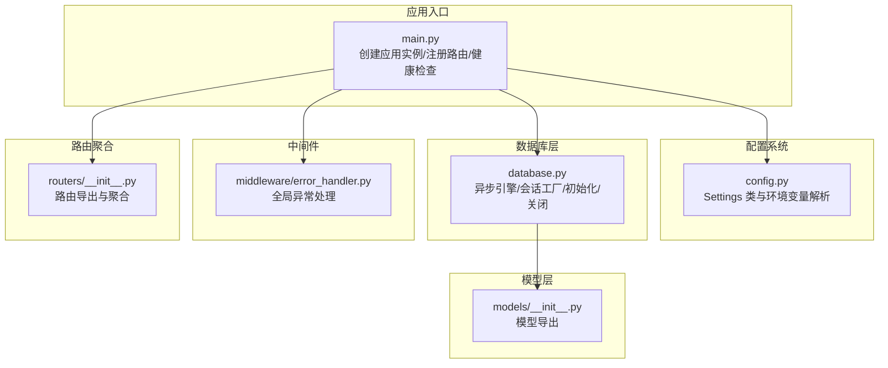
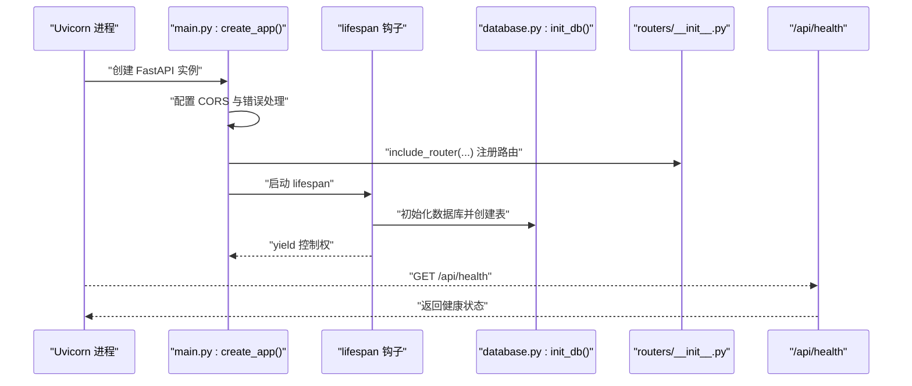
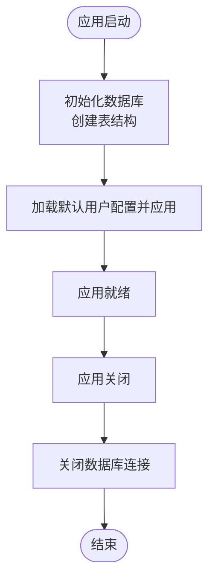
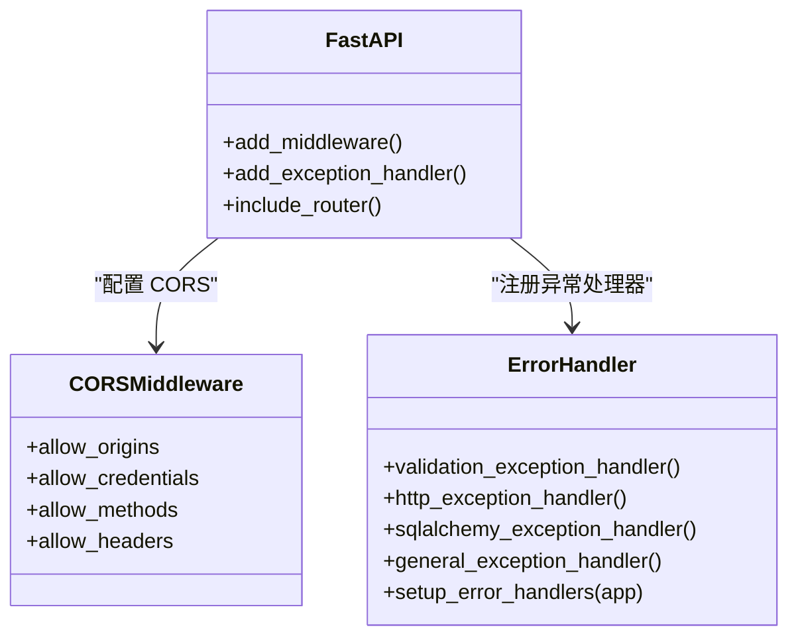
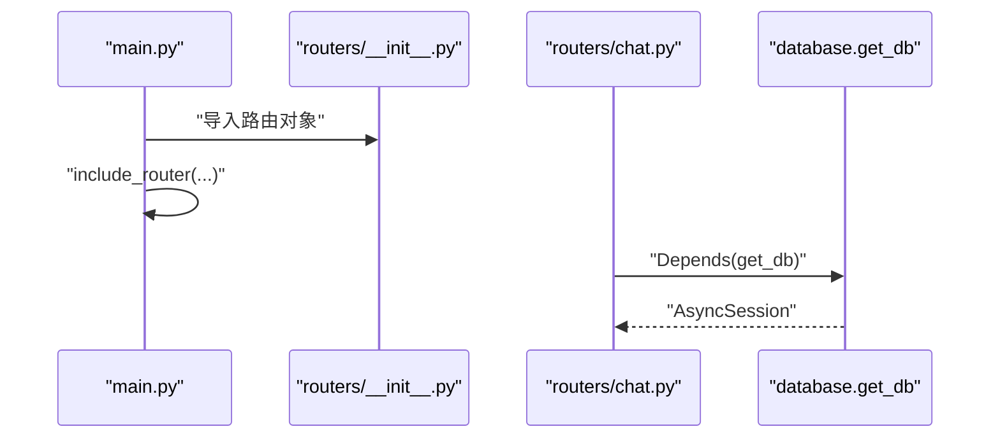
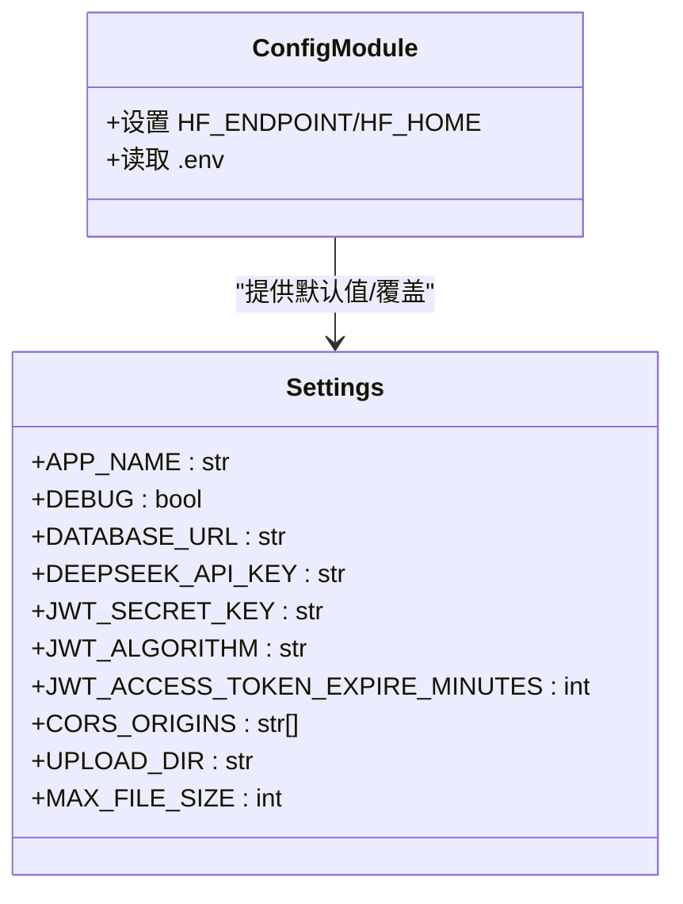
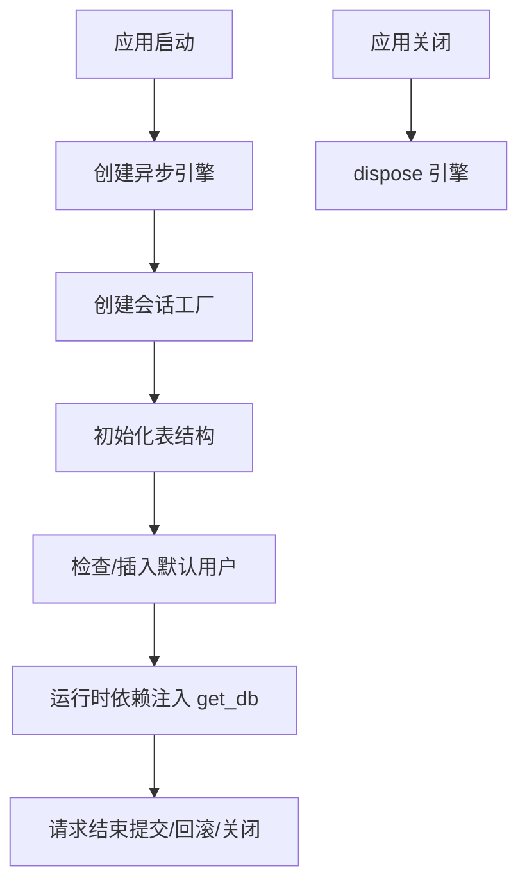
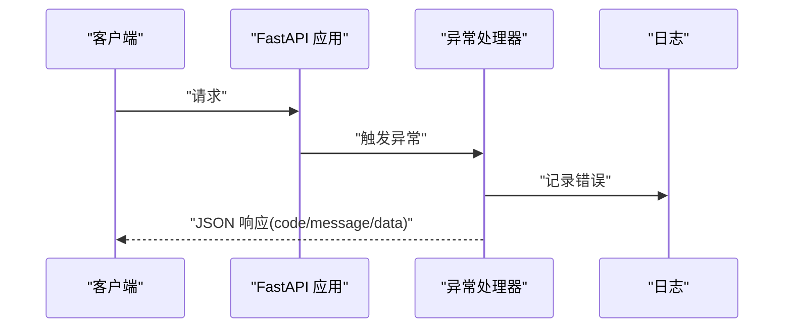
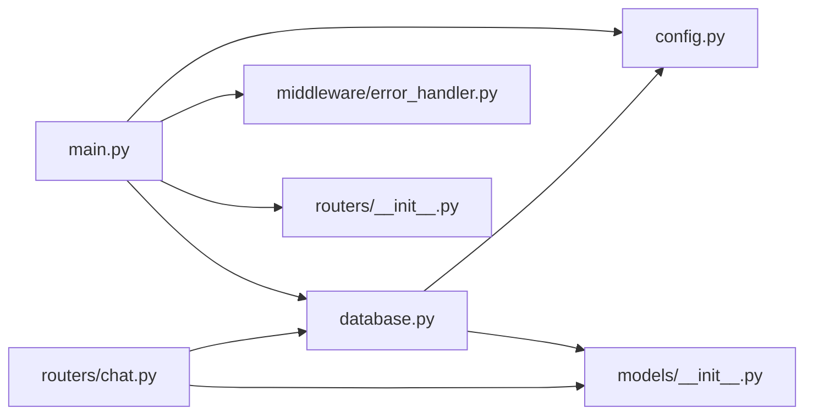

# 应用入口与配置

<cite>
**本文引用的文件**
- [main.py](file://backend/app/main.py)
- [config.py](file://backend/app/config.py)
- [database.py](file://backend/app/database.py)
- [error_handler.py](file://backend/app/middleware/error_handler.py)
- [__init__.py](file://backend/app/middleware/__init__.py)
- [routers/__init__.py](file://backend/app/routers/__init__.py)
- [chat.py](file://backend/app/routers/chat.py)
- [models/__init__.py](file://backend/app/models/__init__.py)
- [chat.py](file://backend/app/models/chat.py)
- [run.py](file://backend/run.py)
- [requirements.txt](file://backend/requirements.txt)
</cite>

## 目录
1. [简介](#简介)
2. [项目结构](#项目结构)
3. [核心组件](#核心组件)
4. [架构总览](#架构总览)
5. [详细组件分析](#详细组件分析)
6. [依赖分析](#依赖分析)
7. [性能考虑](#性能考虑)
8. [故障排查指南](#故障排查指南)
9. [结论](#结论)
10. [附录：配置示例与最佳实践](#附录配置示例与最佳实践)

## 简介
本文档聚焦 PaperChat 后端应用的“应用入口与配置”主题，系统性阐述：
- FastAPI 应用实例的创建与生命周期管理
- CORS 配置、中间件设置与路由注册
- 应用配置系统（环境变量、调试模式、数据库连接等）
- 数据库初始化流程（连接池、表结构创建、关闭机制）
- 错误处理机制与健康检查端点
- 生产与开发环境的配置示例与最佳实践

## 项目结构
后端采用“按功能域分层”的组织方式，入口位于 backend/app/main.py，配置集中于 backend/app/config.py，数据库连接与会话管理位于 backend/app/database.py，错误处理中间件位于 backend/app/middleware/error_handler.py，路由注册通过 backend/app/routers/__init__.py 统一聚合。

图表来源
- [main.py:55-95](file://backend/app/main.py#L55-L95)
- [config.py:15-44](file://backend/app/config.py#L15-L44)
- [database.py:13-81](file://backend/app/database.py#L13-L81)
- [error_handler.py:73-92](file://backend/app/middleware/error_handler.py#L73-L92)
- [routers/__init__.py:1-27](file://backend/app/routers/__init__.py#L1-L27)
- [models/__init__.py:1-29](file://backend/app/models/__init__.py#L1-L29)

章节来源
- [main.py:1-114](file://backend/app/main.py#L1-L114)
- [config.py:1-44](file://backend/app/config.py#L1-L44)
- [database.py:1-81](file://backend/app/database.py#L1-L81)
- [error_handler.py:1-92](file://backend/app/middleware/error_handler.py#L1-L92)
- [routers/__init__.py:1-27](file://backend/app/routers/__init__.py#L1-L27)
- [models/__init__.py:1-29](file://backend/app/models/__init__.py#L1-L29)

## 核心组件
- 应用入口与生命周期：通过 lifespan 钩子在启动时初始化数据库、加载默认用户配置，并在关闭时释放连接。
- 配置系统：基于 pydantic-settings 的 Settings 类，支持从 .env 文件与环境变量读取配置，涵盖应用名、调试模式、数据库 URL、JWT、CORS、上传目录与大小限制等。
- 数据库层：使用 SQLAlchemy 2.x 异步引擎与会话工厂，提供依赖注入 get_db，支持自动建表与默认用户保障。
- 中间件与错误处理：统一处理 Pydantic 验证错误、HTTP 异常、SQLAlchemy 异常与通用异常，返回标准化 JSON 响应。
- 路由注册：通过 routers/__init__.py 导出各模块路由并在 main.py 中集中 include_router。

章节来源
- [main.py:16-53](file://backend/app/main.py#L16-L53)
- [config.py:15-44](file://backend/app/config.py#L15-L44)
- [database.py:30-48](file://backend/app/database.py#L30-L48)
- [error_handler.py:73-92](file://backend/app/middleware/error_handler.py#L73-L92)
- [routers/__init__.py:1-27](file://backend/app/routers/__init__.py#L1-L27)

## 架构总览
下面的序列图展示了应用启动的关键流程：创建应用实例、配置 CORS 与错误处理、注册路由、执行生命周期初始化、对外提供健康检查端点。

图表来源
- [main.py:55-95](file://backend/app/main.py#L55-L95)
- [main.py:16-53](file://backend/app/main.py#L16-L53)
- [database.py:50-73](file://backend/app/database.py#L50-L73)
- [routers/__init__.py:1-27](file://backend/app/routers/__init__.py#L1-L27)

## 详细组件分析

### 应用入口与生命周期管理
- 应用实例创建：通过 create_app() 构造 FastAPI，设置标题、版本、描述、生命周期钩子与调试模式。
- 生命周期钩子 lifespan：
  - 启动阶段：初始化数据库、打印初始化日志；尝试加载默认用户配置并应用；若失败则记录警告但不影响启动。
  - 关闭阶段：打印关闭日志并调用 close_db() 释放连接。
- 健康检查端点：提供 /api/health，返回应用状态与版本信息。

图表来源
- [main.py:16-53](file://backend/app/main.py#L16-L53)
- [main.py:102-114](file://backend/app/main.py#L102-L114)
- [database.py:50-81](file://backend/app/database.py#L50-L81)

章节来源
- [main.py:55-95](file://backend/app/main.py#L55-L95)
- [main.py:16-53](file://backend/app/main.py#L16-L53)
- [main.py:102-114](file://backend/app/main.py#L102-L114)

### CORS 配置与中间件设置
- CORS：通过 CORSMiddleware 允许凭据、通配方法与头，允许的源来自配置 settings.CORS_ORIGINS。
- 全局异常处理：setup_error_handlers(app) 将多种异常处理器注册到应用，确保统一的错误响应格式。
- 中间件模块导出：middleware/__init__.py 暴露 setup_error_handlers，便于在入口处调用。

图表来源
- [main.py:70-81](file://backend/app/main.py#L70-L81)
- [error_handler.py:73-92](file://backend/app/middleware/error_handler.py#L73-L92)
- [middleware/__init__.py:1-5](file://backend/app/middleware/__init__.py#L1-L5)

章节来源
- [main.py:70-81](file://backend/app/main.py#L70-L81)
- [error_handler.py:73-92](file://backend/app/middleware/error_handler.py#L73-L92)
- [middleware/__init__.py:1-5](file://backend/app/middleware/__init__.py#L1-L5)

### 路由注册与模块化设计
- 路由聚合：routers/__init__.py 统一导出路由对象，避免在入口文件中分散导入。
- 入口注册：main.py 在 create_app() 中逐个 include_router，形成清晰的模块化结构。
- 示例路由：以 chat 路由为例，展示依赖注入 get_db、用户认证依赖、分页查询与错误处理的典型用法。

图表来源
- [routers/__init__.py:1-27](file://backend/app/routers/__init__.py#L1-L27)
- [main.py:82-93](file://backend/app/main.py#L82-L93)
- [chat.py:13-16](file://backend/app/routers/chat.py#L13-L16)

章节来源
- [routers/__init__.py:1-27](file://backend/app/routers/__init__.py#L1-L27)
- [main.py:82-93](file://backend/app/main.py#L82-L93)
- [chat.py:13-16](file://backend/app/routers/chat.py#L13-L16)

### 应用配置系统
- 配置类 Settings：继承 BaseSettings，字段覆盖应用名、调试模式、数据库 URL、DeepSeek API Key、JWT 参数、CORS 源、上传目录与大小限制等。
- 环境变量与 .env：model_config 指定 env_file=".env"，编码为 utf-8，支持运行时覆盖默认值。
- HuggingFace 缓存：在 config.py 与 run.py 中均设置了 HF_ENDPOINT 与 HF_HOME，确保国内网络环境下的模型下载与缓存路径可控。

图表来源
- [config.py:15-44](file://backend/app/config.py#L15-L44)
- [config.py:4,5,8,10:4-10](file://backend/app/config.py#L4-L10)
- [run.py:13-19](file://backend/run.py#L13-L19)

章节来源
- [config.py:15-44](file://backend/app/config.py#L15-L44)
- [config.py:4,5,8,10:4-10](file://backend/app/config.py#L4-L10)
- [run.py:13-19](file://backend/run.py#L13-L19)

### 数据库初始化与连接管理
- 异步引擎与会话工厂：基于 settings.DATABASE_URL 创建异步引擎，使用 async_sessionmaker 构建会话工厂，开启 expire_on_commit、autocommit/autoflush 等策略。
- 依赖注入 get_db：提供上下文管理，自动提交、回滚与关闭，简化路由中的事务控制。
- 初始化 init_db：在应用启动时创建所有表，并确保默认用户存在。
- 关闭 close_db：在应用关闭时 dispose 引擎，释放连接资源。

图表来源
- [database.py:13-27](file://backend/app/database.py#L13-L27)
- [database.py:30-48](file://backend/app/database.py#L30-L48)
- [database.py:50-73](file://backend/app/database.py#L50-L73)
- [database.py:75-81](file://backend/app/database.py#L75-L81)

章节来源
- [database.py:13-27](file://backend/app/database.py#L13-L27)
- [database.py:30-48](file://backend/app/database.py#L30-L48)
- [database.py:50-73](file://backend/app/database.py#L50-L73)
- [database.py:75-81](file://backend/app/database.py#L75-L81)

### 错误处理机制
- 异常处理器：
  - Pydantic 验证错误：将字段路径、消息与类型转换为统一结构。
  - HTTP 异常：透传状态码与详情。
  - SQLAlchemy 异常：记录数据库错误并返回 500。
  - 通用异常：记录未预期错误并返回 500。
- 注册方式：setup_error_handlers(app) 将上述处理器绑定到应用。

图表来源
- [error_handler.py:11-28](file://backend/app/middleware/error_handler.py#L11-L28)
- [error_handler.py:31-40](file://backend/app/middleware/error_handler.py#L31-L40)
- [error_handler.py:43-55](file://backend/app/middleware/error_handler.py#L43-L55)
- [error_handler.py:58-70](file://backend/app/middleware/error_handler.py#L58-L70)
- [error_handler.py:73-92](file://backend/app/middleware/error_handler.py#L73-L92)

章节来源
- [error_handler.py:11-28](file://backend/app/middleware/error_handler.py#L11-L28)
- [error_handler.py:31-40](file://backend/app/middleware/error_handler.py#L31-L40)
- [error_handler.py:43-55](file://backend/app/middleware/error_handler.py#L43-L55)
- [error_handler.py:58-70](file://backend/app/middleware/error_handler.py#L58-L70)
- [error_handler.py:73-92](file://backend/app/middleware/error_handler.py#L73-L92)

### 健康检查端点
- 路径：/api/health
- 功能：返回应用状态与版本信息，便于外部监控与容器编排平台进行存活探针与就绪探针。

章节来源
- [main.py:102-114](file://backend/app/main.py#L102-L114)

## 依赖分析
- 运行时依赖：FastAPI、Uvicorn、SQLAlchemy 异步、Pydantic Settings、JWT、密码学、multipart、PDF 解析、向量库与检索、迁移工具等。
- 模块耦合：
  - main.py 依赖 config.py、database.py、middleware.error_handler、routers.__init__。
  - database.py 依赖 config.Settings 与 models.Base。
  - routers/chat.py 依赖 database.get_db、models.chat 与服务层认证依赖。

图表来源
- [main.py:10-13](file://backend/app/main.py#L10-L13)
- [database.py:5,13-27:5-27](file://backend/app/database.py#L5-L27)
- [models/__init__.py:5-28](file://backend/app/models/__init__.py#L5-L28)
- [chat.py:8-16](file://backend/app/routers/chat.py#L8-L16)

章节来源
- [requirements.txt:1-19](file://backend/requirements.txt#L1-L19)
- [main.py:10-13](file://backend/app/main.py#L10-L13)
- [database.py:5,13-27:5-27](file://backend/app/database.py#L5-L27)
- [models/__init__.py:5-28](file://backend/app/models/__init__.py#L5-L28)
- [chat.py:8-16](file://backend/app/routers/chat.py#L8-L16)

## 性能考虑
- 异步数据库：使用 SQLAlchemy 异步引擎与会话工厂，减少阻塞，提升并发能力。
- 连接池与会话策略：expire_on_commit、autocommit/autoflush 等参数有助于控制 ORM 行为与内存占用。
- 调试模式：DEBUG=true 时开启 echo 输出 SQL，便于开发调试，但生产环境建议关闭以降低日志开销。
- CORS 与中间件：CORS 允许通配方法与头，简化前端交互，但生产环境应根据实际域名与方法收紧策略。
- 健康检查：轻量端点，适合频繁探测，注意不要引入重负载逻辑。

[本节为通用指导，无需特定文件来源]

## 故障排查指南
- 数据库初始化失败：
  - 检查 DATABASE_URL 是否正确（开发阶段默认 sqlite+aiosqlite，生产建议 PostgreSQL/MySQL）。
  - 确认 init_db 已在 lifespan 中执行，且 create_all 成功。
- 默认用户缺失：
  - 若用户表为空，init_db 会插入默认用户；如仍报错，检查权限与事务提交。
- 异常响应不符合预期：
  - 确认 setup_error_handlers 已在 create_app() 中调用。
  - 验证异常类型映射：Pydantic 验证错误、HTTP 异常、SQLAlchemy 异常、通用异常。
- CORS 跨域问题：
  - 检查 settings.CORS_ORIGINS 是否包含前端地址，以及是否允许凭据与通配方法。
- 健康检查失败：
  - 确认 /api/health 路由已注册，且应用已完全启动。

章节来源
- [database.py:50-73](file://backend/app/database.py#L50-L73)
- [error_handler.py:73-92](file://backend/app/middleware/error_handler.py#L73-L92)
- [config.py:33-34](file://backend/app/config.py#L33-L34)
- [main.py:102-114](file://backend/app/main.py#L102-L114)

## 结论
PaperChat 的应用入口与配置体系以清晰的模块划分与一致的生命周期管理为核心，结合统一的错误处理与健康检查，为上层业务路由与服务提供了稳定可靠的基础设施。通过合理的配置项与异步数据库设计，既满足开发阶段的快速迭代，也为生产部署提供了可扩展的基础。

[本节为总结，无需特定文件来源]

## 附录：配置示例与最佳实践

### 开发环境配置建议
- 数据库：保持默认 sqlite+aiosqlite，便于本地快速启动。
- 调试模式：DEBUG=true，开启 SQL 日志以便调试。
- CORS：允许本地前端域名（如 http://localhost:5173），便于前后端联调。
- 上传目录：确保 UPLOAD_DIR 可写，MAX_FILE_SIZE 满足测试需求。
- HuggingFace：保持 HF_ENDPOINT 与 HF_HOME 设置，避免下载失败。

章节来源
- [config.py:19,20,23,34,37,38:19-38](file://backend/app/config.py#L19-L38)
- [config.py:4,5,8,10:4-10](file://backend/app/config.py#L4-L10)
- [run.py:13-19](file://backend/run.py#L13-L19)

### 生产环境配置建议
- 数据库：替换为 PostgreSQL 或 MySQL 的异步驱动 URL，启用连接池参数（如 pool_size、max_overflow、pool_recycle）。
- 调试模式：DEBUG=false，关闭 SQL 日志输出。
- CORS：仅允许受信域名，限制允许的方法与头，禁用通配符。
- JWT：使用强密钥与合理过期时间，配合 HTTPS 传输。
- 上传目录：使用安全的存储后端（如 S3），并限制文件类型与大小。
- 健康检查：结合容器编排平台的探针，确保高可用。

[本节为通用指导，无需特定文件来源]