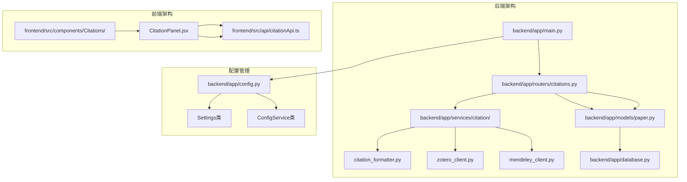
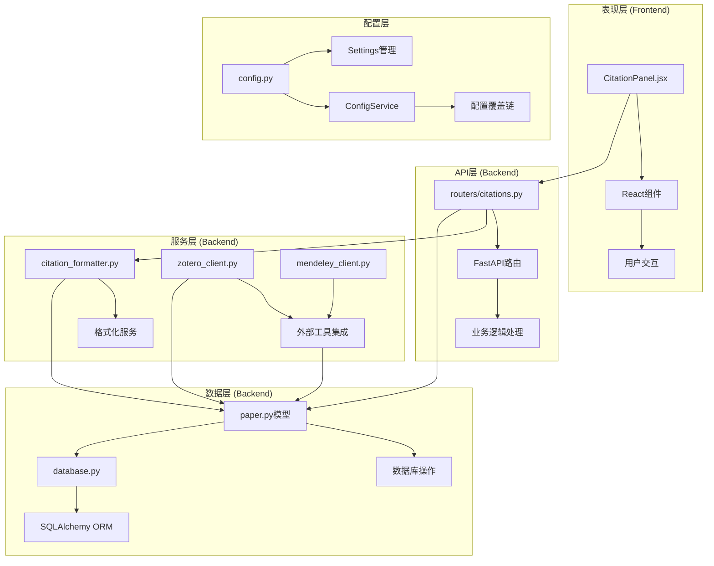
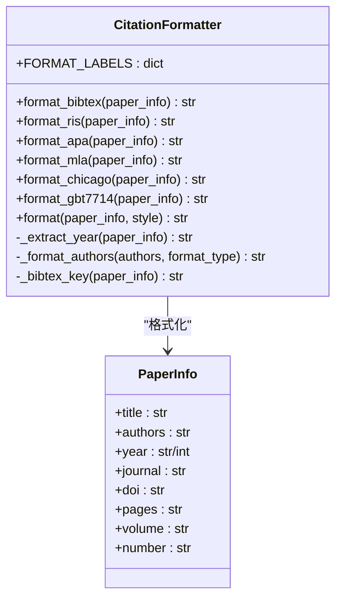
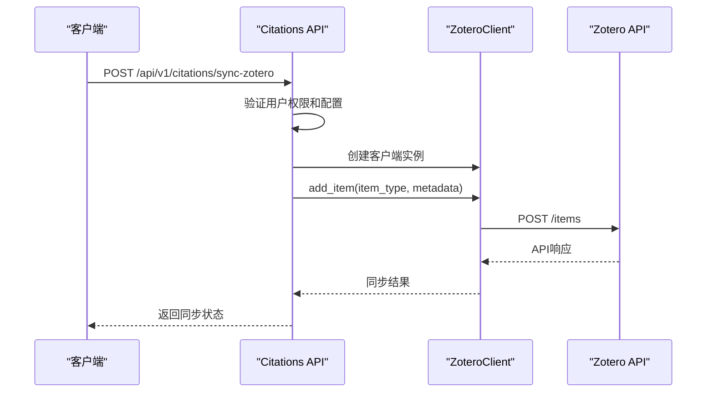
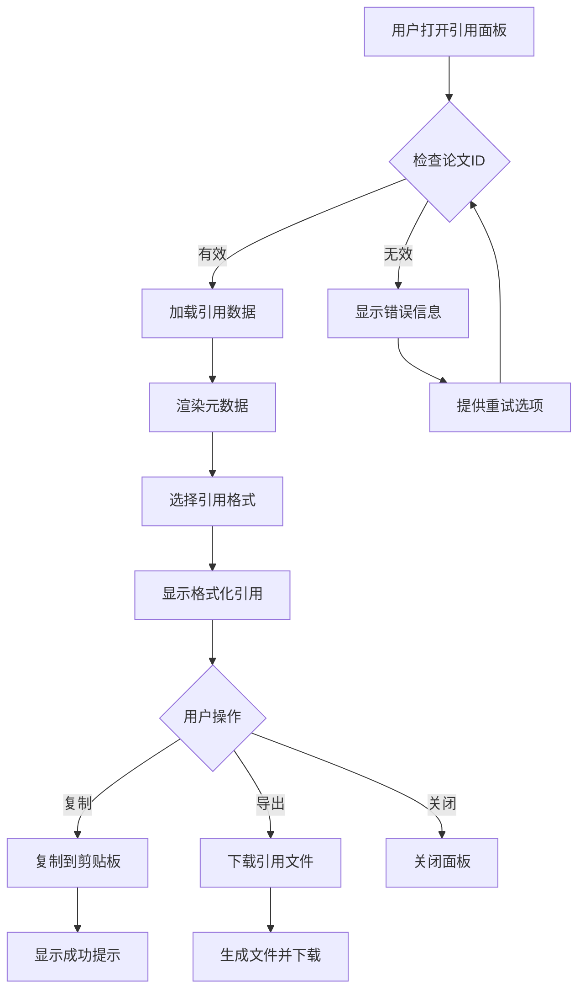
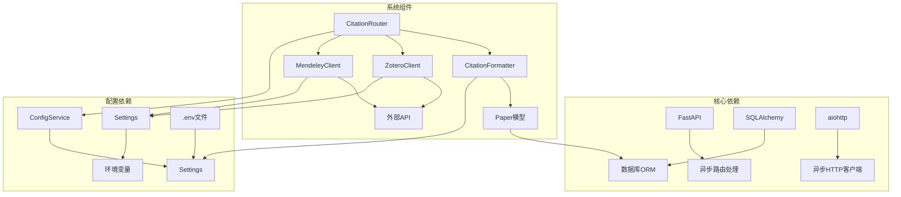

# 引用管理系统

<cite>
**本文档引用的文件**
- [backend/app/main.py](file://backend/app/main.py)
- [backend/app/config.py](file://backend/app/config.py)
- [backend/app/routers/citations.py](file://backend/app/routers/citations.py)
- [backend/app/services/citation/citation_formatter.py](file://backend/app/services/citation/citation_formatter.py)
- [backend/app/services/citation/zotero_client.py](file://backend/app/services/citation/zotero_client.py)
- [backend/app/services/citation/mendeley_client.py](file://backend/app/services/citation/mendeley_client.py)
- [backend/app/models/paper.py](file://backend/app/models/paper.py)
- [backend/app/models/note.py](file://backend/app/models/note.py)
- [backend/app/models/highlight.py](file://backend/app/models/highlight.py)
- [backend/app/database.py](file://backend/app/database.py)
- [frontend/src/components/Citations/CitationPanel.jsx](file://frontend/src/components/Citations/CitationPanel.jsx)
- [frontend/src/api/citationApi.ts](file://frontend/src/api/citationApi.ts)
- [README.md](file://README.md)
</cite>

## 目录
1. [简介](#简介)
2. [项目结构](#项目结构)
3. [核心组件](#核心组件)
4. [架构概览](#架构概览)
5. [详细组件分析](#详细组件分析)
6. [依赖关系分析](#依赖关系分析)
7. [性能考虑](#性能考虑)
8. [故障排除指南](#故障排除指南)
9. [结论](#结论)

## 简介

引用管理系统是 PaperChat 学术论文智能阅读与问答系统中的重要组成部分，负责论文引用的生成、格式化、导出和外部工具同步。该系统支持多种国际标准引用格式，包括 BibTeX、APA、MLA、Chicago 和 GB/T 7714，并提供与 Zotero 和 Mendeley 等文献管理工具的双向同步功能。

系统采用前后端分离架构，后端基于 FastAPI 框架构建，使用 SQLAlchemy 进行数据库操作，前端采用 React 和 TypeScript 开发。整个系统实现了从论文元数据提取到引用格式化的完整工作流程。

## 项目结构

引用管理系统在整体项目中占据重要地位，主要分布在以下目录结构中：

**图表来源**
- [backend/app/main.py:1-390](file://backend/app/main.py#L1-L390)
- [backend/app/routers/citations.py:1-196](file://backend/app/routers/citations.py#L1-L196)
- [frontend/src/components/Citations/CitationPanel.jsx:1-354](file://frontend/src/components/Citations/CitationPanel.jsx#L1-L354)

**章节来源**
- [backend/app/main.py:288-365](file://backend/app/main.py#L288-L365)
- [backend/app/config.py:29-60](file://backend/app/config.py#L29-L60)
- [README.md:72-183](file://README.md#L72-L183)

## 核心组件

引用管理系统由多个核心组件构成，每个组件都有明确的职责和功能：

### 1. 引用格式化器 (CitationFormatter)
负责将论文元数据转换为各种标准引用格式，支持 BibTeX、APA、MLA、Chicago、GB/T 7714 等格式的纯字符串模板生成。

### 2. 外部工具客户端
- **ZoteroClient**: 使用 Zotero Web API 进行文献库搜索、条目添加、集合管理和格式导出
- **MendeleyClient**: 使用 Mendeley REST API 进行个人文献库管理

### 3. API 路由处理器
提供引用导出、外部工具同步和格式查询的 RESTful API 接口

### 4. 数据模型
定义论文、高亮标注和笔记的数据结构，支持引用管理相关的数据操作

### 5. 前端组件
提供用户友好的界面，支持引用格式切换、复制和导出功能

**章节来源**
- [backend/app/services/citation/citation_formatter.py:8-235](file://backend/app/services/citation/citation_formatter.py#L8-L235)
- [backend/app/services/citation/zotero_client.py:14-187](file://backend/app/services/citation/zotero_client.py#L14-L187)
- [backend/app/services/citation/mendeley_client.py:14-142](file://backend/app/services/citation/mendeley_client.py#L14-L142)
- [backend/app/routers/citations.py:19-196](file://backend/app/routers/citations.py#L19-L196)

## 架构概览

引用管理系统采用分层架构设计，实现了清晰的关注点分离：

**图表来源**
- [backend/app/routers/citations.py:33-78](file://backend/app/routers/citations.py#L33-L78)
- [backend/app/services/citation/citation_formatter.py:85-120](file://backend/app/services/citation/citation_formatter.py#L85-L120)
- [backend/app/models/paper.py:11-67](file://backend/app/models/paper.py#L11-L67)

系统架构特点：
- **分层设计**: 清晰的层次结构，便于维护和扩展
- **模块化**: 各组件职责明确，耦合度低
- **异步处理**: 使用异步编程模型提高性能
- **配置管理**: 支持多层配置覆盖，灵活的参数管理

## 详细组件分析

### 引用格式化器组件

引用格式化器是系统的核心组件之一，负责将论文元数据转换为标准引用格式：

**图表来源**
- [backend/app/services/citation/citation_formatter.py:8-235](file://backend/app/services/citation/citation_formatter.py#L8-L235)

格式化器支持的格式：
- **BibTeX**: 学术论文最常用的引用格式
- **APA**: 美国心理学会格式标准
- **MLA**: 现代语言协会格式标准
- **Chicago**: 芝加哥格式手册
- **GB/T 7714**: 中国国家标准格式

**章节来源**
- [backend/app/services/citation/citation_formatter.py:12-235](file://backend/app/services/citation/citation_formatter.py#L12-L235)

### 外部工具集成组件

系统提供了与主流文献管理工具的集成能力：

**图表来源**
- [backend/app/routers/citations.py:81-153](file://backend/app/routers/citations.py#L81-L153)
- [backend/app/services/citation/zotero_client.py:69-97](file://backend/app/services/citation/zotero_client.py#L69-L97)

外部工具特性：
- **Zotero 集成**: 支持个人和团队文献库
- **Mendeley 集成**: 提供个人文献管理功能
- **自动配置**: 从用户设置中读取 API 凭据
- **错误处理**: 完善的异常捕获和错误报告机制

**章节来源**
- [backend/app/services/citation/zotero_client.py:14-187](file://backend/app/services/citation/zotero_client.py#L14-L187)
- [backend/app/services/citation/mendeley_client.py:14-142](file://backend/app/services/citation/mendeley_client.py#L14-L142)

### 前端用户界面组件

前端 CitationPanel 提供了直观的用户界面：

**图表来源**
- [frontend/src/components/Citations/CitationPanel.jsx:23-42](file://frontend/src/components/Citations/CitationPanel.jsx#L23-L42)
- [frontend/src/components/Citations/CitationPanel.jsx:94-151](file://frontend/src/components/Citations/CitationPanel.jsx#L94-L151)

前端组件功能：
- **多格式支持**: BibTeX、APA、GB/T 7714 格式切换
- **一键复制**: 支持现代浏览器剪贴板 API
- **文件导出**: 自动生成 .bib 或 .txt 文件
- **状态反馈**: 实时显示加载状态和操作结果

**章节来源**
- [frontend/src/components/Citations/CitationPanel.jsx:13-354](file://frontend/src/components/Citations/CitationPanel.jsx#L13-L354)
- [frontend/src/api/citationApi.ts:4-27](file://frontend/src/api/citationApi.ts#L4-L27)

## 依赖关系分析

引用管理系统中的组件依赖关系如下：

**图表来源**
- [backend/app/main.py:18-22](file://backend/app/main.py#L18-L22)
- [backend/app/config.py:133-239](file://backend/app/config.py#L133-L239)

依赖关系特点：
- **松耦合设计**: 组件间依赖关系清晰，便于单元测试
- **异步架构**: 全面使用异步编程模型
- **配置驱动**: 通过 ConfigService 实现灵活的配置管理
- **外部集成**: 通过专门的客户端类处理第三方服务

**章节来源**
- [backend/app/main.py:112-275](file://backend/app/main.py#L112-L275)
- [backend/app/config.py:133-239](file://backend/app/config.py#L133-L239)

## 性能考虑

引用管理系统在设计时充分考虑了性能优化：

### 数据库优化
- **索引策略**: 为常用查询字段建立适当的数据库索引
- **批量操作**: 支持批量论文验证和引用导出
- **连接池**: 使用 SQLAlchemy 异步连接池管理数据库连接

### 异步处理
- **并发请求**: 外部工具 API 调用使用异步模式
- **流式响应**: 支持大文件的流式处理
- **超时控制**: 合理设置网络请求超时时间

### 缓存策略
- **配置缓存**: ConfigService 提供内存级别的配置缓存
- **响应缓存**: 对频繁访问的引用格式进行缓存

## 故障排除指南

### 常见问题及解决方案

#### 1. 引用格式化失败
**症状**: 引用格式化返回空结果或格式错误
**原因**: 论文元数据缺失或格式不正确
**解决**: 检查论文数据完整性，确保必需字段存在

#### 2. 外部工具同步失败
**症状**: Zotero 或 Mendeley 同步返回错误
**原因**: API 凭据配置错误或网络连接问题
**解决**: 
- 验证 API Key 和 Library ID 配置
- 检查网络连接状态
- 查看详细的错误日志

#### 3. 前端界面显示异常
**症状**: 引用面板无法正常显示或操作无响应
**原因**: 前端组件状态管理问题
**解决**: 
- 检查浏览器控制台错误
- 验证 API 响应格式
- 确认用户权限验证

**章节来源**
- [backend/app/routers/citations.py:48-51](file://backend/app/routers/citations.py#L48-L51)
- [backend/app/services/citation/zotero_client.py:96-97](file://backend/app/services/citation/zotero_client.py#L96-L97)

## 结论

引用管理系统作为 PaperChat 系统的重要组成部分，实现了从论文元数据提取到引用格式化的完整工作流程。系统采用现代化的技术栈和架构设计，具有以下优势：

### 技术优势
- **模块化设计**: 组件职责明确，易于维护和扩展
- **异步架构**: 提供良好的性能和用户体验
- **多格式支持**: 支持国际主流的引用格式标准
- **外部集成**: 与主流文献管理工具无缝对接

### 功能特色
- **用户友好**: 提供直观的前端界面和丰富的交互功能
- **配置灵活**: 支持多层配置覆盖，适应不同使用场景
- **错误处理**: 完善的异常捕获和错误恢复机制
- **可扩展性**: 清晰的架构设计便于功能扩展

### 发展前景
随着学术交流的日益频繁和引用规范的不断演进，引用管理系统将继续完善其功能，为用户提供更加便捷、准确的引用管理体验。系统的设计理念和技术架构为其未来的功能扩展和性能优化奠定了坚实基础。