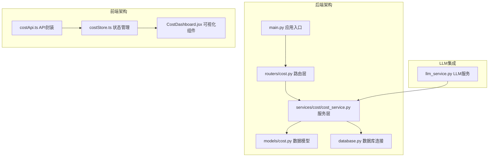
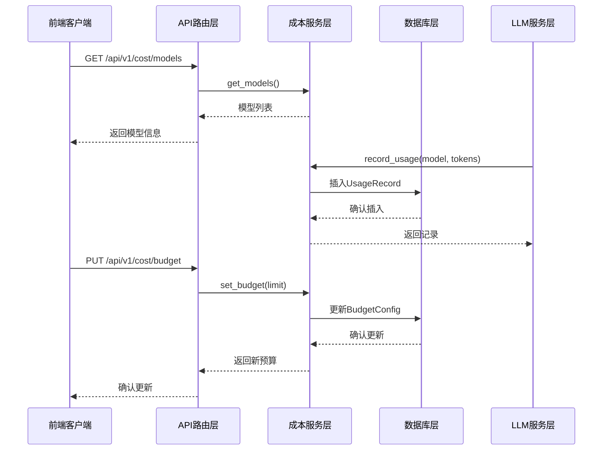
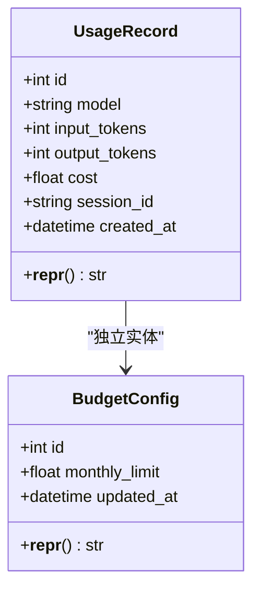
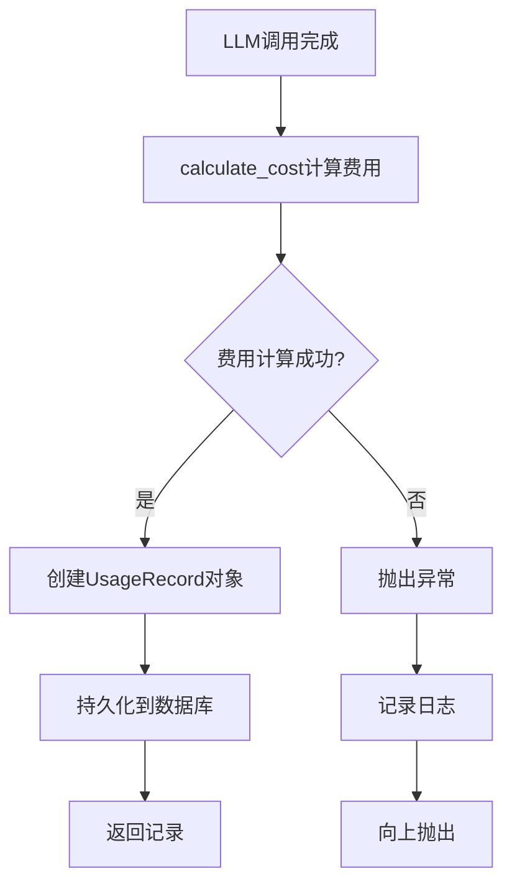
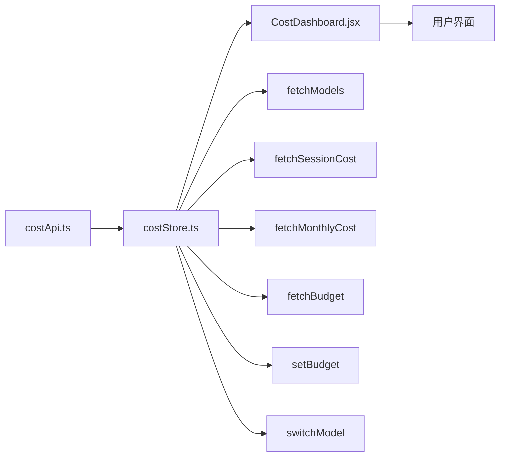
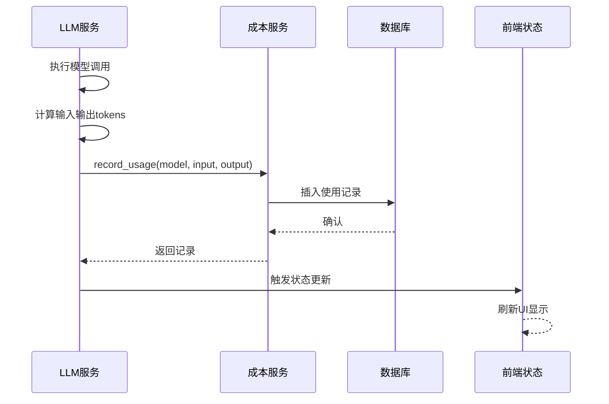
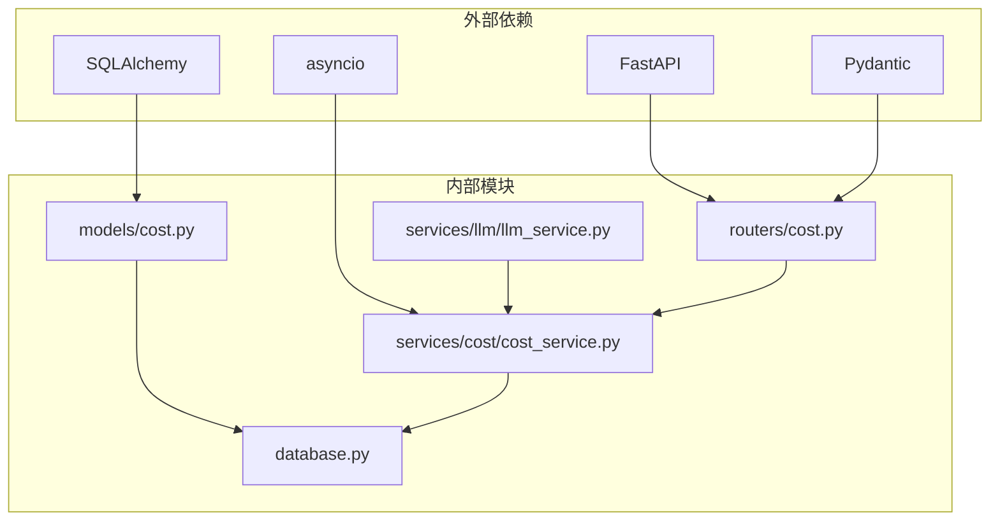

# 成本管理系统

<cite>
**本文档引用的文件**
- [backend/app/models/cost.py](file://backend/app/models/cost.py)
- [backend/app/services/cost/cost_service.py](file://backend/app/services/cost/cost_service.py)
- [backend/app/routers/cost.py](file://backend/app/routers/cost.py)
- [backend/app/services/llm/llm_service.py](file://backend/app/services/llm/llm_service.py)
- [backend/app/database.py](file://backend/app/database.py)
- [backend/app/main.py](file://backend/app/main.py)
- [frontend/src/stores/costStore.ts](file://frontend/src/stores/costStore.ts)
- [frontend/src/components/Cost/CostDashboard.jsx](file://frontend/src/components/Cost/CostDashboard.jsx)
- [frontend/src/api/costApi.ts](file://frontend/src/api/costApi.ts)
- [README.md](file://README.md)
</cite>

## 目录
1. [简介](#简介)
2. [项目结构](#项目结构)
3. [核心组件](#核心组件)
4. [架构概览](#架构概览)
5. [详细组件分析](#详细组件分析)
6. [依赖关系分析](#依赖关系分析)
7. [性能考虑](#性能考虑)
8. [故障排除指南](#故障排除指南)
9. [结论](#结论)

## 简介

成本管理系统是PaperChat学术论文智能阅读与问答系统中的重要组成部分，专门负责跟踪和管理基于大语言模型（LLM）的使用成本。该系统实现了完整的费用追踪、预算管理和可视化展示功能，为用户提供透明的成本控制机制。

系统采用前后端分离架构，后端基于FastAPI构建，使用SQLAlchemy进行数据持久化，前端采用React和Zustand进行状态管理。核心功能包括实时费用计算、会话级成本统计、月度预算控制和直观的可视化界面。

## 项目结构

成本管理系统在整体项目中的位置和组织方式如下：

**图表来源**
- [backend/app/main.py:28-339](file://backend/app/main.py#L28-L339)
- [backend/app/routers/cost.py:14](file://backend/app/routers/cost.py#L14)

**章节来源**
- [README.md:72-183](file://README.md#L72-L183)

## 核心组件

成本管理系统包含以下核心组件：

### 数据模型层
- **UsageRecord**: 存储单次LLM调用的使用记录，包括模型名称、输入输出tokens数量、费用金额和会话标识
- **BudgetConfig**: 存储月度预算配置信息，支持动态调整和查询

### 服务层
- **CostService**: 核心业务逻辑实现，提供费用计算、记录存储、统计查询和预算管理功能
- **CostService.calculate_cost()**: 基于预设的模型定价表计算费用
- **CostService.record_usage()**: 异步记录使用情况并持久化到数据库

### 路由层
- **/api/v1/cost/**: 提供完整的RESTful API接口，包括模型查询、会话统计、日统计、月统计、预算管理和模型切换

### 前端组件
- **costStore**: 使用Zustand管理状态，封装所有成本相关的API调用
- **CostDashboard**: 主要的可视化界面，展示预算状态、月度统计和每日费用趋势

**章节来源**
- [backend/app/models/cost.py:11-39](file://backend/app/models/cost.py#L11-L39)
- [backend/app/services/cost/cost_service.py:56-235](file://backend/app/services/cost/cost_service.py#L56-L235)
- [backend/app/routers/cost.py:17-114](file://backend/app/routers/cost.py#L17-L114)

## 架构概览

成本管理系统的整体架构采用分层设计，确保了良好的可维护性和扩展性：

**图表来源**
- [backend/app/routers/cost.py:29-114](file://backend/app/routers/cost.py#L29-L114)
- [backend/app/services/cost/cost_service.py:56-235](file://backend/app/services/cost/cost_service.py#L56-L235)

系统的核心优势在于其与LLM服务的深度集成，能够自动追踪每次模型调用的成本，并提供实时的预算控制功能。

## 详细组件分析

### 数据模型设计

**图表来源**
- [backend/app/models/cost.py:11-39](file://backend/app/models/cost.py#L11-L39)

#### UsageRecord模型特点
- 使用SQLAlchemy异步ORM映射
- 包含索引优化字段（model、session_id、created_at）
- 支持默认值和时间戳自动更新
- 提供详细的字符串表示便于调试

#### BudgetConfig模型特点
- 单行配置表设计，确保预算设置的原子性
- 支持自动时间戳更新
- 默认月度限额设置为10.00美元

**章节来源**
- [backend/app/models/cost.py:11-39](file://backend/app/models/cost.py#L11-L39)

### 成本计算服务

CostService是整个系统的核心，提供了完整的成本管理功能：

**图表来源**
- [backend/app/services/cost/cost_service.py:48-89](file://backend/app/services/cost/cost_service.py#L48-L89)

#### 定价策略
系统内置了DeepSeek系列模型的定价表，支持多种模型的差异化定价：
- deepseek-chat: 通用对话模型
- deepseek-reasoner: 深度推理模型  
- deepseek-coder: 代码生成模型

#### 统计功能
- **会话级统计**: 按session_id聚合所有调用的token使用量和费用
- **日统计**: 基于created_at字段按天统计费用
- **月统计**: 支持年度和月度维度的费用汇总，并提供每日明细
- **预算监控**: 实时计算预算使用百分比和剩余金额

**章节来源**
- [backend/app/services/cost/cost_service.py:56-235](file://backend/app/services/cost/cost_service.py#L56-L235)

### API接口设计

系统提供了RESTful API接口，满足不同场景下的成本管理需求：

| 接口 | 方法 | 描述 | 参数 |
|------|------|------|------|
| /api/v1/cost/models | GET | 获取可用模型列表及定价信息 | 无 |
| /api/v1/cost/session/{session_id} | GET | 查询指定会话的费用汇总 | session_id |
| /api/v1/cost/daily | GET | 查询当日费用统计 | date(可选) |
| /api/v1/cost/monthly | GET | 查询月度费用统计 | year, month(可选) |
| /api/v1/cost/budget | GET/PUT | 查询或设置月度预算 | GET/PUT参数 |

**章节来源**
- [backend/app/routers/cost.py:29-114](file://backend/app/routers/cost.py#L29-L114)

### 前端集成

前端采用现代化的React架构，使用Zustand进行状态管理：

**图表来源**
- [frontend/src/api/costApi.ts:62-99](file://frontend/src/api/costApi.ts#L62-L99)
- [frontend/src/stores/costStore.ts:40-136](file://frontend/src/stores/costStore.ts#L40-L136)

#### 状态管理模式
- **模型列表**: 存储可用的LLM模型及其定价信息
- **当前模型**: 记录用户当前使用的模型配置
- **会话成本**: 缓存特定会话的成本统计
- **月度成本**: 存储月度费用汇总和每日明细
- **预算状态**: 实时显示预算使用情况

#### 可视化特性
- **预算进度条**: 直观显示预算使用百分比
- **费用趋势图**: 使用纯CSS实现的每日费用柱状图
- **实时更新**: 通过WebSocket实现成本数据的实时刷新

**章节来源**
- [frontend/src/stores/costStore.ts:10-136](file://frontend/src/stores/costStore.ts#L10-L136)
- [frontend/src/components/Cost/CostDashboard.jsx:12-164](file://frontend/src/components/Cost/CostDashboard.jsx#L12-L164)

### LLM服务集成

成本系统与LLM服务的集成是实现自动化成本追踪的关键：

**图表来源**
- [backend/app/services/llm/llm_service.py:736-761](file://backend/app/services/llm/llm_service.py#L736-L761)

#### 集成机制
- **异步记录**: 使用asyncio.create_task实现非阻塞的成本记录
- **自动切换**: 模型切换时同步更新LLM配置
- **错误处理**: 确保成本记录不影响主要业务流程

**章节来源**
- [backend/app/services/llm/llm_service.py:736-761](file://backend/app/services/llm/llm_service.py#L736-L761)

## 依赖关系分析

成本管理系统与其他组件的依赖关系如下：

**图表来源**
- [backend/app/main.py:28-339](file://backend/app/main.py#L28-L339)
- [backend/app/database.py:14-29](file://backend/app/database.py#L14-L29)

### 关键依赖特性

#### 数据库层
- **异步连接**: 使用SQLAlchemy异步引擎支持高并发
- **连接池管理**: 自动连接池配置和超时处理
- **事务管理**: 确保数据一致性和完整性

#### 服务层耦合
- **低耦合设计**: 成本服务独立于具体业务逻辑
- **接口清晰**: 明确的依赖注入和接口契约
- **可测试性**: 支持单元测试和集成测试

**章节来源**
- [backend/app/database.py:14-50](file://backend/app/database.py#L14-L50)
- [backend/app/main.py:28-339](file://backend/app/main.py#L28-L339)

## 性能考虑

成本管理系统在设计时充分考虑了性能优化：

### 数据库优化
- **索引策略**: 在常用查询字段上建立索引（model、session_id、created_at）
- **异步操作**: 使用异步数据库连接减少I/O等待
- **批量查询**: 合理使用SQL聚合函数减少网络往返

### 前端性能
- **状态缓存**: 使用Zustand本地缓存减少重复请求
- **懒加载**: 按需加载成本数据，避免不必要的渲染
- **防抖处理**: 输入验证和预算设置的防抖机制

### 系统扩展性
- **水平扩展**: 数据库层支持多实例部署
- **监控集成**: 内置日志记录便于性能监控
- **配置管理**: 支持动态配置调整

## 故障排除指南

### 常见问题及解决方案

#### 数据库连接问题
**症状**: API调用返回数据库连接错误
**解决方案**: 
1. 检查DATABASE_URL配置
2. 验证数据库服务状态
3. 查看连接池配置参数

#### 成本记录失败
**症状**: LLM调用正常但成本未记录
**解决方案**:
1. 检查CostService的异常处理
2. 验证数据库权限设置
3. 查看日志中的错误信息

#### 前端数据不更新
**症状**: 成本数据显示陈旧
**解决方案**:
1. 检查WebSocket连接状态
2. 验证store的状态更新逻辑
3. 查看API响应状态码

**章节来源**
- [backend/app/services/cost/cost_service.py:11-11](file://backend/app/services/cost/cost_service.py#L11-L11)

## 结论

成本管理系统作为PaperChat平台的重要组成部分，成功实现了LLM使用成本的自动化追踪和管理。系统采用现代化的技术栈和架构设计，在保证功能完整性的同时，兼顾了性能、可维护性和用户体验。

### 主要成就
- **完整成本追踪**: 实现了从模型调用到费用记录的全流程自动化
- **智能预算控制**: 提供实时预算监控和预警机制
- **直观可视化**: 通过图表和仪表板提供清晰的成本洞察
- **无缝集成**: 与LLM服务深度集成，不影响主要业务流程

### 技术亮点
- **异步架构**: 全面采用异步编程模式提升系统性能
- **模块化设计**: 清晰的分层架构便于维护和扩展
- **前端现代化**: 使用React和Zustand构建响应式用户界面
- **数据库优化**: 针对成本数据特点的优化设计

该系统为学术论文智能阅读平台提供了可靠的成本控制基础，为未来的功能扩展和技术演进奠定了坚实的技术基础。