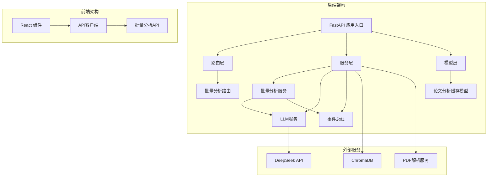
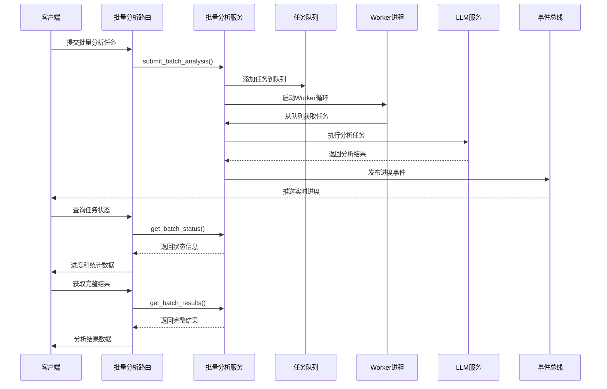
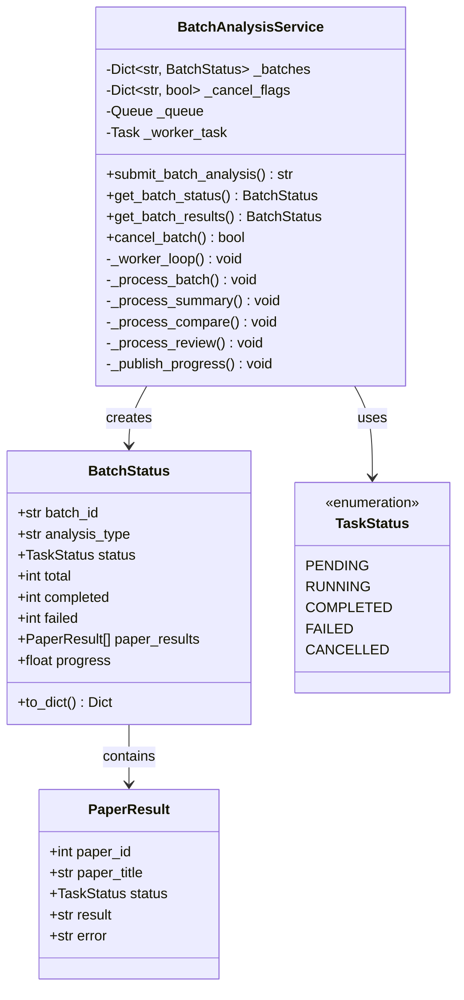
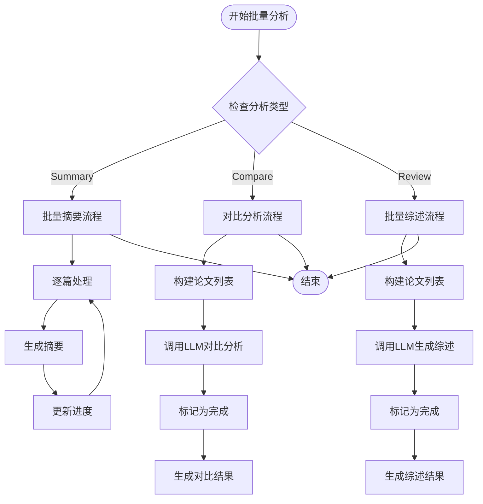
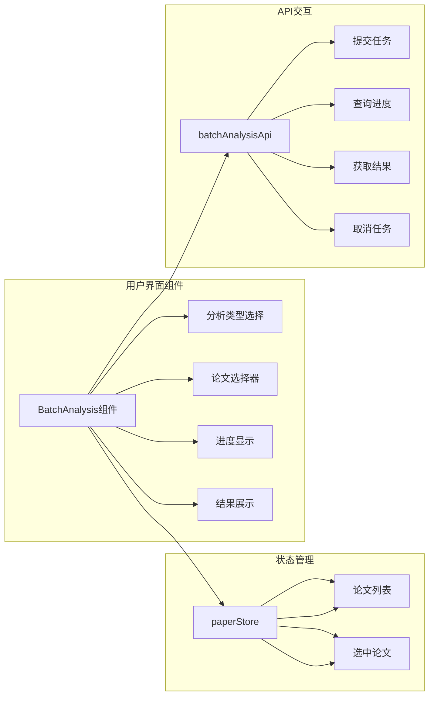
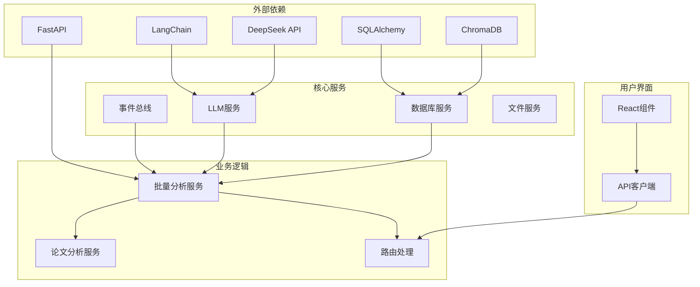

# 批量分析系统

<cite>
**本文档引用的文件**
- [README.md](file://README.md)
- [backend/app/routers/batch_analysis.py](file://backend/app/routers/batch_analysis.py)
- [backend/app/services/batch_analysis.py](file://backend/app/services/batch_analysis.py)
- [backend/app/services/paper/batch_service.py](file://backend/app/services/paper/batch_service.py)
- [backend/app/services/event_bus.py](file://backend/app/services/event_bus.py)
- [backend/app/services/llm/llm_service.py](file://backend/app/services/llm/llm_service.py)
- [backend/app/models/paper_analysis.py](file://backend/app/models/paper_analysis.py)
- [backend/app/main.py](file://backend/app/main.py)
- [backend/app/startup.py](file://backend/app/startup.py)
- [frontend/src/components/BatchAnalysis/BatchAnalysis.jsx](file://frontend/src/components/BatchAnalysis/BatchAnalysis.jsx)
- [frontend/src/api/batchAnalysisApi.ts](file://frontend/src/api/batchAnalysisApi.ts)
</cite>

## 目录
1. [简介](#简介)
2. [项目结构](#项目结构)
3. [核心组件](#核心组件)
4. [架构概览](#架构概览)
5. [详细组件分析](#详细组件分析)
6. [依赖关系分析](#依赖关系分析)
7. [性能考虑](#性能考虑)
8. [故障排除指南](#故障排除指南)
9. [结论](#结论)

## 简介

批量分析系统是PaperChat学术论文智能阅读与问答系统中的核心功能模块，专门用于处理多篇论文的批量分析任务。该系统支持三种分析类型：批量摘要、对比分析和批量综述，采用异步队列处理模式，确保高效稳定的批处理能力。

系统采用前后端分离架构，后端基于FastAPI构建RESTful API，前端使用React实现用户界面，通过WebSocket实现实时进度反馈。整个系统设计注重可扩展性和用户体验，能够处理大规模论文分析任务。

## 项目结构

批量分析系统位于PaperChat项目的完整技术栈中，采用模块化设计：

**图表来源**
- [backend/app/main.py:28-341](file://backend/app/main.py#L28-L341)
- [backend/app/routers/batch_analysis.py:19-146](file://backend/app/routers/batch_analysis.py#L19-L146)

**章节来源**
- [README.md:72-183](file://README.md#L72-L183)
- [backend/app/main.py:28-341](file://backend/app/main.py#L28-L341)

## 核心组件

批量分析系统由多个核心组件构成，每个组件都有明确的职责和边界：

### 1. 批量分析服务 (BatchAnalysisService)

这是系统的核心协调器，负责：
- 任务队列管理
- 分析类型分发
- 进度跟踪
- 错误处理
- 事件发布

### 2. 批量分析路由 (BatchAnalysisRouter)

提供RESTful API接口：
- 任务提交：`POST /api/v1/analysis/batch`
- 进度查询：`GET /api/v1/analysis/batch/{batch_id}`
- 结果获取：`GET /api/v1/analysis/batch/{batch_id}/results`
- 任务取消：`DELETE /api/v1/analysis/batch/{batch_id}`

### 3. 事件总线 (EventBus)

实现发布-订阅模式：
- 任务状态变更通知
- 实时进度推送
- 异步事件处理

### 4. LLM服务集成

与DeepSeek大模型的集成：
- 文本摘要生成
- 对比分析
- 文献综述
- 结构化信息提取

**章节来源**
- [backend/app/services/batch_analysis.py:94-370](file://backend/app/services/batch_analysis.py#L94-L370)
- [backend/app/routers/batch_analysis.py:22-146](file://backend/app/routers/batch_analysis.py#L22-L146)
- [backend/app/services/event_bus.py:22-122](file://backend/app/services/event_bus.py#L22-L122)

## 架构概览

批量分析系统采用分层架构设计，确保各层职责清晰：

**图表来源**
- [backend/app/routers/batch_analysis.py:39-146](file://backend/app/routers/batch_analysis.py#L39-L146)
- [backend/app/services/batch_analysis.py:112-254](file://backend/app/services/batch_analysis.py#L112-L254)
- [backend/app/services/event_bus.py:62-91](file://backend/app/services/event_bus.py#L62-L91)

## 详细组件分析

### 批量分析服务架构

**图表来源**
- [backend/app/services/batch_analysis.py:94-370](file://backend/app/services/batch_analysis.py#L94-L370)

### 分析类型处理流程

系统支持三种不同的分析类型，每种都有特定的处理逻辑：

#### 批量摘要 (Summary)
- 逐篇处理每篇论文
- 独立生成摘要
- 支持取消操作
- 实时进度反馈

#### 对比分析 (Compare)
- 整体处理所有论文
- 一次性调用LLM进行对比
- 生成统一的对比报告
- 每篇论文标记为完成

#### 批量综述 (Review)
- 整体处理所有论文
- 生成文献综述
- 统一的综述结果
- 每篇论文标记为完成

**图表来源**
- [backend/app/services/batch_analysis.py:256-340](file://backend/app/services/batch_analysis.py#L256-L340)

### 前端交互组件

前端使用React构建了完整的用户界面：

**图表来源**
- [frontend/src/components/BatchAnalysis/BatchAnalysis.jsx:33-320](file://frontend/src/components/BatchAnalysis/BatchAnalysis.jsx#L33-L320)
- [frontend/src/api/batchAnalysisApi.ts:35-73](file://frontend/src/api/batchAnalysisApi.ts#L35-L73)

**章节来源**
- [frontend/src/components/BatchAnalysis/BatchAnalysis.jsx:1-320](file://frontend/src/components/BatchAnalysis/BatchAnalysis.jsx#L1-L320)
- [frontend/src/api/batchAnalysisApi.ts:1-74](file://frontend/src/api/batchAnalysisApi.ts#L1-L74)

## 依赖关系分析

批量分析系统的依赖关系体现了清晰的分层设计：

**图表来源**
- [backend/app/main.py:28-341](file://backend/app/main.py#L28-L341)
- [backend/app/startup.py:19-200](file://backend/app/startup.py#L19-L200)

### 关键依赖特性

1. **异步处理**：使用asyncio实现非阻塞I/O
2. **事件驱动**：基于事件总线实现松耦合通信
3. **流式处理**：支持LLM的流式响应
4. **缓存机制**：论文分析结果缓存优化性能

**章节来源**
- [backend/app/services/batch_analysis.py:10-21](file://backend/app/services/batch_analysis.py#L10-L21)
- [backend/app/services/event_bus.py:22-104](file://backend/app/services/event_bus.py#L22-L104)

## 性能考虑

批量分析系统在设计时充分考虑了性能优化：

### 1. 内存管理
- 使用内存字典存储任务状态
- 避免持久化开销
- 支持任务过期清理

### 2. 并发控制
- Worker单线程顺序处理
- 防止LLM调用过载
- 避免Token消耗峰值

### 3. 缓存策略
- 论文分析结果缓存
- 减少重复计算
- 支持快速查询

### 4. 网络优化
- 流式响应处理
- 异步I/O操作
- 连接池管理

## 故障排除指南

### 常见问题及解决方案

#### 1. 任务提交失败
**症状**：提交批量分析任务时报错
**可能原因**：
- 论文ID无效或不存在
- 分析类型不支持
- 数据库连接问题

**解决步骤**：
1. 验证论文ID有效性
2. 检查分析类型参数
3. 确认数据库服务正常

#### 2. 进度查询异常
**症状**：查询任务状态返回404
**可能原因**：
- 任务已过期
- batch_id错误
- 服务重启导致状态丢失

**解决步骤**：
1. 重新提交任务获取新batch_id
2. 检查任务是否仍在运行
3. 查看服务日志

#### 3. LLM调用超时
**症状**：分析过程卡住或超时
**可能原因**：
- DeepSeek API网络问题
- Token配额限制
- 请求频率过高

**解决步骤**：
1. 检查API密钥配置
2. 验证网络连接
3. 降低请求频率

**章节来源**
- [backend/app/routers/batch_analysis.py:65-72](file://backend/app/routers/batch_analysis.py#L65-L72)
- [backend/app/services/batch_analysis.py:212-218](file://backend/app/services/batch_analysis.py#L212-L218)

## 结论

批量分析系统展现了现代AI应用的优秀实践，具有以下特点：

### 技术优势
- **架构清晰**：分层设计便于维护和扩展
- **性能优异**：异步处理和缓存机制确保高效运行
- **用户体验好**：实时进度反馈和直观界面
- **可扩展性强**：模块化设计支持功能扩展

### 设计亮点
- **事件驱动架构**：松耦合组件通信
- **流式处理**：优化用户体验
- **错误处理完善**：健壮的异常处理机制
- **监控友好**：详细的日志和状态跟踪

### 应用价值
批量分析系统为学术研究提供了强大的工具支持，能够显著提高论文处理效率，支持大规模文献分析需求。系统的模块化设计也为未来的功能扩展奠定了良好基础。

通过合理的设计和技术选型，该系统在保证性能的同时，也确保了良好的可维护性和扩展性，是AI驱动的学术工具应用的优秀范例。