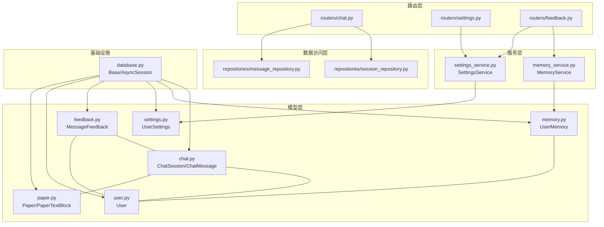
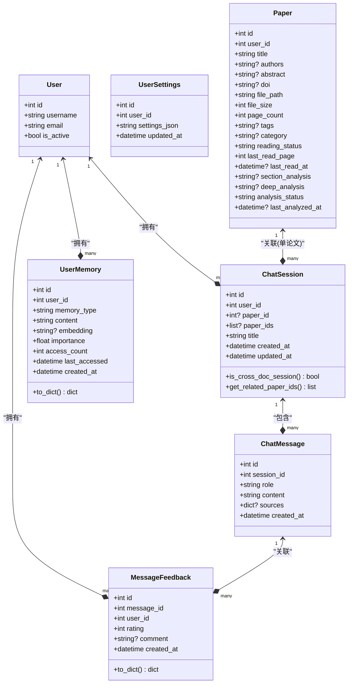
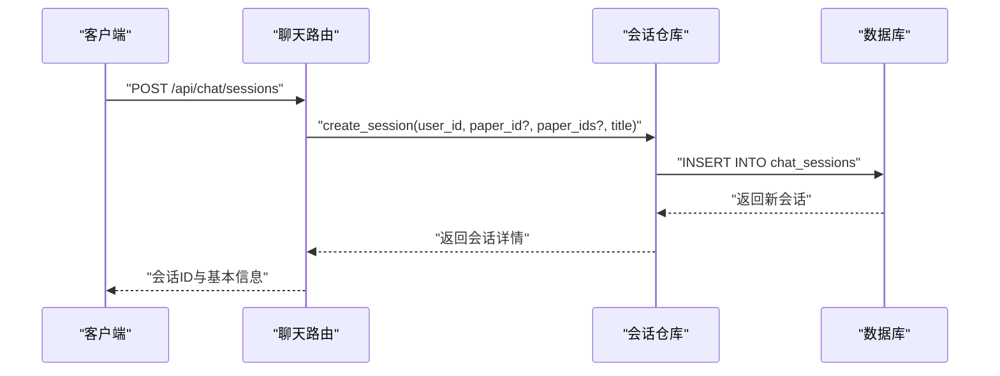
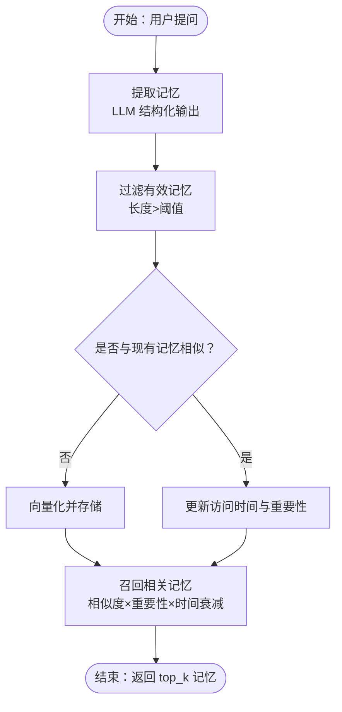
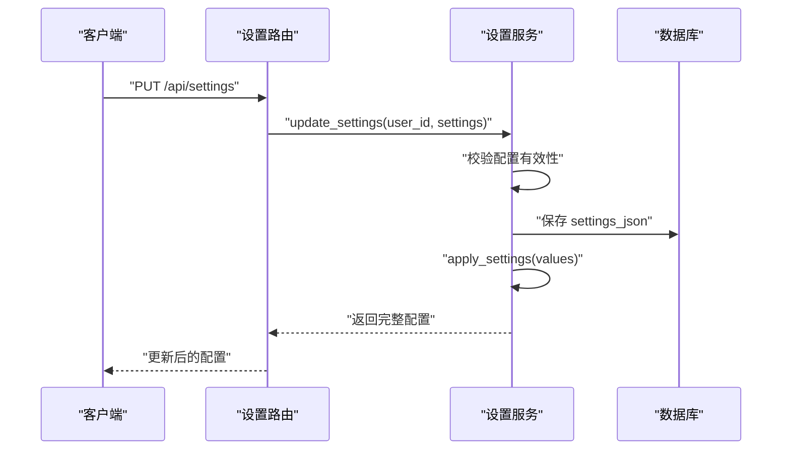
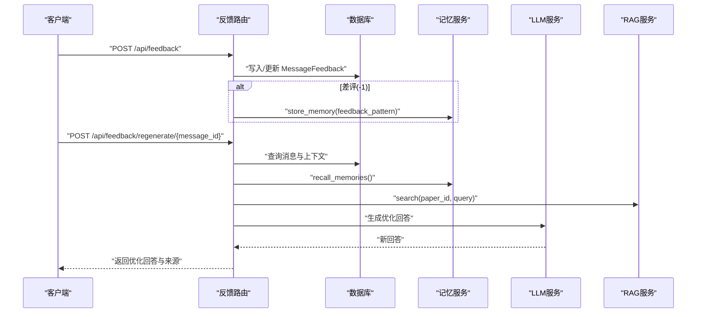
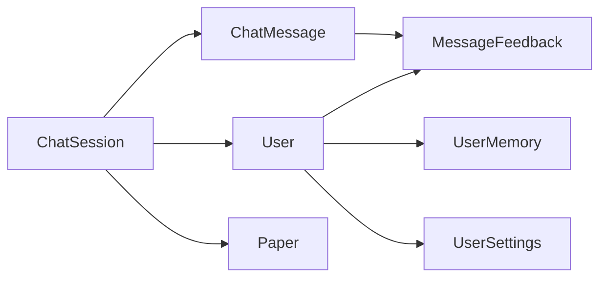

# 专用数据模型

<cite>
**本文档引用的文件**
- [chat.py](file://backend/app/models/chat.py)
- [memory.py](file://backend/app/models/memory.py)
- [settings.py](file://backend/app/models/settings.py)
- [feedback.py](file://backend/app/models/feedback.py)
- [user.py](file://backend/app/models/user.py)
- [paper.py](file://backend/app/models/paper.py)
- [database.py](file://backend/app/database.py)
- [__init__.py](file://backend/app/models/__init__.py)
- [memory_service.py](file://backend/app/services/memory_service.py)
- [settings_service.py](file://backend/app/services/settings_service.py)
- [chat.py](file://backend/app/routers/chat.py)
- [settings.py](file://backend/app/routers/settings.py)
- [feedback.py](file://backend/app/routers/feedback.py)
- [session_repository.py](file://backend/app/repositories/session_repository.py)
- [message_repository.py](file://backend/app/repositories/message_repository.py)
</cite>

## 目录
1. [引言](#引言)
2. [项目结构](#项目结构)
3. [核心组件](#核心组件)
4. [架构总览](#架构总览)
5. [详细组件分析](#详细组件分析)
6. [依赖分析](#依赖分析)
7. [性能考量](#性能考量)
8. [故障排查指南](#故障排查指南)
9. [结论](#结论)
10. [附录](#附录)

## 引言
本文件聚焦 PaperChat 的专用数据模型，系统性阐述 Chat、Memory、Settings、Feedback 等模型的设计理念、字段与关系、数据流与性能优化策略，并结合实际路由与服务层使用场景，给出最佳实践与扩展建议。同时覆盖数据安全、隐私保护与合规性设计要点，帮助读者在理解业务价值的基础上高效使用与演进这些模型。

## 项目结构
后端采用 SQLAlchemy ORM + 异步数据库连接，模型统一继承自声明式基类，通过路由层暴露 REST 接口，服务层负责业务逻辑与外部集成，仓库层封装纯 CRUD 数据访问。

图表来源
- [database.py:1-81](file://backend/app/database.py#L1-L81)
- [chat.py:14-71](file://backend/app/models/chat.py#L14-L71)
- [memory.py:14-54](file://backend/app/models/memory.py#L14-L54)
- [settings.py:11-30](file://backend/app/models/settings.py#L11-L30)
- [feedback.py:14-48](file://backend/app/models/feedback.py#L14-L48)
- [user.py:11-36](file://backend/app/models/user.py#L11-L36)
- [paper.py:11-85](file://backend/app/models/paper.py#L11-L85)
- [memory_service.py:46-438](file://backend/app/services/memory_service.py#L46-L438)
- [settings_service.py:168-523](file://backend/app/services/settings_service.py#L168-L523)
- [chat.py:19-295](file://backend/app/routers/chat.py#L19-L295)
- [settings.py:17-94](file://backend/app/routers/settings.py#L17-L94)
- [feedback.py:50-408](file://backend/app/routers/feedback.py#L50-L408)
- [session_repository.py:15-99](file://backend/app/repositories/session_repository.py#L15-L99)
- [message_repository.py:10-55](file://backend/app/repositories/message_repository.py#L10-L55)

章节来源
- [database.py:1-81](file://backend/app/database.py#L1-L81)
- [__init__.py:1-29](file://backend/app/models/__init__.py#L1-L29)

## 核心组件
- 会话与消息模型：支持单论文与跨文档会话，消息包含角色、内容与来源引用，支持反馈关联。
- 用户记忆模型：长期记忆向量化存储，支持相似度召回与重要性衰减。
- 用户设置模型：以 JSON 存储全量个性化配置，支持默认值、校验与运行时应用。
- 反馈模型：记录用户对回答的点赞/点踩与文字反馈，支持统计与负面反馈自动重跑。

章节来源
- [chat.py:14-71](file://backend/app/models/chat.py#L14-L71)
- [memory.py:14-54](file://backend/app/models/memory.py#L14-L54)
- [settings.py:11-30](file://backend/app/models/settings.py#L11-L30)
- [feedback.py:14-48](file://backend/app/models/feedback.py#L14-L48)

## 架构总览
专用数据模型在系统中的职责与交互如下：

图表来源
- [user.py:11-36](file://backend/app/models/user.py#L11-L36)
- [chat.py:14-71](file://backend/app/models/chat.py#L14-L71)
- [memory.py:14-54](file://backend/app/models/memory.py#L14-L54)
- [settings.py:11-30](file://backend/app/models/settings.py#L11-L30)
- [feedback.py:14-48](file://backend/app/models/feedback.py#L14-L48)
- [paper.py:11-85](file://backend/app/models/paper.py#L11-L85)

## 详细组件分析

### 会话与消息模型（Chat）
- 设计要点
  - 支持单论文与跨文档会话：通过 paper_id 与 paper_ids 字段区分；提供工具方法判断与解析关联论文集合。
  - 消息来源引用：sources 字段以 JSON 存储引用来源，便于后续溯源与可视化标注。
  - 关系设计：会话与用户、论文、消息双向关联；消息与反馈一对多，级联删除保证数据一致性。
- 字段与索引
  - user_id/paper_id/paper_ids 均建立索引，提升查询效率。
  - created_at/updated_at 自动维护，便于排序与审计。
- 使用场景
  - 单论文问答：会话仅关联一张论文，适合精读与深度讨论。
  - 跨文档问答：会话关联多篇论文，适合对比分析与综合问答。
- 性能与复杂度
  - 会话列表按更新时间倒序，消息按创建时间正序，满足“最近优先”的交互体验。
  - 跨文档会话查询通过 contains 判断，避免 N+1 查询。
- 扩展建议
  - 可引入会话标签/分类字段，支持按主题归档。
  - 可增加消息状态（如“正在生成”、“已引用”）以增强前端交互反馈。

图表来源
- [chat.py:49-84](file://backend/app/routers/chat.py#L49-L84)
- [session_repository.py:67-78](file://backend/app/repositories/session_repository.py#L67-L78)

章节来源
- [chat.py:14-71](file://backend/app/models/chat.py#L14-L71)
- [chat.py:19-295](file://backend/app/routers/chat.py#L19-L295)
- [session_repository.py:15-99](file://backend/app/repositories/session_repository.py#L15-L99)
- [message_repository.py:10-55](file://backend/app/repositories/message_repository.py#L10-L55)

### 用户记忆模型（Memory）
- 设计要点
  - 多类型记忆：研究方向、偏好、术语使用、背景、反馈模式等，统一以 memory_type 标识。
  - 向量化存储：embedding 字段存储向量，支持相似度召回；重要性 importance 与访问计数 access_count 辅助排序。
  - 时间衰减：按天指数衰减，避免长期未访问记忆占用检索权重。
- 核心流程
  - 记忆提取：从对话中抽取结构化记忆，去重后入库。
  - 记忆召回：查询用户全部记忆，计算与查询的余弦相似度，加权排序取 top_k。
  - 衰减与清理：定期降低长时间未访问记忆的重要性，必要时删除低价值记忆。
- 性能与复杂度
  - 相似度计算为 O(n) 遍历，n 为用户记忆总数；可通过向量索引（如 Faiss）进一步优化。
  - 建议对 embedding 字段建立向量索引与 ANN 检索。
- 安全与隐私
  - embedding 与 content 均为明文存储，需配合访问控制与最小权限原则；敏感内容应脱敏或迁移至受控存储。

图表来源
- [memory_service.py:83-301](file://backend/app/services/memory_service.py#L83-L301)
- [memory.py:14-54](file://backend/app/models/memory.py#L14-L54)

章节来源
- [memory.py:14-54](file://backend/app/models/memory.py#L14-L54)
- [memory_service.py:46-438](file://backend/app/services/memory_service.py#L46-L438)

### 用户设置模型（Settings）
- 设计要点
  - JSON 存储：settings_json 以 JSON 字符串存储用户自定义配置，支持任意层级结构。
  - 默认值与校验：内置默认配置模板，提供类型与范围校验，确保配置合法性。
  - 运行时应用：更新后可将配置应用到各服务（LLM、RAG、搜索、推荐等）。
  - 敏感信息脱敏：API Key 在返回前脱敏，避免泄露。
- 使用场景
  - LLM 参数：模型、温度、最大 Token 数、API 地址等。
  - RAG 参数：检索数量、分块大小与重叠等。
  - 搜索与推荐：最大结果数、超时等。
  - 界面外观：主题、强调色、字体大小、紧凑模式等。
- 性能与复杂度
  - JSON 解析与合并为 O(m+n)，m/n 为默认与用户配置项数；建议缓存用户配置以减少 IO。
- 安全与隐私
  - API Key 仅在内存中临时使用，不落盘；脱敏返回前端，避免泄露风险。

图表来源
- [settings.py:31-63](file://backend/app/routers/settings.py#L31-L63)
- [settings_service.py:329-404](file://backend/app/services/settings_service.py#L329-L404)
- [settings.py:11-30](file://backend/app/models/settings.py#L11-L30)

章节来源
- [settings.py:11-30](file://backend/app/models/settings.py#L11-L30)
- [settings_service.py:168-523](file://backend/app/services/settings_service.py#L168-L523)
- [settings.py:17-94](file://backend/app/routers/settings.py#L17-L94)

### 反馈模型（Feedback）
- 设计要点
  - 评分与评论：rating 为 1（👍）或 -1（👎），支持可选 comment 文字反馈。
  - 权限校验：提交反馈前校验消息归属与用户权限，防止越权。
  - 统计与重跑：提供反馈统计接口；对差评自动触发重跑，结合记忆与 RAG 生成优化回答。
- 使用场景
  - 用户体验改进：收集差评与评论，驱动模型与检索优化。
  - 自动修复：差评触发重跑，结合记忆与检索上下文生成更优答案。
- 性能与复杂度
  - 统计查询为 O(k)（k 为用户反馈总数）；重跑涉及 LLM 与 RAG，建议异步执行并限制并发。
- 安全与隐私
  - 评论内容可能包含敏感信息，建议在入库前进行内容审核与脱敏。

图表来源
- [feedback.py:50-136](file://backend/app/routers/feedback.py#L50-L136)
- [feedback.py:205-363](file://backend/app/routers/feedback.py#L205-L363)
- [memory_service.py:226-301](file://backend/app/services/memory_service.py#L226-L301)
- [feedback.py:14-48](file://backend/app/models/feedback.py#L14-L48)

章节来源
- [feedback.py:14-48](file://backend/app/models/feedback.py#L14-L48)
- [feedback.py:50-408](file://backend/app/routers/feedback.py#L50-L408)
- [memory_service.py:46-438](file://backend/app/services/memory_service.py#L46-L438)

## 依赖分析
- 模型间依赖
  - ChatSession 依赖 User 与 Paper；ChatMessage 依赖 ChatSession 并与 MessageFeedback 双向关联。
  - User 与 UserMemory、MessageFeedback、Paper 等多对多/一对多关系。
- 服务与模型
  - MemoryService 直接操作 UserMemory；SettingsService 操作 UserSettings。
- 路由与仓库
  - 路由层通过仓库层访问模型，保持业务与数据访问分离。

图表来源
- [chat.py:14-71](file://backend/app/models/chat.py#L14-L71)
- [memory.py:14-54](file://backend/app/models/memory.py#L14-L54)
- [settings.py:11-30](file://backend/app/models/settings.py#L11-L30)
- [feedback.py:14-48](file://backend/app/models/feedback.py#L14-L48)
- [user.py:11-36](file://backend/app/models/user.py#L11-L36)

章节来源
- [__init__.py:1-29](file://backend/app/models/__init__.py#L1-L29)

## 性能考量
- 索引策略
  - 会话与消息按 user_id/paper_id/paper_ids/session_id 建立索引，加速过滤与排序。
  - 记忆按 user_id 与 memory_type 建立复合索引，提升召回效率。
- 查询优化
  - 会话列表使用 selectinload 预加载消息，避免 N+1。
  - 跨文档会话查询使用 contains 判断，避免循环展开。
- 向量化与检索
  - 建议对 embedding 字段建立向量索引（ANN），将 O(n) 相似度计算降为 O(log n)。
- 异步与并发
  - 使用异步数据库连接与线程池执行向量化，平衡吞吐与延迟。
- 缓存与批处理
  - 用户设置与常用记忆可缓存；批量写入消息与反馈，减少事务开销。

## 故障排查指南
- 会话查询异常
  - 症状：会话列表为空或权限错误。
  - 排查：确认 user_id 与 paper_id/paper_ids 索引是否生效；检查路由层权限校验逻辑。
- 记忆召回不准
  - 症状：召回结果稀疏或相关性低。
  - 排查：检查 embedding 是否正确入库；调整相似度阈值与 top_k；评估向量模型质量。
- 设置更新失败
  - 症状：配置校验报错或未生效。
  - 排查：核对 DEFAULT_SETTINGS 中的类型与范围；确认 apply_settings 是否调用成功。
- 反馈重跑失败
  - 症状：重跑无结果或报错。
  - 排查：确认 paper_id 与检索上下文；检查 RAG 检索是否返回内容；查看 LLM 服务可用性。

章节来源
- [session_repository.py:15-99](file://backend/app/repositories/session_repository.py#L15-L99)
- [memory_service.py:46-438](file://backend/app/services/memory_service.py#L46-L438)
- [settings_service.py:168-523](file://backend/app/services/settings_service.py#L168-L523)
- [feedback.py:205-363](file://backend/app/routers/feedback.py#L205-L363)

## 结论
专用数据模型围绕“会话与消息”“长期记忆”“个性化设置”“用户反馈”四大维度构建，既满足论文阅读辅助的强交互需求，又为 AI 服务的参数化与智能化提供数据基础。通过合理的索引、向量化与异步化策略，可在保证用户体验的同时兼顾性能与可维护性。建议持续完善向量检索、配置缓存与内容安全治理，以支撑更大规模的应用演进。

## 附录
- 数据安全与隐私
  - API Key 脱敏与最小暴露；评论内容入库前审核；访问控制与审计日志。
- 合规性设计
  - 遵循数据最小化原则，明确数据生命周期；提供数据导出与删除能力；对跨境数据传输进行合规评估。
- 扩展建议
  - 引入向量索引与检索优化；完善配置热更新与灰度发布；增强反馈闭环与 A/B 实验能力。