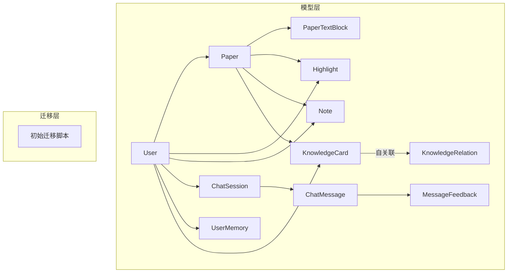
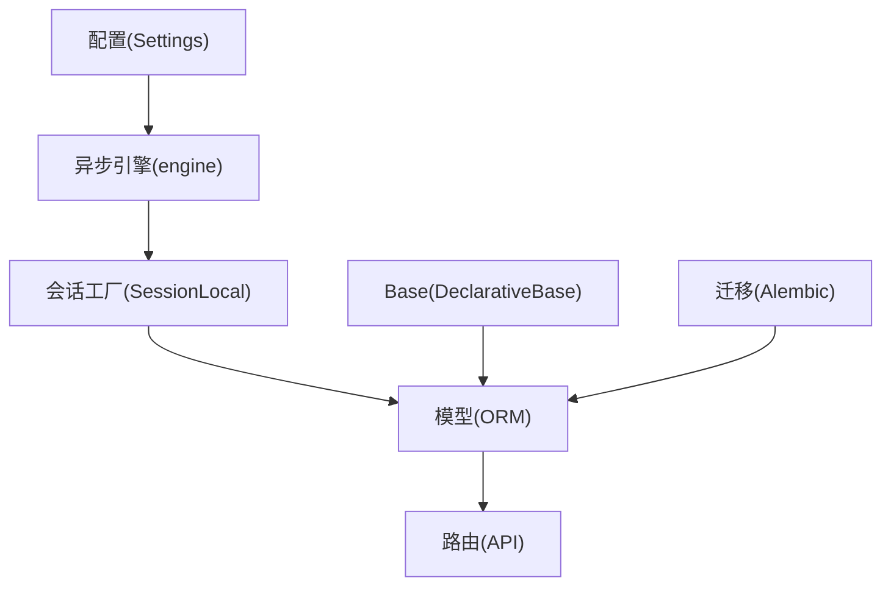
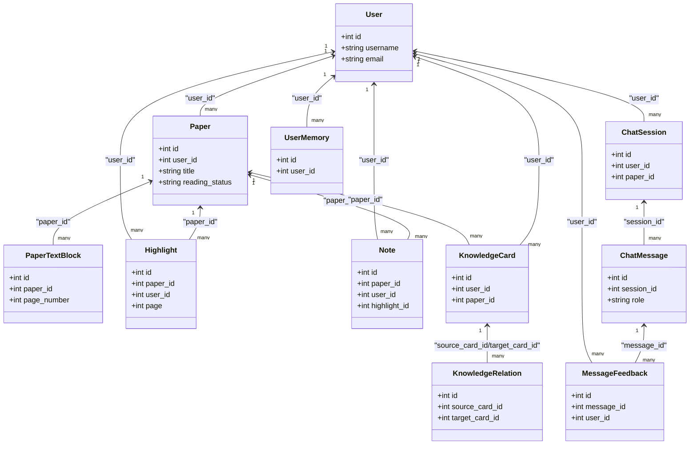
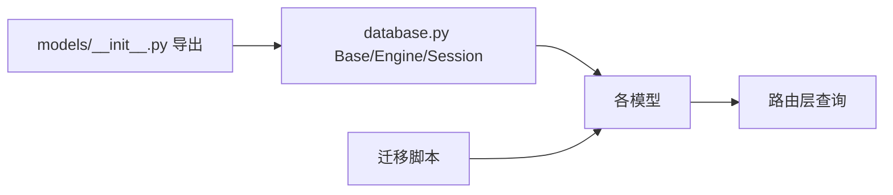

# 关系设计与映射

<cite>
**本文档引用的文件**
- [backend/app/models/__init__.py](file://backend/app/models/__init__.py)
- [backend/app/models/user.py](file://backend/app/models/user.py)
- [backend/app/models/paper.py](file://backend/app/models/paper.py)
- [backend/app/models/highlight.py](file://backend/app/models/highlight.py)
- [backend/app/models/note.py](file://backend/app/models/note.py)
- [backend/app/models/chat.py](file://backend/app/models/chat.py)
- [backend/app/models/knowledge.py](file://backend/app/models/knowledge.py)
- [backend/app/models/memory.py](file://backend/app/models/memory.py)
- [backend/app/models/feedback.py](file://backend/app/models/feedback.py)
- [backend/migrations/versions/6895243c431d_initial_schema.py](file://backend/migrations/versions/6895243c431d_initial_schema.py)
- [backend/app/routers/papers.py](file://backend/app/routers/papers.py)
- [backend/app/routers/notes.py](file://backend/app/routers/notes.py)
- [backend/app/database.py](file://backend/app/database.py)
- [backend/app/config.py](file://backend/app/config.py)
</cite>

## 目录
1. [简介](#简介)
2. [项目结构](#项目结构)
3. [核心组件](#核心组件)
4. [架构总览](#架构总览)
5. [详细组件分析](#详细组件分析)
6. [依赖分析](#依赖分析)
7. [性能考量](#性能考量)
8. [故障排查指南](#故障排查指南)
9. [结论](#结论)
10. [附录](#附录)

## 简介
本文件系统化梳理 PaperChat 的数据库关系设计，聚焦实体间一对一、一对多、多对多关系的映射实现，详述外键约束、级联删除策略与引用完整性保障；结合路由层的实际查询使用，总结连接策略、查询优化与性能要点，并给出复杂查询场景的最佳实践与关系变更管理建议。

## 项目结构
后端采用 SQLAlchemy ORM + Alembic 迁移，模型集中于 models 目录并通过统一的 Base 声明式基类进行声明；路由层通过异步会话执行查询，配合索引与预加载策略提升性能。

图表来源
- [backend/app/models/user.py:11-36](file://backend/app/models/user.py#L11-L36)
- [backend/app/models/paper.py:11-85](file://backend/app/models/paper.py#L11-L85)
- [backend/app/models/highlight.py:10-37](file://backend/app/models/highlight.py#L10-L37)
- [backend/app/models/note.py:11-34](file://backend/app/models/note.py#L11-L34)
- [backend/app/models/chat.py:14-71](file://backend/app/models/chat.py#L14-L71)
- [backend/app/models/knowledge.py:14-80](file://backend/app/models/knowledge.py#L14-L80)
- [backend/migrations/versions/6895243c431d_initial_schema.py:21-39](file://backend/migrations/versions/6895243c431d_initial_schema.py#L21-L39)

章节来源
- [backend/app/models/__init__.py:1-29](file://backend/app/models/__init__.py#L1-L29)
- [backend/app/database.py:8-10](file://backend/app/database.py#L8-L10)
- [backend/app/config.py:22-24](file://backend/app/config.py#L22-L24)

## 核心组件
- 用户（User）：多对多关系到 Paper、Highlight、Note、ChatSession、UserMemory、MessageFeedback、KnowledgeCard。
- 论文（Paper）：一对多到 PaperTextBlock、Highlight、Note、KnowledgeCard；多对一到 User。
- 高亮（Highlight）：一对多到 Note；多对一到 User、Paper。
- 笔记（Note）：多对一到 User、Paper、Highlight。
- 聊天（ChatSession/ChatMessage）：多对一到 User、Paper；一对多到 ChatMessage；MessageFeedback 多对一到两者。
- 知识（KnowledgeCard/KnowledgeRelation）：多对一到 User、Paper；自关联多对多到 KnowledgeRelation。
- 记忆（UserMemory）：多对一到 User。
- 反馈（MessageFeedback）：多对一到 User、ChatMessage。

章节来源
- [backend/app/models/user.py:11-36](file://backend/app/models/user.py#L11-L36)
- [backend/app/models/paper.py:11-85](file://backend/app/models/paper.py#L11-L85)
- [backend/app/models/highlight.py:10-37](file://backend/app/models/highlight.py#L10-L37)
- [backend/app/models/note.py:11-34](file://backend/app/models/note.py#L11-L34)
- [backend/app/models/chat.py:14-71](file://backend/app/models/chat.py#L14-L71)
- [backend/app/models/knowledge.py:14-80](file://backend/app/models/knowledge.py#L14-L80)
- [backend/app/models/memory.py:14-54](file://backend/app/models/memory.py#L14-L54)
- [backend/app/models/feedback.py:14-48](file://backend/app/models/feedback.py#L14-L48)

## 架构总览
数据库层以异步 SQLAlchemy 引擎提供连接，路由层通过依赖注入获取会话，执行查询与事务提交。迁移脚本负责索引与列属性调整，确保查询性能与约束一致性。

图表来源
- [backend/app/config.py:22-24](file://backend/app/config.py#L22-L24)
- [backend/app/database.py:14-27](file://backend/app/database.py#L14-L27)
- [backend/app/database.py:8-10](file://backend/app/database.py#L8-L10)
- [backend/migrations/versions/6895243c431d_initial_schema.py:21-39](file://backend/migrations/versions/6895243c431d_initial_schema.py#L21-L39)

## 详细组件分析

### 实体关系与外键约束
- 用户与论文：Paper.user_id → User.id（一对多）
- 论文与文本块：PaperTextBlock.paper_id → Paper.id（一对多，级联删除）
- 论文与高亮：Highlight.paper_id → Paper.id（一对多，级联删除）
- 论文与笔记：Note.paper_id → Paper.id（一对多，级联删除）
- 用户与高亮：Highlight.user_id → User.id（一对多）
- 用户与笔记：Note.user_id → User.id（一对多）
- 用户与聊天会话：ChatSession.user_id → User.id（一对多）
- 论文与聊天会话：ChatSession.paper_id → Paper.id（一对多，兼容旧字段）
- 聊天会话与消息：ChatMessage.session_id → ChatSession.id（一对多，级联删除）
- 消息与反馈：MessageFeedback.message_id → ChatMessage.id（一对多）
- 用户与反馈：MessageFeedback.user_id → User.id（一对多）
- 用户与记忆：UserMemory.user_id → User.id（一对多）
- 用户与知识卡：KnowledgeCard.user_id → User.id（一对多）
- 论文与知识卡：KnowledgeCard.paper_id → Paper.id（一对多）
- 知识卡与知识关联：KnowledgeRelation.source_card_id/target_card_id → KnowledgeCard.id（自关联，多对多）

章节来源
- [backend/app/models/paper.py:17-59](file://backend/app/models/paper.py#L17-L59)
- [backend/app/models/highlight.py:16-33](file://backend/app/models/highlight.py#L16-L33)
- [backend/app/models/note.py:17-30](file://backend/app/models/note.py#L17-L30)
- [backend/app/models/chat.py:20-67](file://backend/app/models/chat.py#L20-L67)
- [backend/app/models/knowledge.py:20-76](file://backend/app/models/knowledge.py#L20-L76)
- [backend/app/models/memory.py:27-37](file://backend/app/models/memory.py#L27-L37)
- [backend/app/models/feedback.py:25-33](file://backend/app/models/feedback.py#L25-L33)

### 级联删除策略与引用完整性
- 论文删除时，其文本块、高亮、笔记、知识卡均被级联删除（delete-orphan），确保引用完整性。
- 聊天消息删除时，其反馈也被级联删除。
- 高亮删除时，其笔记被级联删除。
- 外键约束通过 SQLAlchemy 映射与数据库迁移共同保证，迁移脚本创建了关键索引以支撑查询与约束检查。

章节来源
- [backend/app/models/paper.py:43-59](file://backend/app/models/paper.py#L43-L59)
- [backend/app/models/chat.py:33-35](file://backend/app/models/chat.py#L33-L35)
- [backend/app/models/highlight.py:32-33](file://backend/app/models/highlight.py#L32-L33)
- [backend/migrations/versions/6895243c431d_initial_schema.py:24-39](file://backend/migrations/versions/6895243c431d_initial_schema.py#L24-L39)

### 关系查询与连接策略
- 论文列表预加载文本块，减少 N+1 查询风险。
- 笔记查询通过外连接（outerjoin）关联高亮，返回高亮文本以便前端渲染。
- 聊天会话支持单论文与多论文（JSON 数组）两种模式，查询时根据字段选择性拼接。

章节来源
- [backend/app/routers/papers.py:143-145](file://backend/app/routers/papers.py#L143-L145)
- [backend/app/routers/notes.py:50-54](file://backend/app/routers/notes.py#L50-L54)

### 复杂查询场景与最佳实践
- 多表关联：在路由层使用 join/outerjoin 组合，先做权限校验（用户与论文/高亮/消息），再做业务过滤（状态、分类、关键词）。
- 子查询与聚合：可基于现有 select 结构扩展聚合函数与分组，注意在外层再次进行权限过滤。
- 性能优化：利用迁移脚本创建的索引（如 user_id、paper_id、reading_status 等），避免全表扫描；对高频过滤字段建立复合索引（如 user_id + 状态）。

章节来源
- [backend/app/routers/papers.py:114-136](file://backend/app/routers/papers.py#L114-L136)
- [backend/app/routers/notes.py:36-47](file://backend/app/routers/notes.py#L36-L47)
- [backend/migrations/versions/6895243c431d_initial_schema.py:24-39](file://backend/migrations/versions/6895243c431d_initial_schema.py#L24-L39)

### 关系图（代码级）

图表来源
- [backend/app/models/user.py:11-36](file://backend/app/models/user.py#L11-L36)
- [backend/app/models/paper.py:11-85](file://backend/app/models/paper.py#L11-L85)
- [backend/app/models/highlight.py:10-37](file://backend/app/models/highlight.py#L10-L37)
- [backend/app/models/note.py:11-34](file://backend/app/models/note.py#L11-L34)
- [backend/app/models/chat.py:14-71](file://backend/app/models/chat.py#L14-L71)
- [backend/app/models/knowledge.py:14-80](file://backend/app/models/knowledge.py#L14-L80)
- [backend/app/models/memory.py:14-54](file://backend/app/models/memory.py#L14-L54)
- [backend/app/models/feedback.py:14-48](file://backend/app/models/feedback.py#L14-L48)

## 依赖分析
- 模型导出：models/__init__.py 将 Base 与各模型导出，供路由与服务层统一导入。
- 数据库连接：database.py 定义 Base、异步引擎与会话工厂，提供依赖注入函数。
- 迁移脚本：initial_schema 在升级时创建索引，降级时回滚索引，确保查询性能与一致性。

图表来源
- [backend/app/models/__init__.py:5-28](file://backend/app/models/__init__.py#L5-L28)
- [backend/app/database.py:8-27](file://backend/app/database.py#L8-L27)
- [backend/migrations/versions/6895243c431d_initial_schema.py:21-39](file://backend/migrations/versions/6895243c431d_initial_schema.py#L21-L39)

章节来源
- [backend/app/models/__init__.py:5-28](file://backend/app/models/__init__.py#L5-L28)
- [backend/app/database.py:8-27](file://backend/app/database.py#L8-L27)
- [backend/migrations/versions/6895243c431d_initial_schema.py:21-39](file://backend/migrations/versions/6895243c431d_initial_schema.py#L21-L39)

## 性能考量
- 索引策略：迁移脚本为 user_id、paper_id、reading_status 等关键字段建立索引，显著降低过滤与排序成本。
- 预加载：论文列表使用 selectinload 预加载 text_blocks，避免 N+1 查询。
- 连接策略：笔记查询使用 outerjoin 关联高亮，减少额外查询次数。
- 写入路径：批量上传与索引建立采用异步任务，避免阻塞主流程。

章节来源
- [backend/migrations/versions/6895243c431d_initial_schema.py:24-39](file://backend/migrations/versions/6895243c431d_initial_schema.py#L24-L39)
- [backend/app/routers/papers.py:143-145](file://backend/app/routers/papers.py#L143-L145)
- [backend/app/routers/notes.py:50-54](file://backend/app/routers/notes.py#L50-L54)

## 故障排查指南
- 外键冲突：当尝试删除父记录导致子记录仍存在时，检查级联策略与删除顺序；确认迁移脚本已创建索引。
- 权限访问异常：路由层在查询前先校验资源归属（Paper.user_id、Note.user_id 等），若报 404/403，优先检查当前用户与资源 ID 是否匹配。
- 查询性能问题：确认相关字段是否具备索引；避免在大结果集上进行昂贵的 LIKE 或函数计算；必要时增加复合索引。
- 级联删除未生效：检查模型级 cascade 参数与数据库外键约束是否一致；确认 Alembic 迁移已执行。

章节来源
- [backend/app/routers/papers.py:63-88](file://backend/app/routers/papers.py#L63-L88)
- [backend/app/routers/notes.py:36-47](file://backend/app/routers/notes.py#L36-L47)
- [backend/migrations/versions/6895243c431d_initial_schema.py:24-39](file://backend/migrations/versions/6895243c431d_initial_schema.py#L24-L39)

## 结论
PaperChat 的数据库关系设计以用户为中心，围绕论文与其衍生的高亮、笔记、聊天、知识与记忆构建清晰的一对多与多对多关系。通过迁移脚本维护索引与约束、在路由层实施权限校验与连接优化，整体实现了良好的引用完整性与查询性能。建议在后续演进中持续关注索引覆盖与查询模式变化，保持关系设计与查询策略的协同优化。

## 附录
- 查询示例（路径参考）
  - 列举论文并预加载文本块：[backend/app/routers/papers.py:114-145](file://backend/app/routers/papers.py#L114-L145)
  - 获取论文文本块（按页过滤）：[backend/app/routers/papers.py:496-500](file://backend/app/routers/papers.py#L496-L500)
  - 获取论文笔记并关联高亮文本：[backend/app/routers/notes.py:49-55](file://backend/app/routers/notes.py#L49-L55)
  - 搜索笔记（模糊匹配内容）：[backend/app/routers/notes.py:324-330](file://backend/app/routers/notes.py#L324-L330)
  - 聊天会话与消息的级联删除：[backend/app/models/chat.py:33-35](file://backend/app/models/chat.py#L33-L35)
  - 论文删除的级联删除：[backend/app/models/paper.py:43-59](file://backend/app/models/paper.py#L43-L59)