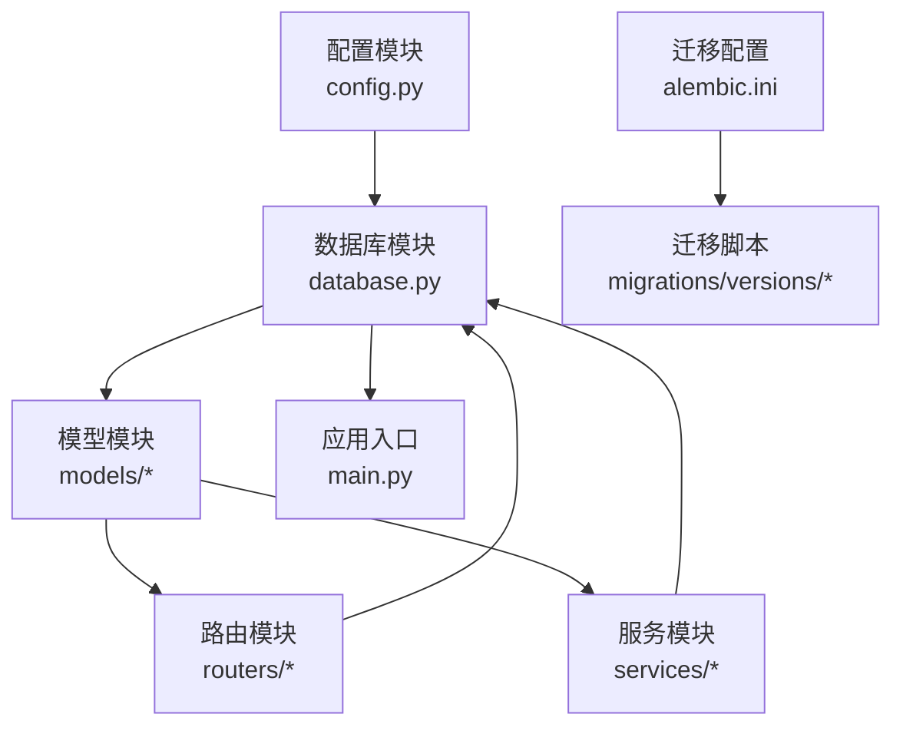
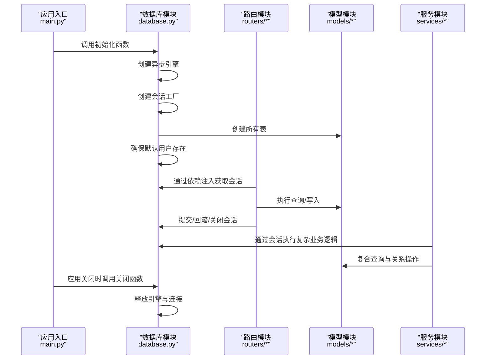
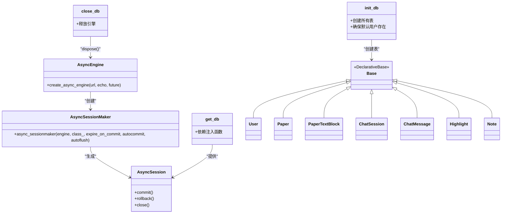
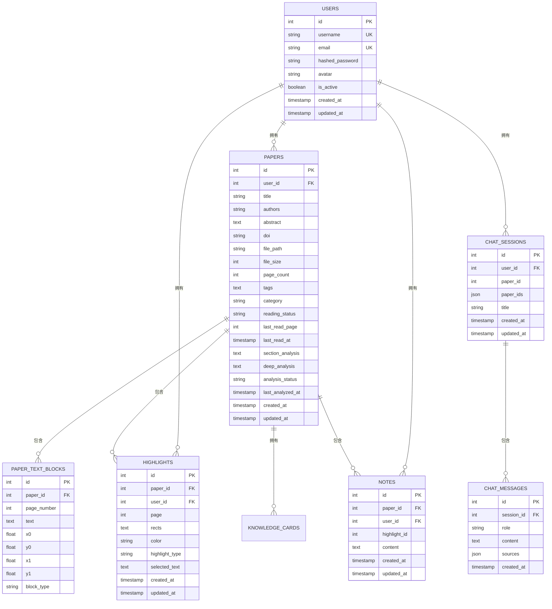
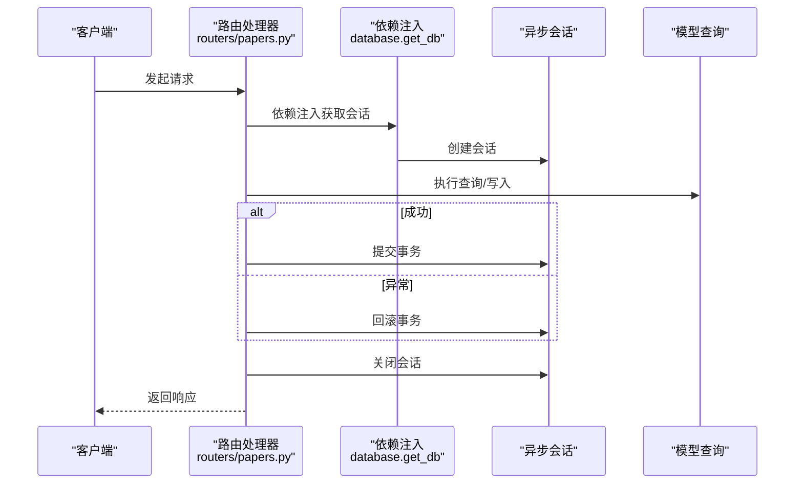
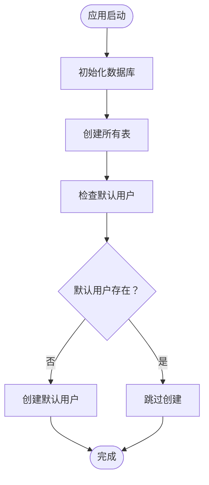
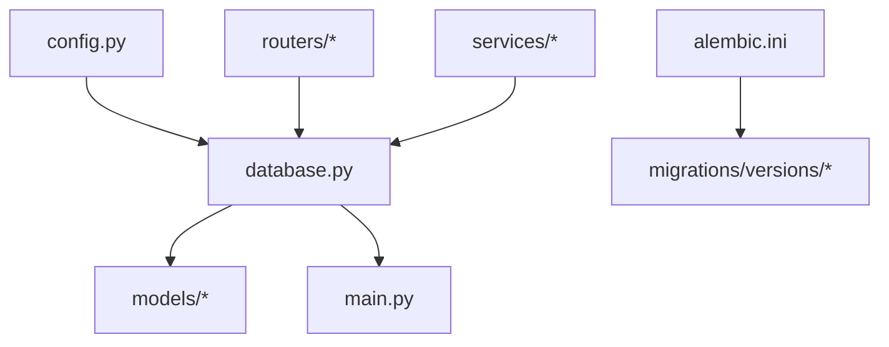

# 数据库架构设计

<cite>
**本文档引用的文件**
- [database.py](file://backend/app/database.py)
- [config.py](file://backend/app/config.py)
- [models/__init__.py](file://backend/app/models/__init__.py)
- [models/user.py](file://backend/app/models/user.py)
- [models/paper.py](file://backend/app/models/paper.py)
- [models/chat.py](file://backend/app/models/chat.py)
- [models/note.py](file://backend/app/models/note.py)
- [models/highlight.py](file://backend/app/models/highlight.py)
- [main.py](file://backend/app/main.py)
- [routers/papers.py](file://backend/app/routers/papers.py)
- [routers/chat.py](file://backend/app/routers/chat.py)
- [services/knowledge_service.py](file://backend/app/services/knowledge_service.py)
- [services/memory_service.py](file://backend/app/services/memory_service.py)
- [migrations/versions/6895243c431d_initial_schema.py](file://backend/migrations/versions/6895243c431d_initial_schema.py)
- [alembic.ini](file://backend/alembic.ini)
</cite>

## 目录
1. [简介](#简介)
2. [项目结构](#项目结构)
3. [核心组件](#核心组件)
4. [架构总览](#架构总览)
5. [详细组件分析](#详细组件分析)
6. [依赖关系分析](#依赖关系分析)
7. [性能考虑](#性能考虑)
8. [故障排除指南](#故障排除指南)
9. [结论](#结论)
10. [附录](#附录)

## 简介
本文件面向 PaperChat 项目的数据库架构设计，重点阐述基于 SQLAlchemy 的异步 ORM 架构。内容涵盖：
- Base 类继承体系与模型组织
- 异步引擎与会话工厂配置
- 依赖注入模式与生命周期管理
- 连接池与事务管理策略
- 错误处理与优雅关闭
- 数据库初始化流程与迁移机制
- 性能优化与最佳实践建议

## 项目结构
PaperChat 的数据库相关代码主要分布在以下模块：
- 配置层：应用配置与数据库连接字符串
- 数据库层：异步引擎、会话工厂、依赖注入函数、初始化与关闭
- 模型层：声明式 Base 与各业务实体模型
- 路由层：API 路由对数据库会话的依赖注入使用
- 服务层：业务服务对数据库会话的使用示例
- 迁移层：Alembic 版本化迁移脚本

**图表来源**
- [config.py:15-44](file://backend/app/config.py#L15-L44)
- [database.py:8-81](file://backend/app/database.py#L8-L81)
- [models/__init__.py:1-29](file://backend/app/models/__init__.py#L1-L29)
- [main.py:16-53](file://backend/app/main.py#L16-L53)
- [alembic.ini:1-150](file://backend/alembic.ini#L1-L150)

**章节来源**
- [config.py:15-44](file://backend/app/config.py#L15-L44)
- [database.py:8-81](file://backend/app/database.py#L8-L81)
- [models/__init__.py:1-29](file://backend/app/models/__init__.py#L1-L29)
- [main.py:16-53](file://backend/app/main.py#L16-L53)
- [alembic.ini:1-150](file://backend/alembic.ini#L1-L150)

## 核心组件
本节聚焦数据库架构的关键构件及其职责。

- Base 类继承体系
  - 定义统一的声明式基类，供所有模型继承，确保元数据一致管理与统一的表映射规则。
  - 通过模型导出清单集中暴露 Base 与其他模型，便于路由和服务模块统一导入。

- 异步引擎与会话工厂
  - 使用异步引擎创建函数，基于配置中的数据库连接字符串与调试开关进行初始化。
  - 会话工厂采用异步会话类，配置过期策略、自动提交、自动刷新等行为，满足异步场景下的会话管理需求。

- 依赖注入与生命周期
  - 提供依赖注入函数，自动创建、提交、回滚与关闭会话，简化路由层与服务层的数据库访问。
  - 应用生命周期钩子负责数据库初始化与优雅关闭，确保资源正确释放。

- 迁移与初始化
  - 迁移配置与版本脚本配合 Alembic，实现数据库结构演进。
  - 应用启动时执行初始化，创建所有表并确保默认用户存在。

**章节来源**
- [database.py:8-81](file://backend/app/database.py#L8-L81)
- [models/__init__.py:1-29](file://backend/app/models/__init__.py#L1-L29)
- [main.py:16-53](file://backend/app/main.py#L16-L53)
- [migrations/versions/6895243c431d_initial_schema.py:21-61](file://backend/migrations/versions/6895243c431d_initial_schema.py#L21-L61)

## 架构总览
PaperChat 的数据库架构采用“配置驱动 + 异步 ORM + 依赖注入”的设计，整体流程如下：

**图表来源**
- [main.py:16-53](file://backend/app/main.py#L16-L53)
- [database.py:50-81](file://backend/app/database.py#L50-L81)
- [routers/papers.py:44-88](file://backend/app/routers/papers.py#L44-L88)
- [routers/chat.py:21-65](file://backend/app/routers/chat.py#L21-L65)

## 详细组件分析

### 异步 ORM 基础设施
- 引擎与会话工厂
  - 引擎基于配置中的数据库连接字符串创建，支持调试模式下的 SQL 输出。
  - 会话工厂配置了异步会话类、过期策略与事务行为，确保在异步上下文中的一致性。
- 依赖注入函数
  - 会话在进入处理流程时创建，在异常时自动回滚，最终关闭，保证资源安全回收。
- 初始化与关闭
  - 初始化阶段创建所有表并确保默认用户存在；关闭阶段释放引擎与连接，避免资源泄漏。

**图表来源**
- [database.py:8-81](file://backend/app/database.py#L8-L81)
- [models/user.py:11-36](file://backend/app/models/user.py#L11-L36)
- [models/paper.py:11-85](file://backend/app/models/paper.py#L11-L85)
- [models/chat.py:14-71](file://backend/app/models/chat.py#L14-L71)
- [models/highlight.py:10-37](file://backend/app/models/highlight.py#L10-L37)
- [models/note.py:11-34](file://backend/app/models/note.py#L11-L34)

**章节来源**
- [database.py:8-81](file://backend/app/database.py#L8-L81)
- [models/user.py:11-36](file://backend/app/models/user.py#L11-L36)
- [models/paper.py:11-85](file://backend/app/models/paper.py#L11-L85)
- [models/chat.py:14-71](file://backend/app/models/chat.py#L14-L71)
- [models/highlight.py:10-37](file://backend/app/models/highlight.py#L10-L37)
- [models/note.py:11-34](file://backend/app/models/note.py#L11-L34)

### 数据模型与关系
- 用户模型
  - 定义用户基本信息与时间戳字段，建立与论文、高亮、笔记、会话、记忆、反馈、知识卡片的双向关系。
- 论文模型
  - 记录论文元数据、阅读状态与分析缓存字段，建立与用户、文本块、高亮、笔记、知识卡片的关联。
- 会话与消息模型
  - 支持单论文与跨文档会话，维护消息历史与来源信息。
- 高亮与笔记模型
  - 高亮记录页面与坐标信息，笔记关联高亮并记录内容。
- 模型导出
  - 通过统一导出清单，集中暴露 Base 与其他模型，便于上层模块导入使用。

**图表来源**
- [models/user.py:11-36](file://backend/app/models/user.py#L11-L36)
- [models/paper.py:11-85](file://backend/app/models/paper.py#L11-L85)
- [models/chat.py:14-71](file://backend/app/models/chat.py#L14-L71)
- [models/highlight.py:10-37](file://backend/app/models/highlight.py#L10-L37)
- [models/note.py:11-34](file://backend/app/models/note.py#L11-L34)

**章节来源**
- [models/user.py:11-36](file://backend/app/models/user.py#L11-L36)
- [models/paper.py:11-85](file://backend/app/models/paper.py#L11-L85)
- [models/chat.py:14-71](file://backend/app/models/chat.py#L14-L71)
- [models/highlight.py:10-37](file://backend/app/models/highlight.py#L10-L37)
- [models/note.py:11-34](file://backend/app/models/note.py#L11-L34)

### 异步数据库操作与依赖注入
- 路由层使用依赖注入获取会话，执行查询与写入，自动提交或回滚，确保异常安全。
- 服务层通过传入的会话执行复杂业务逻辑，结合模型关系与查询优化策略。

**图表来源**
- [routers/papers.py:44-88](file://backend/app/routers/papers.py#L44-L88)
- [routers/chat.py:21-65](file://backend/app/routers/chat.py#L21-L65)
- [database.py:30-47](file://backend/app/database.py#L30-L47)

**章节来源**
- [routers/papers.py:44-88](file://backend/app/routers/papers.py#L44-L88)
- [routers/chat.py:21-65](file://backend/app/routers/chat.py#L21-L65)
- [database.py:30-47](file://backend/app/database.py#L30-L47)

### 数据库初始化与迁移
- 初始化流程
  - 应用启动时创建所有表，并检查默认用户是否存在，若不存在则创建。
- 迁移机制
  - 使用 Alembic 管理数据库结构演进，版本脚本定义索引与列变更等。

**图表来源**
- [main.py:16-53](file://backend/app/main.py#L16-L53)
- [database.py:50-81](file://backend/app/database.py#L50-L81)
- [migrations/versions/6895243c431d_initial_schema.py:21-61](file://backend/migrations/versions/6895243c431d_initial_schema.py#L21-L61)

**章节来源**
- [main.py:16-53](file://backend/app/main.py#L16-L53)
- [database.py:50-81](file://backend/app/database.py#L50-L81)
- [migrations/versions/6895243c431d_initial_schema.py:21-61](file://backend/migrations/versions/6895243c431d_initial_schema.py#L21-L61)

## 依赖关系分析
- 配置依赖
  - 数据库连接字符串与调试开关来自配置模块，影响引擎创建与日志输出。
- 模块耦合
  - 路由与服务模块仅通过依赖注入函数获取会话，降低对底层实现的耦合。
- 迁移依赖
  - 迁移脚本与 Alembic 配置共同维护数据库结构演进。

**图表来源**
- [config.py:15-44](file://backend/app/config.py#L15-L44)
- [database.py:8-81](file://backend/app/database.py#L8-L81)
- [main.py:16-53](file://backend/app/main.py#L16-L53)
- [alembic.ini:1-150](file://backend/alembic.ini#L1-L150)

**章节来源**
- [config.py:15-44](file://backend/app/config.py#L15-L44)
- [database.py:8-81](file://backend/app/database.py#L8-L81)
- [main.py:16-53](file://backend/app/main.py#L16-L53)
- [alembic.ini:1-150](file://backend/alembic.ini#L1-L150)

## 性能考虑
- 异步优势
  - 异步 ORM 在 I/O 密集型场景下提升吞吐量，减少线程阻塞。
- 连接池与并发
  - 异步引擎默认具备连接池能力，建议结合实际并发需求调整连接池参数（如最大连接数、空闲连接数等）。
- 查询优化
  - 使用关系预加载与索引优化，减少 N+1 查询与全表扫描。
- 事务策略
  - 将短事务保持在最小范围内，避免长时间持有锁；对批量写入使用一次性提交。
- 缓存与索引
  - 对高频查询字段建立索引，结合业务场景引入二级缓存或向量化索引（如 ChromaDB）。

## 故障排除指南
- 连接失败
  - 检查数据库连接字符串与网络连通性；确认 Alembic 配置与版本脚本正确。
- 会话异常
  - 确认依赖注入函数的使用方式，确保异常时会自动回滚并关闭会话。
- 初始化失败
  - 查看初始化流程中的表创建与默认用户创建步骤，定位具体失败环节。
- 迁移问题
  - 使用 Alembic 命令检查版本状态，必要时回退或修复版本脚本。

**章节来源**
- [database.py:30-47](file://backend/app/database.py#L30-L47)
- [main.py:16-53](file://backend/app/main.py#L16-L53)
- [alembic.ini:86-90](file://backend/alembic.ini#L86-L90)

## 结论
PaperChat 的数据库架构以 SQLAlchemy 异步 ORM 为核心，结合依赖注入与生命周期管理，实现了清晰的职责分离与良好的可维护性。通过统一的 Base 类继承体系、异步引擎与会话工厂、完善的初始化与迁移机制，系统在异步 I/O 场景下具备较好的性能与可靠性。建议在生产环境中进一步完善连接池参数、查询优化与监控告警，以获得更稳定的运行表现。

## 附录
- 数据库配置最佳实践
  - 连接超时：合理设置连接超时与查询超时，避免长时间阻塞。
  - 并发控制：根据负载情况调整连接池大小与并发阈值。
  - 性能优化：为高频查询字段建立索引，使用关系预加载与批量操作。
  - 事务管理：短事务、明确边界、异常回滚与资源释放。
  - 迁移管理：规范版本脚本编写与审核流程，定期备份数据库。