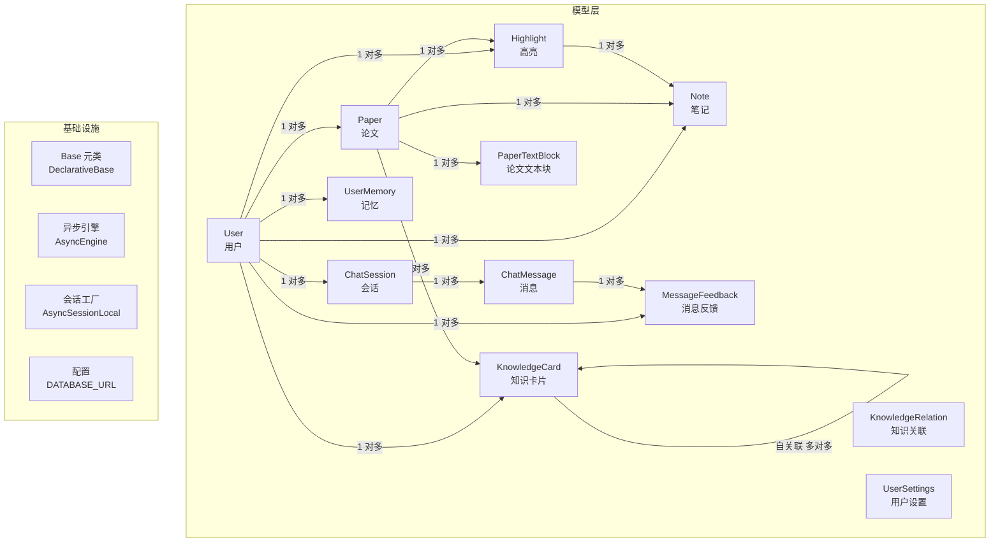
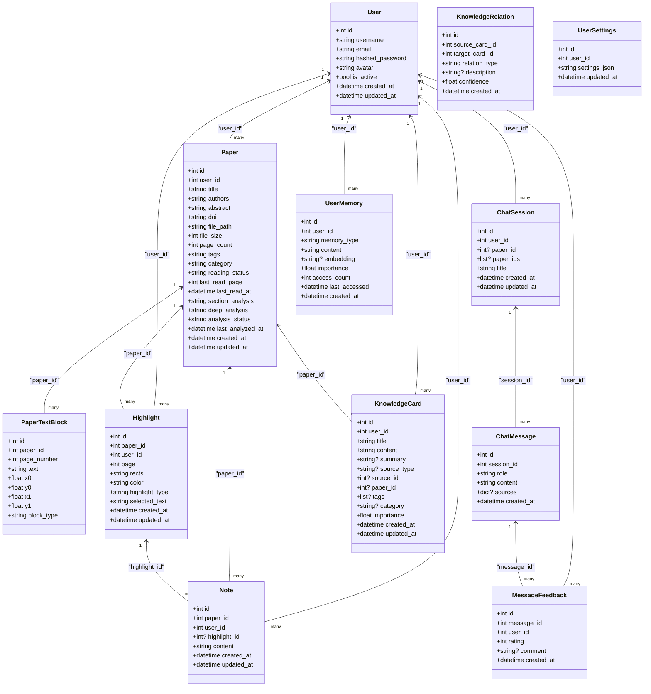
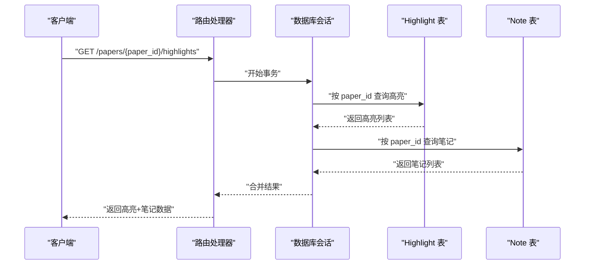
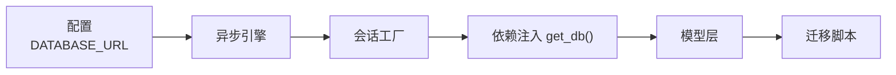

# 数据库设计

<cite>
**本文引用的文件**
- [backend/app/models/__init__.py](file://backend/app/models/__init__.py)
- [backend/app/database.py](file://backend/app/database.py)
- [backend/app/models/paper.py](file://backend/app/models/paper.py)
- [backend/app/models/user.py](file://backend/app/models/user.py)
- [backend/app/models/highlight.py](file://backend/app/models/highlight.py)
- [backend/app/models/note.py](file://backend/app/models/note.py)
- [backend/app/models/knowledge.py](file://backend/app/models/knowledge.py)
- [backend/app/models/chat.py](file://backend/app/models/chat.py)
- [backend/app/models/memory.py](file://backend/app/models/memory.py)
- [backend/app/models/settings.py](file://backend/app/models/settings.py)
- [backend/app/models/feedback.py](file://backend/app/models/feedback.py)
- [backend/migrations/versions/6895243c431d_initial_schema.py](file://backend/migrations/versions/6895243c431d_initial_schema.py)
- [backend/app/config.py](file://backend/app/config.py)
- [backend/app/schemas/paper.py](file://backend/app/schemas/paper.py)
- [backend/app/schemas/user.py](file://backend/app/schemas/user.py)
</cite>

## 目录
1. [简介](#简介)
2. [项目结构](#项目结构)
3. [核心组件](#核心组件)
4. [架构总览](#架构总览)
5. [详细组件分析](#详细组件分析)
6. [依赖分析](#依赖分析)
7. [性能考虑](#性能考虑)
8. [故障排查指南](#故障排查指南)
9. [结论](#结论)
10. [附录](#附录)

## 简介
本文件系统性梳理 PaperChat 的数据库设计与 SQLAlchemy 模型实现，覆盖模型继承体系、字段定义规范、关系映射策略、查询优化与索引设计、迁移管理与版本控制、以及性能监控最佳实践。目标是帮助开发者快速理解并高效扩展 PaperChat 的数据层。

## 项目结构
数据库相关代码主要集中在 backend/app/models 下，采用“按实体分文件”的组织方式；数据库连接与会话管理位于 backend/app/database.py；迁移脚本位于 backend/migrations；配置位于 backend/app/config.py；Pydantic 层用于 API 输入输出模型，便于与数据库模型解耦。

图表来源
- [backend/app/models/user.py:11-36](file://backend/app/models/user.py#L11-L36)
- [backend/app/models/paper.py:11-85](file://backend/app/models/paper.py#L11-L85)
- [backend/app/models/highlight.py:10-37](file://backend/app/models/highlight.py#L10-L37)
- [backend/app/models/note.py:11-34](file://backend/app/models/note.py#L11-L34)
- [backend/app/models/chat.py:14-71](file://backend/app/models/chat.py#L14-L71)
- [backend/app/models/memory.py:14-54](file://backend/app/models/memory.py#L14-L54)
- [backend/app/models/knowledge.py:14-80](file://backend/app/models/knowledge.py#L14-L80)
- [backend/app/models/feedback.py:14-48](file://backend/app/models/feedback.py#L14-L48)
- [backend/app/models/settings.py:11-30](file://backend/app/models/settings.py#L11-L30)
- [backend/app/database.py:8-27](file://backend/app/database.py#L8-L27)
- [backend/app/config.py:22-23](file://backend/app/config.py#L22-L23)

章节来源
- [backend/app/models/__init__.py:1-29](file://backend/app/models/__init__.py#L1-L29)
- [backend/app/database.py:1-81](file://backend/app/database.py#L1-L81)
- [backend/app/config.py:1-44](file://backend/app/config.py#L1-L44)

## 核心组件
- 基类与连接
  - 使用 DeclarativeBase 定义统一的 Base 类，确保所有模型共享一致的元数据与命名约定。
  - 异步引擎与会话工厂：基于 aiosqlite（开发环境）提供异步连接与依赖注入式会话管理，支持自动提交、回滚与关闭。
  - 默认用户初始化：应用启动时检查并确保默认用户存在，保障最小可用状态。
- 模型导出
  - models/__init__.py 统一导出所有模型与 Base，便于路由与服务层集中导入。

章节来源
- [backend/app/database.py:8-81](file://backend/app/database.py#L8-L81)
- [backend/app/models/__init__.py:1-29](file://backend/app/models/__init__.py#L1-L29)

## 架构总览
PaperChat 的数据库采用“用户中心”的关系设计，围绕用户展开论文、高亮、笔记、会话、记忆、知识与反馈等实体。模型间通过外键与 back_populates 建立双向关系，配合级联删除与孤儿对象清理策略，保证数据一致性与可维护性。

图表来源
- [backend/app/models/user.py:11-36](file://backend/app/models/user.py#L11-L36)
- [backend/app/models/paper.py:11-85](file://backend/app/models/paper.py#L11-L85)
- [backend/app/models/highlight.py:10-37](file://backend/app/models/highlight.py#L10-L37)
- [backend/app/models/note.py:11-34](file://backend/app/models/note.py#L11-L34)
- [backend/app/models/chat.py:14-71](file://backend/app/models/chat.py#L14-L71)
- [backend/app/models/memory.py:14-54](file://backend/app/models/memory.py#L14-L54)
- [backend/app/models/knowledge.py:14-80](file://backend/app/models/knowledge.py#L14-L80)
- [backend/app/models/feedback.py:14-48](file://backend/app/models/feedback.py#L14-L48)
- [backend/app/models/settings.py:11-30](file://backend/app/models/settings.py#L11-L30)

## 详细组件分析

### 用户 User
- 字段与约束
  - 主键 id；唯一且带索引的 username 与 email；布尔激活状态；时间戳 created_at/updated_at。
- 关系
  - 与 Paper、Highlight、Note、ChatSession、UserMemory、MessageFeedback、KnowledgeCard 建立一对多关系，并启用级联删除或孤儿对象清理。
- 业务规则
  - 用户名与邮箱唯一；默认激活；可通过设置表管理个性化配置。

章节来源
- [backend/app/models/user.py:11-36](file://backend/app/models/user.py#L11-L36)
- [backend/app/models/settings.py:11-30](file://backend/app/models/settings.py#L11-L30)

### 论文 Paper 与 文本块 PaperTextBlock
- 字段与约束
  - 标题、作者、摘要、DOI、文件路径与大小、页数、标签（JSON 字符串）、分类；阅读状态与最后阅读页/时间；分析缓存与状态；时间戳。
  - PaperTextBlock 包含页面编号、文本内容与坐标框，block_type 标识块类型。
- 关系
  - Paper 与 User（所属者）；Paper 与 PaperTextBlock、Highlight、Note、KnowledgeCard 的一对多关系；PaperTextBlock 与 Paper 的反向关系。
  - 所有子关系均启用级联删除或孤儿对象清理，确保删除论文时同步清理其子资源。
- 查询优化建议
  - 为 user_id、reading_status 建立索引（已在迁移中完成）。
  - 高亮、笔记、卡片等高频过滤字段已建立索引。

章节来源
- [backend/app/models/paper.py:11-85](file://backend/app/models/paper.py#L11-L85)
- [backend/migrations/versions/6895243c431d_initial_schema.py:21-39](file://backend/migrations/versions/6895243c431d_initial_schema.py#L21-L39)

### 高亮 Highlight 与 笔记 Note
- 字段与约束
  - Highlight：页面号、矩形集合（JSON）、颜色、高亮类型、选中文本；Note：内容、可选关联高亮。
- 关系
  - Highlight 与 Paper、User、Note 建立一对多关系；Note 可选关联 Highlight。
- 业务规则
  - 高亮删除时，对应的笔记随之外键置空或级联删除，取决于 ondelete 策略。

章节来源
- [backend/app/models/highlight.py:10-37](file://backend/app/models/highlight.py#L10-L37)
- [backend/app/models/note.py:11-34](file://backend/app/models/note.py#L11-L34)

### 聊天 ChatSession 与 ChatMessage 与 反馈 MessageFeedback
- 字段与约束
  - ChatSession：标题、单论文或多论文会话标识；ChatMessage：角色（用户/助手）、内容、可选来源；MessageFeedback：评分与评论。
- 关系
  - ChatSession 与 User、Paper、ChatMessage 建立一对多；ChatMessage 与 MessageFeedback 建立一对多。
  - 提供 is_cross_doc_session 与 get_related_paper_ids 辅助方法，便于跨文档场景处理。
- 业务规则
  - 跨文档会话通过 JSON 存储 paper_ids；单论文会话保留 paper_id 以兼容历史数据。

章节来源
- [backend/app/models/chat.py:14-71](file://backend/app/models/chat.py#L14-L71)
- [backend/app/models/feedback.py:14-48](file://backend/app/models/feedback.py#L14-L48)

### 用户记忆 UserMemory
- 字段与约束
  - memory_type 标识记忆类别（偏好、研究方向、术语、反馈模式等）；content 存储结构化内容；embedding 支持向量化检索；access_count 与 last_accessed 支持热度追踪。
- 关系
  - 与 User 建立一对多关系。
- 业务规则
  - 提供 to_dict 方法，便于序列化返回。

章节来源
- [backend/app/models/memory.py:14-54](file://backend/app/models/memory.py#L14-L54)

### 知识库 KnowledgeCard 与 KnowledgeRelation
- 字段与约束
  - KnowledgeCard：标题、内容、摘要、来源类型与ID、关联论文、标签、分类、重要性权重；时间戳。
  - KnowledgeRelation：源卡与目标卡、关系类型、描述、置信度。
- 关系
  - KnowledgeCard 与 User、Paper 建立一对多；Card 与 Relation 通过自引用建立多对多（通过两个方向的 back_populates 实现）。
- 业务规则
  - 自引用关系使用显式 foreign_keys 参数避免歧义。

章节来源
- [backend/app/models/knowledge.py:14-80](file://backend/app/models/knowledge.py#L14-L80)

### 用户设置 UserSettings
- 字段与约束
  - user_id 唯一索引；settings_json 以 JSON 存储全部设置项；updated_at 自动更新。
- 业务规则
  - 以单一记录承载用户全部设置，简化读写。

章节来源
- [backend/app/models/settings.py:11-30](file://backend/app/models/settings.py#L11-L30)

### 数据访问模式与查询流程
以下序列图展示典型“获取用户某篇论文的高亮与笔记”流程：

图表来源
- [backend/app/models/highlight.py:10-37](file://backend/app/models/highlight.py#L10-L37)
- [backend/app/models/note.py:11-34](file://backend/app/models/note.py#L11-L34)
- [backend/app/database.py:30-47](file://backend/app/database.py#L30-L47)

## 依赖分析
- 模型导出
  - models/__init__.py 将 Base 与各模型统一导出，便于上层模块集中导入，降低耦合。
- 连接与生命周期
  - database.py 提供 get_db 依赖注入函数，封装会话创建、提交、回滚与关闭，确保异常安全。
- 配置驱动
  - config.py 中 DATABASE_URL 决定数据库类型与位置（开发环境为 SQLite），影响迁移与部署策略。
- 迁移与索引
  - 初始迁移脚本在升级时创建关键字段索引（如 papers.user_id、reading_status），在降级时回滚索引，保持版本可控。

图表来源
- [backend/app/config.py:22-23](file://backend/app/config.py#L22-L23)
- [backend/app/database.py:14-27](file://backend/app/database.py#L14-L27)
- [backend/migrations/versions/6895243c431d_initial_schema.py:21-39](file://backend/migrations/versions/6895243c431d_initial_schema.py#L21-L39)

章节来源
- [backend/app/models/__init__.py:1-29](file://backend/app/models/__init__.py#L1-L29)
- [backend/app/database.py:30-47](file://backend/app/database.py#L30-L47)
- [backend/migrations/versions/6895243c431d_initial_schema.py:21-39](file://backend/migrations/versions/6895243c431d_initial_schema.py#L21-L39)

## 性能考虑
- 索引设计原则
  - 已在初始迁移中为高频过滤字段建立索引：papers.user_id、papers.reading_status、paper_text_blocks.paper_id、highlights.user_id/paper_id、notes.user_id/paper_id、knowledge_cards.user_id/paper_id。
  - 建议新增：chat_sessions.user_id、chat_sessions.paper_id；根据实际查询模式评估是否为 chat_messages.session_id 建索引。
- 查询优化策略
  - 使用 select 加载策略减少 N+1 查询；必要时使用 joinedload 或 subqueryload。
  - 对于大字段（如 text、content、embedding），仅在需要时加载，避免全量传输。
  - 合理使用分页与 limit/offset，结合索引字段排序。
- 连接与事务
  - 使用异步引擎与依赖注入会话，避免阻塞；在长事务中注意锁竞争与超时。
- 缓存与分析
  - 论文分析缓存字段（section_analysis、deep_analysis）减少重复计算；更新时及时刷新 last_analyzed_at。

章节来源
- [backend/migrations/versions/6895243c431d_initial_schema.py:21-39](file://backend/migrations/versions/6895243c431d_initial_schema.py#L21-L39)
- [backend/app/models/paper.py:30-36](file://backend/app/models/paper.py#L30-L36)

## 故障排查指南
- 迁移失败
  - 检查 DATABASE_URL 是否正确；确认 alembic 版本与脚本匹配；必要时执行 downgrade 再 upgrade。
- 会话异常
  - 若出现未提交或未回滚，检查 get_db 的 try/except/finally 流程；确保每个请求都通过依赖注入获取会话。
- 外键约束错误
  - 删除父记录前，确认子记录是否被正确级联删除或孤儿清理；核对 ondelete 策略。
- 默认用户缺失
  - init_db 在启动时尝试创建默认用户；若失败，检查权限与唯一性约束。

章节来源
- [backend/app/database.py:30-81](file://backend/app/database.py#L30-L81)
- [backend/migrations/versions/6895243c431d_initial_schema.py:21-61](file://backend/migrations/versions/6895243c431d_initial_schema.py#L21-L61)

## 结论
PaperChat 的数据库设计以用户为中心，采用清晰的一对多与自关联多对多关系，辅以异步连接、依赖注入会话与迁移脚本，形成可演进、可维护、可扩展的数据层。遵循本文的索引与查询优化建议，可在功能完善的同时兼顾性能与稳定性。

## 附录
- 数据模型字段与关系一览（要点）
  - User：主键、唯一索引字段、一对多到 Paper/Highlight/Note/ChatSession/UserMemory/MessageFeedback/KnowledgeCard。
  - Paper：与 User、PaperTextBlock、Highlight、Note、KnowledgeCard 的一对多关系；分析缓存字段。
  - PaperTextBlock：与 Paper 的一对多关系。
  - Highlight：与 Paper、User、Note 的一对多关系。
  - Note：与 Paper、User、Highlight 的一对多关系。
  - ChatSession：与 User、Paper、ChatMessage 的一对多关系。
  - ChatMessage：与 ChatSession、MessageFeedback 的一对多关系。
  - UserMemory：与 User 的一对多关系。
  - KnowledgeCard：与 User、Paper 的一对多关系；自关联多对多通过 KnowledgeRelation 实现。
  - MessageFeedback：与 ChatMessage、User 的一对多关系。
  - UserSettings：与 User 的一对一（唯一索引 user_id）。

章节来源
- [backend/app/models/user.py:11-36](file://backend/app/models/user.py#L11-L36)
- [backend/app/models/paper.py:11-85](file://backend/app/models/paper.py#L11-L85)
- [backend/app/models/highlight.py:10-37](file://backend/app/models/highlight.py#L10-L37)
- [backend/app/models/note.py:11-34](file://backend/app/models/note.py#L11-L34)
- [backend/app/models/chat.py:14-71](file://backend/app/models/chat.py#L14-L71)
- [backend/app/models/memory.py:14-54](file://backend/app/models/memory.py#L14-L54)
- [backend/app/models/knowledge.py:14-80](file://backend/app/models/knowledge.py#L14-L80)
- [backend/app/models/feedback.py:14-48](file://backend/app/models/feedback.py#L14-L48)
- [backend/app/models/settings.py:11-30](file://backend/app/models/settings.py#L11-L30)