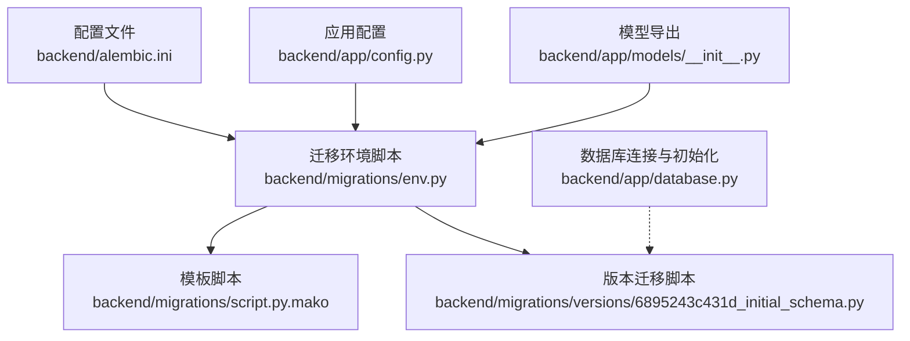
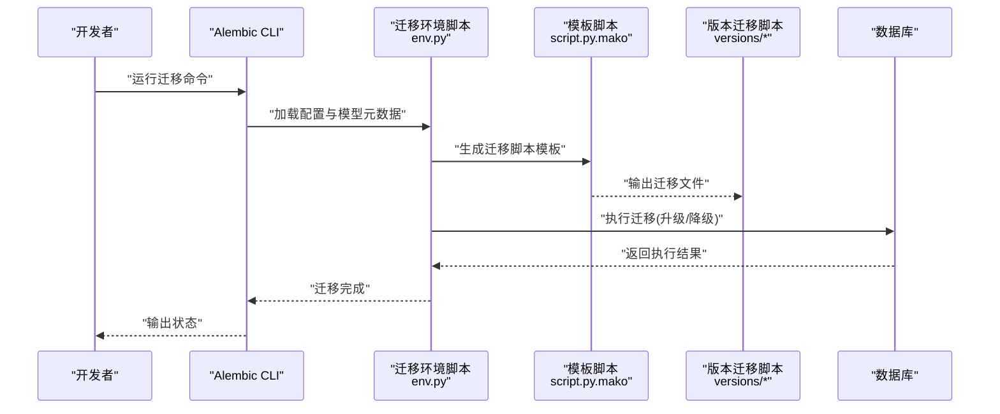
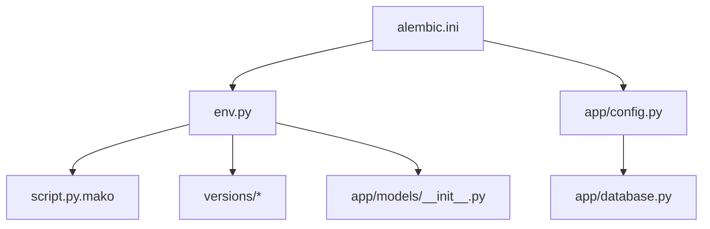

# 数据库迁移管理

<cite>
**本文引用的文件**
- [backend/alembic.ini](file://backend/alembic.ini)
- [backend/migrations/env.py](file://backend/migrations/env.py)
- [backend/migrations/script.py.mako](file://backend/migrations/script.py.mako)
- [backend/migrations/versions/6895243c431d_initial_schema.py](file://backend/migrations/versions/6895243c431d_initial_schema.py)
- [backend/app/database.py](file://backend/app/database.py)
- [backend/app/models/__init__.py](file://backend/app/models/__init__.py)
- [backend/app/models/user.py](file://backend/app/models/user.py)
- [backend/app/models/paper.py](file://backend/app/models/paper.py)
- [backend/app/models/chat.py](file://backend/app/models/chat.py)
- [backend/app/models/highlight.py](file://backend/app/models/highlight.py)
- [backend/app/models/note.py](file://backend/app/models/note.py)
- [backend/app/models/knowledge.py](file://backend/app/models/knowledge.py)
- [backend/app/config.py](file://backend/app/config.py)
</cite>

## 目录
1. [简介](#简介)
2. [项目结构](#项目结构)
3. [核心组件](#核心组件)
4. [架构总览](#架构总览)
5. [详细组件分析](#详细组件分析)
6. [依赖分析](#依赖分析)
7. [性能考虑](#性能考虑)
8. [故障排查指南](#故障排查指南)
9. [结论](#结论)
10. [附录](#附录)

## 简介
本文件面向 PaperChat 项目的数据库迁移管理，系统性阐述 Alembic 迁移框架的配置与使用，覆盖迁移脚本生成、版本控制、数据库演进管理、索引优化、回滚机制、生产部署与验证、故障恢复等关键主题。文档同时结合现有模型与迁移脚本，给出可操作的实践建议与最佳实践。

## 项目结构
PaperChat 的数据库迁移采用标准 Alembic 结构，核心位置位于 backend/migrations，包含配置、环境脚本、模板与版本化迁移脚本。应用侧通过 SQLAlchemy 异步 ORM 定义模型，迁移环境脚本负责加载模型元数据以进行自动化迁移生成与执行。

**图表来源**
- [backend/alembic.ini:1-150](file://backend/alembic.ini#L1-L150)
- [backend/migrations/env.py:1-110](file://backend/migrations/env.py#L1-L110)
- [backend/migrations/script.py.mako:1-29](file://backend/migrations/script.py.mako#L1-L29)
- [backend/migrations/versions/6895243c431d_initial_schema.py:1-61](file://backend/migrations/versions/6895243c431d_initial_schema.py#L1-L61)
- [backend/app/config.py:1-44](file://backend/app/config.py#L1-L44)
- [backend/app/models/__init__.py:1-29](file://backend/app/models/__init__.py#L1-L29)
- [backend/app/database.py:1-81](file://backend/app/database.py#L1-L81)

**章节来源**
- [backend/alembic.ini:1-150](file://backend/alembic.ini#L1-L150)
- [backend/migrations/env.py:1-110](file://backend/migrations/env.py#L1-L110)
- [backend/migrations/script.py.mako:1-29](file://backend/migrations/script.py.mako#L1-L29)
- [backend/migrations/versions/6895243c431d_initial_schema.py:1-61](file://backend/migrations/versions/6895243c431d_initial_schema.py#L1-L61)
- [backend/app/config.py:1-44](file://backend/app/config.py#L1-L44)
- [backend/app/models/__init__.py:1-29](file://backend/app/models/__init__.py#L1-L29)
- [backend/app/database.py:1-81](file://backend/app/database.py#L1-L81)

## 核心组件
- Alembic 配置与环境
  - 配置文件 backend/alembic.ini 指定脚本位置、路径分隔符、日志级别等；数据库 URL 由迁移环境脚本动态注入。
  - 迁移环境脚本 backend/migrations/env.py 支持离线与在线两种模式，异步加载模型元数据，确保迁移生成与执行的一致性。
  - 模板脚本 backend/migrations/script.py.mako 作为迁移脚本生成模板，定义了升级/降级函数与占位符。

- 迁移脚本
  - 初始迁移 backend/migrations/versions/6895243c431d_initial_schema.py 定义了索引创建与列属性调整，展示了标准的 upgrade()/downgrade() 编写方式。

- 应用模型与数据库连接
  - backend/app/database.py 定义了异步引擎与会话工厂，并提供数据库初始化与关闭方法。
  - backend/app/models/__init__.py 导出所有模型，供迁移环境脚本加载元数据。
  - backend/app/config.py 提供 DATABASE_URL，迁移环境脚本将其注入 Alembic 配置。

**章节来源**
- [backend/alembic.ini:1-150](file://backend/alembic.ini#L1-L150)
- [backend/migrations/env.py:1-110](file://backend/migrations/env.py#L1-L110)
- [backend/migrations/script.py.mako:1-29](file://backend/migrations/script.py.mako#L1-L29)
- [backend/migrations/versions/6895243c431d_initial_schema.py:1-61](file://backend/migrations/versions/6895243c431d_initial_schema.py#L1-L61)
- [backend/app/database.py:1-81](file://backend/app/database.py#L1-L81)
- [backend/app/models/__init__.py:1-29](file://backend/app/models/__init__.py#L1-L29)
- [backend/app/config.py:1-44](file://backend/app/config.py#L1-L44)

## 架构总览
下图展示了迁移生命周期的关键交互：配置与模型元数据驱动迁移生成与执行，数据库连接由应用层提供，迁移脚本在目标环境中应用或回滚。

**图表来源**
- [backend/migrations/env.py:1-110](file://backend/migrations/env.py#L1-L110)
- [backend/migrations/script.py.mako:1-29](file://backend/migrations/script.py.mako#L1-L29)
- [backend/migrations/versions/6895243c431d_initial_schema.py:1-61](file://backend/migrations/versions/6895243c431d_initial_schema.py#L1-L61)
- [backend/alembic.ini:1-150](file://backend/alembic.ini#L1-L150)

## 详细组件分析

### 迁移配置与环境
- 配置要点
  - script_location 指向 migrations 目录，确保 Alembic 在正确位置查找/生成迁移脚本。
  - prepend_sys_path 与 path_separator 控制 Python 路径解析，便于在项目根目录下导入模型。
  - 日志配置在 [loggers]/[handlers]/[formatters] 下定义，便于调试与审计。
  - sqlalchemy.url 为空，由 env.py 注入，避免硬编码。

- 环境脚本要点
  - 动态导入 models 与 Base.metadata，确保迁移生成时包含所有表结构。
  - 支持离线与在线两种模式：离线直接使用 URL，线上通过异步引擎连接。
  - 使用 async_engine_from_config 与 NullPool，适配 aiosqlite。

- 模板脚本要点
  - 通过 Mako 模板生成迁移文件骨架，包含 upgrade()/downgrade() 与占位符，便于后续扩展。

**章节来源**
- [backend/alembic.ini:1-150](file://backend/alembic.ini#L1-L150)
- [backend/migrations/env.py:1-110](file://backend/migrations/env.py#L1-L110)
- [backend/migrations/script.py.mako:1-29](file://backend/migrations/script.py.mako#L1-L29)

### 初始迁移脚本分析
- 升级逻辑
  - 为多张表添加常用查询索引，提升 user_id/paper_id 等字段的查询性能。
  - 调整 papers.analysis_status 列的非空约束与默认值，确保数据一致性。
  - 为 papers.reading_status 与 papers.user_id 添加索引，优化筛选与关联查询。

- 降级逻辑
  - 逆序删除上述索引，恢复列属性（nullable 与默认值）。
  - 保持与升级相反的顺序，确保外键与依赖关系安全回退。

- 编写规范
  - 明确的注释与分组，便于审查与维护。
  - 使用 op.f('ix_table_column') 形式的索引命名，符合 Alembic 规范。
  - upgrade()/downgrade() 成对出现，保证可逆性。

**章节来源**
- [backend/migrations/versions/6895243c431d_initial_schema.py:1-61](file://backend/migrations/versions/6895243c431d_initial_schema.py#L1-L61)

### 数据库模型与索引策略
- 用户表 users
  - 唯一索引：username、email，保障唯一性约束。
  - 关系：与 Paper、Highlight、Note、ChatSession、UserMemory、MessageFeedback、KnowledgeCard 等建立一对多或一对一关系。

- 论文表 papers
  - 常用过滤字段：user_id、reading_status，均建立索引。
  - 分析状态 analysis_status 默认值与非空约束，配合迁移脚本调整，确保数据一致性。

- 论文文本块表 paper_text_blocks
  - paper_id 建有索引，支持按论文快速检索文本块。

- 高亮表 highlights
  - paper_id、user_id 建有索引，满足按论文与用户过滤场景。

- 笔记表 notes
  - paper_id、user_id 建有索引，highlight_id 支持与高亮的关联管理。

- 知识卡片与关系表
  - user_id、paper_id 建有索引，source_type/source_id 支持来源追踪。
  - 知识关系表 knowledge_relations 建有双向外键索引，支撑图谱查询。

- 聊天会话与消息表
  - chat_sessions.user_id、paper_id/paper_ids 建有索引，支持单/多论文会话查询。
  - chat_messages.session_id 建有索引，支撑消息分页与排序。

- 索引优化建议
  - 基于查询模式建立复合索引（如 user_id+paper_id），减少全表扫描。
  - 对频繁更新的列（如 updated_at）避免过度索引，平衡写入与读取性能。
  - 定期评估索引使用率，清理冗余索引。

**章节来源**
- [backend/app/models/user.py:1-36](file://backend/app/models/user.py#L1-L36)
- [backend/app/models/paper.py:1-85](file://backend/app/models/paper.py#L1-L85)
- [backend/app/models/highlight.py:1-37](file://backend/app/models/highlight.py#L1-L37)
- [backend/app/models/note.py:1-34](file://backend/app/models/note.py#L1-L34)
- [backend/app/models/knowledge.py:1-80](file://backend/app/models/knowledge.py#L1-L80)
- [backend/app/models/chat.py:1-71](file://backend/app/models/chat.py#L1-L71)

### 迁移脚本编写规范与版本兼容
- 规范
  - 升级/降级成对出现，注释清晰，分组明确。
  - 使用 Alembic API（op.create_index/op.alter_column/op.drop_index）进行结构变更。
  - 避免在迁移中执行业务数据处理，必要时通过数据迁移脚本或服务层完成。

- 版本兼容
  - 通过 down_revision 与 branch_labels/depends_on 管理分支与依赖。
  - 保持迁移脚本幂等性，避免重复执行导致异常。

- 回滚机制
  - 严格遵循降级顺序，先删除索引/约束，再修改列属性。
  - 在生产环境执行前，务必在测试环境验证回滚路径。

**章节来源**
- [backend/migrations/versions/6895243c431d_initial_schema.py:1-61](file://backend/migrations/versions/6895243c431d_initial_schema.py#L1-L61)
- [backend/migrations/script.py.mako:1-29](file://backend/migrations/script.py.mako#L1-L29)

### 数据库升级流程与数据迁移策略
- 升级流程
  - 本地/测试环境：生成迁移脚本并执行，验证索引与约束生效。
  - 预发布/生产环境：先备份数据库，再执行迁移；监控慢查询与锁等待。
  - 回滚预案：准备降级脚本，确保在失败时可快速恢复。

- 数据迁移策略
  - 结构变更优先：先迁移表结构，再迁移数据。
  - 批量处理：对大表数据迁移采用分批处理，避免长时间锁表。
  - 事务封装：将数据迁移包裹在事务中，失败回滚。

- 向后兼容性保证
  - 保持列名与约束名称稳定，避免破坏既有查询。
  - 对新增字段提供默认值，确保历史数据可读。

**章节来源**
- [backend/migrations/env.py:1-110](file://backend/migrations/env.py#L1-L110)
- [backend/app/database.py:1-81](file://backend/app/database.py#L1-L81)

### 生产环境部署、迁移验证与故障恢复
- 部署步骤
  - 在部署前执行 alembic upgrade head，确保数据库结构与代码一致。
  - 配置只读副本与主库分离，降低迁移对线上服务的影响。

- 迁移验证
  - 查询系统视图或 EXPLAIN 分析关键查询的索引使用情况。
  - 执行回归测试，覆盖高频查询路径与业务流程。

- 故障恢复
  - 若迁移失败，执行 alembic downgrade 退回上一个稳定版本。
  - 使用备份恢复数据库，随后重新执行迁移。
  - 记录迁移日志与错误信息，便于复盘与改进。

**章节来源**
- [backend/alembic.ini:1-150](file://backend/alembic.ini#L1-L150)
- [backend/migrations/env.py:1-110](file://backend/migrations/env.py#L1-L110)

## 依赖分析
下图展示迁移相关文件之间的依赖关系：配置驱动环境脚本，环境脚本加载模型元数据并生成/执行迁移脚本，数据库连接由应用层提供。

**图表来源**
- [backend/alembic.ini:1-150](file://backend/alembic.ini#L1-L150)
- [backend/migrations/env.py:1-110](file://backend/migrations/env.py#L1-L110)
- [backend/migrations/script.py.mako:1-29](file://backend/migrations/script.py.mako#L1-L29)
- [backend/migrations/versions/6895243c431d_initial_schema.py:1-61](file://backend/migrations/versions/6895243c431d_initial_schema.py#L1-L61)
- [backend/app/config.py:1-44](file://backend/app/config.py#L1-L44)
- [backend/app/models/__init__.py:1-29](file://backend/app/models/__init__.py#L1-L29)
- [backend/app/database.py:1-81](file://backend/app/database.py#L1-L81)

**章节来源**
- [backend/alembic.ini:1-150](file://backend/alembic.ini#L1-L150)
- [backend/migrations/env.py:1-110](file://backend/migrations/env.py#L1-L110)
- [backend/migrations/script.py.mako:1-29](file://backend/migrations/script.py.mako#L1-L29)
- [backend/migrations/versions/6895243c431d_initial_schema.py:1-61](file://backend/migrations/versions/6895243c431d_initial_schema.py#L1-L61)
- [backend/app/config.py:1-44](file://backend/app/config.py#L1-L44)
- [backend/app/models/__init__.py:1-29](file://backend/app/models/__init__.py#L1-L29)
- [backend/app/database.py:1-81](file://backend/app/database.py#L1-L81)

## 性能考虑
- 索引设计
  - 为高频过滤字段建立单列或复合索引，减少全表扫描。
  - 避免过多唯一索引影响写入性能，仅在必要时启用。

- 查询优化
  - 使用 EXPLAIN 分析查询计划，识别慢查询并针对性优化。
  - 对大结果集采用分页与延迟加载，避免一次性加载过多数据。

- 迁移期间性能
  - 在低峰时段执行迁移，缩短锁表时间。
  - 对大表重建索引时，考虑在线索引或分批处理。

[本节为通用指导，无需特定文件引用]

## 故障排查指南
- 迁移失败
  - 检查 alembic.ini 中 sqlalchemy.url 是否正确注入。
  - 确认 env.py 中模型导入完整，target_metadata 包含所有表。

- 索引冲突
  - 查看 downgrade 顺序是否与升级相反，确保外键与依赖关系安全回退。
  - 检查是否存在重复索引，清理冗余索引。

- 数据不一致
  - 在迁移前备份数据库，必要时回滚至上一个稳定版本。
  - 对历史数据进行补丁处理，确保默认值与约束满足。

**章节来源**
- [backend/migrations/env.py:1-110](file://backend/migrations/env.py#L1-L110)
- [backend/migrations/versions/6895243c431d_initial_schema.py:1-61](file://backend/migrations/versions/6895243c431d_initial_schema.py#L1-L61)

## 结论
PaperChat 的数据库迁移管理以 Alembic 为核心，结合异步 SQLAlchemy ORM 与严格的索引策略，实现了结构演进与性能优化的平衡。通过规范化的迁移脚本编写、完善的回滚机制与生产级的部署与验证流程，项目能够在保障稳定性的同时持续演进。建议在后续迭代中继续完善索引策略、引入更细粒度的数据迁移脚本，并加强迁移前的自动化验证。

[本节为总结性内容，无需特定文件引用]

## 附录

### 实际迁移示例路径
- 初始迁移脚本：[backend/migrations/versions/6895243c431d_initial_schema.py:1-61](file://backend/migrations/versions/6895243c431d_initial_schema.py#L1-L61)
- 迁移环境脚本：[backend/migrations/env.py:1-110](file://backend/migrations/env.py#L1-L110)
- 模板脚本：[backend/migrations/script.py.mako:1-29](file://backend/migrations/script.py.mako#L1-L29)
- Alembic 配置：[backend/alembic.ini:1-150](file://backend/alembic.ini#L1-L150)

### 常见问题与解决方案
- 无法连接数据库
  - 检查 DATABASE_URL 是否正确，确认 env.py 已注入配置。
- 迁移未生成
  - 确认 models/__init__.py 导出了所有模型，target_metadata 包含完整元数据。
- 回滚失败
  - 按照 downgrade 逆序执行，确保外键与依赖关系被正确移除。

[本节为通用指导，无需特定文件引用]