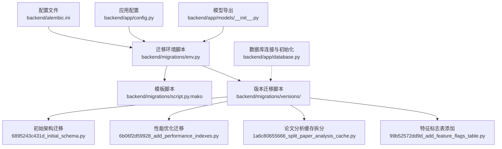
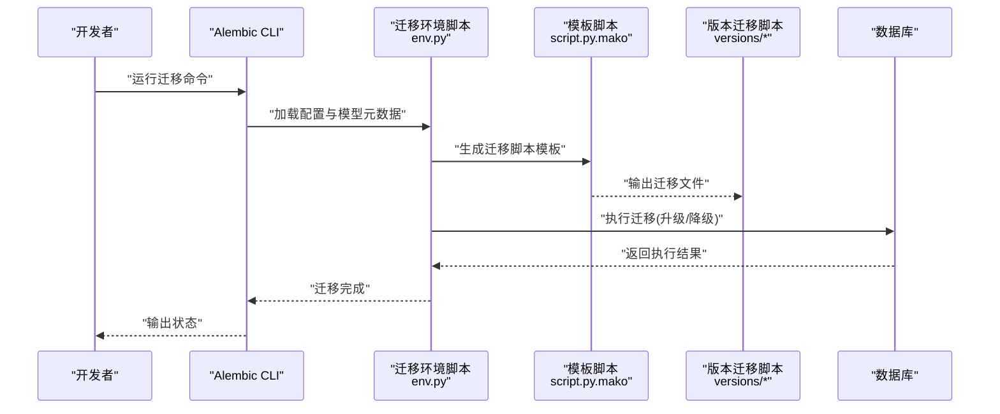
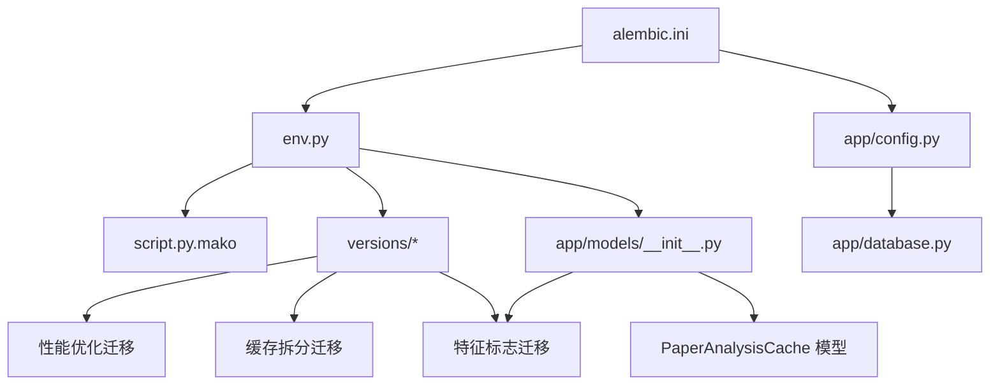

# 数据库迁移管理

<cite>
**本文引用的文件**
- [backend/alembic.ini](file://backend/alembic.ini)
- [backend/migrations/env.py](file://backend/migrations/env.py)
- [backend/migrations/script.py.mako](file://backend/migrations/script.py.mako)
- [backend/migrations/versions/6895243c431d_initial_schema.py](file://backend/migrations/versions/6895243c431d_initial_schema.py)
- [backend/migrations/versions/6b06f2d59928_add_performance_indexes.py](file://backend/migrations/versions/6b06f2d59928_add_performance_indexes.py)
- [backend/migrations/versions/99b52572dd9d_add_feature_flags_table.py](file://backend/migrations/versions/99b52572dd9d_add_feature_flags_table.py)
- [backend/migrations/versions/1a6c80655666_split_paper_analysis_cache.py](file://backend/migrations/versions/1a6c80655666_split_paper_analysis_cache.py)
- [backend/app/database.py](file://backend/app/database.py)
- [backend/app/models/__init__.py](file://backend/app/models/__init__.py)
- [backend/app/models/user.py](file://backend/app/models/user.py)
- [backend/app/models/paper.py](file://backend/app/models/paper.py)
- [backend/app/models/chat.py](file://backend/app/models/chat.py)
- [backend/app/models/highlight.py](file://backend/app/models/highlight.py)
- [backend/app/models/note.py](file://backend/app/models/note.py)
- [backend/app/models/knowledge.py](file://backend/app/models/knowledge.py)
- [backend/app/models/feature_flag.py](file://backend/app/models/feature_flag.py)
- [backend/app/models/paper_analysis.py](file://backend/app/models/paper_analysis.py)
- [backend/app/config.py](file://backend/app/config.py)
</cite>

## 目录
1. [简介](#简介)
2. [项目结构](#项目结构)
3. [核心组件](#核心组件)
4. [架构总览](#架构总览)
5. [详细组件分析](#详细组件分析)
6. [迁移历史与版本演进](#迁移历史与版本演进)
7. [依赖分析](#依赖分析)
8. [性能考虑](#性能考虑)
9. [故障排查指南](#故障排查指南)
10. [结论](#结论)
11. [附录](#附录)

## 简介
本文件面向 PaperChat 项目的数据库迁移管理，系统性阐述 Alembic 迁移框架的配置与使用，覆盖迁移脚本生成、版本控制、数据库演进管理、索引优化、回滚机制、生产部署与验证、故障恢复等关键主题。文档基于完整的迁移系统，包括初始架构迁移、性能优化迁移、特征标志表添加和论文分析缓存拆分等关键变更，给出可操作的实践建议与最佳实践。

## 项目结构
PaperChat 的数据库迁移采用标准 Alembic 结构，核心位置位于 backend/migrations，包含配置、环境脚本、模板与版本化迁移脚本。应用侧通过 SQLAlchemy 异步 ORM 定义模型，迁移环境脚本负责加载模型元数据以进行自动化迁移生成与执行。当前系统包含四个主要迁移版本，覆盖从基础架构到高级功能的完整演进。

**图表来源**
- [backend/alembic.ini:1-150](file://backend/alembic.ini#L1-L150)
- [backend/migrations/env.py:1-110](file://backend/migrations/env.py#L1-L110)
- [backend/migrations/script.py.mako:1-29](file://backend/migrations/script.py.mako#L1-L29)
- [backend/migrations/versions/6895243c431d_initial_schema.py:1-61](file://backend/migrations/versions/6895243c431d_initial_schema.py#L1-L61)
- [backend/migrations/versions/6b06f2d59928_add_performance_indexes.py:1-71](file://backend/migrations/versions/6b06f2d59928_add_performance_indexes.py#L1-L71)
- [backend/migrations/versions/1a6c80655666_split_paper_analysis_cache.py:1-92](file://backend/migrations/versions/1a6c80655666_split_paper_analysis_cache.py#L1-L92)
- [backend/migrations/versions/99b52572dd9d_add_feature_flags_table.py:1-39](file://backend/migrations/versions/99b52572dd9d_add_feature_flags_table.py#L1-L39)
- [backend/app/config.py:1-47](file://backend/app/config.py#L1-L47)
- [backend/app/models/__init__.py:1-33](file://backend/app/models/__init__.py#L1-L33)
- [backend/app/database.py:1-83](file://backend/app/database.py#L1-L83)

**章节来源**
- [backend/alembic.ini:1-150](file://backend/alembic.ini#L1-L150)
- [backend/migrations/env.py:1-110](file://backend/migrations/env.py#L1-L110)
- [backend/migrations/script.py.mako:1-29](file://backend/migrations/script.py.mako#L1-L29)
- [backend/migrations/versions/6895243c431d_initial_schema.py:1-61](file://backend/migrations/versions/6895243c431d_initial_schema.py#L1-L61)
- [backend/migrations/versions/6b06f2d59928_add_performance_indexes.py:1-71](file://backend/migrations/versions/6b06f2d59928_add_performance_indexes.py#L1-L71)
- [backend/migrations/versions/1a6c80655666_split_paper_analysis_cache.py:1-92](file://backend/migrations/versions/1a6c80655666_split_paper_analysis_cache.py#L1-L92)
- [backend/migrations/versions/99b52572dd9d_add_feature_flags_table.py:1-39](file://backend/migrations/versions/99b52572dd9d_add_feature_flags_table.py#L1-L39)
- [backend/app/config.py:1-47](file://backend/app/config.py#L1-L47)
- [backend/app/models/__init__.py:1-33](file://backend/app/models/__init__.py#L1-L33)
- [backend/app/database.py:1-83](file://backend/app/database.py#L1-L83)

## 核心组件
- **Alembic 配置与环境**
  - 配置文件 backend/alembic.ini 指定脚本位置、路径分隔符、日志级别等；数据库 URL 由迁移环境脚本动态注入。
  - 迁移环境脚本 backend/migrations/env.py 支持离线与在线两种模式，异步加载模型元数据，确保迁移生成与执行的一致性。
  - 模板脚本 backend/migrations/script.py.mako 作为迁移脚本生成模板，定义了升级/降级函数与占位符。

- **完整的迁移脚本集合**
  - 初始迁移 backend/migrations/versions/6895243c431d_initial_schema.py - 定义了基础表结构和索引
  - 性能优化迁移 backend/migrations/versions/6b06f2d59928_add_performance_indexes.py - 添加复合索引提升查询性能
  - 论文分析缓存拆分 backend/migrations/versions/1a6c80655666_split_paper_analysis_cache.py - 数据库重构，拆分分析缓存表
  - 特征标志表添加 backend/migrations/versions/99b52572dd9d_add_feature_flags_table.py - 新增功能开关表

- **应用模型与数据库连接**
  - backend/app/database.py 定义了异步引擎与会话工厂，并提供数据库初始化与关闭方法。
  - backend/app/models/__init__.py 导出所有模型，包括新增的 FeatureFlag 和 PaperAnalysisCache 模型。
  - backend/app/config.py 提供 DATABASE_URL，迁移环境脚本将其注入 Alembic 配置。

**章节来源**
- [backend/alembic.ini:1-150](file://backend/alembic.ini#L1-L150)
- [backend/migrations/env.py:1-110](file://backend/migrations/env.py#L1-L110)
- [backend/migrations/script.py.mako:1-29](file://backend/migrations/script.py.mako#L1-L29)
- [backend/migrations/versions/6895243c431d_initial_schema.py:1-61](file://backend/migrations/versions/6895243c431d_initial_schema.py#L1-L61)
- [backend/migrations/versions/6b06f2d59928_add_performance_indexes.py:1-71](file://backend/migrations/versions/6b06f2d59928_add_performance_indexes.py#L1-L71)
- [backend/migrations/versions/1a6c80655666_split_paper_analysis_cache.py:1-92](file://backend/migrations/versions/1a6c80655666_split_paper_analysis_cache.py#L1-L92)
- [backend/migrations/versions/99b52572dd9d_add_feature_flags_table.py:1-39](file://backend/migrations/versions/99b52572dd9d_add_feature_flags_table.py#L1-L39)
- [backend/app/database.py:1-83](file://backend/app/database.py#L1-L83)
- [backend/app/models/__init__.py:1-33](file://backend/app/models/__init__.py#L1-L33)
- [backend/app/config.py:1-47](file://backend/app/config.py#L1-L47)

## 架构总览
下图展示了迁移生命周期的关键交互：配置与模型元数据驱动迁移生成与执行，数据库连接由应用层提供，迁移脚本在目标环境中应用或回滚。

**图表来源**
- [backend/migrations/env.py:1-110](file://backend/migrations/env.py#L1-L110)
- [backend/migrations/script.py.mako:1-29](file://backend/migrations/script.py.mako#L1-L29)
- [backend/migrations/versions/6895243c431d_initial_schema.py:1-61](file://backend/migrations/versions/6895243c431d_initial_schema.py#L1-L61)
- [backend/alembic.ini:1-150](file://backend/alembic.ini#L1-L150)

## 详细组件分析

### 迁移配置与环境
- **配置要点**
  - script_location 指向 migrations 目录，确保 Alembic 在正确位置查找/生成迁移脚本。
  - prepend_sys_path 与 path_separator 控制 Python 路径解析，便于在项目根目录下导入模型。
  - 日志配置在 [loggers]/[handlers]/[formatters] 下定义，便于调试与审计。
  - sqlalchemy.url 为空，由 env.py 注入，避免硬编码。

- **环境脚本要点**
  - 动态导入 models 与 Base.metadata，确保迁移生成时包含所有表结构，包括新增的 FeatureFlag 和 PaperAnalysisCache。
  - 支持离线与在线两种模式：离线直接使用 URL，线上通过异步引擎连接。
  - 使用 async_engine_from_config 与 NullPool，适配 aiosqlite。

- **模板脚本要点**
  - 通过 Mako 模板生成迁移文件骨架，包含 upgrade()/downgrade() 与占位符，便于后续扩展。

**章节来源**
- [backend/alembic.ini:1-150](file://backend/alembic.ini#L1-L150)
- [backend/migrations/env.py:1-110](file://backend/migrations/env.py#L1-L110)
- [backend/migrations/script.py.mako:1-29](file://backend/migrations/script.py.mako#L1-L29)

### 迁移历史与版本演进

#### 初始架构迁移 (6895243c431d)
- **升级逻辑**
  - 创建基础表结构：users、papers、paper_text_blocks、highlights、notes、knowledge_cards、knowledge_relations、chat_sessions、chat_messages、user_memory、message_feedback
  - 为多张表添加常用查询索引，提升 user_id/paper_id 等字段的查询性能
  - 调整 papers.analysis_status 列的非空约束与默认值，确保数据一致性

- **降级逻辑**
  - 逆序删除上述索引，恢复列属性（nullable 与默认值）
  - 删除所有基础表，保持与升级相反的顺序

#### 性能优化迁移 (6b06f2d59928)
- **升级逻辑**
  - 添加复合索引以提升查询性能：messages_session_created、highlights_paper_page、textblocks_paper_page、papers_user_status
  - 优化现有索引结构，提升多字段查询效率
  - 保持原有单列索引不变，增强查询灵活性

- **降级逻辑**
  - 删除新增的复合索引，保留单列索引
  - 恢复原有的列属性设置

#### 论文分析缓存拆分 (1a6c80655666)
- **升级逻辑**
  - 创建新的 paper_analysis_cache 表，存储分析缓存数据
  - 将 papers 表中的分析相关字段（section_analysis、deep_analysis、analysis_status、last_analyzed_at）迁移到新表
  - 从 papers 表删除分析相关字段，减少主表宽度
  - 建立外键约束和索引优化

- **降级逻辑**
  - 在 papers 表恢复分析相关字段
  - 将数据从 paper_analysis_cache 表回迁到 papers 表
  - 删除新表及其索引

#### 特征标志表添加 (99b52572dd9d)
- **升级逻辑**
  - 创建 feature_flags 表，支持动态功能开关控制
  - 添加唯一索引到 name 字段，确保功能标识唯一性
  - 定义标准的时间戳字段 created_at、updated_at

- **降级逻辑**
  - 删除 feature_flags 表的索引
  - 删除整个 feature_flags 表

**章节来源**
- [backend/migrations/versions/6895243c431d_initial_schema.py:1-61](file://backend/migrations/versions/6895243c431d_initial_schema.py#L1-L61)
- [backend/migrations/versions/6b06f2d59928_add_performance_indexes.py:1-71](file://backend/migrations/versions/6b06f2d59928_add_performance_indexes.py#L1-L71)
- [backend/migrations/versions/1a6c80655666_split_paper_analysis_cache.py:1-92](file://backend/migrations/versions/1a6c80655666_split_paper_analysis_cache.py#L1-L92)
- [backend/migrations/versions/99b52572dd9d_add_feature_flags_table.py:1-39](file://backend/migrations/versions/99b52572dd9d_add_feature_flags_table.py#L1-L39)

### 数据库模型与索引策略
- **用户表 users**
  - 唯一索引：username、email，保障唯一性约束
  - 关系：与 Paper、Highlight、Note、ChatSession、UserMemory、MessageFeedback、KnowledgeCard 等建立一对多或一对一关系

- **论文表 papers**
  - 常用过滤字段：user_id、reading_status，均建立索引
  - 分析状态 analysis_status 默认值与非空约束，配合迁移脚本调整，确保数据一致性

- **论文分析缓存表 paper_analysis_cache**
  - 外键约束：paper_id 外键到 papers.id，级联删除
  - 唯一索引：paper_id 唯一性，确保每篇论文只有一个分析缓存记录
  - 字段设计：section_analysis、deep_analysis 存储分析结果，analysis_status 跟踪分析状态

- **论文文本块表 paper_text_blocks**
  - paper_id 建有索引，支持按论文快速检索文本块

- **高亮表 highlights**
  - paper_id、user_id 建有索引，满足按论文与用户过滤场景
  - 新增复合索引：paper_id + page，优化页面级高亮查询

- **笔记表 notes**
  - paper_id、user_id 建有索引，highlight_id 支持与高亮的关联管理

- **知识卡片与关系表**
  - user_id、paper_id 建有索引，source_type/source_id 支持来源追踪
  - 知识关系表 knowledge_relations 建有双向外键索引，支撑图谱查询

- **聊天会话与消息表**
  - chat_sessions.user_id、paper_id/paper_ids 建有索引，支持单/多论文会话查询
  - chat_messages.session_id + created_at 建有复合索引，支撑消息分页与排序

- **功能开关表 feature_flags**
  - 唯一索引：name 字段唯一，确保功能标识唯一性
  - 字段设计：name、enabled、description 支持动态功能控制

- **索引优化建议**
  - 基于查询模式建立复合索引（如 user_id+paper_id、session_id+created_at），减少全表扫描
  - 对频繁更新的列（如 updated_at）避免过度索引，平衡写入与读取性能
  - 定期评估索引使用率，清理冗余索引

**章节来源**
- [backend/app/models/user.py:1-36](file://backend/app/models/user.py#L1-L36)
- [backend/app/models/paper.py:1-85](file://backend/app/models/paper.py#L1-L85)
- [backend/app/models/paper_analysis.py:1-38](file://backend/app/models/paper_analysis.py#L1-L38)
- [backend/app/models/highlight.py:1-37](file://backend/app/models/highlight.py#L1-L37)
- [backend/app/models/note.py:1-34](file://backend/app/models/note.py#L1-L34)
- [backend/app/models/knowledge.py:1-80](file://backend/app/models/knowledge.py#L1-L80)
- [backend/app/models/chat.py:1-71](file://backend/app/models/chat.py#L1-L71)
- [backend/app/models/feature_flag.py:1-43](file://backend/app/models/feature_flag.py#L1-L43)

### 迁移脚本编写规范与版本兼容
- **规范**
  - 升级/降级成对出现，注释清晰，分组明确
  - 使用 Alembic API（op.create_index/op.alter_column/op.drop_index/op.create_table）进行结构变更
  - 避免在迁移中执行业务数据处理，必要时通过数据迁移脚本或服务层完成

- **版本兼容**
  - 通过 down_revision 与 branch_labels/depends_on 管理分支与依赖
  - 保持迁移脚本幂等性，避免重复执行导致异常
  - 新增迁移文件时，正确设置 down_revision 指向前一版本

- **回滚机制**
  - 严格遵循降级顺序，先删除索引/约束，再修改列属性
  - 在生产环境执行前，务必在测试环境验证回滚路径
  - 数据迁移脚本需提供双向迁移能力

**章节来源**
- [backend/migrations/versions/6895243c431d_initial_schema.py:1-61](file://backend/migrations/versions/6895243c431d_initial_schema.py#L1-L61)
- [backend/migrations/versions/6b06f2d59928_add_performance_indexes.py:1-71](file://backend/migrations/versions/6b06f2d59928_add_performance_indexes.py#L1-L71)
- [backend/migrations/versions/1a6c80655666_split_paper_analysis_cache.py:1-92](file://backend/migrations/versions/1a6c80655666_split_paper_analysis_cache.py#L1-L92)
- [backend/migrations/versions/99b52572dd9d_add_feature_flags_table.py:1-39](file://backend/migrations/versions/99b52572dd9d_add_feature_flags_table.py#L1-L39)
- [backend/migrations/script.py.mako:1-29](file://backend/migrations/script.py.mako#L1-L29)

### 数据库升级流程与数据迁移策略
- **升级流程**
  - 本地/测试环境：生成迁移脚本并执行，验证索引与约束生效
  - 预发布/生产环境：先备份数据库，再执行迁移；监控慢查询与锁等待
  - 回滚预案：准备降级脚本，确保在失败时可快速恢复

- **数据迁移策略**
  - 结构变更优先：先迁移表结构，再迁移数据
  - 批量处理：对大表数据迁移采用分批处理，避免长时间锁表
  - 事务封装：将数据迁移包裹在事务中，失败回滚
  - 双向迁移：复杂的数据迁移需要提供升级和降级两个方向

- **向后兼容性保证**
  - 保持列名与约束名称稳定，避免破坏既有查询
  - 对新增字段提供默认值，确保历史数据可读
  - 数据迁移时保持数据完整性，避免丢失重要信息

**章节来源**
- [backend/migrations/env.py:1-110](file://backend/migrations/env.py#L1-L110)
- [backend/app/database.py:1-83](file://backend/app/database.py#L1-L83)

### 生产环境部署、迁移验证与故障恢复
- **部署步骤**
  - 在部署前执行 alembic upgrade head，确保数据库结构与代码一致
  - 配置只读副本与主库分离，降低迁移对线上服务的影响
  - 监控迁移过程中的数据库性能指标

- **迁移验证**
  - 查询系统视图或 EXPLAIN 分析关键查询的索引使用情况
  - 执行回归测试，覆盖高频查询路径与业务流程
  - 验证新功能的数据库访问权限和约束条件

- **故障恢复**
  - 若迁移失败，执行 alembic downgrade 退回上一个稳定版本
  - 使用备份恢复数据库，随后重新执行迁移
  - 记录迁移日志与错误信息，便于复盘与改进

**章节来源**
- [backend/alembic.ini:1-150](file://backend/alembic.ini#L1-L150)
- [backend/migrations/env.py:1-110](file://backend/migrations/env.py#L1-L110)

## 依赖分析
下图展示迁移相关文件之间的依赖关系：配置驱动环境脚本，环境脚本加载模型元数据并生成/执行迁移脚本，数据库连接由应用层提供。

**图表来源**
- [backend/alembic.ini:1-150](file://backend/alembic.ini#L1-L150)
- [backend/migrations/env.py:1-110](file://backend/migrations/env.py#L1-L110)
- [backend/migrations/script.py.mako:1-29](file://backend/migrations/script.py.mako#L1-L29)
- [backend/migrations/versions/6895243c431d_initial_schema.py:1-61](file://backend/migrations/versions/6895243c431d_initial_schema.py#L1-L61)
- [backend/migrations/versions/6b06f2d59928_add_performance_indexes.py:1-71](file://backend/migrations/versions/6b06f2d59928_add_performance_indexes.py#L1-L71)
- [backend/migrations/versions/1a6c80655666_split_paper_analysis_cache.py:1-92](file://backend/migrations/versions/1a6c80655666_split_paper_analysis_cache.py#L1-L92)
- [backend/migrations/versions/99b52572dd9d_add_feature_flags_table.py:1-39](file://backend/migrations/versions/99b52572dd9d_add_feature_flags_table.py#L1-L39)
- [backend/app/config.py:1-47](file://backend/app/config.py#L1-L47)
- [backend/app/models/__init__.py:1-33](file://backend/app/models/__init__.py#L1-L33)
- [backend/app/database.py:1-83](file://backend/app/database.py#L1-L83)
- [backend/app/models/feature_flag.py:1-43](file://backend/app/models/feature_flag.py#L1-L43)
- [backend/app/models/paper_analysis.py:1-38](file://backend/app/models/paper_analysis.py#L1-L38)

**章节来源**
- [backend/alembic.ini:1-150](file://backend/alembic.ini#L1-L150)
- [backend/migrations/env.py:1-110](file://backend/migrations/env.py#L1-L110)
- [backend/migrations/script.py.mako:1-29](file://backend/migrations/script.py.mako#L1-L29)
- [backend/migrations/versions/6895243c431d_initial_schema.py:1-61](file://backend/migrations/versions/6895243c431d_initial_schema.py#L1-L61)
- [backend/migrations/versions/6b06f2d59928_add_performance_indexes.py:1-71](file://backend/migrations/versions/6b06f2d59928_add_performance_indexes.py#L1-L71)
- [backend/migrations/versions/1a6c80655666_split_paper_analysis_cache.py:1-92](file://backend/migrations/versions/1a6c80655666_split_paper_analysis_cache.py#L1-L92)
- [backend/migrations/versions/99b52572dd9d_add_feature_flags_table.py:1-39](file://backend/migrations/versions/99b52572dd9d_add_feature_flags_table.py#L1-L39)
- [backend/app/config.py:1-47](file://backend/app/config.py#L1-L47)
- [backend/app/models/__init__.py:1-33](file://backend/app/models/__init__.py#L1-L33)
- [backend/app/database.py:1-83](file://backend/app/database.py#L1-L83)
- [backend/app/models/feature_flag.py:1-43](file://backend/app/models/feature_flag.py#L1-L43)
- [backend/app/models/paper_analysis.py:1-38](file://backend/app/models/paper_analysis.py#L1-L38)

## 性能考虑
- **索引设计**
  - 为高频过滤字段建立单列或复合索引，减少全表扫描
  - 新增复合索引：messages_session_created、highlights_paper_page、textblocks_paper_page、papers_user_status
  - 避免过多唯一索引影响写入性能，仅在必要时启用

- **查询优化**
  - 使用 EXPLAIN 分析查询计划，识别慢查询并针对性优化
  - 对大结果集采用分页与延迟加载，避免一次性加载过多数据
  - 利用新增的复合索引优化多字段查询场景

- **迁移期间性能**
  - 在低峰时段执行迁移，缩短锁表时间
  - 对大表重建索引时，考虑在线索引或分批处理
  - 数据迁移采用批量处理，避免长时间锁表

- **数据库重构考虑**
  - 论文分析缓存拆分减少了主表宽度，提升了查询性能
  - 外键约束确保数据完整性，但可能影响写入性能
  - 定期评估新表结构的性能表现

## 故障排查指南
- **迁移失败**
  - 检查 alembic.ini 中 sqlalchemy.url 是否正确注入
  - 确认 env.py 中模型导入完整，target_metadata 包含所有表
  - 验证 down_revision 设置是否正确指向前置版本

- **索引冲突**
  - 查看 downgrade 顺序是否与升级相反，确保外键与依赖关系安全回退
  - 检查是否存在重复索引，清理冗余索引
  - 验证复合索引的字段顺序是否正确

- **数据不一致**
  - 在迁移前备份数据库，必要时回滚至上一个稳定版本
  - 对历史数据进行补丁处理，确保默认值与约束满足
  - 验证数据迁移脚本的双向一致性

- **新功能相关问题**
  - 检查 feature_flags 表是否正确创建和索引
  - 验证 PaperAnalysisCache 表的外键约束是否生效
  - 确认复合索引是否正确创建

**章节来源**
- [backend/migrations/env.py:1-110](file://backend/migrations/env.py#L1-L110)
- [backend/migrations/versions/6895243c431d_initial_schema.py:1-61](file://backend/migrations/versions/6895243c431d_initial_schema.py#L1-L61)
- [backend/migrations/versions/6b06f2d59928_add_performance_indexes.py:1-71](file://backend/migrations/versions/6b06f2d59928_add_performance_indexes.py#L1-L71)
- [backend/migrations/versions/1a6c80655666_split_paper_analysis_cache.py:1-92](file://backend/migrations/versions/1a6c80655666_split_paper_analysis_cache.py#L1-L92)
- [backend/migrations/versions/99b52572dd9d_add_feature_flags_table.py:1-39](file://backend/migrations/versions/99b52572dd9d_add_feature_flags_table.py#L1-L39)

## 结论
PaperChat 的数据库迁移管理以 Alembic 为核心，结合异步 SQLAlchemy ORM 与严格的索引策略，实现了从基础架构到高级功能的完整演进。通过四个主要迁移版本，系统完成了基础表结构、性能优化、数据库重构和功能扩展的完整生命周期管理。当前系统不仅具备完善的索引策略，还引入了动态功能开关和论文分析缓存拆分等高级特性，为系统的可扩展性和可维护性提供了坚实基础。

建议在后续迭代中继续完善索引策略、引入更细粒度的数据迁移脚本，并加强迁移前的自动化验证。同时，随着功能的不断扩展，应定期评估数据库性能并优化索引策略。

## 附录

### 实际迁移示例路径
- 初始迁移脚本：[backend/migrations/versions/6895243c431d_initial_schema.py:1-61](file://backend/migrations/versions/6895243c431d_initial_schema.py#L1-L61)
- 性能优化迁移：[backend/migrations/versions/6b06f2d59928_add_performance_indexes.py:1-71](file://backend/migrations/versions/6b06f2d59928_add_performance_indexes.py#L1-L71)
- 缓存拆分迁移：[backend/migrations/versions/1a6c80655666_split_paper_analysis_cache.py:1-92](file://backend/migrations/versions/1a6c80655666_split_paper_analysis_cache.py#L1-L92)
- 特征标志迁移：[backend/migrations/versions/99b52572dd9d_add_feature_flags_table.py:1-39](file://backend/migrations/versions/99b52572dd9d_add_feature_flags_table.py#L1-L39)
- 迁移环境脚本：[backend/migrations/env.py:1-110](file://backend/migrations/env.py#L1-L110)
- 模板脚本：[backend/migrations/script.py.mako:1-29](file://backend/migrations/script.py.mako#L1-L29)
- Alembic 配置：[backend/alembic.ini:1-150](file://backend/alembic.ini#L1-L150)

### 常见问题与解决方案
- **无法连接数据库**
  - 检查 DATABASE_URL 是否正确，确认 env.py 已注入配置
  - 验证数据库文件权限和路径是否正确

- **迁移未生成**
  - 确认 models/__init__.py 导出了所有模型，target_metadata 包含完整元数据
  - 检查模型导入路径是否正确

- **回滚失败**
  - 按照 downgrade 逆序执行，确保外键与依赖关系被正确移除
  - 验证 down_revision 设置是否正确

- **新功能相关问题**
  - 检查 feature_flags 表的索引是否正确创建
  - 验证 PaperAnalysisCache 表的外键约束是否生效
  - 确认复合索引是否正确创建

- **数据迁移问题**
  - 检查数据迁移脚本的双向一致性
  - 验证数据完整性，确保没有丢失重要信息
  - 监控迁移过程中的数据库性能指标