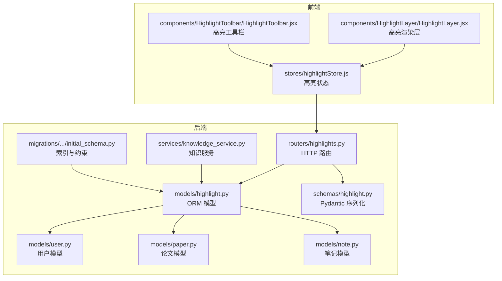
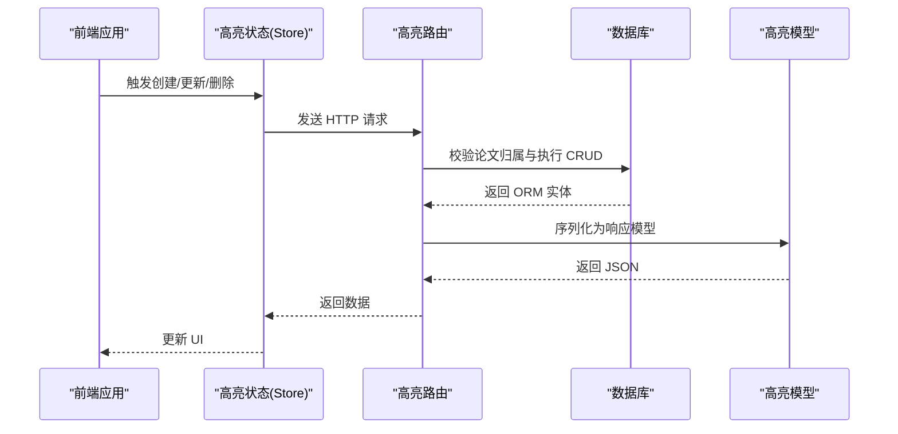
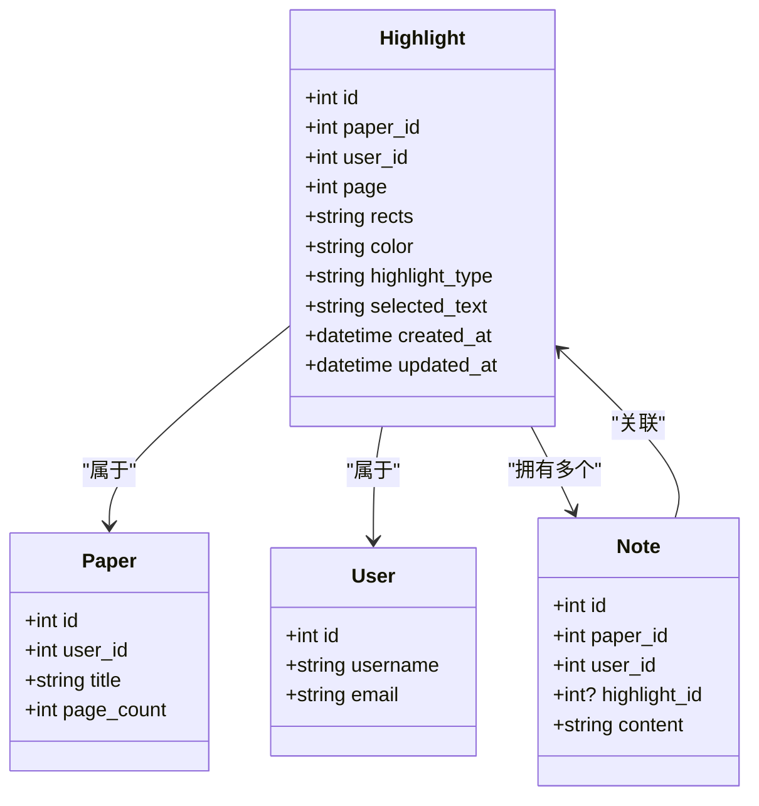
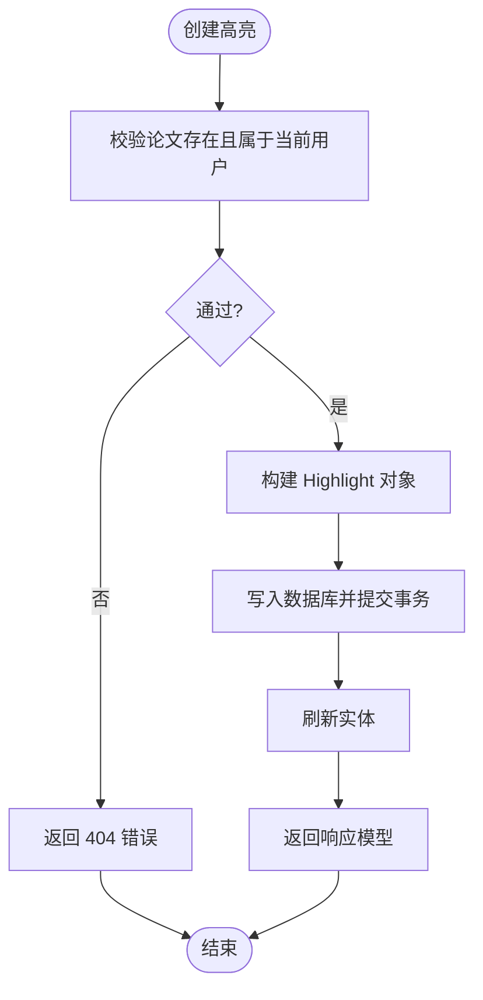
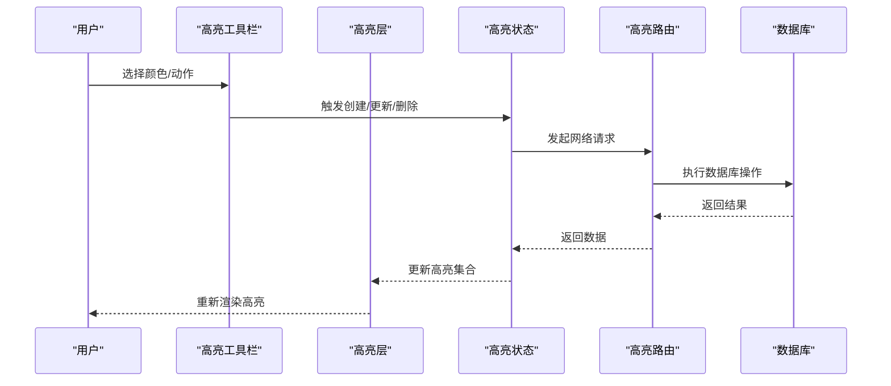
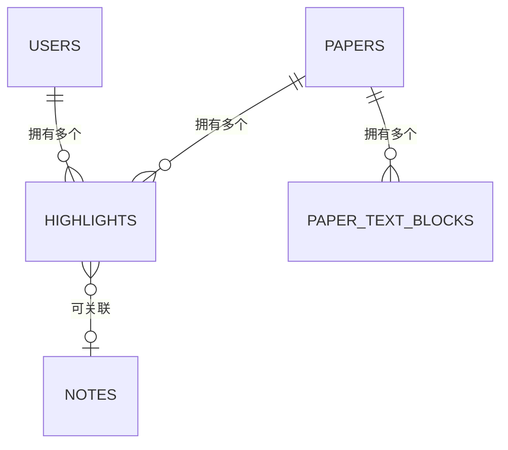
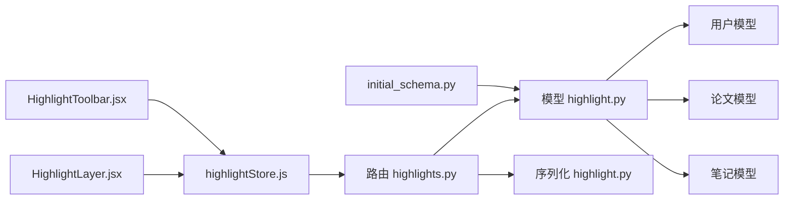

# Highlight 高亮模型

<cite>
**本文引用的文件**
- [backend/app/models/highlight.py](file://backend/app/models/highlight.py)
- [backend/app/schemas/highlight.py](file://backend/app/schemas/highlight.py)
- [backend/app/routers/highlights.py](file://backend/app/routers/highlights.py)
- [backend/app/models/paper.py](file://backend/app/models/paper.py)
- [backend/app/models/note.py](file://backend/app/models/note.py)
- [backend/app/models/user.py](file://backend/app/models/user.py)
- [backend/app/services/knowledge_service.py](file://backend/app/services/knowledge_service.py)
- [frontend/src/stores/highlightStore.js](file://frontend/src/stores/highlightStore.js)
- [frontend/src/components/HighlightLayer/HighlightLayer.jsx](file://frontend/src/components/HighlightLayer/HighlightLayer.jsx)
- [frontend/src/components/HighlightToolbar/HighlightToolbar.jsx](file://frontend/src/components/HighlightToolbar/HighlightToolbar.jsx)
- [backend/migrations/versions/6895243c431d_initial_schema.py](file://backend/migrations/versions/6895243c431d_initial_schema.py)
</cite>

## 目录
1. [简介](#简介)
2. [项目结构](#项目结构)
3. [核心组件](#核心组件)
4. [架构总览](#架构总览)
5. [详细组件分析](#详细组件分析)
6. [依赖关系分析](#依赖关系分析)
7. [性能考量](#性能考量)
8. [故障排查指南](#故障排查指南)
9. [结论](#结论)
10. [附录](#附录)

## 简介
本文件系统性阐述 ChatPDF 中“高亮标注”模型的设计理念与实现细节，覆盖高亮位置信息（论文、页码、矩形区域）、标注内容与用户关联机制；阐明高亮与论文、文本块的关系映射；说明高亮数据的持久化策略与查询优化；给出高亮的创建、编辑、删除与批量操作的实现要点；并讨论高亮在阅读辅助与知识管理中的核心作用。

## 项目结构
高亮模型横跨后端 ORM 模型与 Pydantic Schema、FastAPI 路由、前端状态与渲染组件，以及数据库迁移脚本。整体采用“模型-序列化-路由-服务-前端”的分层组织，保证职责清晰与可维护性。

图表来源
- [backend/app/models/highlight.py:10-37](file://backend/app/models/highlight.py#L10-L37)
- [backend/app/schemas/highlight.py:7-37](file://backend/app/schemas/highlight.py#L7-L37)
- [backend/app/routers/highlights.py:17-189](file://backend/app/routers/highlights.py#L17-L189)
- [backend/app/models/user.py:11-36](file://backend/app/models/user.py#L11-L36)
- [backend/app/models/paper.py:11-85](file://backend/app/models/paper.py#L11-L85)
- [backend/app/models/note.py:11-34](file://backend/app/models/note.py#L11-L34)
- [backend/app/services/knowledge_service.py:79-162](file://backend/app/services/knowledge_service.py#L79-L162)
- [frontend/src/stores/highlightStore.js:4-102](file://frontend/src/stores/highlightStore.js#L4-L102)
- [frontend/src/components/HighlightLayer/HighlightLayer.jsx:16-119](file://frontend/src/components/HighlightLayer/HighlightLayer.jsx#L16-L119)
- [frontend/src/components/HighlightToolbar/HighlightToolbar.jsx:28-210](file://frontend/src/components/HighlightToolbar/HighlightToolbar.jsx#L28-L210)
- [backend/migrations/versions/6895243c431d_initial_schema.py:21-39](file://backend/migrations/versions/6895243c431d_initial_schema.py#L21-L39)

章节来源
- [backend/app/models/highlight.py:10-37](file://backend/app/models/highlight.py#L10-L37)
- [backend/app/schemas/highlight.py:7-37](file://backend/app/schemas/highlight.py#L7-L37)
- [backend/app/routers/highlights.py:17-189](file://backend/app/routers/highlights.py#L17-L189)
- [backend/migrations/versions/6895243c431d_initial_schema.py:21-39](file://backend/migrations/versions/6895243c431d_initial_schema.py#L21-L39)

## 核心组件
- 高亮模型（ORM）
  - 表名：highlights
  - 关键字段：paper_id、user_id、page、rects（JSON 字符串）、color、highlight_type、selected_text、created_at、updated_at
  - 关系：与 Paper、User、Note 的双向关系
- 高亮序列化（Pydantic）
  - 创建模型：HighlightCreate
  - 更新模型：HighlightUpdate
  - 响应模型：HighlightResponse
- 高亮路由（FastAPI）
  - 接口：按论文查询、创建、更新、删除
  - 权限：均需校验论文归属当前用户
- 前端高亮状态与渲染
  - 状态：highlightStore.js
  - 渲染：HighlightLayer.jsx
  - 工具栏：HighlightToolbar.jsx

章节来源
- [backend/app/models/highlight.py:10-37](file://backend/app/models/highlight.py#L10-L37)
- [backend/app/schemas/highlight.py:7-37](file://backend/app/schemas/highlight.py#L7-L37)
- [backend/app/routers/highlights.py:20-186](file://backend/app/routers/highlights.py#L20-L186)
- [frontend/src/stores/highlightStore.js:4-102](file://frontend/src/stores/highlightStore.js#L4-L102)
- [frontend/src/components/HighlightLayer/HighlightLayer.jsx:16-119](file://frontend/src/components/HighlightLayer/HighlightLayer.jsx#L16-L119)
- [frontend/src/components/HighlightToolbar/HighlightToolbar.jsx:28-210](file://frontend/src/components/HighlightToolbar/HighlightToolbar.jsx#L28-L210)

## 架构总览
高亮模型贯穿“请求-鉴权-校验-持久化-返回”的完整链路，同时与笔记、知识卡片形成数据闭环，支撑阅读辅助与知识管理。

图表来源
- [backend/app/routers/highlights.py:58-186](file://backend/app/routers/highlights.py#L58-L186)
- [backend/app/models/highlight.py:10-37](file://backend/app/models/highlight.py#L10-L37)
- [frontend/src/stores/highlightStore.js:10-99](file://frontend/src/stores/highlightStore.js#L10-L99)

## 详细组件分析

### 高亮模型与关系映射
- 设计要点
  - 高亮位置信息：通过 page 与 rects（JSON 数组）表达 PDF 坐标系中的矩形区域
  - 标注类型：支持高亮、下划线、删除线三种风格
  - 用户与论文关联：通过外键 user_id、paper_id 与 User、Paper 双向关联
  - 笔记关联：一个高亮可拥有多个笔记，删除高亮时级联清理笔记
- 数据模型类图

图表来源
- [backend/app/models/highlight.py:10-37](file://backend/app/models/highlight.py#L10-L37)
- [backend/app/models/paper.py:11-85](file://backend/app/models/paper.py#L11-L85)
- [backend/app/models/user.py:11-36](file://backend/app/models/user.py#L11-L36)
- [backend/app/models/note.py:11-34](file://backend/app/models/note.py#L11-L34)

章节来源
- [backend/app/models/highlight.py:10-37](file://backend/app/models/highlight.py#L10-L37)
- [backend/app/models/paper.py:40-59](file://backend/app/models/paper.py#L40-L59)
- [backend/app/models/note.py:19-30](file://backend/app/models/note.py#L19-L30)

### 高亮序列化与 API 定义
- 创建模型 HighlightCreate：包含 paper_id、page、rects、color、highlight_type、selected_text
- 更新模型 HighlightUpdate：color、highlight_type 可选
- 响应模型 HighlightResponse：包含 id、paper_id、user_id、page、rects、color、highlight_type、selected_text、created_at、updated_at
- 路由接口
  - GET /api/highlights/paper/{paper_id}：按论文与用户维度返回高亮列表
  - POST /api/highlights：创建高亮
  - PUT /api/highlights/{highlight_id}：更新高亮
  - DELETE /api/highlights/{highlight_id}：删除高亮

图表来源
- [backend/app/routers/highlights.py:58-105](file://backend/app/routers/highlights.py#L58-L105)

章节来源
- [backend/app/schemas/highlight.py:7-37](file://backend/app/schemas/highlight.py#L7-L37)
- [backend/app/routers/highlights.py:20-186](file://backend/app/routers/highlights.py#L20-L186)

### 前端高亮渲染与交互
- 高亮层（HighlightLayer）
  - 将 PDF 坐标转换为页面像素坐标，逐个矩形绘制高亮区域
  - 支持不同高亮类型（高亮/下划线/删除线）的视觉样式
  - 点击事件透传至父组件进行选中与编辑
- 高亮工具栏（HighlightToolbar）
  - 提供颜色选择、下划线、添加笔记、术语解释、摘要生成、翻译、保存为知识卡片等操作入口
  - 自动判断选中文本长度以启用相应功能
- 高亮状态（highlightStore）
  - 提供加载、创建、更新、删除、设置活动高亮、清空等方法
  - 与后端 API 保持同步

图表来源
- [frontend/src/components/HighlightToolbar/HighlightToolbar.jsx:28-210](file://frontend/src/components/HighlightToolbar/HighlightToolbar.jsx#L28-L210)
- [frontend/src/components/HighlightLayer/HighlightLayer.jsx:16-119](file://frontend/src/components/HighlightLayer/HighlightLayer.jsx#L16-L119)
- [frontend/src/stores/highlightStore.js:10-99](file://frontend/src/stores/highlightStore.js#L10-L99)
- [backend/app/routers/highlights.py:58-186](file://backend/app/routers/highlights.py#L58-L186)

章节来源
- [frontend/src/components/HighlightLayer/HighlightLayer.jsx:16-119](file://frontend/src/components/HighlightLayer/HighlightLayer.jsx#L16-L119)
- [frontend/src/components/HighlightToolbar/HighlightToolbar.jsx:28-210](file://frontend/src/components/HighlightToolbar/HighlightToolbar.jsx#L28-L210)
- [frontend/src/stores/highlightStore.js:4-102](file://frontend/src/stores/highlightStore.js#L4-L102)

### 高亮与论文、文本块的关系映射
- 高亮与论文
  - 通过 paper_id 关联，查询时按 paper_id 与 user_id 双重条件过滤，确保数据隔离
- 高亮与文本块
  - 文本块模型包含 page_number、x0/y0/x1/y1 等几何信息，高亮的 rects 为页面内矩形集合，二者在页面维度上对齐
- 关系图

图表来源
- [backend/app/models/paper.py:40-84](file://backend/app/models/paper.py#L40-L84)
- [backend/app/models/highlight.py:26-33](file://backend/app/models/highlight.py#L26-L33)
- [backend/app/models/note.py:19-30](file://backend/app/models/note.py#L19-L30)

章节来源
- [backend/app/models/paper.py:40-84](file://backend/app/models/paper.py#L40-L84)
- [backend/app/models/highlight.py:26-33](file://backend/app/models/highlight.py#L26-L33)
- [backend/app/models/note.py:19-30](file://backend/app/models/note.py#L19-L30)

### 高亮数据的持久化策略与查询优化
- 索引策略
  - highlights 表对 paper_id、user_id 建有索引，保障按论文与用户维度查询效率
- 级联删除
  - 删除论文时，高亮与笔记通过外键 CASCADE 删除，避免脏数据
- 查询优化建议
  - 按 page 排序返回，便于前端分页与渲染
  - rects 为 JSON 字符串，建议在应用层做结构化存储或引入 JSONB 字段以提升查询能力（当前版本为字符串）

章节来源
- [backend/migrations/versions/6895243c431d_initial_schema.py:26-27](file://backend/migrations/versions/6895243c431d_initial_schema.py#L26-L27)
- [backend/app/models/highlight.py:16-17](file://backend/app/models/highlight.py#L16-L17)
- [backend/app/routers/highlights.py:48-52](file://backend/app/routers/highlights.py#L48-L52)

### 高亮标注的创建、编辑、删除与批量操作
- 创建
  - 校验论文归属当前用户 → 构造实体 → 提交事务 → 刷新返回
- 编辑
  - 仅允许更新 color 与 highlight_type（可选字段）
- 删除
  - 校验归属 → 删除实体 → 提交事务
- 批量操作
  - 当前路由未提供批量接口，可在前端聚合请求或后端新增批量端点以减少往返

章节来源
- [backend/app/routers/highlights.py:58-186](file://backend/app/routers/highlights.py#L58-L186)
- [frontend/src/stores/highlightStore.js:26-85](file://frontend/src/stores/highlightStore.js#L26-L85)

### 版本控制、历史记录与协作设计
- 当前实现
  - 高亮模型具备 created_at 与 updated_at 字段，可用于审计与排序
  - 未见专门的版本表或历史记录表
- 设计建议
  - 引入高亮历史表，记录每次变更的 user_id、变更时间、变更字段快照
  - 协作场景可基于用户维度合并冲突（如颜色/类型变更），或引入轻量级并发控制

章节来源
- [backend/app/models/highlight.py:23-24](file://backend/app/models/highlight.py#L23-L24)

### 高亮在阅读辅助与知识管理中的作用
- 阅读辅助
  - 高亮工具栏提供术语解释、摘要生成、翻译等即时能力
  - 高亮层根据类型渲染不同视觉效果，提升阅读体验
- 知识管理
  - 从高亮一键提取为知识卡片，自动打标签并建立向量索引
  - 与笔记形成“高亮-笔记-卡片”的知识沉淀闭环

章节来源
- [frontend/src/components/HighlightToolbar/HighlightToolbar.jsx:161-204](file://frontend/src/components/HighlightToolbar/HighlightToolbar.jsx#L161-L204)
- [frontend/src/components/HighlightLayer/HighlightLayer.jsx:36-66](file://frontend/src/components/HighlightLayer/HighlightLayer.jsx#L36-L66)
- [backend/app/services/knowledge_service.py:82-162](file://backend/app/services/knowledge_service.py#L82-L162)

## 依赖关系分析
- 组件耦合
  - 路由依赖模型与序列化，模型依赖用户与论文，笔记依赖高亮
- 外部依赖
  - 前端使用 react-pdf 渲染 PDF，HighlightLayer 负责叠加高亮层
  - 后端使用 SQLAlchemy ORM 与 Alembic 迁移

图表来源
- [backend/app/routers/highlights.py:10-15](file://backend/app/routers/highlights.py#L10-L15)
- [backend/app/models/highlight.py:7-8](file://backend/app/models/highlight.py#L7-L8)
- [backend/app/schemas/highlight.py:2-4](file://backend/app/schemas/highlight.py#L2-L4)
- [frontend/src/stores/highlightStore.js:1-2](file://frontend/src/stores/highlightStore.js#L1-L2)
- [frontend/src/components/HighlightLayer/HighlightLayer.jsx:1-1](file://frontend/src/components/HighlightLayer/HighlightLayer.jsx#L1-L1)
- [frontend/src/components/HighlightToolbar/HighlightToolbar.jsx:1-2](file://frontend/src/components/HighlightToolbar/HighlightToolbar.jsx#L1-L2)
- [backend/migrations/versions/6895243c431d_initial_schema.py:21-39](file://backend/migrations/versions/6895243c431d_initial_schema.py#L21-L39)

章节来源
- [backend/app/routers/highlights.py:10-15](file://backend/app/routers/highlights.py#L10-L15)
- [backend/app/models/highlight.py:7-8](file://backend/app/models/highlight.py#L7-L8)
- [frontend/src/stores/highlightStore.js:1-2](file://frontend/src/stores/highlightStore.js#L1-L2)
- [frontend/src/components/HighlightLayer/HighlightLayer.jsx:1-1](file://frontend/src/components/HighlightLayer/HighlightLayer.jsx#L1-L1)
- [frontend/src/components/HighlightToolbar/HighlightToolbar.jsx:1-2](file://frontend/src/components/HighlightToolbar/HighlightToolbar.jsx#L1-L2)
- [backend/migrations/versions/6895243c431d_initial_schema.py:21-39](file://backend/migrations/versions/6895243c431d_initial_schema.py#L21-L39)

## 性能考量
- 查询路径
  - 按 paper_id 与 user_id 查询高亮，利用索引提升性能
  - 按 page 与创建时间排序，有利于前端分页与渲染
- 存储与解析
  - rects 为 JSON 字符串，解析开销较低；若高亮数量大，可考虑二进制或结构化字段
- 并发与一致性
  - 更新仅允许颜色与类型字段，降低锁竞争
  - 建议在高并发场景下增加幂等性与重试机制

## 故障排查指南
- 常见问题
  - 404：论文不存在或无权限访问（创建/查询/更新/删除均会校验）
  - JSON 解析失败：rects 非法导致前端渲染异常
- 排查步骤
  - 后端：确认 paper_id 与 user_id 组合是否正确
  - 前端：检查 selected_text 与 rects 的格式
  - 数据库：确认索引是否存在，必要时重建

章节来源
- [backend/app/routers/highlights.py:35-45](file://backend/app/routers/highlights.py#L35-L45)
- [frontend/src/components/HighlightLayer/HighlightLayer.jsx:82-87](file://frontend/src/components/HighlightLayer/HighlightLayer.jsx#L82-L87)
- [backend/migrations/versions/6895243c431d_initial_schema.py:26-27](file://backend/migrations/versions/6895243c431d_initial_schema.py#L26-L27)

## 结论
高亮模型以简洁的字段与清晰的关系设计，实现了从阅读到知识沉淀的闭环。通过索引与权限校验保障性能与安全，前端工具栏与渲染层提供良好的交互体验。后续可在版本历史、批量操作与结构化存储方面进一步增强，以满足更高强度的协作与检索需求。

## 附录
- API 接口清单
  - GET /api/highlights/paper/{paper_id}：返回指定论文与用户的高亮列表
  - POST /api/highlights：创建高亮
  - PUT /api/highlights/{highlight_id}：更新高亮
  - DELETE /api/highlights/{highlight_id}：删除高亮
- 关键字段说明
  - rects：JSON 字符串，表示页面内的矩形区域集合
  - highlight_type：高亮/下划线/删除线
  - selected_text：选中文本内容，用于知识抽取与检索