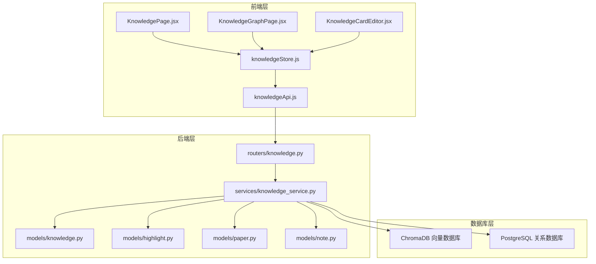
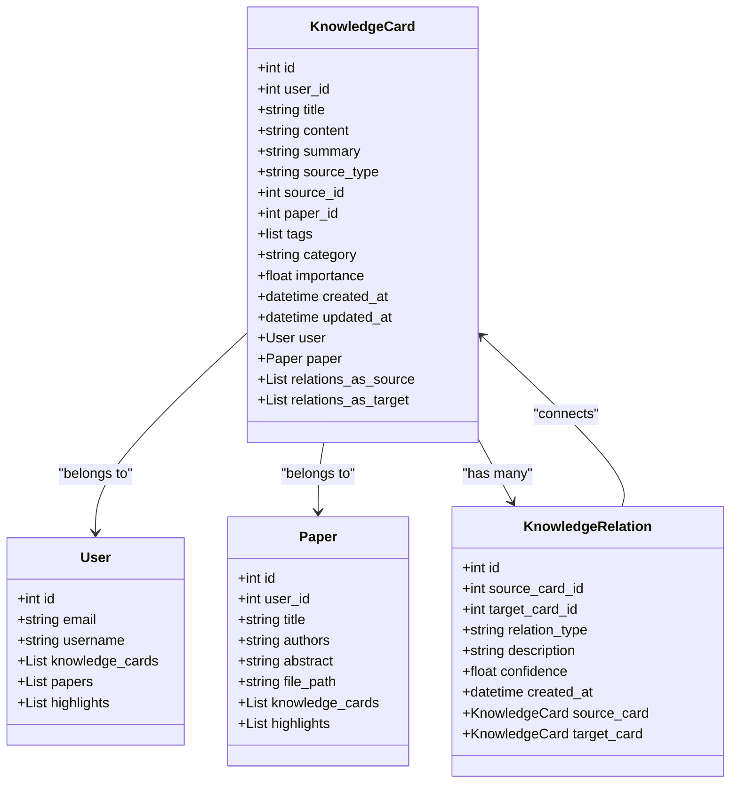
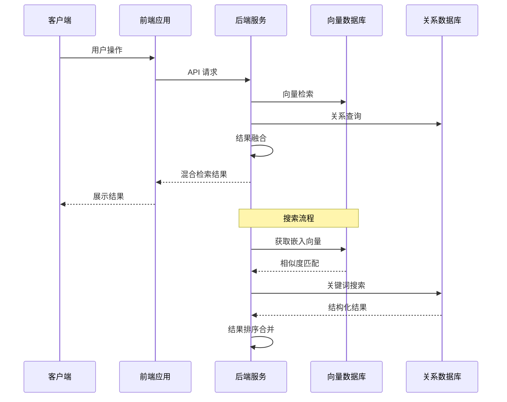
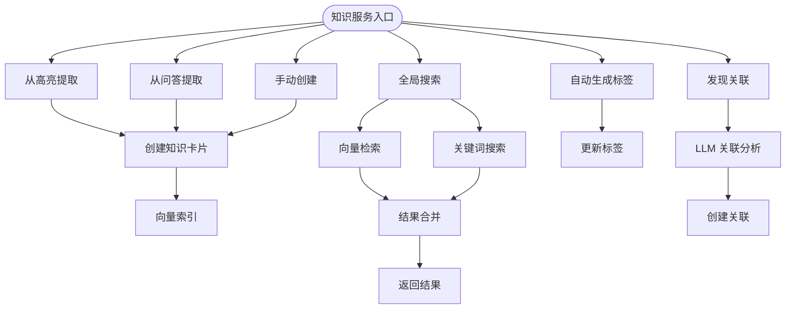
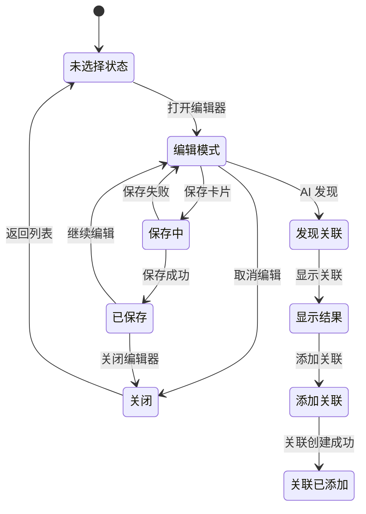
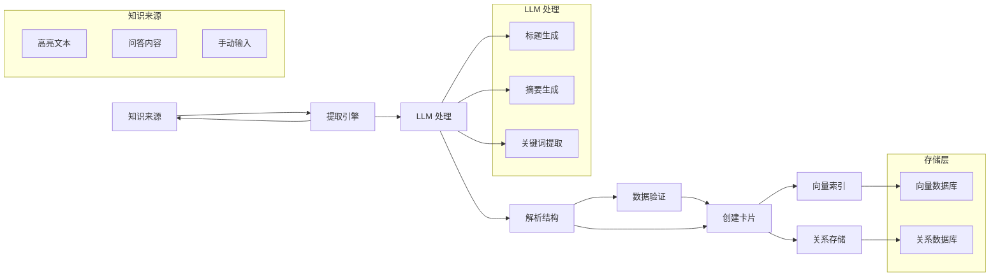
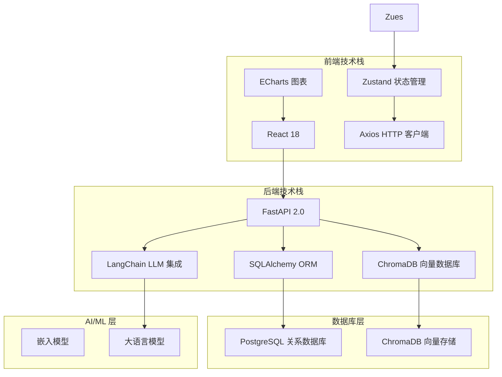
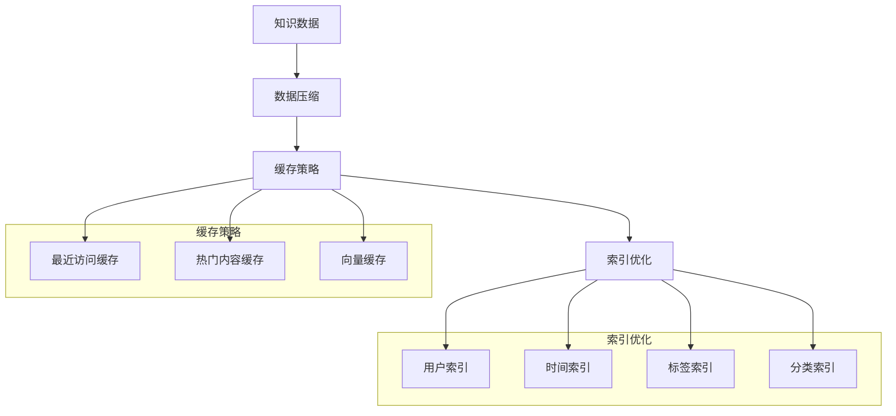

# Knowledge 知识模型

<cite>
**本文档引用的文件**
- [knowledge.py](file://backend/app/models/knowledge.py)
- [knowledge.py](file://backend/app/routers/knowledge.py)
- [knowledge_service.py](file://backend/app/services/knowledge_service.py)
- [KnowledgeCardEditor.jsx](file://frontend/src/components/KnowledgeCardEditor/KnowledgeCardEditor.jsx)
- [knowledgeStore.js](file://frontend/src/stores/knowledgeStore.js)
- [KnowledgePage.jsx](file://frontend/src/pages/KnowledgePage.jsx)
- [KnowledgeGraphPage.jsx](file://frontend/src/pages/KnowledgeGraphPage.jsx)
- [knowledgeApi.js](file://frontend/src/api/knowledgeApi.js)
- [highlight.py](file://backend/app/models/highlight.py)
- [paper.py](file://backend/app/models/paper.py)
- [note.py](file://backend/app/models/note.py)
</cite>

## 目录
1. [简介](#简介)
2. [项目结构](#项目结构)
3. [核心组件](#核心组件)
4. [架构概览](#架构概览)
5. [详细组件分析](#详细组件分析)
6. [依赖分析](#依赖分析)
7. [性能考虑](#性能考虑)
8. [故障排除指南](#故障排除指南)
9. [结论](#结论)
10. [附录](#附录)

## 简介

Knowledge 知识模型是 ChatPDF 项目的核心知识管理组件，负责构建和维护用户的学术知识体系。该模型通过知识卡片的形式组织学习内容，支持多种来源的数据提取（高亮、问答、手动输入），并建立了完整的知识关联网络。

本系统的核心价值在于：
- **多源知识整合**：统一管理来自不同来源的学习材料
- **智能关联发现**：基于 LLM 的知识关联自动识别
- **语义检索**：结合向量检索和关键词搜索的混合检索
- **可视化展示**：知识图谱的动态可视化呈现
- **智能推荐**：基于知识网络的个性化推荐

## 项目结构



**图表来源**
- [knowledge.py:1-550](file://backend/app/routers/knowledge.py#L1-L550)
- [knowledge_service.py:1-662](file://backend/app/services/knowledge_service.py#L1-L662)
- [knowledge.py:1-80](file://backend/app/models/knowledge.py#L1-L80)

**章节来源**
- [knowledge.py:1-550](file://backend/app/routers/knowledge.py#L1-L550)
- [knowledge_service.py:1-662](file://backend/app/services/knowledge_service.py#L1-L662)
- [knowledge.py:1-80](file://backend/app/models/knowledge.py#L1-L80)

## 核心组件

### 知识卡片模型

知识卡片是系统的基本存储单元，采用关系型数据库设计，支持丰富的元数据管理：



**图表来源**
- [knowledge.py:14-80](file://backend/app/models/knowledge.py#L14-L80)
- [paper.py:11-62](file://backend/app/models/paper.py#L11-L62)
- [highlight.py:10-37](file://backend/app/models/highlight.py#L10-L37)

### 知识关联模型

知识关联模型实现了复杂的语义网络构建：

| 关联类型 | 描述 | 使用场景 |
|---------|------|----------|
| related | 相关 | 一般性知识关联 |
| prerequisite | 前置知识 | 学习路径依赖 |
| extends | 扩展 | 知识深化发展 |
| supports | 支持 | 论证支撑关系 |
| contradicts | 矛盾 | 观点对立关系 |

**章节来源**
- [knowledge.py:53-80](file://backend/app/models/knowledge.py#L53-L80)

## 架构概览

系统采用前后端分离架构，结合向量数据库实现智能检索：



**图表来源**
- [knowledge_service.py:350-465](file://backend/app/services/knowledge_service.py#L350-L465)
- [knowledge.py:345-357](file://backend/app/routers/knowledge.py#L345-L357)

## 详细组件分析

### 后端服务层

#### 知识服务核心功能

知识服务提供了完整的知识管理能力：



**图表来源**
- [knowledge_service.py:82-231](file://backend/app/services/knowledge_service.py#L82-L231)
- [knowledge_service.py:350-465](file://backend/app/services/knowledge_service.py#L350-L465)

#### API 路由设计

系统提供了完整的 RESTful API 接口：

| 端点 | 方法 | 功能 | 参数 |
|------|------|------|------|
| `/knowledge/cards` | GET | 获取卡片列表 | page, page_size, search, category, source_type, tag |
| `/knowledge/cards` | POST | 创建知识卡片 | title, content, tags, category, importance |
| `/knowledge/cards/{id}` | GET/PUT/DELETE | 卡片详情操作 | - |
| `/knowledge/cards/from-highlight/{id}` | POST | 从高亮创建 | - |
| `/knowledge/cards/from-chat` | POST | 从问答创建 | content, paper_id |
| `/knowledge/search` | GET | 全局搜索 | query, top_k |
| `/knowledge/cards/{id}/relations` | GET | 获取关联 | - |
| `/knowledge/cards/{id}/find-relations` | POST | 发现关联 | - |
| `/knowledge/graph` | GET | 获取图谱数据 | - |
| `/knowledge/stats` | GET | 获取统计信息 | - |

**章节来源**
- [knowledge.py:130-550](file://backend/app/routers/knowledge.py#L130-L550)

### 前端交互层

#### 知识卡片编辑器



**图表来源**
- [KnowledgeCardEditor.jsx:199-221](file://frontend/src/components/KnowledgeCardEditor/KnowledgeCardEditor.jsx#L199-L221)

#### 知识图谱可视化

知识图谱页面提供了丰富的可视化功能：

| 功能特性 | 实现方式 | 用户体验 |
|----------|----------|----------|
| 力导向布局 | ECharts Graph Chart | 动态节点分布 |
| 环形布局 | Circular Layout | 层次化展示 |
| 节点缩放 | Zoom 控制 | 放大查看细节 |
| 边线样式 | 关系类型着色 | 语义化区分 |
| 节点大小 | 重要性权重 | 重要程度标识 |
| 过滤筛选 | 多维度筛选 | 精准定位 |

**章节来源**
- [KnowledgeGraphPage.jsx:160-200](file://frontend/src/pages/KnowledgeGraphPage.jsx#L160-L200)

### 数据流处理

#### 知识提取流程



**图表来源**
- [knowledge_service.py:82-162](file://backend/app/services/knowledge_service.py#L82-L162)
- [knowledge_service.py:164-231](file://backend/app/services/knowledge_service.py#L164-L231)

**章节来源**
- [knowledge_service.py:82-231](file://backend/app/services/knowledge_service.py#L82-L231)

## 依赖分析

### 技术栈依赖

系统采用了现代化的技术栈组合：



**图表来源**
- [knowledgeApi.js:1-70](file://frontend/src/api/knowledgeApi.js#L1-L70)
- [knowledge_service.py:15-17](file://backend/app/services/knowledge_service.py#L15-L17)

### 外部服务集成

系统集成了多个外部服务来增强功能：

| 服务名称 | 用途 | 集成方式 |
|----------|------|----------|
| ChromaDB | 向量检索 | Python 客户端 |
| LangChain | LLM 集成 | SDK 接口 |
| ECharts | 图表可视化 | CDN 引入 |
| OpenAI | 大语言模型 | API 调用 |
| Azure OpenAI | 企业级 LLM | API 调用 |

**章节来源**
- [knowledge_service.py:15-17](file://backend/app/services/knowledge_service.py#L15-L17)

## 性能考虑

### 搜索性能优化

系统采用了多层次的性能优化策略：

1. **向量检索优化**
   - 使用 ChromaDB 进行高效的相似度搜索
   - 嵌入模型异步执行，避免阻塞主线程
   - 结果缓存机制，减少重复计算

2. **数据库查询优化**
   - 合理的索引设计（user_id, created_at）
   - 分页查询避免大数据量传输
   - 条件查询优化，减少不必要的扫描

3. **前端性能优化**
   - Zustand 状态管理，避免不必要的重渲染
   - ECharts 按需加载，减少包体积
   - 防抖搜索，降低 API 调用频率

### 存储优化策略



## 故障排除指南

### 常见问题及解决方案

#### 知识提取失败

**问题症状**：从高亮或问答创建知识卡片时失败

**可能原因**：
1. LLM 服务不可用
2. 高亮记录不存在
3. 权限验证失败

**解决步骤**：
1. 检查 LLM 服务状态
2. 验证高亮记录是否存在
3. 确认用户权限
4. 查看后端日志获取详细错误信息

#### 搜索结果异常

**问题症状**：搜索结果不准确或为空

**排查方法**：
1. 检查向量数据库连接状态
2. 验证嵌入模型配置
3. 确认索引完整性
4. 测试关键词搜索功能

#### 图谱显示问题

**问题症状**：知识图谱无法正常显示

**检查清单**：
1. 确认 ECharts 依赖正确加载
2. 验证数据格式符合预期
3. 检查浏览器兼容性
4. 确认网络连接正常

**章节来源**
- [knowledge_service.py:109-162](file://backend/app/services/knowledge_service.py#L109-L162)
- [KnowledgeCardEditor.jsx:120-152](file://frontend/src/components/KnowledgeCardEditor/KnowledgeCardEditor.jsx#L120-L152)

## 结论

Knowledge 知识模型通过精心设计的架构和实现，成功构建了一个功能完备的智能知识管理系统。该系统的主要优势包括：

1. **多源数据整合**：统一管理来自不同来源的学习材料
2. **智能关联发现**：利用 LLM 技术自动识别知识间的潜在联系
3. **高效检索机制**：结合向量检索和关键词搜索的混合策略
4. **可视化展示**：提供直观的知识图谱可视化界面
5. **良好的扩展性**：模块化的架构设计便于功能扩展

该模型在学术知识管理、智能推荐和学习辅助方面具有重要的应用价值，为用户构建了完整的个人知识体系。

## 附录

### API 使用示例

#### 获取知识卡片列表
```javascript
// 基础查询
const response = await knowledgeApi.getCards({
  page: 1,
  page_size: 20,
  search: '机器学习',
  category: 'AI'
});
```

#### 创建知识卡片
```javascript
// 从高亮创建
const card = await knowledgeApi.createFromHighlight(highlightId);

// 从问答创建
const card = await knowledgeApi.createFromChat(
  '什么是Transformer模型？',
  paperId
);
```

#### 搜索知识
```javascript
const results = await knowledgeApi.searchCards('深度学习', 10);
console.log(results);
```

### 前端状态管理

系统使用 Zustand 进行状态管理，主要状态包括：

| 状态字段 | 类型 | 描述 |
|----------|------|------|
| cards | Array | 知识卡片列表 |
| currentCard | Object | 当前选中的卡片 |
| searchResults | Array | 搜索结果 |
| graphData | Object | 知识图谱数据 |
| stats | Object | 统计信息 |
| loading | Boolean | 加载状态 |
| error | String | 错误信息 |

**章节来源**
- [knowledgeApi.js:1-70](file://frontend/src/api/knowledgeApi.js#L1-L70)
- [knowledgeStore.js:1-416](file://frontend/src/stores/knowledgeStore.js#L1-L416)