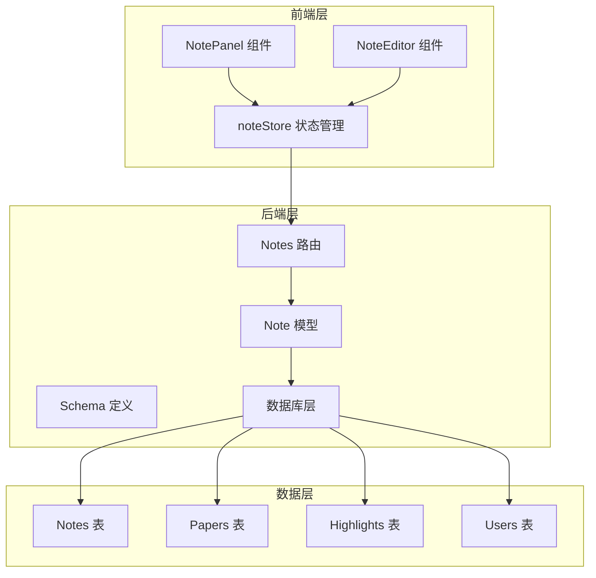
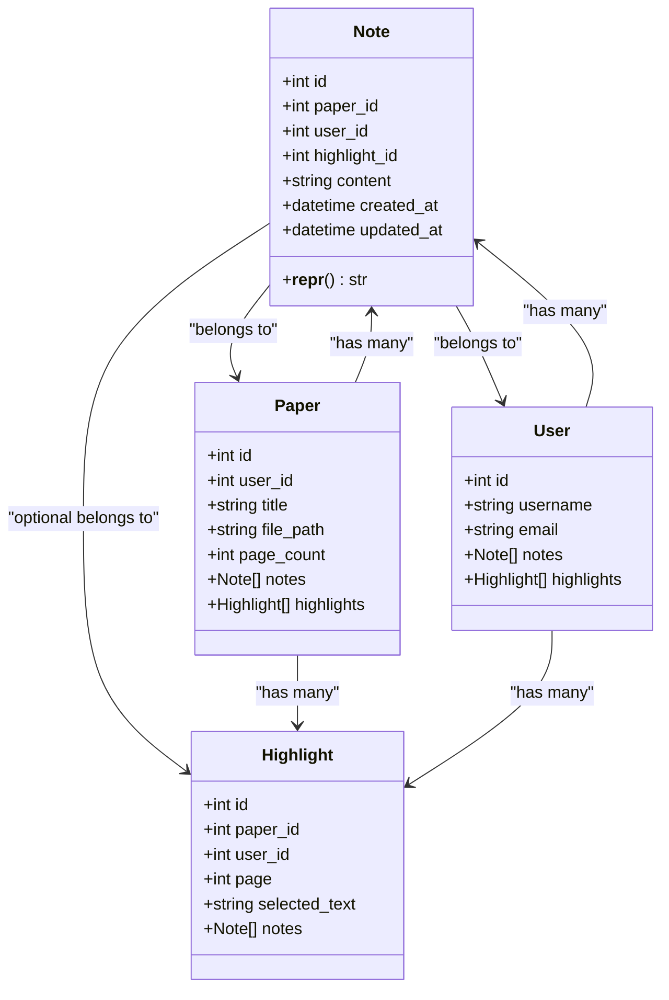
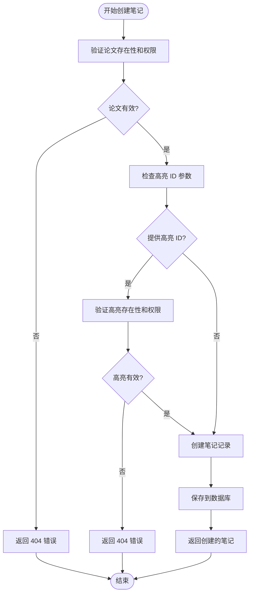
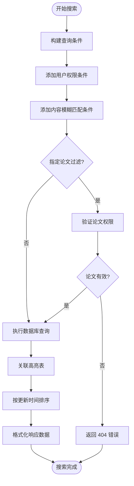
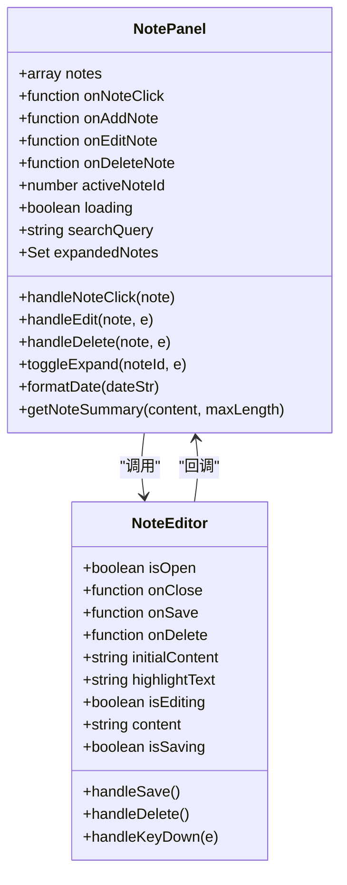
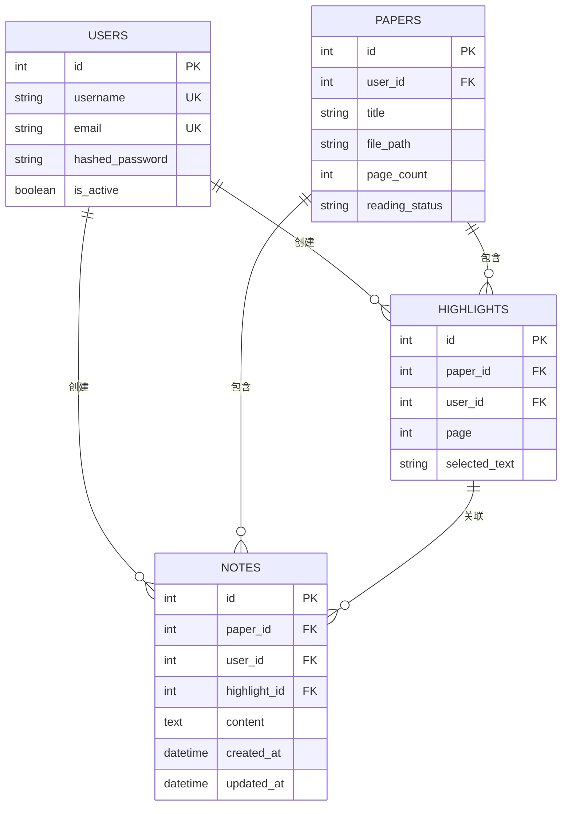
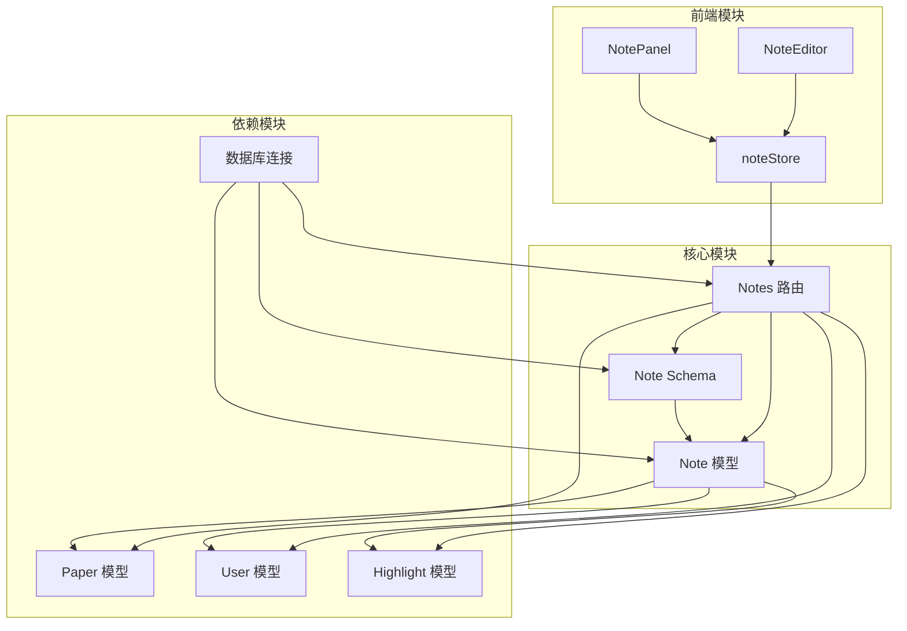
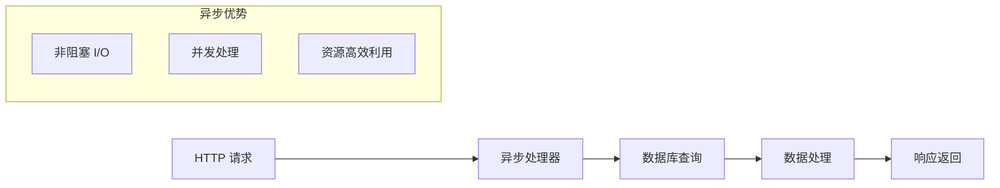

# Note 笔记模型

<cite>
**本文档引用的文件**
- [note.py](file://backend/app/models/note.py)
- [note.py](file://backend/app/schemas/note.py)
- [notes.py](file://backend/app/routers/notes.py)
- [highlight.py](file://backend/app/models/highlight.py)
- [paper.py](file://backend/app/models/paper.py)
- [user.py](file://backend/app/models/user.py)
- [noteStore.js](file://frontend/src/stores/noteStore.js)
- [NoteEditor.jsx](file://frontend/src/components/NoteEditor/NoteEditor.jsx)
- [NotePanel.jsx](file://frontend/src/components/NotePanel/NotePanel.jsx)
- [database.py](file://backend/app/database.py)
</cite>

## 目录
1. [简介](#简介)
2. [项目结构](#项目结构)
3. [核心组件](#核心组件)
4. [架构概览](#架构概览)
5. [详细组件分析](#详细组件分析)
6. [依赖关系分析](#依赖关系分析)
7. [性能考虑](#性能考虑)
8. [故障排除指南](#故障排除指南)
9. [结论](#结论)

## 简介

Note 笔记模型是 ChatPDF 项目中的核心学习辅助功能，旨在为用户提供结构化的笔记管理能力。该模型不仅支持传统的文本笔记创建和编辑，更重要的是实现了与论文内容、高亮标注的深度关联，形成了完整的学术阅读和知识整理生态系统。

该系统的核心设计理念是"以内容为中心"的学习记录方式，通过将笔记与具体的文本片段、页面位置以及相关的高亮内容建立关联，为用户构建了一个立体的知识管理体系。这种设计使得笔记不再是孤立的信息片段，而是成为连接阅读体验、思考过程和知识发现的重要桥梁。

## 项目结构

Note 笔记模型在整个系统中位于三层架构的中间层，承担着业务逻辑处理和数据转换的关键职责：



**图表来源**
- [notes.py:18-350](file://backend/app/routers/notes.py#L18-L350)
- [note.py:11-34](file://backend/app/models/note.py#L11-L34)
- [noteStore.js:1-145](file://frontend/src/stores/noteStore.js#L1-L145)

**章节来源**
- [notes.py:1-350](file://backend/app/routers/notes.py#L1-L350)
- [note.py:1-34](file://backend/app/models/note.py#L1-L34)

## 核心组件

### 数据模型设计

Note 笔记模型采用 SQLAlchemy ORM 设计，体现了清晰的数据关系和约束：



**图表来源**
- [note.py:11-34](file://backend/app/models/note.py#L11-L34)
- [paper.py:11-62](file://backend/app/models/paper.py#L11-L62)
- [highlight.py:10-37](file://backend/app/models/highlight.py#L10-L37)
- [user.py:11-36](file://backend/app/models/user.py#L11-L36)

### 核心属性说明

| 属性名 | 类型 | 约束 | 描述 |
|--------|------|------|------|
| id | int | 主键 | 笔记唯一标识符 |
| paper_id | int | 外键(Papers) | 关联的论文标识符 |
| user_id | int | 外键(Users) | 创建笔记的用户标识符 |
| highlight_id | int | 外键(Highlights) | 关联的高亮标注标识符 |
| content | string | Text类型 | 笔记内容主体 |
| created_at | datetime | 默认值 | 创建时间戳 |
| updated_at | datetime | 默认值+更新触发 | 最后修改时间戳 |

**章节来源**
- [note.py:16-25](file://backend/app/models/note.py#L16-L25)

## 架构概览

Note 笔记模型采用了典型的分层架构设计，确保了良好的关注点分离和可维护性：

```mermaid
sequenceDiagram
participant Client as 客户端
participant Store as noteStore
participant Router as Notes 路由
participant Model as Note 模型
participant DB as 数据库
Client->>Store : 创建笔记请求
Store->>Router : POST /api/notes
Router->>Router : 验证论文权限
Router->>Router : 验证高亮权限(可选)
Router->>Model : 创建 Note 实例
Model->>DB : 插入记录
DB-->>Model : 返回新记录
Model-->>Router : Note 对象
Router-->>Store : NoteResponse
Store-->>Client : 笔记数据
Note->>DB : 外键约束检查
Note->>DB : 级联删除处理
```

**图表来源**
- [notes.py:77-137](file://backend/app/routers/notes.py#L77-L137)
- [noteStore.js:28-45](file://frontend/src/stores/noteStore.js#L28-L45)

**章节来源**
- [notes.py:77-137](file://backend/app/routers/notes.py#L77-L137)
- [noteStore.js:28-45](file://frontend/src/stores/noteStore.js#L28-L45)

## 详细组件分析

### 后端 API 接口设计

#### 笔记创建流程



**图表来源**
- [notes.py:94-137](file://backend/app/routers/notes.py#L94-L137)

#### 笔记搜索算法

系统实现了基于全文的模糊搜索功能，支持跨论文和单论文范围的搜索：



**图表来源**
- [notes.py:285-350](file://backend/app/routers/notes.py#L285-L350)

**章节来源**
- [notes.py:285-350](file://backend/app/routers/notes.py#L285-L350)

### 前端交互组件

#### 笔记面板组件

NotePanel 组件提供了完整的笔记浏览和管理界面：



**图表来源**
- [NotePanel.jsx:17-275](file://frontend/src/components/NotePanel/NotePanel.jsx#L17-L275)
- [NoteEditor.jsx:17-204](file://frontend/src/components/NoteEditor/NoteEditor.jsx#L17-L204)

#### 状态管理设计

noteStore 实现了完整的 CRUD 操作状态管理：

| 操作类型 | 方法名 | 功能描述 |
|----------|--------|----------|
| 读取 | fetchNotes | 获取论文的所有笔记 |
| 创建 | createNote | 创建新的笔记 |
| 更新 | updateNote | 更新现有笔记 |
| 删除 | deleteNote | 删除笔记记录 |
| 搜索 | searchNotes | 按关键词搜索笔记 |
| 详情 | fetchNote | 获取单个笔记详情 |

**章节来源**
- [noteStore.js:1-145](file://frontend/src/stores/noteStore.js#L1-L145)

### 数据关联关系

#### 多对多关系设计

Note 模型与 Paper 和 User 之间建立了标准的一对多关系，同时通过外键约束确保了数据完整性：



**图表来源**
- [note.py:17-22](file://backend/app/models/note.py#L17-L22)
- [paper.py:16-26](file://backend/app/models/paper.py#L16-L26)
- [highlight.py:15-23](file://backend/app/models/highlight.py#L15-L23)
- [user.py:16-23](file://backend/app/models/user.py#L16-L23)

**章节来源**
- [note.py:17-30](file://backend/app/models/note.py#L17-L30)
- [paper.py:38-59](file://backend/app/models/paper.py#L38-L59)
- [highlight.py:26-33](file://backend/app/models/highlight.py#L26-L33)

## 依赖关系分析

### 外部依赖

Note 笔记模型主要依赖于以下外部组件：

| 依赖组件 | 版本 | 用途 | 重要性 |
|----------|------|------|--------|
| SQLAlchemy | 2.x | ORM 框架 | 核心依赖 |
| FastAPI | 0.100+ | Web 框架 | 核心依赖 |
| Pydantic | 2.x | 数据验证 | 核心依赖 |
| AsyncSession | SQLAlchemy | 异步数据库 | 核心依赖 |
| Python 3.9+ | - | 运行环境 | 基础依赖 |

### 内部模块依赖



**图表来源**
- [notes.py:10-16](file://backend/app/routers/notes.py#L10-L16)
- [note.py:5-6](file://backend/app/models/note.py#L5-L6)
- [noteStore.js:1-2](file://frontend/src/stores/noteStore.js#L1-L2)

**章节来源**
- [notes.py:10-16](file://backend/app/routers/notes.py#L10-L16)
- [note.py:5-6](file://backend/app/models/note.py#L5-L6)

## 性能考虑

### 数据库优化策略

1. **索引设计**
   - paper_id 字段建立索引，支持按论文快速查询
   - user_id 字段建立索引，确保用户权限验证效率
   - highlight_id 字段建立索引，优化高亮关联查询

2. **查询优化**
   - 使用 JOIN 操作减少数据库往返次数
   - 实施分页机制避免大量数据传输
   - 采用延迟加载策略优化关联数据加载

3. **缓存策略**
   - 前端实现本地缓存，减少重复请求
   - 后端实施查询结果缓存，提高热点数据访问速度

### 异步处理

系统采用异步编程模式，确保高并发场景下的性能表现：



## 故障排除指南

### 常见问题及解决方案

#### 笔记创建失败

**问题症状**: 创建笔记时返回 404 错误

**可能原因**:
1. 论文不存在或无权限访问
2. 高亮 ID 无效或无权限
3. 数据库连接异常

**解决步骤**:
1. 验证论文 ID 是否正确
2. 检查用户认证状态
3. 确认高亮 ID 属于同一论文
4. 查看服务器日志获取详细错误信息

#### 笔记搜索无结果

**问题症状**: 搜索关键词无法匹配到相关笔记

**可能原因**:
1. 搜索关键词过短（少于 1 个字符）
2. 笔记内容中未包含关键词
3. 用户权限限制导致结果被过滤

**解决步骤**:
1. 确保搜索关键词长度至少为 1
2. 尝试使用更精确的关键词
3. 检查是否选择了论文过滤条件
4. 验证用户是否有足够的搜索权限

#### 笔记关联异常

**问题症状**: 笔记无法正确关联到高亮文本

**可能原因**:
1. 高亮文本已被删除
2. 笔记与高亮不属于同一论文
3. 数据库外键约束冲突

**解决步骤**:
1. 验证高亮是否存在且有效
2. 确认笔记和高亮的论文 ID 一致
3. 检查数据库外键约束状态
4. 重新创建正确的关联关系

**章节来源**
- [notes.py:94-137](file://backend/app/routers/notes.py#L94-L137)
- [notes.py:285-350](file://backend/app/routers/notes.py#L285-L350)

## 结论

Note 笔记模型作为 ChatPDF 项目的核心功能模块，成功实现了学术阅读场景下的笔记管理需求。通过精心设计的数据模型、完善的 API 接口和友好的用户界面，该系统为用户提供了从内容创建到知识整理的完整解决方案。

### 主要优势

1. **强关联性**: 通过与论文和高亮的深度关联，确保笔记内容的上下文完整性
2. **权限安全**: 实施严格的用户权限控制，保护用户学习数据隐私
3. **性能优化**: 采用异步处理和数据库优化策略，保证系统响应速度
4. **用户体验**: 提供直观的前端界面和流畅的操作体验

### 技术特色

1. **模块化设计**: 清晰的分层架构便于维护和扩展
2. **数据一致性**: 通过外键约束和事务处理确保数据完整性
3. **搜索能力**: 支持全文模糊搜索，提升知识检索效率
4. **状态管理**: 前后端协同的状态管理机制

### 应用价值

Note 笔记模型在学习记录和知识整理方面发挥着重要作用：
- **学习辅助**: 帮助用户记录阅读过程中的思考和感悟
- **知识沉淀**: 将零散的笔记整合为系统的知识体系
- **复习工具**: 提供便捷的笔记检索和回顾功能
- **协作基础**: 为后续的知识分享和协作奠定基础

该模型的成功实现为类似学术阅读应用提供了有价值的参考，展示了如何通过技术手段提升学习效率和知识管理质量。