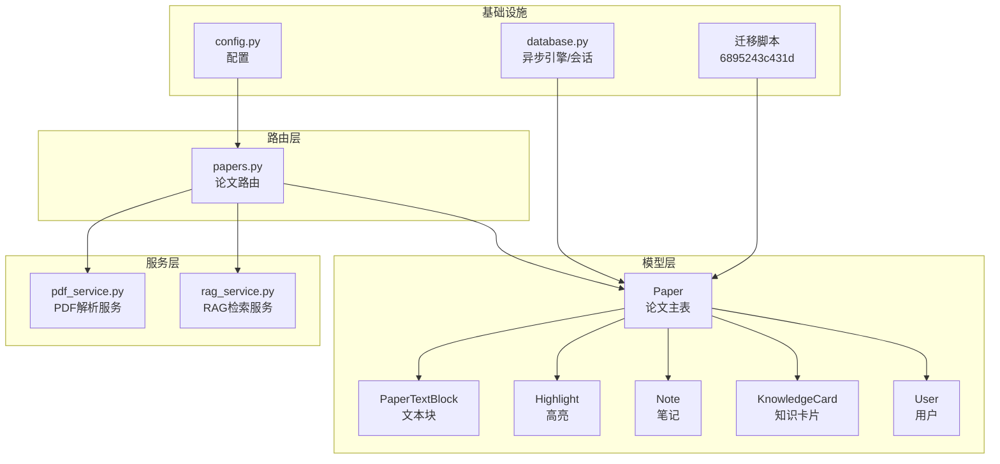
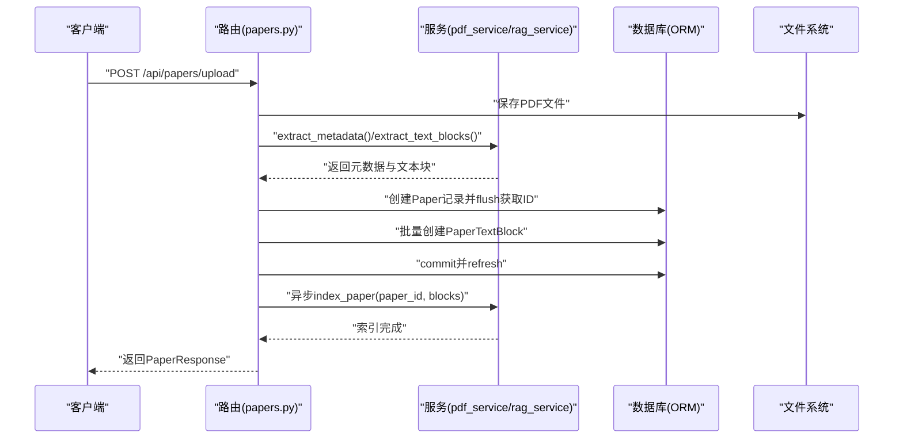
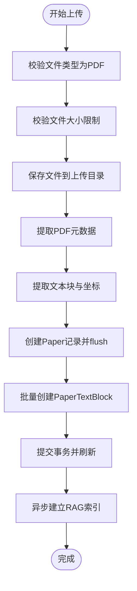
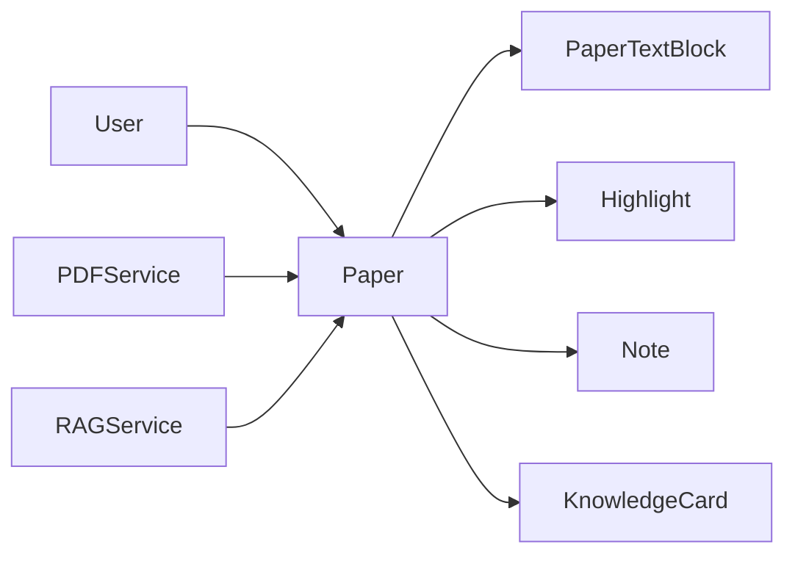

# Paper 论文模型

<cite>
**本文引用的文件**
- [backend/app/models/paper.py](file://backend/app/models/paper.py)
- [backend/app/schemas/paper.py](file://backend/app/schemas/paper.py)
- [backend/migrations/versions/6895243c431d_initial_schema.py](file://backend/migrations/versions/6895243c431d_initial_schema.py)
- [backend/app/routers/papers.py](file://backend/app/routers/papers.py)
- [backend/app/services/pdf_service.py](file://backend/app/services/pdf_service.py)
- [backend/app/services/rag_service.py](file://backend/app/services/rag_service.py)
- [backend/app/models/user.py](file://backend/app/models/user.py)
- [backend/app/models/highlight.py](file://backend/app/models/highlight.py)
- [backend/app/models/note.py](file://backend/app/models/note.py)
- [backend/app/models/knowledge.py](file://backend/app/models/knowledge.py)
- [backend/app/database.py](file://backend/app/database.py)
- [backend/app/config.py](file://backend/app/config.py)
</cite>

## 目录
1. [简介](#简介)
2. [项目结构](#项目结构)
3. [核心组件](#核心组件)
4. [架构总览](#架构总览)
5. [详细组件分析](#详细组件分析)
6. [依赖分析](#依赖分析)
7. [性能考虑](#性能考虑)
8. [故障排查指南](#故障排查指南)
9. [结论](#结论)
10. [附录](#附录)

## 简介
本文件系统性阐述 Paper 论文模型的设计理念与实现细节，覆盖论文基本信息（标题、作者、摘要、DOI 等）、文件元数据（文件路径、大小、页数）、阅读状态管理（阅读进度、最后阅读时间）以及分析缓存机制。文档同时解释字段定义、数据类型选择与约束条件、外键关系与级联策略，并给出数据库表结构与字段映射关系，展示 Paper 模型在论文管理中的核心地位与与其他模块的协作方式。

## 项目结构
Paper 模型位于后端应用的 ORM 层，配合路由层、服务层与数据库迁移脚本共同完成论文的上传、解析、检索与管理。关键文件分布如下：
- 模型层：Paper 及其相关子表（PaperTextBlock、Highlight、Note、KnowledgeCard）
- 路由层：论文上传、列表、详情、删除、文本提取、阅读状态更新等接口
- 服务层：PDF 解析与文本块提取、RAG 向量索引与检索
- 数据库与配置：异步 SQLAlchemy 配置、SQLite 开发环境、索引迁移

图表来源
- [backend/app/models/paper.py:11-85](file://backend/app/models/paper.py#L11-L85)
- [backend/app/routers/papers.py:1-1034](file://backend/app/routers/papers.py#L1-L1034)
- [backend/app/services/pdf_service.py:11-194](file://backend/app/services/pdf_service.py#L11-L194)
- [backend/app/services/rag_service.py:16-415](file://backend/app/services/rag_service.py#L16-L415)
- [backend/app/database.py:8-81](file://backend/app/database.py#L8-L81)
- [backend/migrations/versions/6895243c431d_initial_schema.py:21-61](file://backend/migrations/versions/6895243c431d_initial_schema.py#L21-L61)

章节来源
- [backend/app/models/paper.py:11-85](file://backend/app/models/paper.py#L11-L85)
- [backend/app/routers/papers.py:1-1034](file://backend/app/routers/papers.py#L1-L1034)
- [backend/app/services/pdf_service.py:11-194](file://backend/app/services/pdf_service.py#L11-L194)
- [backend/app/services/rag_service.py:16-415](file://backend/app/services/rag_service.py#L16-L415)
- [backend/app/database.py:8-81](file://backend/app/database.py#L8-L81)
- [backend/migrations/versions/6895243c431d_initial_schema.py:21-61](file://backend/migrations/versions/6895243c431d_initial_schema.py#L21-L61)

## 核心组件
- 论文主表（Paper）：承载论文基本信息、文件元数据、阅读状态与分析缓存字段；通过 user_id 与用户建立一对多关系；与文本块、高亮、笔记、知识卡片建立一对多关系并配置级联删除。
- 文本块表（PaperTextBlock）：存储 PDF 解析后的文本块及其几何坐标，按页组织，与 Paper 建立一对多关系并设置外键级联删除。
- 用户表（User）：与 Paper 建立一对多关系，确保论文归属与权限控制。
- 高亮表（Highlight）：与 Paper、User 建立多对一关系，支持与笔记的级联删除。
- 笔记表（Note）：与 Paper、User 建立多对一关系，与高亮可建立可空的多对一关系。
- 知识卡片表（KnowledgeCard）：与 Paper、User 建立多对一关系，支持知识图谱关联与重要性权重。
- 路由与服务：提供论文上传、解析、文本提取、阅读状态更新、批量上传、RAG 索引与检索等能力。

章节来源
- [backend/app/models/paper.py:11-85](file://backend/app/models/paper.py#L11-L85)
- [backend/app/models/user.py:11-36](file://backend/app/models/user.py#L11-L36)
- [backend/app/models/highlight.py:10-37](file://backend/app/models/highlight.py#L10-L37)
- [backend/app/models/note.py:11-34](file://backend/app/models/note.py#L11-L34)
- [backend/app/models/knowledge.py:14-80](file://backend/app/models/knowledge.py#L14-L80)
- [backend/app/routers/papers.py:1-1034](file://backend/app/routers/papers.py#L1-L1034)
- [backend/app/services/pdf_service.py:11-194](file://backend/app/services/pdf_service.py#L11-L194)
- [backend/app/services/rag_service.py:16-415](file://backend/app/services/rag_service.py#L16-L415)

## 架构总览
Paper 模型贯穿“上传解析—持久化—检索增强—阅读管理”的完整链路。上传时解析 PDF 元数据与文本块，写入 Paper 与 PaperTextBlock；随后异步建立 RAG 向量索引；阅读过程中维护阅读状态与最后阅读时间；分析缓存字段用于存储章节概览与深度分析结果，提升检索与问答效率。

图表来源
- [backend/app/routers/papers.py:156-262](file://backend/app/routers/papers.py#L156-L262)
- [backend/app/services/pdf_service.py:14-118](file://backend/app/services/pdf_service.py#L14-L118)
- [backend/app/services/rag_service.py:186-235](file://backend/app/services/rag_service.py#L186-L235)

## 详细组件分析

### 论文主表（Paper）设计与字段说明
- 表名与主键：表名为 papers，主键为自增整型 id。
- 用户关联：user_id 为外键指向 users.id，建立论文与用户的归属关系；模型中定义了 back_populates=user.papers。
- 基本信息字段：
  - 标题：字符串，长度上限 500。
  - 作者：文本，可空，用于存储作者列表或元数据。
  - 摘要：文本，可空，用于存储论文摘要。
  - DOI：字符串，长度上限 100，可空。
  - 标签：文本，可空，以 JSON 字符串形式存储。
  - 分类：字符串，长度上限 100，可空。
- 文件元数据：
  - 文件路径：字符串，长度上限 500，存储 PDF 文件在服务器上的绝对路径。
  - 文件大小：整型，默认 0。
  - 页数：整型，默认 0。
- 阅读状态管理：
  - 阅读状态：字符串，长度 20，枚举值为 unread/reading/finished，默认 unread；在迁移中创建了索引以优化查询。
  - 最后阅读页码：整型，默认 0。
  - 最后阅读时间：日期时间，可空。
- 分析缓存机制：
  - 章节分析缓存：文本，可空，JSON 字符串，用于存储章节概述。
  - 深度分析缓存：文本，可空，JSON 字符串，用于存储深度分析结果。
  - 分析状态：字符串，长度 20，枚举值为 not_generated/completed/failed，默认 not_generated。
  - 最后分析时间：日期时间，可空。
- 时间戳：created_at 与 updated_at，均使用数据库函数默认值，更新时自动刷新。
- 关系与级联：
  - 与 User：一对多，back_populates=user.papers。
  - 与 PaperTextBlock：一对多，级联删除 orphan。
  - 与 Highlight：一对多，级联删除 orphan。
  - 与 Note：一对多，级联删除 orphan。
  - 与 KnowledgeCard：一对多，级联删除 orphan。

章节来源
- [backend/app/models/paper.py:11-63](file://backend/app/models/paper.py#L11-L63)
- [backend/migrations/versions/6895243c431d_initial_schema.py:33-38](file://backend/migrations/versions/6895243c431d_initial_schema.py#L33-L38)

### 文本块表（PaperTextBlock）设计与字段说明
- 表名与主键：表名为 paper_text_blocks，主键为自增整型 id。
- 论文关联：paper_id 为外键指向 papers.id，设置 ondelete=CASCADE，确保论文删除时自动清理文本块。
- 页面与坐标：page_number 表示页码；x0/y0/x1/y1 表示文本块的矩形边界框。
- 文本内容：text 为文本字段，block_type 表示块类型（默认 text）。
- 关系：与 Paper 建立 back_populates=paper.text_blocks。

章节来源
- [backend/app/models/paper.py:65-85](file://backend/app/models/paper.py#L65-L85)

### 用户、高亮、笔记与知识卡片的关系
- 用户（User）：与 Paper 建立一对多关系，确保论文归属与权限控制。
- 高亮（Highlight）：与 Paper、User 建立多对一关系；与 Note 建立一对多关系并级联删除 orphan。
- 笔记（Note）：与 Paper、User 建立多对一关系；与 Highlight 建立可空的多对一关系。
- 知识卡片（KnowledgeCard）：与 Paper、User 建立多对一关系；支持标签列表与重要性权重，便于知识图谱构建。

章节来源
- [backend/app/models/user.py:11-36](file://backend/app/models/user.py#L11-L36)
- [backend/app/models/highlight.py:10-37](file://backend/app/models/highlight.py#L10-L37)
- [backend/app/models/note.py:11-34](file://backend/app/models/note.py#L11-L34)
- [backend/app/models/knowledge.py:14-80](file://backend/app/models/knowledge.py#L14-L80)

### 上传与解析流程（路由与服务）
- 上传接口：接收 PDF 文件，校验类型与大小，保存至 uploads 目录；调用 PDFService 提取元数据与文本块；创建 Paper 记录并 flush 获取 ID；批量创建 PaperTextBlock；提交事务并异步触发 RAG 索引。
- PDF 解析：提取标题、作者、页数、文本块坐标等信息；若 PDF 元数据缺失则回退到首页文本提取标题。
- RAG 索引：将文本块智能分块后向量化，存储至 ChromaDB；提供混合检索与跨论文检索能力。

图表来源
- [backend/app/routers/papers.py:156-262](file://backend/app/routers/papers.py#L156-L262)
- [backend/app/services/pdf_service.py:14-118](file://backend/app/services/pdf_service.py#L14-L118)
- [backend/app/services/rag_service.py:186-235](file://backend/app/services/rag_service.py#L186-L235)

章节来源
- [backend/app/routers/papers.py:156-262](file://backend/app/routers/papers.py#L156-L262)
- [backend/app/services/pdf_service.py:14-118](file://backend/app/services/pdf_service.py#L14-L118)
- [backend/app/services/rag_service.py:186-235](file://backend/app/services/rag_service.py#L186-L235)

### 阅读状态管理与接口
- 接口：PATCH /api/papers/{paper_id}/reading-status，支持 reading 与 finished 两种状态更新，并自动记录 last_read_at。
- 业务约束：状态值限定为 unread/reading/finished；仅允许当前用户访问与修改自己的论文。
- 数据一致性：通过查询时附加 user_id 条件，确保权限隔离。

章节来源
- [backend/app/routers/papers.py:44-89](file://backend/app/routers/papers.py#L44-L89)

### 列表、搜索与筛选
- 接口：GET /api/papers，支持分页、关键词搜索（标题/作者模糊匹配）、分类与阅读状态筛选。
- 查询优化：迁移脚本为 papers.user_id 与 reading_status 建立索引，提升筛选与排序性能。

章节来源
- [backend/app/routers/papers.py:91-154](file://backend/app/routers/papers.py#L91-L154)
- [backend/migrations/versions/6895243c431d_initial_schema.py:37-38](file://backend/migrations/versions/6895243c431d_initial_schema.py#L37-L38)

### 数据库表结构与字段映射
- papers 表：包含用户ID、标题、作者、摘要、DOI、文件路径、文件大小、页数、标签、分类、阅读状态、最后阅读页码、最后阅读时间、分析缓存字段、分析状态、最后分析时间、创建与更新时间等。
- paper_text_blocks 表：包含 paper_id、页码、文本、坐标(x0,y0,x1,y1)、块类型等。
- 索引与约束：迁移脚本为 papers.user_id、reading_status、paper_text_blocks.paper_id 等字段建立索引；analysis_status 字段在迁移中改为非空并设置默认值。

章节来源
- [backend/app/models/paper.py:11-63](file://backend/app/models/paper.py#L11-L63)
- [backend/migrations/versions/6895243c431d_initial_schema.py:21-61](file://backend/migrations/versions/6895243c431d_initial_schema.py#L21-L61)

### 模型验证规则与业务约束
- 上传校验：仅接受 PDF 文件，文件大小不超过配置的最大值；标题可为空，若为空则回退到 PDF 元数据或原始文件名。
- 状态校验：阅读状态更新接口限定状态枚举值；删除论文时同步删除本地文件与数据库记录（级联删除）。
- 数据完整性：Paper 与子表采用 delete-orphan 级联策略；PaperTextBlock 的 paper_id 外键设置 CASCADE，确保论文删除时自动清理文本块。

章节来源
- [backend/app/routers/papers.py:177-192](file://backend/app/routers/papers.py#L177-L192)
- [backend/app/routers/papers.py:341-377](file://backend/app/routers/papers.py#L341-L377)
- [backend/app/models/paper.py:40-59](file://backend/app/models/paper.py#L40-L59)

## 依赖分析
Paper 模型与用户、高亮、笔记、知识卡片存在外键依赖；与 PDF 解析与 RAG 服务存在运行时依赖。迁移脚本确保数据库索引与约束的一致性。

图表来源
- [backend/app/models/paper.py:11-85](file://backend/app/models/paper.py#L11-L85)
- [backend/app/models/user.py:11-36](file://backend/app/models/user.py#L11-L36)
- [backend/app/models/highlight.py:10-37](file://backend/app/models/highlight.py#L10-L37)
- [backend/app/models/note.py:11-34](file://backend/app/models/note.py#L11-L34)
- [backend/app/models/knowledge.py:14-80](file://backend/app/models/knowledge.py#L14-L80)
- [backend/app/services/pdf_service.py:11-194](file://backend/app/services/pdf_service.py#L11-L194)
- [backend/app/services/rag_service.py:16-415](file://backend/app/services/rag_service.py#L16-L415)

章节来源
- [backend/app/models/paper.py:11-85](file://backend/app/models/paper.py#L11-L85)
- [backend/app/models/user.py:11-36](file://backend/app/models/user.py#L11-L36)
- [backend/app/models/highlight.py:10-37](file://backend/app/models/highlight.py#L10-L37)
- [backend/app/models/note.py:11-34](file://backend/app/models/note.py#L11-L34)
- [backend/app/models/knowledge.py:14-80](file://backend/app/models/knowledge.py#L14-L80)
- [backend/app/services/pdf_service.py:11-194](file://backend/app/services/pdf_service.py#L11-L194)
- [backend/app/services/rag_service.py:16-415](file://backend/app/services/rag_service.py#L16-L415)

## 性能考虑
- 索引优化：迁移脚本为 papers.user_id 与 reading_status 建立索引，提升列表查询与筛选性能。
- 异步处理：上传完成后异步建立 RAG 索引，避免阻塞主线程。
- 文本块分块：RAG 服务采用智能分块策略，结合重叠窗口与页面信息，兼顾检索精度与性能。
- 缓存机制：RAG 服务对 BM25 索引进行缓存，减少重复构建开销。

章节来源
- [backend/migrations/versions/6895243c431d_initial_schema.py:21-61](file://backend/migrations/versions/6895243c431d_initial_schema.py#L21-L61)
- [backend/app/routers/papers.py:249-251](file://backend/app/routers/papers.py#L249-L251)
- [backend/app/services/rag_service.py:105-164](file://backend/app/services/rag_service.py#L105-L164)
- [backend/app/services/rag_service.py:166-185](file://backend/app/services/rag_service.py#L166-L185)

## 故障排查指南
- 上传失败：检查文件类型与大小限制；确认上传目录存在且可写；查看 PDF 解析异常日志。
- 无法查询论文：确认请求携带正确的用户上下文，查询时附加 user_id 条件；检查 papers.user_id 索引是否存在。
- 删除论文后仍残留文件：确认删除接口已执行文件删除与数据库删除；检查 ondelete=CASCADE 是否生效。
- RAG 索引异常：检查 ChromaDB 存储路径与权限；确认嵌入模型加载成功；查看索引状态与错误信息。

章节来源
- [backend/app/routers/papers.py:177-192](file://backend/app/routers/papers.py#L177-L192)
- [backend/app/routers/papers.py:341-377](file://backend/app/routers/papers.py#L341-L377)
- [backend/app/services/pdf_service.py:163-190](file://backend/app/services/pdf_service.py#L163-L190)
- [backend/app/services/rag_service.py:340-374](file://backend/app/services/rag_service.py#L340-L374)

## 结论
Paper 模型以清晰的字段设计与严格的外键约束为基础，结合 PDF 解析与 RAG 检索服务，实现了论文的全生命周期管理。通过阅读状态与分析缓存机制，提升了用户体验与检索效率；通过迁移脚本与索引策略，保障了查询性能与数据一致性。该模型在论文管理场景中扮演核心角色，为高亮、笔记、知识卡片与聊天会话等上层功能提供了稳定的数据支撑。

## 附录
- 配置项参考：数据库 URL、上传目录、最大文件大小、调试开关等。
- 数据库初始化：异步引擎与会话工厂，应用启动时创建表并确保默认用户存在。

章节来源
- [backend/app/config.py:15-44](file://backend/app/config.py#L15-L44)
- [backend/app/database.py:50-81](file://backend/app/database.py#L50-L81)