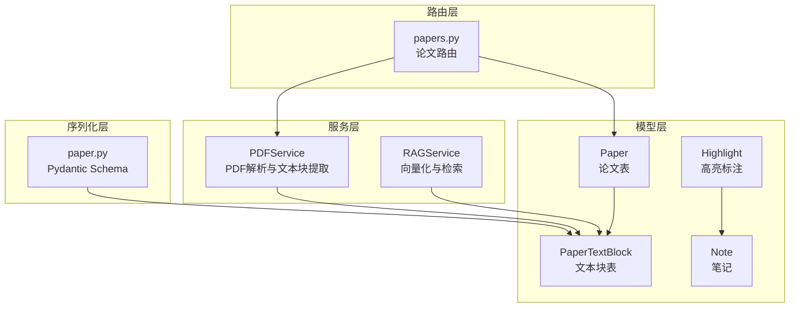
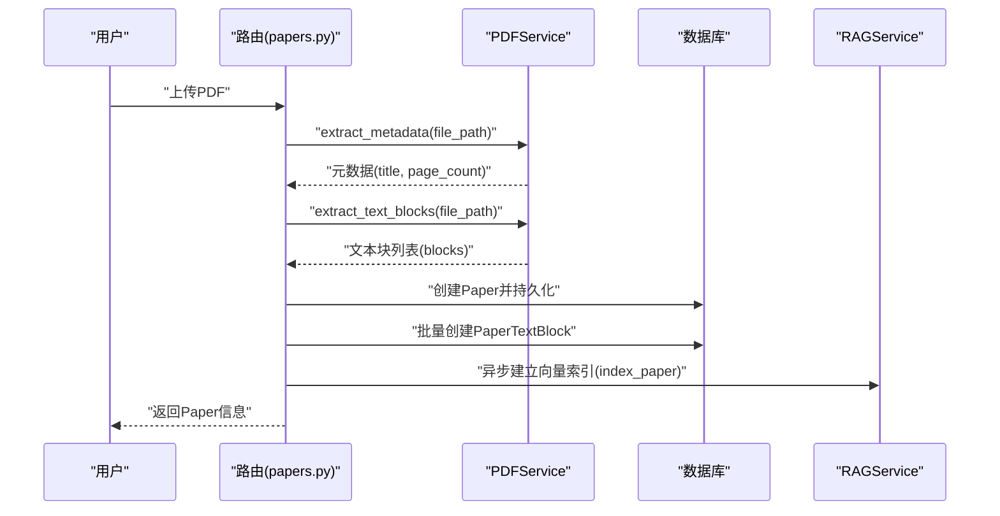
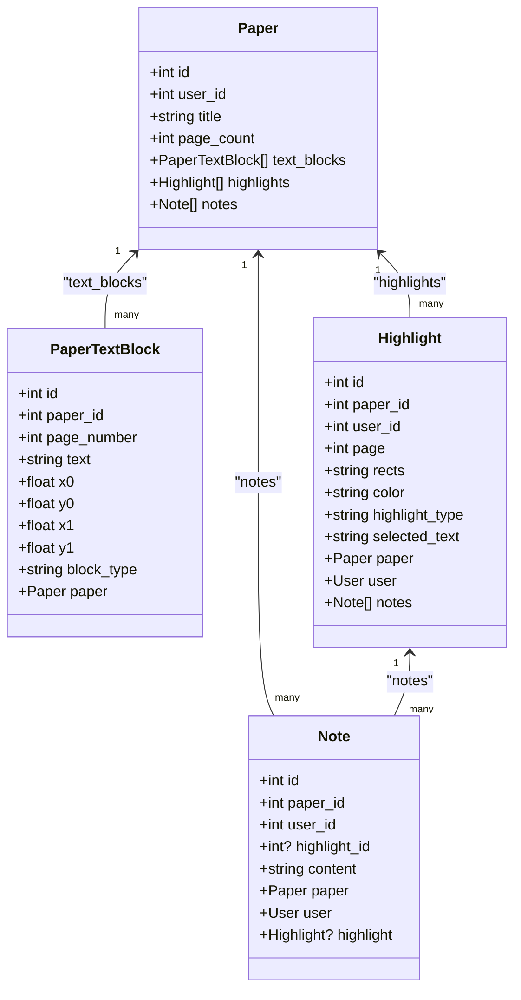
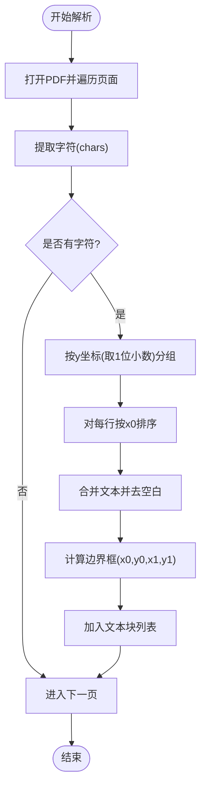
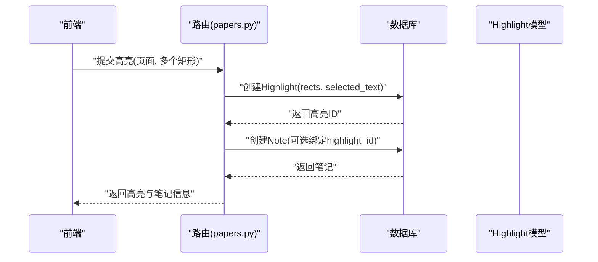
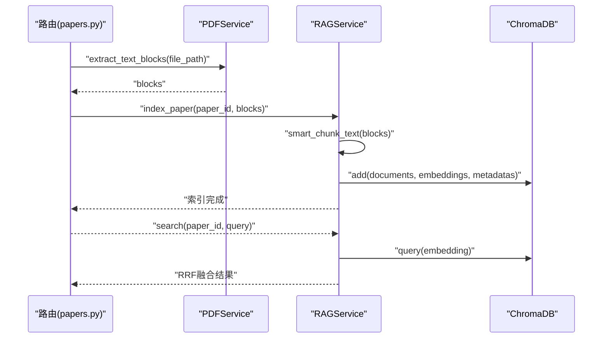
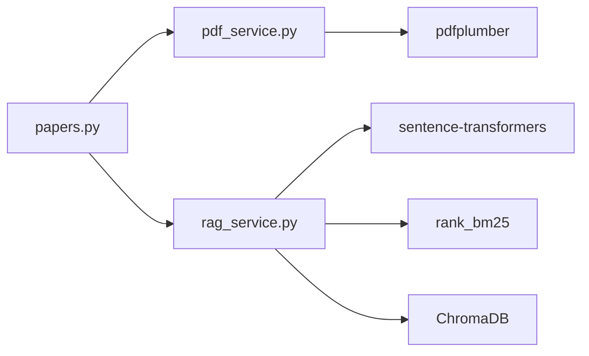

# PaperTextBlock 文本块模型

<cite>
**本文引用的文件**
- [backend/app/models/paper.py](file://backend/app/models/paper.py)
- [backend/app/schemas/paper.py](file://backend/app/schemas/paper.py)
- [backend/app/services/pdf_service.py](file://backend/app/services/pdf_service.py)
- [backend/app/routers/papers.py](file://backend/app/routers/papers.py)
- [backend/app/services/rag_service.py](file://backend/app/services/rag_service.py)
- [backend/app/models/highlight.py](file://backend/app/models/highlight.py)
- [backend/app/schemas/highlight.py](file://backend/app/schemas/highlight.py)
- [backend/app/models/note.py](file://backend/app/models/note.py)
</cite>

## 目录
1. [简介](#简介)
2. [项目结构](#项目结构)
3. [核心组件](#核心组件)
4. [架构总览](#架构总览)
5. [详细组件分析](#详细组件分析)
6. [依赖分析](#依赖分析)
7. [性能考量](#性能考量)
8. [故障排查指南](#故障排查指南)
9. [结论](#结论)
10. [附录](#附录)

## 简介
PaperTextBlock 是论文文本块的核心数据模型，用于存储 PDF 解析后按行/段落聚合的文本片段及其几何坐标信息。该模型支撑以下关键能力：
- PDF 渲染与页面定位：通过页码与四角坐标定位文本块在页面上的精确位置，便于前端渲染与交互。
- 高亮标注：与高亮模型配合，实现对文本块区域的高亮、下划线、删除线等标注，并可与笔记关联。
- RAG 检索：将文本块进行智能分块并向量化，结合语义检索与 BM25 关键词检索，实现高效准确的论文内检索与跨论文检索。

## 项目结构
围绕 PaperTextBlock 的相关模块分布如下：
- 数据模型层：Paper、PaperTextBlock、Highlight、Note
- 服务层：PDFService（提取文本块）、RAGService（向量化与检索）
- 路由层：论文上传、文本块查询、全文导出等接口
- 序列化层：Pydantic Schema（PaperTextBlockResponse）

**图示来源**
- [backend/app/models/paper.py:65-85](file://backend/app/models/paper.py#L65-L85)
- [backend/app/services/pdf_service.py:59-118](file://backend/app/services/pdf_service.py#L59-L118)
- [backend/app/services/rag_service.py:105-164](file://backend/app/services/rag_service.py#L105-L164)
- [backend/app/routers/papers.py:156-262](file://backend/app/routers/papers.py#L156-L262)
- [backend/app/schemas/paper.py:54-66](file://backend/app/schemas/paper.py#L54-L66)

**章节来源**
- [backend/app/models/paper.py:11-85](file://backend/app/models/paper.py#L11-L85)
- [backend/app/services/pdf_service.py:11-194](file://backend/app/services/pdf_service.py#L11-L194)
- [backend/app/routers/papers.py:156-262](file://backend/app/routers/papers.py#L156-L262)
- [backend/app/schemas/paper.py:54-66](file://backend/app/schemas/paper.py#L54-L66)

## 核心组件
- PaperTextBlock 表结构与字段
  - 主键：id
  - 外键：paper_id（关联论文）
  - 页面定位：page_number
  - 文本内容：text
  - 几何坐标：x0、y0、x1、y1（矩形边界框）
  - 类型标记：block_type（默认 text）
  - 关系：back_populates 到 Paper.text_blocks

- 坐标系统与页面定位
  - 坐标以 PDF 页面左上角为原点，向右为 x 正方向，向下为 y 正方向。
  - x0、y0 为左上角；x1、y1 为右下角；用于唯一确定文本块的矩形区域。
  - page_number 用于区分不同页面的文本块，便于按页渲染与检索。

- 文本块类型分类
  - 当前默认类型为 text，预留扩展空间（如 figure、table、section_title 等）。
  - 可在解析阶段根据布局特征或规则进行分类，以支持更精细的渲染与检索。

- 与论文的关系
  - 一对多：Paper.text_blocks
  - 级联删除：删除论文时自动删除其文本块，保证数据一致性。

**章节来源**
- [backend/app/models/paper.py:65-85](file://backend/app/models/paper.py#L65-L85)
- [backend/app/schemas/paper.py:54-66](file://backend/app/schemas/paper.py#L54-L66)

## 架构总览
PaperTextBlock 在系统中的工作流如下：
- PDF 解析：PDFService 逐页提取字符级信息，按行聚合并计算边界框，生成文本块列表。
- 数据入库：路由层接收上传请求，调用 PDFService 提取文本块，写入 PaperTextBlock。
- 渲染与交互：前端根据 page_number 与坐标信息绘制文本块区域，支持点击、高亮等操作。
- 检索增强：RAGService 将文本块进行智能分块并向量化，支持语义检索与跨论文检索。

**图示来源**
- [backend/app/routers/papers.py:156-262](file://backend/app/routers/papers.py#L156-L262)
- [backend/app/services/pdf_service.py:14-118](file://backend/app/services/pdf_service.py#L14-L118)
- [backend/app/services/rag_service.py:186-235](file://backend/app/services/rag_service.py#L186-L235)

## 详细组件分析

### 数据模型与关系
PaperTextBlock 与 Paper、Highlight、Note 的关系如下：

**图示来源**
- [backend/app/models/paper.py:11-85](file://backend/app/models/paper.py#L11-L85)
- [backend/app/models/highlight.py:10-37](file://backend/app/models/highlight.py#L10-L37)
- [backend/app/models/note.py:11-34](file://backend/app/models/note.py#L11-L34)

**章节来源**
- [backend/app/models/paper.py:11-85](file://backend/app/models/paper.py#L11-L85)
- [backend/app/models/highlight.py:10-37](file://backend/app/models/highlight.py#L10-L37)
- [backend/app/models/note.py:11-34](file://backend/app/models/note.py#L11-L34)

### PDF 解析与文本块生成
- 行级聚合：按字符的 top（y0）取一位小数进行分组，确保同一行的字符被正确合并。
- 边界框计算：对一行字符的 x0、top、x1、bottom 取极值，得到文本块的矩形边界。
- 文本块属性：包含 page_number、text、x0、y0、x1、y1、block_type。

**图示来源**
- [backend/app/services/pdf_service.py:59-118](file://backend/app/services/pdf_service.py#L59-L118)

**章节来源**
- [backend/app/services/pdf_service.py:59-118](file://backend/app/services/pdf_service.py#L59-L118)

### 文本块与高亮标注的协作
- 高亮模型使用 JSON 字符串存储一组矩形区域（rects），每个矩形包含 x0、y0、x1、y1。
- 文本块与高亮的页面一致性：两者均以 page_number 定位，确保渲染与交互一致。
- 笔记与高亮关联：Note 可选择性绑定 Highlight，形成“标注-批注”的知识链路。

**图示来源**
- [backend/app/routers/papers.py:465-518](file://backend/app/routers/papers.py#L465-L518)
- [backend/app/models/highlight.py:10-37](file://backend/app/models/highlight.py#L10-L37)
- [backend/app/schemas/highlight.py:7-37](file://backend/app/schemas/highlight.py#L7-L37)
- [backend/app/models/note.py:11-34](file://backend/app/models/note.py#L11-L34)

**章节来源**
- [backend/app/models/highlight.py:10-37](file://backend/app/models/highlight.py#L10-L37)
- [backend/app/schemas/highlight.py:7-37](file://backend/app/schemas/highlight.py#L7-L37)
- [backend/app/models/note.py:11-34](file://backend/app/models/note.py#L11-L34)

### RAG 检索中的文本块应用
- 智能分块：按文本块自然边界进行分块，控制块大小与重叠，保留页码信息，便于结果溯源。
- 向量化：使用嵌入模型对分块文本进行编码，存入 ChromaDB。
- 混合检索：语义检索与 BM25 关键词检索融合，采用 RRF 算法进行重排序。
- 跨论文检索：并行检索多个论文集合，统一排序返回。

**图示来源**
- [backend/app/routers/papers.py:207-250](file://backend/app/routers/papers.py#L207-L250)
- [backend/app/services/pdf_service.py:59-118](file://backend/app/services/pdf_service.py#L59-L118)
- [backend/app/services/rag_service.py:105-164](file://backend/app/services/rag_service.py#L105-L164)
- [backend/app/services/rag_service.py:186-309](file://backend/app/services/rag_service.py#L186-L309)

**章节来源**
- [backend/app/services/rag_service.py:105-164](file://backend/app/services/rag_service.py#L105-L164)
- [backend/app/services/rag_service.py:186-309](file://backend/app/services/rag_service.py#L186-L309)

## 依赖分析
- 模型耦合
  - PaperTextBlock 与 Paper：一对多关系，外键约束保证数据完整性。
  - Highlight 与 Paper、User：一对多关系，支持用户维度的高亮管理。
  - Note 与 Paper、User、Highlight：多对一关系，形成“论文-用户-高亮-笔记”的完整知识链。
- 服务依赖
  - 路由层依赖 PDFService 进行文本块提取，依赖 RAGService 进行索引与检索。
  - RAGService 依赖 ChromaDB 进行向量存储，依赖 BM25 进行关键词检索。
- 外部依赖
  - pdfplumber：用于 PDF 字符级信息提取与页面遍历。
  - sentence-transformers：用于文本嵌入编码。
  - rank_bm25：用于 BM25 关键词检索。

**图示来源**
- [backend/app/routers/papers.py:20-29](file://backend/app/routers/papers.py#L20-L29)
- [backend/app/services/pdf_service.py:5-8](file://backend/app/services/pdf_service.py#L5-L8)
- [backend/app/services/rag_service.py:8-14](file://backend/app/services/rag_service.py#L8-L14)

**章节来源**
- [backend/app/routers/papers.py:20-29](file://backend/app/routers/papers.py#L20-L29)
- [backend/app/services/pdf_service.py:5-8](file://backend/app/services/pdf_service.py#L5-L8)
- [backend/app/services/rag_service.py:8-14](file://backend/app/services/rag_service.py#L8-L14)

## 性能考量
- 文本块生成
  - 行分组精度：按 y0 取一位小数，平衡精度与性能，减少微小误差导致的分组偏差。
  - 字符排序：按 x0 排序后合并，避免多次扫描，提升效率。
- 数据库写入
  - 批量插入：上传时一次性 flush 获取 paper_id，随后批量创建 PaperTextBlock，减少往返。
  - 异步索引：上传完成后异步触发 RAG 索引，避免阻塞主流程。
- 检索性能
  - 分块策略：控制块大小与重叠，兼顾召回与上下文连贯性。
  - 缓存与并发：BM25 索引缓存避免重复构建；线程池执行嵌入编码，降低事件循环阻塞。
  - RRF 融合：在有限候选集上融合，控制检索成本。

[本节为通用性能建议，无需特定文件引用]

## 故障排查指南
- PDF 解析失败
  - 现象：extract_text_blocks 返回空列表或抛出异常。
  - 排查：确认文件为有效 PDF；检查 pdfplumber 版本与依赖；查看日志输出。
  - 参考路径：[backend/app/services/pdf_service.py:115-118](file://backend/app/services/pdf_service.py#L115-L118)
- 文本块坐标异常
  - 现象：渲染时坐标错位或重叠。
  - 排查：确认字符坐标字段（top、bottom、x0、x1）是否正确提取；检查行分组精度。
  - 参考路径：[backend/app/services/pdf_service.py:79-113](file://backend/app/services/pdf_service.py#L79-L113)
- 高亮标注不生效
  - 现象：前端无法高亮或高亮区域不匹配。
  - 排查：核对 rects 的 JSON 结构与 page；确保与 PaperTextBlock 的 page_number 一致。
  - 参考路径：[backend/app/models/highlight.py](file://backend/app/models/highlight.py#L19)
- RAG 检索无结果
  - 现象：search 返回空或分数很低。
  - 排查：确认索引是否已建立；检查分块大小与重叠设置；验证查询文本质量。
  - 参考路径：[backend/app/services/rag_service.py:186-235](file://backend/app/services/rag_service.py#L186-L235)

**章节来源**
- [backend/app/services/pdf_service.py:115-118](file://backend/app/services/pdf_service.py#L115-L118)
- [backend/app/models/highlight.py](file://backend/app/models/highlight.py#L19)
- [backend/app/services/rag_service.py:186-235](file://backend/app/services/rag_service.py#L186-L235)

## 结论
PaperTextBlock 作为论文文本块的核心模型，通过精确的几何坐标与页面定位，为 PDF 渲染、高亮标注与 RAG 检索提供了坚实基础。其设计兼顾了数据完整性、查询效率与扩展性，能够满足学术论文阅读与检索场景的多样化需求。未来可在解析阶段引入更丰富的块类型识别与布局分析，进一步提升检索与渲染的准确性与用户体验。

[本节为总结性内容，无需特定文件引用]

## 附录

### 坐标计算方法与示例
- 行分组：按字符 top（y0）取一位小数进行分组，确保同一行字符被归并。
- 文本拼接：按 x0 升序合并字符文本，去除空白后作为文本块内容。
- 边界框：对一行字符的 x0、top、x1、bottom 取最小/最大值得到矩形框。

**章节来源**
- [backend/app/services/pdf_service.py:79-113](file://backend/app/services/pdf_service.py#L79-L113)

### 文本块分割策略
- 智能分块：按文本块自然边界进行分块，目标块大小与重叠可配置，保留页码信息以便溯源。
- 分块元数据：包含 pages（去重后的页码列表）与 chunk_index，便于结果回溯到原文本块。

**章节来源**
- [backend/app/services/rag_service.py:105-164](file://backend/app/services/rag_service.py#L105-L164)

### 查询优化技巧
- 数据库索引：PaperTextBlock.paper_id、page_number 等字段应建立索引，加速按页查询与范围扫描。
- 排序与分页：按 page_number、y0 排序，结合 limit/offset 实现稳定分页。
- 聚合查询：在路由层使用 selectinload 预加载 text_blocks，减少 N+1 查询。

**章节来源**
- [backend/app/routers/papers.py:143-145](file://backend/app/routers/papers.py#L143-L145)
- [backend/app/routers/papers.py:449-462](file://backend/app/routers/papers.py#L449-L462)
- [backend/app/routers/papers.py:495-499](file://backend/app/routers/papers.py#L495-L499)