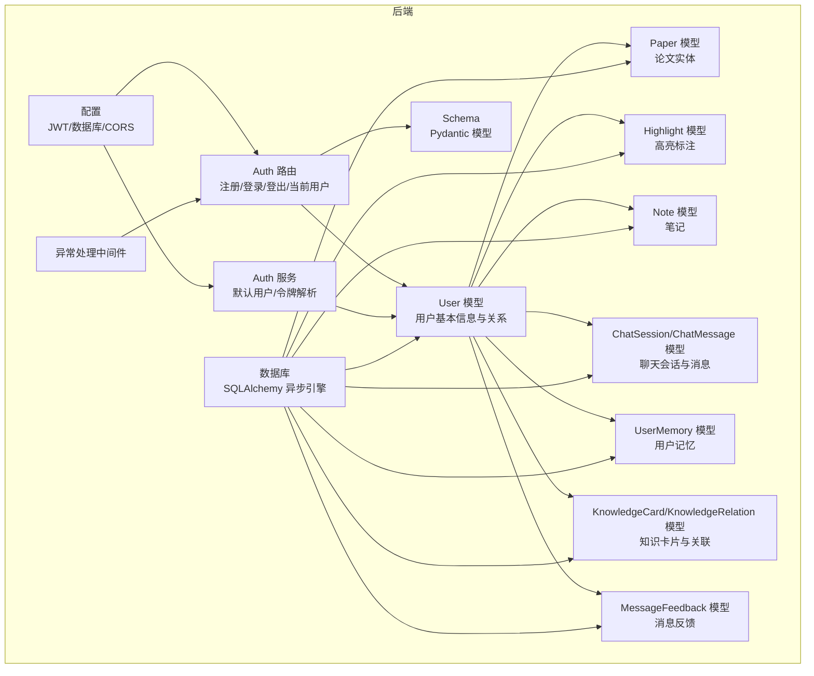
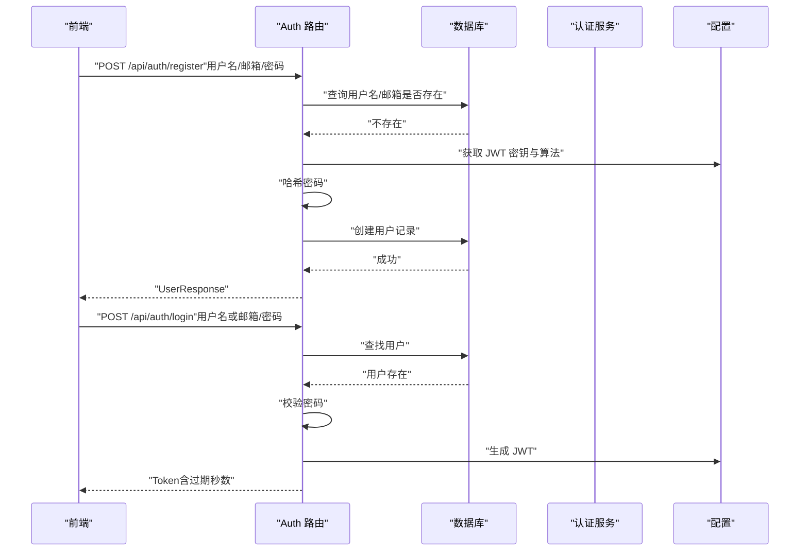
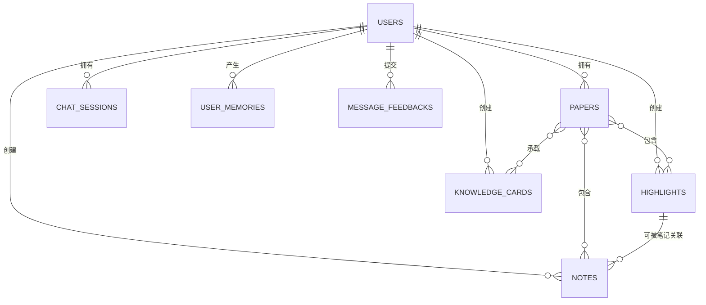
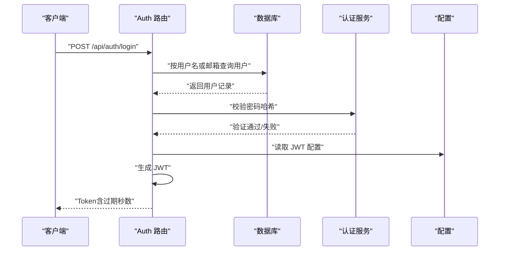
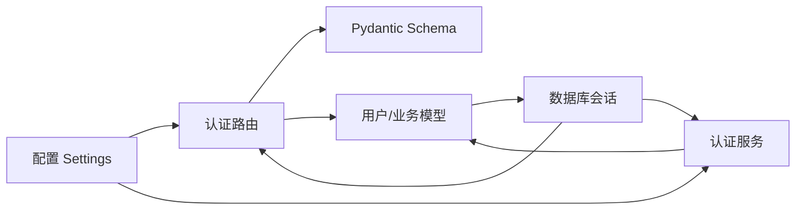

# User 用户模型

<cite>
**本文档引用的文件**
- [backend/app/models/user.py](file://backend/app/models/user.py)
- [backend/app/schemas/user.py](file://backend/app/schemas/user.py)
- [backend/app/routers/auth.py](file://backend/app/routers/auth.py)
- [backend/app/services/auth_service.py](file://backend/app/services/auth_service.py)
- [backend/app/models/paper.py](file://backend/app/models/paper.py)
- [backend/app/models/highlight.py](file://backend/app/models/highlight.py)
- [backend/app/models/note.py](file://backend/app/models/note.py)
- [backend/app/models/chat.py](file://backend/app/models/chat.py)
- [backend/app/models/memory.py](file://backend/app/models/memory.py)
- [backend/app/models/knowledge.py](file://backend/app/models/knowledge.py)
- [backend/app/models/feedback.py](file://backend/app/models/feedback.py)
- [backend/app/config.py](file://backend/app/config.py)
- [backend/app/database.py](file://backend/app/database.py)
- [backend/app/middleware/error_handler.py](file://backend/app/middleware/error_handler.py)
- [frontend/src/pages/AuthPage.jsx](file://frontend/src/pages/AuthPage.jsx)
- [frontend/src/stores/authStore.js](file://frontend/src/stores/authStore.js)
</cite>

## 目录
1. [简介](#简介)
2. [项目结构](#项目结构)
3. [核心组件](#核心组件)
4. [架构总览](#架构总览)
5. [详细组件分析](#详细组件分析)
6. [依赖关系分析](#依赖关系分析)
7. [性能考虑](#性能考虑)
8. [故障排除指南](#故障排除指南)
9. [结论](#结论)
10. [附录](#附录)

## 简介
本文件系统性梳理并解释用户模型的设计理念与实现细节，覆盖用户基本信息字段、认证凭据管理、权限控制机制、与论文、高亮、笔记等实体的关联关系、数据隔离与访问控制策略、注册/登录/会话管理流程、数据安全与隐私保护措施，以及在多用户环境下的扩展性与安全性设计。文档同时提供面向非技术读者的可读性说明，并通过图示帮助理解关键流程。

## 项目结构
用户模型位于后端 SQLAlchemy ORM 层，配合 Pydantic Schema、FastAPI 路由与服务层共同构成完整的认证与授权体系；前端采用 React + Zustand 管理用户状态，支持个人使用模式下的“无需登录”体验。

图表来源
- [backend/app/models/user.py:11-36](file://backend/app/models/user.py#L11-L36)
- [backend/app/models/paper.py:11-63](file://backend/app/models/paper.py#L11-L63)
- [backend/app/models/highlight.py:10-37](file://backend/app/models/highlight.py#L10-L37)
- [backend/app/models/note.py:11-34](file://backend/app/models/note.py#L11-L34)
- [backend/app/models/chat.py:14-71](file://backend/app/models/chat.py#L14-L71)
- [backend/app/models/memory.py:14-54](file://backend/app/models/memory.py#L14-L54)
- [backend/app/models/knowledge.py:14-80](file://backend/app/models/knowledge.py#L14-L80)
- [backend/app/models/feedback.py:14-48](file://backend/app/models/feedback.py#L14-L48)
- [backend/app/schemas/user.py:8-42](file://backend/app/schemas/user.py#L8-L42)
- [backend/app/routers/auth.py:18-186](file://backend/app/routers/auth.py#L18-L186)
- [backend/app/services/auth_service.py:13-40](file://backend/app/services/auth_service.py#L13-L40)
- [backend/app/database.py:13-81](file://backend/app/database.py#L13-L81)
- [backend/app/config.py:28-31](file://backend/app/config.py#L28-L31)
- [backend/app/middleware/error_handler.py:73-92](file://backend/app/middleware/error_handler.py#L73-L92)

章节来源
- [backend/app/models/user.py:11-36](file://backend/app/models/user.py#L11-L36)
- [backend/app/routers/auth.py:18-186](file://backend/app/routers/auth.py#L18-L186)
- [backend/app/database.py:13-81](file://backend/app/database.py#L13-L81)

## 核心组件
- 用户模型 User：定义用户基本信息、认证凭据字段、激活状态与时间戳，并声明与论文、高亮、笔记、聊天会话、用户记忆、消息反馈、知识卡片等实体的关系。
- 认证路由 Auth Router：提供注册、登录、登出、获取当前用户信息等接口，使用 JWT 进行会话管理。
- 认证服务 Auth Service：负责获取默认用户（个人使用模式），并在需要时解析当前用户。
- Pydantic Schema：定义用户创建、登录、响应与 JWT Token 的数据结构。
- 数据库与配置：异步 SQLAlchemy 引擎、依赖注入会话、JWT 配置、CORS 与上传限制等。

章节来源
- [backend/app/models/user.py:11-36](file://backend/app/models/user.py#L11-L36)
- [backend/app/routers/auth.py:27-186](file://backend/app/routers/auth.py#L27-L186)
- [backend/app/services/auth_service.py:13-40](file://backend/app/services/auth_service.py#L13-L40)
- [backend/app/schemas/user.py:8-42](file://backend/app/schemas/user.py#L8-L42)
- [backend/app/config.py:28-31](file://backend/app/config.py#L28-L31)

## 架构总览
用户模型贯穿数据层、服务层与接口层，形成“模型-路由-服务-Schema-配置”的完整闭环。JWT 用于无状态会话管理，数据库层通过外键约束保障数据隔离与级联删除。

图表来源
- [backend/app/routers/auth.py:27-118](file://backend/app/routers/auth.py#L27-L118)
- [backend/app/config.py:28-31](file://backend/app/config.py#L28-L31)
- [backend/app/database.py:30-48](file://backend/app/database.py#L30-L48)

## 详细组件分析

### 用户模型 User 设计与字段说明
- 基本信息字段：自增主键 id、唯一索引的用户名与邮箱、哈希后的密码字段、头像 URL、激活状态、创建与更新时间戳。
- 关系映射：与论文、高亮、笔记、聊天会话、用户记忆、消息反馈、知识卡片建立一对多关系；部分关系启用“级联删除或孤儿删除”，确保数据一致性。
- 字段设计要点：
  - 哈希密码字段避免明文存储，提升安全性。
  - 头像字段允许为空，便于匿名或未完善资料场景。
  - 激活状态字段可用于账户封禁或审核策略。
  - 时间戳字段便于审计与排序。

章节来源
- [backend/app/models/user.py:11-36](file://backend/app/models/user.py#L11-L36)

### 认证凭据管理与权限控制
- 凭证存储：仅保存密码哈希值，不存储明文密码。
- 登录方式：支持用户名或邮箱登录，增强可用性。
- 会话管理：使用 JWT 令牌进行无状态认证；令牌包含用户标识，过期时间由配置控制。
- 权限控制：
  - 路由层通过依赖注入获取当前用户，未认证请求无法访问受保护接口。
  - 个人使用模式下，系统自动创建默认用户，前端始终视为已登录。
  - 数据隔离：所有业务实体均通过 user_id 外键与用户绑定，查询时默认按用户维度过滤。

章节来源
- [backend/app/routers/auth.py:71-144](file://backend/app/routers/auth.py#L71-L144)
- [backend/app/services/auth_service.py:13-40](file://backend/app/services/auth_service.py#L13-L40)
- [backend/app/config.py:28-31](file://backend/app/config.py#L28-L31)

### 用户与论文、高亮、笔记等实体的关联关系
- 论文 Paper：用户与论文为一对多关系，论文中包含 user_id 外键；论文与其子实体（文本块、高亮、笔记、知识卡片）也通过外键关联，形成完整的阅读与学习闭环。
- 高亮 Highlight：高亮标注与用户、论文建立多对一关系，支持为特定页面与文本区域添加颜色与类型标记。
- 笔记 Note：笔记与用户、论文建立多对一关系，可选择关联某个高亮，形成“高亮-笔记”的关联结构。
- 聊天会话 ChatSession：会话与用户建立多对一关系，支持单论文与跨文档两种模式；消息与会话、反馈与消息、用户建立多对一关系。
- 用户记忆 UserMemory：用户与记忆为一对多关系，记忆内容可向量化存储，用于个性化与偏好建模。
- 知识卡片 KnowledgeCard：用户与知识卡片为一对多关系，卡片可关联论文与标签，支持知识之间的关系建模。
- 消息反馈 MessageFeedback：用户与消息反馈为一对多关系，用于收集对话质量反馈。

图表来源
- [backend/app/models/user.py:25-32](file://backend/app/models/user.py#L25-L32)
- [backend/app/models/paper.py:38-59](file://backend/app/models/paper.py#L38-L59)
- [backend/app/models/highlight.py:26-33](file://backend/app/models/highlight.py#L26-L33)
- [backend/app/models/note.py:27-30](file://backend/app/models/note.py#L27-L30)
- [backend/app/models/chat.py:27-35](file://backend/app/models/chat.py#L27-L35)
- [backend/app/models/memory.py:37-37](file://backend/app/models/memory.py#L37-L37)
- [backend/app/models/knowledge.py:33-47](file://backend/app/models/knowledge.py#L33-L47)
- [backend/app/models/feedback.py:31-33](file://backend/app/models/feedback.py#L31-L33)

章节来源
- [backend/app/models/user.py:25-32](file://backend/app/models/user.py#L25-L32)
- [backend/app/models/paper.py:38-59](file://backend/app/models/paper.py#L38-L59)
- [backend/app/models/highlight.py:26-33](file://backend/app/models/highlight.py#L26-L33)
- [backend/app/models/note.py:27-30](file://backend/app/models/note.py#L27-L30)
- [backend/app/models/chat.py:27-35](file://backend/app/models/chat.py#L27-L35)
- [backend/app/models/memory.py:37-37](file://backend/app/models/memory.py#L37-L37)
- [backend/app/models/knowledge.py:33-47](file://backend/app/models/knowledge.py#L33-L47)
- [backend/app/models/feedback.py:31-33](file://backend/app/models/feedback.py#L31-L33)

### 用户注册、登录验证与会话管理实现细节
- 注册流程：
  - 校验用户名与邮箱唯一性，防止重复注册。
  - 使用认证服务对密码进行哈希处理，再写入数据库。
  - 返回用户信息（不含敏感字段）。
- 登录流程：
  - 支持用户名或邮箱登录，校验用户存在与密码正确性。
  - 检查用户激活状态，禁用用户不可登录。
  - 生成 JWT 令牌并返回，包含过期秒数。
- 会话管理：
  - 令牌为无状态，服务端不存储会话；登出即客户端删除令牌。
  - 如需黑名单，需引入额外存储机制（代码中已注明）。

图表来源
- [backend/app/routers/auth.py:71-118](file://backend/app/routers/auth.py#L71-L118)
- [backend/app/config.py:28-31](file://backend/app/config.py#L28-L31)

章节来源
- [backend/app/routers/auth.py:27-118](file://backend/app/routers/auth.py#L27-L118)
- [backend/app/services/auth_service.py:13-40](file://backend/app/services/auth_service.py#L13-L40)

### 用户数据安全保护、密码加密策略与隐私保护机制
- 密码加密策略：
  - 仅存储密码哈希，不保存明文密码。
  - 登录时使用认证服务比对哈希，避免明文泄露风险。
- 数据隔离与访问控制：
  - 所有业务实体均通过 user_id 外键与用户绑定，查询时默认按用户维度过滤。
  - 路由层通过依赖注入获取当前用户，未认证请求无法访问受保护接口。
- 隐私保护：
  - 用户头像为可选字段，支持匿名场景。
  - 令牌为无状态，不存储会话上下文，降低会话劫持风险。
  - 异常处理中间件统一返回标准化错误信息，避免泄露内部细节。

章节来源
- [backend/app/models/user.py:19-21](file://backend/app/models/user.py#L19-L21)
- [backend/app/routers/auth.py:94-107](file://backend/app/routers/auth.py#L94-L107)
- [backend/app/middleware/error_handler.py:11-70](file://backend/app/middleware/error_handler.py#L11-L70)

### 多用户环境下的扩展性与安全性设计
- 扩展性：
  - 异步 SQLAlchemy 引擎与依赖注入会话，支持高并发与可测试性。
  - JWT 无状态特性简化水平扩展与负载均衡部署。
  - 外键与级联删除策略保证数据一致性与清理效率。
- 安全性：
  - 默认用户机制满足个人使用场景，无需登录即可使用。
  - 令牌过期时间可配置，降低长期暴露风险。
  - 统一异常处理与错误响应，避免敏感信息泄露。

章节来源
- [backend/app/database.py:13-48](file://backend/app/database.py#L13-L48)
- [backend/app/config.py:28-31](file://backend/app/config.py#L28-L31)
- [backend/app/services/auth_service.py:13-40](file://backend/app/services/auth_service.py#L13-L40)

## 依赖关系分析
用户模型与各业务实体之间通过外键建立强关联，确保数据一致性；路由层依赖服务层解析当前用户，服务层依赖数据库会话；配置模块集中管理 JWT 与数据库连接参数。

图表来源
- [backend/app/config.py:28-31](file://backend/app/config.py#L28-L31)
- [backend/app/routers/auth.py:13-16](file://backend/app/routers/auth.py#L13-L16)
- [backend/app/services/auth_service.py:9-10](file://backend/app/services/auth_service.py#L9-L10)
- [backend/app/database.py:30-48](file://backend/app/database.py#L30-L48)

章节来源
- [backend/app/config.py:28-31](file://backend/app/config.py#L28-L31)
- [backend/app/routers/auth.py:13-16](file://backend/app/routers/auth.py#L13-L16)
- [backend/app/services/auth_service.py:9-10](file://backend/app/services/auth_service.py#L9-L10)
- [backend/app/database.py:30-48](file://backend/app/database.py#L30-L48)

## 性能考虑
- 索引优化：用户表的用户名与邮箱字段建立唯一索引，提高查询与去重效率。
- 外键与级联：合理使用外键与“级联删除或孤儿删除”，减少孤立数据并提升删除性能。
- 异步数据库：使用异步引擎与会话，提升高并发场景下的吞吐量。
- 令牌无状态：JWT 无状态特性降低服务端会话存储开销，利于横向扩展。

章节来源
- [backend/app/models/user.py:17-23](file://backend/app/models/user.py#L17-L23)
- [backend/app/models/paper.py:17-36](file://backend/app/models/paper.py#L17-L36)
- [backend/app/database.py:13-27](file://backend/app/database.py#L13-L27)

## 故障排除指南
- 注册失败（用户名/邮箱已存在）：检查前端表单与后端唯一性校验逻辑，确认字段唯一索引生效。
- 登录失败（用户名或密码错误）：确认用户名/邮箱输入正确，密码哈希验证通过，用户处于激活状态。
- 令牌无效或过期：检查 JWT 配置与前端本地存储，确认令牌未被篡改且未超时。
- 数据库异常：查看异常处理中间件返回的标准化错误，定位具体 SQL 问题。
- 个人使用模式异常：确认默认用户已创建，数据库初始化流程正常执行。

章节来源
- [backend/app/routers/auth.py:40-54](file://backend/app/routers/auth.py#L40-L54)
- [backend/app/routers/auth.py:94-107](file://backend/app/routers/auth.py#L94-L107)
- [backend/app/middleware/error_handler.py:43-55](file://backend/app/middleware/error_handler.py#L43-L55)
- [backend/app/database.py:50-73](file://backend/app/database.py#L50-L73)

## 结论
用户模型通过清晰的字段设计、严格的认证与权限控制、完善的实体关联与数据隔离策略，构建了安全、可扩展且易维护的多用户基础能力。结合 JWT 无状态会话、异步数据库与统一异常处理，系统在个人使用与多用户场景下均具备良好的可用性与安全性。

## 附录
- 前端认证页面与状态管理：前端提供登录/注册页面与默认用户状态，个人使用模式下始终视为已登录，简化用户体验。
- 配置项参考：JWT 密钥、算法与过期时间、数据库 URL、CORS 允许域、上传目录与大小限制等。

章节来源
- [frontend/src/pages/AuthPage.jsx:67-97](file://frontend/src/pages/AuthPage.jsx#L67-L97)
- [frontend/src/stores/authStore.js:3-20](file://frontend/src/stores/authStore.js#L3-L20)
- [backend/app/config.py:18-39](file://backend/app/config.py#L18-L39)